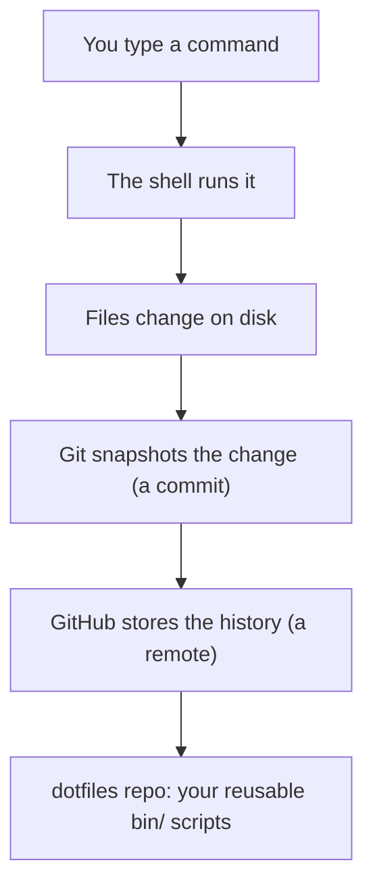
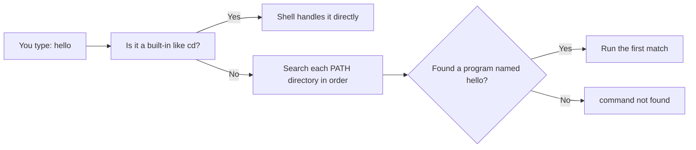
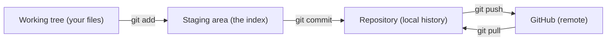

# Month 01 — Command Line & Git: How Computers Actually Work

**Phase: Foundations — the bedrock everything else stands on.**

## Overview

You are going to spend twelve months learning to build AI agents that run on their own, talk to APIs, edit files, and execute commands. Before any of that is possible, you need to understand the thing those agents actually operate inside: a computer, controlled by text, tracked by version control. This month is the bedrock. Skip it or skim it and every later month gets shakier.

The central idea is simple and unforgiving: **an AI agent is mostly a loop that runs shell commands and edits files.** When you eventually hand a model the ability to run `git commit` or `rm` or `curl`, you are handing it the exact same keyboard you use. If you don't know what those commands do, you cannot supervise the agent, you cannot tell when it has gone wrong, and you cannot fix it when it does. You can only orchestrate a system you understand. So this is the month you learn the system by hand.

Because of that, Month 1 has a special rule that no other month has: **AI coding assistance is restricted to near-zero.** No Copilot autocomplete, no "write me a bash script" prompts, no pasting commands you don't understand. You type every command, every commit message, and every line of every script yourself. This will feel slow. That slowness is the point — it is the difference between knowing the terrain and being a passenger. By the end of the month you will have built muscle memory that pays off for the next eleven months.

By the end you will have a real, useful artifact: a personal `dotfiles` repository on GitHub containing a `bin/` directory of small shell scripts that automate your own daily friction, committed in a clean linear history of atomic commits. This is your first reusable engineering asset, and you will keep extending it all year.

Here is the central mental model of the whole month — three layers stacked on each other, each built by hand before the next:

*Notice: every layer is just text controlling the layer below it. An agent will later sit at the top, typing commands you taught yourself this month.*

## Prerequisites

This is the first month of the curriculum, so the only true prerequisite is a Mac (Apple Silicon or Intel) running a recent macOS, an internet connection, and the willingness to type things you don't fully understand yet and then figure them out. You do not need any prior programming experience. You do not need to have used a terminal before. You should be comfortable installing software and creating a free online account (you'll make a GitHub account this month).

## Warm-Up: Retrieve Before You Begin

This is the first month, so there's no earlier material to recall. Instead, answer these from memory about the computer use you *already* do every day — it activates the everyday knowledge this month rebuilds on firmer ground.

1. When you double-click a folder in Finder to open it, then open a folder inside that — what kind of structure are you moving through? What's "above" your Documents folder?
2. You've almost certainly deleted a file by dragging it to the Trash. Where does it go, and how would you get it back?
3. When you save a Word document, then keep editing and save again, what happened to the older version — can you get it back?
4. Think of a repetitive thing you do on your Mac (renaming twenty files, resizing photos). How many clicks does it take, and could you imagine writing down the exact steps so someone else could repeat them?

Check your recall

1. A tree of nested folders. "Above" Documents is your home folder, and above that the disk's root. You navigate this same tree from the command line this month.
2. It goes to the Trash, recoverable until you empty it. Hold this thought: the command line's `rm` has **no Trash** — deletion is immediate and permanent.
3. The old version is overwritten and gone (unless you used Versions/Time Machine). Git, which you learn this month, fixes exactly this: it keeps every saved version forever.
4. Clicking is not repeatable or recordable. Writing the steps down as text *is* — that text is a shell script, and that is the whole reason the command line exists.

## Learning Objectives

By the end of this month you can:

1. **Navigate** the macOS filesystem entirely from the command line (`pwd`, `cd`, `ls`, absolute vs. relative paths) without touching Finder.
2. **Manipulate** files and directories from the shell (`mkdir`, `cp`, `mv`, `rm`, `touch`, `cat`) and explain what each does and what is irreversible.
3. **Compose** commands using pipes (`|`) and redirection (`>`, `>>`, `<`), and inspect running processes (`ps`, `top`, `kill`).
4. **Reason about** Unix permissions and ownership, and change them safely with `chmod` and `chown`.
5. **Explain** the difference between a shell variable and an environment variable, and modify your `PATH`.
6. **Write and debug** small shell scripts with shebangs, arguments, conditionals, and loops, and make them executable.
7. **Edit** files in the terminal with `nano` and survive a `vim` session (open, edit, save, quit) on a remote machine.
8. **Use** Git fluently for a solo workflow: `init`, `add`, `commit`, `branch`, `merge`, `log`, `diff`, `stash`, and read a commit graph.
9. **Operate** a GitHub workflow: create a repo, open issues and pull requests, write disciplined READMEs, and drive it from the `gh` CLI.

## Tech Stack (free, macOS)

Everything below is free and runs on both Apple Silicon and Intel Macs.

| Tool | Install | Why |
|---|---|---|
| Homebrew | `/bin/bash -c "$(curl -fsSL https://raw.githubusercontent.com/Homebrew/install/HEAD/install.sh)"` | The macOS package manager; how you'll install everything else. |
| zsh | Built in (default shell since macOS Catalina) | Your interactive shell. We'll configure `~/.zshrc`. |
| Terminal.app | Built in | No install needed to start. iTerm2 is optional. |
| iTerm2 (optional) | `brew install --cask iterm2` | Nicer terminal: split panes, search, better defaults. |
| Git | `brew install git` | Version control. (macOS ships an older Git via Xcode tools; Homebrew's is current.) |
| GitHub CLI | `brew install gh` | Drive GitHub — repos, issues, PRs, auth — from the terminal. |
| nano | Built in | The beginner-friendly terminal editor; what you'll learn first. |
| vim | Built in | The editor that's on every server; you'll learn enough to survive. |
| VS Code (optional) | `brew install --cask visual-studio-code` | A graphical editor for reading code; its Vim extension is good practice. |

You do **not** need any LLM access this month — that is deliberate. The AI tools come online in later months. A free GitHub account is the only online account you'll create.

## Weekly Breakdown

Calibrate to roughly 8–12 hours per week: about half reading and following along, half doing the labs and the milestone project.

### Week 1 — The Filesystem and the Shell

**Warm-start (low-stakes orientation, ~10 min).** Before any commands, open Finder and click your way from your home folder down into Documents, then back up to the disk root. Sketch that path on paper as a tree. This is the exact same structure you'll navigate by keyboard all week — you're just relabeling something you already know. (Later months will replace this with re-running the prior month's tool; for now, orienting your map is the warm-start.)

Focus: stop being afraid of the black window. Install Homebrew, Git, and `gh`. Learn what a shell is, how the filesystem is laid out (`/`, `~`, `/usr`, `/etc`, `/tmp`), and navigate it fluently. Practice `pwd`, `cd`, `ls -la`, `mkdir`, `touch`, `cp`, `mv`, `rm`, `cat`, `less`, and `man`. Understand absolute vs. relative paths and the meaning of `.`, `..`, `~`, and `/`.

Readings: the macOS / zsh sections of *The Missing Semester* (MIT) lecture 1. Do **Lab 1**.

Built this week: a clean home-directory layout (`~/dev`, `~/dev/sandbox`) you'll use all year.

### Week 2 — Composition, Processes, Permissions, and the Environment

Focus: the ideas that make the shell powerful. Pipes and redirection (`|`, `>`, `>>`, `<`), filtering with `grep`, `head`, `tail`, `wc`, `sort`, `uniq`. Processes: `ps aux`, `top`, foreground/background (`&`, `Ctrl-Z`, `fg`, `bg`), and `kill`. Permissions and ownership: reading `ls -l`, `chmod`, `chown`. Variables: shell vs. environment (`export`), `echo $PATH`, and editing `~/.zshrc`.

Readings: *Missing Semester* lectures on shell tools and data wrangling. Do **Lab 2** (shell scripting; you start building `bin/` scripts here).

Built this week: your first three or four `bin/` scripts.

### Week 3 — Git and GitHub

Focus: version control as a mental model, not a set of incantations. What a commit *is* (a snapshot plus a parent pointer), the three areas (working tree, staging/index, repository), branching and merging, reading `git log --graph`, recovering with `git stash` and `git restore`. Then GitHub: remotes, `push`/`pull`, SSH keys, issues, pull requests, and the `gh` CLI. Markdown for READMEs.

Readings: Pro Git chapters 1–3 (free online). Do **Lab 3** (create the `dotfiles` repo, branch, PR, atomic commits).

Built this week: the `dotfiles` repo on GitHub with your scripts under version control.

### Week 4 — Terminal Editing and the Milestone

Focus: editing files where there is no GUI — first `nano`, then enough `vim` to open, edit, save, and quit without panicking, because every remote server has `vim` and not your favorite editor. Then assemble everything into the **Daily Driver** milestone: round out `bin/` to 8+ scripts, document them in the README, and verify the clone-on-a-fresh-machine experience.

Readings: `vimtutor` (ships with vim — run it). Do **Lab 4** (vim survival), then the milestone.

Built this week: the finished Daily Driver `dotfiles` repo with 25+ atomic commits.

## Core Concepts

### Why the command line at all

Graphical interfaces are discoverable but not composable. You can click a button, but you cannot easily click a button a thousand times, or pipe the output of one button into another, or write down exactly what you clicked so a machine can repeat it tomorrow at 3 a.m. The command line is the opposite: every action is text, text can be saved and replayed, and the output of one program can become the input of another. That composability is the entire foundation of automation — and an agent is just automation that decides what to do next. When you teach a model to "use a computer," you are teaching it to use this text interface. Learning it yourself is non-negotiable.

### What a shell is

When you open Terminal, a program called a **shell** starts. On macOS the default shell is **zsh**. The shell's job is to read the line you type, figure out what program you mean, run it with the arguments you gave, and show you the output. That's it. Commands like `ls` and `git` are just programs the shell finds and runs; "built-ins" like `cd` are handled by the shell itself. Understanding this demystifies almost everything: there is no magic, just programs and the shell that launches them.

> **Common misconception.** The terminal is a separate "language" or app, and commands like `ls` are special keywords the terminal understands.
> **Reality.** `ls`, `git`, and `python` are ordinary programs sitting in directories on disk. The shell just finds the program whose name you typed and runs it. The tempting wrong belief comes from never seeing the program file — but you will: `which ls` prints exactly where it lives.

### The filesystem as a tree

The macOS filesystem is one big tree with a single root, `/`. Everything hangs off it: `/usr` (system programs), `/etc` (system configuration), `/tmp` (scratch space cleared on reboot), and `/Users/yourname`, which is your **home directory**, abbreviated `~`. A **path** is an address in this tree. An **absolute** path starts at the root (`/Users/yourusername/dev`); a **relative** path starts from wherever you currently are (`dev/sandbox`). Two special names matter constantly: `.` means "here" and `..` means "one level up." `pwd` ("print working directory") tells you where you are; `cd` ("change directory") moves you. Most confusion for beginners comes from not knowing where they are — so when in doubt, `pwd`.

### Pipes and redirection: the superpower

Every Unix program reads from **standard input** and writes to **standard output** (and errors to **standard error**). Redirection rewires these. `command > file` sends output into a file, overwriting it. `command >> file` appends instead. `command < file` feeds a file in as input. The pipe `|` connects one program's output directly to the next program's input. This is why `cat access.log | grep ERROR | wc -l` reads as a sentence: print the log, keep only the error lines, count them. You are building a tiny one-off program out of small reusable parts. This composition habit is exactly how you'll think about agent tools later.

### Processes

A running program is a **process** with a numeric ID (PID). `ps aux` lists processes; `top` shows them live. A `&` at the end of a command runs it in the background; `Ctrl-Z` suspends the foreground program, `bg` resumes it in the background, `fg` brings it back. `kill <PID>` asks a process to stop; `kill -9 <PID>` forces it. You'll care about this a lot in the "always-on" month, when your agent is the long-running process you need to start, watch, and stop.

### Permissions and ownership

Run `ls -l` and you'll see strings like `-rwxr-xr-x`. The first character is the type (`-` file, `d` directory). The next nine are three groups of read/write/execute permissions for the **owner**, the **group**, and **everyone else**. `chmod` changes those permissions; the one you'll use most this month is `chmod +x script.sh`, which marks a file as executable so you can run it directly. `chown` changes who owns a file. The *why* here is security: permissions are the first line of defense that stops a program (or a misbehaving agent) from touching files it shouldn't. When a later month sandboxes an agent, this is the mechanism doing the work.

### Shell variables vs. environment variables, and PATH

A **shell variable** exists only in your current shell: `name="Ada"; echo $name`. An **environment variable** is exported so that programs the shell launches can also see it: `export EDITOR=nano`. The most important environment variable is **`PATH`** — a colon-separated list of directories the shell searches, in order, to find the program you typed. Run `echo $PATH` to see it. When you put your own scripts in `~/dev/dotfiles/bin` and add that directory to `PATH`, you can run your scripts by name from anywhere — which is the whole point of the milestone. These exports live in `~/.zshrc`, the file zsh reads every time it starts an interactive shell.

This is how the shell turns a word you typed into a running program:

*Notice: PATH is searched in order and stops at the first match — which is exactly why putting your bin/ at the front of PATH lets your own scripts win.*

### Git: snapshots and pointers, not magic

> **Heavy concept ahead.** Slow down here; this is the load-bearing idea of the month. Everything about Git becomes easy once the snapshot-and-pointer model clicks, and stays baffling until it does.

A **commit** is a snapshot of your tracked files at a moment in time, plus a pointer to the commit that came before it. That's the whole data model. Git tracks changes through three areas: the **working tree** (your actual files), the **staging area / index** (what you've marked with `git add` to go into the next commit), and the **repository** (the committed history). `git status` shows you the state of all three; reading it constantly is the habit that makes Git click. A **branch** is just a movable label pointing at a commit, which is why branching and merging are cheap. `git log --graph --oneline` draws the commit graph so you can *see* the snapshots-and-pointers model. When something goes wrong, `git stash` parks your changes and `git restore` / `git reset` walk you back — nothing is lost as long as it was committed.

*Notice: a change has to be staged before it can be committed, and committed before it can be pushed — three deliberate gates, not one "save" button.*

> **Common misconception.** `git commit` saves my work to GitHub, the way "Save" uploads to the cloud.
> **Reality.** `commit` only records a snapshot in your **local** repository; it never touches the internet. Getting it to GitHub is a separate step, `git push`. The confusion is natural because most apps blur "save" and "sync" into one button — Git keeps them apart on purpose so you control exactly what becomes public and when.

### Atomic commits and clean history

A good commit is **atomic**: it does one thing and its message says what and why. "Add clone-and-cd helper script" is atomic; "stuff" or "fixes" is not. A clean **linear** history (each commit following the last, no tangled merges for solo work) is something a human — or an agent — can read and reason about. The milestone's 25+ atomic-commit target is training for a habit you'll keep forever: every later month assumes you can produce legible history.

### Markdown: the engineer's writing format

READMEs, issues, pull requests, and most documentation are written in **Markdown** — plain text with light markup (`#` headings, `-` lists, `` `code` `` spans, fenced code blocks). It renders nicely on GitHub and stays readable as raw text. You're reading Markdown right now. Documenting your scripts in the milestone README is not busywork: an undocumented tool is one you'll forget how to use, and one nobody else (including a future agent) can use either.

## Labs

| Lab | Title | Time | Difficulty |
|---|---|---|---|
| [Lab 1](lab-1-terminal-and-filesystem-navigation.md) | Terminal & Filesystem Navigation | ~2–3 hrs | Intro |
| [Lab 2](lab-2-shell-scripting-build-the-bin-directory.md) | Shell Scripting — Build the `bin/` Scripts | ~3–4 hrs | Core |
| [Lab 3](lab-3-git-and-github-workflow.md) | Git & GitHub Workflow — The `dotfiles` Repo | ~3–4 hrs | Core |
| [Lab 4](lab-4-vim-survival.md) | Vim Survival | ~1–2 hrs | Intro |

Do the labs in order. Lab 2 produces scripts that Lab 3 puts under version control, and Lab 4's editing skills make the milestone smoother.

## Checkpoints & Self-Assessment

Run these to confirm you're on track. You should be able to answer or execute each without looking anything up by the end of the relevant week.

- **Week 1:** From your home directory, create `~/dev/sandbox/test`, `cd` into it, confirm with `pwd`, then return home with a single `cd`. Explain out loud the difference between `rm file` and `rm -rf dir`.
- **Week 2:** Predict the output of `echo "a\nb\nc" | grep b | wc -l` before running it. Add a directory to your `PATH` in `~/.zshrc`, open a new terminal, and confirm with `echo $PATH`. Make a script executable with `chmod +x` and run it by name.
- **Week 3:** In a fresh repo, make three commits, create a branch, make a commit on it, and merge it back. Then run `git log --graph --oneline --all` and explain what each line means. Push the repo to GitHub with `gh repo create`.
- **Week 4:** Open a file in `vim`, type a line, save, and quit — without a cheat sheet. Then do the same in `nano`.

## Reflect

Spend ten minutes on these in your learning log (writing, not just thinking):

- **Explain it back:** In two or three sentences, explain what a commit *is* — the snapshot-and-pointer idea — as if teaching a friend who has only ever used "Save" in Word.
- **Connect:** How does putting your `bin/` directory on `PATH` change what "running a program" means, compared to double-clicking an app icon in the Finder the way you did before this month?
- **Monitor:** Which concept this month is still fuzzy — the three Git areas, what `PATH` does, the shell-vs-environment-variable line, or modal editing in vim? Name it precisely, and write the one question that would clear it up.

## Month-End Assessment

**Milestone project: "Daily Driver" — your personal `dotfiles` repo.**

Create a public GitHub repository named `dotfiles` containing a `bin/` directory with **at least 8 small shell scripts** that automate friction you actually hit. Suggested scripts (build the ones that fit your life; invent others):

- `mkproject` — scaffold a new project directory with a starter README and `git init`.
- `ccd` — clone a Git repo and `cd` into it in one step.
- `todo` — append a timestamped line to a running `~/todo.md` log.
- `note` — open (or create) a dated Markdown note in your notes directory.
- `gss` — a short, readable `git status` + recent log summary.
- `extract` — unpack any archive (`.zip`, `.tar.gz`, etc.) by detecting its type.
- `serve` — start a local web server in the current directory.
- `weather` — fetch and print a quick weather report with `curl`.

Requirements:

1. Every script begins with a shebang (`#!/usr/bin/env bash` or `#!/usr/bin/env zsh`), is executable (`chmod +x`), and handles being called with wrong/missing arguments gracefully (print a usage line and exit).
2. The `bin/` directory is added to `PATH` via your `~/.zshrc`, and your `~/.zshrc` is included in the repo (or symlinked from it) so the setup is reproducible.
3. Each script is committed **individually** with a meaningful, atomic message. Target **25+ commits** with a clean, mostly linear history.
4. The `README.md` documents **every** script: what it does and a usage example.
5. **Definition of done:** you can SSH (or just log in) to a fresh machine/account, `git clone` your `dotfiles`, run a documented setup step, and have your scripts working within a few minutes.

### Rubric

| Dimension | Passing | Excellent |
|---|---|---|
| Scripts | 8 working scripts with shebangs, executable bits, basic usage messages. | 10+ scripts, robust argument handling, `set -euo pipefail`, helpful errors, comments explaining the *why*. |
| Commit hygiene | 25+ commits, mostly atomic, readable messages. | Every commit atomic and well-described; clean linear history; at least one branch + merged PR demonstrated. |
| README | Every script documented with a usage example. | Polished README with install instructions, a table of scripts, and a "fresh machine" setup section that actually works. |
| Reproducibility | Clone + manual steps gets scripts working. | One documented command (or a `setup` script) wires up `PATH` and permissions on a fresh machine. |
| Understanding | Can explain what each script does. | Can explain every line, including why each guardrail exists. |

## Common Pitfalls

- **`rm -rf` with no undo.** There is no Trash on the command line. `rm` is permanent. Double-check the path before you press Enter, never run `rm -rf` with a variable you haven't verified, and never `sudo rm -rf /` (this can destroy your system). When in doubt, `ls` the target first.
- **Editing the wrong file because you don't know where you are.** Run `pwd` before destructive or stateful commands. Most "it didn't work" moments are really "I was in the wrong directory."
- **Forgetting `chmod +x`.** A script you can't execute gives `permission denied`. Marking it executable is a separate step from writing it.
- **Committing secrets.** Never commit passwords, API tokens, or SSH private keys. Add a `.gitignore` early. This habit matters enormously once agents and API keys arrive in later months.
- **Giant, vague commits.** "wip" and "stuff" are commit messages you will hate later. Commit one logical change at a time with a message that explains it.
- **Reaching for AI.** This is the month to *not* do that. If you autocomplete a script you don't understand, you've defeated the purpose. Type it, break it, fix it.
- **Panicking in vim.** If you're stuck in vim, press `Esc`, then type `:q!` and Enter to quit without saving. You can always get out.

## Knowledge Check

Answer from memory first, then check. This is the first month, so every question is this-month recall or predict-the-output — there are no spaced callbacks yet. **From Month 2 onward, this quiz will mix in questions marked ⟲ that call back to earlier months** to keep older skills alive; expect those to feel like a stretch when they arrive.

1. What does `pwd` tell you, and why is it the first command to run when something "didn't work"?
2. In one sentence each, what is the difference between `>` and `>>`?
3. Predict the output: `echo "a" > f.txt; echo "b" >> f.txt; cat f.txt`. (Two lines or one? Which letters?)
4. You typed `myscript` and got `command not found`, but the file exists in `~/dev/dotfiles/bin`. Name the two most likely causes.
5. What are the three areas a change moves through in Git, and which command moves it between each?
6. Predict the result: you run `git commit -m "done"` and then close your laptop with no internet. Is your work on GitHub? Why or why not?
7. Spot the risk: a script runs `rm -rf "$dir/"` where `$dir` was never set. What could happen, and which one line at the top of the script would have caught it?
8. What single key returns vim to Normal mode, and what do you type from there to quit without saving?
9. Why must `ccd` (clone-and-cd) be a shell function in `~/.zshrc` rather than a script in `bin/`?
10. What makes a commit "atomic," and why does a future reader (human or agent) care?

Answer key

1. It prints your current working directory. Most "it didn't work" moments are really "I was in the wrong directory," so `pwd` confirms where you actually are.
2. `>` overwrites the file with the new output; `>>` appends to the end of it.
3. Two lines: `a` then `b`. The first `>` creates/overwrites, the `>>` appends a second line.
4. (a) `~/dev/dotfiles/bin` isn't on your `PATH` (or you didn't `source ~/.zshrc`); (b) the file isn't executable — you forgot `chmod +x`.
5. Working tree → (`git add`) → staging area/index → (`git commit`) → repository. (And `git push` sends it to the remote.)
6. No. `git commit` only writes to your **local** repository. It reaches GitHub only after `git push`, which needs the network.
7. With `$dir` empty, the path becomes `/` and `rm -rf "/"` tries to delete from root — catastrophic. `set -euo pipefail` (the `-u`) makes the script abort on the unset variable instead.
8. `Esc` returns to Normal mode; from there type `:q!` and Enter to quit without saving.
9. A script runs in a child process and cannot change its parent shell's directory; a function runs in your current shell, so its `cd` sticks.
10. It does exactly one logical thing and says what and why in its message. Readers can understand, review, revert, or cherry-pick a single change without untangling unrelated edits.

## Further Reading

- *The Missing Semester of Your CS Education* (MIT) — missing.csail.mit.edu — the single best free crash course on the shell, scripting, and Git.
- *Pro Git* by Scott Chacon — git-scm.com/book — free, comprehensive, and the canonical Git reference; chapters 1–3 cover everything this month.
- GitHub Docs — docs.github.com — official, current guides for repos, issues, pull requests, and the `gh` CLI.
- `man` pages and `tldr` (`brew install tldr`) — built-in and quick references for any command; learn to read `man`, use `tldr` for fast examples.
- *Conquering the Command Line* and Apple's Terminal User Guide — solid free supplements for macOS-specific behavior.

## Author's Notes

A few deliberate tradeoffs. We standardize scripts on `#!/usr/bin/env bash` rather than zsh even though zsh is the interactive default, because bash is more portable across the servers learners will meet in later months; the README explains this and either shebang is accepted. We restrict AI assistance to near-zero this month against the grain of the rest of the curriculum — reviewed through the Agentic Systems lens, this is justified because you cannot supervise a loop you don't understand, and Month 1 is precisely where that understanding is built. We chose `nano`-before-`vim` to reduce early cognitive load even though many engineers live in vim; the goal here is survival, not mastery. Finally, the 25-commit target is a forcing function for atomic-commit discipline, not an arbitrary count — if a learner naturally produces fewer but every commit is clean, grade on hygiene over raw number.
