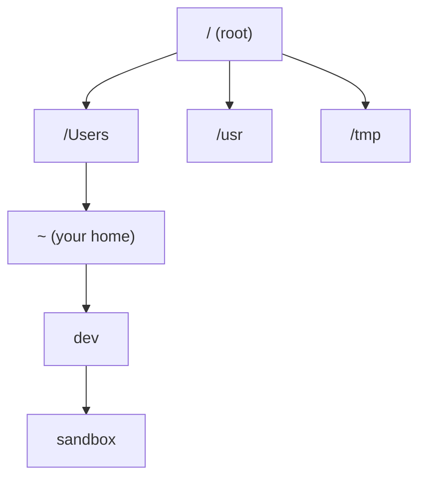

# Lab 1 — Terminal & Filesystem Navigation

**Time: ~2–3 hrs · Difficulty: Intro · Builds on: nothing (this is your starting point)**

## Objective

You'll open a terminal, install the tools you need for the whole month, and learn to move around the macOS filesystem entirely from the keyboard — creating, copying, moving, reading, and deleting files and directories. By the end you'll have a clean working layout under `~/dev` that you'll use all year, and you'll never again be confused about "where am I?" Remember the Month 1 rule: **type every command yourself.** No copy-pasting things you don't understand, no AI. If a command is unclear, run `man <command>` and read.

## Setup

You need a Mac and an internet connection. Open the built-in **Terminal**: press `Cmd-Space`, type `Terminal`, press Enter. You should see a window with a prompt ending in `%` (zsh's default).

Install Homebrew (the package manager), then Git and the GitHub CLI. Run these one at a time and read what each prints:

```zsh
/bin/bash -c "$(curl -fsSL https://raw.githubusercontent.com/Homebrew/install/HEAD/install.sh)"
```

Follow any "Next steps" Homebrew prints — on Apple Silicon it usually asks you to add a line to your shell profile so `brew` is on your `PATH`. Then:

```zsh
brew install git gh
```

**Checkpoint:** `brew --version`, `git --version`, and `gh --version` each print a version number.
**If not:** if `brew` is "command not found," re-read Homebrew's "Next steps" output and add the `eval "$(/opt/homebrew/bin/brew shellenv)"` line it gave you to `~/.zshrc`, then open a new terminal. See the Troubleshooting section.

## Background

**Recall first (from memory, before reading on):** from the README's central idea — what does the shell actually do with the line you type, and is there anything "magic" about a command like `ls`? (Answer: the shell finds the program you named and runs it; `ls` is just an ordinary program on disk, no magic.)

The terminal shows a **prompt** and waits for you to type a command. You type, press Enter, the shell runs it, you see output, and the prompt returns. Everything you do is one of these turns. The filesystem you're navigating is a single tree starting at `/` (the root). Your home directory is `/Users/<yourname>`, abbreviated `~`. Knowing where you are in that tree at all times is the core skill of this lab.

## Steps

### 1. Find out where you are

```zsh
pwd
```

This prints your **working directory** — where you currently are. Fresh terminals start in your home directory.

**Checkpoint:** you see something like `/Users/yourusername`.
**If not:** if you see an error rather than a path, you may have typed something extra — retype just `pwd` and press Enter on a clean prompt line (`Ctrl-U` clears the line).

### 2. Look around

```zsh
ls
ls -l
ls -la
```

`ls` lists files. `-l` is the "long" format (permissions, owner, size, date). `-a` includes hidden files (those starting with a `.`, like `.zshrc`). Notice `.` and `..` in the `-a` output — "here" and "the parent directory."

**Checkpoint:** `ls -la` shows hidden entries including `.` and `..`, and probably `.zshrc` or `.zprofile`.
**If not:** if you don't see `.`-prefixed entries, you likely ran `ls` or `ls -l` without the `-a` flag; add the `-a` and run again.

### 3. Read the manual

```zsh
man ls
```

Scroll with the arrow keys or space; press `q` to quit. Reading `man` pages is a skill — you'll do it all year.

**Checkpoint:** you opened the `ls` manual and quit back to the prompt with `q`.
**If not:** if the screen is frozen on the manual text, you're still inside the pager — press `q` (lowercase) to return to the prompt.

The next steps teach the lab's core new skill — moving around the filesystem tree by keyboard — in three stages: first you follow a fully worked path (I do), then you fill in a partly-blank one (we do), then you navigate on your own (you do). Here's the tree you'll be moving through:


*Notice: every location is a node on one tree. `cd` just moves you between nodes; `pwd` tells you which node you're standing on.*

### Stage 1 — Worked example (I do)

Run this exact sequence and watch each line. You are not inventing anything yet — just observe how `cd` and `mkdir` move you and build the tree above.

```zsh
cd ~
mkdir dev
mkdir dev/sandbox
cd dev/sandbox
pwd
```

`cd` changes directory; `mkdir` makes one. You moved home, created `~/dev` and `~/dev/sandbox`, and entered the sandbox.

**Checkpoint:** `pwd` prints `/Users/<yourname>/dev/sandbox`.
**If not:** if `mkdir` said "File exists," the directory was already there — that's fine, continue. If `cd` failed, you weren't in `~` when you ran it; run `cd ~` first, then retry the rest.

### Stage 2 — Faded practice (we do)

Now you supply the moves. From inside `sandbox`, predict the result of each line *before* you press Enter, then check yourself with `pwd`. The goal is stated; you choose `..`, a name, or an absolute path.

```zsh
cd ..        # TODO: predict — where are you now? (goal: go up to ~/dev)
pwd
cd sandbox   # TODO: predict — does this work from here? why?
pwd
cd /usr      # TODO: this is an absolute path — predict where you land
pwd
# TODO: now write the ONE command that returns you home from anywhere
pwd
```

`..` is relative (up one). `sandbox` is relative (down one, from where you are). `/usr` is absolute (starts at root). For the last blank, recall that `~` always means home — so `cd ~` (or just `cd`) works from anywhere.

**Checkpoint:** you ended at your home directory, and you can explain why `cd sandbox` worked from `~/dev` but would fail from `~`.
**If not:** if `cd sandbox` gave "No such file or directory," you ran it from the wrong node — it only works when `sandbox` is directly below you. Run `pwd` to see where you are, then `cd ~/dev` and try again.

### Stage 3 — Independent (you do)

No scaffolding now. Starting from your home directory, using only `cd`, `mkdir`, and `pwd`: create a directory `~/dev/scratch`, go into it, create a directory `deep` inside that, go into `deep`, confirm your location, then return all the way home with a single command. Work out each move yourself before running it.

**Checkpoint:** `pwd` reads `/Users/<yourname>/dev/scratch/deep` partway through, and one final command lands you back at `/Users/<yourname>`.
**If not:** if you got lost, run `pwd`, then `cd ~` to reset to a known node and restart the sequence. Getting un-lost with `pwd` + `cd ~` is itself the skill.

### 6. Create, view, copy, move, and delete files

```zsh
cd ~/dev/sandbox
touch notes.txt
echo "first line" > notes.txt
echo "second line" >> notes.txt
cat notes.txt
cp notes.txt notes-backup.txt
mv notes-backup.txt archive.txt
ls
```

`touch` creates an empty file. `>` writes (overwrites); `>>` appends. `cat` prints contents. `cp` copies; `mv` moves/renames.

**Checkpoint:** `cat notes.txt` shows two lines; `ls` shows `notes.txt` and `archive.txt`.
**If not:** if `notes.txt` shows only one line, you used `>` twice instead of `>>` for the second line — `>` overwrites. Redo the two `echo` lines, using `>>` for the second.

### 7. Delete carefully

```zsh
rm archive.txt
ls
```

`rm` deletes permanently — **there is no Trash here.** Never run `rm -rf` casually. To prove the danger to yourself safely, create and remove a throwaway directory:

```zsh
mkdir throwaway
rm -r throwaway
ls
```

**Checkpoint:** `archive.txt` and `throwaway` are gone. You understand `rm` is irreversible.
**If not:** if `rm` reported "is a directory," you tried to remove a directory without `-r`; use `rm -r <dir>` for directories (and never on a path you haven't verified with `ls` first).

### 8. Reading longer files

```zsh
ls -la /usr/bin | less
```

`less` is a pager for content too long for one screen. Scroll with arrows/space; quit with `q`. (You also just used a pipe `|` — more on that in Lab 2.)

**Checkpoint:** you scrolled a long listing and quit with `q`.
**If not:** if the prompt seems stuck, you're still in the `less` pager — press `q` to exit. If you saw an error instead of a listing, check the `|` pipe character is present between `ls -la /usr/bin` and `less`.

## Definition of Done

You're done when all of the following are true:

- `brew --version`, `git --version`, and `gh --version` all print versions.
- The directory `~/dev/sandbox` exists.
- You can run, from memory, a sequence that creates a file, appends to it, copies it, renames it, and deletes it.

Self-verify with this one-liner (it should print `OK`):

```zsh
test -d ~/dev/sandbox && command -v brew git gh >/dev/null && echo OK
```

**Self-explain:** in one sentence, why does `cd sandbox` succeed from `~/dev` but fail from `~`?

## Stretch Goals

1. Use `tree` (`brew install tree`) to visualize `~/dev` as a tree. Compare it to `ls -R`.
2. Explore the real filesystem read-only: `ls /`, `ls /etc`, `ls /tmp`. Don't change anything — just read and form a mental map.
3. Learn `pushd`/`popd` to bounce between two directories, and try tab-completion: type `cd ~/dev/sa` then press Tab.
4. Install `tldr` (`brew install tldr`) and compare `tldr tar` to `man tar`.

## Troubleshooting

- **`command not found: brew`** — Homebrew's bin directory isn't on your `PATH`. Run the `eval "$(/opt/homebrew/bin/brew shellenv)"` line Homebrew printed (it's `/usr/local/bin/brew` on Intel Macs), add it to `~/.zshrc`, and open a new terminal.
- **`No such file or directory` on `cd`** — you're not where you think. Run `pwd`, then `ls` to see what's actually around you. The path you gave is relative to your current location.
- **`Permission denied`** — you're trying to write somewhere you don't own (like `/usr`). Stay inside `~` for this lab; you don't need `sudo` for anything here.
- **Stuck in `man` or `less`** — press `q`.
- **Pasted a command and it half-ran** — that's exactly why we type things by hand this month. Clear the line with `Ctrl-U` and retype it.
