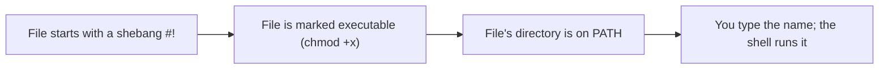

# Lab 2 — Shell Scripting: Build the `bin/` Scripts

**Time: ~3–4 hrs · Difficulty: Core · Builds on: Lab 1 (filesystem navigation)**

## Objective

You'll learn shell scripting by building the first scripts of your milestone `dotfiles` repo: small programs that automate friction you actually hit. You'll cover shebangs, the executable bit, arguments, conditionals, loops, pipes, and redirection — and you'll write defensive scripts that fail loudly instead of silently. By the end you'll have a `~/dev/dotfiles/bin` directory on your `PATH` with at least four working scripts you can run by name from anywhere. **Type every line yourself.** A script you pasted is a script you can't debug.

## Setup

You need Lab 1 finished (Homebrew, Git, `gh`, and `~/dev`). Create the project structure:

```zsh
cd ~/dev
mkdir -p dotfiles/bin
cd dotfiles
```

**Checkpoint:** `pwd` prints `/Users/<yourname>/dev/dotfiles` and `ls` shows a `bin` directory.
**If not:** if `ls` shows no `bin`, the `mkdir -p dotfiles/bin` ran from the wrong place; `cd ~/dev` first, then rerun it. If `pwd` shows a different path, `cd ~/dev/dotfiles`.

## Background

**Recall first (from memory, before reading on):** from Lab 1 — what does `pwd` print, and what is the difference between an absolute path like `/Users/you/dev` and a relative path like `dev/sandbox`? (You'll lean on both constantly while testing scripts; if either is fuzzy, replay Lab 1 step 5 first.)

A **shell script** is a text file of commands the shell runs top to bottom — exactly the commands you'd type by hand, saved so you can replay them. The first line, the **shebang** (`#!/usr/bin/env bash`), tells the system which interpreter to run. The file must be marked **executable** (`chmod +x`) before you can run it by name. Scripts can read **arguments** (`$1`, `$2`, … and `$@` for all of them), make decisions with `if`, and repeat with `for`/`while`. We standardize on `bash` for portability — it's on every server you'll meet later — even though your interactive shell is zsh.

Three things must line up for you to type a script's name and have it run:


*Notice: miss any one of the three and you get an error — no shebang means "bad interpreter," no `chmod +x` means "permission denied," not on PATH means "command not found." The error tells you which gate failed.*

## Steps

### 1. A first script and the executable bit

Create `bin/hello` with nano (you'll get more nano in Lab 4; for now: type, then `Ctrl-O` Enter to save, `Ctrl-X` to exit):

```zsh
nano bin/hello
```

Type exactly this:

```bash
#!/usr/bin/env bash
echo "Hello from your first script, $USER"
```

Save and exit. Now try to run it, then make it executable and run it again:

```zsh
./bin/hello
chmod +x bin/hello
./bin/hello
```

The first attempt fails with `permission denied`; after `chmod +x` it works.

**Checkpoint:** the second `./bin/hello` prints `Hello from your first script, <yourname>`.
**If not:** "permission denied" means the `chmod +x` didn't take — rerun `chmod +x bin/hello`. "bad interpreter" means the shebang line has a typo or a blank line above it; it must be the very first line, exactly `#!/usr/bin/env bash`.

### 2. Put `bin/` on your PATH

So you can type `hello` instead of `./bin/hello` from anywhere, add your `bin` to `PATH`. Open your shell config:

```zsh
nano ~/.zshrc
```

Add this line at the bottom (use your real path):

```bash
export PATH="$HOME/dev/dotfiles/bin:$PATH"
```

Save, exit, then reload and test:

```zsh
source ~/.zshrc
cd ~
hello
```

**Checkpoint:** typing just `hello` from your home directory prints the greeting. `echo $PATH` shows your `bin` directory at the front.
**If not:** "command not found" means PATH didn't pick up your `bin` — confirm you ran `source ~/.zshrc` (or opened a new terminal) and that the `export PATH=...` line uses your real path. Recall the PATH-resolution diagram in the README: the shell searches PATH directories in order and your `bin` must be among them.

The next three steps teach the lab's real new skill — writing a **defensive script** (one that checks its arguments and fails loudly) — as a worked → faded → independent progression.

### Stage 1 — Worked example (I do): Script 1, `mkproject` (arguments + conditionals)

Study and run this complete script. Every non-obvious line is explained below it; you are not inventing anything yet. Create `~/dev/dotfiles/bin/mkproject`:

```bash
#!/usr/bin/env bash
set -euo pipefail

if [ $# -lt 1 ]; then
  echo "usage: mkproject <name>" >&2
  exit 1
fi

name="$1"
mkdir -p "$HOME/dev/$name"
cd "$HOME/dev/$name"
echo "# $name" > README.md
git init -q
echo "created project at $HOME/dev/$name"
```

`set -euo pipefail` makes the script exit on errors, on undefined variables, and on failures inside pipes — defensive by default. `$#` is the argument count; `$1` is the first argument. `>&2` sends the usage message to standard error. Make it executable:

```zsh
chmod +x ~/dev/dotfiles/bin/mkproject
mkproject demo-app
ls ~/dev/demo-app
```

**Checkpoint:** `~/dev/demo-app` exists with a `README.md` and a `.git` directory. Running `mkproject` with no argument prints the usage line and exits.
**If not:** if it ran but created nothing, check you made it executable and that `set -euo pipefail` is spelled exactly. If `git init` errored, confirm `git --version` works from Lab 1.

### Stage 2 — Faded practice (we do): Script 2, `todo` (append + redirection + timestamps)

Now you fill in the mechanical parts. This is the same defensive pattern as `mkproject`, but the argument guard and the append line are left as TODOs. Use Script 1 as your reference. Create `bin/todo`:

```bash
#!/usr/bin/env bash
set -euo pipefail

log="$HOME/todo.md"

# TODO: if no arguments were given ($# is 0), print the existing log
#       (cat "$log" 2>/dev/null) or "(no todos yet)", then exit 0.
if [ ____ ]; then
  ____
  exit 0
fi

timestamp="$(date '+%Y-%m-%d %H:%M')"
# TODO: APPEND (not overwrite) a checkbox line to "$log".
#       Format: "- [ ] <all the args> ($timestamp)". Recall: which operator appends?
echo "- [ ] $* ($timestamp)" ____ "$log"
echo "added: $*"
```

`$*` joins all arguments into one string, so `todo buy milk` logs the whole phrase. The two blanks are exactly the argument-guard and append-vs-overwrite ideas from Lab 1. Once filled in, make it executable and test:

```zsh
chmod +x ~/dev/dotfiles/bin/todo
todo write lab 2 scripts
todo review pro git chapter 1
todo
```

For reference, the worked solution (only peek after attempting): the condition is `[ $# -eq 0 ]`, the body is `cat "$log" 2>/dev/null || echo "(no todos yet)"`, and the append operator is `>>`.

**Checkpoint:** `todo` with no args prints two timestamped lines; `~/todo.md` exists and grows each time you add one.
**If not:** if your second `todo` overwrote the first instead of adding to it, you used `>` rather than `>>` — fix the append operator. If `set -u` complained, you left a blank unfilled.

### Stage 3 — Independent (you do): Script 3, `extract` (a `case` statement)

No scaffolding now — only the goal and the pattern you've already practiced twice. Write `bin/extract` from scratch. It must:

- start with the shebang and `set -euo pipefail`;
- print `usage: extract <archive>` to standard error and exit non-zero if given no argument (the same guard you wrote for `todo`);
- exit with a clear error if the argument is not an existing file;
- unpack the archive based on its extension. Use a `case` statement (cleaner than a chain of `if`s) handling at least `*.tar.gz`/`*.tgz` (`tar -xzf`), `*.zip` (`unzip`), and a catch-all `*` that prints "don't know how to handle" and exits non-zero;
- print `extracted <file>` on success.

If you get stuck on `case` syntax, the worked reference is in step 6 below — but try it yourself first; that struggle is where the learning is. Test with:

```zsh
chmod +x ~/dev/dotfiles/bin/extract
cd ~/dev/sandbox
echo "hi" > sample.txt
zip sample.zip sample.txt
rm sample.txt
extract sample.zip
cat sample.txt
```

**Checkpoint:** `sample.txt` is recovered from the archive; `extract` on an unknown type prints a clear error and exits non-zero.
**If not:** if every file falls through to the catch-all, your `case` patterns are quoted wrong — patterns like `*.zip)` must be unquoted globs. Compare against the reference in step 6.

### 4. Script 3 — `ccd` (clone and cd, demonstrating a function caveat)

A real friction-killer: clone a repo and enter it. A plain script can't change *your* shell's directory (a script runs in a child process), so the idiomatic fix is a **shell function** in `~/.zshrc`. This teaches an important boundary. Add to `~/.zshrc`:

```bash
ccd() {
  if [ $# -lt 1 ]; then
    echo "usage: ccd <git-url>" >&2
    return 1
  fi
  git clone "$1" && cd "$(basename "$1" .git)"
}
```

Reload and test on any public repo:

```zsh
source ~/.zshrc
cd ~/dev/sandbox
ccd https://github.com/octocat/Hello-World.git
pwd
```

**Checkpoint:** after `ccd`, `pwd` shows you're *inside* the freshly cloned `Hello-World` directory. You can explain why this had to be a function, not a `bin/` script.
**If not:** if `ccd` "doesn't change directory," you wrote it as a `bin/` script — a script runs in a child process and can't move your shell. It must be a function in `~/.zshrc`. If `ccd` isn't found, you didn't `source ~/.zshrc`.

### 6. Reference — the worked `extract` (compare against your Stage 3 attempt)

This is the worked solution for the `extract` you wrote in Stage 3. Compare it to yours and adopt whatever is cleaner; the full `bin/extract` should read:

```bash
#!/usr/bin/env bash
set -euo pipefail

if [ $# -lt 1 ]; then
  echo "usage: extract <archive>" >&2
  exit 1
fi

file="$1"
if [ ! -f "$file" ]; then
  echo "extract: '$file' is not a file" >&2
  exit 1
fi

case "$file" in
  *.tar.gz|*.tgz) tar -xzf "$file" ;;
  *.tar.bz2)      tar -xjf "$file" ;;
  *.tar)          tar -xf "$file" ;;
  *.zip)          unzip "$file" ;;
  *.gz)           gunzip "$file" ;;
  *)              echo "extract: don't know how to handle '$file'" >&2; exit 1 ;;
esac

echo "extracted $file"
```

`case` matches the filename against patterns — much cleaner than a chain of `if`s. You already tested `extract` in Stage 3; if your version differs, this reference shows the idiomatic shape.

### 7. Use a pipe and a loop together

Quick exercise to cement composition. Count how many of your scripts are executable:

```zsh
ls -l ~/dev/dotfiles/bin | grep "rwx" | wc -l
```

And loop over them to print each one's first line (its shebang):

```zsh
for f in ~/dev/dotfiles/bin/*; do
  echo "$f -> $(head -n1 "$f")"
done
```

**Checkpoint:** the pipe prints a count of executable scripts; the loop prints each script path with its shebang line.
**If not:** if the count is `0`, none of your scripts are executable yet — rerun `chmod +x` on each. If the loop errors, you may have run it before any files exist in `bin/`.

## Definition of Done

- `~/dev/dotfiles/bin` is on your `PATH` (confirmed with `echo $PATH`).
- At least four working tools exist: `mkproject`, `todo`, `extract` (in `bin/`), and `ccd` (a function in `~/.zshrc`).
- Each `bin/` script has a shebang, is executable, uses `set -euo pipefail`, and prints a usage line when called wrong.

Self-verify (should print `OK`):

```zsh
command -v mkproject todo extract >/dev/null && type ccd >/dev/null && echo OK
```

**Self-explain:** in one sentence, why does typing `todo` by name work from any directory, while `./bin/hello` only worked from inside `~/dev/dotfiles`?

## Stretch Goals

1. Add `note` — open or create a dated Markdown note (`~/notes/$(date +%F).md`) in your `$EDITOR`.
2. Add `serve` — run `python3 -m http.server` in the current directory; accept an optional port argument.
3. Add `weather` — `curl wttr.in/<city>` and print the result; default to a city if none is given.
4. Make every script print clean usage when given `-h` or `--help`, using a shared pattern.

## Troubleshooting

- **`permission denied` running a script** — you forgot `chmod +x`. Run it on the file.
- **`command not found` for your own script** — `bin/` isn't on `PATH`, or you didn't `source ~/.zshrc` / open a new terminal. Check `echo $PATH`.
- **`bad interpreter` / script won't run** — your shebang line is wrong or has a typo; it must be the very first line, no blank line above it.
- **`ccd` "doesn't change my directory" as a script** — correct: a script runs in a child process and can't change the parent shell's directory. It must be a function in `~/.zshrc`. This is a feature of how processes work, not a bug.
- **`set -u` complains about an unset variable** — you referenced a variable that might be empty. Quote it and provide a default, e.g. `"${VAR:-}"`, or check `$#` first.
- **`zip`/`unzip` not found** — install with `brew install zip unzip` (most Macs already have them).
