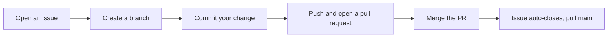

# Lab 3 — Git & GitHub Workflow: The `dotfiles` Repo

**Time: ~3–4 hrs · Difficulty: Core · Builds on: Lab 2 (the `bin/` scripts)**

## Objective

You'll put the scripts you wrote in Lab 2 under version control, publish them to GitHub, and practice the full solo workflow: atomic commits, branching, merging, reading the commit graph, recovering work with `stash`, and opening a pull request from the `gh` CLI. This is the backbone of the milestone — by the end your `dotfiles` repo will live on GitHub with a clean, legible history. **Type the commands; write your own commit messages.** Learning to phrase a good commit message is part of the skill.

## Setup

You need Lab 2 finished (`~/dev/dotfiles/bin` with scripts) and the `gh` CLI installed. Configure Git's identity once (use your real name and the email on your GitHub account):

```zsh
git config --global user.name "Your Name"
git config --global user.email "you@example.com"
git config --global init.defaultBranch main
```

Authenticate the GitHub CLI (this also sets up your credentials for pushing):

```zsh
gh auth login
```

Choose GitHub.com, HTTPS, and "Login with a web browser." Follow the prompts.

**Checkpoint:** `gh auth status` reports you're logged in, and `git config --global user.name` echoes your name.
**If not:** if `gh auth status` says you're not logged in, rerun `gh auth login` and complete the browser step. If `user.name` is blank, rerun the `git config --global user.name "..."` command. See Troubleshooting.

## Background

**Recall first (from memory, before reading on):** from Lab 2 — what three things must be true for you to type a script's name and have it run, and where do your scripts live? (Shebang, executable bit, and on `PATH`; they live in `~/dev/dotfiles/bin`. Those are the files you're about to put under version control.)

A **commit** is a snapshot of your tracked files plus a pointer to its parent. Git has three areas you move changes through: the **working tree** (your files), the **staging area / index** (what `git add` marks for the next commit), and the **repository** (committed history). `git status` shows the state of all three — run it constantly. A **branch** is just a movable label pointing at a commit. GitHub is a **remote** copy of your repo you `push` to and `pull` from. You'll feel the model click the first time you read `git log --graph` and *see* the snapshots-and-pointers.

The collaboration loop you'll practice in steps 8–9 (solo, but the same shape teams use) looks like this:


*Notice: the issue and the PR bookend the actual code change — the work is tracked from "we should do this" all the way to "it's merged."*

## Steps

### 1. Initialize and inspect

```zsh
cd ~/dev/dotfiles
git init
git status
```

You're on `main` with untracked files (`bin/` and whatever else).

**Checkpoint:** `git status` lists `bin/` (and any other files) under "Untracked files."
**If not:** if `git status` says "not a git repository," the `git init` didn't run or you're in the wrong directory — run `pwd` (recall Lab 1) to confirm you're in `~/dev/dotfiles`, then `git init`.

### 2. Protect against committing junk and secrets

Create a `.gitignore` so you never accidentally commit OS cruft or secrets. With nano, create `.gitignore`:

```
.DS_Store
*.log
.env
*.key
*.pem
```

This habit matters enormously later when API keys arrive — committed secrets are a real security incident.

**Checkpoint:** `cat .gitignore` shows the entries; `git status` no longer lists ignored files like `.DS_Store`.
**If not:** if `.DS_Store` still appears, the file may be named `gitignore` without the leading dot, or saved outside the repo root — confirm with `ls -la` that `.gitignore` sits in `~/dev/dotfiles`.

### 3. Your first commit — atomic from the start

The lab's core new skill is the **stage → commit** cycle, done atomically. You'll learn it in three stages.

#### Stage 1 — Worked example (I do)

Run this exactly. Watch how `git add` moves one file into the staging area and `git commit` records just that file. This is one atomic commit, fully worked:

```zsh
git add .gitignore
git commit -m "Add .gitignore for OS files and secrets"
```

Now run `git status` and `git log --oneline`. You staged exactly one file, committed it with a message saying *what and why*, and the working tree is clean again. That is the entire cycle.

**Checkpoint:** `git log --oneline` shows one commit, "Add .gitignore for OS files and secrets."
**If not:** if `git commit` said "nothing to commit," you skipped `git add` — stage the file first. If it opened an editor, you omitted `-m`; write a message, save and quit (recall Lab 4's `:wq` if it's vim).

#### Stage 2 — Faded practice (we do)

Now commit your scripts the same way — but you write the messages. Stage each file by itself and give it an atomic message of the form "Add `<script>` to `<do one thing>`." The first is done; you fill in the rest.

```zsh
git add bin/hello
git commit -m "Add hello script as a scripting warm-up"

git add bin/mkproject
git commit -m "____"   # TODO: one line — what does mkproject do?

git add bin/todo
git commit -m "____"   # TODO: one line — what does todo do?

git add bin/extract
git commit -m "____"   # TODO: one line — what does extract do?
```

Each commit must do **one thing** — stage one file, commit it, repeat. Resist the urge to `git add .` everything at once; that produces the giant vague commits the milestone penalizes.

**Checkpoint:** `git log --oneline` shows five commits total, each naming a single script change.
**If not:** if one commit lists several files, you staged more than one before committing — that's not atomic. Use `git reset --soft HEAD~1` to undo the last commit (keeping changes staged), unstage extras with `git restore --staged <file>`, and recommit one at a time.

### 4. Read the commit graph

```zsh
git log --graph --oneline --all
git diff HEAD~1 HEAD
git show HEAD
```

`--graph` draws the structure; `diff` shows what changed between two commits; `show` displays the latest commit in full.

**Checkpoint:** you can point at each line of the graph and say what commit it is and what its parent is.
**If not:** if `git diff HEAD~1 HEAD` errors with "unknown revision," you may have only one commit so far — make sure Stage 2 produced five commits before reading the graph.

### 5. Stage 3 — Independent (you do): branch, change, merge

Now the full cycle with no per-line scaffolding. The commands are given, but you decide the branch name and write the commit message yourself. Add a new script on a branch, then merge it:

```zsh
git switch -c add-gss
nano bin/gss
```

Put a short readable git-status helper in `bin/gss`:

```bash
#!/usr/bin/env bash
git status -sb
echo "---"
git log --oneline -5
```

Then:

```zsh
chmod +x bin/gss
git add bin/gss
git commit -m "Add gss for a compact git status and recent log"
git switch main
git merge add-gss
git log --graph --oneline --all
```

**Checkpoint:** `gss` is now on `main`, and the graph shows the branch having been created and merged.
**If not:** if `git merge` reported a conflict (unlikely here since `main` didn't change), run `git status` — it names the conflicted file and tells you how to finish or `git merge --abort`. If `gss` isn't on `main`, confirm you ran `git switch main` *before* `git merge add-gss`.

### 6. Recover work with stash

Simulate getting interrupted mid-change:

```zsh
echo "# work in progress" >> bin/gss
git status
git stash
git status
git stash pop
git status
```

`stash` parks uncommitted changes and gives you a clean tree; `stash pop` brings them back. Then discard that scratch edit with `git restore bin/gss`.

**Checkpoint:** after `stash` the tree is clean; after `pop` your edit returns; after `restore` it's gone.
**If not:** if `git stash` says "No local changes to save," your edit wasn't actually written — rerun the `echo ... >> bin/gss` line. If `restore` left the line, you committed it by mistake; check `git log --oneline`.

### 7. Write the README

Document your scripts in Markdown — this is required by the milestone. Create `README.md` describing each script with a usage example (one section per script). Then commit it:

```zsh
git add README.md
git commit -m "Document scripts and setup in README"
```

**Checkpoint:** `README.md` has a heading per script and a usage example each; it's committed.
**If not:** if `git status` still shows `README.md` as modified or untracked, you didn't `git add README.md` before committing — stage it, then commit.

### 8. Publish to GitHub

```zsh
gh repo create dotfiles --public --source=. --remote=origin --push
```

This creates the GitHub repo, wires it as `origin`, and pushes `main`.

**Checkpoint:** `gh repo view --web` opens your repo in the browser, showing your files, README, and commit history.
**If not:** if `gh repo create` says the name already exists, pick a different name or delete the old repo. If the push was rejected, confirm `gh auth status` shows you're logged in (Setup step).

### 9. Issues and a pull request

Practice the collaboration loop solo. Open an issue, branch to address it, push, and open a PR with `gh`:

```zsh
gh issue create --title "Add a serve script" --body "Need a quick static file server."
git switch -c add-serve
nano bin/serve
```

A minimal `serve`:

```bash
#!/usr/bin/env bash
port="${1:-8000}"
echo "serving $(pwd) on http://localhost:$port"
python3 -m http.server "$port"
```

Then:

```zsh
chmod +x bin/serve
git add bin/serve
git commit -m "Add serve to start a local static file server (closes #1)"
git push -u origin add-serve
gh pr create --fill
gh pr merge --merge --delete-branch
```

`closes #1` links the PR to the issue so merging it closes the issue automatically.

**Checkpoint:** the PR merges, the issue closes, and `git pull` on `main` brings the merged `serve` script down locally.
**If not:** if the issue didn't auto-close, your commit message lacked `closes #1` (or referenced the wrong number) — you can close it manually with `gh issue close 1`. If `gh pr create` errored, confirm you pushed the branch first with `git push -u origin add-serve`.

## Definition of Done

- A public GitHub repo named `dotfiles` exists with your scripts and README.
- History shows atomic commits (one logical change each) and at least one merged branch/PR.
- You can clone the repo fresh and the files are all there.

Self-verify (run from `~/dev/dotfiles`):

```zsh
git log --oneline | wc -l        # should be a healthy count, growing toward 25+
gh repo view --json name,visibility
git status                       # should be "working tree clean"
```

**Self-explain:** in one sentence, why does `git commit` succeed even with no internet, but `git push` does not?

## Stretch Goals

1. Add a `setup` script that appends the `PATH` line to `~/.zshrc` and `chmod +x`'s everything in `bin/` — your "fresh machine" one-liner.
2. Set up SSH keys with `ssh-keygen` and `gh ssh-key add`, then switch your remote to SSH and push without a password prompt.
3. Squash a messy series of commits with `git rebase -i` to practice cleaning history (do it on a throwaway branch first).
4. Add a license and a short "Contributing" note to your README.

## Troubleshooting

- **`gh auth login` keeps failing** — make sure your system clock is correct and you finished the browser step; rerun `gh auth status`.
- **`Permission denied (publickey)` on push** — you're on an SSH remote without a key set up. Either use the HTTPS remote `gh` created, or do the SSH stretch goal.
- **Committed something you shouldn't have (a secret)** — for this lab, the simplest fix is to delete the file, commit the removal, and rotate the secret. Real history-scrubbing is advanced; the lesson is to add it to `.gitignore` *before* it's ever staged.
- **`nothing to commit, working tree clean`** — you didn't `git add` your change, or there's no change. Run `git status` to see.
- **Detached HEAD or "you are in the middle of a merge"** — run `git status`; it almost always tells you the exact command to continue or abort (`git merge --abort`).
- **Forgot to make a script executable before committing** — `chmod +x bin/<name>`, then `git add` and commit the permission change.
