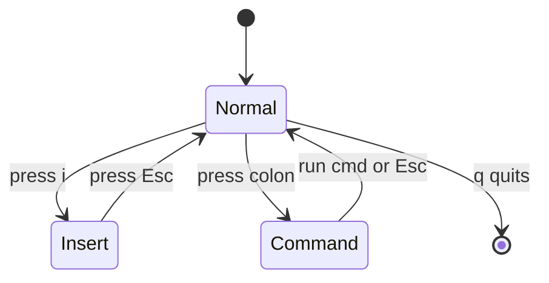

# Lab 4 — Vim Survival

**Time: ~1–2 hrs · Difficulty: Intro · Builds on: Lab 1 (terminal basics)**

## Objective

You'll learn just enough `vim` to open a file, move around, edit text, save, and quit — confidently, without a cheat sheet. This is a survival skill, not a quest for mastery: every remote server you ever log into has `vim`, but not your favorite GUI editor. When a later month has you editing a config file over SSH on a $0 cloud box, this lab is what stops you from being stranded. You'll also confirm your `nano` skills, since that's your day-to-day terminal editor. **No AI, no shortcuts — the whole point is building the reflex yourself.**

## Setup

`vim` and `nano` both ship with macOS — nothing to install. Work in your sandbox so nothing matters:

```zsh
cd ~/dev/sandbox
```

**Checkpoint:** `pwd` shows `~/dev/sandbox`.
**If not:** if the directory doesn't exist, you skipped Lab 1's setup — run `mkdir -p ~/dev/sandbox` then `cd ~/dev/sandbox`.

## Background

**Recall first (from memory, before reading on):** from Lab 3 — when a Git commit opens an editor because you forgot `-m`, what do you actually need to do to finish the commit? (Write a message, then save and quit the editor. If that editor is vim, this lab is exactly the skill that gets you unstuck.)

`vim` is a **modal** editor, which is the one idea that trips up everyone at first. In **Normal mode** (where you start) your keys are commands — `j` moves down, `dd` deletes a line — not text. To type text you switch to **Insert mode** with `i`. To run commands like save/quit you enter **Command-line mode** with `:`. The single most important key is `Esc`, which always returns you to Normal mode. If you ever feel lost: press `Esc`, then deal with it. You cannot get permanently trapped.

Here are the three modes and how you move between them:


*Notice: every arrow back to Normal goes through `Esc` (or finishing a command). When in doubt, press `Esc` to return to the safe center, then decide.*

## Steps

### 1. Run the built-in tutorial

vim ships with an interactive tutor. Spend 20–30 minutes here — it's the highest-leverage thing in this lab:

```zsh
vimtutor
```

Work through at least lessons 1–4 (moving, deleting, inserting, saving/quitting).

**Checkpoint:** you finished vimtutor lessons 1–4 and quit back to your prompt.
**If not:** if `vimtutor` isn't found, run `vim` then type `:Tutor` and Enter, or just proceed to step 2 — the core moves are below.

Steps 2–4 teach the survival skill — moving between modes to insert, save, quit, and bail out — as worked → faded → independent.

### Stage 1 — Worked example (I do): open, insert, save, quit

```zsh
vim survival.txt
```

You're in Normal mode. Follow these exactly, watching the mode you're in at each step:

1. Press `i` to enter Insert mode.
2. Type a few lines of text.
3. Press `Esc` to return to Normal mode.
4. Type `:w` and Enter to **write** (save).
5. Type `:q` and Enter to **quit**.

You can combine the last two as `:wq` (write and quit).

**Checkpoint:** `cat survival.txt` shows the lines you typed.
**If not:** if the file is empty, you typed your text while still in Normal mode (so the keys ran as commands) — reopen, press `i` first to enter Insert mode, *then* type. If you couldn't quit, press `Esc` and type `:wq`.

### Stage 2 — Faded practice (we do): the escape hatch and motion

This is the move that gets people unstuck. The goal is given; you supply the keystrokes from the mode diagram. Open the file, make a change you *don't* want to keep, and abandon it:

```zsh
vim survival.txt
```

Press `i`, type some garbage, press `Esc`, then type `:q!` and Enter. The `!` forces a quit, discarding changes. (Trace it on the mode diagram: Normal → Insert → back to Normal via `Esc` → Command via `:` → quit.)

**Checkpoint:** `cat survival.txt` is unchanged — your garbage was discarded.
**If not:** if your garbage was saved, you used `:wq` (write-quit) instead of `:q!` (quit-without-write) — the `w` writes. Redo and use `:q!`.

Now practice Normal-mode motion (arrow keys work too, but these keep your hands home). Reopen the file and move around using only:

- `h` `j` `k` `l` — left, down, up, right.
- `w` / `b` — forward / back one word.
- `0` / `$` — start / end of line.
- `gg` / `G` — top / bottom of file.

**Checkpoint:** you can jump to the bottom of the file with `G` and back to the top with `gg`.
**If not:** if pressing these inserts letters instead of moving, you're in Insert mode — press `Esc` to return to Normal, then try again.

### Stage 3 — Independent (you do): edit, delete, undo

No step-by-step now. Reopen `survival.txt` and, using only what the mode diagram and these keys give you, complete this task end to end: add a new line below the current one, delete a different whole line, undo that deletion, then save and quit — all without arrow keys or a cheat sheet. Reference keys:

In Normal mode:

- `x` — delete the character under the cursor.
- `dd` — delete the current line.
- `dw` — delete a word.
- `u` — undo. `Ctrl-r` — redo.
- `o` — open a new line below and enter Insert mode; `O` opens above.

**Checkpoint:** you added a line below with `o`, deleted a different line with `dd`, undid that deletion with `u` so it came back, then saved and quit.
**If not:** if `dd` "won't work," you're not in Normal mode — press `Esc` first. If `u` does nothing, you may have already undone everything; press `Ctrl-r` to redo and try again.

### 6. Search and replace

In Normal mode, type `/` then a word and Enter to search; `n` jumps to the next match. To replace every occurrence of `cat` with `dog` in the file:

```
:%s/cat/dog/g
```

`%` means the whole file, `s` is substitute, `g` replaces all on each line.

**Checkpoint:** a `:%s/.../.../g` ran and you saw the replacement count or the changed text.
**If not:** if vim said "Pattern not found," the word you searched for isn't in the file — add a line containing it first, or substitute a word you know is present.

### 7. Confirm nano (your daily driver)

vim is for survival on remote boxes; `nano` is friendlier for everyday local edits. Confirm the basics:

```zsh
nano survival.txt
```

Type a line, then save with `Ctrl-O` (Enter to confirm the filename) and exit with `Ctrl-X`. The shortcuts are shown along the bottom of the screen — `^` means `Ctrl`.

**Checkpoint:** you edited and saved with `nano` using `Ctrl-O` / `Ctrl-X`.
**If not:** if you ended up in vim instead of nano, you typed `vim` not `nano`; quit with `Esc` then `:q!` and rerun `nano survival.txt`.

## Definition of Done

- You completed vimtutor lessons 1–4.
- Without referencing notes, you can: open a file in vim, insert text, save and quit (`:wq`), and quit without saving (`:q!`).
- You can move with `h/j/k/l`, jump with `gg`/`G`, delete with `dd`, and undo with `u`.
- You can save and exit `nano` with `Ctrl-O` / `Ctrl-X`.

Self-verify — this writes a line into a file using vim only. Open it (`vim verify.txt`), type `i`, write `vim works`, press `Esc`, type `:wq`, then run:

```zsh
cat verify.txt
```

It should print `vim works`.

**Self-explain:** in one sentence, why does typing `wq` do nothing useful until you have first pressed `Esc` and then `:`?

## Stretch Goals

1. Create a minimal `~/.vimrc` with `set number`, `syntax on`, and `set expandtab tabstop=2` — and commit it to your `dotfiles` repo.
2. Learn `:%s/foo/bar/gc` (the `c` confirms each replacement) and visual mode (`v` to select, then operate).
3. Try `neovim` (`brew install neovim`); it's `vim`-compatible and the modern default on many systems.
4. Practice editing a file over SSH on any box you have access to, so the skill is real and not just local.

## Troubleshooting

- **"I'm stuck and nothing I type works."** Press `Esc` to get to Normal mode, then `:q!` Enter to quit without saving. This always works.
- **`E37: No write since last change`** — you tried `:q` with unsaved changes. Either save (`:wq`) or discard (`:q!`).
- **Typing inserts random commands instead of text** — you're in Normal mode. Press `i` to enter Insert mode first.
- **Arrow keys print letters like `A` `B`** — an old or misconfigured vim; use `h/j/k/l` to move, or add `set nocompatible` to `~/.vimrc`.
- **`:wq` says "E212: Can't open file for writing"** — you're editing a file you don't own (e.g., a system file). You'd need `sudo vim`, but you shouldn't need that for this lab — stay in `~/dev/sandbox`.
- **Caps Lock confusion** — vim is case-sensitive: `G` and `g` do different things. Check Caps Lock if commands behave oddly.
