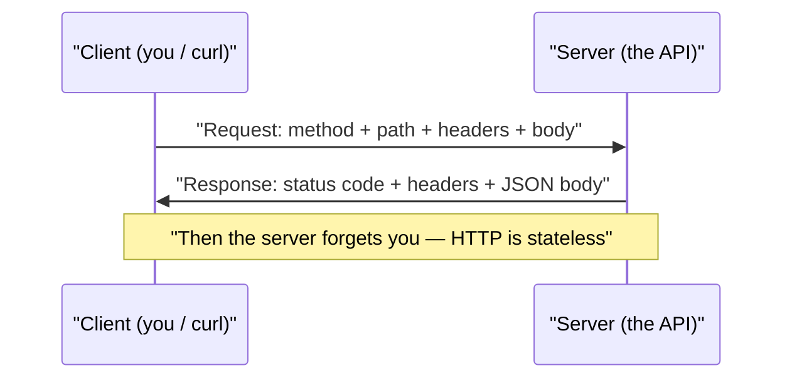
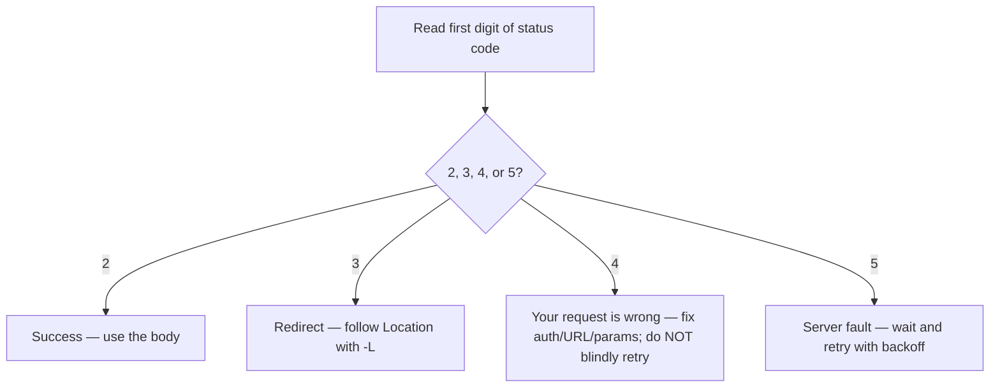

# Month 02 — The Web's Plumbing: HTTP, JSON, and How Systems Talk

**Phase: Foundations**

## Overview

Every AI agent you will eventually build is, underneath all the cleverness, a program that sends messages to other programs and reads the messages they send back. It asks a language model for a completion. It looks up the weather. It files a GitHub issue. It checks whether an earthquake just happened. None of that is magic — it is one machine speaking a shared language to another machine over the network. That language is **HTTP**, and the dialect they exchange data in is almost always **JSON**.

This month is pure literacy. You will not write a single line of Python (that starts in Month 4). Instead you will learn to read and speak HTTP and JSON fluently *by hand*, using nothing but your terminal and a couple of free tools. This is deliberate. When you later tell a Python library or an agent framework to "make a request," you will know exactly what it is doing under the hood — because you will have done it yourself, byte by byte, dozens of times. Frameworks hide HTTP behind convenient method names; that convenience becomes a trap the moment something breaks. A learner who has personally watched a `401 Unauthorized` come back, fixed the missing `Authorization` header, and seen the `200 OK` appear will debug agents that other people cannot.

By the end of the month you will be able to read any REST API's documentation, authenticate to it, send a correctly-formed request from the terminal, and slice the JSON response apart to extract exactly the field you want — all without copy-pasting a command you do not understand. That is a genuinely employable skill on its own, and it is the bedrock the rest of the course stands on.

This builds directly on Month 1. You already live in the terminal, you have a `dotfiles` repo, and you are comfortable with Git, GitHub, and Markdown. We lean on all of that: the month-end deliverable is a Markdown notebook in a Git repo, and you will use `gh` and `git` without explanation.

The whole month lives inside one picture — the request/response cycle. Hold this in your head; everything else hangs off it:


*Notice: one request earns exactly one response, then the connection is done. The server keeps no memory, which is why you resend credentials every time.*

## Prerequisites

Coming into this month, from Month 1, you must be able to:

- Navigate the filesystem, run commands, and read output in a zsh terminal on macOS.
- Use Git locally (init, add, commit, branch) and push to GitHub, including with the `gh` CLI.
- Write Markdown (headings, lists, fenced code blocks, links).
- Install software with Homebrew (`brew install ...`).

If any of those feel shaky, revisit Month 1 before starting — this month assumes them silently.

## Warm-Up: Retrieve Before You Begin

Before reading on, answer these from memory — no peeking at earlier months. This pulls forward the prior skills this month builds on.

1. In the shell, what does the pipe `|` do — where does the left command's output go?
2. What is the `PATH` environment variable, and why does a freshly `brew install`ed tool sometimes "not work" until you reopen the terminal?
3. Name the three Git commands that take a change from your working files into a commit on GitHub.
4. In Markdown, how do you write a fenced code block, and why tag it with a language?
5. How would you keep a single command out of your zsh history?

<details><summary>Check your recall</summary>

1. `|` sends the standard output of the left command into the standard input of the right one (Month 1, shell/pipes lab). You will reuse this exact idea: `curl ... | jq ...`.
2. `PATH` is the list of directories the shell searches for executables; a new tool's directory isn't on your `PATH` until the shell re-reads its config, so you reopen the terminal (Month 1, shell/PATH).
3. `git add` (stage), `git commit` (record locally), `git push` (send to GitHub) (Month 1, Git basics).
4. Three backticks open and close the block; tag it (e.g., ` ```zsh `) so it gets correct syntax highlighting (Month 1, Markdown).
5. Prefix it with a leading space when `setopt HIST_IGNORE_SPACE` is set (Month 1 dotfiles) — you'll use this to hide token exports this month.
</details>

## Learning Objectives

By the end of this month you can:

1. **Explain** the HTTP request/response model and the anatomy of a URL (scheme, host, path, query string) without notes.
2. **Identify** the correct HTTP method (GET/POST/PUT/PATCH/DELETE) for a given operation and justify the choice.
3. **Interpret** any HTTP status code by its class (2xx/3xx/4xx/5xx) and act on it when debugging.
4. **Construct** HTTP requests by hand with `curl` and HTTPie, including custom headers, query strings, and JSON request bodies.
5. **Read** arbitrary JSON fluently — distinguishing objects from arrays, navigating nesting, and locating any value.
6. **Slice** JSON on the command line with `jq` to extract, filter, and reshape fields.
7. **Authenticate** to real APIs using API keys and bearer tokens, and **explain** what OAuth adds without needing to implement it.
8. **Navigate** real API documentation to find endpoints, required parameters, rate limits, and pagination rules.
9. **Produce** a documented, reproducible "notebook" of working authenticated requests against three public APIs.

## Tech Stack (free, macOS)

Everything here is free and runs on both Apple Silicon and Intel Macs.

| Tool | Install command | Why |
|---|---|---|
| `curl` | built into macOS | The universal, no-frills HTTP client. What everything else wraps. |
| HTTPie | `brew install httpie` | A human-friendly HTTP client; colorized output, sane defaults for JSON. |
| `jq` | `brew install jq` | The command-line tool for querying and reshaping JSON. |
| Bruno | `brew install --cask bruno` | A fully free, offline, open-source API client (a free Postman). Saves requests as files you can commit to Git. |
| Git + `gh` | `brew install git gh` | Already installed from Month 1; used for the deliverable repo. |
| VS Code | `brew install --cask visual-studio-code` | Already installed from Month 1; for editing the notebook and Bruno collection. |

No LLM access is needed this month — there is no AI here yet, only the plumbing AI will later ride on. That is intentional; spend nothing.

A one-time setup, run it now:

```zsh
brew install httpie jq
brew install --cask bruno
```

## Weekly Breakdown

Calibrated to roughly 8–12 hours per week: about 3–4 hours of reading/concepts and 5–8 hours of hands-on terminal work.

### Week 1 — The HTTP mental model

**Warm-start (re-use a Month-1 skill):** before any new material, open your Month-1 `dotfiles` repo, confirm `setopt HIST_IGNORE_SPACE` is in your `~/.zshrc` (add it if not), and `git commit` the change. You'll rely on that history-hiding behavior the moment you handle tokens in Week 4.

**Focus:** Understand what actually happens when one machine talks to another over HTTP.

**Topics:** The request/response cycle. Anatomy of a URL (scheme, host, port, path, query string, fragment). HTTP methods and their meanings (GET, POST, PUT, PATCH, DELETE) and the idea of idempotency. Status codes by class. Request and response headers. The difference between query-string parameters and a request body.

**Readings:** MDN's "An overview of HTTP" and "HTTP response status codes" (linked below). Read Core Concepts in this README.

**What gets built:** Nothing committed yet — this week is about building the mental model and getting comfortable issuing requests. You will do **Lab 1** at the end of the week.

### Week 2 — Speaking HTTP by hand with curl and HTTPie

**Focus:** Issue every kind of request yourself and read the full response.

**Topics:** `curl` flags that matter (`-i`, `-v`, `-H`, `-d`, `-X`, `-L`, `-s`, `-o`). The same operations in HTTPie and why its syntax is friendlier. Sending headers. Sending a JSON body. Following redirects. Reading verbose output to see the raw exchange. Introducing Bruno as a place to save and re-run requests.

**Readings:** HTTPie docs (request items, the basics). The `curl` manual sections you actually use.

**What gets built:** Complete **Lab 1** (HTTP anatomy with curl & HTTPie) if not already done.

### Week 3 — JSON literacy and slicing with jq

**Focus:** Read JSON without flinching and extract anything from it.

**Topics:** JSON's six value types. Objects vs arrays. Nesting and how to mentally "walk a path" to any value. Common shapes returned by real APIs. `jq` basics: the identity filter `.`, key access `.foo`, array indexing `.[0]`, iteration `.[]`, the pipe `|`, object construction `{}`, and filtering with `select`.

**Readings:** The `jq` manual (the tutorial and the first half of the reference). json.org for the formal grammar (it fits on one page — that is the point).

**What gets built:** Complete **Lab 2** (JSON literacy + jq slicing).

### Week 4 — Real APIs: auth, docs, pagination, and the notebook

**Focus:** Put it all together against real, public APIs and document what you learn.

**Topics:** Authentication concepts — API keys (in headers vs query strings), bearer tokens, and a conceptual tour of OAuth (authorization code flow) without implementing it. Reading API documentation: finding the base URL, required vs optional params, response schemas, rate limits, and pagination styles (page/offset, cursor, `Link` headers). Keeping secrets out of your shell history and out of Git.

**Readings:** The landing pages of the GitHub REST API, USGS Earthquake API, and OpenWeather API docs.

**What gets built:** Complete **Lab 3** and the month-end deliverable — the **API Explorer's Notebook**.

## Core Concepts

### HTTP is a conversation: request, then response

At its heart HTTP is astonishingly simple. A **client** (your terminal, a browser, an agent) opens a connection to a **server** and sends a **request**. The server sends back exactly one **response**, and that is the end of the exchange. There is no ongoing conversation, no memory of the last request — each request/response pair stands alone. (This statelessness is *why* APIs make you send your credentials on every single request; the server forgot you the instant the last response went out.)

A request has four parts: a **method** (what you want to do), a **path** (what you want to do it to), a set of **headers** (metadata about the request), and an optional **body** (data you are sending). A response mirrors this: a **status code** (how it went), **headers** (metadata about the response), and an optional **body** (the data you asked for, usually JSON).

When you run `curl -i https://api.github.com/zen` you will see all of this laid out. The first line of the response, something like `HTTP/2 200`, is the status line. Below it are headers. Below a blank line is the body. Internalize that shape; you will see it everywhere.

### The anatomy of a URL

A URL is not one thing — it is several pieces packed together, and APIs use each piece differently:

```
https://api.github.com/repos/octocat/Hello-World?per_page=5#section
└─┬──┘  └──────┬──────┘└──────────┬───────────┘└─────┬─────┘└──┬──┘
scheme       host                path             query string  fragment
```

- **Scheme** (`https`) — the protocol. Always `https` for any real API; `http` is unencrypted and unacceptable for anything with credentials.
- **Host** (`api.github.com`) — the server you are talking to. This plus the leading path is usually called the **base URL** in docs.
- **Path** (`/repos/octocat/Hello-World`) — *which resource* you want. REST APIs design paths around nouns: `/repos`, `/users`, `/issues`.
- **Query string** (`?per_page=5`) — key/value pairs that *modify* the request: filtering, sorting, pagination. They live after the `?`, separated by `&`.
- **Fragment** (`#section`) — only meaningful to browsers; never sent to the server. Ignore it for APIs.

The single most common beginner confusion is **query string vs request body**. Both carry data, but query-string parameters are part of the URL (visible, logged, used for *reading* and filtering), while a body is separate payload data (used when *creating or updating* something, typically with POST/PUT/PATCH). You filter a list with a query string; you create a record with a body.

### Methods describe intent

The method is a verb describing what you intend:

- **GET** — read something. Should never change server state. Safe to repeat.
- **POST** — create something new, or trigger an action. Not safe to blindly repeat (you might create two records).
- **PUT** — replace a resource entirely at a known location.
- **PATCH** — partially update a resource.
- **DELETE** — remove a resource.

The useful property here is **idempotency**: GET, PUT, and DELETE should produce the same end state no matter how many times you send them; POST generally does not. This matters enormously for agents later — an agent that retries a failed request must know whether retrying is safe. Learn the intent now and that future lesson is free.

> **Common misconception.** A GET request is "secure" because its data is hidden, while POST is risky because it changes things.
> **Reality.** GET puts its parameters in the URL's query string, which is *more* exposed than a POST body — it lands in server logs, browser history, and proxy caches. Neither method is encrypted by itself; only `https` (TLS) protects the contents. The belief is tempting because POST "feels" heavier, but the real safety difference is idempotency, not visibility. Never put a secret in a query string.

### Status codes tell you what happened

> **Heavy concept ahead.** Slow down here; this is the load-bearing idea of the month. Almost all of your future agent debugging comes down to reading one status code correctly.

The response status code is a three-digit number whose *first digit* tells you the class. Memorize the classes, not every code:

- **2xx — Success.** `200 OK`, `201 Created`, `204 No Content`. It worked.
- **3xx — Redirection.** `301`/`302` mean "the thing moved, look over here." `curl -L` follows redirects automatically.
- **4xx — You made a mistake.** `400 Bad Request` (malformed), `401 Unauthorized` (no/invalid credentials), `403 Forbidden` (authenticated but not allowed), `404 Not Found`, `429 Too Many Requests` (rate-limited). These are *your* problem to fix.
- **5xx — The server made a mistake.** `500 Internal Server Error`, `503 Service Unavailable`. Not your fault; retry later (with backoff).

The 4xx/5xx split is the most practically useful distinction in all of HTTP. When something fails, the first question is always: is this digit a 4 or a 5? A 4 means fix your request; a 5 means wait and retry. Agents that get this right are robust; agents that retry 4xx requests forever are not.

This is the decision you will make, by reflex, thousands of times:


*Notice: only the 5xx branch should retry the same request. A 4xx retried unchanged fails the same way forever.*

> **Common misconception.** A `200 OK` means my request did exactly what I wanted.
> **Reality.** `200` only means the HTTP exchange succeeded — the server received your request and chose to answer. The body can still report an application error (a search with zero results, or a JSON payload with its own `"error"` field). It is tempting because the green-light feeling of `200` is real at the transport layer, but you must still read the body to know if you got what you asked for.

### Headers carry the metadata

Headers are key/value lines that travel with both requests and responses. A few you will use constantly:

- `Accept: application/json` — "send me JSON, please."
- `Content-Type: application/json` — "the body I'm sending is JSON."
- `Authorization: Bearer <token>` — "here are my credentials."
- `User-Agent: ...` — who is making the request (GitHub *requires* one).
- On responses: `Content-Type` tells you what came back; rate-limit headers (`X-RateLimit-Remaining`) tell you how many requests you have left.

### JSON: the data both sides speak

**JSON** (JavaScript Object Notation) is the format almost every API uses for bodies. It has exactly six value types: **strings** (`"hi"`), **numbers** (`42`, `3.14`), **booleans** (`true`/`false`), **null**, **arrays** (`[1, 2, 3]`), and **objects** (`{"key": "value"}`). That is the whole language. Arrays are ordered lists. Objects are unordered sets of key/value pairs. The power — and the only real difficulty — comes from **nesting**: arrays inside objects inside arrays, as deep as needed.

Reading JSON fluently is a matter of walking a path. Given `{"user": {"repos": [{"name": "dotfiles"}]}}`, the path to that name is "the `user` object, its `repos` array, the first element, its `name` key" — which in `jq` is written `.user.repos[0].name`. Once you see JSON as a tree you walk down, it stops being intimidating.

### jq: a tiny language for JSON

`jq` is a filter: JSON goes in, you describe a transformation, transformed output comes out. The core building blocks: `.` is the whole input; `.foo` reaches into a key; `.[]` iterates over an array; `|` pipes one filter's output into the next, exactly like the shell pipe you learned in Month 1; `select(...)` keeps only items matching a condition; and `{a, b}` builds a new object from chosen fields. With just those you can answer almost any question about an API response. You will pipe `curl` straight into `jq` constantly.

### Authentication: proving who you are

Because HTTP is stateless, you prove your identity on *every* request. Three patterns, in increasing sophistication:

- **API key** — a long secret string the API issues you. You send it either in a header (`Authorization: ...` or a custom header like `X-API-Key`) or, on some older APIs, as a query parameter (`?appid=...`). Simple, but a query-string key ends up in logs and history, so a header is safer.
- **Bearer token** — an API key sent in the standardized form `Authorization: Bearer <token>`. GitHub's personal access tokens work this way. "Bearer" literally means "whoever holds this token is treated as you," which is exactly why you must never commit one to Git.
- **OAuth** — the flow you use when an app acts *on your behalf* without ever seeing your password (the "Log in with GitHub" button). Conceptually: you are redirected to the provider, you approve specific permissions, the provider hands the app a short-lived token. You will not implement OAuth this month, but understand the shape: it exists so you can grant scoped, revocable access without sharing your password. Many agent integrations later will lean on it.

The security rule that matters from day one: **secrets never go into Git, and never into a command where they would be saved in shell history.** Use environment variables, and in zsh prefix a command with a space to keep it out of history (with the right `HISTCONTROL`/`setopt` settings) — Lab 3 shows the clean way.

### Reading API documentation

Every REST API's docs answer the same handful of questions, and learning to find them fast is the meta-skill of this month: What is the **base URL**? How do I **authenticate**? What **endpoints** exist and what **parameters** does each take (required vs optional)? What does the **response** look like? What are the **rate limits** (how many requests per hour, and what header reports my remaining quota)? And how does **pagination** work when results exceed one page — page numbers, an offset, a cursor, or a `Link` header pointing to the next page? Find those six things and you can use any API on earth.

## Labs

| Lab | Title | Time | Difficulty |
|---|---|---|---|
| [Lab 1](lab-1-http-anatomy-with-curl-and-httpie.md) | HTTP Anatomy with curl & HTTPie | ~3–4 hrs | Intro |
| [Lab 2](lab-2-json-literacy-and-jq-slicing.md) | JSON Literacy & Slicing with jq | ~3–4 hrs | Core |
| [Lab 3](lab-3-explore-real-apis-and-build-the-notebook.md) | Explore Three Real APIs & Build the Notebook | ~5–7 hrs | Core/Stretch |

## Checkpoints & Self-Assessment

Run these as quick self-checks throughout the month. You should be able to do each without looking anything up:

- Given a URL, point to the scheme, host, path, and query string out loud.
- Explain when you'd use a query string vs a request body, and give one real example of each.
- Without running it, predict whether `curl https://api.github.com/users/octocat` returns 2xx and what shape the body has, then verify with `curl -i`.
- State what a `401`, `403`, `404`, and `429` each mean and what you'd do about each.
- Pipe a `curl` response into `jq` to pull a single nested field, e.g. `curl -s https://api.github.com/users/octocat | jq '.public_repos'` should print a number.
- Explain the difference between an API key and a bearer token, and why neither belongs in Git.

If any of these stump you, the relevant week's Core Concepts and lab will fix it.

## Reflect

Spend ten minutes on these in your learning log (writing, not just thinking):

- **Explain it back:** In two or three sentences, explain the HTTP request/response cycle as if teaching a peer who finished last month. Use the words *stateless*, *status code*, and *body*.
- **Connect:** How does piping `curl` into `jq` change or extend the shell pipe you learned in Month 1? What is flowing through the pipe now that wasn't before?
- **Monitor:** Which concept this month is still fuzzy — idempotency, the query-string-vs-body split, pagination, or the auth patterns? Name it precisely, and write the one question that would clear it up.

## Month-End Assessment

**Deliverable: the "API Explorer's Notebook."**

Using only `curl`, HTTPie, and Bruno — **no code** — explore three public APIs and produce a Markdown notebook documenting them. Recommended targets: the **GitHub REST API** (bearer-token auth, rich pagination), the **USGS Earthquake feed** (no auth, great JSON to slice), and **OpenWeather** (API-key auth via query string, free tier). The notebook lives in a Git repo and, for each API, documents:

1. **How to authenticate** — what kind of credential, where it goes, and how you keep it out of Git.
2. **Three useful endpoints** — base URL, path, and key parameters for each.
3. **An example request + response** — the exact `curl`/HTTPie command and a trimmed, representative JSON response.
4. **Rate limits** — the published limit and which response header reports remaining quota.

Push the repo to GitHub. Lab 3 walks you through producing it.

**Rubric:**

| Criterion | Passing | Excellent |
|---|---|---|
| Coverage | All three APIs documented with the four required items each. | Plus a fourth API the learner found on their own, or pagination demonstrated with a real multi-page walk. |
| Correctness | Every example command runs and returns the shown response shape. | Commands use environment variables for secrets; responses trimmed with `jq` to the relevant fields. |
| Auth handling | Credentials are not committed to Git. | A `.gitignore` and/or `.env.example` pattern documents how a reader supplies their own key; secrets demonstrably absent from history. |
| Documentation quality | Clear Markdown; a reader could reproduce each request. | Reads like real reference docs: explains *why* each endpoint is useful and notes gotchas (rate limits, required `User-Agent`, pagination). |
| Reproducibility | Repo cloned fresh, the no-auth API works immediately. | Includes the Bruno collection committed so requests are runnable in the GUI too. |

**Definition of done:** you can read any REST API's documentation and make a working authenticated request from the terminal without copy-pasting a command you do not understand.

## Common Pitfalls

- **Confusing query string with request body.** Trying to "filter" with a POST body, or to "create" with query params. Reading filters → query string; writing data → body.
- **Forgetting `-i`/`-v` and flying blind.** A bare `curl` hides status and headers. When debugging, *always* look at the status line first. Reach for `curl -i` (headers + body) or `-v` (the whole exchange).
- **Pasting secrets into the terminal where they hit history and logs.** Use environment variables; never hard-code a token into a committed file or a query string you'll screenshot.
- **Misreading a 4xx as a server problem.** A `401`/`403`/`404` is *your* request to fix (auth, permissions, wrong URL), not a bug in the API. Read the body — APIs usually explain the error in JSON.
- **Ignoring required headers.** GitHub rejects requests without a `User-Agent`; many APIs need `Accept: application/json`. "It works in the browser but not in curl" is almost always a missing header.
- **Treating `jq` strings as bare words.** `jq '.name'` is fine, but to compare you need quotes inside: `jq 'select(.type=="User")'`. Forgetting the inner quotes is the #1 jq error.
- **Not paginating.** Assuming the first page is all the data. Real APIs cap page size (often 30); check for a `Link` header or a cursor and keep going.
- **Rate-limiting yourself in a loop.** Hammering an API returns `429`. Watch the `X-RateLimit-Remaining` header.

## Knowledge Check

Answer from memory first, then check. Questions marked ⟲ are spaced callbacks to earlier months — they are supposed to feel like a stretch.

1. Name the four parts of an HTTP request and the three parts of a response.
2. You send a request and get back `403 Forbidden`. Is this your problem or the server's, and what is the first thing you check?
3. Predict the output: `curl -s "https://httpbin.org/get?x=1&y=2" | jq '.args'`. What prints, and why must the URL be quoted in zsh?
4. Spot the risk: a teammate's notebook contains `curl "https://api.example.com/data?api_key=sk_live_abc123"`. What is wrong, and how would you fix it?
5. Which HTTP method is safe to retry automatically after a network blip, and which is not — and what property explains the difference?
6. Given `{"items": [{"mag": 1.2}, {"mag": 4.8}]}`, write the `jq` filter that keeps only items with `mag` of at least 2.0.
7. An API returns `200 OK` but the body is `{"error": "no results"}`. Did your request "work"? Explain.
8. ⟲ (Month 1) The command `curl -s URL | jq '.name'` uses the pipe. In one sentence, what is the pipe doing, and what would `curl -s URL > out.json` do instead?
9. ⟲ (Month 1) You want to load a token without it landing in your shell history. What zsh feature makes a leading-space command invisible to history, and where did you configure it?
10. ⟲ (Month 1) Where in the notebook repo do you record secrets, and which file ensures Git never tracks them?

<details><summary>Answer key</summary>

1. Request: method, path, headers, optional body. Response: status code, headers, optional body.
2. Yours — `403` is a 4xx. You are authenticated but not permitted; check the credential's scopes/permissions and that you're hitting a resource you're allowed to see. Read the JSON body for the API's explanation.
3. Prints `{ "x": "1", "y": "2" }`. Quote the URL because zsh treats `?` and `&` as special (globbing and backgrounding) characters.
4. The API key is in the query string, so it leaks into shell history, server logs, and any screenshot. Move it into an `Authorization` header (or at minimum an environment variable), and never commit it — put it in a gitignored `.env`.
5. GET (and PUT/DELETE) is safe to retry; POST generally is not. The property is idempotency — GET/PUT/DELETE produce the same end state however many times they run.
6. `[.items[] | select(.mag >= 2.0)]` (the wrapping brackets are optional unless you want an array).
7. No. `200` only means the HTTP exchange succeeded; the body reports an application-level failure. Always read the body, not just the status line.
8. ⟲ The pipe sends `curl`'s stdout into `jq`'s stdin so `jq` can transform it (Month 1, pipes). `> out.json` redirects that stdout into a file instead of the screen.
9. ⟲ `setopt HIST_IGNORE_SPACE`, configured in `~/.zshrc` in your Month-1 dotfiles; commands starting with a space are then skipped by history.
10. ⟲ In a `.env` file, kept out of Git by listing it in `.gitignore` (Month 1 Git habits, applied to secrets here).
</details>

## Further Reading

- [MDN — An overview of HTTP](https://developer.mozilla.org/en-US/docs/Web/HTTP/Overview) — the clearest free explainer of the request/response model.
- [MDN — HTTP response status codes](https://developer.mozilla.org/en-US/docs/Web/HTTP/Status) — the canonical reference; skim it, don't memorize it.
- [HTTPie documentation](https://httpie.io/docs/cli) — short and readable; covers everything you'll use.
- [The `jq` manual](https://jqlang.github.io/jq/manual/) — start with the tutorial, then the "Basic filters" section.
- [json.org](https://www.json.org/json-en.html) — the entire JSON grammar on one page.
- [GitHub REST API docs](https://docs.github.com/en/rest) — a gold-standard example of well-written API documentation; you'll use it in Lab 3.

## Author's Notes

- **Why no Python yet:** the curriculum deliberately separates *understanding the protocol* from *automating it*. Months of agent debugging are saved by a learner who can issue a request by hand. Python arrives in Month 4 and will feel trivial because the HTTP underneath is already understood.
- **OpenWeather and free tiers shift.** OpenWeather's free tier and exact endpoints occasionally change; Lab 3 names a fallback (any no-key public API) so a learner is never blocked on a signup. The two zero-auth targets (USGS, GitHub's unauthenticated tier) guarantee the milestone is completable on $0 with no account beyond GitHub.
- **Convergence check.** Architect: objectives are verb-driven and the deliverable has a rubric; builds on Month 1's Git/Markdown, sets up Month 4's HTTP-in-code. Agentic Systems: idempotency and the 4xx-vs-5xx retry distinction are seeded now precisely because agent retry logic depends on them. Infra/Security: secrets-out-of-Git and rate-limit awareness are made explicit from the first auth example. Lab Designer: every lab has checkpoints, a definition of done, stretch goals, and troubleshooting. No unresolved tradeoffs.
