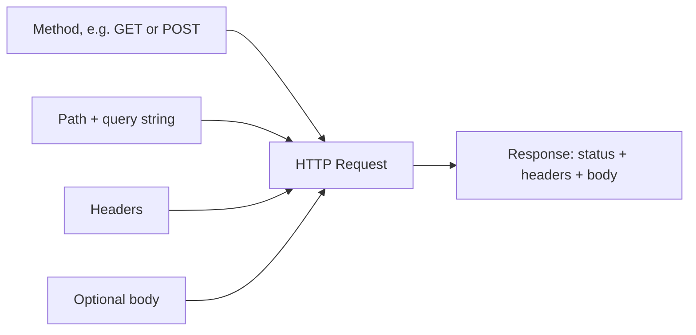
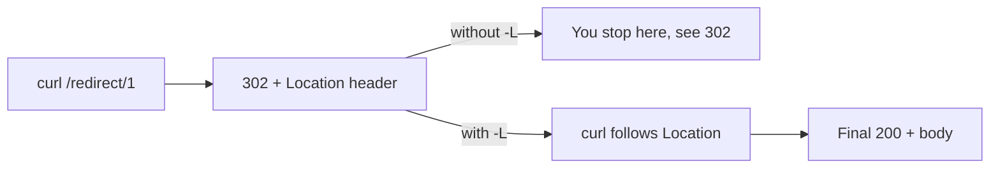

# Lab 1 — HTTP Anatomy with curl & HTTPie

**Time: ~3–4 hrs · Difficulty: Intro · Builds on: Month 1 (terminal, Git)**

## Objective

You will dissect a real HTTP exchange with your own hands. By the end you'll have sent GET and POST requests with both `curl` and HTTPie, read the full raw response (status line, headers, body), added custom headers, sent a JSON body, followed a redirect, and triggered and read several status codes on purpose. This is the foundation for everything: once you can *see* the request and response, nothing about HTTP stays mysterious.

## Setup

You need macOS with zsh and the Month 2 tools installed:

```zsh
brew install httpie jq
curl --version    # should print a version; curl ships with macOS
http --version    # HTTPie
```

We'll use two free, public, no-auth test services:

- `https://api.github.com` — a real production API with great responses.
- `https://httpbin.org` — a service that echoes your request back to you, perfect for *seeing* exactly what you sent.

**Checkpoint:** `curl --version` and `http --version` both print versions without error.
**If not:** `http: command not found` means HTTPie isn't installed — run `brew install httpie`, then reopen the terminal so your `PATH` picks it up (the Month-1 `PATH` lesson in action).

## Background

**Recall first (from memory):** From the README, what are the four parts of an HTTP request? And what does the *first digit* of a status code tell you? Answer before reading on.

A request is a method + path + headers + (optional) body. A response is a status code + headers + (optional) body. `curl` shows you this when you ask it to; HTTPie shows it by default. We'll use `httpbin.org` to inspect our own requests because its responses literally contain a copy of what we sent.

Keep this anatomy in view as you run each step — every flag below just exposes one piece of it:


*Notice: the four inputs on the left are everything you control; the response on the right is everything you read.*

## Steps

The new skill this lab teaches is *seeing* an HTTP exchange with `curl`. We build it in three stages: first you run a fully-worked exchange and study it (Stage 1), then you fill in pieces of similar requests (Stage 2), then you compose requests on your own (Stage 3). Routine comparison steps stay as plain numbered steps.

### Stage 1 — Worked example (I do)

You run these exactly as written and study the output. You are not inventing anything yet; the goal is to *see* each part of the request and response light up.

#### 1. Your first request, body only

```zsh
curl https://api.github.com/zen
```

You'll see a single line of text — a random piece of GitHub "zen." That's the response **body**. You saw nothing else because a bare `curl` prints only the body.

**Checkpoint:** a short sentence of text prints (e.g., "Keep it logically awesome.").
**If not:** if you see `curl: (6) Could not resolve host`, you have no network or a typo in the URL; if you see nothing at all, you may have omitted the URL. Re-type the command exactly.

#### 2. See the status line and headers with `-i`

```zsh
curl -i https://api.github.com/zen
```

Now you see much more. The first line is the **status line** (`HTTP/2 200`). Below it are **response headers** (`content-type`, `x-ratelimit-remaining`, and others). Then a blank line, then the **body**.

**Checkpoint:** the first line contains `200`. You can see a `content-type` header and a blank line separating headers from the body.
**If not:** if you see only the body and no headers, you omitted `-i` (lowercase i). If the first line shows a number other than `200`, GitHub may be rate-limiting you — wait a minute and retry.

#### 3. See the entire exchange with `-v`

```zsh
curl -v https://api.github.com/zen
```

The `-v` (verbose) flag shows the *whole conversation*. Lines starting with `>` are what your machine **sent** (your request line, your request headers). Lines starting with `<` are what the server **sent back**. Lines with `*` are connection details (DNS, TLS).

**Checkpoint:** you can find a line `> GET /zen HTTP/2` (your request) and a line `< HTTP/2 200` (the response). You have now seen a complete HTTP exchange.
**If not:** the `>`/`<` lines come from `-v`; if you don't see them you used `-i` instead. Scroll up — `-v` output is long and the request lines come before the response.

### Stage 2 — Faded practice (we do)

You've now seen the full shape. These steps give you the command pattern but leave the meaningful pieces for you to supply, predicting the result before you run it.

#### 4. Inspect exactly what you send, using httpbin

```zsh
curl -s https://httpbin.org/get | jq
```

`httpbin.org/get` echoes your request back as JSON. The `| jq` pretty-prints it (we cover `jq` properly in Lab 2; here it just formats). Look at the `headers` object — that's what your `curl` automatically sent, including a `User-Agent` of `curl/...`.

**Checkpoint:** you see a JSON object with `args`, `headers`, and `url` keys. `args` is empty `{}` because you sent no query string.
**If not:** if `jq` prints an error instead of formatted JSON, you likely got an HTML page (network/proxy issue) — re-run the `curl` alone with `-i` to read the real status. If `jq: command not found`, run `brew install jq` and reopen the terminal.

#### 5. Add a query string (you fill in the params)

Send two query parameters of your own choosing to httpbin. Fill the `TODO`s, then **predict** what `.args` will contain before you run it:

```zsh
curl -s "https://httpbin.org/get?TODO_KEY=TODO_VALUE&TODO_KEY2=TODO_VALUE2" | jq '.args'
```

The quotes around the URL matter in zsh because `?` and `&` are special characters.

**Checkpoint:** `.args` prints an object containing exactly the two key/value pairs you typed, matching your prediction.
**If not:** `zsh: no matches found` means the URL wasn't quoted — wrap it in double quotes. An empty `{}` means your `?` and `&` got dropped; check the URL has no stray spaces.

#### 6. Send a custom header (you fill in the header)

`-H` adds a request header in the form `"Name: value"`. Add a header named `X-Demo` with any value, then confirm it echoes back:

```zsh
curl -s -H "Accept: application/json" -H "X-Demo: TODO_VALUE" https://httpbin.org/get | jq '.headers'
```

**Checkpoint:** the printed `headers` object includes `"X-Demo"` with the value you chose.
**If not:** if `X-Demo` is missing, you probably dropped the `-H` or wrote it without the colon. The format is strictly `-H "Name: value"`.

### Stage 3 — Independent (you do)

Now you compose requests from the goal alone. The scaffolding is gone; you have the pattern from Stages 1–2.

#### 7. Send a POST with a JSON body

```zsh
curl -s -X POST https://httpbin.org/post \
  -H "Content-Type: application/json" \
  -d '{"name": "Ada", "course": "Agentwright"}' | jq '.json'
```

`-X POST` sets the method; `-d` supplies the body; the `Content-Type` header tells the server the body is JSON. httpbin parses it and echoes it back under `json`.

**Checkpoint:** `jq '.json'` prints back your object: `{ "name": "Ada", "course": "Agentwright" }`.
**If not:** if `.json` is `null`, you forgot `-H "Content-Type: application/json"`, so httpbin didn't parse the body as JSON (look under `.data` instead). If `jq` errors, your `-d` JSON has a syntax slip — check the quotes and commas.

#### 8. Follow a redirect

A redirect is a short chain: the server answers `3xx` with a `location` pointing elsewhere, and `-L` makes `curl` walk it for you.


*Notice: the `-L` flag is the only difference between stopping at the redirect and landing on the final page.*

```zsh
curl -i https://httpbin.org/redirect/1
```

You'll see a `302` and a `location` header — the server is saying "go here instead." Now add `-L`:

```zsh
curl -i -L https://httpbin.org/redirect/1
```

`-L` follows the redirect automatically, so you end up with the final `200` response.

**Checkpoint:** without `-L` you see a `3xx` status; with `-L` you see a final `200`.
**If not:** if both show `200`, you may have added `-L` to both commands — run the first without it. If both show `302`, the `-L` was misplaced; it goes anywhere before the URL.

#### 9. Trigger status codes on purpose

```zsh
curl -i -s -o /dev/null -w "%{http_code}\n" https://httpbin.org/status/404
curl -i -s -o /dev/null -w "%{http_code}\n" https://httpbin.org/status/500
curl -i -s -o /dev/null -w "%{http_code}\n" https://httpbin.org/status/429
```

Here `-o /dev/null` discards the (empty) body and `-w "%{http_code}\n"` prints just the status code. You're deliberately producing a 4xx (your fault), a 5xx (server's fault), and a 429 (rate limited).

**Checkpoint:** the three commands print `404`, `500`, and `429`.
**If not:** if you see headers/body instead of a bare number, you dropped the `-o /dev/null -w "%{http_code}\n"` part. If nothing prints, check the `\n` is inside the double quotes.

#### 10. Now do it all in HTTPie

HTTPie is friendlier: it assumes JSON, colorizes, and shows headers by default.

```zsh
http GET https://httpbin.org/get city==Boston units==metric
```

In HTTPie, `==` means a **query-string** parameter (note the doubled equals). Compare with sending a JSON body, where `=` means a body field:

```zsh
http POST https://httpbin.org/post name=Ada course=Agentwright
```

HTTPie automatically set `Content-Type: application/json`, built the JSON body `{"name": "Ada", "course": "Agentwright"}`, and pretty-printed the response. To add a header, use `Header:Value`:

```zsh
http GET https://httpbin.org/get X-Demo:hello
```

**Checkpoint:** the GET shows your params under `args`; the POST shows your fields under `json`; the header request shows `X-Demo` under `headers`. Notice you typed far less than with `curl`.
**If not:** `http: command not found` means HTTPie isn't installed — `brew install httpie` and reopen the terminal. If your fields land under `args` instead of `json`, you used `==` (query) where you meant `=` (body field).

#### 11. Compare the same request in both tools

Run the identical logical request both ways and notice the difference in effort and output:

```zsh
curl -s -H "Accept: application/json" "https://api.github.com/users/octocat" | jq '.login, .public_repos'
http GET https://api.github.com/users/octocat Accept:application/json
```

`curl` is the universal low-level tool (and what scripts/agents ultimately use); HTTPie is the comfortable tool for exploring by hand. You want both.

**Checkpoint:** the `curl` line prints `"octocat"` and a number; the HTTPie line shows a full colorized JSON profile.
**If not:** if GitHub returns `403`, add `-H "User-Agent: my-lab"` (curl) or `User-Agent:my-lab` (HTTPie) — GitHub requires it. If `jq` errors, the response wasn't JSON; re-run the `curl` with `-i` to see why.

## Definition of Done

You're done when you can, from memory:

- Run `curl -i <url>` and point to the status line, headers, and body.
- Add a query string and a custom header to a `curl` request.
- Send a JSON body with `curl -X POST -d` and with `http POST field=value`.
- Explain the difference between HTTPie's `==` and `=`.
- Predict and verify a status code with `curl -o /dev/null -w "%{http_code}\n"`.

Self-verify with this one-liner — it should print a number greater than zero:

```zsh
curl -s https://api.github.com/users/octocat | jq '.public_repos'
```

**Self-explain:** in one sentence, why does adding `-i` (or `-v`) let you debug a request that a bare `curl` left mysterious?

## Stretch Goals

1. Use `curl -w` to print timing: `curl -s -o /dev/null -w "time_total: %{time_total}s\n" https://api.github.com`. Compare a cold vs warm request.
2. Inspect the rate-limit headers GitHub returns: `curl -i https://api.github.com/users/octocat | grep -i ratelimit`. How many requests do you have left per hour unauthenticated?
3. Use `httpbin.org/headers` to discover the *default* headers HTTPie sends versus the defaults `curl` sends. List two differences.
4. Send a `PUT` and a `DELETE` to `httpbin.org/anything` and confirm the echoed `method` field changes.

## Troubleshooting

- **`zsh: no matches found: ...?city=Boston`** — zsh tried to glob the `?`. Wrap the URL in double quotes.
- **`curl: (6) Could not resolve host`** — no network, or a typo in the host. Check your connection and the URL.
- **HTTPie: `http: command not found`** — the binary is `http` (and `https`). Reinstall with `brew install httpie` and reopen the terminal.
- **GitHub returns `403` with a message about User-Agent** — older curl builds or odd setups; add `-H "User-Agent: my-lab"`. GitHub requires a User-Agent header.
- **`jq: command not found`** — `brew install jq`, then reopen the terminal so your `PATH` updates.
- **A POST body shows up empty on httpbin** — you forgot `-H "Content-Type: application/json"` with `curl`, so it wasn't parsed as JSON. HTTPie sets this for you.
