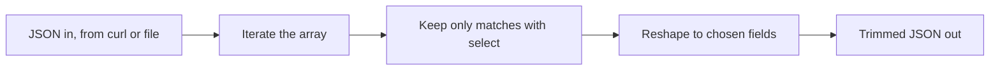

# Lab 2 — JSON Literacy & Slicing with jq

**Time: ~3–4 hrs · Difficulty: Core · Builds on: Lab 1**

## Objective

You will learn to read any JSON document fluently and to extract, filter, and reshape it with `jq` from the command line. You'll work first with a small JSON file you can see whole, then against live API responses piped straight from `curl`. By the end you can answer almost any question about an API response — "how many?", "which ones match X?", "just give me these two fields" — in a single one-liner. This is the skill that turns a wall of JSON into exactly the value you need.

## Setup

```zsh
brew install jq        # if not already installed in Lab 1
jq --version           # should print jq-1.7 or similar
```

Create a working directory and a sample file:

```zsh
mkdir -p ~/agentic-course/month-02/lab-2 && cd ~/agentic-course/month-02/lab-2
cat > sample.json <<'JSON'
{
  "user": "octocat",
  "active": true,
  "followers": 1500,
  "profile": { "city": "San Francisco", "bio": null },
  "repos": [
    { "name": "dotfiles",    "stars": 42,  "language": "Shell",  "fork": false },
    { "name": "hello-world", "stars": 5,   "language": "Python", "fork": true  },
    { "name": "api-notebook","stars": 130, "language": "Markdown","fork": false }
  ]
}
JSON
```

**Checkpoint:** `cat sample.json` prints the file, and `jq . sample.json` prints it colorized and re-indented (proving it's valid JSON).
**If not:** if `jq` reports a syntax error, the heredoc didn't paste cleanly — re-run the `cat > sample.json` block as a single unit. If `jq: command not found`, run `brew install jq` and reopen the terminal.

## Background

**Recall first (from memory):** From Lab 1, how do you pipe a `curl` response into another command, and what does the `-s` flag on `curl` do? Answer before reading on — you'll do exactly this with `jq`.

JSON has six value types: string, number, boolean, `null`, array (`[...]`, ordered), and object (`{...}`, key/value). Everything else is those types nested. `jq` is a filter language: it reads JSON, applies the filter you write, and prints the result. The mental model that unlocks `jq`: you are describing a *path down a tree*, then optionally transforming what you find. The pipe `|` chains transformations exactly like the shell pipe from Month 1.

A `jq` one-liner is itself a small pipeline — each `|` hands its output to the next filter:


*Notice: this is the same pipe idea as the shell — data flows left to right, each stage transforming what the previous one emitted.*

## Steps

The new skill is *writing `jq` filters*. We build it in three stages: study fully-worked navigation filters (Stage 1), fill in the meaningful parts of filter/reshape filters (Stage 2), then answer fresh questions against live APIs unaided (Stage 3).

### Stage 1 — Worked example (I do)

Run each filter against `sample.json` and study what it returns. You are reading and confirming, not yet inventing.

#### 1. The identity filter and pretty-printing

```zsh
jq '.' sample.json
```

`.` means "the whole input, unchanged." Its only effect here is to pretty-print. This is also how you make any ugly API response readable: `curl -s <url> | jq`.

**Checkpoint:** the file prints with consistent indentation and color.
**If not:** a `jq: error: ... syntax error` means the file isn't valid JSON — re-create `sample.json` exactly from Setup (a stray comma or quote breaks it).

#### 2. Reach into a key

```zsh
jq '.user' sample.json
jq '.followers' sample.json
```

`.user` returns the value at key `user`. Strings print with quotes; numbers print bare.

**Checkpoint:** the first prints `"octocat"`, the second prints `1500`.
**If not:** if you get `null`, you misspelled the key (keys are case-sensitive). If you get a "Cannot index" error, you applied `.user` to something that isn't an object — check you're reading `sample.json`.

#### 3. Walk into nested objects

```zsh
jq '.profile.city' sample.json
jq '.profile.bio' sample.json
```

Chain keys with dots to walk down the tree. A missing or null value returns `null` rather than an error.

**Checkpoint:** you get `"San Francisco"` and `null`.
**If not:** if `.profile.city` errors, you may have dropped a dot (`.profilecity`). The `null` for `bio` is correct — `bio` is genuinely `null` in the sample.

#### 4. Index into an array

```zsh
jq '.repos[0]' sample.json
jq '.repos[0].name' sample.json
jq '.repos[-1].name' sample.json
```

`[0]` is the first element; negative indexes count from the end. `.repos[0].name` walks object → array → element → key.

**Checkpoint:** you get the first repo object, then `"dotfiles"`, then `"api-notebook"`.
**If not:** `Cannot index array with "name"` means you wrote `.repos.name` instead of `.repos[0].name` — you must pick an element before reaching for a key.

#### 5. Iterate over an array

```zsh
jq '.repos[]' sample.json
jq '.repos[].name' sample.json
```

`[]` (no number) emits *every* element as a separate output. `.repos[].name` gives every repo name, one per line.

**Checkpoint:** the second command prints `"dotfiles"`, `"hello-world"`, `"api-notebook"` on three lines.
**If not:** if you see one array instead of three separate lines, you wrote `.repos` (the array) rather than `.repos[]` (each element). The empty brackets are what does the iterating.

#### 6. Count things with length

```zsh
jq '.repos | length' sample.json
```

The pipe `|` feeds the `.repos` array into `length`. On an array, `length` is the count; on an object, the number of keys; on a string, its character count.

**Checkpoint:** prints `3`.
**If not:** if you get an error, the pipe target must be a function name with no leading dot — it's `| length`, not `| .length`.

### Stage 2 — Faded practice (we do)

You have the navigation moves. Now combine them into filters where you supply the condition and the fields. Predict each result before running.

#### 7. Filter with select (you write the condition)

`select(condition)` passes through only the items where the condition is true. The first line below is worked; in the second, fill in the `TODO` to keep only repos written in Python and print their names:

```zsh
jq '.repos[] | select(.fork == false)' sample.json
jq '.repos[] | select(TODO_CONDITION) | .name' sample.json
```

Note that numbers need no quotes but a string comparison does: `select(.language == "Python")` — the inner quotes live inside the outer single quotes.

**Checkpoint:** the first prints the two non-fork repos; your second line prints `"hello-world"`.
**If not:** a syntax error almost always means a missing inner quote around a string value. If nothing prints, your condition matched nothing — test the left of the pipe (`.repos[]`) alone first.

#### 8. Reshape into a new object (you choose the fields)

`{...}` builds a *new* object from chosen fields — perfect for trimming a huge response. Fill the `TODO`s to produce objects with just the name and the language of each repo:

```zsh
jq '.repos[] | {name: .name, stars: .stars}' sample.json
jq '.repos[] | {TODO_FIELD, TODO_FIELD}' sample.json
```

The shorthand `{name, stars}` is identical to spelling out `{name: .name, stars: .stars}`.

**Checkpoint:** the first prints three objects with `name` and `stars`; your second prints three objects with `name` and `language`.
**If not:** the shorthand only works when the output key equals the source key. To rename, use the long form `{newname: .source}`.

#### 9. Collect results back into an array with map

```zsh
jq '[.repos[] | .name]' sample.json
jq '.repos | map(.stars) | add' sample.json
```

Wrapping a filter in `[ ... ]` collects its outputs into an array. `map(f)` applies `f` to each element; `add` sums an array of numbers.

**Checkpoint:** the first prints an array of the three names; the second prints `177` (42 + 5 + 130).
**If not:** `add` needs an array of numbers; if it errors, `map(.stars)` produced strings or objects — confirm `.stars` is a bare number in the sample.

#### 10. Sort and take

```zsh
jq '.repos | sort_by(.stars) | reverse | .[0].name' sample.json
```

Sort the repos by stars, reverse to descending, take the first, get its name — the most-starred repo.

**Checkpoint:** prints `"api-notebook"`.
**If not:** if you get all three repos instead of one, you dropped the final `.[0]`. The order is sort, reverse, take first, then read the key.

### Stage 3 — Independent (you do)

No more sample file and no scaffolding — just a real API and a question. Compose the filter yourself from the moves you now own.

#### 11. Now slice a live API response

Pipe a real `curl` straight into `jq`. List octocat's public repos and pull just the names and star counts:

```zsh
curl -s "https://api.github.com/users/octocat/repos?per_page=100" \
  | jq '[.[] | {name, stars: .stargazers_count}]'
```

Then answer a real question — which of octocat's repos has the most stars?

```zsh
curl -s "https://api.github.com/users/octocat/repos?per_page=100" \
  | jq 'sort_by(.stargazers_count) | reverse | .[0] | {name, stars: .stargazers_count}'
```

**Checkpoint:** you get a trimmed array of repos, then a single object naming the top repo and its star count. You just queried a production API and reshaped its response without writing any code.
**If not:** if `jq` errors with "Cannot index", the response wasn't the array you expected — run the `curl` alone first to see its shape. A `403` from GitHub means add `-H "User-Agent: my-lab"`.

#### 12. Slice a deeply nested feed

The USGS earthquake feed is excellent `jq` practice — every quake is a "feature" with nested `properties` and `geometry`. Get all quakes from the past hour and pull place, magnitude, and time:

```zsh
curl -s "https://earthquake.usgs.gov/earthquakes/feed/v1.0/summary/all_hour.geojson" \
  | jq '.features[] | {place: .properties.place, mag: .properties.mag, time: .properties.time}'
```

Now filter to only quakes of magnitude 2.0 or greater and count them:

```zsh
curl -s "https://earthquake.usgs.gov/earthquakes/feed/v1.0/summary/all_hour.geojson" \
  | jq '[.features[] | select(.properties.mag >= 2.0)] | length'
```

**Checkpoint:** the first prints one object per recent quake; the second prints a count (possibly `0` in a quiet hour — that's a valid answer, not an error).
**If not:** if you get "Cannot index" errors, you forgot the `.features[]` iteration before reaching into `.properties`. If `jq` reports a parse error, the feed URL was wrong and you got an HTML page — check the URL.

## Definition of Done

You're done when you can, without looking it up:

- Pretty-print any JSON with `jq .`.
- Walk to any nested value using `.`, `[n]`, and `[]`.
- Count with `length`, filter with `select`, reshape with `{}`, and aggregate with `map`/`add`.
- Pipe a live `curl` response into `jq` and extract a single answer.

Self-verify — this should print a single number (the count of octocat's public repos), proving you can chain curl → jq end to end:

```zsh
curl -s "https://api.github.com/users/octocat/repos?per_page=100" | jq 'length'
```

**Self-explain:** in one sentence, why does chaining filters with `|` let one `jq` command answer a question that would otherwise take several passes over the data?

## Stretch Goals

1. Use `group_by(.language)` on octocat's repos and produce a count per language.
2. From the USGS feed, find the single largest-magnitude quake in the past day (`all_day.geojson`) and print its place and magnitude.
3. Use `jq -r` (raw output) to print strings *without* quotes, then build a clean newline-separated list of repo names suitable for piping to another command.
4. Use `to_entries` to turn the top-level object of `sample.json` into an array of `{key, value}` pairs, and explain when that's useful.

## Troubleshooting

- **`jq: error: syntax error`** — usually a missing or mismatched quote. Remember string comparisons need *inner* quotes: `select(.language == "Python")`, all inside the outer single quotes.
- **`jq: error (at <stdin>:0): Cannot index array with "name"`** — you used `.name` on an array; you need to iterate first (`.[] | .name`) or index (`.[0].name`).
- **Nothing prints / empty output** — your `select` matched nothing (valid), or you piped into a filter that produced no output. Test the left side of the pipe alone first.
- **Quotes around numbers in output** — that field is actually a string in the JSON. APIs sometimes return numbers as strings; convert with `tonumber` if you need to compare numerically.
- **`parse error: Invalid numeric literal`** — you piped non-JSON into `jq` (e.g., an HTML error page). Run the `curl` alone with `-i` to see what actually came back.
- **`-r` gives different output** — that's `raw` mode stripping quotes from strings; expected and often what you want for shell piping.
