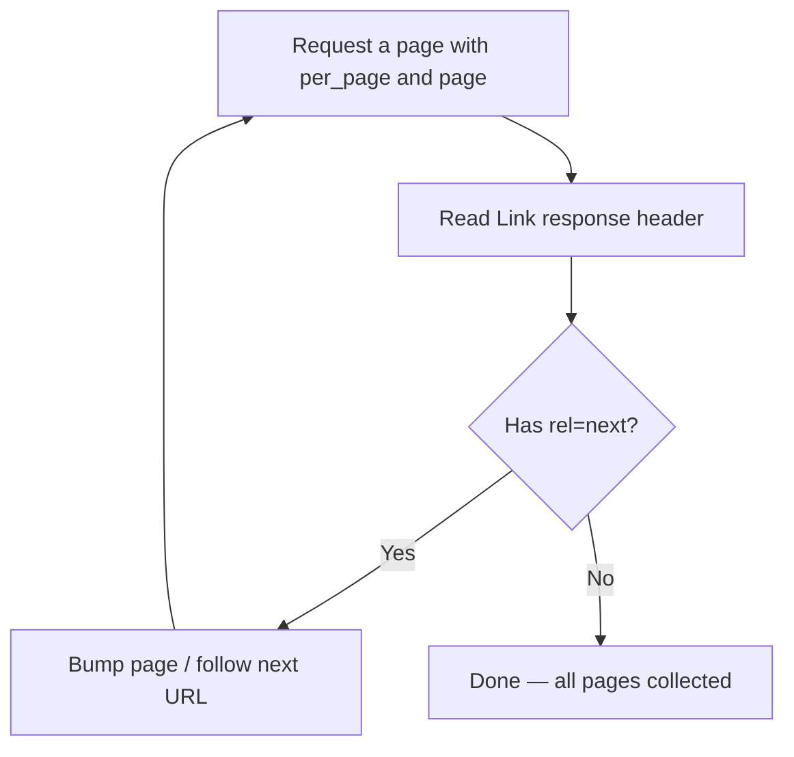

# Lab 3 — Explore Three Real APIs & Build the Notebook

**Time: ~5–7 hrs · Difficulty: Core/Stretch · Builds on: Labs 1 & 2**

## Objective

This is the month-end milestone. Using only `curl`, HTTPie, and Bruno — **no code** — you will explore three public APIs, authenticate to each, exercise three useful endpoints per API, handle pagination, respect rate limits, and document everything in a Markdown notebook committed to a Git repo. The targets are the **GitHub REST API** (bearer-token auth), the **USGS Earthquake feed** (no auth), and **OpenWeather** (API-key auth). When you finish, you'll be able to pick up any REST API's docs cold and make a working authenticated request — the definition of done for the whole month.

## Setup

You need Labs 1 and 2 done, plus:

```zsh
brew install --cask bruno      # free, offline API client
gh --version                   # GitHub CLI from Month 1
```

Create the repo for your notebook:

```zsh
mkdir -p ~/agentic-course/month-02/api-explorers-notebook && cd $_
git init
```

**Checkpoint:** you're inside an empty Git repo and `bruno` opens from Spotlight or `open -a Bruno`.
**If not:** if `git init` errored, you're not in the directory you created — re-run the `mkdir -p ... && cd $_`. If Bruno won't open, finish `brew install --cask bruno` and approve it in System Settings → Privacy & Security.

## Background

**Recall first (from memory):** From Labs 1 and 2, which `curl` flag prints the response headers, and which header carries your credentials on an authenticated request? You'll lean on both constantly here.

Every REST API's docs answer the same six questions: base URL, authentication, endpoints, parameters, rate limits, and pagination. Your job in each section below is to *find those answers in the real docs* and prove them with a working request. You'll also practice the non-negotiable security habit: secrets live in environment variables and a `.env` file that is **never committed**, never in a query string you screenshot, never in a Git history.

First, protect yourself from accidentally committing secrets:

```zsh
cat > .gitignore <<'GITIGNORE'
.env
*.local
GITIGNORE

cat > .env.example <<'ENVEXAMPLE'
# Copy to .env and fill in. .env is gitignored — never commit real keys.
GITHUB_TOKEN=ghp_xxxxxxxxxxxxxxxxxxxx
OPENWEATHER_API_KEY=xxxxxxxxxxxxxxxxxxxx
ENVEXAMPLE

git add .gitignore .env.example && git commit -m "Add gitignore and env template"
```

**Checkpoint:** `git status` shows a clean tree; `.env` is not tracked (you haven't created it yet).
**If not:** if `git status` lists untracked files, you missed the `git add`/`commit`. The `.gitignore` must exist *before* you create `.env`, so Git never sees it — that ordering is the whole safety mechanism.

## Steps

The new skill this lab teaches is the meta-loop *read the docs → authenticate → make a working request*. The three APIs are deliberately a gradual release of that loop: GitHub is fully worked (every step spelled out), USGS is faded (you find the endpoints yourself, no auth to distract you), and OpenWeather is independent (you sign up, locate where the key goes, and build the calls from the goal). Part D ships the notebook.

### Stage 1 — Worked example (I do): Part A — GitHub REST API (bearer-token auth)

Follow these exactly. Every flag and header is explained; you are learning the rhythm of the loop, not inventing yet.

#### 1. Read the docs for the six answers

Open [docs.github.com/en/rest](https://docs.github.com/en/rest). Find: base URL (`https://api.github.com`), auth (a personal access token sent as `Authorization: Bearer <token>`), rate limits (60/hr unauthenticated, 5,000/hr authenticated), and pagination (`per_page` and `page` params, plus a `Link` response header).

**Checkpoint:** you can state GitHub's authenticated rate limit and where the next-page link lives.
**If not:** if you can't find these in the docs, search the page for "rate limit" and "pagination" — every major API has dedicated pages for both. They're the answers you'll prove with requests below.

#### 2. Create a token and load it safely

Create a fine-grained personal access token at GitHub → Settings → Developer settings → Personal access tokens (read-only, public repos is enough). Then put it in `.env` and load it — note the **leading space** so the export stays out of zsh history:

```zsh
echo 'GITHUB_TOKEN=paste_your_token_here' >> .env
 export GITHUB_TOKEN=$(grep GITHUB_TOKEN .env | cut -d= -f2)
```

(The leading space before `export` keeps that line out of history if `setopt HIST_IGNORE_SPACE` is set — add `setopt HIST_IGNORE_SPACE` to your `~/.zshrc` from your Month 1 dotfiles to make this reliable.)

**Checkpoint:** `echo ${#GITHUB_TOKEN}` prints a number > 0 (the token's length) without ever echoing the token itself.
**If not:** if it prints `0`, the `grep`/`cut` found nothing — check the exact key name in `.env` matches `GITHUB_TOKEN` and that the line is `KEY=value` with no spaces around the `=`.

#### 3. Compare unauthenticated vs authenticated rate limits

```zsh
curl -s -i https://api.github.com/users/octocat | grep -i x-ratelimit-limit
curl -s -i -H "Authorization: Bearer $GITHUB_TOKEN" \
  -H "User-Agent: api-notebook" https://api.github.com/users/octocat | grep -i x-ratelimit-limit
```

**Checkpoint:** the first shows a limit of `60`, the second `5000`. You've now *proven* what auth buys you.
**If not:** if the second still shows `60`, your token wasn't sent — confirm `$GITHUB_TOKEN` is non-empty (`echo ${#GITHUB_TOKEN}`) and that the `Authorization` header has the literal word `Bearer ` before it. A `403` means you're missing the `User-Agent` header.

#### 4. Exercise three endpoints

```zsh
# (a) Your authenticated profile
http GET https://api.github.com/user "Authorization:Bearer $GITHUB_TOKEN" User-Agent:api-notebook

# (b) A repo's metadata
curl -s -H "Authorization: Bearer $GITHUB_TOKEN" -H "User-Agent: api-notebook" \
  https://api.github.com/repos/cli/cli | jq '{name, stars: .stargazers_count, open_issues: .open_issues_count}'

# (c) Search repositories
curl -s -H "Authorization: Bearer $GITHUB_TOKEN" -H "User-Agent: api-notebook" \
  "https://api.github.com/search/repositories?q=jq+language:c&per_page=3" \
  | jq '.items[] | {full_name, stars: .stargazers_count}'
```

**Checkpoint:** (a) shows your login; (b) shows the `cli/cli` star count; (c) shows three search results.
**If not:** a `401` means your token didn't load (re-run the `export`). A `jq` error on (b)/(c) means a non-JSON response came back — drop the `| jq` and look at the raw output, adding `-i` to read the status.

#### 5. Walk pagination with the Link header

Pagination is a loop: fetch a page, look for a `rel="next"` link, and keep going until there isn't one. That is the shape you're about to walk by hand.


*Notice: the loop exits only when `rel="next"` disappears — exactly how an agent will later page through results in code.*

```zsh
curl -s -i -H "Authorization: Bearer $GITHUB_TOKEN" -H "User-Agent: api-notebook" \
  "https://api.github.com/users/torvalds/repos?per_page=5&page=1" | grep -i '^link:'
```

The `Link` header contains `rel="next"` and `rel="last"` URLs. Manually fetch page 2 by bumping `page=2`. This is *real* pagination — most APIs cap a page and make you ask for more.

**Checkpoint:** you see a `link:` header with a `rel="next"` URL, and fetching `page=2` returns a different set of repos.
**If not:** if there's no `link:` header, the result fit on one page — pick a user with more repos or lower `per_page`. Remember `grep -i '^link:'` is case-insensitive because the header may be `Link:` or `link:`.

### Stage 2 — Faded practice (we do): Part B — USGS Earthquake feed (no auth)

With no auth in the way, *you* run the read-docs-then-request loop. The commands are given, but read the docs first and predict each feed's shape before running.

#### 6. Read the docs and hit the feed

Open the [USGS GeoJSON feed docs](https://earthquake.usgs.gov/earthquakes/feed/v1.0/geojson.php). No authentication, no key, no rate limit to worry about for casual use. The feeds are static URLs by time window and magnitude.

```zsh
curl -s "https://earthquake.usgs.gov/earthquakes/feed/v1.0/summary/all_day.geojson" \
  | jq '.metadata | {generated, count, title}'
```

**Checkpoint:** you see a `count` of how many quakes occurred today.
**If not:** a `jq` parse error means the URL is off and you got HTML — copy the feed URL exactly from the USGS docs. The `.metadata` object is at the top level, not inside `.features`.

#### 7. Exercise three views

```zsh
# (a) Significant quakes this month
curl -s "https://earthquake.usgs.gov/earthquakes/feed/v1.0/summary/significant_month.geojson" \
  | jq '.features[] | {place: .properties.place, mag: .properties.mag}'

# (b) All quakes >= M2.5 today
curl -s "https://earthquake.usgs.gov/earthquakes/feed/v1.0/summary/2.5_day.geojson" \
  | jq '[.features[] | {place: .properties.place, mag: .properties.mag}] | sort_by(.mag) | reverse'

# (c) The single biggest quake of the past week
curl -s "https://earthquake.usgs.gov/earthquakes/feed/v1.0/summary/all_week.geojson" \
  | jq '.features | sort_by(.properties.mag) | reverse | .[0].properties | {place, mag, time}'
```

**Checkpoint:** each command returns earthquake data; (c) names the largest recent quake. (Quiet periods may return empty arrays — that's valid data.)
**If not:** "Cannot index" errors mean you skipped the `.features[]` iteration before `.properties`. An empty result from `significant_month` is plausible in a calm month; switch to `2.5_week.geojson` to get data to slice.

### Stage 3 — Independent (you do): Part C — OpenWeather (API-key auth via query string)

Now you run the whole loop yourself: sign up, find in the docs *where the key goes*, and adapt the request pattern from Parts A–B to a brand-new API. This is the month's definition of done in miniature.

#### 8. Sign up and read the docs

Create a free account at [openweathermap.org/api](https://openweathermap.org/api) and copy your API key (it can take a few minutes to activate). The free "Current Weather Data" endpoint authenticates by an `appid` **query parameter**. Note the published free-tier limit (60 calls/minute, 1,000,000/month at time of writing).

> **Fallback (if you can't or won't sign up):** any no-key public API completes this section equally well — e.g. `https://api.open-meteo.com/v1/forecast?latitude=42.36&longitude=-71.06&current=temperature_2m` (Open-Meteo, no key). Document whichever you use. The milestone is about *method*, not the specific provider.

#### 9. Load the key and make a request

```zsh
echo 'OPENWEATHER_API_KEY=paste_your_key_here' >> .env
 export OPENWEATHER_API_KEY=$(grep OPENWEATHER_API_KEY .env | cut -d= -f2)

curl -s "https://api.openweathermap.org/data/2.5/weather?q=Boston&units=imperial&appid=$OPENWEATHER_API_KEY" \
  | jq '{city: .name, temp: .main.temp, conditions: .weather[0].description}'
```

**Checkpoint:** you get Boston's current temperature and a one-line description. Note the key is in a variable, never typed literally.
**If not:** a `401` with `"cod":401` means the key is wrong or not yet activated (new keys take 10–60 min) — verify `echo ${#OPENWEATHER_API_KEY}` is non-zero and wait, or use the Open-Meteo no-key fallback above.

#### 10. Exercise three endpoints and read the error path

```zsh
# (a) Weather by city name
curl -s "https://api.openweathermap.org/data/2.5/weather?q=Tokyo&units=metric&appid=$OPENWEATHER_API_KEY" | jq '{city: .name, temp: .main.temp}'

# (b) Weather by coordinates
curl -s "https://api.openweathermap.org/data/2.5/weather?lat=51.51&lon=-0.13&units=metric&appid=$OPENWEATHER_API_KEY" | jq '{city: .name, temp: .main.temp}'

# (c) Deliberately break auth to see the 401 body
curl -s "https://api.openweathermap.org/data/2.5/weather?q=Boston&appid=WRONGKEY" | jq
```

**Checkpoint:** (a) and (b) return temperatures; (c) returns a JSON error with `"cod": 401` and a message — proving APIs explain *their own* errors in the body, which is where you look first when debugging.
**If not:** if (a)/(b) fail too, your key isn't loaded — re-run the `export`. If (c) returns a `200`, you accidentally left the real key in; the point is to see the error body, so use the literal `WRONGKEY` shown.

### Part D — Build and ship the notebook

#### 11. Save your requests in Bruno

Open Bruno, create a collection named `API Explorers Notebook`, and save one request per endpoint above (organize into GitHub / USGS / OpenWeather folders). Use Bruno **environment variables** for the tokens (Bruno reads them from the environment / a `.bru` env file, not hard-coded). Bruno stores everything as plain-text files in a folder you can put inside the repo.

**Checkpoint:** clicking "Send" on a saved GitHub request returns a `200` inside Bruno, and the collection folder exists on disk.
**If not:** a `401` in Bruno means the token isn't wired to a Bruno environment variable — set it in the collection's environment, not hard-coded in the request. Confirm the collection folder lives inside your repo, not Bruno's default location.

#### 12. Write the Markdown notebook

Create `NOTEBOOK.md`. For each of the three APIs, write a section with the four required items: **how to authenticate** (credential type, where it goes, how you keep it out of Git), **three useful endpoints** (base URL, path, key params), an **example request + trimmed response**, and the **rate limits** (the number and the response header that reports remaining quota). Use the commands you ran above as your examples — but reference `$GITHUB_TOKEN` / `$OPENWEATHER_API_KEY`, never the real values.

A starter skeleton:

```zsh
cat > NOTEBOOK.md <<'MD'
# API Explorer's Notebook

Documented by hand with curl, HTTPie, and Bruno. No code.
Secrets live in `.env` (gitignored); see `.env.example`.

## 1. GitHub REST API
- **Base URL:** https://api.github.com
- **Auth:** Bearer token in `Authorization: Bearer $GITHUB_TOKEN`; token in `.env`, never committed.
- **Rate limit:** 5,000/hr authenticated (60 unauth). Remaining in `X-RateLimit-Remaining`.
### Endpoints
... (fill in three, each with an example request + trimmed response)

## 2. USGS Earthquake Feed
- **Base URL:** https://earthquake.usgs.gov/earthquakes/feed/v1.0/summary/
- **Auth:** none.
- **Rate limit:** none published for casual use; be polite.
### Endpoints
...

## 3. OpenWeather (Current Weather Data)
- **Base URL:** https://api.openweathermap.org/data/2.5
- **Auth:** API key as `appid` query parameter; key in `.env`.
- **Rate limit:** ~60 calls/min on free tier.
### Endpoints
...
MD
```

**Checkpoint:** `NOTEBOOK.md` has all three API sections, each with the four required items, and no real secret appears anywhere in the file.
**If not:** scan the file for a real `ghp_` or your weather key — if either appears, replace it with the `$VARIABLE` reference before committing. Missing one of the four items per API is the most common gap; check each section against the list.

#### 13. Commit and push

```zsh
git add NOTEBOOK.md   # plus your Bruno collection folder
git commit -m "API Explorer's Notebook: GitHub, USGS, OpenWeather"
gh repo create api-explorers-notebook --public --source=. --push
```

Then verify your secrets never leaked:

```zsh
git log -p | grep -i -E "ghp_|appid=[A-Za-z0-9]{20}" || echo "CLEAN: no secrets in history"
```

**Checkpoint:** the repo exists on GitHub, and the grep prints `CLEAN: no secrets in history`.
**If not:** if `gh repo create` says you're not authenticated, run `gh auth login` (Month 1) first. If the grep finds a secret, you committed it earlier — remove it from history (`git rm --cached .env`, commit) and rotate the leaked key immediately before pushing.

## Definition of Done

- A public GitHub repo containing `NOTEBOOK.md`, `.gitignore`, `.env.example`, and (ideally) a committed Bruno collection.
- All three APIs documented with the four required items each (auth, three endpoints, example request+response, rate limits).
- Every example command in the notebook actually runs and returns the shown response shape.
- No real secret anywhere in the repo or its history (verified by the grep above).
- You can take a brand-new API's docs and make a working authenticated request from the terminal, unaided.

Final self-verification — clone your own repo fresh and confirm the no-auth API works immediately:

```zsh
cd /tmp && gh repo clone <your-username>/api-explorers-notebook && cd api-explorers-notebook
curl -s "https://earthquake.usgs.gov/earthquakes/feed/v1.0/summary/all_hour.geojson" | jq '.metadata.count'
```

**Self-explain:** in one sentence, why does finding the same six answers (base URL, auth, endpoints, params, rate limits, pagination) let you use *any* REST API, even one you've never seen?

## Stretch Goals

1. **Fully paginate** a GitHub listing: follow the `Link` header's `rel="next"` until it's gone, and report the total count you assembled.
2. **Add a fourth API** you find yourself (try [the public APIs list](https://github.com/public-apis/public-apis)) — document it with the same four items.
3. **Cursor pagination:** find an API that paginates by cursor rather than page number and explain the difference in your notebook.
4. **Conceptual OAuth:** write a short notebook section diagramming the OAuth authorization-code flow (redirect → consent → code → token) in words — no implementation, just the mental model from the README.

## Troubleshooting

- **GitHub `401 Bad credentials`** — token wrong, expired, or not exported. Re-run the `export` line; check `echo ${#GITHUB_TOKEN}` is nonzero.
- **GitHub `403` with no rate-limit info** — missing `User-Agent` header. Add `-H "User-Agent: api-notebook"`.
- **OpenWeather `401`** — key not yet activated (can take 10–60 min after signup) or a typo. Verify with the deliberate-error command in step 10.
- **`jq` chokes on the response** — you got an HTML error page, not JSON. Re-run the `curl` with `-i` to read the real status and content-type.
- **Accidentally committed `.env`** — it must be in `.gitignore` *before* you create it. If it slipped in, remove it from history before pushing (`git rm --cached .env`, commit), and rotate the leaked key immediately.
- **`gh repo create` says not authenticated** — run `gh auth login` (from Month 1) first.
- **Empty USGS arrays** — genuinely quiet seismic period; pick a wider window (`all_week.geojson`) to get data to slice.
