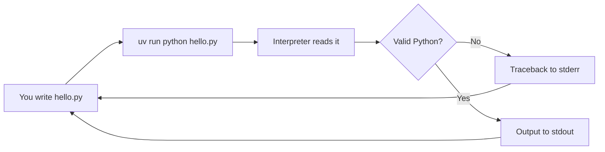
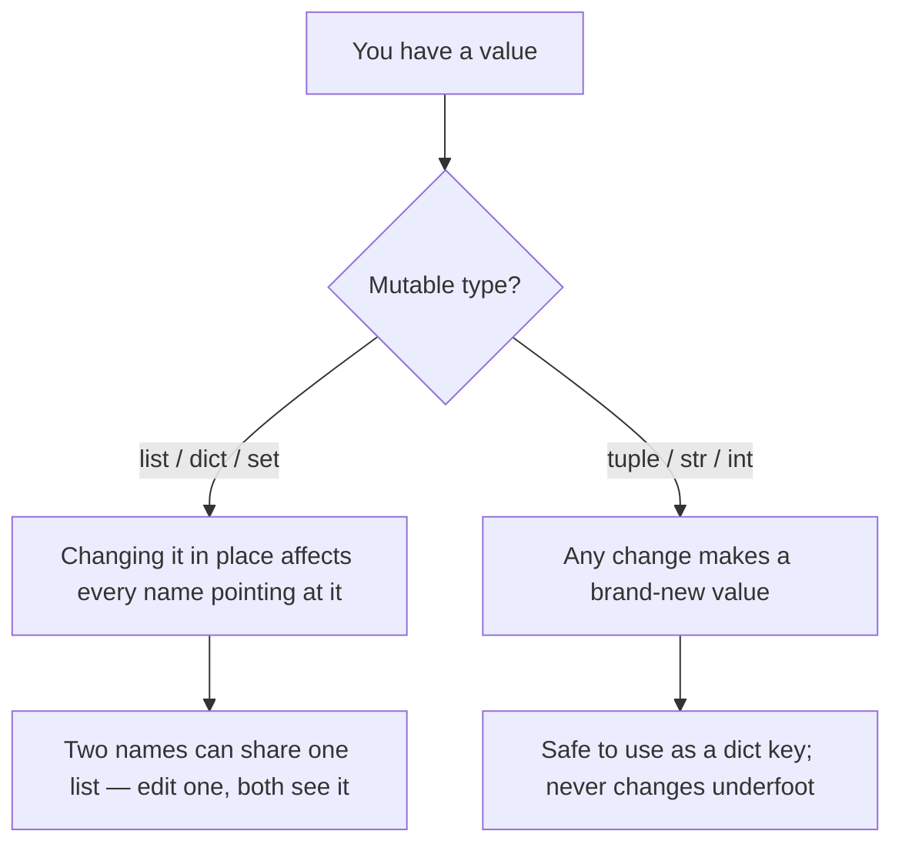
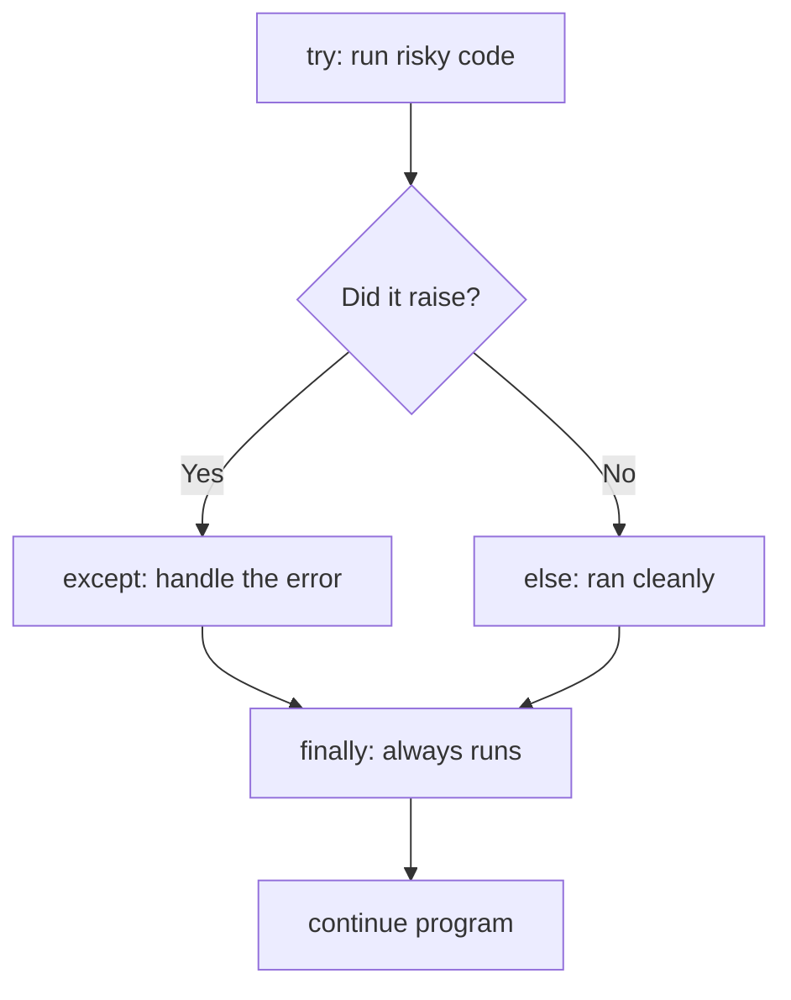

# Month 03 — Python Fluency

**Phase: Foundations**

## Overview

For two months you have been a power user of other people's programs. In Month 1 you learned the command line and Git; in Month 2 you learned to speak HTTP and JSON, poking at APIs with `curl`, `httpie`, and `jq`. You have been *running* commands. This month you start *writing* programs.

Python is the choice for one reason above all: it is the lingua franca of the AI ecosystem. Nearly every model SDK, agent framework, and tutorial you touch for the rest of this course speaks Python first. Learning it now means the agentic work in Months 4 through 12 is about ideas, not syntax. We spend a whole month on the language before any of it touches a network, because an agent is ultimately a Python program in a loop — and you cannot write that loop until you can write a program.

This is a "the language itself" month: **no HTTP calls, no API keys, no AI.** That is intentional. Month 4 reintroduces the network from inside your own code. By keeping the network out, we remove a whole category of confusing failure (Is it my code? The network? The API?) so that when a `Traceback` appears, it is *your* logic — and you learn to read it without fear.

The throughline is the standard library. Python ships with batteries: JSON, CSV, file paths, argument parsing, dates — all built in. You will lean on it hard, add exactly one external tool (`uv`) to manage your projects, and finish by shipping a real multi-tool command-line application you would actually use.

Here is the mental model for what "running a program" actually does — the loop you will repeat hundreds of times this month:


*Notice: the interpreter only ever does one of two things — print output, or print a traceback. A traceback is feedback, not failure, and it sends you right back to the editor.*

## Prerequisites

Coming in, you should be able to do everything from Months 1 and 2:

- Navigate the filesystem, create and edit files, and run commands in zsh on macOS (Month 1).
- Use Git locally and push to GitHub: `init`, `add`, `commit`, `push`, branches (Month 1).
- Read and reason about HTTP and JSON — you know what a JSON object, array, string, and number look like, and you can pretty-print JSON with `jq` (Month 2).
- Install software with Homebrew (`brew install ...`).

You do **not** need any prior programming experience. This is your first language.

## Warm-Up: Retrieve Before You Begin

Before reading on, answer these from memory — no peeking at earlier months. This pulls forward the prior skills this month builds on.

1. In the shell, how do you run a script you wrote, and how is that different from typing commands one at a time? (Month 1)
2. What does a JSON *object* look like, and what does a JSON *array of objects* look like? Sketch one of each. (Month 2)
3. When you piped a command into `jq` in Month 2, which stream carried the data — `stdout` or `stderr`? (Months 1–2)
4. What command creates a Git commit, and what does a commit actually capture? (Month 1)

<details><summary>Check your recall</summary>

1. You save commands in a file and run it (e.g. `./script.sh` or `bash script.sh`); a script is repeatable and version-controlled, whereas typed commands vanish. (Month 1) This is the exact leap you make again here, from the REPL to a `.py` file.
2. An object is `{"name": "Ada", "age": 36}` — keys mapped to values; an array of objects is `[{"name": "Ada"}, {"name": "Grace"}]`. (Month 2) That array-of-objects shape becomes a Python **list of dicts** this month.
3. `stdout` carried the data; `stderr` is for errors and diagnostics. Keeping them separate is what let piping work. (Months 1–2) Your tools this month preserve that split.
4. `git commit -m "..."` records a snapshot of the staged changes with a message. (Month 1) You will commit each lab.
</details>

## Learning Objectives

By the end of this month you can:

1. **Write and run** a Python program from a file as a real, repeatable command, not just lines typed into a REPL.
2. **Choose** the correct built-in data structure (list, dict, set, tuple) for a given problem and explain the tradeoff.
3. **Implement** control flow and functions, and refactor repeated logic into reusable functions with clear inputs and outputs.
4. **Transform** data with comprehensions where they improve clarity over a loop.
5. **Read and write** files, and round-trip data through JSON and CSV using only the standard library.
6. **Handle** errors deliberately with `try`/`except`/`raise`, distinguishing recoverable from fatal conditions.
7. **Build** a command-line tool that accepts arguments via `argparse` and behaves like a well-mannered Unix program (exit codes, `stderr`, `--help`).
8. **Manage** a Python project with `uv`: create it, add dependencies, run it, and read its `pyproject.toml`.
9. **Read** a `Traceback` top-to-bottom and fix the line it points to without guessing.

## Tech Stack (free, macOS)

| Tool | Install | Why |
|---|---|---|
| Python 3.12+ | `uv python install 3.12` (uv manages it) | The language. We never use the system Python directly. |
| uv | `brew install uv` | Fast, modern project + environment + version manager. One tool replaces `python -m venv`, `pip`, and `pyenv`. |
| VS Code | `brew install --cask visual-studio-code` | Free editor. Install the official **Python** extension for inline errors and the Run button. |
| Git + GitHub | from Month 1 | You will commit each lab and push the milestone repo. |

No paid services, no API keys, no LLM access is required this month. Everything runs offline on Apple Silicon or Intel.

A note on `uv` over `venv`/`pip`: the older path (`python -m venv .venv`, `source .venv/bin/activate`, `pip install`) still works and you should recognize it. But `uv` is faster, manages Python *versions* as well as packages, and produces a clean `pyproject.toml` and lockfile by default — which is exactly the project hygiene the rest of this course assumes. We teach `uv` as the canonical toolchain and explain the `pip` concepts underneath so the vocabulary transfers.

## Weekly Breakdown

Budget ~8–12 hours per week: roughly half reading and typing along, half doing the lab.

### Week 1 — The language core
**Warm-start (do this first):** before any new material, open the last shell script you wrote in Month 1, re-run it, and read it line by line. Notice it is a *file of commands you run on demand* — exactly what a `.py` program is. You are about to write the same idea in a more powerful language.
**Focus:** going from REPL to a runnable file; the primitive types and control flow.
**Topics:** the REPL vs. a `.py` file; variables and dynamic typing; `int`, `float`, `str`, `bool`, `None`; f-strings; `if`/`elif`/`else`; `for` and `while`; `range`; truthiness; `def` functions, parameters, return values, and default arguments.
**Reading:** Core Concepts §1–§3 below; the official tutorial sections 3–4.
**Build:** Lab 1, part 1 — small programs that compute and branch.

### Week 2 — Data structures and comprehensions
**Focus:** the four core collections and when each is the right tool.
**Topics:** `list` (ordered, mutable), `dict` (key→value lookup), `set` (uniqueness, membership), `tuple` (fixed, immutable records); indexing and slicing; iterating with `enumerate` and `items()`; list/dict/set comprehensions; nesting (a list of dicts is *the* shape of tabular data).
**Reading:** Core Concepts §4–§5.
**Build:** Lab 1, part 2 — transform and summarize a dataset held in memory.

### Week 3 — Files, JSON, CSV, and errors
**Focus:** programs that read the outside world and survive bad input.
**Topics:** `pathlib.Path`; opening files with `with`; reading and writing text; the `json` module (`load`/`dump`, `loads`/`dumps`); the `csv` module (`DictReader`/`DictWriter`); the exception model; `try`/`except`/`else`/`finally`; raising your own errors; recoverable vs. fatal.
**Reading:** Core Concepts §6–§7.
**Build:** Lab 2 — a JSON/CSV round-trip tool that does not crash on missing or malformed files.

### Week 4 — Real programs and the Toolbelt
**Focus:** turning scripts into installable command-line tools and packaging them.
**Topics:** `if __name__ == "__main__"`; `argparse` (positional args, options, `--help`, types, defaults); exit codes and `sys.stderr`; project layout with `uv init`; `uv add`, `uv run`, and reading `pyproject.toml`; `console_scripts` entry points.
**Reading:** Core Concepts §8–§9.
**Build:** Lab 3 — the **Toolbelt** milestone: three CLI utilities in one packaged repo.

## Core Concepts

### §1 — The REPL, the file, and "running a program"

Open a Python prompt by typing `uv run python` in a project (more on projects later) or just `python3` to experiment. This is the **REPL** — Read, Evaluate, Print, Loop. Type `2 + 2`, press return, and it prints `4`. The REPL is a calculator with the full language behind it; it is where you *explore*. But a REPL session vanishes when you close it.

A **program** lives in a file. Put this in `hello.py`:

```python
name = "Ada"
print(f"Hello, {name}!")
```

Run it with `python3 hello.py`. The difference is everything: a file is repeatable, version-controllable, and shareable. From here on, "write a program" means "put code in a `.py` file and run it." The REPL is for trying a single expression to see what it does.

`print()` writes to the screen. The `f"..."` is an **f-string** — Python substitutes `{name}` with the value of the variable. F-strings are the modern, readable way to build text and you will use them constantly.

### §2 — Variables and types

`name = "Ada"` binds the name `name` to a string value. Python is **dynamically typed**: you never declare a type, and a name can be rebound to a different type later. But values absolutely have types, and mixing them wrongly is an error you will see often:

```python
age = 11            # int
height = 1.45       # float
name = "Ada"      # str
is_student = True   # bool
nothing = None      # the absence of a value
```

`None` is special: it means "no value here yet" and is what a function returns if you do not `return` anything. The classic beginner trap is the gap between a string and a number: `"11" + 1` raises a `TypeError`, because you cannot add text to a number. Convert explicitly with `int("11")` or `str(11)`. The *why*: Python refuses to guess what you meant, which feels strict but prevents whole categories of silent bugs.

> **Common misconception.** `=` and `==` are interchangeable ways to compare values.
> **Reality.** `=` *assigns* (`age = 11` binds the name); `==` *compares* (`age == 11` asks a true/false question). The single `=` feels like the math "equals," which is exactly why it is tempting — but in Python they are different operators, and using `=` where you meant `==` is a `SyntaxError` inside an `if`.

### §3 — Control flow and functions

Decisions use `if`/`elif`/`else`; repetition uses `for` and `while`. Indentation — four spaces — is not cosmetic in Python; it *is* the block structure.

> **Common misconception.** Indentation in Python is just style, like it is in most languages — the program would run the same if I lined things up differently.
> **Reality.** Indentation *is the syntax*: it defines which lines belong to a block. Move a line in or out by four spaces and you change what the program does (or get an `IndentationError`). It is tempting to treat whitespace as cosmetic because that is true in C or JavaScript, where braces `{}` mark blocks — Python uses the whitespace itself.

```python
def grade(score):
    if score >= 90:
        return "A"
    elif score >= 80:
        return "B"
    else:
        return "needs work"

for s in [95, 82, 60]:
    print(s, "->", grade(s))
```

A **function** packages logic behind a name with inputs (parameters) and an output (`return`). The moment you write the same few lines twice, that is the signal to make a function. Functions are the first real tool of software engineering: they let you name an idea, test it in isolation, and reuse it. Give them verb-like names (`grade`, `load_notes`, `convert`) and keep each one doing one thing.

A subtlety worth learning early: **truthiness.** `if items:` is true when the list is non-empty and false when empty; `0`, `""`, `[]`, `{}`, and `None` are all "falsy." This is idiomatic Python — prefer `if not items:` over `if len(items) == 0:`.

### §4 — The four core data structures

> **Heavy concept ahead.** Slow down here; this is the load-bearing idea of the month. Choosing the right container — and understanding that some of them can change in place while others cannot — underlies every lab and every program you write after this.

This is the heart of the month. Picking the right container is most of what makes code clean.

- **`list`** — an *ordered, changeable* sequence: `["a", "b", "c"]`. Use it when order matters and you will add or remove items. Index from zero (`items[0]`), slice (`items[1:3]`), append (`items.append(x)`).
- **`dict`** — a *key→value* map: `{"name": "Ada", "age": 11}`. Use it when you look things up *by name* rather than by position. This is Python's workhorse and, not coincidentally, the in-memory shape of a JSON object.
- **`set`** — an *unordered collection of unique things*: `{"a", "b"}`. Use it for membership tests (`x in seen`) and for de-duplication. Asking "have I seen this before?" is a set's whole job, and it answers fast.
- **`tuple`** — an *ordered, fixed* sequence: `(40.7, -74.0)`. Use it for a small fixed record that should not change, like a coordinate pair. Because it is immutable, it can be a dict key where a list cannot.

The decision rule: *order + change* → list; *lookup by name* → dict; *uniqueness/membership* → set; *fixed record* → tuple. Most real data ends up as **a list of dicts** — exactly what `csv.DictReader` and a JSON array of objects give you, which is why this shape recurs all month.

The split that trips up every beginner is **mutability** — whether a value can be changed in place after it is created. A `list`, `dict`, and `set` are **mutable** (you can append, reassign a key, add a member); a `tuple`, `str`, `int`, and `bool` are **immutable** (any "change" actually makes a new value). This is *why* a tuple can be a dict key and a list cannot, and it is the source of a whole class of surprising bugs.


*Notice: with mutable types, `b = a` makes two names for the **same** object — `a.append(1)` shows up in `b` too. With immutable types you never get that surprise.*

> **Common misconception.** A list and a tuple are basically the same thing — just different brackets — so they are interchangeable.
> **Reality.** They look alike (`[1, 2]` vs `(1, 2)`), which is exactly why this is tempting. But a list is *mutable* and a tuple is *immutable*: you can `append` to a list, never to a tuple, and only a tuple can be a `dict` key or live in a `set`. Reach for a tuple when the record is *fixed* (a coordinate, a row that must not change); reach for a list when you will grow or reorder it.

### §5 — Comprehensions

A comprehension builds a collection from another collection in one expressive line:

```python
nums = [1, 2, 3, 4, 5]
squares = [n * n for n in nums]            # [1, 4, 9, 16, 25]
odds = [n for n in nums if n % 2]          # [1, 3, 5]
by_square = {n: n * n for n in nums}       # {1: 1, 2: 4, ...}
```

Read it left-to-right as "give me `n*n` for each `n` in `nums`." Comprehensions are idiomatic and often clearer than the equivalent `for` loop with `.append()`. The *why* and the caution: use them when the transformation is simple. If you need multiple steps, nested conditions, or side effects, a plain loop is more readable — clarity beats cleverness.

### §6 — Files, JSON, and CSV

Programs become useful when they read and write the outside world. Use `pathlib` for paths and the `with` statement for files — `with` guarantees the file is closed even if an error occurs:

```python
from pathlib import Path

note = "remember to commit"
Path("notes.txt").write_text(note + "\n")
print(Path("notes.txt").read_text())
```

For structured data, the standard library has you covered — no installs needed. **JSON** maps directly onto Python: object→dict, array→list, string→str, number→int/float, `true`→`True`, `null`→`None`.

```python
import json
data = {"tasks": ["a", "b"], "done": False}
text = json.dumps(data, indent=2)          # Python -> JSON string
back = json.loads(text)                     # JSON string -> Python
```

`dump`/`load` work on file objects; `dumps`/`loads` work on strings (the `s` is for *string*). **CSV** is rows of cells; `csv.DictReader` turns each row into a dict keyed by the header — the list-of-dicts shape again — and `DictWriter` writes it back. This JSON↔CSV round-trip is the core of Lab 2.

### §7 — Errors: recoverable vs. fatal

A `Traceback` is not a scolding; it is a map. Read it **bottom-up**: the last line names the exception and message (`ValueError: invalid literal for int()`), and the lines above show exactly which line in which file raised it. Most "I'm stuck" moments dissolve once you actually read that bottom line.

You handle expected failures with `try`/`except`:

```python
try:
    count = int(user_value)
except ValueError:
    print("That wasn't a number; using 0.", file=sys.stderr)
    count = 0
```

The discipline: catch *specific* exceptions you can recover from, not a bare `except:` that swallows everything (including bugs and Ctrl-C). A missing optional file might be **recoverable** — fall back to a default. A required file that is corrupt is **fatal** — print a clear message and exit non-zero. You can also `raise ValueError("explain what's wrong")` to signal a problem you cannot handle locally. Good error handling is the difference between a tool that crashes with a wall of red and one that says "I couldn't read config.json — is it valid JSON?" and exits cleanly.

The full shape — `try`/`except`/`else`/`finally` — routes control depending on whether the risky code raised:


*Notice: `else` runs only on success, `except` only on failure, but `finally` runs either way — it is for cleanup you must not skip.*

### §8 — A script that behaves like a real program

Two conventions turn a script into a tool. First, the guard:

```python
def main():
    ...

if __name__ == "__main__":
    main()
```

`__name__` is `"__main__"` only when the file is run directly, not when it is imported. This lets a file be both a runnable program *and* a reusable module — a pattern every Python project uses.

Second, **`argparse`** gives you arguments, types, defaults, and a `--help` screen for free:

```python
import argparse

def main():
    p = argparse.ArgumentParser(description="Greet someone")
    p.add_argument("name")
    p.add_argument("--count", type=int, default=1)
    args = p.parse_args()
    for _ in range(args.count):
        print(f"Hi {args.name}")

if __name__ == "__main__":
    main()
```

A well-mannered Unix tool also uses **exit codes** (`sys.exit(1)` on failure) and writes errors to **`stderr`**, not `stdout`, so that piping (`mytool | jq` from Month 2) keeps clean data on `stdout`. These habits make your tools composable with everything you learned in Months 1 and 2.

### §9 — Projects with uv

A real project is more than a loose file. `uv` scaffolds one:

```zsh
uv init toolbelt && cd toolbelt
uv add rich            # adds a dependency, writes it to pyproject.toml, locks it
uv run python -m toolbelt --help
```

`uv init` creates `pyproject.toml` — the **manifest** that declares your project's name, Python version, and dependencies — plus an isolated virtual environment so your project's packages never collide with another project's. `uv add` is the modern `pip install` that also *records* the dependency in the manifest (the old way, `pip install rich`, installed it but forgot it the moment you closed the terminal). `uv run` executes a command inside that environment. Reading a `pyproject.toml` and understanding its `[project]` and `dependencies` sections is a skill you will use in every Python repo for the rest of the course.

## Labs

| Lab | Title | Time | Difficulty |
|---|---|---|---|
| [Lab 1](lab-1-language-core-and-data-structures.md) | Language Core and Data Structures | ~3.5 hrs | Intro |
| [Lab 2](lab-2-files-json-csv-and-errors.md) | Files, JSON, CSV, and Error Handling | ~3.5 hrs | Core |
| [Lab 3](lab-3-build-the-toolbelt-cli.md) | Build the Toolbelt CLI (Milestone) | ~5 hrs | Core / Stretch |

## Checkpoints & Self-Assessment

Run these against yourself at the end of each week. You are on track if you can answer without looking it up.

- **Week 1:** Without copying, write a `hello.py` that takes no input, defines a function, and prints a branched result. Can you explain why `"11" + 1` fails?
- **Week 2:** Given a list of dicts (people with names and ages), can you, in the REPL, build a list of just the names and a set of the unique ages — using comprehensions?
- **Week 3:** Write a five-line program that reads a JSON file and prints one field. Now point it at a file that does not exist. Does it crash with a `Traceback`, or print a clean message? Make it the latter.
- **Week 4:** Run `uv run mytool --help` on your own tool and get a sensible help screen. Can you point to the line in `pyproject.toml` that declares a dependency?

## Reflect

Spend ten minutes on these in your learning log (writing, not just thinking):

- **Explain it back:** In two or three sentences, explain the difference between a mutable type (list, dict, set) and an immutable type (tuple, str, int) as if teaching a peer who just finished Month 2.
- **Connect:** How does writing a `.py` program and running it with `uv run` change or extend the shell scripts you wrote in Month 1? What can Python do that a shell one-liner gets clumsy at?
- **Connect:** The list-of-dicts shape is the same data you met as a JSON array of objects in Month 2. Where in this month did that shape show up, and why does it keep recurring?
- **Monitor:** Which concept this month is still fuzzy — comprehensions, mutability, `try`/`except`, or `argparse`? Name it precisely, and write the one question that would clear it up.

## Month-End Assessment

**Deliverable:** the **Toolbelt** — a single `uv`-managed repository containing three command-line utilities, each solving a real problem with clean I/O and graceful error handling, plus a real `pyproject.toml` and a `README.md`. The three tools (built in Lab 3):

1. **`csv2json`** — converts a CSV file to JSON (and prints to stdout or a file).
2. **`dirsize`** — reports the total size of a directory and its largest entries, human-readable.
3. **`note`** — appends a timestamped line to a notes file and can list recent notes.

Each tool: accepts arguments via `argparse`, has a working `--help`, reads input, handles errors gracefully (missing file, bad input) with a clear message and non-zero exit code, and prints clean output. The repo is pushed to GitHub.

**Rubric**

- **Passing:** All three tools run and produce correct output on valid input. Each has `argparse` with `--help`. At least one error path (e.g., missing file) is handled without a raw `Traceback`. `pyproject.toml` exists and `uv run` works. README explains how to install and run each tool. Repo is on GitHub.
- **Excellent:** All of the above, plus: errors go to `stderr` with non-zero exit codes; tools are composable (output of `csv2json` pipes cleanly into `jq`); code is factored into small functions with a `main()` guard; no bare `except:`; tools installed as real commands via `console_scripts` entry points so you can run `csv2json file.csv` directly; and a short docstring or comment explains each module's purpose.

The real definition of done is behavioral: **you reach for Python instead of a shell one-liner when the logic gets complex, and a `Traceback` no longer scares you — you read the bottom line and fix it.**

## Common Pitfalls

- **Editing the system Python.** macOS ships its own Python; never `pip install` into it or rely on it. Let `uv` manage the version per project. If `python3` points somewhere surprising, that is why — use `uv run python`.
- **`IndentationError` and tabs vs. spaces.** Python blocks are indentation. Set your editor to insert 4 spaces, never tabs. VS Code's Python extension does this for you.
- **Mutable default arguments.** `def f(items=[])` reuses the *same* list across calls — a classic bug. Use `def f(items=None)` and create the list inside.
- **Off-by-one and zero-indexing.** `items[len(items)]` is always an `IndexError`; the last element is `items[-1]`. Slices are half-open: `items[1:3]` gives indices 1 and 2, not 3.
- **Bare `except:`.** It hides real bugs and even swallows Ctrl-C. Always name the exception you expect.
- **Forgetting the `__main__` guard.** Without it, code runs the moment a file is imported, causing surprises later when files import each other.
- **Confusing `=` and `==`.** `=` assigns; `==` compares. Python will not let you assign inside an `if`, which catches some of this for you.
- **Comparing JSON booleans.** JSON `true`/`false`/`null` become Python `True`/`False`/`None` (capitalized). Lowercase `true` is a `NameError`.

## Knowledge Check

Answer from memory first, then check. Questions marked ⟲ are spaced callbacks to earlier months — they are supposed to feel like a stretch.

1. State the one-sentence rule for choosing each of the four core data structures (list, dict, set, tuple).
2. Predict the output:
   ```python
   a = [1, 2, 3]
   b = a
   b.append(4)
   print(a)
   ```
   Why is the answer surprising, and what concept explains it?
3. What is the difference between `=` and `==`, and where would each appear?
4. Spot the bug: `def f(items=[]): items.append(1); return items`. Why does calling `f()` repeatedly return a growing list?
5. You read a CSV with `csv.DictReader` and the `age` field prints as `'36'`, not `36`. Why, and how do you fix it?
6. When should you let a program crash with a `Traceback`, and when should you catch the exception and recover? Give one example of each.
7. Which tool and why: you need to convert a CSV file to JSON for a teammate. Do you reach for `jq`, a Python script, or a spreadsheet — and what makes your choice composable?
8. In `argparse`, what does `nargs="?"` with a `default` give you, and what does `nargs="+"` give you?
9. ⟲ In a well-behaved Unix tool, which stream gets the data and which gets the error messages — and why does that split matter when you pipe into `jq`? (Months 1–2)
10. ⟲ Write the JSON for an array of two objects, each with a `name` and an `age`. What Python type does that become after `json.loads`? (Month 2)
11. ⟲ What `git` commands take a brand-new project from "files on disk" to "pushed to GitHub"? (Month 1)
12. What does `if __name__ == "__main__":` protect against, and why does every project use it?

<details><summary>Answer key</summary>

1. *order + change* → list; *lookup by name* → dict; *uniqueness/membership* → set; *fixed record* → tuple.
2. Prints `[1, 2, 3, 4]`. `b = a` did not copy the list — both names point at the *same* mutable object, so appending through `b` is visible through `a`. (Mutability / shared references, §4.)
3. `=` assigns a value to a name; `==` compares two values and yields `True`/`False`. `=` appears in statements; `==` appears in conditions like `if x == 1:`.
4. The default `[]` is created *once* when the function is defined and reused on every call, so it accumulates. Fix with `def f(items=None): items = items or []`.
5. CSV has no types — every cell is text. Convert explicitly with `int(row["age"])` (use the recoverable `to_int` pattern to survive bad values).
6. Crash (or exit non-zero) on *fatal* problems you cannot proceed without — e.g. a required input file is missing. Recover on *expected, local* problems — e.g. one row has a non-numeric age; warn and use a default.
7. A Python script, because the logic (typing, error handling, options) outgrows a `jq` one-liner; keep JSON on `stdout` and messages on `stderr` so it pipes cleanly into `jq`.
8. `nargs="?"` makes one optional positional arg that uses the `default` when omitted; `nargs="+"` collects one-or-more values into a list.
9. Data goes to `stdout`, errors/diagnostics to `stderr`. Piping (`tool | jq`) reads `stdout`, so keeping errors off `stdout` means the pipe never gets polluted with non-JSON text. (Months 1–2)
10. `[{"name": "Ada", "age": 36}, {"name": "Grace", "age": 40}]`; it becomes a Python **list of dicts**. (Month 2)
11. `git init`, `git add -A`, `git commit -m "..."`, then create the remote and `git push -u origin main` (or `gh repo create ... --push`). (Month 1)
12. It stops top-level code from running when the file is *imported* (rather than run directly), so a file can be both a runnable program and a reusable module.
</details>

## Further Reading

- [The official Python Tutorial](https://docs.python.org/3/tutorial/) — sections 3–9 cover everything this month, authoritatively and for free.
- [`uv` documentation](https://docs.astral.sh/uv/) — the project/version/dependency manager we use as canonical.
- [`argparse` tutorial](https://docs.python.org/3/howto/argparse.html) — the gentle official intro to command-line arguments.
- [Python `pathlib` docs](https://docs.python.org/3/library/pathlib.html) — the modern, object-oriented way to handle files and paths.
- ["Writing a `pyproject.toml`"](https://packaging.python.org/en/latest/guides/writing-pyproject-toml/) — what each section of the manifest means.

## Author's Notes

We chose `uv` as canonical over `venv`/`pip` for speed and because it unifies version + environment + dependency management — but the README and labs name the `pip` concepts underneath so the vocabulary transfers to any repo the learner meets. The strict "no network" boundary is a deliberate pedagogical guardrail handing off to Month 4: it isolates "is this my logic?" from "is this the network?" so the learner builds confidence reading tracebacks. The Toolbelt tools are intentionally non-AI but reinforce the Month-1/2 Unix-composability ethic (stdin/stdout/stderr, exit codes, piping into `jq`), which pays off when these same conventions reappear in agent harnesses later in the course.
