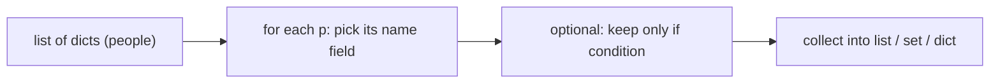

# Lab 1 — Language Core and Data Structures

**Time: ~3.5 hrs · Difficulty: Intro · Builds on: Month 1 (CLI + Git), Month 2 (JSON literacy)**

## Objective

Write your very first Python programs. You will go from typing into the REPL to running a real `.py` file, learn the primitive types and control flow, then build a small program that holds a dataset (a list of dicts) in memory and summarizes it using the four core data structures and comprehensions. By the end you can read, transform, and report on structured data — entirely offline, no installs beyond `uv`.

## Setup

```zsh
# Install uv (skip if you already have it)
brew install uv

# Let uv install a modern Python; we never touch the system Python
uv python install 3.12

# Make a scratch folder for this lab and start a uv project in it
mkdir -p ~/agentic/month-03/lab1 && cd ~/agentic/month-03/lab1
uv init . --python 3.12
```

**Checkpoint:** `uv init` printed that it created files. Run `ls` and you should see `pyproject.toml`, `main.py`, `README.md`, and a `.python-version`. Run `uv run python --version` and you should see `Python 3.12.x`.
**If not:** if `uv: command not found`, run `brew install uv` and open a new terminal so your `PATH` updates. If the version isn't 3.12, run `uv python install 3.12` first, then re-run.

## Background

**Recall first (from memory):** In Month 2, what did a JSON array of objects look like? And in Month 1, how did running a saved script differ from typing commands one at a time? Answer both before reading on — this lab rests on both.

You learned in Month 2 that a JSON array of objects looks like `[{"name": "Ada"}, {"name": "Grace"}]`. In Python that exact shape is a **list of dicts**, and it is the single most common way real data lives in memory. This lab gets you fluent in the pieces — types, loops, functions — and then puts them together on that shape.

## Steps

### 1. Meet the REPL

Start the interactive prompt:

```zsh
uv run python
```

Type each of these and press return, watching what comes back:

```python
2 + 2
"Ada" + " Lovelace"
"11" + 1
len([1, 2, 3])
```

The third line fails on purpose. Read the last line of the error: `TypeError: can only concatenate str (not "int") to str`. Press Ctrl-D to exit.

**Checkpoint:** You saw `4`, then `'Ada Lovelace'`, then a `TypeError`, then `3`. You have now read your first traceback and survived.
**If not:** if nothing happens after you type, you may not be at the `>>>` Python prompt — confirm `uv run python` started the REPL (look for `>>>`). If `2 + 2` gave a `SyntaxError`, you may have a stray character; retype the line.

### 2. Your first program in a file

Open the folder in VS Code (`code .`) and replace the contents of `main.py` with:

```python
name = "Ada"
age = 11

print(f"{name} is {age} years old.")
print(f"Next year {name} will be {age + 1}.")
```

Run it:

```zsh
uv run python main.py
```

**Checkpoint:** You see two lines, the second showing `12`. The number was *computed*, not typed.
**If not:** if you got an `IndentationError`, make sure there are no stray spaces at the start of your lines. If you got a `NameError`, check that `name` and `age` are spelled the same in the assignment and the f-string.

### 3. Types and conversion

Add to `main.py` and re-run:

```python
price = "19.99"          # this is text, not a number
quantity = 3

# Convert the text to a real number before doing math
total = float(price) * quantity
print(f"Total: {total}")
print(f"Type of price is {type(price)}, type of total is {type(total)}")
```

**Checkpoint:** Output shows `Total: 59.97` and reports `<class 'str'>` and `<class 'float'>`. Now temporarily delete the `float(...)` conversion and run again — you'll get a `TypeError`. Restore it. You have just felt *why* Python makes you convert explicitly.
**If not:** if `total` came out as `"19.9919.9919.99"`, you multiplied the *string* `price` by 3 (string repetition) instead of the float — make sure `float(price)` wraps the variable. If you see a `ValueError`, check that `price` is a numeric string like `"19.99"`, not words.

### 4. Branching with a function

Replace `main.py` with a small, reusable function:

```python
def grade(score):
    if score >= 90:
        return "A"
    elif score >= 80:
        return "B"
    elif score >= 70:
        return "C"
    else:
        return "needs work"


for score in [95, 82, 71, 50]:
    print(f"{score} -> {grade(score)}")
```

**Checkpoint:** You see four lines mapping each score to a letter, ending in `50 -> needs work`. Notice the function is defined once and *called* four times inside the loop — that is reuse.
**If not:** if you get an `IndentationError`, every line inside `def` and inside each `if` must be indented one level (4 spaces) deeper than the line above it. If only one line prints, check that the `for` loop is at the left margin (not indented inside the function).

### 5. The four data structures

Create a new file `structures.py` and try each container. Run it after each block (`uv run python structures.py`) so you see what each does:

```python
# list: ordered, changeable
queue = ["build", "test", "ship"]
queue.append("celebrate")
print("first:", queue[0], "| last:", queue[-1], "| all:", queue)

# dict: lookup by name
person = {"name": "Ada", "age": 11}
print("name is", person["name"])
person["age"] = 12          # change a value
print(person)

# set: uniqueness and fast membership
seen = {"a", "b", "a", "c"}   # the duplicate "a" collapses
print("unique:", seen, "| is 'b' in it?", "b" in seen)

# tuple: a fixed record
point = (40.7, -74.0)
lat, lon = point             # unpacking
print(f"lat={lat}, lon={lon}")
```

**Checkpoint:** The list shows four items; the dict shows age `12`; the set has exactly three elements (`a`, `b`, `c`) and reports `True` for membership; the tuple unpacks into two named values.
**If not:** if the set shows four elements, you used a list `[]` (which keeps duplicates) instead of a set `{}`. If `lat, lon = point` raises a `ValueError`, your tuple does not have exactly two values — count the items in `point`.

### 6. The list of dicts — the shape that matters

This is the real skill. Create `report.py`:

```python
people = [
    {"name": "Ada", "age": 36, "role": "engineer"},
    {"name": "Grace", "age": 40, "role": "engineer"},
    {"name": "Alan", "age": 41, "role": "researcher"},
]

# Loop and print
for p in people:
    print(f"{p['name']} ({p['age']}) — {p['role']}")
```

Run it.

**Checkpoint:** Three formatted lines, one per person. This list-of-dicts is exactly what a CSV file or a JSON array becomes once it is loaded — you are practicing the shape you will read from disk in Lab 2.
**If not:** a `KeyError` means a key name in the f-string (`p['name']`) does not match a key in the dicts — check spelling. A `SyntaxError` in the f-string usually means you used double quotes for the key inside a double-quoted string; use single quotes: `f"{p['name']}"`.

### 7. Comprehensions: transform and summarize (the new skill)

A **comprehension** builds a new collection from an existing one in a single expressive line. It is the genuinely new technique of this lab, so we'll learn it in three stages: study a worked one, fill in a faded one, then write one from scratch. The mental model is a small pipeline — take the list of dicts, pull or filter one piece out of each, collect the results:


*Notice: a comprehension is just that pipeline written right-to-left in one line — the `for p in people` is the loop, the leading expression is what you collect, and a trailing `if` is the filter.*

#### Stage 1 — Worked example (I do)

Add this to `report.py` and run it. Read each line against the diagram above — you are not inventing anything yet, just confirming what each piece does:

```python
# A list of just the names: collect p["name"] for every p
names = [p["name"] for p in people]
print("names:", names)

# A set of the distinct roles: same idea, but {} collects uniques
roles = {p["role"] for p in people}
print("distinct roles:", roles)
```

**Checkpoint:** `names` is `['Ada', 'Grace', 'Alan']`; `distinct roles` is a set containing `engineer` and `researcher` (the duplicate `engineer` collapses).
**If not:** a `KeyError` means the key inside `p[...]` is misspelled. If `roles` shows duplicates, you used `[` instead of `{` — square brackets make a list, curly braces make a set.

#### Stage 2 — Faded practice (we do)

Now you fill in the blanks. Here is the skeleton — replace each `____` so the behavior matches the comment, then run:

```python
# A list of ONLY the engineers' names (filter with a trailing if)
engineers = [p["name"] for p in people if p["____"] == "____"]
print("engineers:", engineers)

# A dict mapping each name -> that person's age
ages = {p["name"]: p["____"] for p in people}
print("ages:", ages)
```

**Checkpoint:** `engineers` is `['Ada', 'Grace']` and `ages` is `{'Ada': 36, 'Grace': 40, 'Alan': 41}`.
**If not:** if `engineers` lists everyone, your `if` condition isn't filtering — it should read `if p["role"] == "engineer"`. If the dict raises a `SyntaxError`, make sure you used `key: value` (a colon) inside the `{}`.

#### Stage 3 — Independent (you do)

No skeleton this time — only the goal. Add one more line to `report.py` that prints the **average age** of all people. The definition of done: it prints `average age: 39.0`, and you use the built-ins `sum(...)` and `len(people)` with a comprehension or generator over `people`. (Hint: you need the sum of every `p["age"]`, divided by how many people there are.)

**Checkpoint:** Running `report.py` now prints, in order: the name list, the distinct-roles set, the engineers list, the name→age dict, and `average age: 39.0`.
**If not:** if you get a `TypeError: unsupported operand`, you are probably dividing by the list instead of `len(people)`. If the average is an integer, that's fine — `39.0` and `39` are the same value; Python prints the float form here.

### 8. Commit your work

```zsh
cd ~/agentic/month-03/lab1
git init
echo ".venv/" >> .gitignore
git add -A
git commit -m "Month 3 Lab 1: Python language core and data structures"
```

**Checkpoint:** `git log --oneline` shows one commit. (You don't have to push this practice lab, but committing builds the habit.)
**If not:** if `git commit` reports "nothing to commit," you skipped `git add -A` — stage first, then commit. If Git complains about identity, set it once with `git config --global user.email "you@example.com"` and `git config --global user.name "Your Name"`.

## Definition of Done

You are done when:

- [ ] `uv run python main.py` prints a computed result (not a hardcoded one).
- [ ] You can explain out loud why `"11" + 1` raises a `TypeError`.
- [ ] `uv run python structures.py` demonstrates a list, dict, set, and tuple, and you can state the one-sentence rule for choosing each.
- [ ] `uv run python report.py` prints, from a single list of dicts: a list of names, a filtered list, a set of roles, a name→age dict, and an average — using comprehensions.
- [ ] The work is committed with Git.

Self-verify in one shot:

```zsh
uv run python report.py
```

You should see five summary lines and no traceback.

**Self-explain:** in one sentence, why does a comprehension like `[p["name"] for p in people]` produce a new list without you ever writing `.append()`?

## Stretch Goals

1. Add a `youngest` lookup: find the person with the minimum age (hint: `min(people, key=lambda p: p["age"])`) and print their name.
2. Add a `count_by_role` dict that maps each role to how many people have it, using a plain `for` loop (then try to express it more cleverly and decide which reads better).
3. Write a `describe(person)` function that returns a formatted string, and rebuild the Step 6 loop to call it — practice extracting a function.
4. Add a fourth person via a list `.append({...})` and confirm every summary updates with no other code changes — that is the payoff of writing it generally.

## Troubleshooting

- **`IndentationError: unexpected indent`** — a line has leading spaces it shouldn't, or a block is inconsistently indented. Use 4 spaces per level, never tabs. In VS Code, "Convert Indentation to Spaces" from the command palette fixes a mixed file.
- **`KeyError: 'naem'`** — you misspelled a dict key. The error names the key it couldn't find; check your spelling against the data.
- **`NameError: name 'people' is not defined`** — you're running a file that doesn't define `people`, or you defined it below where you used it. Define data before you use it; Python reads top to bottom.
- **`SyntaxError`** near an f-string — you probably used the same quote inside and outside, e.g. `f"{p["name"]}"`. Use single quotes for the key inside a double-quoted f-string: `f"{p['name']}"`.
- **`uv: command not found`** — `brew install uv`, then open a new terminal so your `PATH` updates.
