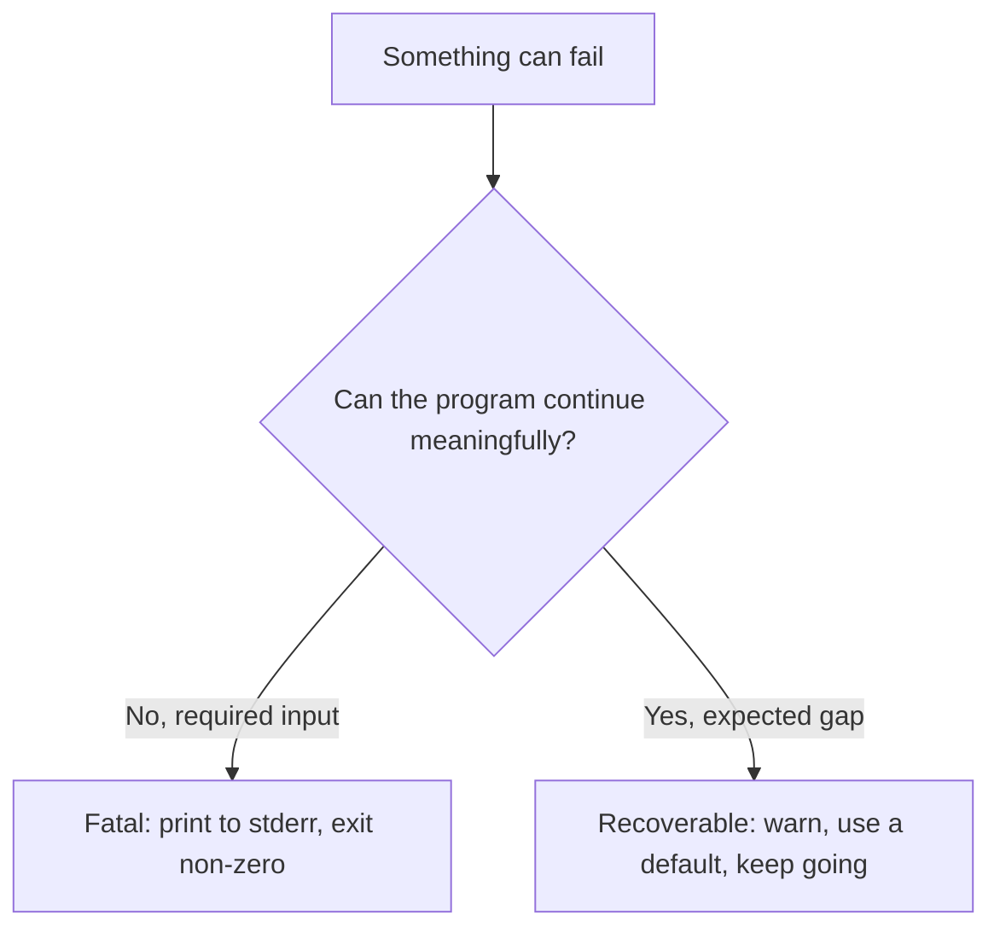

# Lab 2 — Files, JSON, CSV, and Error Handling

**Time: ~3.5 hrs · Difficulty: Core · Builds on: Lab 1**

## Objective

Move your programs out of memory and into the real world: read files from disk, write them back, and round-trip data through JSON and CSV using only the standard library. Then make your code *robust* — when a file is missing or malformed, your program should explain the problem clearly and exit with a sensible code instead of vomiting a raw `Traceback`. These two skills (real I/O and deliberate error handling) are the backbone of every CLI tool you build in Lab 3.

## Setup

```zsh
mkdir -p ~/agentic/month-03/lab2 && cd ~/agentic/month-03/lab2
uv init . --python 3.12
git init && echo ".venv/" >> .gitignore
```

Create a sample CSV to work with. Paste this into a file called `people.csv`:

```csv
name,age,role
Ada,36,engineer
Grace,40,engineer
Alan,41,researcher
```

**Checkpoint:** `ls` shows `people.csv` and the `uv` project files. `cat people.csv` prints the four lines above.
**If not:** if `uv init` errored, you may already have project files in this folder — run it in a fresh empty directory. If `cat` shows nothing, you saved the file empty; paste the four lines again.

## Background

**Recall first (from memory):** From Lab 1, what Python type is "a list of dicts," and why is it the shape real tabular data lives in? And from Month 2, which `jq` filter pulled a field out of every object in a JSON array? Answer before reading on.

In Month 2 you used `jq` to pretty-print JSON and you read CSV-style data by eye. Now you do both from inside Python. The mental model from Lab 1 pays off here: `csv.DictReader` hands you a **list of dicts**, and `json.dumps` turns a list of dicts into a JSON string. JSON and CSV are just two on-disk encodings of the same in-memory shape, and converting between them is mostly plumbing:


*Notice: the data changes encoding (CSV text → Python objects → JSON text) but the **shape** — a list of dicts — is the same at every Python step. That is what "round-trip" means.*

The second half is the part that separates a script from a tool: input from the outside world is *untrusted*. Files go missing, JSON gets truncated, numbers arrive as text. A good program anticipates this.

## Steps

### 1. Read and write a plain text file

Create `files.py`:

```python
from pathlib import Path

# Write text (this creates or overwrites the file)
Path("hello.txt").write_text("first line\nsecond line\n")

# Read it all back
content = Path("hello.txt").read_text()
print("Whole file:")
print(content)

# Read line by line, stripped of the trailing newline
print("Line by line:")
for line in Path("hello.txt").read_text().splitlines():
    print("->", line)
```

Run with `uv run python files.py`.

**Checkpoint:** You see the two lines printed twice — once as a block, once prefixed with `->`. A `hello.txt` file now exists (`cat hello.txt` confirms).
**If not:** a `FileNotFoundError` here is unusual since `write_text` creates the file — check you are running from the lab2 folder (`pwd`). If only one block printed, confirm the `for` loop is at the left margin, not indented.

### 2. Appending instead of overwriting

`write_text` replaces the whole file. To *add* to a file you open it in append mode. Add to `files.py`:

```python
with Path("log.txt").open("a") as f:      # "a" = append; "w" would overwrite
    f.write("a new entry\n")

print("log.txt now has", len(Path("log.txt").read_text().splitlines()), "lines")
```

Run it **three times** and watch the count climb.

**Checkpoint:** The reported line count increases by one on each run (1, then 2, then 3). The `with` block guarantees the file is closed even if writing fails — that is why we use it. This append pattern is exactly how the `note` tool in Lab 3 works.
**If not:** if the count stays at 1 every run, you opened with `"w"` (overwrite) instead of `"a"` (append). If it jumps by more than one, you have more than one `f.write(...)` in the block.

### 3. CSV in: turn a file into a list of dicts

Create `convert.py`:

```python
import csv
from pathlib import Path

def load_csv(path):
    with Path(path).open(newline="") as f:
        return list(csv.DictReader(f))

rows = load_csv("people.csv")
print(f"Loaded {len(rows)} rows")
print("First row:", rows[0])
print("All names:", [r["name"] for r in rows])
```

Run it.

**Checkpoint:** It reports `Loaded 3 rows`, the first row prints as a dict like `{'name': 'Ada', 'age': '36', 'role': 'engineer'}`, and the names list is `['Ada', 'Grace', 'Alan']`. Note that `age` is the *string* `'36'`, not the number `36` — CSV has no types, everything is text. Remember that.
**If not:** if you loaded 0 rows, your `people.csv` may have only a header or be in another folder — `cat people.csv` to confirm. Garbled rows with blank lines mean you opened the file without `newline=""`; add it as shown.

### 4. JSON out: write the list of dicts to a file

Add to `convert.py`:

```python
import json

text = json.dumps(rows, indent=2)        # list of dicts -> pretty JSON string
Path("people.json").write_text(text)
print("Wrote people.json")
```

Run it, then inspect the result with the Month 2 tool:

```zsh
cat people.json
cat people.json | jq '.[].name'
```

**Checkpoint:** `people.json` contains a nicely indented JSON array of three objects, and `jq` prints the three names. You just built a CSV→JSON converter — the seed of one Toolbelt tool.
**If not:** if `jq` errors with "parse error," the file isn't valid JSON — re-run the script so `json.dumps` writes it fresh, and `cat people.json` to eyeball it. If `jq: command not found`, install it with `brew install jq` (Month 2).

### 5. JSON in: read it back

Round-tripping proves your understanding. Add:

```python
loaded = json.loads(Path("people.json").read_text())
print("Round-tripped", len(loaded), "rows; first name is", loaded[0]["name"])
```

**Checkpoint:** Reports `Round-tripped 3 rows; first name is Ada`. The data made a full trip: CSV file → Python list of dicts → JSON file → Python list of dicts. The encodings differ; the shape is identical.
**If not:** a `JSONDecodeError` means `people.json` wasn't written correctly in Step 4 — re-run that step first. A `KeyError: 'name'` means the JSON isn't the list-of-dicts you expect; `cat people.json` to check.

### 6. Deliberate error handling (the new skill)

The genuinely new technique in this lab is **handling errors on purpose** instead of letting the program crash. We'll build it in three stages: first watch a crash and read its traceback (worked), then fill in a guard that catches the *fatal* case (faded), then write a recovery for a *recoverable* case from scratch (independent).

#### Stage 1 — Worked example (I do): read a traceback

Temporarily change the filename to one that doesn't exist:

```python
rows = load_csv("nope.csv")    # this file isn't there
```

Run it and read the output carefully, bottom line first.

**Checkpoint:** You get a `Traceback` ending in `FileNotFoundError: [Errno 2] No such file or directory: 'nope.csv'`. The lines above it point at the exact line in `convert.py` where the open failed. This is the map. Now we'll make the program handle it gracefully. **Change the filename back to `people.csv` before continuing.**
**If not:** if you got a *different* error (e.g. `NameError`), you may have edited the wrong line — only the filename string should change. Read the bottom line of whatever traceback you got; it names the real problem.

The decision you are about to encode is the heart of error handling — does the program stop, recover, or clean up?


*Notice: a missing required file is fatal (Stage 2); a single unparseable value is recoverable (Stage 3). Same machinery, opposite response.*

#### Stage 2 — Faded practice (we do): handle the fatal missing-file case

Rewrite `load_csv` to fail *cleanly* instead of crashing. Most of it is given — fill in the two `____` blanks so a missing file prints to `stderr` and exits with a failure code:

```python
import csv
import json
import sys
from pathlib import Path


def load_csv(path):
    p = Path(path)
    if not p.exists():
        print(f"error: no such file: {path}", file=____)   # send to the error stream
        sys.exit(____)                                      # a non-zero code signals failure
    with p.open(newline="") as f:
        return list(csv.DictReader(f))


def main():
    rows = load_csv("people.csv")
    Path("people.json").write_text(json.dumps(rows, indent=2))
    print(f"Converted {len(rows)} rows -> people.json")


if __name__ == "__main__":
    main()
```

The first blank is `sys.stderr` (errors must not pollute `stdout`); the second is `1` (any non-zero code means failure). Run it normally (`uv run python convert.py`), then run it after temporarily renaming the input (`mv people.csv hidden.csv`), then restore it (`mv hidden.csv people.csv`).

**Checkpoint:** With the file present you get `Converted 3 rows -> people.json`. With it missing you get a single clean line `error: no such file: people.csv` — and crucially, no traceback. Verify the exit code reflects failure:

```zsh
mv people.csv hidden.csv
uv run python convert.py ; echo "exit code: $?"
mv hidden.csv people.csv
```

You should see `exit code: 1`. Errors went to `stderr`, and the program signaled failure. That is a well-behaved Unix program.
**If not:** if you saw `exit code: 0` despite the missing file, your `sys.exit(1)` blank is wrong or never reached — confirm the `if not p.exists():` branch runs. If a traceback appeared, the guard isn't catching it; check indentation of the `if` block.

#### Stage 3 — Independent (you do): recover from a bad value

No skeleton this time. The goal: write a function `to_int(value, default=0)` in a new file `safe_number.py` that returns `int(value)` when the text is numeric, but **catches `ValueError`** and returns `default` (after printing a warning to `stderr`) when it isn't. Then loop over `["36", "forty", "5"]` and print `to_int(raw)` for each. Definition of done: it prints `36`, warns about `'forty'` and yields `0`, then prints `5` — and it never crashes. (Hint: this is the *recoverable* branch of the diagram — `try`/`except ValueError`, not `sys.exit`.)

**Checkpoint:** It prints `got: 36`, then a warning to stderr about `'forty'`, then `got: 0`, then `got: 5`. A missing required file was *fatal* (we exited); a single bad value here is *recoverable* (we warned and continued). Knowing which is which is the whole art of error handling.
**If not:** if the whole program crashes on `'forty'`, your `except` clause isn't catching `ValueError` — make sure the `int(value)` call is inside the `try`. If you catch with a bare `except:`, narrow it to `except ValueError:` so real bugs still surface.

### 9. Commit

```zsh
git add -A
git commit -m "Month 3 Lab 2: files, JSON/CSV round-trip, and error handling"
```

**Checkpoint:** `git log --oneline` shows your Lab 2 commit.
**If not:** "nothing to commit" means you skipped `git add -A`. If Git wasn't initialized in this folder, run `git init` first (it was in Setup).

## Definition of Done

You are done when:

- [ ] `uv run python files.py` writes and reads a text file, and the append demo's line count grows each run.
- [ ] `uv run python convert.py` reads `people.csv` and writes a valid `people.json` that `jq` can parse.
- [ ] You demonstrated the full CSV → Python → JSON → Python round-trip and confirmed the data survived.
- [ ] Running the converter on a missing file prints one clean error line to `stderr` and exits with code `1` — no traceback.
- [ ] You can explain, with the `to_int` example, the difference between a recoverable and a fatal error.
- [ ] Work is committed.

Self-verify:

```zsh
uv run python convert.py && cat people.json | jq '. | length'
```

This should print `Converted 3 rows -> people.json` followed by `3`.

**Self-explain:** in one sentence, why does catching the missing-file case with a guard (and exiting non-zero) make your converter a better Unix citizen than letting it crash with a raw `Traceback`?

## Stretch Goals

1. **Type the numbers.** After loading the CSV, convert each row's `age` to a real `int` (using the `to_int` pattern) before writing JSON, so the JSON has `36` not `"36"`. Confirm with `jq '.[0].age | type'`.
2. **JSON → CSV.** Write the reverse converter: read `people.json` and write a `people2.csv` using `csv.DictWriter` (hint: `writer.writeheader()` then `writer.writerows(rows)`).
3. **Handle malformed JSON.** Point a JSON reader at a file containing `{not valid}` and catch `json.JSONDecodeError` specifically, printing a helpful message naming the file.
4. **Empty file.** Make your converter behave sensibly on a CSV that has only a header row (zero data rows) — it should write `[]`, not crash.

## Troubleshooting

- **`FileNotFoundError`** — the path is wrong or you're running from the wrong directory. Run `pwd` and `ls`; paths are relative to where you launched the command, not where the `.py` file lives.
- **Garbled CSV with blank lines between rows** — you opened the file without `newline=""`. Always use `open(path, newline="")` with the `csv` module on macOS to avoid extra blank lines.
- **`json.decoder.JSONDecodeError: Expecting value`** — the file you're loading isn't valid JSON (maybe it's empty, or it's actually CSV). `cat` the file and check.
- **`TypeError: Object of type ... is not JSON serializable`** — you tried to `json.dumps` something JSON doesn't understand (like a `set` or a `Path`). Convert it to a list/str first.
- **Numbers come out as strings** — that's expected from CSV. CSV is untyped text; convert with `int()`/`float()` if you need real numbers (Stretch Goal 1).
- **The append file keeps growing every run** — that's correct behavior for `"a"` mode. Use `"w"` if you actually want to overwrite.
