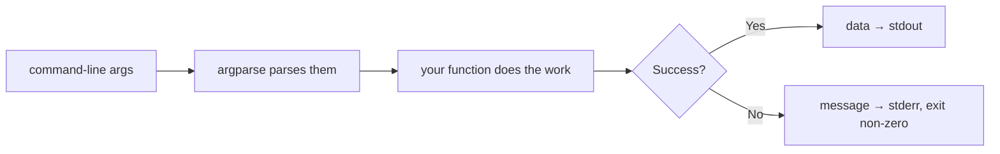

# Lab 3 — Build the Toolbelt CLI (Milestone)

**Time: ~5 hrs · Difficulty: Core / Stretch · Builds on: Lab 1, Lab 2**

## Objective

Ship the month's milestone: **Toolbelt**, a single `uv`-managed repository containing three real command-line utilities you would actually use — `csv2json`, `dirsize`, and `note`. Each reads input, parses arguments with `argparse`, handles errors gracefully, and prints clean output. You will package them so they install as genuine commands (you can type `csv2json file.csv`, not `uv run python some_file.py`), write a real `pyproject.toml` and `README.md`, and push it to GitHub. This is the moment a pile of scripts becomes software.

## Setup

```zsh
brew install uv                # if not already installed
uv python install 3.12         # if not already installed
mkdir -p ~/agentic/month-03 && cd ~/agentic/month-03
```

We will scaffold the project in Step 1. You'll also want the `jq` from Month 2 on your `PATH` to prove your tool is composable.

## Background

**Recall first (from memory):** From Lab 2, which stream should carry a tool's *data* and which its *error messages* — and why does that split let the output pipe cleanly into `jq`? From Month 1, what does a non-zero exit code signal to the shell? Answer before reading on.

Everything from Labs 1 and 2 comes together here. `csv2json` is the converter from Lab 2, dressed up with `argparse`. `dirsize` walks the filesystem with `pathlib`. `note` uses the append-to-a-file pattern from Lab 2 plus the standard library's `datetime`. None of them touch the network — this is still a pure-language month — but all three follow Unix conventions you learned in Month 1: arguments in, clean data on `stdout`, errors on `stderr`, a non-zero exit code on failure. That discipline is exactly what makes a tool composable, and it is the same discipline an agent's tools will need later in the course.

A key new idea: **entry points.** A `[project.scripts]` table in `pyproject.toml` tells the packaging system "make a command named `csv2json` that runs the `main` function in `toolbelt/csv2json.py`." After that, `uv run csv2json ...` (or the installed command) just works.

Every tool you build here follows the same shape — the genuinely new skill of the lab is wiring command-line arguments through `argparse` to your logic and back out to the right stream:


*Notice: `argparse` only turns text arguments into Python values — it does no work itself. Your function does the work, then sends data to `stdout` and any problems to `stderr`. Every one of the three tools is this same pipeline.*

## Steps

### 1. Scaffold a packaged project

```zsh
uv init toolbelt --package --python 3.12
cd toolbelt
```

The `--package` flag is important: it creates a `src/toolbelt/` layout — the modern, import-safe project structure — and pre-wires a `[project.scripts]` entry point.

```zsh
git init
```

(`uv init` already created a `.gitignore` that excludes `.venv/`.)

**Checkpoint:** `find . -not -path '*/.git/*' -type f` shows `pyproject.toml`, `.python-version`, `README.md`, `.gitignore`, and `src/toolbelt/__init__.py`. Open `pyproject.toml` — you'll see a `[project.scripts]` section already present.
**If not:** if there's no `src/toolbelt/` directory, you omitted `--package` — delete the folder and re-run `uv init toolbelt --package --python 3.12`. If `find` errors, you may not be inside the `toolbelt` directory; `cd toolbelt` first.

The next three steps each build one tool, and they form the gradual release for the `argparse` skill: Tool 1 is fully worked, Tool 2 fades some of it for you to fill in, and Tool 3 you build mostly from the goal alone.

### 2. Tool 1 — `csv2json` · Stage 1 — Worked example (I do)

Study this complete tool, then create `src/toolbelt/csv2json.py` with it exactly as written. Read each `add_argument` line against the diagram in Background — you are not inventing yet, just seeing the pattern once in full:

```python
import argparse
import csv
import json
import sys
from pathlib import Path


def convert(path):
    """Read a CSV file into a list of dicts, or exit cleanly if it's missing."""
    p = Path(path)
    if not p.exists():
        print(f"csv2json: no such file: {path}", file=sys.stderr)
        raise SystemExit(1)
    with p.open(newline="") as f:
        return list(csv.DictReader(f))


def main():
    ap = argparse.ArgumentParser(description="Convert a CSV file to JSON.")
    ap.add_argument("csvfile", help="path to the input .csv file")
    ap.add_argument("-o", "--output", help="write JSON here instead of stdout")
    ap.add_argument("--indent", type=int, default=2, help="JSON indent (default 2)")
    args = ap.parse_args()

    rows = convert(args.csvfile)
    text = json.dumps(rows, indent=args.indent)

    if args.output:
        Path(args.output).write_text(text + "\n")
        print(f"Wrote {len(rows)} rows to {args.output}", file=sys.stderr)
    else:
        print(text)


if __name__ == "__main__":
    main()
```

Make a test CSV and run the tool *as a module* for now:

```zsh
printf 'name,age,role\nAda,36,engineer\nGrace,40,engineer\n' > people.csv
uv run python -m toolbelt.csv2json people.csv
```

**Checkpoint:** A pretty JSON array of two objects prints to the screen. Now prove it's composable and that errors behave:

```zsh
uv run python -m toolbelt.csv2json people.csv | jq '.[].name'
uv run python -m toolbelt.csv2json nope.csv ; echo "exit: $?"
```

The first prints `"Ada"` and `"Grace"`; the second prints one `stderr` line `csv2json: no such file: nope.csv` and `exit: 1`. Note the JSON went to `stdout` and the "Wrote..." message (with `-o`) goes to `stderr` — that's deliberate so piping stays clean.
**If not:** `ModuleNotFoundError: No module named 'toolbelt'` means you are outside the project root or the file isn't under `src/toolbelt/` — `cd` to the project root and check the path. If the pipe into `jq` fails, a stray `print(...)` may be leaking text onto `stdout`; only the JSON should go there.

### 3. Tool 2 — `dirsize` · Stage 2 — Faded practice (we do)

Same pattern as Tool 1, but you fill in the `argparse` wiring. The work functions (`human`, `scan`) are given; complete the three `____` blanks in `main()` so the tool takes an optional directory and a `--top` count. Create `src/toolbelt/dirsize.py`:

```python
import argparse
import sys
from pathlib import Path


def human(n):
    """Turn a byte count into a readable string like 4.2MB."""
    size = float(n)
    for unit in ["B", "KB", "MB", "GB", "TB"]:
        if size < 1024 or unit == "TB":
            return f"{size:.1f}{unit}"
        size /= 1024


def scan(root):
    """Return (total_bytes, sorted [(size, name), ...]) for a directory's entries."""
    p = Path(root)
    if not p.is_dir():
        print(f"dirsize: not a directory: {root}", file=sys.stderr)
        raise SystemExit(1)
    total = 0
    entries = []
    for child in p.iterdir():
        if child.is_file():
            size = child.stat().st_size
        else:
            size = sum(f.stat().st_size for f in child.rglob("*") if f.is_file())
        entries.append((size, child.name))
        total += size
    return total, sorted(entries, reverse=True)


def main():
    ap = argparse.ArgumentParser(description="Report total size of a directory.")
    # An OPTIONAL positional that defaults to the current directory:
    ap.add_argument("directory", nargs="____", default="____", help="directory (default: .)")
    # An integer option for how many entries to show:
    ap.add_argument("-n", "--top", type=____, default=5, help="show N largest (default 5)")
    args = ap.parse_args()

    total, entries = scan(args.directory)
    print(f"Total: {human(total)}  ({args.directory})")
    for size, name in entries[: args.top]:
        print(f"  {human(size):>10}  {name}")


if __name__ == "__main__":
    main()
```

The blanks are `nargs="?"` (zero-or-one positional), `default="."`, and `type=int` (so `--top 3` arrives as the number `3`, not the string `"3"`). Run it on the current project:

```zsh
uv run python -m toolbelt.dirsize . -n 3
uv run python -m toolbelt.dirsize /does/not/exist ; echo "exit: $?"
```

**Checkpoint:** The first prints a `Total:` line and up to three largest entries, sizes right-aligned and human-readable (e.g. `8.2KB  src`). The second prints `dirsize: not a directory: /does/not/exist` to `stderr` and `exit: 1`. The `nargs="?"` made the directory argument optional with a default of `.`.
**If not:** if running with no argument errors instead of scanning `.`, your `nargs` or `default` blank is wrong. If `--top 3` raises a `TypeError` on the slice, you left out `type=int` so `args.top` is the string `"3"`.

### 4. Tool 3 — `note` · Stage 3 — Independent (you do)

Now build a tool mostly from the goal. `note` uses **subcommands** (`note add ...`, `note list`) — the same pattern as `git commit` / `git log`, created with `ap.add_subparsers(...)`. The reference implementation is below so you are not stranded, but try sketching the `main()` argument wiring yourself first, then compare. Create `src/toolbelt/note.py`:

```python
import argparse
import sys
from datetime import datetime
from pathlib import Path

NOTES = Path.home() / ".toolbelt_notes.txt"


def add(text, path=NOTES):
    stamp = datetime.now().strftime("%Y-%m-%d %H:%M")
    with path.open("a") as f:
        f.write(f"[{stamp}] {text}\n")
    return stamp


def recent(n, path=NOTES):
    if not path.exists():
        return []
    return path.read_text().splitlines()[-n:]


def main():
    ap = argparse.ArgumentParser(description="Append timestamped notes to a file.")
    sub = ap.add_subparsers(dest="cmd", required=True)

    add_p = sub.add_parser("add", help="add a note")
    add_p.add_argument("text", nargs="+", help="the note text")

    list_p = sub.add_parser("list", help="show recent notes")
    list_p.add_argument("-n", "--num", type=int, default=10, help="how many (default 10)")

    args = ap.parse_args()

    if args.cmd == "add":
        stamp = add(" ".join(args.text))
        print(f"noted at {stamp}", file=sys.stderr)
    elif args.cmd == "list":
        lines = recent(args.num)
        if not lines:
            print("no notes yet", file=sys.stderr)
        for line in lines:
            print(line)


if __name__ == "__main__":
    main()
```

Try it:

```zsh
uv run python -m toolbelt.note add buy milk and ship the toolbelt
uv run python -m toolbelt.note add "remember to push to GitHub"
uv run python -m toolbelt.note list -n 5
```

**Checkpoint:** Each `add` prints `noted at <timestamp>` to stderr; `list` prints your notes, newest at the bottom, each prefixed with `[YYYY-MM-DD HH:MM]`. The notes persist in `~/.toolbelt_notes.txt` (`cat ~/.toolbelt_notes.txt` to confirm). The `nargs="+"` let you type the note without quotes; quotes still work too.
**If not:** `argument cmd: invalid choice` means you typed a subcommand other than `add` or `list`; run `uv run python -m toolbelt.note --help` for the choices. If `list` shows nothing, you haven't added a note yet, or the file path differs — `cat ~/.toolbelt_notes.txt` to check.

### 5. Wire up real commands (entry points)

Open `pyproject.toml` and replace the single auto-generated `[project.scripts]` entry with all three, and fill in a real description:

```toml
[project]
name = "toolbelt"
version = "0.1.0"
description = "A small collection of everyday command-line utilities."
readme = "README.md"
requires-python = ">=3.12"
dependencies = []

[project.scripts]
csv2json = "toolbelt.csv2json:main"
dirsize = "toolbelt.dirsize:main"
note = "toolbelt.note:main"

[build-system]
requires = ["uv_build>=0.11.2,<0.12.0"]
build-backend = "uv_build"
```

The format is `command = "module.path:function"`. Now the tools run as named commands:

```zsh
uv run csv2json people.csv | jq '.[].name'
uv run dirsize . -n 3
uv run note list -n 3
uv run csv2json --help
```

**Checkpoint:** All four commands work without `python -m`. The `--help` screen shows your description, the positional `csvfile`, and the `-o`/`--indent` options. You now have three installed commands.
**If not:** `Failed to spawn: csv2json` or "command not found" means the entry points aren't installed yet — run `uv sync` to re-resolve, then retry (`uv run` re-resolves automatically). Double-check each line reads `command = "toolbelt.module:main"` with the colon before `main`.

### 6. Write the README

Replace the generated `README.md` with a real one. At minimum: a one-line description, an "Install" section (`uv sync` to set up the environment), and a "Usage" block per tool with one example each. For instance:

````markdown
# Toolbelt

Three everyday command-line utilities, built with the Python standard library.

## Install

```zsh
git clone <your-repo-url> && cd toolbelt
uv sync
```

## Tools

### csv2json — convert CSV to JSON
```zsh
uv run csv2json people.csv            # prints JSON to stdout
uv run csv2json people.csv -o out.json
```

### dirsize — report directory size
```zsh
uv run dirsize ~/Downloads -n 10
```

### note — timestamped notes
```zsh
uv run note add finish the toolbelt
uv run note list -n 5
```
````

**Checkpoint:** `README.md` documents all three tools with a runnable example each.
**If not:** if the fenced code blocks render oddly on GitHub, make sure the outer fence uses four backticks (as shown) so the inner triple-backtick blocks display literally.

### 7. Commit and push

```zsh
git add -A
git commit -m "Month 3 milestone: Toolbelt CLI (csv2json, dirsize, note)"
gh repo create toolbelt --public --source=. --push
```

(If you'd rather not use `gh`, create the repo on github.com and `git remote add origin ... && git push -u origin main`.)

**Checkpoint:** `gh repo view --web` (or your browser) shows the repo on GitHub with all your source files and the README rendering.
**If not:** if `gh` reports you are not authenticated, run `gh auth login` once (Month 1). If the push is rejected, the remote may already have content — `git pull --rebase origin main` then push, or create a fresh empty repo.

## Definition of Done

You are done when:

- [ ] `uv run csv2json people.csv` prints valid JSON, and `uv run csv2json people.csv | jq '.[].name'` works (composable).
- [ ] `uv run dirsize . -n 3` prints a human-readable total and the largest entries.
- [ ] `uv run note add ...` and `uv run note list` round-trip notes to `~/.toolbelt_notes.txt`.
- [ ] Each tool has a working `--help`.
- [ ] At least one error path per tool (missing file / not-a-directory) prints to `stderr` and exits non-zero — no raw traceback.
- [ ] `pyproject.toml` declares all three commands under `[project.scripts]`.
- [ ] `README.md` documents install and usage for each tool.
- [ ] The repo is pushed to GitHub.

One-shot self-verification:

```zsh
uv run csv2json people.csv | jq '. | length' \
  && uv run dirsize . -n 1 \
  && uv run note add "definition of done reached" \
  && uv run note list -n 1 \
  && echo "ALL TOOLS OK"
```

If this prints a number, a size line, a note confirmation, your note, and `ALL TOOLS OK`, you've met the bar.

**Self-explain:** in one sentence, why does the `[project.scripts]` entry point turn `toolbelt.csv2json:main` into a real `csv2json` command you can run without typing `python -m`?

## Stretch Goals

1. **Install globally.** Run `uv tool install .` from the project, then use `csv2json`, `dirsize`, and `note` as bare commands from *any* directory — no `uv run` prefix. This is what "shipping a tool" really feels like.
2. **Type the CSV.** Add a `--types` flag to `csv2json` that converts numeric-looking columns to real JSON numbers, reusing the recoverable-error pattern from Lab 2.
3. **`dirsize --json`.** Add a flag that emits the report as JSON so `dirsize . --json | jq` works — making your two tools pipe-compatible with each other.
4. **Note search.** Add `note find <word>` that prints only matching notes (case-insensitive).
5. **A fourth tool.** Add one that solves a problem *you* actually have, wired into `[project.scripts]` the same way. That instinct — reaching for Python when a shell one-liner gets awkward — is the whole point of the month.

## Troubleshooting

- **`error: Failed to spawn: csv2json` / command not found after editing `pyproject.toml`** — re-sync the environment with `uv sync`, or just use `uv run csv2json ...` which re-resolves automatically. Entry points are wired at install time.
- **`ModuleNotFoundError: No module named 'toolbelt'`** — you're outside the project directory, or the file isn't under `src/toolbelt/`. Run commands from the project root and confirm the file path.
- **`argument cmd: invalid choice`** (note) — you typed a subcommand other than `add` or `list`. Run `uv run note --help` to see the choices.
- **`note add` swallows your words / quoting confusion** — `nargs="+"` joins all trailing words, so `note add buy milk` works unquoted; use quotes only if your note contains shell metacharacters like `*` or `>`.
- **`dirsize` is slow on a huge directory** — `rglob("*")` walks everything; that's expected. Point it at a smaller directory, or add a depth limit as a stretch exercise.
- **`PermissionError` during `dirsize`** — some system directories aren't readable. For robustness, wrap the per-child size computation in a `try`/`except OSError` that skips unreadable entries (a worthwhile hardening exercise).
- **f-string quote error** — inside a double-quoted f-string, use single quotes for dict keys: `f"{row['name']}"`, never `f"{row["name"]}"`.
