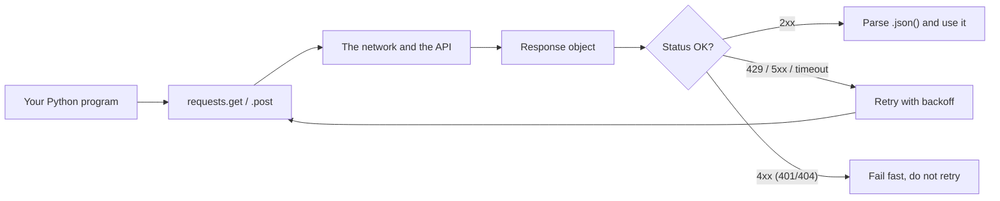

# Month 04 — Python Meets the Network: APIs as a First-Class Citizen

**Phase: Foundations**

## Overview

This is the month the two halves of your foundation fuse. In Month 2 you learned to *speak* HTTP — you poked at APIs with `curl` and HTTPie, you read response status codes, you sliced JSON with `jq`. In Month 3 you learned to *write* Python — programs, data structures, file I/O, error handling, and a packaged CLI. But you have never once made an HTTP call *from inside your own code*. That wall comes down now. By the end of the month, the request/response cycle in Python will be muscle memory.

The reason this matters far beyond this month is simple: **an agent is a program that talks to a network in a loop.** Every model SDK you will use from Month 6 onward — Anthropic, OpenAI, Ollama's HTTP API — is, underneath the sugar, a `POST` request with a JSON body and an `Authorization` header, whose response you parse and act on. Tool use, retrieval, function calling, multi-step agent loops: all of it is HTTP from Python. If you can call the GitHub API end-to-end, handle its failures, and respect its rate limits, you can call any model API. We deliberately practice on a *non-AI* API first so the network mechanics are solid before the LLM's nondeterminism is added on top.

So we keep the network honest and visible. You will use the `requests` library — the de facto standard, readable and synchronous — and take a short look at `httpx` so you recognize the async future. You will manage secrets correctly with a `.env` file and `python-dotenv`, never committing a credential, reusing the git-leak check from Month 2. And — crucially — you will learn that the network *fails*: connections time out, servers return 500s, and APIs say "slow down." Production agents that run for hours unattended live or die on how they handle that. So you will hand-roll a retry loop with exponential backoff and jitter — not import one from a library — because understanding the mechanism is the point, and you will reimplement it inside every agent harness later.

The month ends with **GitHub Pulse**: a real, installable CLI that turns a GitHub username into a Markdown activity report, reads its token from `.env`, survives rate limits with your own backoff, ships with a small pytest suite, and installs with `uv tool` / `pipx`. It is the first program in this course that reaches out into the world and comes back with something useful.

Here is the whole month in one picture — the request/response cycle you will make muscle memory:


*Notice: the same loop powers every model API later — the only thing that changes is the URL and the JSON body.*

## Prerequisites

Coming in, you should be able to do everything from Months 1–3:

- Speak HTTP and JSON at the conceptual level: methods (`GET`/`POST`), request and response headers, status-code families (2xx/3xx/4xx/5xx), and what a JSON object/array looks like; pretty-print and slice JSON with `jq` (Month 2).
- Run the git-leak check and understand why a committed secret is permanently compromised (Month 2).
- Write and run Python programs: functions, the four core data structures, comprehensions, `try`/`except`, reading a `Traceback` (Month 3).
- Read and write files and round-trip JSON with the standard library (Month 3).
- Build and package a CLI with `uv`: `uv init --package`, `uv add`, `uv run`, `argparse`, `[project.scripts]` entry points, reading a `pyproject.toml` (Month 3).

You also need a free GitHub account (from Month 1). No paid services and no LLM access are required this month.

## Warm-Up: Retrieve Before You Begin

Before reading on, answer these from memory — no peeking at earlier months. This pulls forward the prior skills this month builds on.

1. Name the two HTTP methods you used most in Month 2 and what each is *for*. What status-code family means "you made a mistake" versus "the server broke"?
2. In a request, where does an `Authorization` header live, and why must its value never be written into source code?
3. In Python, which data structure does a parsed JSON object become, and how do you safely pull a key out of it when it might be missing?
4. What does `try` / `except` let you do that a plain `if` cannot, and when would you reach for it?
5. Which `uv` commands initialize a packaged project, add a dependency, and run a script inside its environment?

<details><summary>Check your recall</summary>

1. `GET` (fetch) and `POST` (send/create). `4xx` = client error (your request was wrong, e.g. 401/404); `5xx` = server error (Month 2).
2. In a request *header*; its value is a secret (a password). Committed secrets are scraped and permanently compromised — the Month-2 git-leak lesson.
3. A `dict`. Use `data.get("key")` (returns `None` if absent) rather than `data["key"]` (raises `KeyError`) (Month 3).
4. `try`/`except` catches an *exception* raised at runtime (e.g. a timeout, a bad parse) so the program can recover instead of crashing; an `if` only branches on a value you already have (Month 3).
5. `uv init --package`, `uv add <pkg>`, `uv run <script>` (Month 3).
</details>

## Learning Objectives

By the end of this month you can:

1. **Make** `GET` and `POST` requests from Python with `requests`, sending query parameters, custom headers, and JSON bodies.
2. **Inspect** a `Response` object — `.status_code`, `.headers`, `.json()`, `.text` — and branch on the result instead of assuming success.
3. **Handle** HTTP failure deliberately: distinguish connection errors from 4xx/5xx, use `raise_for_status()` where appropriate, and set an explicit timeout on every call.
4. **Authenticate** to a real API with a bearer token loaded from a `.env` file via `python-dotenv`, and verify the secret is git-ignored.
5. **Implement** by hand a retry loop with exponential backoff and jitter, and explain why each piece (cap, jitter, only-retry-some-errors) exists.
6. **Respect** rate limits by reading the API's rate-limit headers and `Retry-After`, and pausing rather than hammering.
7. **Paginate** through a multi-page API response and assemble the full result set without loading the world or looping forever.
8. **Build and package** a token-authenticated CLI (GitHub Pulse) that produces Markdown or `--json`, with a small pytest suite, installable via `uv tool` / `pipx`.
9. **Explain** how every model API call later in the course is the same `POST`-with-headers-and-JSON pattern you practiced here.

## Tech Stack (free, macOS)

| Tool | Install | Why |
|---|---|---|
| Python 3.12+ | `uv python install 3.12` | The language. Managed by `uv`, never the system Python. |
| uv | `brew install uv` | Project, environment, and version manager (canonical since Month 3). |
| `requests` | `uv add requests` | The de facto HTTP client for Python — readable, synchronous, ubiquitous. |
| `python-dotenv` | `uv add python-dotenv` | Loads secrets from a `.env` file into the environment so they never live in code. |
| `httpx` | `uv add httpx` (Lab 1 peek only) | Modern HTTP client with sync *and* async; you preview it to know it exists. |
| `pytest` | `uv add --dev pytest` | The standard test runner; a light intro this month (Month 5 goes deep). |
| HTTPie / `curl` | from Month 2 | Cross-check what your Python code sends against a known-good request. |
| GitHub CLI / account | `brew install gh` (Month 1) | Free GitHub account + a free personal access token power the milestone. |

No paid services and no LLM access are required this month. Everything runs offline-capable on Apple Silicon or Intel, and every API we call is free.

A note on `requests` vs. `httpx`: `requests` is the right first tool — it is synchronous (one call blocks until it returns, which is easy to reason about), the API is famously clean, and the entire Python ecosystem documents against it. `httpx` is its modern cousin: a nearly identical API plus `async` support and HTTP/2. Async matters once an agent must make many calls concurrently, which is a Month 8+ concern. We teach `requests` deeply and *show* `httpx` once so the name is familiar when you meet it.

## Weekly Breakdown

Budget ~8–12 hours per week: roughly half reading and typing along, half doing the lab.

### Week 1 — Your first request from Python
**Warm-start (do this first):** before any new material, re-open last month's packaged CLI from Month 3, run it once with `uv run`, and add one tiny feature (e.g. a new `--verbose` flag that prints what it is doing). Five minutes; it keeps `uv init --package` / `argparse` / entry points live, because GitHub Pulse rebuilds on exactly that skeleton.
**Focus:** replacing `curl` with `requests`; reading a `Response` like an object instead of a screen of text.
**Topics:** `requests.get`/`requests.post`; query parameters via `params=`; the `Response` object (`.status_code`, `.json()`, `.text`, `.headers`, `.ok`); request headers including `User-Agent` and `Accept`; sending a JSON body with `json=`; never trusting a 2xx blindly; the difference between a *transport* error (no response at all) and an *HTTP* error (a response with a 4xx/5xx code).
**Reading:** Core Concepts §1–§3 below; the `requests` Quickstart.
**Build:** Lab 1 — call a real public API (`GET` and `POST`) end-to-end and turn the response into useful output.

### Week 2 — Auth and secrets done right
**Focus:** authenticating with a token without ever committing it.
**Topics:** bearer-token auth (the `Authorization: token ...` header); why secrets never go in code or Git history; `.env` files and `python-dotenv`; `.gitignore` and the Month-2 git-leak check; reading the GitHub API docs for the auth scheme; verifying with HTTPie that your token works before wiring it into Python.
**Reading:** Core Concepts §4.
**Build:** Lab 1 continues — add an authenticated, token-protected call and prove the token is git-ignored.

### Week 3 — When the network fights back
**Focus:** the failure handling that separates a toy from a tool.
**Topics:** timeouts on *every* call; exceptions (`Timeout`, `ConnectionError`, `HTTPError`); idempotency and which errors are safe to retry; exponential backoff (`2 ** n`), a maximum cap, and jitter, all hand-written; honoring `Retry-After` and the `X-RateLimit-*` headers; building a small `get_with_retry` helper you will reuse.
**Reading:** Core Concepts §5–§6.
**Build:** Lab 2 — the resilience lab: timeouts, hand-rolled retry+backoff+jitter, and rate-limit handling against the GitHub API.

### Week 4 — Pagination and the milestone
**Focus:** assembling results across pages and shipping GitHub Pulse.
**Topics:** why APIs paginate; `page`/`per_page` and the `Link: ... rel="next"` header; looping until there is no next page (with a sane page cap); composing GET + auth + retry + pagination into one tool; producing Markdown vs. `--json`; a tiny pytest suite (testing pure functions, faking a response); packaging with `uv` and installing via `uv tool` / `pipx`.
**Reading:** Core Concepts §7–§8.
**Build:** Lab 3 — build, test, and package **GitHub Pulse**, the month's milestone.

## Core Concepts

### §1 — From `curl` to `requests`: the same call, now in code

Everything you did in Month 2 with `curl` you now do in Python. A `curl https://api.github.com/users/octocat` becomes:

```python
import requests

resp = requests.get("https://api.github.com/users/octocat", timeout=10)
print(resp.status_code)        # 200
data = resp.json()             # JSON -> Python dict (Month 3's json.loads, done for you)
print(data["public_repos"])
```

`requests.get` performs the GET and hands you back a **`Response` object** — not a string, an object with everything about the reply. `.json()` parses the body into Python data (a dict here, the same shape `jq` showed you). The single most important new habit: **always pass `timeout=`.** Without it, a hung server can freeze your program forever — fatal for an always-on agent. We will return to this in §5.

### §2 — Reading the `Response` instead of trusting it

In Month 2 you read status codes off the screen. In code you must read them deliberately, because **a request that "worked" at the transport level can still be an error.** `requests.get` returns happily for a `404` or a `500` — it got *a* response. Checking is on you:

```python
resp = requests.get(url, timeout=10)
if resp.status_code == 200:
    data = resp.json()
elif resp.status_code == 404:
    print("Not found", file=sys.stderr)
else:
    print(f"Unexpected status {resp.status_code}", file=sys.stderr)
```

The `Response` carries more than a code. `.headers` is a dict of response headers (case-insensitive), `.text` is the raw body string, `.json()` parses it (and *raises* if the body is not valid JSON, so guard it), and `.ok` is a convenience boolean (`True` for any 2xx/3xx). For quick scripts, `resp.raise_for_status()` turns a 4xx/5xx into an `HTTPError` exception you can catch — useful, but be aware it makes failure a thrown exception rather than a value to branch on. Both styles are fine; the sin is assuming success.

> **Common misconception.** "A `200` means my data is correct."
> **Reality.** A `200` only means the *request* succeeded at the HTTP level — the server replied. It says nothing about whether the body contains the field you wanted, whether the user actually exists in the way you assumed, or whether the JSON is shaped as you expect. It is tempting because in `curl` a `200` and good-looking output usually arrive together. In code you must still check that the keys you read are present (`data.get(...)` from Month 3) before trusting them.

### §3 — Sending data: params, headers, and JSON bodies

Three things you attach to an outgoing request, each with its own keyword so you never hand-build a URL or escape a string again:

```python
# Query string: ?q=requests&per_page=5  — requests builds and encodes it
resp = requests.get(url, params={"q": "requests", "per_page": 5}, timeout=10)

# Custom headers — what you set in Month 2 with curl -H
headers = {"Accept": "application/vnd.github+json", "User-Agent": "github-pulse"}
resp = requests.get(url, headers=headers, timeout=10)

# A POST with a JSON body — json= sets the body AND the Content-Type header
resp = requests.post(url, json={"title": "Hello", "body": "world"}, timeout=10)
```

The distinction to internalize: `params=` goes into the URL's query string; `json=` becomes the request *body* and is what a `POST`/`PATCH` carries. Use `json=` (not `data=`) when the API wants JSON — `requests` serializes the dict and sets `Content-Type: application/json` for you. A good `User-Agent` is not optional with GitHub: the API rejects requests without one, and a descriptive name is how an API owner contacts you instead of just blocking you.

### §4 — Secrets: `.env`, `python-dotenv`, and never committing a token

Authenticated APIs identify you with a **token** sent in an `Authorization` header. GitHub uses a bearer-style header:

```python
headers = {"Authorization": f"Bearer {token}", "Accept": "application/vnd.github+json"}
```

The token is a password. It must **never** appear in your source code, and it must **never** enter Git history — a token pushed to a public repo is scraped by bots within minutes and is compromised the instant it is committed, even if you delete it in the next commit (Git remembers; this is the exact Month-2 git-leak lesson). The clean pattern: put secrets in a file named `.env`, git-ignore that file, and load it at runtime.

```python
# .env  (this file is .gitignored — it never gets committed)
GITHUB_TOKEN=ghp_xxxxxxxxxxxxxxxxxxxx
```

```python
import os
from dotenv import load_dotenv

load_dotenv()                              # reads .env into the environment
token = os.environ["GITHUB_TOKEN"]         # KeyError if missing -> fail loudly
```

> **Common misconception.** "Hardcoding a secret in the code is fine as long as the repo is private."
> **Reality.** Private today is not private forever: repos get made public by accident, forked, shared with contractors, leaked in backups, or bundled into CI logs. The secret also still lives in *Git history* the moment it is committed, so flipping the repo public later exposes every credential you ever pasted. Treat any secret in source as already compromised. The discipline is the same regardless of visibility: secret in `.env`, `.env` git-ignored *before* it exists, value injected as a real env var in production.

`load_dotenv()` reads `.env` into `os.environ` so your code reads it like any environment variable — which means in production (a server, a CI job) you provide the value as a real env var and *no `.env` file is needed*. Always add `.env` to `.gitignore` **before** you create it, and run the Month-2 leak check (`git log -p | grep -i token`, or a tool like `gitleaks`) before pushing. Generate the GitHub token at *Settings → Developer settings → Personal access tokens*; a fine-grained token with read-only public scopes is plenty for this month.

### §5 — Timeouts and the taxonomy of network failure

A network call has two distinct ways to fail, and conflating them is a classic beginner bug:

- **Transport failure** — you never got a response at all: DNS failed, the connection was refused, or the server went silent past your timeout. `requests` raises an exception: `requests.exceptions.ConnectionError` or `requests.exceptions.Timeout`.
- **HTTP failure** — you *got* a response, but it carries a 4xx or 5xx status. No exception is raised unless you call `.raise_for_status()`; otherwise you inspect `.status_code`.

Every call gets a `timeout`. The argument is in seconds and can be a single number or a `(connect, read)` tuple:

```python
try:
    resp = requests.get(url, timeout=(3.05, 10))   # 3s to connect, 10s to read
except requests.exceptions.Timeout:
    ...   # transport failure — maybe retry
except requests.exceptions.ConnectionError:
    ...   # transport failure — maybe retry
```

The *why*: without a timeout, `requests` waits indefinitely. An agent looping over hundreds of calls will eventually hit one slow server and hang forever, holding resources and never reaching the next step. A timeout converts "hang forever" into a clean, catchable failure you can decide what to do about — which is exactly what retries are for.

### §6 — Retries: exponential backoff with jitter, by hand

> **Heavy concept ahead.** Slow down here; this is the load-bearing idea of the month. Read it once for the shape, then read it again with the code, and do not move on until you can name backoff, cap, and jitter without looking.

When a call fails *transiently* — a timeout, a connection blip, a `502/503/504`, or a `429 Too Many Requests` — the right move is usually to wait and try again. But retrying immediately and forever makes things worse: you hammer a struggling server and, if many clients do the same, you all retry in lockstep and create a synchronized stampede. The fix has three parts, and you will write all three yourself:

1. **Exponential backoff** — wait longer after each failure: `2 ** attempt` seconds → 1s, 2s, 4s, 8s. This gives a struggling server room to recover.
2. **A cap and a max attempt count** — never wait more than, say, 60s, and give up after a handful of tries so you fail cleanly instead of looping forever.
3. **Jitter** — add a small random amount to each wait so a thousand clients do *not* all retry at the same instant. Without jitter, backoff just synchronizes the stampede.

```python
import random, time, requests

RETRYABLE = {429, 500, 502, 503, 504}

def get_with_retry(url, *, headers=None, params=None, max_attempts=5, timeout=10):
    for attempt in range(max_attempts):
        try:
            resp = requests.get(url, headers=headers, params=params, timeout=timeout)
        except (requests.exceptions.Timeout, requests.exceptions.ConnectionError):
            if attempt == max_attempts - 1:
                raise
        else:
            if resp.status_code not in RETRYABLE:
                return resp                      # success OR a non-retryable error
            if attempt == max_attempts - 1:
                return resp                      # out of tries; let caller see it
            # honor an explicit Retry-After if the server sent one (see §6.1)
        wait = min(2 ** attempt, 60) + random.uniform(0, 1)   # backoff + jitter
        time.sleep(wait)
    return resp
```

> **Common misconception.** "If a call fails, just retry it — retrying on every error makes the code more robust."
> **Reality.** Retrying the *wrong* errors is harmful. A `401` (bad token) or `404` (no such thing) will never succeed by waiting, so retrying them just burns time and hammers the server; a non-idempotent `POST` retried can create duplicate resources. Retries are only for *transient* failures that can plausibly recover — timeouts, connection blips, `429`, and `5xx` on an idempotent request. It is tempting because retries feel like free insurance; in reality they have a cost and a blast radius.

Two design points worth saying out loud. First, **only retry idempotent, transient failures.** A `GET` is safe to repeat; a `POST` that creates a resource generally is *not* (you could create duplicates), and a `404` or `401` will never succeed by retrying — retrying those is pointless and rude. Second, this is the exact pattern (sometimes called "AIMD" or "truncated exponential backoff with jitter") that lives inside production HTTP libraries and inside every robust agent loop. Writing it by hand once means you will recognize and trust it forever.

**§6.1 — Rate limits specifically.** APIs tell you their limits in headers. GitHub sends `X-RateLimit-Limit`, `X-RateLimit-Remaining`, and `X-RateLimit-Reset` (a Unix timestamp). A `429` or a `403` with `X-RateLimit-Remaining: 0` means "you are out of budget"; the polite response is to sleep until `X-RateLimit-Reset` (or honor a `Retry-After` header if present) rather than spin. Reading these headers and pausing is what lets an unattended agent run for hours without getting your token throttled or banned.

### §7 — Pagination: assembling results across pages

No API hands you ten thousand results in one response — it would be enormous and slow. Instead it *paginates*: you ask for a page at a time. GitHub uses `page` and `per_page` query parameters and, critically, tells you whether more pages exist via the **`Link` response header**:

```
Link: <https://api.github.com/...&page=2>; rel="next", <...&page=34>; rel="last"
```

The robust loop is "keep going while there is a `next` link," not "guess how many pages there are":

```python
def get_all_pages(url, *, headers=None, params=None, max_pages=10):
    params = dict(params or {}, per_page=100)
    results = []
    for _ in range(max_pages):                 # cap: never loop forever
        resp = get_with_retry(url, headers=headers, params=params)
        resp.raise_for_status()
        results.extend(resp.json())
        nxt = resp.links.get("next")           # requests parses Link for you
        if not nxt:
            break
        url, params = nxt["url"], None         # the next URL already has the params
    return results
```

`requests` parses the `Link` header into the handy `resp.links` dict, so `resp.links.get("next")` is the whole trick. The two disciplines: **always set a `max_pages` cap** so a bug or a hostile API cannot make you loop forever, and **request a large `per_page`** (GitHub allows up to 100) to make fewer round-trips. Pagination + retry composed together is the backbone of GitHub Pulse.

### §8 — A peek at `httpx`, and why this all transfers

Swap `import requests` for `import httpx` and most of the code above is unchanged — `httpx.get(url, params=..., headers=..., timeout=...)` returns a response with `.status_code`, `.json()`, `.headers`. The difference is `httpx` also offers an **async** client (`async with httpx.AsyncClient() as c: await c.get(...)`), which matters when an agent must fire many calls concurrently rather than one-at-a-time. You do not need async yet; you need to recognize the name and know it is "`requests` plus async."

The deeper point closes the month. Calling a model API is *this exact shape*. Talking to Ollama locally is `requests.post("http://localhost:11434/api/chat", json={...})`. Talking to Anthropic or OpenAI is a `POST` with an `Authorization` header and a JSON body, whose JSON response you parse and act on — then often loop. Tool use is "the model's JSON response asks you to run a function; you run it and `POST` the result back." Every agentic pattern in the rest of this course is built from the primitives in this month. GitHub Pulse is non-AI on purpose: master the network plumbing here, and the LLM months are about *ideas*, not about debugging HTTP.

## Labs

| Lab | Title | Time | Difficulty |
|---|---|---|---|
| [Lab 1](lab-1-requests-get-post-headers-and-auth.md) | Requests Basics: GET, POST, Headers, and Auth | ~3.5 hrs | Intro / Core |
| [Lab 2](lab-2-resilience-timeouts-retries-and-rate-limits.md) | Resilience: Timeouts, Hand-Rolled Retry, and Rate Limits | ~3.5 hrs | Core |
| [Lab 3](lab-3-build-and-package-github-pulse.md) | Build and Package GitHub Pulse (Milestone) | ~5 hrs | Core / Stretch |

## Checkpoints & Self-Assessment

Run these against yourself at the end of each week. You are on track if you can do them without looking it up.

- **Week 1:** From a fresh `.py` file, `GET` a public API, print its status code, and pull one field out of `resp.json()`. Then explain in one sentence why a `200` check is not optional. Can you `POST` a JSON body and confirm the server saw your `Content-Type`?
- **Week 2:** Show that your token works via HTTPie, then load it in Python from `.env` and make one authenticated call. Run the leak check and confirm `.env` is in `.gitignore` and absent from `git status`.
- **Week 3:** Without copying, write a `get_with_retry` that retries on 429/5xx and timeouts, backs off exponentially with jitter, caps the wait, and gives up after N attempts. Explain why jitter exists.
- **Week 4:** Paginate a GitHub endpoint with `resp.links["next"]` until exhausted (with a page cap), and assemble one combined list. Run `uv run pytest` and see green.

## Reflect

Spend ten minutes on these in your learning log (writing, not just thinking):

- **Explain it back:** In two or three sentences, explain *exponential backoff with jitter* as if teaching a peer who finished last month — what each of the three parts (backoff, cap, jitter) prevents.
- **Connect:** How does calling an API *from Python* with `requests` change or extend the `curl`/HTTPie work you did in Month 2? What is genuinely new versus just "the same call, in code"?
- **Monitor:** Which concept this month is still fuzzy — the failure taxonomy, the retry loop, or pagination? Name it precisely, and write the one question that would clear it up.

## Month-End Assessment

**Deliverable: GitHub Pulse** — a `uv`-managed, installable Python CLI that takes a GitHub username and produces a Markdown activity report. It composes everything from the month: authenticated GET requests, secrets from `.env`, hand-rolled retry/backoff for rate limits, and pagination.

Requirements:

1. **Input:** a GitHub username as a positional argument; a `--json` flag to emit machine-readable JSON instead of Markdown; reads `GITHUB_TOKEN` from `.env` via `python-dotenv`.
2. **Output (Markdown):** a report covering the user's recent public activity — recent commits/pushes, recent pull requests, repositories they have starred, and a breakdown of languages used across their repos.
3. **Resilience:** every call has a timeout; transient failures and rate limits are handled by *your* `get_with_retry` (backoff + jitter, honoring `X-RateLimit-Reset`/`Retry-After`); multi-page results are paginated with a page cap.
4. **Quality:** a small `pytest` suite (at least three tests of pure functions — e.g., the language tally and the Markdown rendering — using a faked response, no live network in tests); a real `pyproject.toml` with a `[project.scripts]` entry point; installable via `uv tool install .` or `pipx`. Pushed to GitHub with a README, and **no token in the history.**

**Rubric**

- **Passing:** `github-pulse octocat` produces a correct Markdown report from live data. The token loads from `.env`; `.env` is git-ignored and confirmed absent from history. At least one timeout and one retry path exist and work. The tool paginates at least one endpoint. `--json` emits valid JSON. `pyproject.toml` exists, `uv run` works, and there is at least one passing pytest. Repo is on GitHub.
- **Excellent:** All of the above, plus: retries use exponential backoff *with jitter* and honor `X-RateLimit-Reset`/`Retry-After` (verified by reading the headers, not guessing); every page cap and max-attempt cap is present so the tool cannot loop forever; the suite has three or more tests covering pure functions with a faked/mocked response and runs with zero network access; the tool is factored into small functions (a thin `main`, a reusable `get_with_retry`, pure rendering functions) with a `main()` guard and clean `stderr`/exit-code behavior; installs cleanly as a real command via `uv tool install .`; and the README documents token setup and the leak check.

The real definition of done is behavioral: **you no longer Google "how to make a POST request in Python."** The request/response cycle — attach params/headers/body, send with a timeout, branch on the status, retry the transient failures, page through the rest — is muscle memory.

## Common Pitfalls

- **No timeout.** `requests.get(url)` with no `timeout=` can hang forever. Set one on every call. This is the single most common production-agent bug.
- **Trusting a 2xx that never happened.** `requests` does not raise on a 404 or 500; you got *a* response. Check `.status_code` or call `.raise_for_status()` — never assume success.
- **Calling `.json()` on a non-JSON body.** An error page is often HTML; `.json()` then raises `JSONDecodeError`. Check the status (and ideally the `Content-Type`) before parsing.
- **Committing `.env`.** Add `.env` to `.gitignore` *before* creating it. A token in history is compromised forever, even if a later commit removes it. Re-run the Month-2 leak check before every push.
- **Retrying everything.** Retrying a `401`, `404`, or a non-idempotent `POST` is wrong: the first two never recover, and the third can duplicate data. Retry only transient, idempotent failures (timeouts, 429, 5xx on a GET).
- **Backoff without jitter, or without a cap.** Lockstep retries synchronize a stampede; an uncapped backoff or unbounded attempt count can wait or loop effectively forever. Add jitter, a max wait, and a max attempt count.
- **Infinite pagination.** Looping "until no next link" with no `max_pages` cap trusts the API to terminate. Always cap the page count.
- **Missing `User-Agent`.** GitHub rejects requests without a `User-Agent` header. Set a descriptive one on every call.

## Knowledge Check

Answer from memory first, then check. Questions marked ⟲ are spaced callbacks to earlier months — they are supposed to feel like a stretch.

1. What is the single most important keyword argument to pass on *every* `requests` call, and what disaster does omitting it cause?
2. Name the two distinct families of network failure and how `requests` signals each (exception vs. value).
3. Which status codes are safe to retry, and which two common 4xx codes must you *never* retry? Why?
4. Predict the output: `get_with_retry("https://httpbin.org/status/404", max_attempts=5)` — how many network calls happen and roughly how long does it take?
5. Spot the risk: a teammate writes `for page in itertools.count(): ... if not resp.links.get("next"): break`. What is missing, and what could go wrong?
6. In `requests`, what is the difference between `params=`, `headers=`, and `json=`, and where does each end up in the actual request?
7. Why are the renderer and language-tally functions in GitHub Pulse pure (no network, no printing)? What does that buy the test suite?
8. ⟲ (Month 2) A response comes back `403`. Is that a client or server error family, and what would you check first?
9. ⟲ (Month 3) Given `data = resp.json()`, why prefer `data.get("name")` over `data["name"]`, and what exception does the latter risk?
10. ⟲ (Month 2) You accidentally committed `.env` with a live token, then deleted it in the next commit. Is the token safe now? What must you actually do?

<details><summary>Answer key</summary>

1. `timeout=`. Without it a hung server makes your program wait forever — fatal for an always-on agent (§1, §5).
2. *Transport failure* — no response at all (DNS/refused/timeout); `requests` raises `Timeout`/`ConnectionError`. *HTTP failure* — a response carrying 4xx/5xx; no exception unless you call `.raise_for_status()` (§5).
3. Retry `429` and `5xx` (500/502/503/504) plus transport errors, on idempotent requests. Never retry `401` (bad auth) or `404` (not found) — they cannot recover by waiting (§6).
4. Exactly one call, returning near-instantly: `404` is not in `RETRYABLE_STATUS`, so no backoff/sleep happens (§6).
5. No `max_pages` cap — `itertools.count()` is unbounded, so a buggy or hostile API that always returns a `next` link makes the loop run forever (§7).
6. `params=` → URL query string; `headers=` → request headers; `json=` → the request *body* (and sets `Content-Type: application/json`) (§3).
7. Pure functions take data and return data, so tests feed fixed input and assert exact output with zero network — fast, deterministic, offline (§8, Lab 3).
8. ⟲ `4xx` = client-error family. First check whether the token loaded and whether you are rate-limited (`X-RateLimit-Remaining: 0`) — GitHub uses `403` for both (Month 2).
9. ⟲ `.get` returns `None` for a missing key instead of raising; `data["name"]` raises `KeyError` if the field is absent (Month 3).
10. ⟲ No — Git history keeps the deleted value, so it is compromised the instant it was pushed. Rotate (revoke) the token immediately, then scrub history; deleting in a later commit is not enough (Month 2).
</details>

## Further Reading

- [`requests` Quickstart](https://requests.readthedocs.io/en/latest/user/quickstart/) — the official, concise tour of GET/POST, params, headers, JSON, and the `Response` object.
- [GitHub REST API docs](https://docs.github.com/en/rest) — the API the milestone targets; read the "Authentication," "Rate limits," and "Using pagination" pages specifically.
- [`python-dotenv` docs](https://saurabh-kumar.com/python-dotenv/) — loading secrets from `.env` the right way.
- ["Exponential Backoff And Jitter" — AWS Architecture Blog](https://aws.amazon.com/blogs/architecture/exponential-backoff-and-jitter/) — the canonical explanation of *why* jitter matters; short and worth it.
- [`httpx` documentation](https://www.python-httpx.org/) — the modern, async-capable cousin of `requests` you preview this month.
- [pytest "Getting Started"](https://docs.pytest.org/en/stable/getting-started.html) — just enough to write the milestone's tiny suite; Month 5 goes deep.

## Author's Notes

We teach `requests` as canonical and only *preview* `httpx` because synchronous, one-call-at-a-time code is far easier to reason about for a first network month; async is deferred to where concurrency actually pays off (multi-call agent loops, Month 8+). The retry/backoff/jitter helper is deliberately hand-rolled rather than imported (e.g., `urllib3`'s `Retry` or `tenacity`) because the mechanism — not the convenience — is the learning objective, and the learner reimplements this exact loop inside agent harnesses later; we name the library equivalents so the vocabulary transfers. GitHub Pulse is intentionally a non-AI API so the network mechanics are solid before LLM nondeterminism is layered on in Month 6. The pytest suite is kept deliberately light (pure functions + a faked response, no live network) as an on-ramp to the full testing treatment in Month 5; the key habit installed here is "tests do not hit the network," which is the foundation of testing agents later.
