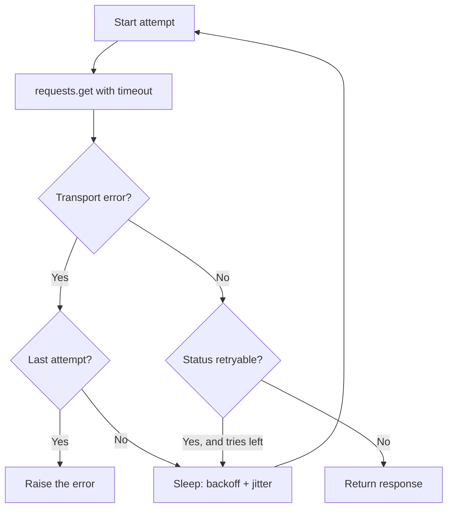
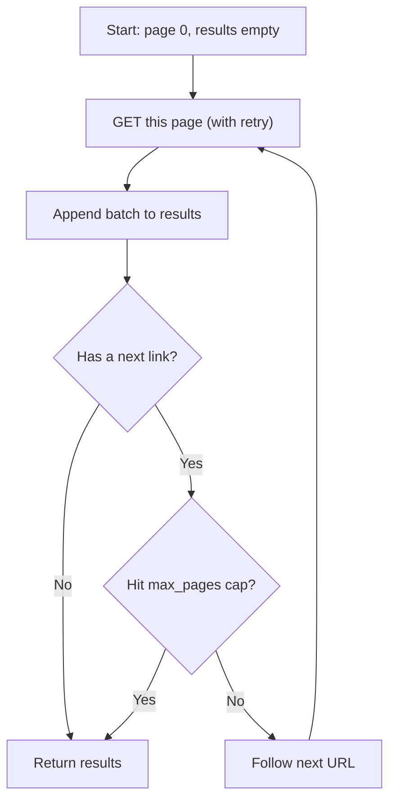

# Lab 2 — Resilience: Timeouts, Hand-Rolled Retry, and Rate Limits

**Time: ~3.5 hrs · Difficulty: Core · Builds on: Lab 1**

## Objective

Turn a request that works *when the network is perfect* into one that survives the network as it actually is: slow servers, dropped connections, transient 5xx errors, and an API telling you to slow down. You will set timeouts on every call, catch the two distinct families of failure, and — the centerpiece — hand-write a `get_with_retry` helper that does exponential backoff with jitter, caps its waits and attempts, retries only the things worth retrying, and honors rate-limit headers. Then you will paginate through a real multi-page GitHub response and assemble it into one list. The `get_with_retry` and `get_all_pages` functions you write here are the exact resilience layer GitHub Pulse uses in Lab 3 — and the exact pattern you will reimplement inside agent loops later in the course.

## Setup

```zsh
cd ~/agentic/month-04
uv init resilience --package --python 3.12
cd resilience
uv add requests python-dotenv
git init
echo ".env" >> .gitignore
echo ".venv/" >> .gitignore
cp ~/agentic/month-04/api-basics/.env .env        # reuse your Lab 1 token
```

Confirm the token carried over: `cat .env` should show your `GITHUB_TOKEN=` line, and `git status` should **not** list `.env`.

## Background

**Recall first (from memory):** From Lab 1, what one keyword must every `requests` call carry, and what happens without it? Does `requests` raise an exception when the server returns a `503`? Answer before reading on.

A network call fails in two unrelated ways (Core Concepts §5). A **transport failure** means you got no response at all — DNS died, the connection was refused, or your timeout fired — and `requests` raises `Timeout` or `ConnectionError`. An **HTTP failure** means you got a response carrying a 4xx/5xx code, and `requests` raises nothing; you must inspect `.status_code`. Resilience is deciding, for each kind, whether to give up, surface the error, or wait and retry.

The retry policy has three parts you will build by hand (Core Concepts §6): wait longer after each failure (**exponential backoff**, `2 ** attempt`), never wait or loop forever (**caps**), and stagger retries with a little randomness so many clients do not stampede in lockstep (**jitter**). And only retry things that can actually recover: a timeout or a `429`/`5xx` on a `GET`, yes; a `401`, a `404`, or a non-idempotent `POST`, no. Finally, when an API publishes rate-limit headers (`X-RateLimit-Remaining`, `X-RateLimit-Reset`) or sends `Retry-After`, the polite move is to sleep exactly that long rather than guess.

## Steps

### 1. See an uncaught timeout fail

Create `src/resilience/timeout_demo.py`. `httpbin` has a `/delay/N` endpoint that waits N seconds before responding:

```python
import requests


def main():
    # The server waits 5s; we only allow 2s. This WILL time out.
    resp = requests.get("https://httpbin.org/delay/5", timeout=2)
    print("got:", resp.status_code)


if __name__ == "__main__":
    main()
```

```zsh
uv run python src/resilience/timeout_demo.py
```

**Checkpoint:** the program crashes with `requests.exceptions.ReadTimeout`. This is *good* — a timeout converted "hang for 5 seconds (or forever, with no timeout)" into a clean, catchable exception. Imagine the server hanging indefinitely with no `timeout=`: your program would freeze. That is the bug a timeout prevents.
**If not:** if it printed `got: 200`, the server responded faster than 5s today — lower `timeout` to `1` or use `/delay/10`. An `SSLError` means `httpbin` is flaky; substitute `https://httpstat.us/200?sleep=5000`.

### 2. Catch both failure families

Update `timeout_demo.py` to distinguish transport failure from HTTP failure:

```python
import sys
import requests


def fetch(url, timeout=2):
    try:
        resp = requests.get(url, timeout=timeout)
    except requests.exceptions.Timeout:
        print(f"transport: timed out after {timeout}s", file=sys.stderr)
        return None
    except requests.exceptions.ConnectionError:
        print("transport: could not connect", file=sys.stderr)
        return None
    if resp.status_code >= 400:
        print(f"http: server returned {resp.status_code}", file=sys.stderr)
    return resp


def main():
    fetch("https://httpbin.org/delay/5")     # times out
    fetch("https://httpbin.org/status/503")  # HTTP failure, no exception
    r = fetch("https://httpbin.org/status/200")
    print("ok:", r.status_code if r else "no response")


if __name__ == "__main__":
    main()
```

```zsh
uv run python src/resilience/timeout_demo.py
```

**Checkpoint:** you see a transport message for the delay, an `http: server returned 503` for the status endpoint (note: **no** exception — `requests` returned a `Response`), and `ok: 200` at the end. You can now tell "no response" apart from "a response that is an error."
**If not:** if the 503 line raised instead of printing, you accidentally called `.raise_for_status()` — the point here is that a bad status is a *value*, not an exception. If everything timed out, `httpbin` is slow; raise the `timeout` argument.

Steps 3–5 teach the new skill of the lab — *a retry loop with backoff and jitter* — as a gradual release: you first study and run the complete loop (worked), then fill in the backoff math yourself (faded), then design a retry decision for a new case (independent).

### Stage 1 — Worked example (I do)

### 3. Hand-roll `get_with_retry`

This is the heart of the lab. The control flow has a shape worth seeing before you read the code — it is a loop that exits three different ways:


*Notice: the only paths out are a usable response, a raised transport error, or running out of attempts — it can never loop forever, because the attempt count caps it.*

Study and run the complete module below; do not change it yet. Create `src/resilience/http.py` — a module you will import in Lab 3:

```python
import random
import time
import requests

RETRYABLE_STATUS = {429, 500, 502, 503, 504}


def get_with_retry(url, *, headers=None, params=None,
                   max_attempts=5, timeout=10, max_wait=60):
    """GET with exponential backoff + jitter on transient failures.

    Retries on timeouts, connection errors, and retryable status codes.
    Does NOT retry 4xx like 401/404 — those won't recover.
    """
    for attempt in range(max_attempts):
        try:
            resp = requests.get(url, headers=headers, params=params, timeout=timeout)
        except (requests.exceptions.Timeout, requests.exceptions.ConnectionError) as exc:
            if attempt == max_attempts - 1:
                raise
            wait = _backoff(attempt, max_wait)
            print(f"[retry] transport error ({exc.__class__.__name__}); "
                  f"sleeping {wait:.1f}s (attempt {attempt + 1}/{max_attempts})")
            time.sleep(wait)
            continue

        if resp.status_code not in RETRYABLE_STATUS:
            return resp                       # success OR a non-retryable error
        if attempt == max_attempts - 1:
            return resp                       # out of tries; let caller inspect it

        wait = _retry_after(resp) or _backoff(attempt, max_wait)
        print(f"[retry] HTTP {resp.status_code}; sleeping {wait:.1f}s "
              f"(attempt {attempt + 1}/{max_attempts})")
        time.sleep(wait)
    return resp


def _backoff(attempt, max_wait):
    """Exponential backoff with full jitter, capped at max_wait."""
    return min(2 ** attempt, max_wait) + random.uniform(0, 1)


def _retry_after(resp):
    """Honor an explicit Retry-After header (seconds) if present."""
    value = resp.headers.get("Retry-After")
    if value and value.isdigit():
        return float(value)
    return None
```

**Checkpoint:** the module imports without error: `uv run python -c "from resilience.http import get_with_retry; print('ok')"` prints `ok`. Read the function and be able to point to each of the three ideas: backoff (`2 ** attempt`), cap (`min(..., max_wait)` and `max_attempts`), jitter (`random.uniform`).
**If not:** `ModuleNotFoundError: resilience` means you ran from the wrong directory — run from the project root with `uv run` (see Troubleshooting). A `SyntaxError` means a line was dropped while copying; re-paste the whole module.

### Stage 2 — Faded practice (we do)

Before watching the loop run, prove you own the backoff math. The three ideas grow like this:


*Notice: each wait roughly doubles (`2 ** attempt`) until the cap flattens it — plus a jitter fraction so clients do not retry in lockstep.*

Re-implement `_backoff` from scratch in a scratch file, given only its contract: *return `2 ** attempt` seconds, never more than `max_wait`, plus a random fraction under one second.* Fill the TODO:

```python
import random

def _backoff(attempt, max_wait):
    # TODO: exponential growth, capped at max_wait, plus full jitter (0..1s)
    ...

print([round(_backoff(i, 8), 1) for i in range(5)])
```

Expected: five values that climb `~1, ~2, ~4, ~8, ~8` (the last two flattened by the `max_wait=8` cap), each with a different fractional jitter.

<details><summary>Solution</summary>

```python
def _backoff(attempt, max_wait):
    return min(2 ** attempt, max_wait) + random.uniform(0, 1)
```
</details>

**Checkpoint:** your printed list climbs toward the cap and the fractions differ between runs.
**If not:** if values keep growing past `max_wait`, you forgot `min(...)`; if every fraction is identical, you computed `random.uniform` once instead of inside the function.

### 4. Watch the retries happen (the worked loop in motion)

`httpbin.org/status/503` always returns a 503, so it exhausts every retry — perfect for watching backoff. Create `src/resilience/retry_demo.py`:

```python
import time
from resilience.http import get_with_retry


def main():
    start = time.time()
    resp = get_with_retry("https://httpbin.org/status/503", max_attempts=4)
    elapsed = time.time() - start
    print(f"final status: {resp.status_code} after {elapsed:.1f}s")


if __name__ == "__main__":
    main()
```

```zsh
uv run python src/resilience/retry_demo.py
```

**Checkpoint:** you see three `[retry] HTTP 503; sleeping ...s` lines with *increasing* sleeps (~1s, ~2s, ~4s, each plus a fraction of jitter), then `final status: 503 after ~7s`. The fourth attempt is not retried because it is the last — the function returns the 503 for the caller to handle. Run it twice: the jitter fractions differ each time. That randomness is the whole point.
**If not:** if it returned instantly with no `[retry]` lines, `httpbin` did not return 503 — try `https://httpstat.us/503`. If it hung far longer than ~7s, you raised `max_attempts` or removed the `max_wait` cap.

### Stage 3 — Independent (you do)

### 5. Prove non-retryable errors fail fast

First **predict, then verify.** Without running anything, decide: for a `404`, how many times will `get_with_retry` call the network, and roughly how long will it take? Write your answer down. Then check it:

```python
import time
from resilience.http import get_with_retry

start = time.time()
resp = get_with_retry("https://httpbin.org/status/404", max_attempts=4)
print(f"404 returned after {time.time() - start:.1f}s")   # near-instant
```

**Checkpoint:** the `404` returns in well under a second — *no* retries, *no* sleeps. A `404` will never become a `200` by waiting, so retrying it would just waste time and annoy the server. Compare to the ~7s the 503 took. If your prediction matched, you understand the retry decision; if not, re-read which statuses are in `RETRYABLE_STATUS`.
**If not:** if the `404` *did* sleep and retry, you added `404` to `RETRYABLE_STATUS` by mistake, or your status check is inverted — only `{429, 500, 502, 503, 504}` should retry.

### 6. Read GitHub's rate-limit headers

Create `src/resilience/ratelimit.py`:

```python
import datetime as dt
import os
from dotenv import load_dotenv
from resilience.http import get_with_retry


def main():
    load_dotenv()
    token = os.environ["GITHUB_TOKEN"]
    headers = {
        "Authorization": f"Bearer {token}",
        "Accept": "application/vnd.github+json",
        "User-Agent": "resilience-lab",
    }
    resp = get_with_retry("https://api.github.com/rate_limit", headers=headers)
    core = resp.json()["resources"]["core"]
    reset = dt.datetime.fromtimestamp(core["reset"])
    print(f"limit={core['limit']} remaining={core['remaining']} resets at {reset:%H:%M:%S}")


if __name__ == "__main__":
    main()
```

```zsh
uv run python src/resilience/ratelimit.py
```

**Checkpoint:** you see `limit=5000 remaining=49xx resets at HH:MM:SS`. This is the budget your tool must respect. When `remaining` hits 0, GitHub returns `403`/`429`; the right response is to sleep until the reset time — which is exactly what a production agent does so it never gets throttled.
**If not:** `limit=60` instead of `5000` means the token did not load (you are anonymous) — confirm `.env` copied over and `load_dotenv()` runs. A `KeyError: 'GITHUB_TOKEN'` means the `cp` from Setup failed.

### 7. Paginate a real multi-page response

Pagination is a loop driven by the server's `next` link, with a page cap as a safety belt:


*Notice: the loop ends on either no-next-link OR the page cap — the cap is what stops a buggy or hostile API from looping forever.*

`octocat`'s starred repos (or any active user's) span multiple pages. Create `src/resilience/paginate.py`:

```python
import os
from dotenv import load_dotenv
from resilience.http import get_with_retry


def get_all_pages(url, *, headers=None, params=None, max_pages=10):
    params = dict(params or {}, per_page=100)
    results = []
    next_url, next_params = url, params
    for page in range(max_pages):
        resp = get_with_retry(next_url, headers=headers, params=next_params)
        resp.raise_for_status()
        batch = resp.json()
        results.extend(batch)
        nxt = resp.links.get("next")          # requests parses the Link header
        if not nxt:
            break
        next_url, next_params = nxt["url"], None   # next URL already has the params
    return results


def main():
    load_dotenv()
    headers = {
        "Authorization": f"Bearer {os.environ['GITHUB_TOKEN']}",
        "Accept": "application/vnd.github+json",
        "User-Agent": "resilience-lab",
    }
    repos = get_all_pages(
        "https://api.github.com/users/torvalds/repos",
        headers=headers, max_pages=5,
    )
    print(f"assembled {len(repos)} repos across pages")
    langs = {r["language"] for r in repos if r["language"]}
    print("languages seen:", ", ".join(sorted(langs)))


if __name__ == "__main__":
    main()
```

```zsh
uv run python src/resilience/paginate.py
```

**Checkpoint:** you see `assembled N repos across pages` where N is larger than 100 (proving more than one page was fetched and stitched together) and a list of languages. Temporarily lower `per_page` to `5` inside `get_all_pages` and watch N stay the same while it makes more round-trips — the `next` link, not a page guess, is what drives the loop.
**If not:** if N is exactly 100 (or `per_page`), the user has only one page — pick a prolific user like `torvalds`. An empty `resp.links` is normal for a single page; the `.get("next")` guard handles it.

### 8. Confirm the page cap protects you

In `paginate.py`, set `max_pages=1` and re-run.

**Checkpoint:** N is now ~100 (one page only) and the loop stopped even though a `next` link existed. The cap is your guarantee that no API — buggy or hostile — can make your tool loop forever. Restore `max_pages=5` afterward.
**If not:** if N still exceeds 100 with `max_pages=1`, the cap is not wired into the `for _ in range(max_pages)` line — confirm the loop bound is `max_pages`, not a hardcoded number.

## Definition of Done

- `timeout_demo.py` catches both `Timeout` and an HTTP-error status without crashing, and distinguishes them in its output.
- `src/resilience/http.py` defines `get_with_retry` with: exponential backoff (`2 ** attempt`), a `max_wait` cap, jitter, a `max_attempts` cap, retries restricted to `{429, 500, 502, 503, 504}` + transport errors, and `Retry-After` support.
- `retry_demo.py` shows increasing, jittered sleeps for a 503 and *instant* return for a 404.
- `ratelimit.py` prints GitHub's `limit`/`remaining`/reset time.
- `paginate.py` assembles >100 results across pages via `resp.links["next"]` and respects `max_pages`.
- Self-verify the retry logic in one line:

```zsh
uv run python -c "from resilience.http import get_with_retry, _backoff; print('backoffs:', [round(_backoff(i, 60),1) for i in range(5)])"
```

You should see five increasing values, each a power of two (1,2,4,8,16) plus a jitter fraction under 1.

**Self-explain:** in one sentence, why does adding random jitter to the backoff wait make a fleet of clients *more* reliable, not less?

## Stretch Goals

1. **Sleep until reset.** Extend `get_with_retry` so that when it sees `403`/`429` with `X-RateLimit-Remaining: 0`, it sleeps until `X-RateLimit-Reset` (computed from the header) instead of using plain backoff. Cap the sleep so a far-future reset does not hang you.
2. **Full jitter vs. equal jitter.** Read the AWS backoff article and implement "equal jitter" (`half = 2**attempt/2; wait = half + random.uniform(0, half)`). Compare the spread of waits.
3. **A `Session` with retries.** Wrap the auth headers in a `requests.Session()` and have `get_with_retry` accept a session, so connection pooling speeds up many calls.
4. **Make it generic.** Add a `method` parameter so the helper can also do idempotent `PUT`/`DELETE`, while refusing to retry `POST` by default. Explain in a comment why.

## Troubleshooting

- **`ModuleNotFoundError: resilience`.** The `--package` layout makes `resilience` importable only inside the project env. Run scripts with `uv run python src/resilience/<file>.py` from the project root, or `uv run python -m resilience.<module>`.
- **Retries never trigger.** `httpbin.org/status/503` must return 503; if `httpbin` is down, substitute `https://httpstat.us/503` or point at a local `python -m http.server` and request a missing path (404 — note that one won't retry, by design).
- **The retry loop hangs much longer than expected.** You likely removed the `max_wait` cap or set `max_attempts` very high; high attempts with exponential backoff add up fast (1+2+4+8+16+... seconds). Keep attempts small (≤6).
- **`KeyError: 'GITHUB_TOKEN'`.** `.env` did not copy over. Re-run the `cp` from Setup, or recreate the file; confirm it is git-ignored.
- **Pagination returns exactly `per_page` items and stops.** The endpoint had only one page, or you read `resp.links` after reassigning `resp`. Pick an active user (e.g., `torvalds`, `octocat`) and keep `per_page` low to force multiple pages while testing.
- **`AttributeError: 'Response' object has no attribute 'links'` is impossible** — but `resp.links` being empty `{}` is normal when there is no `Link` header (single-page result). Guard with `.get("next")` as shown.
