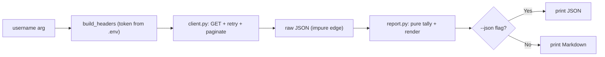

# Lab 3 — Build and Package GitHub Pulse (Milestone)

**Time: ~5 hrs · Difficulty: Core / Stretch · Builds on: Lab 1, Lab 2**

## Objective

Ship the month's milestone: **GitHub Pulse**, a real, installable CLI that takes a GitHub username and produces a Markdown activity report — recent public activity, recent pull requests, repositories the user has starred, and a breakdown of the languages across their repos. It reads its token from `.env`, supports a `--json` flag, survives rate limits using *your* `get_with_retry` from Lab 2, paginates where needed, ships with a small pytest suite that never touches the network, and installs as a genuine command via `uv tool` / `pipx`. This is the first program in the course that reaches into the world and returns something genuinely useful — and it is the same GET + auth + retry + pagination + parse pipeline that every model-API call later in the course is built from.

## Setup

```zsh
cd ~/agentic/month-04
uv init github-pulse --package --python 3.12
cd github-pulse
uv add requests python-dotenv
uv add --dev pytest
git init
echo ".env" >> .gitignore
echo ".venv/" >> .gitignore
cp ~/agentic/month-04/api-basics/.env .env        # reuse your token
```

Confirm: `git status` does **not** list `.env`, and `cat pyproject.toml` shows `requests` and `python-dotenv` under dependencies plus `pytest` under a dev group.

## Background

**Recall first (from memory):** From Lab 2, what does `get_with_retry` retry on, and what does the `max_pages` cap protect against? From Month 3, which `pyproject.toml` table turns a function into an installable command? Answer before reading on.

Everything from Labs 1 and 2 converges. Here is the pipeline you are assembling — the same shape every model-API call takes later:


*Notice: the network lives only in `client.py` (the left edge); everything in `report.py` is pure data-in/data-out, which is exactly why the tests can run with no network.*

Auth and `.env` come from Lab 1; `get_with_retry` and `get_all_pages` come from Lab 2 — you will copy that resilience module into this project. The new work is composition and polish: a thin `main()` that parses arguments (Month 3's `argparse`), a small client that gathers the data, **pure** functions that transform raw API JSON into a tally and into Markdown, a `--json` escape hatch, a tiny test suite, and a `[project.scripts]` entry point so the tool installs as `github-pulse`.

The design principle that makes this testable: **separate I/O from logic.** Functions that hit the network are impure and hard to test; functions that take data and return data (the language tally, the Markdown renderer) are pure and trivial to test with a fixed input. We keep them apart on purpose. That is the same architecture you will use to test agents in Month 5 and beyond — the network lives at the edges, the logic in the middle.

## Steps

### 1. Confirm the package layout and entry point

`uv init --package` created `src/github_pulse/` and a `[project.scripts]` table. Open `pyproject.toml` and edit the script entry to point at a `main` function we will write:

```toml
[project.scripts]
github-pulse = "github_pulse:main"
```

**Checkpoint:** `pyproject.toml` lists `requests` and `python-dotenv` in `[project] dependencies`, a `[dependency-groups]` (or `[tool.uv]`) dev group with `pytest`, and the `github-pulse = "github_pulse:main"` script line.
**If not:** if dependencies are missing, re-run `uv add requests python-dotenv` and `uv add --dev pytest`. If `uv init` did not create `[project.scripts]`, add the table by hand exactly as shown.

### 2. Bring over the resilience layer

Copy your Lab 2 module so this project is self-contained. Create `src/github_pulse/http.py` with the **same** `get_with_retry`, `_backoff`, and `_retry_after` from Lab 2, and add `get_all_pages`:

```python
import random
import time
import requests

RETRYABLE_STATUS = {429, 500, 502, 503, 504}


def get_with_retry(url, *, headers=None, params=None,
                   max_attempts=5, timeout=10, max_wait=60):
    for attempt in range(max_attempts):
        try:
            resp = requests.get(url, headers=headers, params=params, timeout=timeout)
        except (requests.exceptions.Timeout, requests.exceptions.ConnectionError):
            if attempt == max_attempts - 1:
                raise
            time.sleep(_backoff(attempt, max_wait))
            continue
        if resp.status_code not in RETRYABLE_STATUS:
            return resp
        if attempt == max_attempts - 1:
            return resp
        time.sleep(_retry_after(resp) or _backoff(attempt, max_wait))
    return resp


def get_all_pages(url, *, headers=None, params=None, max_pages=10):
    params = dict(params or {}, per_page=100)
    results, next_url, next_params = [], url, params
    for _ in range(max_pages):
        resp = get_with_retry(next_url, headers=headers, params=next_params)
        resp.raise_for_status()
        results.extend(resp.json())
        nxt = resp.links.get("next")
        if not nxt:
            break
        next_url, next_params = nxt["url"], None
    return results


def _backoff(attempt, max_wait):
    return min(2 ** attempt, max_wait) + random.uniform(0, 1)


def _retry_after(resp):
    value = resp.headers.get("Retry-After")
    return float(value) if value and value.isdigit() else None
```

**Checkpoint:** `uv run python -c "from github_pulse.http import get_with_retry, get_all_pages; print('ok')"` prints `ok`.
**If not:** `ModuleNotFoundError` means the file is in the wrong place (it must be `src/github_pulse/http.py`) or you ran bare `python` — use `uv run` from the project root.

### 3. The client: gather raw data from GitHub

Create `src/github_pulse/client.py`. It builds the auth headers and fetches the four data sources, returning raw Python data (lists/dicts) — no formatting here.

```python
import os
from dotenv import load_dotenv
from github_pulse.http import get_with_retry, get_all_pages

API = "https://api.github.com"


def build_headers():
    load_dotenv()
    token = os.environ.get("GITHUB_TOKEN")
    if not token:
        raise SystemExit("github-pulse: set GITHUB_TOKEN in .env")
    return {
        "Authorization": f"Bearer {token}",
        "Accept": "application/vnd.github+json",
        "User-Agent": "github-pulse",
    }


def fetch_user(headers, username):
    resp = get_with_retry(f"{API}/users/{username}", headers=headers)
    if resp.status_code == 404:
        raise SystemExit(f"github-pulse: no such user '{username}'")
    resp.raise_for_status()
    return resp.json()


def fetch_events(headers, username, max_pages=2):
    return get_all_pages(f"{API}/users/{username}/events/public",
                         headers=headers, max_pages=max_pages)


def fetch_repos(headers, username, max_pages=3):
    return get_all_pages(f"{API}/users/{username}/repos",
                         headers=headers, params={"sort": "updated"},
                         max_pages=max_pages)


def fetch_starred(headers, username, max_pages=2):
    return get_all_pages(f"{API}/users/{username}/starred",
                         headers=headers, max_pages=max_pages)


def gather(username):
    headers = build_headers()
    fetch_user(headers, username)            # validates the user exists / token works
    events = fetch_events(headers, username)
    repos = fetch_repos(headers, username)
    starred = fetch_starred(headers, username)
    return {"username": username, "events": events,
            "repos": repos, "starred": starred}
```

**Checkpoint:** `uv run python -c "from github_pulse.client import gather; import json; print(len(gather('octocat')['repos']), 'repos gathered')"` prints a repo count. (This makes live calls — it is the only network step; the tests in Step 7 will not.)
**If not:** a `SystemExit` about `GITHUB_TOKEN` means `.env` did not load — confirm it copied over in Setup. A `403` means you are rate-limited or anonymous; check the token loaded (Lab 2's `ratelimit.py`).

Steps 4–5 teach the new skill of the milestone — *separating pure logic from I/O so it is testable* — as a gradual release: a worked pure function, a faded one you complete, then (in Step 7) an independent test you design.

### Stage 1 — Worked example (I do)

### 4. Pure logic: tally languages and slice events

Study these complete functions, then create `src/github_pulse/report.py`. Notice the shared property: each takes raw API data and returns summarized data — **no network, no printing** — which is exactly what makes them testable.

```python
from collections import Counter


def language_tally(repos):
    """Count repos per language, ignoring repos with no detected language."""
    counts = Counter(r["language"] for r in repos if r.get("language"))
    return counts.most_common()


def recent_pushes(events, limit=5):
    """Pull commit messages out of PushEvents."""
    pushes = []
    for ev in events:
        if ev.get("type") != "PushEvent":
            continue
        repo = ev["repo"]["name"]
        for commit in ev["payload"].get("commits", []):
            pushes.append((repo, commit["message"].splitlines()[0]))
    return pushes[:limit]


def recent_prs(events, limit=5):
    """Pull pull-request actions out of PullRequestEvents."""
    prs = []
    for ev in events:
        if ev.get("type") != "PullRequestEvent":
            continue
        pr = ev["payload"]["pull_request"]
        prs.append((ev["payload"]["action"], ev["repo"]["name"], pr["title"]))
    return prs[:limit]


def starred_summary(starred, limit=10):
    return [(r["full_name"], r.get("stargazers_count", 0)) for r in starred[:limit]]
```

**Checkpoint:** `uv run python -c "from github_pulse.report import language_tally; print(language_tally([{'language':'Python'},{'language':'Python'},{'language':'Go'},{'language':None}]))"` prints `[('Python', 2), ('Go', 1)]` — note the `None` repo is ignored.
**If not:** if the `None` repo is counted, the `if r.get("language")` filter is missing; a `KeyError` means you used `r["language"]` instead of `r.get("language")`.

### Stage 2 — Faded practice (we do)

### 5. Pure rendering: data to Markdown

Same pure-function discipline, but you complete one section. The renderer takes the gathered data and returns a Markdown *string* — no I/O, so a test can assert on the exact text. Three sections are written; fill the `# TODO` for the **Languages used** section, following the exact pattern of the others (a bulleted line per item, an italic placeholder when empty).

```python
def render_markdown(data):
    user = data["username"]
    pushes = recent_pushes(data["events"])
    prs = recent_prs(data["events"])
    langs = language_tally(data["repos"])
    stars = starred_summary(data["starred"])

    lines = [f"# GitHub Pulse: {user}", ""]

    lines.append("## Recent commits")
    if pushes:
        lines += [f"- `{repo}` — {msg}" for repo, msg in pushes]
    else:
        lines.append("- _no recent public pushes_")
    lines.append("")

    lines.append("## Recent pull requests")
    if prs:
        lines += [f"- {action} **{title}** in `{repo}`" for action, repo, title in prs]
    else:
        lines.append("- _no recent pull request activity_")
    lines.append("")

    # TODO: render "## Languages used" from `langs` (list of (lang, count));
    #       one "- {lang}: {count}" line each, or "- _no languages detected_" if empty.

    lines.append("## Recently starred")
    if stars:
        lines += [f"- `{name}` (★ {count})" for name, count in stars]
    else:
        lines.append("- _none_")
    lines.append("")

    return "\n".join(lines)
```

<details><summary>Solution for the TODO</summary>

```python
    lines.append("## Languages used")
    if langs:
        lines += [f"- {lang}: {count}" for lang, count in langs]
    else:
        lines.append("- _no languages detected_")
    lines.append("")
```
</details>

**Checkpoint:** you can render without the network by feeding empty lists: `uv run python -c "from github_pulse.report import render_markdown; print(render_markdown({'username':'x','events':[],'repos':[],'starred':[]}))"` prints a full report skeleton with the italic "no …" placeholders — including the languages section.
**If not:** a missing `## Languages used` heading means the TODO is unfilled; a `ValueError` on unpacking means you iterated `langs` as single values instead of `(lang, count)` pairs.

### 6. The CLI: argparse, `--json`, and `main`

Create `src/github_pulse/__init__.py`:

```python
import argparse
import json
import sys
from github_pulse.client import gather
from github_pulse.report import render_markdown


def main():
    ap = argparse.ArgumentParser(
        prog="github-pulse",
        description="Produce a Markdown activity report for a GitHub user.",
    )
    ap.add_argument("username", help="the GitHub username to report on")
    ap.add_argument("--json", action="store_true",
                    help="emit raw gathered data as JSON instead of Markdown")
    args = ap.parse_args()

    try:
        data = gather(args.username)
    except SystemExit:
        raise                                # already a clean message
    except Exception as exc:                 # last-resort guard
        print(f"github-pulse: {exc}", file=sys.stderr)
        raise SystemExit(1)

    if args.json:
        print(json.dumps(data, indent=2))
    else:
        print(render_markdown(data))


if __name__ == "__main__":
    main()
```

```zsh
uv run github-pulse octocat
uv run github-pulse octocat --json | head -20
```

**Checkpoint:** the first command prints a full Markdown report to your terminal; the second prints valid JSON (pipe it through `jq .` from Month 2 to confirm it parses). `uv run github-pulse --help` shows a clean help screen. Redirect to a file and open it: `uv run github-pulse octocat > pulse.md`.
**If not:** `command not found` for `github-pulse` under `uv run` means the `[project.scripts]` line is wrong — it must be `github-pulse = "github_pulse:main"` and `main` must exist in `__init__.py`. An import error means a module name is misspelled.

### Stage 3 — Independent (you do)

### 7. A tiny pytest suite — no network

This is where the pure-vs-impure split pays off. Below are three tests over the pure functions with fixed data — they run instantly and offline. Create `tests/test_report.py` with them, **then add a fourth test of your own** (no scaffolding): assert that `starred_summary(FAKE["starred"])` returns the expected `(full_name, count)` pair. You design the assertion from the function's behavior.

```python
from github_pulse.report import language_tally, render_markdown, recent_pushes

FAKE = {
    "username": "tester",
    "events": [
        {"type": "PushEvent", "repo": {"name": "me/proj"},
         "payload": {"commits": [{"message": "fix bug\n\ndetails"}]}},
    ],
    "repos": [{"language": "Python"}, {"language": "Python"},
              {"language": "Rust"}, {"language": None}],
    "starred": [{"full_name": "torvalds/linux", "stargazers_count": 1}],
}


def test_language_tally_counts_and_ignores_none():
    assert language_tally(FAKE["repos"]) == [("Python", 2), ("Rust", 1)]


def test_recent_pushes_takes_first_line_of_message():
    pushes = recent_pushes(FAKE["events"])
    assert pushes == [("me/proj", "fix bug")]


def test_render_markdown_has_all_sections_and_user():
    md = render_markdown(FAKE)
    assert "# GitHub Pulse: tester" in md
    for heading in ["## Recent commits", "## Languages used",
                    "## Recently starred", "## Recent pull requests"]:
        assert heading in md
    assert "Python: 2" in md
```

```zsh
uv run pytest -q
```

**Checkpoint:** `4 passed` in a fraction of a second (three given + your own `starred_summary` test), with **no network access** — pytest never imported `client.py`. This is the habit that matters: logic is tested without the network, because the network lives only in `client.py`.
**If not:** if pytest cannot import `github_pulse`, run `uv run pytest` from the project root (not bare `pytest`). If your fourth test fails, print the actual return value of `starred_summary(FAKE["starred"])` and match your assertion to it.

### 8. A faked-response test (stretch into mocking)

Add `tests/test_http.py` to prove `get_with_retry` returns a non-retryable response without sleeping, using `monkeypatch` to replace the real network call:

```python
from github_pulse import http


class FakeResp:
    def __init__(self, status_code):
        self.status_code = status_code
        self.headers = {}


def test_get_with_retry_returns_non_retryable_immediately(monkeypatch):
    calls = {"n": 0}

    def fake_get(url, **kwargs):
        calls["n"] += 1
        return FakeResp(404)                 # not in RETRYABLE_STATUS

    monkeypatch.setattr(http.requests, "get", fake_get)
    resp = http.get_with_retry("http://example.test", max_attempts=5)
    assert resp.status_code == 404
    assert calls["n"] == 1                   # no retries on a 404
```

```zsh
uv run pytest -q
```

**Checkpoint:** `5 passed` (the four from Step 7 plus this faked-network test). You faked the network entirely — the test confirms a `404` is returned after exactly one call, no retries — and it ran with no internet at all. This is the core technique for testing networked code, expanded fully in Month 5.
**If not:** if `monkeypatch` did not intercept the call (the test hangs or hits the network), confirm you patched `http.requests.get` — the *same* `requests` object the module imported — not a fresh `import requests` in the test.

### 9. Write the README and commit

Create `README.md` documenting: what it does, the `GITHUB_TOKEN` setup in `.env`, how to run (`uv run github-pulse <user>` and `--json`), and the install command from Step 10. Then:

```zsh
git add -A
git commit -m "GitHub Pulse milestone"
git log -p | grep -i -E 'github_pat_|ghp_|GITHUB_TOKEN=' || echo "CLEAN: no token in history"
```

**Checkpoint:** `CLEAN: no token in history`. Push to a new GitHub repo (`gh repo create github-pulse --public --source=. --push`) and confirm `.env` is **not** in the GitHub file list.
**If not:** if the grep prints a token, `.env` was committed — rotate the token immediately (it is compromised), `git rm --cached .env`, fix `.gitignore`, and scrub history before pushing (see Troubleshooting).

### 10. Install it as a real command

```zsh
uv tool install .
github-pulse octocat
```

(`pipx install .` works identically if you prefer pipx.) Because the installed tool runs from its own location, it needs the token in the *environment* — either run it from a directory with a `.env`, or `export GITHUB_TOKEN=...` in your shell first (the production pattern from Core Concepts §4).

**Checkpoint:** typing `github-pulse octocat` from any directory (with the token available) produces the report. You shipped a real, installed CLI. Uninstall later with `uv tool uninstall github-pulse`.
**If not:** `command not found` after install means `~/.local/bin` is not on your `PATH` — run `uv tool update-shell` and restart the shell. "Token missing" from any directory is expected: the installed tool needs `export GITHUB_TOKEN=...` or a `.env` in the current directory (see Troubleshooting).

## Definition of Done

- `uv run github-pulse <username>` prints a Markdown report with all four sections (commits, PRs, languages, starred) from live data.
- `uv run github-pulse <username> --json` emits valid JSON (confirmed with `jq .`).
- The token loads from `.env`; `.env` is git-ignored and the leak check prints `CLEAN`.
- `client.py` uses `get_with_retry`/`get_all_pages` (timeouts, backoff+jitter, pagination with a page cap) for every call.
- `uv run pytest -q` passes with at least three tests, all offline (no live network).
- `pyproject.toml` has a `[project.scripts]` entry; `uv tool install .` produces a working `github-pulse` command.
- Repo is pushed to GitHub with a README and no token in history.
- Self-verify in one block:

```zsh
uv run pytest -q && \
uv run github-pulse octocat --json | jq '.username' && \
( git status --porcelain | grep -q '\.env' && echo "FAIL: .env tracked" || echo "OK: .env ignored" )
```

**Self-explain:** in one sentence, why does keeping the network inside `client.py` and the logic inside `report.py` let your test suite run with no internet at all?

## Stretch Goals

1. **A `--top N` flag** to control how many languages/starred repos appear, threaded through `argparse` into the renderer.
2. **Cache to disk.** Add `--cache` that writes the gathered JSON to a file and reuses it on the next run (with a timestamp check), so you can iterate on rendering without re-hitting the API — a preview of caching agent results.
3. **Sleep-until-reset.** Wire the Lab 2 stretch (honor `X-RateLimit-Reset` on a 403/429) into this project's `http.py` and prove it with a comment in the README.
4. **A real fixture file.** Save one live `--json` run to `tests/fixtures/octocat.json`, load it in a test, and assert the renderer produces stable Markdown from it (golden-file testing).
5. **Publish to TestPyPI** (advanced): build with `uv build` and upload to TestPyPI so `pipx install --index-url ...` works from anywhere.

## Troubleshooting

- **`github-pulse: command not found` after `uv tool install`.** `uv` installs tools to `~/.local/bin`; ensure it is on your `PATH` (`uv tool update-shell`, then restart the shell).
- **Installed tool says token is missing but `uv run` works.** The installed command does not see your project's `.env`. `export GITHUB_TOKEN=...` in the shell, or run it from a directory containing a `.env`.
- **`KeyError: 'payload'` or `'pull_request'` for some users.** Event payloads vary by event type. The `report.py` functions already filter by `ev["type"]` first; if you add event types, guard every nested access with `.get(...)`.
- **Empty "Recent commits" for an active user.** The public events feed only covers recent activity and only *public* events; a user whose recent work is private or older than the feed window will legitimately show "no recent public pushes." Try a busy user like `torvalds`.
- **`403` mid-run.** You hit the rate limit. Confirm the token loaded (authenticated = 5000/hr vs 60/hr anonymous), and let `get_with_retry` back off; for the unauthenticated case, run `ratelimit.py` from Lab 2 to see your reset time.
- **`pytest` can't import `github_pulse`.** With the `--package`/`src` layout, run tests via `uv run pytest` from the project root so the package is on the path; do not run bare `pytest`.
- **`.env` appeared on GitHub.** Stop. It was committed before being ignored. Rotate the token immediately (it is compromised), `git rm --cached .env`, fix `.gitignore`, and scrub history (`git filter-repo`) before re-pushing. This is the Month-2 lesson in practice.
