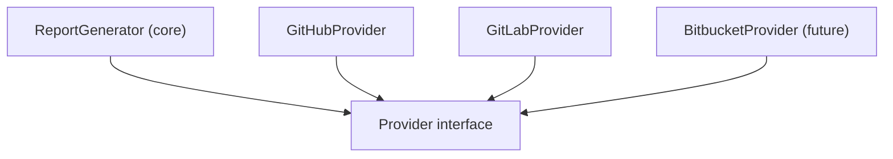
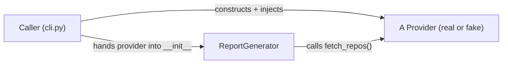

# Month 05 — Software Engineering Principles

**Phase: Foundations**

## Overview

You can write working Python that talks to the network. After Month 4 you built "GitHub Pulse" — a CLI that authenticates, paginates, retries on failure, and prints a report. It works. It is also a *script*: one long file (or a few), functions that reach out and grab whatever they need, logic and I/O and configuration all braided together. It runs, but you would not want to change it. Add a feature and something three screens away breaks. That fragility is not a Python problem; it is a *design* problem, and design is what this month is about.

This is the month that turns a scripter into an engineer. The distinction is not about syntax — you already know the syntax. It is about *structure*: organizing code so that it can be read, tested, and changed without fear. We cover functions as contracts, pure functions versus side effects, object-oriented Python, modules and import semantics, dependency injection, the SOLID principles (with deep, load-bearing focus on Single Responsibility and Open/Closed), testing with `pytest`, type hints checked in strict mode, structured logging, and `Protocol`s and ABCs as the way to define interfaces. None of this is AI-specific. All of it is the foundation the AI months stand on.

Two ideas in particular are not optional and will not be hand-waved: **Single Responsibility** (each unit of code does one thing, so there is exactly one reason for it to change) and **Open/Closed** (code should be open to extension but closed to modification — you add new behavior by adding new code, not by editing code that already works). These are the load-bearing walls. Month 7, the first Extensible Software pillar, is built directly on top of them. We practice them this month, before any model enters the picture, so that when you later write an agent that must support new tools, new providers, and new model backends without a rewrite, the instinct is already there.

The capstone is the **Refactor Crucible**: rebuild GitHub Pulse from scratch as engineered software — OOP, full type hints, a `pytest` suite at 80%+ coverage — and make it support *pluggable providers* so the same tool reports from GitHub **or** GitLab without ever modifying the core report generator. That last constraint is your first taste of Pillar 3 thinking. You will feel the difference between the two versions in your hands, and you will document it.

Here is the mental model the whole month is reaching for. The report generator (the core) does not depend on GitHub or GitLab; it depends on a `Provider` *interface*. The concrete providers depend on that same interface. Because the dependency points *toward the abstraction*, you add a new source by writing a new class — never by editing the core:


*Notice: everything points at the interface. Adding the dashed future provider touches no existing box — that is Open/Closed in one picture.*

## Prerequisites

Coming in, you should be able to do everything from Months 1 through 4:

- Navigate the filesystem, use Git and GitHub, and read HTTP/JSON (Months 1–2).
- Write Python programs: functions, the four core data structures, files, JSON/CSV, `try`/`except`, `argparse`, and the `__main__` guard (Month 3).
- Call real APIs from Python with `requests`: send headers, handle auth, paginate, retry with backoff, and load secrets from a `.env` file (Month 4).
- Manage a project with `uv`: `uv init --package`, `uv add`, `uv run`, and read a `pyproject.toml` (Months 3–4).
- Have the Month 4 "GitHub Pulse" repository on hand — you will study it, then rebuild it.

No object-oriented or testing experience is assumed. This month introduces both from zero.

## Warm-Up: Retrieve Before You Begin

Before reading on, answer these from memory — no peeking at earlier months. This pulls forward the prior skills this month builds on.

1. In Month 3 you used a Python `dict`. How do you count occurrences of each value with one — e.g., tally how many times each `state` string appears in a list?
2. What does a Python function `return`, and what is the difference between a function that returns a value and one that only `print`s?
3. In the Month 4 GitHub Pulse script, which library sent the HTTP requests, and how did you attach your token to a request?
4. In that same script, name two distinct jobs your code did (for example: fetching data, computing a number, printing output). Could you point at the lines for each?
5. How did Month 4 keep your token out of the source code?

<details><summary>Check your recall</summary>

1. Loop and use `counts[key] = counts.get(key, 0) + 1` (Month 3, data-structures lab). You will rebuild exactly this as a pure `count_by_state` function.
2. `return` hands a value back to the caller for further use; `print` only emits text to `stdout` and returns `None` (Month 3). This month makes that distinction load-bearing: logic returns, the shell prints.
3. `requests`; you set an `Authorization: Bearer <token>` header (Month 4, the API lab).
4. Typically fetch + paginate, compute statistics, and format/print — all braided into one or two functions (Month 4). That braiding is the design problem this month untangles.
5. A `.env` file loaded at runtime, with `.env` listed in `.gitignore` (Month 4 secrets discipline). Pulse v2 reuses the same pattern.
</details>

## Learning Objectives

By the end of this month you can:

1. **Explain** what makes a function a *contract* and **distinguish** pure functions from functions with side effects, refactoring code to push side effects to the edges.
2. **Design** classes in Python — including `__init__`, instance methods, and the common dunder methods (`__repr__`, `__eq__`) — and **choose** composition over inheritance with a reason.
3. **Define** an interface in Python using `Protocol` (and recognize ABCs), and **implement** two interchangeable classes against it.
4. **Apply** dependency injection by passing collaborators into a class rather than constructing them inside it, and **explain** why that makes code testable.
5. **Organize** code into modules and packages, **explain** why circular imports happen, and break one when it occurs.
6. **Apply** the Single Responsibility and Open/Closed principles, and **identify** violations in existing code (including your own Month 4 tool).
7. **Write** a `pytest` suite using fixtures, `parametrize`, and mocking, **measure** coverage, and **judge** what is worth testing versus overkill.
8. **Add** type hints throughout a codebase and **run** `mypy` (or Pyright) in strict mode with zero errors.
9. **Replace** `print` debugging with structured (JSON) logging and **explain** when each is appropriate.

## Tech Stack (free, macOS)

| Tool | Install | Why |
|---|---|---|
| Python 3.12+ | `uv python install 3.12` | The language. Managed per-project by `uv`, never the system Python. |
| uv | `brew install uv` | Project, environment, and dependency manager from Months 3–4. |
| pytest | `uv add --dev pytest pytest-cov` | The standard Python test runner; `pytest-cov` measures coverage. |
| mypy | `uv add --dev mypy` | Static type checker. We run it in **strict** mode. |
| Pyright | `uv add --dev pyright` (optional) | Alternative type checker (the engine behind VS Code's Pylance). Pick one; we default to `mypy`. |
| ruff | `uv add --dev ruff` (optional) | Fast linter/formatter. Not required, but catches many issues `mypy` won't. |
| VS Code | `brew install --cask visual-studio-code` | Free editor. The Python + Pylance extensions surface type errors inline as you type. |
| Git + GitHub | from Month 1 | Commit each lab; push the Refactor Crucible repo. |

No paid services and no LLM access are required this month. The GitHub API calls reuse the free token from Month 4; GitLab offers a free personal access token. Everything runs offline except the live API calls in the capstone, and even those can be mocked.

## Weekly Breakdown

Budget ~8–12 hours per week: roughly a third reading and typing along, two-thirds in the labs. This month is heavier on practice than Month 3 because design is learned by doing and then feeling the pain of bad choices.

### Week 1 — Functions, purity, and objects
**Warm-start (do this first):** before any new material, re-run your Month 4 GitHub Pulse tool once and read its source with fresh eyes. Pick one function and write a one-line note: *how many distinct jobs does it do?* Keep that note — it is the "before" picture you will compare against in the capstone writeup.
**Focus:** the two organizing units of code — functions as contracts and classes as bundles of state plus behavior.
**Topics:** functions as contracts (clear inputs, one job, predictable output); pure functions vs. side effects and why purity makes code testable; `class`, `__init__`, `self`, instance methods; the key dunder methods (`__repr__`, `__eq__`, `__lt__`); when a class earns its keep versus when a function or a dataclass is enough; `@dataclass` for plain records.
**Reading:** Core Concepts §1–§3.
**Build:** Lab 1, part 1 — model a small domain with classes and pure functions.

### Week 2 — Composition, interfaces, and dependency injection
**Focus:** how objects collaborate, and how to make those collaborations swappable.
**Topics:** composition over inheritance (has-a beats is-a); `Protocol` as a structural interface and ABCs as a nominal one; dependency injection (pass collaborators in, don't `new` them inside); the Single Responsibility Principle and the Open/Closed Principle in concrete code; modules vs. packages, `import` semantics, `__init__.py`, and why circular imports happen (and how to break them).
**Reading:** Core Concepts §4–§7.
**Build:** Lab 1, part 2 — a `Protocol`-based interface with two implementations, wired together by injection.

### Week 3 — Testing and types
**Focus:** proving code works and proving it is consistent, automatically.
**Topics:** `pytest` mechanics (`test_` discovery, `assert`, running a subset); fixtures for shared setup; `@pytest.mark.parametrize` for table-driven tests; mocking with `monkeypatch` and `unittest.mock` (and *why* dependency injection makes mocks mostly unnecessary); what to test vs. overkill; coverage with `pytest-cov`; type hints (`list[int]`, `dict[str, X]`, `Optional`, `|`, `Protocol` in annotations); running `mypy --strict` and reading its output.
**Reading:** Core Concepts §8–§10.
**Build:** Lab 2 — a tested, fully typed, strict-clean small library.

### Week 4 — The Refactor Crucible
**Focus:** putting it all together by rebuilding real software the right way.
**Topics:** structured (JSON) logging vs. `print`; designing a provider `Protocol`; the report generator that depends on the interface, not the provider; test-first development; reaching 80%+ coverage; writing the design comparison.
**Reading:** Core Concepts §11; re-read §4–§7 before starting.
**Build:** Lab 3 — the **Refactor Crucible** milestone: GitHub Pulse v2 with pluggable GitHub/GitLab providers and a `docs/v1-vs-v2.md` writeup.

## Core Concepts

### §1 — A function is a contract

You already write functions. This month you start treating them as **contracts**: a promise about what goes in, what comes out, and what is *not* affected. A good function has a name that says what it does, parameters that say what it needs, a return value that says what it produces, and — crucially — no surprises. Reading the signature should tell you most of the story:

```python
def summarize(prs: list[dict]) -> dict[str, int]:
    """Count pull requests by state. Pure: reads its argument, returns a new dict."""
    counts: dict[str, int] = {}
    for pr in prs:
        state = pr["state"]
        counts[state] = counts.get(state, 0) + 1
    return counts
```

The contract here is honest: give me a list of PR dicts, get back a count by state, and nothing else in the program changes. Compare that to a function named `process()` that takes no arguments, reads a global, writes a file, and returns `None`. Its signature tells you nothing, so to understand it you must read every line — and to *change* it safely you must understand the whole program. Contracts are how you stop holding the whole program in your head.

### §2 — Pure functions and the real cost of side effects

A **pure function** depends only on its arguments and affects only its return value. Same inputs, same output, every time, with no observable trace left behind. `summarize` above is pure. A function that prints, writes a file, sends an HTTP request, reads the clock, or mutates a shared list is **impure** — it has a *side effect*.

Side effects are not evil; a program with none does nothing useful. The point is that side effects are *expensive to reason about and hard to test*. To test a pure function you call it and check the return value — done. To test an impure one you must arrange the world around it (a fake file, a fake clock, a fake network) and inspect the world afterward. The engineering move is therefore to **push side effects to the edges**: keep a thin shell that does I/O and a large core of pure functions that compute. This "functional core, imperative shell" split is the single biggest lever you have on testability, and it is exactly why your Month 4 tool — where fetching, computing, and printing are tangled together — is so hard to test. We will untangle it.

### §3 — Objects: state plus behavior

A class bundles **data** (state) with the **functions that operate on it** (behavior). Use one when a thing has identity and changing state over its lifetime, or when several functions naturally share the same data.

```python
class RateLimiter:
    def __init__(self, max_calls: int) -> None:
        self.max_calls = max_calls
        self._used = 0

    def allow(self) -> bool:
        if self._used >= self.max_calls:
            return False
        self._used += 1
        return True

    def __repr__(self) -> str:
        return f"RateLimiter(max_calls={self.max_calls}, used={self._used})"
```

`__init__` is the constructor; `self` is the instance the method is called on. The leading underscore on `_used` is a convention meaning "internal — don't touch from outside." **Dunder** ("double underscore") methods hook into Python's syntax: `__repr__` controls what you see in the debugger and REPL (always write one — a class without it prints a useless `<object at 0x...>`); `__eq__` defines `==`; `__lt__` enables sorting. For a class that is *just a record* with no behavior, reach for `@dataclass`, which writes `__init__`, `__repr__`, and `__eq__` for you:

```python
from dataclasses import dataclass

@dataclass
class Repo:
    name: str
    stars: int
```

The discipline: a class should still have **one responsibility**. A `RateLimiter` limits rates; it does not also format reports. When you notice a class doing two unrelated things, that is two classes.

### §4 — Composition over inheritance

> **Common misconception.** Inheritance is the main tool for code reuse in object-oriented programming — to share behavior, subclass.
> **Reality.** Inheritance is the *tightest* coupling there is, and most "reuse" is better served by composition (holding an object and delegating to it). The belief is tempting because tutorials lead with `class Dog(Animal)` and it feels like the point of classes; in real systems, deep hierarchies are where change goes to die.

Inheritance (`class Cat(Animal)`) expresses an *is-a* relationship and lets a subclass reuse and override a parent's behavior. It is tempting and frequently overused. The problem is that inheritance is the tightest coupling in object-oriented code: a subclass depends on the parent's internals, and a change upstream silently breaks subclasses. Deep hierarchies become impossible to reason about.

**Composition** expresses a *has-a* relationship: an object holds other objects and delegates to them.

```python
class ReportGenerator:
    def __init__(self, formatter: "Formatter") -> None:
        self._formatter = formatter   # has-a Formatter

    def render(self, data: dict) -> str:
        return self._formatter.format(data)
```

`ReportGenerator` *has a* formatter rather than *being* one. To change formatting, swap the collaborator — no subclassing, no fragile override. The guideline, repeated by practitioners for thirty years: **favor composition over inheritance.** Reach for inheritance only when there is a genuine, stable is-a relationship and you want polymorphism; reach for composition the rest of the time, which is most of the time. (In Python, even the polymorphism you'd want inheritance for is usually better served by a `Protocol` — next section.)

### §5 — Interfaces: `Protocol` and ABCs

An **interface** is a promise about *what methods an object has*, separate from *how they work*. It is the contract that lets two different classes be used interchangeably. Python gives you two ways to express one.

A **`Protocol`** (from `typing`) defines a *structural* interface — "anything with these methods counts," no inheritance required. This is Python's idiomatic, duck-typing-friendly way to define an interface:

```python
from typing import Protocol

class Provider(Protocol):
    def fetch_repos(self) -> list[dict]: ...
    def fetch_pull_requests(self, repo: str) -> list[dict]: ...
```

Any class with those two methods *is* a `Provider`, even though it never mentions `Provider` in its definition. The type checker enforces the shape; nothing else has to. An **ABC** (Abstract Base Class, from `abc`) defines a *nominal* interface — a class must explicitly inherit from it and implement its `@abstractmethod`s, and Python refuses to instantiate an incomplete subclass at runtime. ABCs give you runtime enforcement and shared default code; `Protocol`s give you looser coupling and work with classes you don't own. For this course we default to `Protocol`, because the whole point is that providers, tools, and model backends should plug in *without* having to inherit from our base class. When you read "interface" or "protocol" later in the course, this is the mental model: a named set of methods that callers depend on instead of depending on a concrete class.

### §6 — Dependency injection (without the scary name)

> **Heavy concept ahead.** Slow down here; this is the load-bearing idea of the month. Interfaces (§5) plus injection (§6) are what make Open/Closed (§7) and the entire capstone possible. If only one section sticks, make it this one.

**Dependency injection** sounds like enterprise jargon; the idea is one sentence: *pass an object's collaborators in from outside rather than constructing them inside.* Compare:

```python
# Hard to test: the report builder reaches out and builds its own provider.
class Report:
    def __init__(self) -> None:
        self._provider = GitHubProvider(token=os.environ["GH_TOKEN"])  # baked in

# Easy to test: the collaborator is handed in.
class Report:
    def __init__(self, provider: Provider) -> None:
        self._provider = provider  # whatever satisfies the Provider protocol
```

The second version never names `GitHubProvider`. It depends on the `Provider` *interface*, so you can hand it a `GitHubProvider`, a `GitLabProvider`, or — in a test — a `FakeProvider` that returns canned data with no network at all. That is the entire trick, and it is why DI and `Protocol`s are taught together: injection is *how* you swap implementations, and the protocol is *what guarantees* the swapped-in thing fits. This single pattern is what makes the Open/Closed principle achievable, and it is the backbone of the capstone.


*Notice: the caller owns the choice of collaborator; `ReportGenerator` just uses whatever it was given. Swap the provider at the caller, and the generator never changes.*

### §7 — SOLID, with the two that matter most

SOLID is five principles. You should know all five exist, but two are load-bearing for this course; the rest you will absorb over time.

- **S — Single Responsibility.** A unit of code should have *one reason to change*. Your Month 4 tool likely has a function that fetches data, computes statistics, *and* formats output. Three responsibilities means three reasons to change means three ways to break it when you touch any one. Split it: a fetcher, a summarizer, a formatter. Each is small, each is testable, each changes for its own reason.
- **O — Open/Closed.** Code should be *open to extension but closed to modification*: you add new behavior by writing new code, not by editing code that already works and is already tested. The litmus test: "to support GitLab, do I have to edit the report generator?" If yes, it is not closed — every new provider risks breaking the last one. If you can add a `GitLabProvider` class and the generator never changes, you have achieved it. This is the principle the capstone is graded on, and it is *only* reachable through interfaces (§5) and injection (§6).
- **L — Liskov Substitution.** Anything claiming to be a `Provider` must actually behave like one (no surprises, no throwing where the interface promised a value). Subtypes must be honestly substitutable.
- **I — Interface Segregation.** Prefer several small interfaces over one fat one. A class shouldn't be forced to implement methods it doesn't use.
- **D — Dependency Inversion.** Depend on abstractions (the `Provider` protocol), not concretions (`GitHubProvider`). You already did this in §6 — the high-level report generator depends on the interface, and the low-level provider implements it.

Notice S, O, and D reinforce each other: single responsibilities give you small swappable pieces; depending on abstractions lets you swap them; and that swappability is exactly what "open for extension, closed for modification" means in practice.

### §8 — Testing with pytest

A test is a small program that runs your code and asserts what should be true. `pytest` finds any function named `test_*` in any file named `test_*.py` and runs it; a plain `assert` is all you need.

```python
# test_summary.py
from pulse.summary import summarize

def test_summarize_counts_by_state() -> None:
    prs = [{"state": "open"}, {"state": "open"}, {"state": "closed"}]
    assert summarize(prs) == {"open": 2, "closed": 1}
```

Run it with `uv run pytest`. Three tools make tests less repetitive and more thorough:

- **Fixtures** (`@pytest.fixture`) provide shared setup — a sample dataset, a temp directory, a fake provider — injected into any test that names them as a parameter. This is dependency injection applied to tests.
- **`@pytest.mark.parametrize`** runs the same test body over a table of inputs and expected outputs, so one test function covers many cases without copy-paste.
- **Mocking** (`monkeypatch`, `unittest.mock`) replaces a real collaborator — usually a network call or the clock — with a controllable fake. The deep lesson: *if your code uses dependency injection, you rarely need mocking magic* — you just pass in a fake object that satisfies the protocol. Mocking is the escape hatch for code you can't (yet) inject into.

> **Common misconception.** More tests are always better; high coverage means the code is correct.
> **Reality.** Coverage measures which lines *ran*, not whether they were *checked* for the right behavior — you can hit 100% with assertions that never fail. The belief is tempting because a coverage number is easy to chase and feels like progress; a smaller suite of meaningful behavioral tests beats a large suite that mirrors the implementation and catches nothing.

What to test vs. overkill: test your **logic** (the pure functions — summaries, parsing, formatting decisions) thoroughly with `parametrize`; test the **wiring** (does the report generator call the provider and pass results to the formatter?) with a fake collaborator; do **not** write tests that re-assert the standard library works or that mirror the implementation line for line. A good test fails when behavior is wrong and passes when behavior changes shape but stays correct. Aim for coverage of meaningful branches, not a vanity 100%.

### §9 — Type hints and strict checking

> **Common misconception.** Type hints are enforced at runtime — if you annotate `x: int` and pass a `str`, Python will raise an error.
> **Reality.** Python *ignores* hints when running; they change nothing at runtime. They are checked *statically* by a separate tool (`mypy`/Pyright) before you run. The belief is tempting because other languages (Java, C++) do enforce types at runtime, and the syntax looks like it should — but in Python a hint is a note to the checker and to humans, not a guard rail the interpreter enforces.

Type hints annotate what a name holds. They do not change runtime behavior — Python ignores them when running — but a **type checker** (`mypy` or Pyright) reads them and proves, before you run anything, that you are not passing a `str` where an `int` is expected or calling a method that doesn't exist.

```python
def average_stars(repos: list[Repo]) -> float:
    if not repos:
        return 0.0
    return sum(r.stars for r in repos) / len(repos)
```

Modern syntax is lightweight: `list[int]`, `dict[str, int]`, `str | None` (the modern `Optional[str]`), and your own classes and `Protocol`s as annotations. Run the checker in **strict** mode — `uv run mypy --strict src` — which forbids untyped functions and `Any` leaks and catches the most bugs. Strict mode feels demanding at first; that friction is the checker finding real gaps in your reasoning. The payoff compounds: in a typed codebase, your editor autocompletes accurately, refactors are safe, and a whole class of "I passed the wrong thing" bugs becomes impossible. Treat a green `mypy --strict` as part of "done," exactly like a passing test suite.

### §10 — Modules, packages, and circular imports

A **module** is a `.py` file; a **package** is a directory of modules with an `__init__.py`. `import` runs a module top-to-bottom the first time it is imported and caches the result. Organize by responsibility: `pulse/providers.py`, `pulse/summary.py`, `pulse/report.py`, `pulse/cli.py`. This *is* Single Responsibility expressed in the file system.

A **circular import** happens when module A imports B and B imports A. Because import runs top-to-bottom, one of them tries to use a name from the other before it has been defined, and you get an `ImportError` or a half-built module. The usual root cause is a responsibility living in the wrong place — two modules that each reach into the other. The fix is almost never a clever import trick; it is to *extract the shared thing into a third module both depend on*, or to invert the dependency so it points one way. When you hit one this month, treat it as a design smell pointing at a layering problem, not a Python quirk to hack around.

### §11 — Logging vs. printing, and structured logs

`print` is for a program's *output* — the report a user asked for. **Logging** is for a program's *narration* — what it is doing, at what severity, for whoever operates it. The difference matters the moment a program runs unattended (every agent later in this course does). The standard library's `logging` module gives you levels (`DEBUG`, `INFO`, `WARNING`, `ERROR`), so you can turn detail up when debugging and down in normal operation, and it writes to `stderr` by default, keeping your real output clean on `stdout` (the Unix discipline from Month 3).

**Structured (JSON) logs** go one step further: each log line is a JSON object with fields, not a sentence.

```python
import json, logging, sys

logger = logging.getLogger("pulse")

def log_fetch(repo: str, count: int) -> None:
    logger.info(json.dumps({"event": "fetched_prs", "repo": repo, "count": count}))
```

A human reads sentences; a machine reads fields. When an always-on agent emits `{"event": "tool_call", "tool": "search", "ms": 240}` on every action, you can later filter, count, and aggregate those lines mechanically — impossible with free-text prose. You don't need a structured logger for a one-shot script, but you build the habit now because the always-on month depends on it.

## Labs

| Lab | Title | Time | Difficulty |
|---|---|---|---|
| [Lab 1](lab-1-oop-interfaces-and-dependency-injection.md) | OOP, Interfaces, and Dependency Injection | ~3.5 hrs | Core |
| [Lab 2](lab-2-pytest-deep-dive-and-strict-types.md) | pytest Deep Dive and Strict Types | ~3.5 hrs | Core |
| [Lab 3](lab-3-refactor-crucible-pluggable-providers.md) | The Refactor Crucible (Milestone) | ~6 hrs | Stretch |

## Checkpoints & Self-Assessment

Run these against yourself at the end of each week. You are on track if you can answer without looking it up.

- **Week 1:** Take any function from your Month 4 tool and say out loud whether it is pure or impure, and why. Can you write a five-line class with a sensible `__repr__` and `__eq__` (or justify using `@dataclass` instead)?
- **Week 2:** Without looking, write a two-method `Protocol` and a class that satisfies it without inheriting from it. Explain in one sentence why dependency injection makes that class easy to test. Can you name a circular import you'd create by putting a shared type in the wrong module?
- **Week 3:** Write a `parametrize`d test with three cases. Run `uv run mypy --strict` on a small module and get zero errors. Can you state one thing in your code that is *not* worth testing, and why?
- **Week 4:** Point at the line in your capstone that would have to change to add a third provider (Bitbucket). If the answer is "a new file, and nothing else," you have internalized Open/Closed.

## Reflect

Spend ten minutes on these in your learning log (writing, not just thinking):

- **Explain it back:** In two or three sentences, explain *dependency injection and why it makes code testable* as if teaching a peer who just finished Month 4 and only knows scripts.
- **Connect:** How does this month's "functional core, imperative shell" split change the way you would now write the Month 4 GitHub Pulse — specifically, which Month 4 functions would you break apart, and where would the side effects go?
- **Monitor:** Which concept this month is still fuzzy — Protocols vs. ABCs, Open/Closed, mocking vs. injection, or something else? Name it precisely, and write the one question that would clear it up.

## Month-End Assessment

**Deliverable:** the **Refactor Crucible** — a `uv`-managed repository that rebuilds Month 4's GitHub Pulse from scratch as engineered software (built in Lab 3). It must:

1. Be organized into modules by responsibility (providers, summary/logic, report, CLI).
2. Define a `Provider` `Protocol` and ship **two** implementations — `GitHubProvider` and `GitLabProvider` — that are interchangeable.
3. Generate its report through a component that depends on the `Provider` interface and is **never modified** to add a provider (Open/Closed).
4. Use dependency injection to wire the chosen provider in (no provider is constructed inside the report generator).
5. Carry full type hints and pass `uv run mypy --strict` with zero errors.
6. Have a `pytest` suite at **80%+ coverage** (`uv run pytest --cov`), including at least one `parametrize`d test and at least one test that injects a `FakeProvider` instead of hitting the network.
7. Use structured logging (not `print`) for its narration, reserving `stdout` for the report.
8. Include `docs/v1-vs-v2.md`: a writeup comparing the Month 4 script to this version, naming the specific SRP/Open-Closed improvements and what each made possible.
9. Be pushed to GitHub.

**Rubric**

- **Passing:** Runs against GitHub and produces a correct report. A `Provider` protocol exists with GitHub and GitLab implementations selectable by a flag. The report generator depends on the protocol and is not edited per-provider. `mypy --strict` passes. `pytest` runs and coverage is at least 80%. `docs/v1-vs-v2.md` exists and names real improvements. Repo is on GitHub.
- **Excellent:** All of the above, plus: the functional core (summary/formatting) is pure and tested with `parametrize`; the network is fully mockable via an injected `FakeProvider` so the whole suite runs offline; logging is structured JSON on `stderr` with sensible levels; there is no circular import and modules map cleanly to responsibilities; adding a hypothetical third provider provably requires *only* a new file; and the writeup articulates *why* the design is open to extension, not just *that* it is.

The real definition of done is behavioral: **you read "interface" and "protocol" without flinching, and you find yourself writing the test before the code more often than not.**

## Common Pitfalls

- **Reaching for inheritance first.** New OOP learners build deep class trees. Default to composition and `Protocol`s; use inheritance only for a genuine, stable is-a relationship.
- **God classes / God functions.** A class or function that does fetching *and* computing *and* formatting violates SRP and resists testing. Split by responsibility until each piece has one reason to change.
- **Constructing collaborators inside.** `self._provider = GitHubProvider(...)` inside `__init__` welds the class to one provider and to the network, making it untestable. Inject it instead.
- **Editing the core to extend it.** If adding GitLab means editing the report generator, you've violated Open/Closed. The generator should depend on the interface and never learn a new provider's name.
- **Testing the framework, mirroring the code.** Tests that re-assert the standard library, or that restate the implementation line-for-line, add maintenance cost and catch nothing. Test behavior and branches.
- **Chasing 100% coverage.** Coverage is a floor signal, not a goal. 80% of meaningful branches beats 100% padded with trivial assertions.
- **Skipping `__repr__`.** Classes without one are miserable to debug. Add it (or use `@dataclass`).
- **Treating `mypy` errors as noise.** A strict-mode complaint is almost always a real gap in your reasoning. Fix the design, don't sprinkle `# type: ignore`.

## Knowledge Check

Answer from memory first, then check. Questions marked ⟲ are spaced callbacks to earlier months — they are supposed to feel like a stretch.

1. In one sentence, what is the difference between a `Protocol` and an ABC, and why does this course default to `Protocol`?
2. A class does `self._provider = GitHubProvider(...)` inside its `__init__`. Name the two things this makes hard, and the one-line change that fixes both.
3. Predict the output: given `def rank(players): return sorted(players, key=lambda p: (-p.score, p.name))`, what order do `Player("b", 10)` and `Player("a", 10)` come out in, and why?
4. You added `# type: ignore` to silence a `mypy --strict` complaint and it went green. Is the bug gone? What should you have done instead?
5. Your test suite reports 100% coverage but a real bug shipped. Explain how both can be true.
6. Spot the risk: a teammate adds Bitbucket support by editing `ReportGenerator.generate` with an `if provider == "bitbucket"` branch. Which principle did they violate, and what should they have done?
7. ⟲ (Month 4) You need to attach a token to a `requests` call to GitHub. Write the header dict, and say where the token value should come from.
8. ⟲ (Month 3) Write the one line that increments a count for `key` in a `dict` named `counts`, creating it at 0 if absent.
9. ⟲ (Month 3) Why does `print(x)` followed by `return None` behave differently from `return x` when another function needs `x`?
10. Which is pure, and which has a side effect: `count_by_state(prs)` versus `logger.info(...)`? Why does the distinction matter for testing?

<details><summary>Answer key</summary>

1. A `Protocol` is *structural* ("any class with these methods counts," no inheritance, checked statically); an ABC is *nominal* (must inherit and implement, enforced at runtime). We default to `Protocol` so providers/tools/backends plug in without inheriting from our base classes — including code we don't own (§5, Author's Notes).
2. It welds the class to one concrete provider *and* to the network, making it untestable offline. Fix: inject it — `def __init__(self, provider: Provider)` (§6).
3. `Player("a", 10)` first, then `b`. Equal scores tie, so the secondary key `p.name` ascending breaks the tie alphabetically (§8 / Lab 2).
4. No — the bug (or design gap) is still there; you only silenced the messenger. Fix the design so the type genuinely checks out (§9, Common Pitfalls).
5. Coverage only records which lines *executed*, not whether your assertions actually verified correct behavior. Tests can run every line while asserting nothing meaningful (§8 misconception).
6. Open/Closed (and SRP). They edited working, tested core code to extend it. Correct move: add a `BitbucketProvider` class plus one registration line in `build_provider` — no edit to the generator (§7, Lab 3).
7. `{"Authorization": f"Bearer {token}"}`. The token comes from the environment, loaded from a `.env` file via `python-dotenv` — never hard-coded (Month 4).
8. `counts[key] = counts.get(key, 0) + 1` (Month 3).
9. `print` emits to `stdout` and the function still returns `None`, so the caller gets nothing usable; `return x` hands `x` back so the caller can use it. Logic should return; only the shell should print (Month 3, §11).
10. `count_by_state` is pure (depends only on its argument, returns a value); `logger.info(...)` is a side effect (writes to `stderr`). Pure functions test with a call and an `assert`, no setup; side effects need the world arranged around them (§2).
</details>

## Further Reading

- [Python `typing` docs — Protocols](https://docs.python.org/3/library/typing.html#typing.Protocol) — the authoritative reference for structural interfaces.
- [`pytest` documentation](https://docs.pytest.org/) — fixtures, `parametrize`, and the full feature set, free and excellent.
- [`mypy` documentation](https://mypy.readthedocs.io/) — especially the "Getting started" and "Strict mode" pages.
- [`dataclasses` — Python docs](https://docs.python.org/3/library/dataclasses.html) — when a class is really just a record.
- [Python `logging` HOWTO](https://docs.python.org/3/howto/logging.html) — levels, handlers, and why not to `print`.
- [Brandon Rhodes, "The Composition Over Inheritance Principle"](https://python-patterns.guide/gang-of-four/composition-over-inheritance/) — a clear, Python-specific treatment of §4.

## Author's Notes

We default to `Protocol` over ABCs because the entire arc of the course is plug-in extensibility (providers now; tools, harnesses, and model backends later), and structural typing lets things plug in without inheriting from our base classes — which matters most when integrating code we don't own. ABCs are introduced so the vocabulary transfers, but the labs lead with `Protocol`. Single Responsibility and Open/Closed are deliberately over-emphasized relative to the other three SOLID principles because Month 7 (Extensible Software) is built directly on them; the capstone's grading hinges on whether adding a provider requires touching the core. The "functional core, imperative shell" framing in §2 is the lever that makes the capstone's 80% coverage achievable without heavy mocking — pure logic is trivially testable, and the network is isolated behind the injectable `Provider` protocol. We default to `mypy` over Pyright for a single canonical CLI command in instructions, while naming Pyright so VS Code users recognize it.
