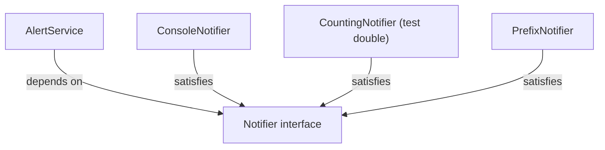

# Lab 1 — OOP, Interfaces, and Dependency Injection

**Time: ~3.5 hrs · Difficulty: Core · Builds on: Month 3 (functions, modules), Month 4 (the GitHub Pulse tool)**

## Objective

Learn the building blocks of engineered software by modeling a small domain — a tiny "notifications" system — three ways, each better than the last. You will start with classes and pure functions, then make a key collaboration swappable behind a `Protocol`, then wire it together with dependency injection so it is trivially testable. By the end you will *feel* why an interface plus injection is the move that the whole rest of the course depends on. These are small, focused exercises; the payoff is the instinct, not the line count.

## Setup

```zsh
brew install uv                 # if not already installed
uv python install 3.12          # if not already installed
mkdir -p ~/agentic/month-05 && cd ~/agentic/month-05
uv init oop-drills --package --python 3.12
cd oop-drills
uv add --dev mypy
```

You now have a `src/oop_drills/` package. We will add a module per part. Keep a terminal open for `uv run python` (the REPL) and `uv run mypy --strict src` (the type checker) — run the checker after every part.

## Background

**Recall first (from memory):** (1) In Month 4, what made your GitHub Pulse tool hard to change without breaking something? (2) What does a Python function `return`, and how is that different from `print`? Answer in your head before reading on — this lab is the fix for problem (1).

In Month 4 your tool was a flat pile of functions that each did several things. This lab introduces the units you will reorganize that pile into: **classes** (state plus behavior), **pure functions** (logic with no side effects), **`Protocol`s** (interfaces — a named set of methods callers can depend on), and **dependency injection** (passing collaborators in rather than constructing them inside). Read Core Concepts §1–§7 in the README first; this lab is where those ideas become muscle memory.

## Steps

### 1. A class with state, behavior, and dunders

Create `src/oop_drills/inbox.py`:

```python
from dataclasses import dataclass, field


@dataclass
class Message:
    sender: str
    body: str
    urgent: bool = False


class Inbox:
    """Holds messages for one user. Has identity and changing state, so it earns a class."""

    def __init__(self, owner: str) -> None:
        self.owner = owner
        self._messages: list[Message] = []

    def add(self, message: Message) -> None:
        self._messages.append(message)

    def unread_count(self) -> int:
        return len(self._messages)

    def __repr__(self) -> str:
        return f"Inbox(owner={self.owner!r}, messages={self.unread_count()})"

    def __eq__(self, other: object) -> bool:
        if not isinstance(other, Inbox):
            return NotImplemented
        return self.owner == other.owner and self._messages == other._messages
```

Try it in the REPL (`uv run python`):

```python
from oop_drills.inbox import Inbox, Message
box = Inbox("ada")
box.add(Message("github", "Your build passed"))
box                      # uses __repr__
box.unread_count()
```

**Checkpoint:** Evaluating `box` prints `Inbox(owner='ada', messages=1)` — your `__repr__`, not a `<object at 0x...>`. `box.unread_count()` returns `1`. Note that `Message` got its `__init__`, `__repr__`, and `__eq__` for free from `@dataclass`, while `Inbox` — which has real behavior — is a hand-written class. That is the dataclass-vs-class judgment call from §3.
**If not:** if you see `<oop_drills.inbox.Inbox object at 0x...>`, your `__repr__` isn't being found — check it's indented as a method of `Inbox` and spelled with double underscores both sides. If `import` fails, you launched a bare `python`; quit and relaunch with `uv run python` from the project root (see Troubleshooting).

### 2. A pure function next to the impure shell

The decision *"is this message worth a desktop alert?"* is pure logic. The act of *sending* the alert is a side effect. Keep them apart. Add to `inbox.py`:

```python
def should_alert(message: Message, quiet_hours: bool) -> bool:
    """Pure: depends only on its arguments, returns a bool, touches nothing else."""
    if quiet_hours:
        return message.urgent
    return True
```

**Checkpoint:** In the REPL, `should_alert(Message("x", "y", urgent=True), quiet_hours=True)` returns `True`, and with `urgent=False` it returns `False`. You tested a piece of real logic with no setup, no mocking, no network — because it is pure. Hold onto that feeling; it is the whole argument of §2.
**If not:** if you get the wrong boolean, re-read the logic — during quiet hours only `urgent` messages alert; outside quiet hours everything does. If the REPL doesn't see `should_alert`, you edited the file after importing; relaunch `uv run python` (Troubleshooting: REPL caches modules).

The next three steps teach the load-bearing new skill of this lab — an **interface plus dependency injection** — using gradual release: you study a complete worked example (Stage 1), fill in a faded skeleton (Stage 2), then extend it with no scaffolding (Stage 3). Here is the shape you are building toward:


*Notice: `AlertService` points only at the interface; each notifier satisfies it structurally. Swapping notifiers never touches `AlertService`.*

### 3. Define an interface with `Protocol` — Stage 1: Worked example (I do)

Read and run this; you are not inventing anything yet. Sending an alert could go to the terminal, to a log, to a desktop notification, to a fake during tests. They share a shape. Create `src/oop_drills/notifier.py`:

```python
from typing import Protocol

from oop_drills.inbox import Message


class Notifier(Protocol):
    def send(self, message: Message) -> None: ...
```

Now two real implementations and one test double — note that *none of them inherit from `Notifier`*:

```python
class ConsoleNotifier:
    def send(self, message: Message) -> None:
        print(f"[ALERT] {message.sender}: {message.body}")


class CountingNotifier:
    """A test double that records calls instead of doing I/O."""

    def __init__(self) -> None:
        self.sent: list[Message] = []

    def send(self, message: Message) -> None:
        self.sent.append(message)
```

**Checkpoint:** Run `uv run mypy --strict src`. It passes, and it considers both `ConsoleNotifier` and `CountingNotifier` valid `Notifier`s purely because they have a matching `send` method — structural typing in action (§5). Try deleting the body of `ConsoleNotifier.send` and renaming it to `dispatch`; re-run `mypy` after Step 4 wires it in and watch it complain that the shape no longer matches.
**If not:** a `mypy` error here usually means a `send` signature doesn't match the protocol exactly — check the parameter name (`message`), its type (`Message`), and the `-> None` return. If `mypy` isn't found, run `uv add --dev mypy` (see Setup).

### 4. Dependency injection: pass the collaborator in — Stage 2: Faded practice (we do)

Here is the payoff, and now you fill in the gaps. Create `src/oop_drills/alerts.py` — a service that decides and sends, but does **not** build its own notifier. Type the skeleton and complete the two `TODO`s yourself before checking against the full version below:

```python
from oop_drills.inbox import Inbox, Message, should_alert
from oop_drills.notifier import Notifier


class AlertService:
    def __init__(self, notifier: Notifier) -> None:
        self._notifier = notifier          # injected, not constructed here

    def process(self, inbox: Inbox, messages: list[Message], quiet_hours: bool) -> int:
        sent = 0
        for message in messages:
            inbox.add(message)
            # TODO 1: only alert when should_alert(...) says so, given quiet_hours
            # TODO 2: when you do alert, call the INJECTED notifier and count it
        return sent
```

Expected behavior: `process` adds every message to the inbox, but only calls `self._notifier.send(message)` for messages that pass `should_alert`, returning how many it sent. The full version:

```python
from oop_drills.inbox import Inbox, Message, should_alert
from oop_drills.notifier import Notifier


class AlertService:
    def __init__(self, notifier: Notifier) -> None:
        self._notifier = notifier          # injected, not constructed here

    def process(self, inbox: Inbox, messages: list[Message], quiet_hours: bool) -> int:
        sent = 0
        for message in messages:
            inbox.add(message)
            if should_alert(message, quiet_hours):
                self._notifier.send(message)
                sent += 1
        return sent
```

```python
from oop_drills.inbox import Inbox, Message, should_alert
from oop_drills.notifier import Notifier


class AlertService:
    def __init__(self, notifier: Notifier) -> None:
        self._notifier = notifier          # injected, not constructed here

    def process(self, inbox: Inbox, messages: list[Message], quiet_hours: bool) -> int:
        sent = 0
        for message in messages:
            inbox.add(message)
            if should_alert(message, quiet_hours):
                self._notifier.send(message)
                sent += 1
        return sent
```

`AlertService` depends on the `Notifier` *interface*, never on `ConsoleNotifier`. Wire the real one together in a tiny `main`, and the fake one in a check:

```python
def main() -> None:
    service = AlertService(ConsoleNotifier())   # production wiring
    box = Inbox("ada")
    service.process(box, [Message("ci", "build failed", urgent=True)], quiet_hours=True)


if __name__ == "__main__":
    main()
```

Now exercise it with the fake, no I/O required, in the REPL:

```python
from oop_drills.inbox import Inbox, Message
from oop_drills.notifier import CountingNotifier
from oop_drills.alerts import AlertService

spy = CountingNotifier()
service = AlertService(spy)                      # inject the fake
box = Inbox("ada")
sent = service.process(box, [
    Message("ci", "build failed", urgent=True),
    Message("news", "weekly digest", urgent=False),
], quiet_hours=True)

sent                 # 1  -- only the urgent one alerted during quiet hours
len(spy.sent)        # 1
spy.sent[0].sender   # 'ci'
```

**Checkpoint:** `sent` is `1` and `spy.sent` holds exactly the urgent message. You just verified `AlertService`'s entire behavior with zero mocking and zero side effects — because the collaborator was *injected*. Compare this in your head to how you'd test the same logic if `AlertService.__init__` had hard-coded `ConsoleNotifier()`: you would have to capture stdout. Injection is what made it easy.
**If not:** if `sent` is `2`, your `if should_alert(...)` guard is missing or always true — both messages got sent. If `len(spy.sent)` is `0`, you called a freshly-built `ConsoleNotifier()` instead of the injected `spy`, or forgot to pass `spy` into `AlertService(...)`.

### 5. Make the injection swappable end-to-end — Stage 3: Independent (you do)

No skeleton this time — only the goal. Prove the Open/Closed payoff in miniature by adding a third notifier *without touching `AlertService`*. Your `PrefixNotifier` should take a `prefix` string and an `inner: Notifier`, and on `send` forward a copy of the message (with the prefix prepended to `sender`) to `inner`. Write it yourself, then compare to this reference:

```python
class PrefixNotifier:
    def __init__(self, prefix: str, inner: Notifier) -> None:
        self._prefix = prefix
        self._inner = inner

    def send(self, message: Message) -> None:
        tagged = Message(f"{self._prefix}{message.sender}", message.body, message.urgent)
        self._inner.send(tagged)
```

`PrefixNotifier` *is* a `Notifier` and *has* a `Notifier` — composition (§4) and a structural interface (§5) at once. Wrap one around another and inject the result:

```python
service = AlertService(PrefixNotifier("prod/", ConsoleNotifier()))
```

**Checkpoint:** You added new behavior (prefixing) by writing a new class and changing only the *wiring line*, never `AlertService` itself. That is Open/Closed (§7) at the smallest possible scale. Run `uv run mypy --strict src` once more — still clean.
**If not:** if `mypy` rejects `PrefixNotifier` as a `Notifier`, its `send` signature drifted (it must be `send(self, message: Message) -> None`). If you found yourself editing `AlertService` to make the prefix work, stop — that is exactly the violation this step is teaching you to avoid; the new behavior belongs entirely in the new class.

## Definition of Done

A self-verifiable checklist:

- [ ] `src/oop_drills/` contains `inbox.py`, `notifier.py`, and `alerts.py`.
- [ ] `Inbox` has a hand-written `__repr__` and `__eq__`; `Message` is a `@dataclass`.
- [ ] `should_alert` is a pure function (no I/O, no globals, no mutation of arguments).
- [ ] `Notifier` is a `Protocol`; `ConsoleNotifier`, `CountingNotifier`, and `PrefixNotifier` all satisfy it **without inheriting from it**.
- [ ] `AlertService` receives its notifier via `__init__` and never constructs one internally.
- [ ] `uv run mypy --strict src` reports **zero errors**.
- [ ] Run `uv run python -c "from oop_drills.alerts import main; main()"` and see one `[ALERT]` line for the urgent message.

Self-verify the type contract in one command:

```zsh
uv run mypy --strict src
```

**Self-explain:** in one sentence, why can you add `PrefixNotifier` and swap it in without ever editing `AlertService`?

## Stretch Goals

1. **An ABC version.** Re-define `Notifier` as an `abc.ABC` with an `@abstractmethod send`. Make the notifiers inherit from it and try to instantiate one that's missing `send` — observe the *runtime* `TypeError`. Write one sentence on when you'd prefer this over a `Protocol`.
2. **Compose two collaborators.** Give `AlertService` a second injected dependency — a `Clock` protocol with a `now()` method — and use it to set `quiet_hours` based on the hour. Inject a `FakeClock` to test "is it quiet hours?" deterministically.
3. **A `FanOutNotifier`.** Write a notifier that holds a `list[Notifier]` and forwards `send` to all of them. Prove you can alert the console *and* a `CountingNotifier` at once, still without changing `AlertService`.
4. **Find the SRP violation.** Add an `unread_summary()` method to `Inbox` that *formats* a string for display. Then argue (in a comment) why formatting probably belongs in a separate function or class, not on `Inbox`.

## Troubleshooting

- **`ModuleNotFoundError: No module named 'oop_drills'`.** Run code with `uv run python ...` from inside the project root, or `uv run python -c "..."`. The `--package` layout puts your code in `src/`, which `uv` adds to the path; a bare `python` won't know that.
- **`mypy` says `Cannot instantiate abstract class` (stretch 1).** That is the *point* of an ABC — you left an `@abstractmethod` unimplemented. Implement `send` in the subclass.
- **`mypy` complains a notifier isn't a `Notifier`.** Its `send` signature doesn't match the protocol exactly — check the parameter name, the type, and the `-> None` return. Structural typing is strict about the shape.
- **`__eq__` returns `NotImplemented` and comparisons behave oddly.** Make sure you `return NotImplemented` (the singleton), not `raise` it, when `other` isn't an `Inbox`. Python uses that signal to try the reflected comparison.
- **REPL doesn't see your edits.** The REPL caches imported modules. Quit and relaunch `uv run python` after editing a file, or use `importlib.reload`.
