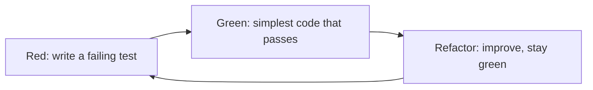

# Lab 2 — pytest Deep Dive and Strict Types

**Time: ~3.5 hrs · Difficulty: Core · Builds on: Lab 1 (Protocols, injection, pure functions)**

## Objective

Build a small, fully tested, fully typed library and learn the testing tools you will lean on for the rest of the course: `pytest` discovery and `assert`, fixtures for shared setup, `parametrize` for table-driven tests, and mocking for the rare case injection can't cover — plus `pytest-cov` to measure how much of your code your tests actually run. Alongside, you'll add type hints throughout and get a clean bill of health from `mypy --strict`. The domain is deliberately tiny (a "scoreboard" that ranks players) so all your attention goes to *how to test and type*, not to the problem itself. You will end the lab having written several tests *before* the code they test — the habit the month is trying to install.

## Setup

```zsh
cd ~/agentic/month-05
uv init scoreboard --package --python 3.12
cd scoreboard
uv add --dev pytest pytest-cov mypy
mkdir -p tests
```

Confirm the test runner is wired up:

```zsh
uv run pytest --version
```

**Checkpoint:** You see a `pytest 8.x` version line. `pytest` discovers files named `test_*.py`; we keep them in `tests/`.
**If not:** `command not found` or no version means the dev dependency didn't install; re-run `uv add --dev pytest pytest-cov mypy` from inside the `scoreboard/` directory, and invoke it as `uv run pytest`, not bare `pytest`.

## Background

**Recall first (from memory):** (1) From Lab 1, what is a *pure* function, and why is it trivial to test? (2) From Lab 1, what did injecting a `CountingNotifier` let you verify without any I/O? Answer before reading on — this lab turns those one-off REPL checks into an automated suite.

This lab's new skill is the **red → green → refactor** cycle: write a failing test that specifies behavior (red), write the simplest code that passes (green), then improve the design while the test holds you safe (refactor). Steps 1–3 walk that loop explicitly:


*Notice: the cycle never lets you write untested code — every change is bracketed by a test that was red before and green after.*

A test is a small program that runs your code and asserts what should be true. The reason to write them is not virtue — it is *speed and courage*: a fast test suite lets you change code aggressively and find out in two seconds whether you broke anything. Read Core Concepts §8–§10 first. The throughline from Lab 1 continues here: because your logic is in pure functions and your collaborators are injected, most testing needs no mocking at all — you just call functions and pass in fakes. We cover mocking too, but treat it as the escape hatch it is.

## Steps

### 1. Write the test first (red), then the code (green) — Stage 1: Worked example (I do)

Follow this loop exactly as written; it is the worked example for the whole skill. We want a pure function `rank(players)` that sorts players by score, highest first. Write the test *before* the function exists. Create `src/scoreboard/core.py` with just the data type:

```python
from dataclasses import dataclass


@dataclass
class Player:
    name: str
    score: int
```

Now `tests/test_core.py`:

```python
from scoreboard.core import Player, rank


def test_rank_orders_by_score_descending() -> None:
    players = [Player("a", 10), Player("b", 30), Player("c", 20)]
    ranked = rank(players)
    assert [p.name for p in ranked] == ["b", "c", "a"]
```

Run `uv run pytest`.

**Checkpoint:** The test **fails** — `ImportError: cannot import name 'rank'`. That red is correct and intentional: you have a precise, executable specification of `rank` before writing a line of it. This is test-first development, and it is the habit the month-end "done" criterion is looking for.
**If not:** if `pytest` collects 0 tests, the file or function isn't named `test_*` — check both. If you get a *different* error (e.g., `No module named 'scoreboard'`), confirm `src/scoreboard/__init__.py` exists and that you ran via `uv run pytest` from the project root (Troubleshooting).

### 2. Make it green with a pure function

Add `rank` to `core.py`:

```python
def rank(players: list[Player]) -> list[Player]:
    """Pure: returns a new list sorted by score descending; does not mutate the input."""
    return sorted(players, key=lambda p: p.score, reverse=True)
```

Run `uv run pytest` again.

**Checkpoint:** One test passes (`1 passed`). Confirm purity: add `assert [p.name for p in players] == ["a", "b", "c"]` to the end of the test to prove the *original* list is untouched (`sorted` returns a new list; `.sort()` would have mutated it). Re-run — still green. You have now lived one full red → green loop.
**If not:** still red means the import path or function name doesn't match the test's `from scoreboard.core import Player, rank`. If the purity assertion fails, you used `.sort()` (mutates in place) instead of `sorted()` (returns a new list).

### 3. Table-driven tests with `parametrize` — Stage 2: Faded practice (we do)

Now you drive the loop with less scaffolding. Tie-breaking is a behavior worth pinning down. The test below is written for you (it is the *red*); your job is the *green* and the *refactor* — make `rank` satisfy it. Add this test to `test_core.py`, run it, watch it fail, then change `rank` yourself before peeking at the answer:

```python
import pytest


@pytest.mark.parametrize(
    "scores, expected_order",
    [
        ([("a", 10), ("b", 10)], ["a", "b"]),            # tie -> alphabetical
        ([("b", 10), ("a", 10)], ["a", "b"]),            # tie -> alphabetical regardless of input order
        ([("a", 5), ("b", 10)], ["b", "a"]),             # score wins over name
        ([], []),                                         # empty is empty
    ],
)
def test_rank_tiebreak(scores: list[tuple[str, int]], expected_order: list[str]) -> None:
    players = [Player(n, s) for n, s in scores]
    assert [p.name for p in rank(players)] == expected_order
```

This forces a tweak to `rank`. The fix is a single key change — sort by score descending, *then* name ascending. Try writing the new `key=` yourself; the reference answer is:

```python
def rank(players: list[Player]) -> list[Player]:
    return sorted(players, key=lambda p: (-p.score, p.name))
```

Run `uv run pytest -v`.

**Checkpoint:** With `-v` you see four separate test cases listed under `test_rank_tiebreak`, all passing. One test function, four cases, no copy-paste — that is `parametrize` (§8). Notice the empty-list case is free insurance against a whole class of crash.
**If not:** if only the tie cases fail, your sort key isn't breaking ties by name — use the tuple `(-p.score, p.name)` so equal scores fall through to alphabetical. If `mypy` later complains about the `lambda`, see Troubleshooting (extract a typed `_key` helper).

### 4. Fixtures for shared setup

When several tests need the same starting data, a **fixture** builds it once and injects it by name. Add to `test_core.py`:

```python
@pytest.fixture
def sample_players() -> list[Player]:
    return [Player("ada", 42), Player("bo", 42), Player("cy", 7)]


def test_top_scorer_uses_tiebreak(sample_players: list[Player]) -> None:
    assert rank(sample_players)[0].name == "ada"


def test_ranking_preserves_count(sample_players: list[Player]) -> None:
    assert len(rank(sample_players)) == len(sample_players)
```

**Checkpoint:** Both tests receive a fresh `sample_players` list (fixtures run per-test, so one test can't pollute another). `uv run pytest` shows all tests passing. This is dependency injection applied to tests — the same idea as Lab 1's injected notifier.
**If not:** `fixture 'sample_players' not found` means the parameter name doesn't match the `@pytest.fixture` function name exactly, or the fixture isn't in the same file (or a `conftest.py`). Make the names line up.

### 5. Mocking — the escape hatch, and why injection beats it — Stage 3: Independent (you do)

You have now seen the full red → green → refactor loop and `parametrize`. For this step, work with less hand-holding: read the two testing styles, then make both pass on your own. Sometimes code reaches out to something you can't inject around — the clock, the filesystem, a hard-wired call. Add a function that depends on the wall clock to `core.py`:

```python
import datetime


def is_tournament_open(now: datetime.datetime | None = None) -> bool:
    current = now or datetime.datetime.now()
    return current.weekday() < 5  # open on weekdays
```

There are two ways to test this. First, the **injection** way — pass the time in (preferred, no magic):

```python
def test_tournament_open_on_weekday() -> None:
    monday = datetime.datetime(2026, 5, 25, 9, 0)   # a Monday
    assert is_tournament_open(monday) is True


def test_tournament_closed_on_weekend() -> None:
    saturday = datetime.datetime(2026, 5, 30, 9, 0)
    assert is_tournament_open(saturday) is False
```

Second, the **mocking** way — for when you *can't* change the signature, use `monkeypatch` to replace the collaborator:

```python
def test_tournament_open_via_monkeypatch(monkeypatch: pytest.MonkeyPatch) -> None:
    real_datetime = datetime.datetime  # capture the real class BEFORE patching

    class FakeDateTime:
        @staticmethod
        def now() -> datetime.datetime:
            return real_datetime(2026, 5, 25, 9, 0)  # Monday

    monkeypatch.setattr(datetime, "datetime", FakeDateTime)
    assert is_tournament_open() is True
```

**Checkpoint:** Both styles pass. Compare them: the injection tests are shorter, clearer, and don't reach into module internals; the monkeypatch test works but is fiddly and brittle. The lesson of §8 in your hands: *design so you can inject, and you'll rarely reach for mocking.* Mocking is for code you don't control or can't yet refactor.
**If not:** if the weekday/weekend tests disagree, double-check the dates — `2026-05-25` is a Monday (`weekday() == 0`) and `2026-05-30` a Saturday (`weekday() == 5`). If the monkeypatch test leaks into others, you patched a global by hand instead of via `monkeypatch.setattr` (Troubleshooting).

### 6. Measure coverage

Run the suite with coverage:

```zsh
uv run pytest --cov=scoreboard --cov-report=term-missing
```

**Checkpoint:** You get a table with a `Cover` percentage and a `Missing` column listing line numbers your tests never executed. Find an uncovered line, decide whether it represents real behavior worth a test (write one) or trivial glue (leave it). Push `core.py` to **at least 80%**. The `Missing` column is the most useful output here — it tells you exactly where your confidence has gaps.
**If not:** `--cov flag unknown` means `pytest-cov` isn't installed (`uv add --dev pytest-cov`). If coverage looks oddly low, you scoped it to the whole package including untested modules — narrow with `--cov=scoreboard.core` or write tests for the gaps.

### 7. Lock in strict types

Make the whole package type-clean. Run:

```zsh
uv run mypy --strict src tests
```

Fix anything it flags — common ones: a function missing a return annotation, a `lambda` whose types it can't infer (fine here), or `datetime.datetime | None` not handled. Optionally pin the config so future runs are consistent; add to `pyproject.toml`:

```toml
[tool.mypy]
strict = true
```

…then you can just run `uv run mypy src tests`.

**Checkpoint:** `mypy` reports `Success: no issues found`. Now you have two independent green signals — `pytest` (behavior is correct) and `mypy --strict` (types are consistent). Treat both as part of "done" for everything you build from here on.
**If not:** most strict-mode errors here are a missing return annotation on a test (`-> None`) or an unhandled `datetime.datetime | None`. Fix the annotation rather than adding `# type: ignore` — the complaint is a real gap (README §9).

## Definition of Done

- [ ] `src/scoreboard/core.py` contains `Player`, a pure `rank`, and `is_tournament_open`.
- [ ] `tests/test_core.py` contains: a `parametrize`d test (4+ cases), at least one fixture used by 2+ tests, and both an injection-style and a monkeypatch-style test.
- [ ] At least one test was written *before* its implementation existed (you saw it go red, then green).
- [ ] `uv run pytest` is fully green.
- [ ] `uv run pytest --cov=scoreboard` reports **80%+** coverage on `core.py`.
- [ ] `uv run mypy --strict src tests` reports zero errors.

Self-verify in two commands:

```zsh
uv run pytest --cov=scoreboard --cov-report=term-missing
uv run mypy --strict src tests
```

**Self-explain:** in one sentence, why does writing the failing test *first* produce better-designed code than writing the test after?

## Stretch Goals

1. **`parametrize` with `pytest.param` ids.** Give each case in Step 3 a readable id (`pytest.param(..., id="tie-alphabetical")`) so `-v` output reads like a spec.
2. **A fixture that yields and cleans up.** Write a fixture using `yield` that creates a temp file (via the built-in `tmp_path` fixture), and a test that writes a scoreboard to it and reads it back. Observe that teardown after `yield` runs even if the test fails.
3. **Test a raised exception.** Add `rank` validation that raises `ValueError` on a negative score, and test it with `with pytest.raises(ValueError):`.
4. **Coverage gate.** Add `--cov-fail-under=80` to a `pytest` config so the suite *fails* if coverage drops below 80%. This is how CI enforces the bar in the capstone.
5. **Try Pyright.** Run `uvx pyright src` and compare its output to `mypy --strict`. Note one difference in what each flags.

## Troubleshooting

- **`pytest` collects 0 tests.** Files must be named `test_*.py` and functions `test_*`. Check the names and that you're running from the project root.
- **`ModuleNotFoundError: No module named 'scoreboard'` in tests.** The `--package` `src/` layout usually resolves under `uv run pytest`. If it doesn't, ensure there's a `src/scoreboard/__init__.py` and that you run via `uv run`, not bare `pytest`.
- **`--cov` flag unknown.** `pytest-cov` isn't installed; run `uv add --dev pytest-cov`.
- **`monkeypatch` change leaks into other tests.** It shouldn't — `monkeypatch` auto-reverts after each test. If you see leakage, you patched something globally without it; prefer `monkeypatch.setattr` over manual reassignment.
- **`mypy` flags the `lambda` key in `sorted`.** It can usually infer it; if strict mode objects, extract a small typed helper function `def _key(p: Player) -> tuple[int, str]:` and pass that instead.
- **Coverage looks lower than expected.** `--cov=scoreboard` measures the *package*, including modules with no tests. Either test them or scope coverage to the module you care about.
