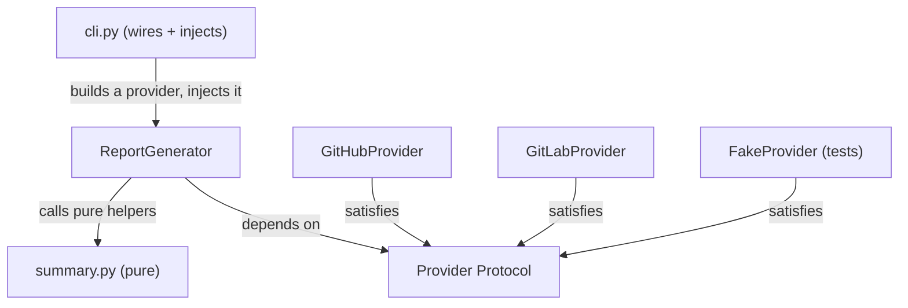

# Lab 3 — The Refactor Crucible (Milestone)

**Time: ~6 hrs · Difficulty: Stretch · Builds on: Month 4 (GitHub Pulse), Lab 1 (Protocols + injection), Lab 2 (pytest + strict types)**

## Objective

Rebuild Month 4's "GitHub Pulse" from scratch as engineered software, and prove you understand extensibility before AI ever enters the picture. The new tool — call it **Pulse v2** — is organized into modules by responsibility, fully type-hinted and `mypy --strict`-clean, tested with `pytest` at **80%+ coverage**, and narrated with structured logging instead of `print`. The load-bearing requirement: it supports **pluggable providers** so the same tool reports from GitHub **or** GitLab *without modifying the core report generator*. Adding a third provider later must require only a new file. You will finish by writing `docs/v1-vs-v2.md`, comparing the two implementations honestly. This is your first hands-on taste of Pillar 3 (Extensible Software) thinking, applied to plain software so the pattern is solid before you point it at agents and tools.

## Setup

```zsh
cd ~/agentic/month-05
uv init pulse --package --python 3.12
cd pulse
uv add requests
uv add --dev pytest pytest-cov mypy
mkdir -p src/pulse tests docs
```

You'll need the two API tokens (both free):

- **GitHub:** the personal access token from Month 4 (a fine-grained token with read access to repos and PRs). Put it in `.env` as `GITHUB_TOKEN=...`.
- **GitLab:** create a free token at GitLab → Settings → Access Tokens with the `read_api` scope. Put it in `.env` as `GITLAB_TOKEN=...`.

```zsh
uv add python-dotenv
echo ".env" >> .gitignore
echo ".venv" >> .gitignore
```

**Checkpoint:** `cat .gitignore` shows `.env` and `.venv`. Never commit tokens — same secrets discipline as Month 4.
**If not:** if `.gitignore` is empty or missing those lines, the `echo` ran in the wrong directory; `cd` into `pulse/` and re-run the two `echo ... >> .gitignore` commands.

## Background

**Recall first (from memory):** (1) From Lab 1, what is the one-sentence definition of dependency injection, and why did it make `AlertService` testable without I/O? (2) From Lab 2, what are the three beats of the red → green → refactor loop? (3) From Month 4, which two API quirks differ between GitHub and GitLab that a provider will have to hide? Answer before reading — this milestone is Labs 1 and 2 applied to real software.

Open your Month 4 GitHub Pulse and read it with fresh eyes. You will likely find one or two big functions that authenticate, paginate, *compute* statistics, and *format* output all in one breath. That is three or four responsibilities tangled together (§7, SRP), the network is welded directly into the logic so it can't be tested without hitting GitHub (§6), and the GitHub URLs and JSON shapes are sprinkled through code that should not care where data comes from. To add GitLab to v1 you'd be editing those same functions — a textbook Open/Closed violation.

Pulse v2 fixes all of that with the exact toolkit from Labs 1 and 2: a `Provider` **`Protocol`** (the interface every source implements), **dependency injection** (the report generator is handed a provider, never builds one), a **functional core** of pure summary/format functions, and a thin **imperative shell** (the CLI) that wires everything and does the I/O. The architecture, by responsibility:

```
src/pulse/
  models.py      # dataclasses: Repo, PullRequest  (data, no behavior)
  providers.py   # Provider Protocol + GitHubProvider + GitLabProvider
  summary.py     # PURE functions: counts, averages, top-N
  report.py      # ReportGenerator: depends on the Provider INTERFACE
  logsetup.py    # structured JSON logging
  cli.py         # imperative shell: parse args, pick provider, wire, print
tests/
  test_summary.py    # pure logic, parametrized
  test_report.py     # uses an injected FakeProvider — no network
  conftest.py        # shared fixtures (sample data, FakeProvider)
```

The same picture as a dependency diagram — note which way the arrows point:


*Notice: `ReportGenerator` points only at the Protocol; only `cli.py` knows concrete providers exist. Adding GitLab (or a test `FakeProvider`) adds an arrow into the interface and touches nothing the generator depends on.*

Build it in that order — models, then the interface, then pure logic (test-first), then the generator (test-first with a fake), then logging and the CLI last.

## Steps

### 1. Models — data without behavior

Create `src/pulse/models.py`:

```python
from dataclasses import dataclass


@dataclass
class Repo:
    name: str
    stars: int


@dataclass
class PullRequest:
    title: str
    state: str          # "open" | "closed" | "merged"
    author: str
```

These are the *normalized* shapes both providers produce. The rest of the code speaks `Repo` and `PullRequest`, never raw GitHub or GitLab JSON. That normalization is what lets one report generator serve both sources.

**Checkpoint:** `uv run python -c "from pulse.models import Repo; print(Repo('x', 3))"` prints `Repo(name='x', stars=3)` via the dataclass `__repr__`.
**If not:** `No module named 'pulse'` means you ran bare `python` or are outside the project root — use `uv run` from inside `pulse/`. A `TypeError` on construction means a field name or order in the dataclass doesn't match.

### 2. The `Provider` interface and two implementations

This is the lab's central new skill — defining an interface and writing interchangeable implementations behind it — so we teach it with gradual release: study the worked `GitHubProvider` (Stage 1), then write `GitLabProvider` against a faded skeleton (Stage 2). Create `src/pulse/providers.py`. Define the interface first.

**Stage 1 — Worked example (I do).** Read `GitHubProvider` closely; every line maps GitHub's JSON into your normalized models. You are not inventing yet.

```python
import logging
from typing import Protocol

import requests

from pulse.models import PullRequest, Repo

logger = logging.getLogger("pulse")


class Provider(Protocol):
    """The contract every source must satisfy. The report generator depends on THIS."""

    name: str

    def fetch_repos(self) -> list[Repo]: ...
    def fetch_pull_requests(self, repo: str) -> list[PullRequest]: ...


class GitHubProvider:
    name = "github"

    def __init__(self, token: str, owner: str, session: requests.Session | None = None) -> None:
        self._token = token
        self._owner = owner
        self._http = session or requests.Session()  # injectable for tests

    def _headers(self) -> dict[str, str]:
        return {"Authorization": f"Bearer {self._token}", "Accept": "application/vnd.github+json"}

    def fetch_repos(self) -> list[Repo]:
        url = f"https://api.github.com/users/{self._owner}/repos"
        resp = self._http.get(url, headers=self._headers(), params={"per_page": 100})
        resp.raise_for_status()
        return [Repo(name=r["name"], stars=r["stargazers_count"]) for r in resp.json()]

    def fetch_pull_requests(self, repo: str) -> list[PullRequest]:
        url = f"https://api.github.com/repos/{self._owner}/{repo}/pulls"
        resp = self._http.get(url, headers=self._headers(), params={"state": "all"})
        resp.raise_for_status()
        return [
            PullRequest(title=p["title"], state=p["state"], author=p["user"]["login"])
            for p in resp.json()
        ]
```

**Stage 2 — Faded practice (we do).** Now write `GitLabProvider` yourself. The structure is identical to `GitHubProvider`; only the auth header, the URLs, and the JSON field names change. Fill in the `TODO`s, then check against the reference below. The differences you must handle: GitLab authenticates with a `PRIVATE-TOKEN` header (not `Bearer`); its star count field is `star_count` (not `stargazers_count`); it calls PRs "merge requests" at a different URL; and the project path must be URL-encoded as `owner%2Frepo`.

```python
class GitLabProvider:
    name = "gitlab"

    def __init__(self, token: str, owner: str, session: requests.Session | None = None) -> None:
        self._token = token
        self._owner = owner
        self._http = session or requests.Session()

    def _headers(self) -> dict[str, str]:
        return {}  # TODO: GitLab uses a PRIVATE-TOKEN header

    def fetch_repos(self) -> list[Repo]:
        url = f"https://gitlab.com/api/v4/users/{self._owner}/projects"
        resp = self._http.get(url, headers=self._headers(), params={"per_page": 100})
        resp.raise_for_status()
        # TODO: map each project's "path" and "star_count" into a Repo
        return []

    def fetch_pull_requests(self, repo: str) -> list[PullRequest]:
        # TODO: hit the merge_requests endpoint (note the %2F-encoded path)
        # TODO: map "title", "state", and author "username" into a PullRequest
        return []
```

Reference (compare after you try):

```python
class GitLabProvider:
    name = "gitlab"

    def __init__(self, token: str, owner: str, session: requests.Session | None = None) -> None:
        self._token = token
        self._owner = owner
        self._http = session or requests.Session()

    def _headers(self) -> dict[str, str]:
        return {"PRIVATE-TOKEN": self._token}

    def fetch_repos(self) -> list[Repo]:
        url = f"https://gitlab.com/api/v4/users/{self._owner}/projects"
        resp = self._http.get(url, headers=self._headers(), params={"per_page": 100})
        resp.raise_for_status()
        return [Repo(name=p["path"], stars=p["star_count"]) for p in resp.json()]

    def fetch_pull_requests(self, repo: str) -> list[PullRequest]:
        # GitLab calls them "merge requests"; the provider hides that difference.
        url = f"https://gitlab.com/api/v4/projects/{self._owner}%2F{repo}/merge_requests"
        resp = self._http.get(url, headers=self._headers(), params={"state": "all"})
        resp.raise_for_status()
        return [
            PullRequest(title=m["title"], state=m["state"], author=m["author"]["username"])
            for m in resp.json()
        ]
```

Note both providers translate their API's quirks (GitHub's `stargazers_count` vs GitLab's `star_count`; "pull requests" vs "merge requests") into the same `Repo`/`PullRequest` shapes. Neither inherits from `Provider` — they satisfy it structurally. The `session` parameter is dependency injection at the HTTP layer: in tests you'll pass a fake session and never touch the network.

**Checkpoint:** `uv run mypy --strict src` confirms both classes satisfy `Provider`. Temporarily rename `GitLabProvider.fetch_repos` to `get_repos` and watch a later step's type check fail — proof the protocol is enforced.
**If not:** if `mypy` says a provider isn't a `Provider`, a method signature or the `name` attribute drifted from the Protocol — compare names, parameters, and return types exactly. If your faded `GitLabProvider` still returns `[]`, you left a `TODO` unfilled.

### 3. Pure summary functions (test-first)

Write the tests before the code. Create `tests/test_summary.py`:

```python
import pytest

from pulse.models import PullRequest, Repo
from pulse.summary import count_by_state, top_repos, total_stars


@pytest.mark.parametrize(
    "states, expected",
    [
        (["open", "open", "closed"], {"open": 2, "closed": 1}),
        ([], {}),
        (["merged"], {"merged": 1}),
    ],
)
def test_count_by_state(states: list[str], expected: dict[str, int]) -> None:
    prs = [PullRequest("t", s, "a") for s in states]
    assert count_by_state(prs) == expected


def test_total_stars() -> None:
    assert total_stars([Repo("a", 3), Repo("b", 5)]) == 8


def test_top_repos_orders_and_limits() -> None:
    repos = [Repo("a", 1), Repo("b", 9), Repo("c", 5)]
    assert [r.name for r in top_repos(repos, limit=2)] == ["b", "c"]
```

Run `uv run pytest` — it fails (no `summary` module). Now create `src/pulse/summary.py`:

```python
from pulse.models import PullRequest, Repo


def count_by_state(prs: list[PullRequest]) -> dict[str, int]:
    counts: dict[str, int] = {}
    for pr in prs:
        counts[pr.state] = counts.get(pr.state, 0) + 1
    return counts


def total_stars(repos: list[Repo]) -> int:
    return sum(r.stars for r in repos)


def top_repos(repos: list[Repo], limit: int) -> list[Repo]:
    return sorted(repos, key=lambda r: (-r.stars, r.name))[:limit]
```

**Checkpoint:** `uv run pytest tests/test_summary.py` is green. Every function here is pure (§2) — no network, no I/O — so the tests needed zero setup. That is the functional core paying for itself.
**If not:** if the import fails, the function names in `summary.py` must match the test's imports (`count_by_state`, `total_stars`, `top_repos`). If `top_repos` ordering fails, your sort key needs `(-r.stars, r.name)` so ties break by name, mirroring Lab 2.

### 4. The report generator — depends on the interface, never modified per provider — Stage 3: Independent (you do)

This is the heart of the milestone, and your independent build. Before reading the reference, write `ReportGenerator` yourself against this contract: it takes a `provider: Provider` in `__init__` (injected, never constructed inside), and its `generate(top_n)` method calls `self._provider.fetch_repos()`, uses the pure `summary` functions to compute totals and top repos, fetches PRs per top repo, and returns the report string. The hard rule: **it must not mention GitHub or GitLab anywhere.** Then compare to:

```python
import logging

from pulse.providers import Provider
from pulse.summary import count_by_state, top_repos, total_stars

logger = logging.getLogger("pulse")


class ReportGenerator:
    """Depends on the Provider PROTOCOL. It must never name GitHub or GitLab."""

    def __init__(self, provider: Provider) -> None:
        self._provider = provider           # injected; never constructed here

    def generate(self, top_n: int = 3) -> str:
        logger.info('{"event": "report_start", "provider": "%s"}', self._provider.name)
        repos = self._provider.fetch_repos()
        lines = [
            f"Source: {self._provider.name}",
            f"Repositories: {len(repos)}",
            f"Total stars: {total_stars(repos)}",
            "Top repositories:",
        ]
        for repo in top_repos(repos, limit=top_n):
            prs = self._provider.fetch_pull_requests(repo.name)
            states = count_by_state(prs)
            lines.append(f"  {repo.name} (★{repo.stars}) — PRs: {dict(states)}")
        logger.info('{"event": "report_done", "repos": %d}', len(repos))
        return "\n".join(lines)
```

Read it closely: `ReportGenerator` mentions `Provider`, `count_by_state`, `top_repos`, `total_stars` — and *not one* GitHub or GitLab detail. Swapping providers cannot require editing this file. That is Open/Closed (§7) made concrete, and it is exactly what the rubric grades.

**Checkpoint:** `uv run mypy --strict src` passes. The generator has no knowledge of any concrete provider.
**If not:** search `report.py` for the strings `github` or `gitlab` — if either appears (outside the data your provider returns), you leaked a concrete dependency into the core and broke Open/Closed; route it through `self._provider` instead. A `mypy` error usually means `generate` isn't fully annotated.

### 5. Test the generator with an injected `FakeProvider` (no network)

Create `tests/conftest.py` with a fake that satisfies the protocol:

```python
import pytest

from pulse.models import PullRequest, Repo


class FakeProvider:
    name = "fake"

    def __init__(self) -> None:
        self.repo_calls = 0
        self.pr_calls: list[str] = []

    def fetch_repos(self) -> list[Repo]:
        self.repo_calls += 1
        return [Repo("alpha", 10), Repo("beta", 3)]

    def fetch_pull_requests(self, repo: str) -> list[PullRequest]:
        self.pr_calls.append(repo)
        return [PullRequest("fix", "open", "ada"), PullRequest("docs", "merged", "bo")]


@pytest.fixture
def fake_provider() -> FakeProvider:
    return FakeProvider()
```

Then `tests/test_report.py`:

```python
from pulse.report import ReportGenerator
from tests.conftest import FakeProvider


def test_report_includes_source_and_totals(fake_provider: FakeProvider) -> None:
    report = ReportGenerator(fake_provider).generate(top_n=2)
    assert "Source: fake" in report
    assert "Total stars: 13" in report


def test_report_queries_each_top_repo(fake_provider: FakeProvider) -> None:
    ReportGenerator(fake_provider).generate(top_n=2)
    assert fake_provider.repo_calls == 1
    assert fake_provider.pr_calls == ["alpha", "beta"]   # ordered by stars desc
```

**Checkpoint:** `uv run pytest` is green and ran **with no network access** — the injected `FakeProvider` stood in for GitHub entirely. This is the Lab 1 lesson at full scale: injection made the network optional in tests.
**If not:** if `pr_calls` isn't `["alpha", "beta"]`, your generator isn't iterating repos in star order — check it calls `top_repos`. If `mypy` rejects `FakeProvider`, its method signatures must match the `Provider` Protocol exactly, just like the real providers.

### 6. Structured logging, not print

Create `src/pulse/logsetup.py`:

```python
import logging
import sys


def configure(verbose: bool = False) -> None:
    """Send structured-ish log lines to stderr; keep stdout for the report only."""
    level = logging.DEBUG if verbose else logging.INFO
    handler = logging.StreamHandler(sys.stderr)
    handler.setFormatter(logging.Formatter('{"level": "%(levelname)s", "msg": %(message)s}'))
    root = logging.getLogger("pulse")
    root.setLevel(level)
    root.handlers = [handler]
```

The report itself goes to `stdout`; the narration (`report_start`, `report_done`) goes to `stderr` as JSON-shaped lines. That separation (§11) means `uv run pulse ... > report.txt` captures only the report, while logs still stream to your terminal — the Unix discipline from Month 3, now applied to an unattended-friendly tool.

**Checkpoint:** After the CLI exists, `uv run pulse --provider github --owner <you> > /tmp/r.txt` puts only the report in the file and prints `{"level": "INFO", "msg": {"event": "report_start", ...}}` lines to the terminal.
**If not:** if log lines land in `/tmp/r.txt`, a handler is pointed at `stdout` — confirm `logsetup.configure` uses `logging.StreamHandler(sys.stderr)` and that only `print(report)` writes `stdout`.

### 7. The CLI — the thin imperative shell that wires it all

Create `src/pulse/cli.py`. This is the *only* place that knows which concrete providers exist and constructs them:

```python
import argparse
import os
import sys

from dotenv import load_dotenv

from pulse.logsetup import configure
from pulse.providers import GitHubProvider, GitLabProvider, Provider
from pulse.report import ReportGenerator


def build_provider(name: str, owner: str) -> Provider:
    """The one factory that maps a name to a concrete provider. New providers register HERE."""
    if name == "github":
        return GitHubProvider(token=os.environ["GITHUB_TOKEN"], owner=owner)
    if name == "gitlab":
        return GitLabProvider(token=os.environ["GITLAB_TOKEN"], owner=owner)
    raise ValueError(f"unknown provider: {name}")


def main() -> int:
    load_dotenv()
    parser = argparse.ArgumentParser(description="Pulse v2 — multi-provider activity report")
    parser.add_argument("--provider", choices=["github", "gitlab"], default="github")
    parser.add_argument("--owner", required=True)
    parser.add_argument("--top", type=int, default=3)
    parser.add_argument("--verbose", action="store_true")
    args = parser.parse_args()

    configure(verbose=args.verbose)
    try:
        provider = build_provider(args.provider, args.owner)
        report = ReportGenerator(provider).generate(top_n=args.top)
    except KeyError as missing:
        print(f"pulse: missing environment variable {missing}", file=sys.stderr)
        return 2
    except ValueError as err:
        print(f"pulse: {err}", file=sys.stderr)
        return 2
    print(report)            # the only stdout write — the actual output
    return 0


if __name__ == "__main__":
    raise SystemExit(main())
```

Wire the entry point in `pyproject.toml`:

```toml
[project.scripts]
pulse = "pulse.cli:main"
```

**Checkpoint:** `uv run pulse --provider github --owner <your-github-username>` prints a report. Swap `--provider gitlab --owner <your-gitlab-username>` and it reports from GitLab — **and you did not edit `report.py`, `summary.py`, or `models.py` to make that work.** Only `build_provider` and the `--provider` choices know GitLab exists. That is the milestone.
**If not:** `missing environment variable` means the matching token isn't in `.env` or `load_dotenv()` runs too late. If you found yourself editing `report.py` to make GitLab work, stop and re-examine — that edit is the Open/Closed violation the milestone is graded on; the change belongs only in `build_provider`.

### 8. Hit the coverage bar

```zsh
uv run pytest --cov=pulse --cov-report=term-missing
```

The pure `summary` and the injected `report` tests should already carry most of the weight. The providers' network code is the hard part to cover; add a test that injects a fake `requests.Session` (a small object whose `.get()` returns a canned response with a `.json()` and `.raise_for_status()`) to exercise `GitHubProvider.fetch_repos` without the network. Push total coverage to **80%+**.

**Checkpoint:** The coverage table shows **≥ 80%**. The `Missing` column reveals what's left — decide case by case whether each line is behavior worth a test or untestable glue.
**If not:** the uncovered lines are almost always the providers' network branches. Inject a fake `requests.Session` (an object whose `.get()` returns a stub with `.json()` and `.raise_for_status()`) to exercise `fetch_repos` offline, as the step describes.

### 9. Final type and test gate

```zsh
uv run mypy --strict src tests
uv run pytest --cov=pulse --cov-fail-under=80
```

**Checkpoint:** `mypy` says `Success: no issues found`; `pytest` passes and does *not* fail the coverage gate.
**If not:** if the gate fails with a coverage number just under 80, return to Step 8 and cover one more provider branch. Don't add `# type: ignore` to clear `mypy` — fix the annotation or design it flags (README §9).

### 10. Write `docs/v1-vs-v2.md`

Create `docs/v1-vs-v2.md` and write a real comparison (roughly 400–700 words). It must cover, with specifics from *your* code:

- **The SRP win:** what single function in v1 did multiple jobs, and which v1 responsibility became which v2 module.
- **The Open/Closed win:** show that adding GitLab in v1 meant editing existing functions, while in v2 it meant adding `GitLabProvider` and one line in `build_provider`. State exactly what a hypothetical third provider (Bitbucket) would require — ideally "a new file plus one registration line."
- **Testability:** how injecting the provider (and the HTTP session) let the suite run offline, versus v1 where logic was welded to the network.
- **Types and logging:** what `mypy --strict` caught (or would have caught) and why structured logs on `stderr` beat `print`.
- **An honest cost:** v2 has more files and more indirection. Say when that tradeoff is worth it and when v1's simplicity would have been fine.

**Checkpoint:** A teammate could read `docs/v1-vs-v2.md` and predict exactly which file to touch to add Bitbucket — without you in the room.
**If not:** if your writeup says only *that* the design is extensible without naming the specific v1 function that did multiple jobs and the exact v2 file each responsibility moved to, it is too vague — add the concrete before/after file-and-function names.

### 11. Ship it

```zsh
git add -A && git commit -m "Pulse v2: pluggable providers, strict types, 80%+ coverage"
gh repo create pulse-v2 --public --source=. --push   # or push to an existing remote
```

**Checkpoint:** The repo is on GitHub, `.env` is *not* in it (`git ls-files | grep env` returns nothing but `.gitignore`-adjacent entries), and the README explains how to run it.
**If not:** if `git ls-files` lists `.env`, it was committed before being ignored — run `git rm --cached .env`, commit, and rotate the exposed tokens immediately (same secrets discipline as Month 4).

## Definition of Done

- [ ] Code is split into `models.py`, `providers.py`, `summary.py`, `report.py`, `logsetup.py`, `cli.py` — one responsibility each.
- [ ] A `Provider` `Protocol` exists; `GitHubProvider` and `GitLabProvider` satisfy it structurally (no inheritance) and normalize their APIs into shared models.
- [ ] `ReportGenerator` depends only on the `Provider` interface and contains no provider-specific code; switching providers does not edit it.
- [ ] The provider is injected (constructed in `build_provider`/`cli.py`, never inside `ReportGenerator`).
- [ ] `uv run mypy --strict src tests` — zero errors.
- [ ] `uv run pytest --cov=pulse --cov-fail-under=80` — passes, including a `parametrize`d test and a `FakeProvider`-injected test that needs no network.
- [ ] Structured logs go to `stderr`; only the report goes to `stdout`.
- [ ] `docs/v1-vs-v2.md` names concrete SRP and Open/Closed improvements and predicts the cost of a third provider.
- [ ] Repo is on GitHub with no secrets committed.

Self-verify the whole milestone in two commands:

```zsh
uv run mypy --strict src tests
uv run pytest --cov=pulse --cov-report=term-missing --cov-fail-under=80
```

**Self-explain:** in one sentence, why can Pulse v2 add a GitLab (or Bitbucket) provider without ever editing `report.py`?

## Stretch Goals

1. **Add a third provider for real.** Implement a `BitbucketProvider` (or a `FileProvider` that reads canned JSON from disk — no token needed). Confirm the *only* edits are a new file plus the `build_provider` mapping and `--provider` choices. This is the Open/Closed proof in the flesh.
2. **A true JSON logger.** Replace the format-string logging with a custom `logging.Formatter` whose `format()` emits a real JSON object (`json.dumps({...})`) including a timestamp and the event fields, so every log line parses with `jq` (Month 2).
3. **Pagination behind the interface.** Real accounts have many repos. Add pagination inside each provider so callers still just get a `list[Repo]` — the interface doesn't change, proving the abstraction holds.
4. **Property-style summary tests.** Add a test asserting that `count_by_state` totals equal `len(prs)` for any input, and `total_stars` is never negative for non-negative inputs.
5. **A `--format json` option.** Let the report render as JSON or text, chosen by a flag, by injecting a `Formatter` collaborator into `ReportGenerator` — extending output formats without modifying the generator (Open/Closed again, on the output side).

## Troubleshooting

- **`KeyError: 'GITHUB_TOKEN'`.** `.env` isn't loaded or the variable is missing. Confirm `load_dotenv()` runs before `build_provider`, and that `.env` sits in the directory you run from.
- **GitHub/GitLab 401 or 403.** Token is wrong, expired, or lacks scope. GitHub needs repo read; GitLab needs `read_api`. Regenerate if unsure.
- **GitLab 404 on merge requests.** The project path must be URL-encoded as `owner%2Frepo` — that's the `%2F` in the URL. A repo with no merge requests returns `[]`, not an error.
- **`mypy` says a provider isn't a `Provider`.** A method signature or the `name` attribute doesn't match the protocol. Compare names, parameters, and return types exactly.
- **Coverage stuck below 80%.** The uncovered lines are almost always the providers' network branches. Inject a fake `requests.Session` (an object with a `.get()` returning a stub response) to exercise them offline, as in Step 8.
- **The report prints log lines mixed in.** Logs must go to `stderr` via the handler in `logsetup.py`; only `print(report)` writes `stdout`. If logs appear in a redirected file, a handler is pointed at `stdout` — fix `logsetup.configure`.
- **Circular import between `report.py` and `providers.py`.** `report.py` should import `Provider` from `providers.py`, never the reverse. If `providers.py` imports from `report.py`, move the shared type out or invert the dependency (§10).
