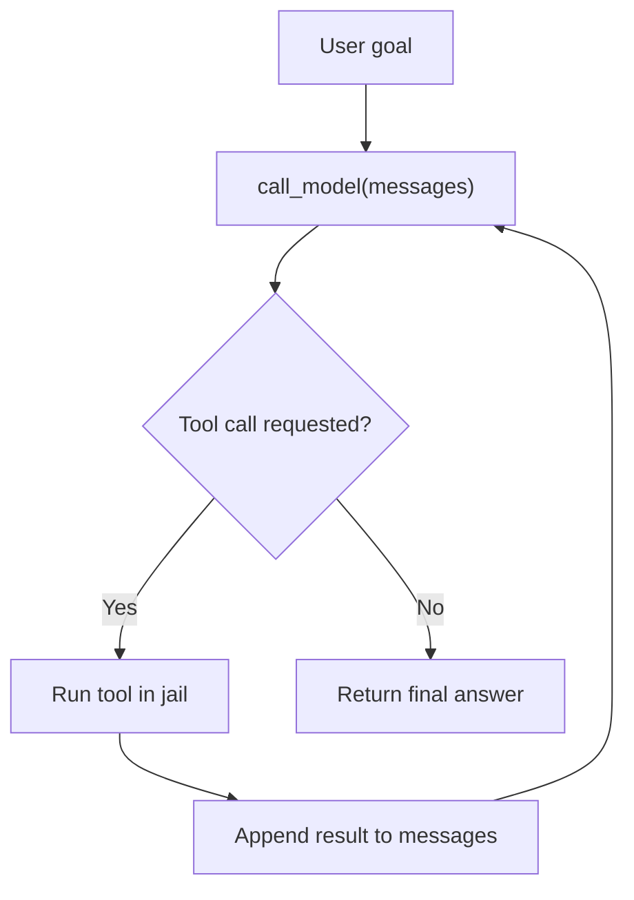
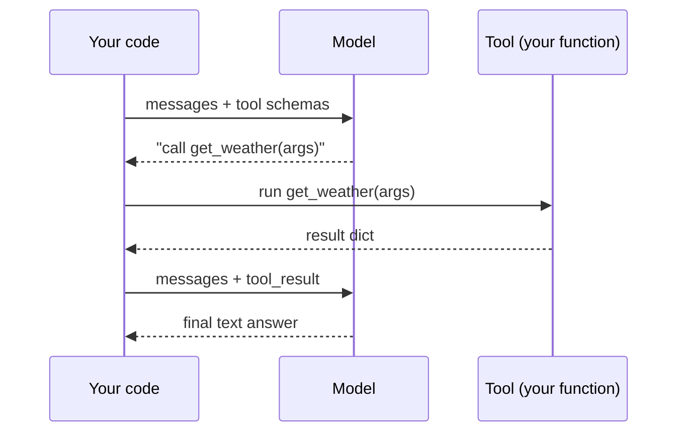

# Month 06 — AI APIs and the First Agent Loop

**Phase: The First Agent (bridge from foundations into the pillars)**

## Overview

For five months you have built the foundation: the command line and Git (Month 1), HTTP and JSON (Month 2), Python (Month 3), Python against real APIs with retries and secrets (Month 4), and the software-engineering discipline of interfaces, dependency injection, tests, and structured logging (Month 5). You are a competent Python engineer. You have never called a language model. That changes now — and by the end of this month you will have written, from scratch, a working AI agent.

Here is the single most important idea in this entire course, and the one this month exists to deliver: **an agent is a `while` loop around an API call. It is not magic.** When you strip away the marketing, an "AI agent" is a program that (1) sends some text to a model, (2) reads the reply, (3) notices the model asked to use a tool, (4) runs that tool, (5) hands the result back to the model, and (6) repeats until the model says it is done. That is the whole trick. Everything else — frameworks, orchestration platforms, "autonomous swarms" — is plumbing on top of that loop. If you build the loop by hand, with no framework hiding it from you, you will own the mental model for the rest of the course and your career. So this month we use **no frameworks** — no LangChain, no CrewAI, no smolagents. Just Python, an HTTP call, and a loop you write yourself.

The second theme is **cost and control**. Every lab is completable for **$0** using [Ollama](https://ollama.com) running open models locally on your Mac, and every lab also shows the **paid path** (the Anthropic API) with its exact dollar cost so you can choose with eyes open. You will learn the tokenization and dollars-per-million-tokens math, log tokens-in/tokens-out and cost on every single call, and start thinking like an engineer who knows what their software costs to run. By Week 4 it all assembles into the **From-Scratch Agent**, and the mystery is replaced with something far more useful: control.

Here is that one idea as a picture. This is the mental model the rest of the course builds on — burn it in now.


*Notice: the loop only exits when the model stops asking for tools — an agent is a `while` loop around an ordinary model call, not a special kind of model.*

## Prerequisites

Coming in, you should be able to do everything from Months 1 through 5:

- Work fluently in zsh on macOS, use Git and GitHub, and read HTTP/JSON (Months 1–2).
- Write Python: functions, dicts/lists, comprehensions, file I/O, JSON round-tripping, `try`/`except`, and `argparse` (Month 3).
- Call a real HTTP API from Python with the `requests` library; load secrets from a `.env` file with `python-dotenv`; and implement retry-with-backoff for transient failures (Month 4).
- Apply software-engineering structure: classes and methods, `Protocol`-based interfaces, dependency injection, `pytest`, type hints, and structured logging; swap a "provider" behind an interface (Month 5).

You do **not** need any AI or machine-learning background. We treat the model as a service you call over HTTP — exactly the skill you built in Month 4.

## Warm-Up: Retrieve Before You Begin

Before reading on, answer these from memory — no peeking at earlier months. This pulls forward the prior skills this month builds on, because a model call *is* an API call (Month 4) and your agent *is* an interface with a swappable provider (Month 5).

1. In Month 4, what `requests` call sends a JSON body to an API, and how do you turn the response back into a Python dict?
2. After that call returns, what do you check before trusting the body — and what does a `4xx` vs a `5xx` status tell you?
3. In Month 5, what is a `Protocol`, and what problem does dependency injection solve when you want to swap one implementation for another?
4. Why would you load an API key from a `.env` file instead of writing it in the code (Month 4)?
5. In one sentence: what does "stateless" mean for an HTTP server?

<details><summary>Check your recall</summary>

1. `requests.post(url, json={...})`; then `resp.json()` parses the JSON body into a dict. (Month 4, Lab on calling real APIs.)
2. Call `resp.raise_for_status()` (or inspect `resp.status_code`). A `4xx` means *you* sent something wrong (bad request, auth, not found); a `5xx` means the *server* failed — the case worth retrying with backoff. (Month 4.)
3. A `Protocol` is a structural interface: any class with the right methods satisfies it, no inheritance needed. Dependency injection passes the implementation *in* rather than hardcoding it, so you can swap providers (or a fake for tests) without touching the caller. (Month 5.) This is exactly the seam behind this month's `call_model()`.
4. So the secret never lands in source control or logs; the code reads `os.environ`, and the value lives outside the repo. (Month 4.)
5. The server keeps no memory between requests — each call must carry everything it needs. (Months 2 and 4.) This is *the* fact that explains why you resend the whole message history every turn.
</details>

## Learning Objectives

By the end of this month you can:

1. **Call** a chat-completion API — both a local Ollama model and the Anthropic Messages API — and explain roles, content blocks, the system prompt, `max_tokens`, and stop sequences.
2. **Calculate** the token count and dollar cost of a model call, and explain context windows and dollars-per-million-tokens pricing.
3. **Write** prompts that are clear and specific, use examples and XML tags for structure, request structured (JSON) output, and use negative examples to steer behavior.
4. **Stream** a model response token-by-token and explain why streaming changes the UX but not the cost.
5. **Build** a tiny eval harness that scores prompt variants against fixed cases, so you can prove one prompt is *better*, not merely *different*.
6. **Design** a tool (function-calling) schema, and execute one full tool-call round-trip by hand: model requests a tool, you run it, you feed the result back.
7. **Implement**, from scratch and with no framework, the minimum viable agent loop: call model → parse tool calls → execute → feed results back → repeat until stop.
8. **Apply** the working-directory jail and the never-`eval`-model-output rules to keep a file/shell agent's blast radius small.
9. **Instrument** every model call with token and dollar logging, and write a structured JSONL trace of every tool call an agent makes.

## Tech Stack (free, macOS)

| Tool | Install | Why |
|---|---|---|
| Ollama | `brew install ollama` | Runs open models (Llama, Qwen) locally for **$0**. Our default for all dev and iteration. Exposes an OpenAI-compatible HTTP endpoint. |
| A local model | `ollama pull llama3.1:8b` (and `ollama pull qwen2.5:7b`) | The actual weights. ~5 GB each; runs on Apple Silicon. `qwen2.5` has strong tool-use support. |
| Python 3.12+ via uv | `brew install uv`; `uv python install 3.12` | From Month 3. We manage every project with `uv`. |
| `requests` | `uv add requests` | The HTTP client from Month 4. We call the model over plain HTTP first, before any SDK, so the mechanics stay visible. |
| `anthropic` (optional, paid) | `uv add anthropic` | The official SDK for the paid path. Only needed if you choose to spend a few dollars. |
| `python-dotenv` | `uv add python-dotenv` | Loads `ANTHROPIC_API_KEY` from `.env` — never hardcode keys (Month 4 habit). |
| `tiktoken` (optional) | `uv add tiktoken` | Approximate token counting for the cost math, even offline. |

**Cost summary.** You can complete **100%** of this month for **$0** with Ollama. The paid Anthropic path is optional and clearly labeled everywhere it appears. For reference, as of this writing the Anthropic API prices the smaller models around **$0.25–$1 per million input tokens** and **$1.25–$5 per million output tokens** (Haiku-class is cheapest; check [the pricing page](https://www.anthropic.com/pricing) for current numbers). A single small lab call moves a few hundred tokens — fractions of a cent. The agent in Week 4 might burn 10–50k tokens over a run; on a Haiku-class model that is still well under a dime. We show you how to compute it exactly so you are never surprised.

## Weekly Breakdown

Budget ~8–12 hours per week: roughly half reading and typing along, half doing the lab.

### Week 1 — Your first model call, and what it costs
**Warm-start (do this first):** before touching a model, re-open your Month 4 API client and re-run one call against the weather (or any) API — confirm you still get a `200` and a parsed dict, and read your `resp.json()` out loud. A model endpoint is the *same* shape; you are about to point that exact skill at a new URL. Keeps Month 4 live in working memory.
**Focus:** demystify the API; make calls against a free local model and (optionally) the paid Anthropic API; learn the token and cost math.
**Topics:** the chat-completion mental model (a stateless function from a list of messages to a reply); message **roles** (`system`, `user`, `assistant`); **content blocks**; the **system prompt**; `max_tokens` and why it bounds *cost*, not just length; **stop sequences**; tokenization (why "tokens" ≠ "words"); **context windows**; dollars-per-million-tokens math; logging tokens-in/out and cost on every call.
**Reading:** Core Concepts §1–§3. The Ollama and Anthropic Messages API quickstarts (Further Reading).
**Build:** Lab 1 — Ollama installed, first raw-HTTP call to a local model, the same call against Anthropic (optional), and a reusable `call_model()` that returns text plus a token/cost record.

### Week 2 — Prompting, structured output, streaming, and evals
**Focus:** get reliable, useful output out of the model, and learn to *measure* prompt quality.
**Topics:** prompt clarity and specificity; few-shot **examples**; **XML tags** to delimit instructions and data; **negative examples** ("do not…"); requesting **structured JSON** output and parsing it safely; **streaming** responses (and why streaming changes UX, not cost); the idea of an **eval**: fixed inputs, an expected/scored output, and a metric, so you can compare prompt v1 vs v2 on the same cases.
**Reading:** Core Concepts §4–§6. Anthropic's prompt-engineering overview (Further Reading).
**Build:** Lab 2 — a structured-extraction prompt, a streaming demo, and a tiny eval harness that scores two prompt variants over a handful of cases and tells you which won.

### Week 3 — Tool use (function calling), by hand
**Focus:** let the model reach into your code via tools, and understand the request/response loop precisely.
**Topics:** what a tool *is* (a function plus a JSON schema describing it); the tool-use round-trip (model returns a "use this tool with these arguments" request → you run the function → you return the result as a tool-result message → model continues); tool schema design (clear names, descriptions, typed parameters); the trap of **overly chatty tools** (tools that return huge blobs that blow your context window and cost); doing it against both Ollama's OpenAI-compatible endpoint and Anthropic's native tool blocks.
**Reading:** Core Concepts §7. Anthropic tool-use docs and the OpenAI-compatible function-calling spec (Further Reading).
**Build:** Lab 3 — define a `get_weather`-style tool schema, run **one** complete tool round-trip by hand on both providers, and see exactly where the loop will go.

### Week 4 — The From-Scratch Agent (milestone)
**Focus:** assemble the loop. This is the whole month paying off.
**Topics:** the minimum viable agent loop written by hand; a provider-agnostic `call_model()` so you can swap Ollama ↔ Anthropic; three tools — `read_file`, `write_file`, `run_shell`; the **working-directory jail** (every path resolved and confirmed to live under one root); the **never-`eval`-model-output** rule; per-call cost logging and a **JSONL trace** of every tool call; iteration limits and stop conditions.
**Reading:** Core Concepts §8–§9.
**Build:** Lab 4 — the single-file agent that reads all `.py` files in a repo, writes a `SUMMARY.md`, and commits it; the trace from a successful run; and a `FAILURES.md` documenting every failure mode you hit.

## Core Concepts

### §1 — A chat model is a stateless function from messages to a reply

Forget "AI" for a moment. Mechanically, a chat-completion endpoint is a function: you POST a JSON body containing a **list of messages**, and you get back a JSON body containing the model's reply. It is stateless — the server remembers nothing between calls. If you want a "conversation," *you* keep the list of messages and resend the whole thing every time. This is the single most clarifying fact about the API, and it is exactly the HTTP-POST-returns-JSON pattern you already know from Months 2 and 4.

Each message has a **role** and **content**:

- **`system`** — the standing instructions: who the model is, what rules it follows, the format you want. Set once, at the top.
- **`user`** — input from the human (or from your program acting on the human's behalf).
- **`assistant`** — the model's own previous replies. You include these so the model can "see" the conversation so far.

In the Anthropic Messages API the system prompt is a *separate top-level field* (`system=...`), not a message in the list; the OpenAI-compatible shape that Ollama exposes puts it as the first message with `role: "system"`. Same idea, slightly different wiring — a difference you will paper over with one `call_model()` function this month.

```python
# OpenAI-compatible shape (Ollama). One POST, stateless.
messages = [
    {"role": "system", "content": "You are a terse assistant. Answer in one sentence."},
    {"role": "user", "content": "Why is the sky blue?"},
]
# -> POST to the endpoint, get back an assistant message.
```

**Content blocks.** Modern APIs let a single message's content be a *list of typed blocks* rather than a bare string — a text block, an image block, or (crucially for us) a tool-use or tool-result block. Plain text is the simple case; tool use in Week 3 is where blocks earn their keep.

> **Common misconception.** "The model remembers our conversation — I just send my new message each turn."
> **Reality.** The endpoint is stateless; the server forgets you the instant it replies. The illusion of memory is *you* resending the full message list every call. The belief is tempting because every chat *product* feels like it remembers — but the product is doing exactly this resend for you behind the scenes (Month 4's stateless-HTTP fact, applied).

### §2 — The knobs: system prompt, max_tokens, stop sequences

A handful of parameters control every call.

- **`system`** — covered above; your most powerful single lever over behavior.
- **`max_tokens`** — the hard cap on how many tokens the model may *generate*. This bounds latency and, since you pay per output token, it bounds **cost**. It does not make the model concise; it guillotines the output mid-sentence if hit. Set it deliberately.
- **`temperature`** — randomness. `0` is (near-)deterministic and best for extraction, tool use, and evals where you want repeatable behavior; higher values add variety for creative work. We use low temperature almost everywhere this month.
- **`stop` / stop sequences** — strings that, when generated, make the model halt immediately. Useful to keep a model from running past a delimiter you care about (e.g., stop at `</answer>`).

The most common beginner surprise is `max_tokens`: set it to `100` and ask for an essay, and you get a sentence and a half, cut off. That is not a bug; it is the cap doing its job.

### §3 — Tokens, context windows, and dollars

Models do not see characters or words; they see **tokens** — sub-word chunks produced by a tokenizer. Roughly, **1 token ≈ 4 characters ≈ ¾ of a word** in English, so 1,000 tokens is about 750 words. "Tokenization" matters because **you are billed per token**, in two streams: **input tokens** (everything you send — system prompt + the entire message history + tool definitions) and **output tokens** (what the model generates). Output is usually several times more expensive than input.

The **context window** is the maximum number of tokens (input + output) a model can consider at once — e.g., 8k on a small local model, hundreds of thousands on a frontier model. Exceed it and the call errors or silently truncates. This is why a "chatty tool" that returns a 50 KB blob is dangerous: it can eat your window and your wallet in one call. Because the API is stateless and you resend the whole history every turn, a long agent loop's input grows every step — cost is not flat, it compounds.

> **Common misconception.** "More context is always better — when in doubt, stuff in more text."
> **Reality.** Every token you add costs money on this call *and every later call that carries it*, and a bloated context can bury the signal so the model attends to the wrong thing. The belief is tempting because withholding relevant information clearly hurts — but the goal is the *minimum* context that does the job, not the maximum. This is precisely why we truncate tool results in Week 4.

The dollar math is simple arithmetic once you have the per-million-token prices:

```
cost = (input_tokens  / 1_000_000) * price_in_per_million
     + (output_tokens / 1_000_000) * price_out_per_million
```

Example: 1,500 input + 500 output tokens against a model priced at $0.80/M in and $4.00/M out costs `(1500/1e6)*0.80 + (500/1e6)*4.00 = $0.0012 + $0.0020 = $0.0032` — about a third of a cent. On Ollama the same call costs **$0.00**; you "pay" in electricity and your laptop's fan. We log tokens-in, tokens-out, and computed dollars on *every* call this month, because an engineer who does not know what their software costs is flying blind.

### §4 — Prompt engineering: clarity, examples, structure

A prompt is a specification, and models reward precise specs. Four habits do most of the work:

1. **Be specific.** "Summarize this" is vague; "Summarize this in exactly three bullet points, each under 15 words, focused on the financial figures" is a spec. Tell the model the format, length, audience, and focus.
2. **Show examples (few-shot).** Models pattern-match. One or two worked input→output examples often beat a paragraph of instructions, especially for a consistent output format.
3. **Delimit with XML tags.** Wrapping inputs and instructions in tags — `<document>…</document>`, `<instructions>…</instructions>` — removes ambiguity about where the data ends and the orders begin. Anthropic's models are specifically tuned to respect XML tags, and it helps every model.
4. **Use negative examples sparingly.** "Do not include a preamble; do not apologize; output only the JSON" steers a model off common failure modes. Pair a "don't" with a "do" so the model knows the target, not just the forbidden zone.

### §5 — Structured output

For anything programmatic you want the model to return **parseable structure**, almost always JSON, not prose. Ask for it explicitly, give the exact shape (ideally as an example), and instruct "output only valid JSON, no markdown fences, no commentary." Then parse defensively: models occasionally wrap JSON in ```` ```json ```` fences or add a stray sentence, so strip fences and `try/except json.JSONDecodeError` rather than trusting the output blindly. (Week 3's tool use is a more reliable path to structure when the provider supports it, because the schema is enforced by the API.) The discipline you learned in Month 3 — handle the error rather than crash — is exactly what keeps a flaky parse from taking down your program.

### §6 — Streaming, and what an eval actually is

**Streaming** returns the response incrementally — token by token — instead of in one final blob. It changes the *experience* (the user sees text appear immediately) but **not the cost or the total tokens**; you pay for the same output either way. Mechanically the endpoint sends a sequence of small server-sent events that you accumulate. We teach it because every chat UI you have ever used relies on it, and because in an agent loop, streaming lets you watch the model "think" in real time.

An **eval** is how you replace "this prompt feels better" with evidence. The minimum viable eval is three things: a set of **fixed test cases** (inputs with known good answers or checkable properties), a way to **run** each case through a prompt variant, and a **score** (exact match, contains-the-right-number, valid-JSON, length-under-N — anything objective). Run prompt v1 and prompt v2 over the same cases, compare scores, and now you *know* which is better. Without an eval you are tuning prompts by vibes, and vibes do not survive contact with edge cases. This is the single most underrated skill in applied AI, and we plant the seed here.

### §7 — Tool use is a structured request you fulfill

> **Heavy concept ahead.** Slow down here; this is the load-bearing idea of the month. The tool-use request/response loop is the one new mechanic everything else assembles from. Read it twice, and lean on the diagram below.

"Tool use" (a.k.a. function calling) sounds advanced; it is just a disciplined message exchange. You tell the model, up front, about the tools it may use — each tool is a **name**, a **description**, and a **JSON schema** for its parameters. When the model decides it needs one, it does not run anything (it *can't* — it is just text generation). Instead it returns a structured message that says, in effect, *"call `get_weather` with `{"city": "Paris"}`."* Your code:

1. detects that the reply is a tool-use request rather than a final answer,
2. runs the actual Python function with those arguments,
3. appends a **tool-result** message containing the function's output, and
4. calls the model again with the now-longer message list.

The model reads the result and either uses another tool or produces a final answer. That four-step exchange *is* the agent loop's heartbeat. Schema design matters: clear names and descriptions make the model pick the right tool; typed parameters reduce garbage arguments. And beware **chatty tools** — a tool that returns 40 KB of text dumps that into the context the model must re-read on every subsequent turn, ballooning cost and crowding out signal. Return the smallest useful result.

> **Common misconception.** "When the model uses a tool, the model runs it."
> **Reality.** The model only *emits text* — including the text that says "I'd like to call `get_weather` with these args." **Your** code reads that request, runs the real Python function, and hands the result back. The model never touches your filesystem or your shell. The belief is tempting because the product experience hides the seam — but that seam is exactly your security boundary (§9), and it is the whole reason a tool-using agent can be made safe.

The whole exchange, drawn out — your code is the one in charge at every step:


*Notice: every arrow originates from "Your code" or returns to it — the model proposes, you dispose.*

Anthropic represents this with native `tool_use` and `tool_result` content blocks; Ollama's OpenAI-compatible endpoint uses a `tools` array and `tool_calls` on the response. Different JSON, identical concept — and Lab 3 walks one full round-trip on both.

### §8 — The minimum viable agent loop

Here is the entire idea of an agent, in pseudocode you could read aloud:

```
messages = [user task]
while True:
    reply = call_model(messages, tools=TOOLS)     # one API call
    if reply has no tool calls:
        return reply.text                          # the model is done
    for each tool_call in reply:
        result = run_tool(tool_call.name, tool_call.args)   # YOUR code runs
        append tool_call and result to messages
    # loop: call the model again with the results in hand
```

That is it. Every "autonomous agent" you have read about is this loop with more tools, better prompts, and guardrails. Two non-negotiable guardrails you must add the moment tools can touch the real world: an **iteration cap** (`for step in range(MAX_STEPS)`) so a confused model cannot loop forever and bill you forever, and a **stop condition** the model can reach (a final answer with no tool call). Build the loop yourself once and frameworks will never again seem mysterious — you will recognize them as this loop with conveniences bolted on.

> **Common misconception.** "An agent is a special, more powerful kind of model."
> **Reality.** The model in an agent is an ordinary chat model — the same one you called in Lab 1. The "agent" is *your* `while` loop wrapped around it, plus tools and guardrails. The belief is tempting because the behavior (taking actions, persisting toward a goal) feels like a different intelligence — but swap the loop's body for `print(reply)` and the very same model is "just a chatbot." The loop is the agent.

### §9 — Guardrails: the working-directory jail and never-eval

The instant your agent can write files and run shell commands, it can do real damage — delete files, exfiltrate data, run anything the model hallucinates. Two rules, introduced here and deepened in Month 8:

- **The working-directory jail.** Pick one root directory. Every file path the agent touches is resolved to an absolute path and checked to be *inside* that root before any read, write, or command runs. A path that escapes (via `..` or an absolute path elsewhere) is rejected. This is your blast radius: even a fully confused agent can only scribble inside one sandbox folder.

```python
from pathlib import Path
def safe_path(root: Path, candidate: str) -> Path:
    p = (root / candidate).resolve()
    if not p.is_relative_to(root.resolve()):
        raise ValueError(f"Path {candidate} escapes the jail {root}")
    return p
```

- **Never `eval` model output.** Treat everything the model returns as untrusted text — because it is. Never `eval()` or `exec()` it, never pass it unescaped to a shell with `shell=True`, never interpolate it into SQL. Run shell commands as an explicit argument list, validate tool arguments, and prefer allow-lists over deny-lists. The model is a brilliant intern with no judgment and no accountability; you are the one who signs off on what actually executes.

These are not paranoia. They are the difference between a learning exercise and a security incident, and they are the habits that make you trustworthy with always-on agents later in the course.

## Labs

| Lab | Title | Time | Difficulty |
|---|---|---|---|
| [Lab 1](lab-1-first-model-call-and-cost-math.md) | First Model Call and Cost Math | ~3 hrs | Intro |
| [Lab 2](lab-2-prompting-structured-output-and-evals.md) | Prompting, Structured Output, Streaming, and a Tiny Eval Harness | ~3.5 hrs | Core |
| [Lab 3](lab-3-tool-use-by-hand.md) | Tool Use (Function Calling) by Hand | ~3 hrs | Core |
| [Lab 4](lab-4-from-scratch-agent.md) | The From-Scratch Agent (Milestone) | ~5 hrs | Core / Stretch |

## Checkpoints & Self-Assessment

Run these against yourself at the end of each week. You are on track if you can answer or do them without looking it up.

- **Week 1:** Make a call to your local Ollama model and print the reply. Then state, without running it, the dollar cost of a 2,000-input / 1,000-output call at $1/M in and $5/M out. (Answer: $0.007.) Explain in one sentence why the API being *stateless* means you resend the whole history each turn.
- **Week 2:** Write a prompt that returns valid JSON with a specified shape, and parse it in Python without crashing when the model adds a stray code fence. Explain why streaming does not change the cost.
- **Week 3:** Draw the four-step tool-use round-trip from memory. Define a tool schema with a typed parameter, and explain why a tool that returns 50 KB of text is a problem.
- **Week 4:** Without copying, write the agent loop's skeleton (the `while`/`for range(MAX_STEPS)`, the call, the tool-call branch, the stop condition). Explain what the working-directory jail protects against and why you must never `eval` model output.

## Reflect

Spend ten minutes on these in your learning log (writing, not just thinking):

- **Explain it back:** In two or three sentences, explain the agent loop to a peer who finished Month 5 but has never called a model. Make sure your explanation makes clear *who runs the tools*.
- **Connect:** How does calling a model extend the `requests`-against-an-API skill from Month 4? And how is the `PROVIDER` switch in your agent the same idea as the `Protocol`-behind-an-interface swap you did in Month 5?
- **Monitor:** Which concept this month is still fuzzy — the tool-use round-trip, token/cost math, the jail, or something else? Name it precisely, and write the one question that would clear it up.

## Month-End Assessment

**Deliverable:** the **From-Scratch Agent** — a single-file Python program (`agent.py`), **no frameworks**, that can `read_file`, `write_file`, and `run_shell` inside a tightly scoped working directory. It runs a hand-written agent loop, swaps cleanly between Ollama (free) and Anthropic (paid) behind one `call_model()` function, jails every filesystem and shell action to one root, never `eval`s model output, logs tokens and dollars per call, and writes a JSONL trace of every tool call. You task it with: **"Read all `.py` files in this repo, summarize each in a `SUMMARY.md`, and commit the change."** You submit three artifacts: the agent source, the JSONL **trace** from a successful run, and a **`FAILURES.md`** documenting every failure mode you hit and how you fixed it.

**Rubric**

- **Passing:** The agent runs the loop by hand (no framework), uses the three tools, and completes the task on a small repo at least once — `SUMMARY.md` exists with a per-file summary and the change is committed. The working-directory jail is implemented and rejects an escaping path. Model output is never `eval`'d; shell runs as an argument list, not `shell=True` with raw model text. A JSONL trace records each tool call. The same agent runs against Ollama for $0. `FAILURES.md` documents at least three real failure modes.
- **Excellent:** All of the above, plus: an iteration cap and a clean stop condition; per-call token and dollar logging printed in a running total; tool results are kept small (no chatty 50 KB dumps); `call_model()` swaps Ollama ↔ Anthropic by changing one variable; the JSONL trace is rich enough to replay the run (timestamp, tool, args, result-size, tokens, cost); `FAILURES.md` reads like an engineer's lab notebook (symptom → diagnosis → fix); and the code is typed and factored into small functions, reusing Month 5's structured-logging habit.

The real definition of done is behavioral: **you viscerally understand the agent loop. The mystery is gone, replaced with control.** You can look at any "AI agent" product and see the `while` loop inside it.

## Common Pitfalls

- **Forgetting the API is stateless.** If you send only the latest user message, the model has amnesia. *You* hold the history and resend it every turn. The whole-history resend is also why long loops get expensive.
- **`max_tokens` cutting output mid-sentence.** A low cap silently truncates. If output looks chopped, raise the cap — do not blame the prompt.
- **Trusting structured output blindly.** Models wrap JSON in fences or add a sentence. Strip fences and `try/except json.JSONDecodeError`; never assume clean JSON.
- **Chatty tools blowing the context window.** A tool that returns a whole file or a giant command dump re-enters the context every turn, compounding cost and crowding out reasoning. Return the minimum useful result; truncate large outputs.
- **No iteration cap.** A confused model can loop forever, billing you on every turn. Always bound the loop with `range(MAX_STEPS)`.
- **`eval`/`exec`/`shell=True` on model output.** This is the classic catastrophe. Treat model text as untrusted; run shell as an argument list; validate arguments; jail the filesystem.
- **Skipping the jail "just to test."** The one run where you skip the path check is the run where the model writes outside the sandbox. Build the jail first, then add tools.
- **Comparing prompts by vibes.** "This feels better" is not evidence. Score variants over fixed cases. A two-case eval beats no eval.

## Knowledge Check

Answer from memory first, then check. Questions marked ⟲ are spaced callbacks to earlier months — they are supposed to feel like a stretch.

1. The chat-completion endpoint is stateless. What does that force *you* to do on every turn of a conversation, and what is the cost consequence in a long agent loop?
2. You set `max_tokens=30` and ask for a five-paragraph essay. Predict the output. Is that a bug?
3. A tool returns a 50 KB blob. Why does that cost you on *future* turns, not just this one?
4. Spot the risk: an agent step runs `subprocess.run(model_text, shell=True)`. What's wrong, and what's the fix?
5. What exactly makes "the model never runs the tool" the foundation of agent security?
6. Compute the dollar cost of a 2,000-input / 1,000-output call at $1/M in and $5/M out. Now state the same call's cost on Ollama.
7. Which tool would you reach for to *prove* prompt B is better than prompt A, and what are its three minimum parts?
8. Write the agent loop's skeleton from memory: the bound, the call, the tool branch, the stop condition.
9. ⟲ (Month 4) After `resp = requests.post(...)`, what method raises on a bad status, and which status class (`4xx`/`5xx`) is the one worth retrying with backoff?
10. ⟲ (Month 5) Your `call_model()` hides Ollama vs. Anthropic behind one function. Which Month-5 idea is that, and how would dependency injection let you test the loop without any model at all?
11. ⟲ (Month 3) The model returns ```` ```json {...} ``` ````. Why must you `try/except json.JSONDecodeError` rather than trust `json.loads` directly?
12. Why does streaming change the user experience but not the dollar cost?

<details><summary>Answer key</summary>

1. Resend the entire message history every call (the server remembers nothing). In a long loop the input grows each step, so cost compounds rather than staying flat.
2. You get one or two sentences, cut off mid-thought. Not a bug — `max_tokens` is a hard cap on generated tokens; it guillotines output, it does not make the model concise.
3. Because you resend the whole history every turn, that 50 KB re-enters the input on every subsequent call — you pay for it again and again, and it crowds the context window (the chatty-tool trap).
4. `shell=True` on raw model text lets the model execute arbitrary commands (and shell-inject). Fix: run an allow-listed command as an argument list (`subprocess.run([...] , shell=False)`), validate args, never `eval`/`exec` model output.
5. The model only emits text; *your* code decides what actually runs. That separation is the control point where the jail and allow-list are enforced — if the model could execute directly, there'd be nowhere to put a guardrail.
6. `(2000/1e6)*1 + (1000/1e6)*5 = 0.002 + 0.005 = $0.007`. On Ollama: **$0.00**.
7. A tiny eval harness: fixed test cases, a way to run each through a prompt variant, and an objective score. Compare scores, not vibes.
8. `messages=[task]; for step in range(MAX_STEPS): reply=call_model(messages); if no tool_calls: return reply; else run each tool, append request+result; loop`.
9. `resp.raise_for_status()`. `5xx` (server errors) are the retry-worthy class; `4xx` means your request is wrong — fix it, don't retry. (Month 4.)
10. It's the `Protocol`-behind-an-interface / pluggable-provider idea from Month 5. With DI you'd inject a *fake* `call_model` that returns canned tool calls, letting you unit-test the loop's branching with no network and no model.
11. Because the upstream is unreliable: models wrap JSON in fences or add a stray sentence, so a bare `json.loads` will crash on perfectly normal model behavior. Handle the error (Month 3 discipline) instead of trusting the output.
12. Streaming sends the same total tokens incrementally instead of in one blob — identical token count, identical price; only the perceived latency changes.
</details>

## Further Reading

- [Ollama documentation](https://github.com/ollama/ollama/blob/main/docs/README.md) and its [OpenAI-compatibility guide](https://github.com/ollama/ollama/blob/main/docs/openai.md) — how to run and call local models for free.
- [Anthropic Messages API reference](https://docs.anthropic.com/en/api/messages) — roles, content blocks, system prompt, `max_tokens`, stop sequences.
- [Anthropic prompt-engineering guide](https://docs.anthropic.com/en/docs/build-with-claude/prompt-engineering/overview) — clarity, examples, XML tags, and structured output, from the source.
- [Anthropic tool-use docs](https://docs.anthropic.com/en/docs/build-with-claude/tool-use) — the native `tool_use`/`tool_result` round-trip we build by hand.
- [Anthropic, "Building effective agents"](https://www.anthropic.com/research/building-effective-agents) — the essay that argues, as we do, that simple loops beat complex frameworks.
- [Anthropic pricing](https://www.anthropic.com/pricing) — the current dollars-per-million-tokens numbers for the cost math.

## Author's Notes

We teach the Messages API mechanics against Anthropic (clean tool-use ergonomics, well-documented XML-tag behavior) but make **every** lab completable on $0 via Ollama's OpenAI-compatible endpoint, satisfying the course's free-access mandate; the small wiring differences (system prompt as a field vs. a message; native tool blocks vs. `tool_calls`) are deliberately surfaced and then hidden behind one `call_model()` so the learner sees both and depends on neither. We start with raw `requests` rather than an SDK so the HTTP mechanics from Month 4 stay visible before any abstraction is allowed; the optional `anthropic` SDK appears only on the paid path. The "no frameworks" rule is the month's spine — a framework would deliver a working agent faster but rob the learner of the mental model the whole course is built to give them. The working-directory jail and never-`eval` rules are introduced lightly here and deepened in Month 8 (security/sandboxing); we wanted the habit formed at the moment tools first touch the filesystem, not retrofitted later. The provider-agnostic `call_model()` is intentionally kept simple (no `Protocol`/DI ceremony yet) so as not to front-run Month 7's pluggable-provider work, while still planting the seam.
