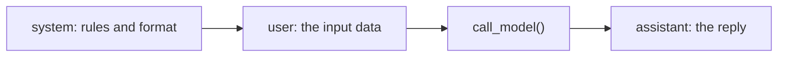

# Lab 2 — Prompting, Structured Output, Streaming, and a Tiny Eval Harness

**Time: ~3.5 hrs · Difficulty: Core · Builds on: Lab 1 (`call_model`, `cost.py`), Month 3 (JSON parsing, error handling)**

## Objective

Get *reliable, useful* output out of a model and learn to *measure* whether your prompt actually improved. You will write a structured-extraction prompt that returns parseable JSON, parse it defensively (because models lie about their formatting), stream a response token-by-token so you understand what every chat UI is doing under the hood, and finally build a tiny **eval harness** that scores two prompt variants over fixed cases and tells you which one won. This is the lab where "prompting" stops being vibes and becomes engineering.

## Setup

```zsh
cd ~/agentic/month-06         # the project from Lab 1
# Ollama server running; reuse model.py and cost.py from Lab 1
ollama list                   # confirm llama3.1:8b is present
```

**Checkpoint:** `uv run python model.py` still prints a reply and a cost log line. You are reusing Lab 1's `call_model()`.
**If not:** a `ModuleNotFoundError` means you're not in the Lab 1 project directory (`cd ~/agentic/month-06`). A `ConnectionError` means Ollama isn't running — `ollama serve` (Lab 1 Troubleshooting).

## Background

**Recall first (from memory):** From Lab 1 — what does `call_model()` return (two things), and what are the three message roles? From Month 3 — which exception does `json.loads` raise on bad input, and why handle it rather than let it crash? Hold those; this lab leans on all of them.

A model is a function from a prompt to text, and like any function its output quality depends on its input quality. The README's §4–§6 laid out the principles (clarity, examples, XML tags, negative examples, structured output, streaming, evals). This lab makes each one concrete and runnable. The throughline: **never trust model output you have not parsed defensively, and never claim a prompt is better without a number to back it.**

Every call you make is a list of role-tagged messages. Keep this shape in mind — it's the same structure you'll append to, turn after turn, inside the agent loop:


*Notice: the system message sets standing rules once; user carries the data; assistant is what comes back — you parse it, you don't trust it.*

## Steps

### 1. From vague to specific

Create `extract.py`. Start with a deliberately bad prompt and watch it fail:

```python
# extract.py
from model import call_model

BAD = "Get the info from this: 'Ada Lovelace, born 1815 in London, mathematician.'"
text, _ = call_model([{"role": "user", "content": BAD}])
print(text)
```

```zsh
uv run python extract.py
```

**Checkpoint:** the output is a chatty paragraph in an unpredictable shape — useless to a program. "Get the info" is not a spec.
**If not:** if it happens to return something tidy, run it twice more — the point is *unpredictability*. If it errors, that's a `call_model` problem from Lab 1, not the prompt; fix the call first.

### 2. A real structured-extraction prompt — Stage 1: Worked example (I do)

The new skill of this lab is writing a prompt that behaves like a *specification*. Study this fully-worked example — every part is deliberate: it names the fields, gives the exact JSON shape as an example, delimits the input with XML tags (which Anthropic models are specifically tuned to respect), and uses negative instructions to suppress the chatter. Run it and read why each clause exists; you'll write your own in Stage 3. Replace the body of `extract.py`:

```python
# extract.py
import json
from model import call_model

SYSTEM = """You extract structured data. Output ONLY a single valid JSON object \
matching the schema. No markdown, no code fences, no commentary, no preamble.

Schema (example):
{"name": "Grace Hopper", "birth_year": 1906, "city": "New York", "field": "computer science"}

Rules:
- birth_year is an integer or null if unknown.
- Do not invent values; use null when the text does not say."""

def extract(record: str) -> dict:
    text, usage = call_model(
        messages=[
            {"role": "system", "content": SYSTEM},
            {"role": "user", "content": f"<record>\n{record}\n</record>"},
        ],
        temperature=0,
        max_tokens=200,
    )
    return parse_json(text)

def parse_json(text: str) -> dict:
    """Defensive parse: models sometimes wrap JSON in ```fences``` or add a sentence."""
    t = text.strip()
    if t.startswith("```"):
        # strip a leading ```json / ``` and a trailing ```
        t = t.split("```")[1] if "```" in t[3:] else t.strip("`")
        t = t.removeprefix("json").strip()
    try:
        return json.loads(t)
    except json.JSONDecodeError as e:
        raise ValueError(f"Model did not return valid JSON: {text!r}") from e


if __name__ == "__main__":
    print(extract("Ada Lovelace, born 1815 in London, was a mathematician."))
    print(extract("Some guy from a town, does stuff."))   # tests the null path
```

```zsh
uv run python extract.py
```

**Checkpoint:** the first line prints a clean Python dict like `{'name': 'Ada Lovelace', 'birth_year': 1815, 'city': 'London', 'field': 'mathematics'}`. The second uses `null`/`None` for unknown fields rather than inventing them. Note how the XML `<record>` tags and "output ONLY JSON" instruction did the heavy lifting.
**If not:** a `ValueError: did not return valid JSON` means the model added prose — tighten the system prompt and lower `max_tokens`, or switch to `qwen2.5:7b` (Troubleshooting). If it invents a year for the second record, add a stronger negative ("use null; never guess").

> **Why parse defensively?** Even with "no code fences," small models sometimes add them anyway. Your `parse_json` strips fences and raises a clear error instead of crashing with a raw `JSONDecodeError`. This is the Month 3 error-handling discipline applied to an unreliable upstream.

### 3. Watch a prompt change behavior with examples (few-shot) — Stage 2: Faded practice (we do)

Same skill (writing a spec'd prompt), less scaffolding. The `ZERO_SHOT` prompt below is deliberately weak. The `FEW_SHOT` prompt is *partially* written — fill in the one missing example (the `TODO`) so the model has three labeled examples to pattern-match. Create `fewshot.py`:

```python
# fewshot.py
from model import call_model

ZERO_SHOT = "Classify the sentiment. Reply with exactly one word."
FEW_SHOT = """Classify the sentiment as positive, negative, or neutral.
Reply with exactly one lowercase word and nothing else.

Examples:
Input: "I love this, best purchase ever!"  -> positive
Input: "It arrived broken and late."        -> negative
Input: "It's a chair."                       -> neutral"""
# TODO: the neutral example above is the model's weakest case. Add ONE more
# clearly-neutral example (e.g., a flat factual review) to reinforce the pattern.

def classify(system: str, review: str) -> str:
    text, _ = call_model(
        [{"role": "system", "content": system}, {"role": "user", "content": review}],
        temperature=0, max_tokens=5,
    )
    return text.strip().lower()

if __name__ == "__main__":
    for sys_prompt, label in [(ZERO_SHOT, "zero-shot"), (FEW_SHOT, "few-shot")]:
        out = classify(sys_prompt, "Honestly it's fine, does the job, nothing special.")
        print(f"{label:10} -> {out!r}")
```

```zsh
uv run python fewshot.py
```

**Checkpoint:** the few-shot version reliably returns one clean lowercase word (e.g., `'neutral'`); the zero-shot version is more likely to add punctuation or a phrase. Examples taught the format better than instructions alone.
**If not:** if both behave the same, your added example may be ambiguous — make it unmistakably neutral. If the few-shot answer still has punctuation, drop `max_tokens` to ~5 and add "no punctuation" (see Troubleshooting). Small-model noise is expected; the *trend* (few-shot cleaner) is the point.

#### Stage 3 — Independent (you do)

No scaffolding. Pick a *new* extraction task of your own — for example, pull `{"title", "author", "year"}` out of a book citation, or `{"action", "amount", "merchant"}` out of a one-line bank memo. Write the system prompt yourself (spec the fields, give the JSON shape, delimit the input with XML tags, add the right negatives), reuse `parse_json` from step 2, and confirm it returns a clean dict that uses `null` for anything the text omits. Definition of done: a fresh `.py` file that extracts your schema and never invents a value. You're now writing prompts as specifications without a template.

### 4. Streaming

Streaming changes the experience, not the cost. Add a streaming call to `model.py`:

```python
# add to model.py
import json as _json

def stream_model(messages: list[dict], model: str = "llama3.1:8b",
                 max_tokens: int = 512, temperature: float = 0.0) -> str:
    """Stream tokens as they arrive; print live; return the full text."""
    resp = requests.post(
        OLLAMA_URL,
        json={"model": model, "messages": messages, "max_tokens": max_tokens,
              "temperature": temperature, "stream": True},
        stream=True, timeout=120,
    )
    resp.raise_for_status()
    pieces = []
    for line in resp.iter_lines():
        if not line:
            continue
        line = line.decode("utf-8").removeprefix("data: ")
        if line.strip() == "[DONE]":
            break
        chunk = _json.loads(line)
        delta = chunk["choices"][0]["delta"].get("content", "")
        print(delta, end="", flush=True)   # live, token-by-token
        pieces.append(delta)
    print()
    return "".join(pieces)
```

Run it:

```zsh
uv run python -c "from model import stream_model; stream_model([{'role':'user','content':'Count slowly from 1 to 10 with a word after each number.'}])"
```

**Checkpoint:** text appears incrementally, left to right, instead of all at once. The total tokens (and cost) are identical to the non-streaming call — you are paying for the same output, just watching it arrive. This is exactly what every chat UI does.
**If not:** if text arrives all at once, you forgot `stream=True` on `requests.post` (the body flag alone isn't enough) — see Troubleshooting. A `KeyError` on `content` means a delta lacked it; the `.get("content", "")` guard handles that, so check you copied it.

### 5. The tiny eval harness

This is the heart of the lab. An eval is fixed cases + a way to run them + a score. Build one that compares two extraction prompts on the same cases. Create `eval_harness.py`:

```python
# eval_harness.py
import json
from model import call_model
from extract import parse_json

# Fixed cases: input + the property we can check objectively.
CASES = [
    {"text": "Ada Lovelace, born 1815 in London, mathematician.",
     "expect": {"name": "Ada Lovelace", "birth_year": 1815}},
    {"text": "Alan Turing (1912, Maida Vale) — mathematician and logician.",
     "expect": {"name": "Alan Turing", "birth_year": 1912}},
    {"text": "A person who does things in a place.",
     "expect": {"birth_year": None}},   # must NOT hallucinate a year
]

PROMPT_A = """Extract data as JSON: name, birth_year, city, field."""
PROMPT_B = """You extract structured data. Output ONLY a valid JSON object with keys
name, birth_year (integer or null), city, field. No code fences, no commentary.
Use null when the text does not state a value. Do not invent values."""

def score_case(system: str, case: dict) -> bool:
    """Return True if every expected key matches the model's output."""
    try:
        text, _ = call_model(
            [{"role": "system", "content": system},
             {"role": "user", "content": f"<record>{case['text']}</record>"}],
            temperature=0, max_tokens=200,
        )
        got = parse_json(text)
    except (ValueError, KeyError):
        return False   # unparseable output fails the case
    return all(got.get(k) == v for k, v in case["expect"].items())

def run(name: str, system: str) -> float:
    passes = sum(score_case(system, c) for c in CASES)
    score = passes / len(CASES)
    print(f"{name}: {passes}/{len(CASES)} = {score:.0%}")
    return score

if __name__ == "__main__":
    a = run("PROMPT_A (vague) ", PROMPT_A)
    b = run("PROMPT_B (spec'd)", PROMPT_B)
    winner = "B" if b > a else ("A" if a > b else "tie")
    print(f"\nWinner: {winner}")
```

```zsh
uv run python eval_harness.py
```

**Checkpoint:** you see two scores and a declared winner. The spec'd `PROMPT_B` should score at least as high as the vague `PROMPT_A`, and crucially should pass the third case (no hallucinated year) where `PROMPT_A` often fails. **You now have evidence, not vibes.** If both score 100%, add a harder case (a record with a missing city, a non-English name) until they diverge — that divergence is exactly what an eval is for.
**If not:** scores that change run-to-run mean a `temperature` above 0 somewhere — set it to 0 everywhere (Troubleshooting). If a case never passes on *any* prompt, your `expect` is stricter than the text supports; loosen it.

### 6. Reflect

Add a comment to the bottom of `eval_harness.py` answering, in your own words: *Why does an exact-match score work here, and what kind of task would it be a bad fit for?* (Hint: open-ended summaries have no single correct string — you would score those with properties like length, keyword presence, or a model-graded rubric.)

**Checkpoint:** you can articulate that exact-match suits extraction/classification, but generative tasks need property-based or rubric scoring.
**If not:** if you can't name a task where exact-match fails, think of any task with many correct phrasings (a summary, an email) — there's no single right string to match against, so you'd score properties instead.

## Definition of Done

- [ ] `uv run python extract.py` returns a clean parsed dict and uses `null`/`None` for unknown fields without inventing them.
- [ ] `parse_json` survives a fenced-JSON response without crashing (test it: paste ```` ```json{...}``` ```` into the parser).
- [ ] `uv run python fewshot.py` shows the few-shot prompt returning a cleaner one-word answer than zero-shot.
- [ ] `stream_model(...)` prints text incrementally and returns the full string.
- [ ] `uv run python eval_harness.py` prints two scores and a winner, and the spec'd prompt wins or ties on the no-hallucination case.
- [ ] You can explain why streaming does not change cost, and when exact-match scoring is the wrong metric.

Self-verify:

```zsh
uv run python -c "from extract import parse_json; print(parse_json('\`\`\`json\n{\"a\":1}\n\`\`\`'))"
# expect: {'a': 1}   (fence stripped, parsed cleanly)
```

**Self-explain:** in one sentence, why does an eval turn "this prompt feels better" into something you can actually defend?

## Stretch Goals

1. **Third prompt variant.** Add a few-shot `PROMPT_C` with one worked example to the eval and see whether it beats `PROMPT_B`.
2. **Property scoring.** Add a summarization case scored by "is it under 20 words AND mentions the birth year" instead of exact match.
3. **Cost per eval.** Sum the `Usage` across every `call_model` in a run and print total tokens and dollars for the whole eval — useful when cases run into the dozens.
4. **Two models, one eval.** Run the eval against `llama3.1:8b` and `qwen2.5:7b` and compare. Same prompt, different model, different score — another thing an eval reveals.
5. **Schema validation.** Validate the extracted dict against a small JSON Schema (or a Pydantic model) and count schema-valid outputs as a separate metric.

## Troubleshooting

- **`parse_json` raises "did not return valid JSON".** The model added prose despite instructions; tighten the system prompt ("output ONLY the JSON object") and lower `max_tokens`. Small models are chattier — try `qwen2.5:7b`.
- **Few-shot still adds punctuation.** Lower `max_tokens` to ~5 and add an explicit negative: "Do not add punctuation or any other word."
- **Streaming prints nothing.** Confirm `"stream": True` is in the body and you passed `stream=True` to `requests.post`; without the latter the body buffers and arrives all at once.
- **Streaming chunk is missing `content`.** The final delta can be empty or carry a `finish_reason`; `.get("content", "")` already guards this — do not index it directly.
- **Eval scores are noisy run-to-run.** Set `temperature=0` everywhere in the eval; randomness makes scores unrepeatable, which defeats the purpose.
- **A case never passes on any prompt.** Your `expect` may be stricter than the data supports (e.g., expecting a field the text omits). Loosen the expectation or fix the case — an eval is only as good as its cases.
