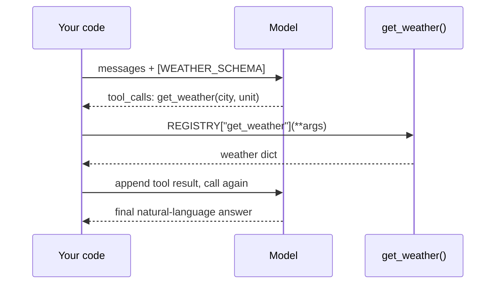

# Lab 3 — Tool Use (Function Calling) by Hand

**Time: ~3 hrs · Difficulty: Core · Builds on: Lab 1 (`call_model`), Lab 2 (defensive parsing), README §7**

## Objective

Let the model reach into your code — and do it by hand so the mechanics are undeniable. You will define a tool as a name + description + JSON schema, advertise it to the model, and run **one complete tool-use round-trip**: the model returns a structured "call `get_weather` with these arguments" request, *your* Python runs the actual function, you feed the result back as a tool-result message, and the model produces a final answer. You will do this on Ollama's OpenAI-compatible endpoint and (optionally) on Anthropic's native tool blocks, so you see that the *concept* is identical even though the JSON differs. This round-trip is the single heartbeat of the agent loop you build in Lab 4.

## Setup

```zsh
cd ~/agentic/month-06
ollama list                 # confirm qwen2.5:7b is present — it has solid tool-use support
```

**Checkpoint:** `qwen2.5:7b` appears. We switch to it for tool use because small Llama models are less reliable at emitting well-formed tool calls; Qwen is noticeably better and still free.

## Background

**Recall first (from memory):** From README §7 — does the model run the tool, or do you? From Lab 2 — why do you `json.loads` arguments inside a `try` rather than trust them? If "you run it" is instant, you already hold the core idea; this lab just makes it concrete.

A model cannot *do* anything — it only generates text. "Tool use" is a protocol layered on that: you describe available functions up front; when the model wants one, it emits a structured request instead of a final answer; your code detects that, runs the real function, and returns the result; the model continues. The model never executes code — it asks, and you decide whether and how to comply. That separation is also your security boundary (Lab 4 leans on it hard).

The four steps, from README §7:

1. **Advertise** tools (name, description, parameter schema) on the request.
2. Model **requests** a tool call with arguments (a `tool_calls` entry, not a final message).
3. **You run** the real function and append a **tool-result** message.
4. **Call again**; the model reads the result and answers (or asks for another tool).

Here is that single round-trip as a sequence. Watch who originates each arrow:


*Notice: the model asks twice and answers once; the only thing that ever runs code is "Your code." That is one beat of the agent loop.*

## Steps

### 1. The tool: a function plus a schema

A tool is two things — the Python that does the work, and a JSON schema that describes it to the model. Create `tools.py`:

```python
# tools.py
# The real function. For the lab it is faked, but the model cannot tell.
def get_weather(city: str, unit: str = "celsius") -> dict:
    fake = {"Paris": 18, "Tokyo": 24, "Reykjavik": 6}
    temp_c = fake.get(city, 15)
    temp = temp_c if unit == "celsius" else round(temp_c * 9 / 5 + 32)
    return {"city": city, "temperature": temp, "unit": unit, "conditions": "clear"}

# The schema the model sees. Clear name, clear description, typed params.
WEATHER_SCHEMA = {
    "type": "function",
    "function": {
        "name": "get_weather",
        "description": "Get the current weather for a city. Use when asked about weather.",
        "parameters": {
            "type": "object",
            "properties": {
                "city": {"type": "string", "description": "City name, e.g. 'Paris'"},
                "unit": {"type": "string", "enum": ["celsius", "fahrenheit"],
                          "description": "Temperature unit"},
            },
            "required": ["city"],
        },
    },
}

# A registry so we can dispatch by name (this is how Lab 4 routes tool calls).
REGISTRY = {"get_weather": get_weather}
```

**Checkpoint:** `uv run python -c "from tools import get_weather; print(get_weather('Paris'))"` prints a weather dict. The function works on its own; the model does not exist yet.
**If not:** an `ImportError` means you're not in `~/agentic/month-06` or the file isn't named `tools.py`. A `TypeError` on arguments means you called it without the required `city`.

### 2. Advertise the tool and capture the request (Ollama) — Stage 1: Worked example (I do)

This and step 3 are the new skill of the lab — the full round-trip — shown complete. Run this part, read every line, and watch the model *ask* to use a tool without running anything. You're not inventing yet. Create `roundtrip_ollama.py`:

```python
# roundtrip_ollama.py
import json, requests
from tools import WEATHER_SCHEMA, REGISTRY

URL = "http://localhost:11434/v1/chat/completions"

def call(messages, tools=None):
    body = {"model": "qwen2.5:7b", "messages": messages, "temperature": 0}
    if tools:
        body["tools"] = tools
    r = requests.post(URL, json=body, timeout=120)
    r.raise_for_status()
    return r.json()["choices"][0]["message"]

# STEP 1: advertise the tool. STEP 2: model requests the call.
messages = [{"role": "user", "content": "What's the weather in Paris in fahrenheit?"}]
reply = call(messages, tools=[WEATHER_SCHEMA])
print("--- model's first reply (a tool REQUEST, not an answer) ---")
print(json.dumps(reply, indent=2))
```

```zsh
uv run python roundtrip_ollama.py
```

**Checkpoint:** the reply has `tool_calls` (not a normal `content` answer). Inside, `tool_calls[0]["function"]["name"]` is `"get_weather"` and `arguments` is a JSON *string* like `'{"city": "Paris", "unit": "fahrenheit"}'`. The model parsed the city and unit out of plain English and chose the tool — but it did not run anything. That is step 2 of the four.
**If not:** if you get a normal `content` answer and no `tool_calls`, you're likely on `llama3.1:8b` — switch the model to `qwen2.5:7b` (Troubleshooting), confirm `tools=[WEATHER_SCHEMA]` is passed, and make the description say *when* to use the tool.

### 3. Run the function and feed the result back — Stage 2: Faded practice (we do)

Now *you* complete the two load-bearing lines — turning the request into a real function call, and dispatching by name through the registry. These are the exact mechanics every agent repeats. Append to `roundtrip_ollama.py` and fill the two `TODO`s:

```python
# ... continued
tool_call = reply["tool_calls"][0]
name = tool_call["function"]["name"]
args = ...                                              # TODO 1: arguments arrive as a JSON STRING — turn into a dict
print(f"\n--- STEP 3: WE run {name}({args}) ---")
result = ...                                            # TODO 2: dispatch by name through REGISTRY, passing **args
print("result:", result)
```

<details><summary>Check the two TODOs</summary>

1. `args = json.loads(tool_call["function"]["arguments"])` — OpenAI-compatible arguments are a JSON *string*, so parse them (Lab 2's defensive habit applies; a malformed string raises `JSONDecodeError`).
2. `result = REGISTRY[name](**args)` — look the function up by name and call it. *Your* code executes, not the model's. Never `eval` the name or the args.
</details>

Then append the feed-back-and-call-again part:

```python
# ... continued

# Append the model's tool request AND our tool result, then call again (STEP 4).
messages.append(reply)
messages.append({
    "role": "tool",
    "tool_call_id": tool_call["id"],
    "content": json.dumps(result),
})
final = call(messages, tools=[WEATHER_SCHEMA])
print("\n--- STEP 4: model's final answer, having seen the result ---")
print(final["content"])
```

```zsh
uv run python roundtrip_ollama.py
```

**Checkpoint:** after running the function, the second call returns a normal `content` answer — a sentence like *"It's currently 64°F and clear in Paris."* — built from the data *your* function returned. You have completed one full round-trip by hand. Read the four print blocks in order; that sequence is the agent loop's single beat.
**If not:** if the second call ignores the result or re-requests the tool, you didn't append *both* the model's tool-request message (`reply`) *and* the `role: "tool"` result with the matching `tool_call_id` — see Troubleshooting. A `JSONDecodeError` on TODO 1 means the arguments string was malformed; print it and retry.

> **The key realization:** the model did not fetch the weather. It asked you to, you did, and you told it the answer. Swap `get_weather` for `read_file` and you have the agent from Lab 4.

#### Stage 3 — Independent (you do)

No scaffolding. Add a *second* tool — `get_time(timezone: str)` — to `tools.py`: write the Python function, a clear JSON schema, and register it in `REGISTRY`. Then ask the model *"what time is it in Tokyo?"* with both tools advertised, and drive the full four-step round-trip yourself (you may copy the *structure* from steps 2–3, but the new tool and its wiring are yours). Definition of done: the model requests `get_time`, your code runs it, and the final answer uses your result. You've now built a tool end-to-end.

### 4. Schema design: make the model choose well

Edit the schema's `description` to be vague — `"description": "weather"` — and rerun. **Checkpoint:** the model may pick worse arguments, default the unit wrong, or (with a thinner description) fail to call the tool at all. Restore the clear description. The lesson: the model picks tools and arguments *entirely from your names and descriptions*. Write them like documentation for a literal-minded colleague.
**If not:** if the vague description behaves the same, run a few times (small-model variance) or make it vaguer still (drop the parameter descriptions too). Then be sure to restore the clear version before continuing.

### 5. The chatty-tool trap

Make `get_weather` return a deliberately huge result to feel the cost. Temporarily change its return to include a giant blob:

```python
# experiment only — revert after
result = REGISTRY[name](**args)
result["debug_dump"] = "x" * 40000   # 40 KB of noise
```

Re-run and watch `call_model`'s token log (reuse Lab 1's logging, or print `usage`) on the second call. **Checkpoint:** the input token count on the final call jumps dramatically, because the entire 40 KB result is now part of the context the model must re-read — and you pay for every token of it, on this turn and every future turn it stays in the history. Revert the change. This is the **chatty-tool trap** from README §7: tools must return the *minimum useful result*. In Lab 4 you will truncate large file/shell outputs for exactly this reason.
**If not:** if the input count doesn't move, you may be reading the *first* call's usage — check the *second* call (the one after the tool result is appended). If you exceed the model's context window the call may error; shrink the blob to ~10 KB and you'll still see the jump.

### 6. (Optional, paid) The same round-trip on Anthropic

Anthropic uses native content blocks rather than `tool_calls`. The concept is identical; the JSON differs. Costs a fraction of a cent — optional.

```python
# roundtrip_anthropic.py
import os, json
from dotenv import load_dotenv
from anthropic import Anthropic
from tools import get_weather

load_dotenv()
client = Anthropic(api_key=os.environ["ANTHROPIC_API_KEY"])

TOOL = {  # Anthropic's tool schema shape (no nested "function" wrapper)
    "name": "get_weather",
    "description": "Get the current weather for a city.",
    "input_schema": {
        "type": "object",
        "properties": {
            "city": {"type": "string"},
            "unit": {"type": "string", "enum": ["celsius", "fahrenheit"]},
        },
        "required": ["city"],
    },
}

messages = [{"role": "user", "content": "What's the weather in Paris in fahrenheit?"}]
r1 = client.messages.create(model="claude-3-5-haiku-latest", max_tokens=300,
                            tools=[TOOL], messages=messages)
print("stop_reason:", r1.stop_reason)   # 'tool_use'
tool_block = next(b for b in r1.content if b.type == "tool_use")
print("requested:", tool_block.name, tool_block.input)

result = get_weather(**tool_block.input)            # WE run it
messages.append({"role": "assistant", "content": r1.content})
messages.append({"role": "user", "content": [{
    "type": "tool_result", "tool_use_id": tool_block.id,
    "content": json.dumps(result),
}]})
r2 = client.messages.create(model="claude-3-5-haiku-latest", max_tokens=300,
                            tools=[TOOL], messages=messages)
print("final:", r2.content[0].text)
```

```zsh
uv run python roundtrip_anthropic.py
```

**Checkpoint:** `stop_reason` is `tool_use` on the first call, you run the function, feed back a `tool_result` block, and the second call returns the final text. Compare side by side with the Ollama version: `tool_calls` vs. `tool_use` blocks, `role: "tool"` vs. a `tool_result` content block — **same four steps, different envelopes.** This is precisely the difference your unified `call_model()` will hide in Lab 4.
**If not:** an `authentication_error` means the key/`.env` is wrong (Lab 1 Troubleshooting). If the second call rejects your messages, the `tool_result` must live in a `user`-role message and the prior `assistant` `content` (the tool_use block) must be appended verbatim — order and roles matter (Troubleshooting). This step is optional.

## Definition of Done

- [ ] `uv run python -c "from tools import get_weather; print(get_weather('Tokyo'))"` returns a weather dict.
- [ ] `roundtrip_ollama.py` prints, in order: a tool *request* with `tool_calls`, the result of *your* function running, and a final natural-language answer built from that result.
- [ ] You can recite the four steps (advertise → request → run+return → continue) without looking.
- [ ] You have seen a vague tool description degrade the model's choice, and a 40 KB result inflate the input token count.
- [ ] You can explain, in one sentence, why "the model never runs the tool" is the foundation of agent security.

Self-verify:

```zsh
uv run python -c "import json; from tools import REGISTRY; print(REGISTRY['get_weather'](**json.loads('{\"city\":\"Tokyo\",\"unit\":\"fahrenheit\"}')))"
# expect a dict with temperature 75 and unit 'fahrenheit' — proving the dispatch-by-name + JSON-args path works
```

**Self-explain:** in one sentence, why is "the model never runs the tool — it only asks, and your code decides" the fact that makes a tool-using agent possible to secure?

## Stretch Goals

1. **A second tool.** Add `get_time(timezone)` to the registry and schema, ask "what's the weather in Tokyo and what time is it there?", and watch the model request *two* tools (or one then the other). This is a preview of the multi-step loop.
2. **Bad arguments.** Ask for weather in a way that omits the city and see how the model handles a `required` field — does it ask a clarifying question or hallucinate one?
3. **No tool needed.** Ask a question that needs no tool ("what is 2+2?") with the tool advertised, and confirm the model answers directly without a tool call — the model decides.
4. **Two providers, one dispatcher.** Write a single `run_tool(name, args)` that both `roundtrip_ollama.py` and `roundtrip_anthropic.py` import, so only the envelope-handling differs. You have started building Lab 4.

## Troubleshooting

- **Model never emits a tool call (Ollama).** Use `qwen2.5:7b`, not `llama3.1:8b`; ensure `tools=[...]` is in the request body; make the tool description explicit about *when* to use it ("Use when asked about weather").
- **`arguments` is a string, not a dict.** Correct — OpenAI-compatible tool arguments arrive as a JSON *string*. Always `json.loads()` them before `**args`.
- **`KeyError: 'tool_calls'`.** The model answered directly instead of calling the tool (common on tiny models or vague descriptions). Print the whole message and check `content`; tighten the description and retry.
- **Second call ignores the result.** You must append *both* the model's tool-request message *and* a `role: "tool"` (Ollama) / `tool_result` (Anthropic) message with the matching id before calling again. A missing or mismatched `tool_call_id`/`tool_use_id` breaks the link.
- **Anthropic `tool_result` must be in a `user` message.** On Anthropic the tool result goes in a `user`-role message as a `tool_result` content block, and the prior assistant `content` (the tool_use block) must be appended verbatim. Order and roles matter.
