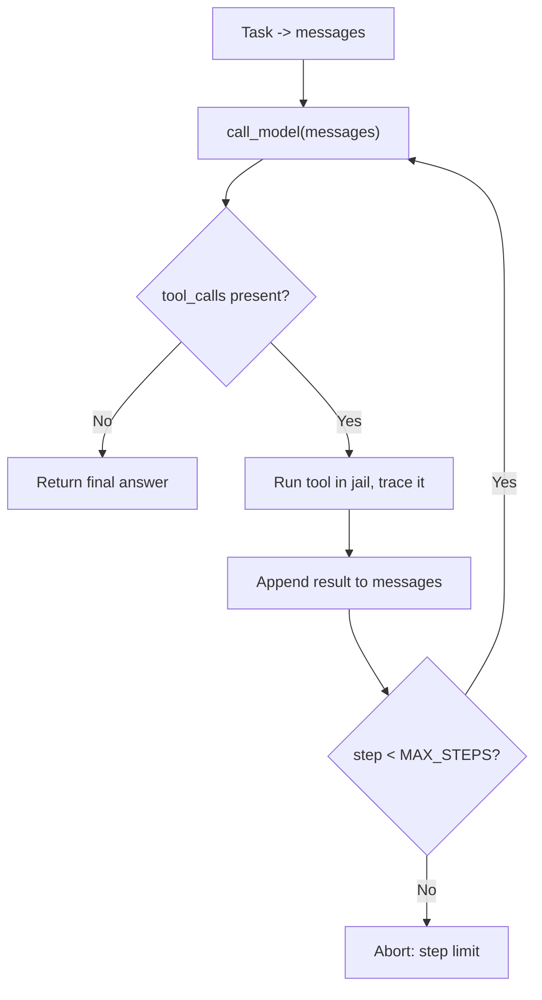

# Lab 4 — The From-Scratch Agent (Milestone)

**Time: ~5 hrs · Difficulty: Core / Stretch · Builds on: Labs 1–3, and the entire month**

## Objective

Assemble everything into a working AI agent — by hand, in one file, with **no framework**. Your `agent.py` runs the minimum viable agent loop: call the model with tools advertised, parse any tool calls, run them, feed the results back, repeat until the model stops. It has three tools — `read_file`, `write_file`, `run_shell` — every one of which is confined to a **working-directory jail**, and it never `eval`s model output. It logs tokens and dollars on every call and writes a **JSONL trace** of every tool call. You will swap it between Ollama (free) and Anthropic (paid) by changing one variable. Then you give it a real task — *read all `.py` files in this repo, summarize each in a `SUMMARY.md`, and commit the change* — and watch it work. When it is done, the mystery is gone: you will see the `while` loop inside every "agent" you ever meet again.

## Setup

```zsh
cd ~/agentic/month-06
ollama list                          # qwen2.5:7b present (best free tool-caller)
# A small target repo for the agent to operate on. A copy of your Month 3 toolbelt is perfect:
mkdir -p ~/agentic/month-06/sandbox
cp ~/agentic/month-03/lab1/*.py ~/agentic/month-06/sandbox/ 2>/dev/null || \
  printf 'def add(a, b):\n    return a + b\n' > ~/agentic/month-06/sandbox/calc.py
cd ~/agentic/month-06/sandbox && git init -q && git add -A && git commit -qm "seed" && cd ..
```

**Checkpoint:** `ls sandbox/*.py` lists at least one `.py` file, and `sandbox` is a git repo (`git -C sandbox log --oneline` shows the seed commit). This folder is the agent's jail.
**If not:** if no `.py` appears, the `cp` found nothing and the fallback `calc.py` should have been written — check you ran the whole block. If `git log` errors, the `git init`/commit didn't run; re-run the last setup line from inside `sandbox`.

## Background

**Recall first (from memory):** From Lab 3 — recite the four steps of one tool round-trip. From README §8 — what *two* guardrails must bound the loop the moment tools touch the real world? If both come fast, you already know the agent; this lab is wiring it together.

Everything you need is already in your hands. Lab 1 gave you `call_model` and the cost math. Lab 2 gave you defensive parsing and the discipline of measuring. Lab 3 gave you the four-step tool round-trip. An agent is that round-trip *in a loop*, with real tools and guardrails. The only genuinely new ideas in this lab are (1) wrapping the round-trip in a bounded `while`/`for`, (2) the working-directory jail, and (3) the JSONL trace. Everything else is composition.

This is the loop you are about to build — the same diagram from the README, now with the tools and guardrails this lab adds:


*Notice: two exits — a clean stop (no tool call) and a safety stop (`MAX_STEPS`). A loop with no second exit is a runaway bill.*

Read README §8 (the loop) and §9 (the jail and never-`eval`) once more before you start. Those two guardrails are not optional polish — the moment a tool can write files and run shell, an unguarded agent is a liability.

## Steps

### 1. The jail and the tools

Create `agent.py`. Start with the guardrail and the three tools — note that each one resolves and checks its path *before* doing anything, and `run_shell` uses an argument list, never `shell=True` with raw model text.

```python
# agent.py  — a from-scratch agent. No frameworks.
from __future__ import annotations
import json, subprocess, sys, time
from pathlib import Path

ROOT = Path("./sandbox").resolve()      # the working-directory jail
MAX_STEPS = 12                          # iteration cap: a confused model cannot loop forever

def safe_path(candidate: str) -> Path:
    """Resolve a path and confirm it stays inside ROOT, or raise."""
    p = (ROOT / candidate).resolve()
    if not p.is_relative_to(ROOT):
        raise ValueError(f"Path '{candidate}' escapes the jail {ROOT}")
    return p

def read_file(path: str) -> str:
    p = safe_path(path)
    text = p.read_text(encoding="utf-8", errors="replace")
    return text[:8000]                  # truncate: avoid the chatty-tool trap (README §7)

def write_file(path: str, content: str) -> str:
    p = safe_path(path)
    p.parent.mkdir(parents=True, exist_ok=True)
    p.write_text(content, encoding="utf-8")
    return f"wrote {len(content)} bytes to {path}"

ALLOWED_SHELL = {"ls", "cat", "git", "python", "echo", "wc", "grep"}

def run_shell(command: list[str]) -> str:
    """Run an allow-listed command as an ARGUMENT LIST inside the jail. Never shell=True."""
    if not command or command[0] not in ALLOWED_SHELL:
        raise ValueError(f"Command '{command[:1]}' not allowed. Allowed: {sorted(ALLOWED_SHELL)}")
    proc = subprocess.run(command, cwd=ROOT, capture_output=True, text=True, timeout=30)
    out = (proc.stdout + proc.stderr).strip()
    return out[:4000] or "(no output)"   # truncate large output

REGISTRY = {"read_file": read_file, "write_file": write_file, "run_shell": run_shell}
```

**Checkpoint:** test the jail in isolation before wiring the model:

```zsh
uv run python -c "from agent import safe_path; safe_path('SUMMARY.md'); print('inside ok'); safe_path('../../etc/passwd')"
```

You should see `inside ok` then a `ValueError: Path '../../etc/passwd' escapes the jail`. The jail rejects escape attempts. **Build this before adding the model** — never wire tools to a model with the jail untested.
**If not:** if the escape path does *not* raise, your `safe_path` is broken — confirm both paths are `.resolve()`d and you used `is_relative_to(ROOT)`. An `AttributeError` on `is_relative_to` means a stray system Python (needs 3.9+); run with `uv run` (Troubleshooting). A jail that fails open is the one bug you cannot ship.

### 2. The tool schemas

Add the schemas the model sees (OpenAI-compatible shape, from Lab 3):

```python
# add to agent.py
TOOLS = [
    {"type": "function", "function": {
        "name": "read_file",
        "description": "Read a UTF-8 text file inside the working directory. Returns its contents (truncated to 8000 chars).",
        "parameters": {"type": "object",
            "properties": {"path": {"type": "string", "description": "Path relative to the working directory"}},
            "required": ["path"]}}},
    {"type": "function", "function": {
        "name": "write_file",
        "description": "Write (overwrite) a text file inside the working directory.",
        "parameters": {"type": "object",
            "properties": {"path": {"type": "string"}, "content": {"type": "string"}},
            "required": ["path", "content"]}}},
    {"type": "function", "function": {
        "name": "run_shell",
        "description": "Run one allow-listed shell command as a list of args, e.g. [\"ls\"] or [\"git\",\"add\",\"-A\"]. Allowed: ls, cat, git, python, echo, wc, grep.",
        "parameters": {"type": "object",
            "properties": {"command": {"type": "array", "items": {"type": "string"},
                            "description": "Command and arguments as a list"}},
            "required": ["command"]}}},
]
```

### 3. The provider-agnostic `call_model`

Add a `call_model` that talks to Ollama by default and Anthropic by flipping `PROVIDER`. Keep it simple — this is the seam Month 7 will turn into a real pluggable provider; here it is just an `if`.

```python
# add to agent.py
import requests

PROVIDER = "ollama"      # change to "anthropic" for the paid path
OLLAMA_URL = "http://localhost:11434/v1/chat/completions"
OLLAMA_MODEL = "qwen2.5:7b"

PRICES = {"ollama": (0, 0), "anthropic": (0.80, 4.00)}   # ($/M in, $/M out); anthropic = haiku-class
TOTAL_COST = {"dollars": 0.0, "in": 0, "out": 0}

def call_model(messages: list[dict]) -> dict:
    """Return a normalized assistant message: {content, tool_calls}. Updates TOTAL_COST."""
    if PROVIDER == "ollama":
        r = requests.post(OLLAMA_URL, json={"model": OLLAMA_MODEL, "messages": messages,
                          "tools": TOOLS, "temperature": 0}, timeout=180)
        r.raise_for_status()
        data = r.json()
        msg = data["choices"][0]["message"]
        usage = (data["usage"]["prompt_tokens"], data["usage"]["completion_tokens"])
        norm = {"content": msg.get("content") or "", "tool_calls": msg.get("tool_calls") or [], "raw": msg}
    else:  # anthropic — same four steps, different envelope (see Lab 3 stretch)
        norm, usage = _call_anthropic(messages)
    pin, pout = PRICES[PROVIDER]
    cost = usage[0] / 1e6 * pin + usage[1] / 1e6 * pout
    TOTAL_COST["dollars"] += cost; TOTAL_COST["in"] += usage[0]; TOTAL_COST["out"] += usage[1]
    print(f"  [model] in={usage[0]} out={usage[1]} cost=${cost:.6f} "
          f"running_total=${TOTAL_COST['dollars']:.6f}", file=sys.stderr)
    return norm
```

(If you want the paid path, implement `_call_anthropic` using the Lab 3 pattern, normalizing its `tool_use` blocks into the same `{"content", "tool_calls"}` shape. It is an optional stretch; the loop below does not care which provider produced the message.)

**Checkpoint:** `uv run python -c "import agent; print(agent.call_model([{'role':'user','content':'say hi'}]))"` prints a normalized dict and a `[model] in=… out=… cost=$0.000000` line on stderr.
**If not:** a `ConnectionError` means Ollama isn't running (`ollama serve`). A `KeyError` on `usage`/`choices` means you're on `/api/chat` not `/v1/...`. If the returned dict lacks `tool_calls`/`content` keys, your normalization in the `ollama` branch dropped them — re-check the `norm = {...}` line.

### 4. The trace

Every tool call gets a JSONL line — append-only, one JSON object per line, replayable later:

```python
# add to agent.py
TRACE = Path("trace.jsonl")

def trace(event: str, **fields):
    rec = {"ts": time.time(), "event": event, **fields}
    with TRACE.open("a", encoding="utf-8") as f:
        f.write(json.dumps(rec) + "\n")
```

### 5. The loop — the whole point of the month

This is the new skill of the entire month, so we stage it: **Stage 1** you study the complete loop, **Stage 2** you reconstruct its load-bearing lines from a skeleton, **Stage 3** you run it on a task of your own.

#### Stage 1 — Worked example (I do)

Here it is, complete. Read it slowly: it is the four-step round-trip from Lab 3, wrapped in a bounded loop with a stop condition. Don't type it from scratch yet — read it and map each line onto the diagram in Background.

```python
# add to agent.py
SYSTEM = (
    "You are a coding agent operating inside a single working directory. "
    "Use the provided tools to read and write files and run allow-listed shell commands. "
    "Work step by step. When the task is fully complete, reply with a final message "
    "that begins with 'DONE:' and no tool call."
)

def run_agent(task: str) -> str:
    messages = [{"role": "system", "content": SYSTEM},
                {"role": "user", "content": task}]
    trace("start", task=task, provider=PROVIDER, root=str(ROOT))

    for step in range(MAX_STEPS):
        msg = call_model(messages)
        tool_calls = msg["tool_calls"]

        if not tool_calls:                          # STOP condition: no tool call = done
            trace("final", step=step, text=msg["content"][:500])
            return msg["content"]

        messages.append(msg.get("raw", {"role": "assistant", "content": msg["content"],
                                        "tool_calls": tool_calls}))
        for tc in tool_calls:
            name = tc["function"]["name"]
            args = json.loads(tc["function"]["arguments"])   # NEVER eval — parse as JSON
            print(f"  [tool] {name}({args})", file=sys.stderr)
            try:
                result = REGISTRY[name](**args)              # YOUR code runs, not the model's
                ok = True
            except Exception as e:                           # tool errors go BACK to the model
                result, ok = f"ERROR: {e}", False
            trace("tool_call", step=step, tool=name, args=args,
                  ok=ok, result_size=len(str(result)))
            messages.append({"role": "tool", "tool_call_id": tc.get("id", name),
                             "content": json.dumps(result)})
    trace("aborted", reason="hit MAX_STEPS")
    return "ABORTED: hit step limit without finishing"

if __name__ == "__main__":
    TASK = ("List the .py files in the working directory, read each one, then write a "
            "SUMMARY.md containing a one-paragraph summary of every .py file. "
            "Finally, stage and commit SUMMARY.md with git. Reply 'DONE:' when finished.")
    print(run_agent(TASK))
    print(f"\nTOTAL: in={TOTAL_COST['in']} out={TOTAL_COST['out']} "
          f"cost=${TOTAL_COST['dollars']:.6f}", file=sys.stderr)
```

**Checkpoint:** read the loop and narrate it aloud: *call model; if no tool call, stop and return; otherwise append the request, run each tool, append each result, loop.* If you can narrate it, you understand agents. Notice three guardrails already in place: `range(MAX_STEPS)` (no infinite loop), `json.loads` not `eval` (no code execution of model text), and tool exceptions returned to the model instead of crashing (the model can recover).
**If not:** if you can't narrate it without re-reading, that's the signal to slow down — re-trace it against the Background diagram, line by line, before running anything. The loop is the one thing you must own outright.

#### Stage 2 — Faded practice (we do)

Now prove you own the loop's skeleton. In a scratch file, reconstruct the body of `run_agent` from this skeleton — fill the four `TODO`s from memory, then diff against Stage 1:

```python
def run_agent(task: str) -> str:
    messages = [{"role": "system", "content": SYSTEM},
                {"role": "user", "content": task}]
    for step in range(MAX_STEPS):
        msg = call_model(messages)
        if not msg["tool_calls"]:
            return ...                      # TODO 1: the stop condition — what do you return?
        messages.append(msg.get("raw", ...))  # append the model's tool request
        for tc in msg["tool_calls"]:
            name = tc["function"]["name"]
            args = ...                      # TODO 2: parse args — which function, NOT eval?
            try:
                result = ...                # TODO 3: dispatch by name through REGISTRY
            except Exception as e:
                result = f"ERROR: {e}"      # tool errors go back to the model, not a crash
            messages.append({"role": "tool", "tool_call_id": tc.get("id", name),
                             "content": json.dumps(result)})
    return ...                              # TODO 4: what happens if you fall out of the loop?
```

<details><summary>Check the four TODOs</summary>

1. `return msg["content"]` — the model's final text is the answer when there's no tool call.
2. `args = json.loads(tc["function"]["arguments"])` — parse the JSON-string args; **never** `eval`.
3. `result = REGISTRY[name](**args)` — dispatch by name through the registry; your code runs.
4. `return "ABORTED: hit step limit without finishing"` — the safety exit when `MAX_STEPS` is exhausted.
</details>

### 6. Run it

```zsh
rm -f trace.jsonl                 # fresh trace
uv run python agent.py
```

**Checkpoint:** on stderr you see an interleaving of `[model] in/out/cost` lines and `[tool] name(args)` lines as the agent reads files and writes the summary, ending in a `DONE:` message and a `TOTAL:` cost line. Then verify the work:

```zsh
cat sandbox/SUMMARY.md
git -C sandbox log --oneline      # the agent's commit should appear
cat trace.jsonl | jq .            # every tool call, replayable
```

You should see a `SUMMARY.md` with a paragraph per `.py` file, a new commit in the sandbox repo, and a JSONL trace with `start`, several `tool_call`, and a `final` event. **The agent did this. You wrote the loop.**
**If not:** if it answers in prose without calling tools, you're likely on the wrong model — confirm `OLLAMA_MODEL = "qwen2.5:7b"` and that `tools=TOOLS` is on the request (Troubleshooting). If it writes the file but never commits, that's a real failure mode — capture it for `FAILURES.md` rather than hand-fixing. If it aborts at `MAX_STEPS`, the model is stuck re-reading; sharpen the task or lower the file count.

#### Stage 3 — Independent (you do)

No scaffolding. Give the *same* agent a *different* task and watch the identical loop handle it — for example: *"Count the lines in every `.py` file and write `LINECOUNT.md` listing each filename and its line count, then commit it."* Change only the `TASK` string; do not touch the loop. Definition of done: a new committed `.md` file produced entirely by the agent, plus a fresh `trace.jsonl` showing the `run_shell`/`write_file` calls. If one loop handles two unrelated tasks unchanged, you've internalized that the agent *is* the loop — the task is just input.

### 7. Break it on purpose, then write `FAILURES.md`

A successful first run is rare and you should be suspicious if it happens. Small models fumble tool calls, write malformed JSON, forget to commit, or summarize the wrong files. Run it several times and on different sandboxes. Each time something goes wrong, record it. Create `FAILURES.md` as an engineer's lab notebook — symptom, diagnosis, fix:

```markdown
# FAILURES.md — From-Scratch Agent

## 1. Model wrote SUMMARY.md but never committed
- Symptom: SUMMARY.md present, `git log` shows no new commit. Loop returned DONE early.
- Diagnosis: system prompt said "commit" but the model treated writing as "done".
- Fix: made the stop instruction explicit — "only say DONE after `git commit` succeeds" —
  and added `git status` as a verification step the model could run.

## 2. read_file on a path with '../'
- Symptom: ValueError "escapes the jail" aborted a tool call.
- Diagnosis: model tried to read a sibling directory. The jail did its job.
- Fix: none needed — this is correct behavior. Returned the error to the model, which
  then read a valid path. (Documented as a SUCCESS of the guardrail.)

## 3. Hit MAX_STEPS without finishing
- Symptom: "ABORTED: hit step limit".
- Diagnosis: model re-read the same file every step, never progressing.
- Fix: ...
```

Document **at least three** real failure modes you actually hit (you will hit more). **Checkpoint:** `FAILURES.md` has at least three entries, each with symptom → diagnosis → fix, written from your own runs — not invented.
**If not:** if the agent succeeds every time and you have nothing to write, make it harder — add more `.py` files, shorten `MAX_STEPS`, or use `llama3.1:8b` instead of Qwen. Failures are the point of this step; an agent that never fails just means the task is too easy to be informative.

## Definition of Done

- [ ] `agent.py` is a single file, **no framework imports** (no langchain, crewai, smolagents, openai-agents, etc.).
- [ ] The working-directory jail is implemented and *demonstrably rejects* `../` escapes (you showed this in step 1).
- [ ] Model output is never `eval`'d/`exec`'d; `run_shell` uses an argument list against an allow-list, never `shell=True` with raw model text.
- [ ] The loop has an iteration cap (`MAX_STEPS`) and a clean stop condition (final message, no tool call).
- [ ] A successful run produces `sandbox/SUMMARY.md` with a per-file summary **and** a new git commit in the sandbox.
- [ ] `trace.jsonl` contains a `start`, multiple `tool_call` events (with tool, args, ok, result_size), and a `final` event.
- [ ] Per-call token/cost logging works and a `TOTAL:` is printed; the whole thing runs on Ollama for **$0.00**.
- [ ] `FAILURES.md` documents at least three real failure modes (symptom → diagnosis → fix).
- [ ] Submit three artifacts: `agent.py`, the `trace.jsonl` from a successful run, and `FAILURES.md`.

Self-verify:

```zsh
# Jail rejects escape, allow-list rejects rogue commands, trace is valid JSONL:
uv run python -c "from agent import run_shell; run_shell(['rm','-rf','/'])" 2>&1 | grep -q "not allowed" && echo "allow-list OK"
test -f sandbox/SUMMARY.md && git -C sandbox log --oneline | head -1 && echo "task OK"
wc -l < trace.jsonl && echo "trace lines above"
```

**Self-explain:** in one sentence, why is this "AI agent" really just a `while` loop around an ordinary model call — and where, exactly, is the loop?

## Stretch Goals

1. **Anthropic provider.** Implement `_call_anthropic` so `PROVIDER = "anthropic"` runs the identical loop against Claude. Compare the trace and the dollar cost to the free run. (This is the Month-7 seam.)
2. **Replay the trace.** Write a 20-line `replay.py` that reads `trace.jsonl` and prints a human-readable transcript of the run — proof the trace is rich enough to reconstruct what happened.
3. **A tighter jail.** Add a max-file-size and max-total-writes limit, and forbid `write_file` outside a `*.md` allow-list, so a confused agent cannot overwrite source code.
4. **An eval for the agent.** Using Lab 2's harness, run the agent on three different sandbox repos and score "did SUMMARY.md mention every .py file" and "was there a commit" — turning the milestone into a measurable, repeatable thing.
5. **Cost ceiling.** Abort the loop if `TOTAL_COST['dollars']` exceeds a budget you set — a real-world guardrail for paid agents.

## Troubleshooting

- **Model answers in prose instead of calling tools.** Use `qwen2.5:7b`; confirm `tools=TOOLS` is on the request; strengthen the system prompt ("you MUST use the tools to read and write files"). Tiny models are the usual culprit.
- **`json.loads(arguments)` fails.** The model emitted malformed JSON arguments. Catch it, return the error string as the tool result, and let the model retry — your loop already routes tool exceptions back to the model.
- **Infinite-feeling run.** It cannot truly be infinite — `MAX_STEPS` bounds it. If it always aborts, the model is stuck re-reading; lower the file count or sharpen the task wording.
- **`is_relative_to` AttributeError.** That method needs Python 3.9+. You are on 3.12 via `uv`; ensure you ran with `uv run`, not a stray system `python`.
- **The commit step fails.** The sandbox must be a git repo (`git -C sandbox status`). Re-run the Setup git init. Also confirm `git` is in `ALLOWED_SHELL`.
- **Trace is empty.** You `rm`'d it but the run errored before any tool call, or you ran from a different directory. `TRACE` is relative to your cwd — run from `~/agentic/month-06`.
- **Run cost is higher than expected (paid path).** The whole message history resends every turn, so input tokens grow each step (README §3). Truncated tool results and a tight `MAX_STEPS` keep it down; watch the `running_total` line.
