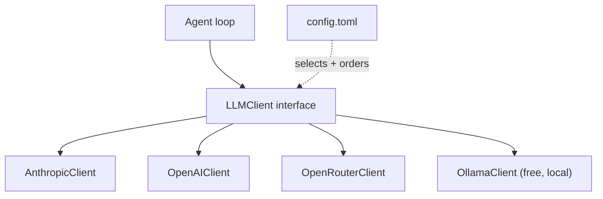
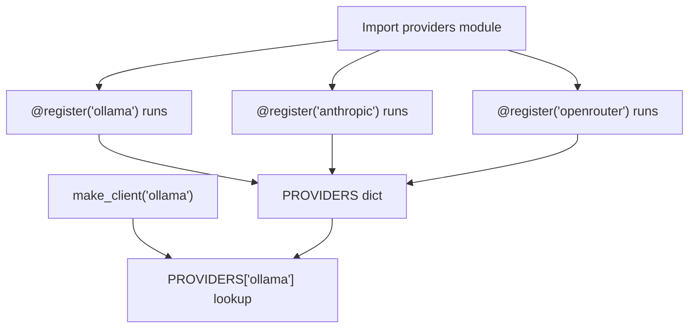
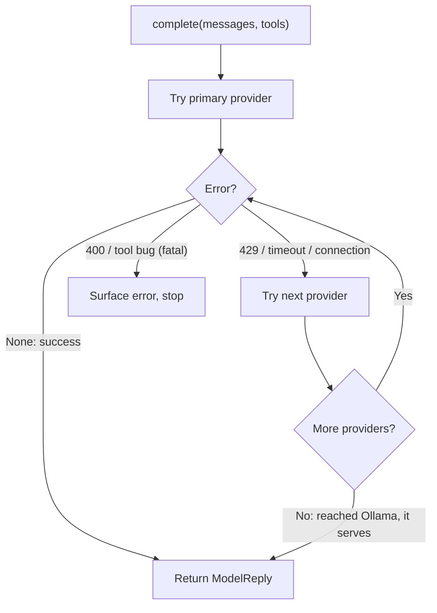

# Month 07 — Extensible Software

**Pillar 3 — Extensible Software**

## Overview

In Month 6 you built an AI agent from scratch — a `while` loop around a model call, with three tools and a deliberately simple `call_model()` that branched on a `PROVIDER` string. It works. It also has a seam waiting to split open: the `if PROVIDER == "ollama": ... else: ...` inside `call_model()` is a confession that every new provider, every renamed model, every new API shape means editing that function. Today there are two branches; the way the field moves, there will be five by next quarter. That is the failure mode this month exists to kill.

This is Pillar 3, and its thesis is one sentence: **write software that is open to extension but closed to modification.** This is Month 5's Open/Closed Principle applied to the part of your system that churns fastest — the model layer. AI models, providers, prices, and tool APIs change on a timescale of weeks. If swapping a model means a three-day rewrite of your agent's core, you have built brittle software and will spend your career maintaining it. If swapping a model is a ten-minute edit to a config file with *zero* changes to the agent loop, you have built extensible software and will outrun the churn.

You will learn the small, durable set of patterns that make that possible: a single `LLMClient` **interface** (a `Protocol`) with Anthropic, OpenAI, and OpenRouter/Ollama behind it; the **Strategy**, **Registry**, and **Plugin** patterns in idiomatic Python; **configuration as code** (a TOML file drives behavior, so constants stop hiding in source); **fallback chains** (if the primary rate-limits or vanishes, drop to the next, ultimately to local Ollama, which is always there and free); and **prompt versioning** (prompts as artifacts you version like code). The villain throughout is the `isinstance` ladder and the giant `if-elif` chain, and you will learn what replaces them: polymorphism through a shared interface, and registries that let new behavior *register itself* without the core knowing it exists.

The payoff is the milestone, the **Provider-Agnostic Core**: refactor your Month 6 agent so its entire model layer is pluggable — four providers behind one interface, selected by config, with a fallback chain — and prove it by blackholing your primary provider mid-run and watching the agent fail over to local Ollama and finish. Done means "swap to a different model" is a config change, not a rewrite.


*Notice: the loop touches only the interface in the middle. The four providers are swappable implementations behind it, and the config — not the code — chooses which one runs and in what fallback order.*

## Prerequisites

Coming in, you should be able to do everything from Months 1 through 6:

- Work fluently in zsh, Git, HTTP/JSON, and Python (Months 1–4): functions, dicts, comprehensions, file I/O, `try`/`except`, `requests`, retry-with-backoff, and loading secrets from `.env` with `python-dotenv`.
- Apply software-engineering structure (Month 5): classes and methods, `Protocol`-based interfaces, dependency injection, `pytest`, strict type hints, structured logging, and the SOLID principles — specifically the **Open/Closed Principle** and **Single Responsibility Principle**, which this month leans on hard. You should already have swapped a "provider" (GitHub vs. GitLab) behind an interface in Month 5; this month does the same to the *model*.
- Own the from-scratch agent loop (Month 6): you understand that an agent is a bounded `while` loop that calls a model, parses tool calls, runs tools, feeds results back, and stops. You have a working `agent.py` with `read_file`/`write_file`/`run_shell`, a working-directory jail, JSONL tracing, and a simple `call_model()` that branches on a provider string.

If your Month 6 agent is not running on Ollama for $0, fix that first — every lab this month builds on it, and Ollama is the free fallback the whole milestone depends on.

## Warm-Up: Retrieve Before You Begin

Before reading on, answer these from memory — no peeking at earlier months. This pulls forward the prior skills this month builds on.

1. In Month 5 you swapped a "provider" (GitHub vs. GitLab) behind a `Protocol`. What does a `Protocol` let a class do *without* inheriting from anything? What is the name of the principle that says "depend on the interface, not the concrete class"?
2. State the Open/Closed Principle in one sentence. What does it mean for code to be "closed to modification"?
3. In Month 5, how did you give an object its dependency instead of having it construct its own? (One term.)
4. In Month 6 your agent had a `call_model()` that branched on a `PROVIDER` string (`if PROVIDER == "ollama": ... else: ...`). What two things does that single function have to *know* about each provider, and what happens to it when you add a fifth provider?
5. What is the agent loop, in one line — what makes it stop?

<details><summary>Check your recall</summary>

1. A `Protocol` lets a class conform *structurally* — by having the right methods/attributes — with no inheritance and no import of the base class (Month 5, structural typing). The principle is the **Dependency Inversion Principle**: high-level policy and low-level detail both depend on an abstraction.
2. **Open to extension, closed to modification:** you should be able to add new behavior by adding code, not by editing existing (tested) code. "Closed to modification" means you don't reopen and re-test working code to extend it.
3. **Dependency injection** — pass the dependency in (constructor or argument) rather than letting the object build it (Month 5).
4. It has to know each provider's request shape and response shape (URL/auth/JSON field names). Adding a fifth provider means *editing* that function — a new branch, re-tested — which is exactly the Open/Closed violation this month kills (Month 6 `call_model()`).
5. An agent is a bounded `while` loop: call model → if it asks for a tool, run it and feed the result back → repeat. It stops when the model returns no tool call (Month 6).
</details>

## Learning Objectives

By the end of this month you can:

1. **Define** a single `LLMClient` interface as a Python `Protocol`, and **explain** why a structural interface (duck-typed, no inheritance required) is the right tool for a provider boundary that third parties might extend.
2. **Implement** three or more conforming providers — Anthropic, OpenAI, and OpenRouter/Ollama — behind that one interface, each in its own module, normalizing their different request/response shapes to a common type.
3. **Drive** provider and model selection from a TOML config file, so changing the model is a config edit with zero source changes (configuration as code).
4. **Refactor** an `if-elif`/`isinstance` ladder into a registry, and **explain** why such ladders violate the Open/Closed Principle and what polymorphism and registries replace them with.
5. **Build** a decorator-based tool registry so new tools register themselves and drop into the agent without editing its core loop.
6. **Implement** the Strategy pattern to make a single behavior (e.g., output formatting or retry policy) swappable at runtime via config.
7. **Version** prompts as external artifacts with explicit version IDs, and **explain** why prompts deserve the same change-tracking discipline as code.
8. **Compose** a fallback chain that tries providers in order and degrades gracefully — rate-limit/timeout on the primary cascades to a secondary and ultimately to local Ollama — and **demonstrate** it surviving a blackholed primary provider.

## Tech Stack (free, macOS)

| Tool | Install | Why |
|---|---|---|
| Python 3.12+ via uv | `brew install uv`; `uv python install 3.12` | From Month 3. `uv` manages the project, venv, and deps. `Protocol` and `tomllib` are used throughout. |
| Ollama | `brew install ollama` | The always-available **free** fallback. The whole failover demo costs **$0** because Ollama runs locally. |
| A local model | `ollama pull qwen2.5:7b` (and `ollama pull llama3.1:8b`) | Strong free tool-caller for the agent. Used as the bottom of every fallback chain. |
| `requests` | `uv add requests` | The HTTP client from Month 4. We call OpenAI-compatible endpoints (Ollama, OpenRouter, OpenAI) over plain HTTP so the wiring stays visible. |
| `tomllib` | built into Python 3.11+ | Reads the config file. **No install** — it ships with Python. We *read* TOML with the stdlib and only write it by hand. |
| `pydantic` (optional) | `uv add pydantic` | Validates the parsed config into a typed object so a malformed config fails loudly at startup, not mid-run. Optional; a `@dataclass` works too. |
| `anthropic` (optional, paid) | `uv add anthropic` | Official SDK for the Anthropic provider implementation. Only needed on the paid path. |
| `python-dotenv` | `uv add python-dotenv` | Loads API keys from `.env`. Never hardcode keys (Month 4 habit); config references keys by env-var *name*, never the value. |
| `pytest` | `uv add --dev pytest` | From Month 5. We test that every provider conforms to the interface and that the fallback chain behaves. |

**Cost summary.** You can complete **100%** of this month for **$0** using Ollama as both your development model and the bottom of the fallback chain. OpenRouter publishes some free model endpoints (free tier, rate-limited) you may use for the "remote secondary" without spend. The **paid** providers (Anthropic, OpenAI) are optional and labeled everywhere they appear; if you wire them, a full lab run moves tens of thousands of tokens and costs well under a dime on a cheap model — but you never *have* to. The failover demo specifically uses Ollama as the survivor, so even simulating an outage of every paid provider costs nothing.

## Weekly Breakdown

Budget ~8–12 hours per week: roughly a third reading the Core Concepts and two thirds in the labs refactoring real code.

### Week 1 — One interface, many providers
**Warm-start (do this first):** before any new material, re-run your Month 6 agent on Ollama and finish one small task. Then open `agent.py`, find the `call_model()` function, and put your finger on the `if PROVIDER == "ollama": ... else: ...` branch. That branch is the seam this whole month exists to remove — keep it on screen as the "before" you are about to refactor.
**Focus:** define the `LLMClient` `Protocol` and put three providers behind it.
**Topics:** the difference between an *interface* and an *implementation*; structural typing with `Protocol` (vs. nominal/ABC inheritance) and why structural is right for an extension boundary; normalizing divergent provider response shapes into one `ModelReply` type; dependency injection of a provider into the agent; why the agent loop must depend on the *interface*, never on a concrete provider; keys-by-name (config references `ANTHROPIC_API_KEY`, never the secret itself).
**Reading:** Core Concepts §1–§3.
**Build:** Lab 1 — an `llm` package with a `Protocol`, a shared `ModelReply` dataclass, and `OllamaClient`, `OpenAIClient`, and `AnthropicClient` implementations; a `pytest` that proves each conforms; the agent calling through the interface with no knowledge of which provider it got.

### Week 2 — Configuration as code, and killing the ladder
**Focus:** move every hardcoded constant into TOML; replace selection logic with a registry.
**Topics:** configuration as code (behavior lives in data, not in source); reading and validating TOML at startup; the `if-elif`/`isinstance` ladder as an Open/Closed *smell* and why it's a maintenance tax; the **Registry** pattern (a name→factory map) and the decorator-registry idiom; selecting a provider by *string from config* through the registry instead of a branch in code.
**Reading:** Core Concepts §4–§5.
**Build:** Lab 2 (part A) — a `config.toml` and a typed `Config` loader; a provider **registry** so adding a provider is "write a class, decorate it," not "edit a branch."

### Week 3 — Strategy, plugins, and prompt versioning
**Focus:** make tools and prompts pluggable artifacts.
**Topics:** the **Strategy** pattern (a swappable algorithm chosen at runtime); the **Plugin** pattern in Python (decorator registries now, `importlib.metadata` entry points as the production form); a decorator-based **tool registry** so new tools self-register; **prompt versioning** — prompts as external files with version IDs, tracked and selected like code, with the version recorded in the trace.
**Reading:** Core Concepts §6–§7.
**Build:** Lab 2 (part B) + the tool/prompt groundwork for Lab 3 — a `@tool` decorator registry, a `prompts/` directory with versioned prompt files, and a strategy chosen from config.

### Week 4 — The Provider-Agnostic Core (milestone)
**Focus:** assemble it all and prove graceful failover.
**Topics:** the **fallback chain** (ordered providers, try-next on rate-limit/timeout/connection error, terminate at local Ollama); classifying which errors are retryable-elsewhere vs. fatal; the graceful-degradation demo (blackhole the primary by pointing its base URL at an unreachable host); the ten-minute config swap as the definition of done.
**Reading:** Core Concepts §8.
**Build:** Lab 3 — refactor the Month 6 agent so its model layer is fully config-driven with a fallback chain and a self-registering tool registry; record and submit the failover demonstration (the agent finishing a task after the primary provider is blackholed, on free local Ollama).

## Core Concepts

### §1 — Interface vs. implementation, and why the agent must depend on the interface

An **interface** is a promise about *what* something does; an **implementation** is *how* it does it. The Anthropic API, the OpenAI API, and Ollama all do the same job — take messages and tools, return a reply, possibly with tool calls — but each does it differently: different URLs, different JSON shapes, different auth, different names for the same fields. The mistake is to let those differences leak into your agent. The moment your agent loop contains `if provider == "anthropic"`, the loop *knows* about Anthropic, and now Anthropic's quirks are welded into your core. Add OpenAI and the loop knows two things; add three more and the loop is a ladder.

The fix is an inversion you already met in Month 5: the agent depends on an **interface** it defines, and each provider *conforms* to that interface. The agent says, "give me anything that can `complete(messages, tools) -> ModelReply`," and it does not care, cannot tell, and must never ask which concrete provider it got. This is the Dependency Inversion principle and the spine of the Open/Closed Principle: the high-level policy (the loop) and the low-level detail (the provider) both depend on the abstraction in the middle, and that abstraction does not change when you add a provider.

> **Common misconception.** "An `if/elif` over providers is fine — it's only a few branches, and a dict lookup is overkill for two cases."
> **Reality.** It's tempting because two branches *are* readable. But that `if/elif` is the seam that splits open: it's the one place that has to be reopened and re-tested for every provider, rename, or API change — and in this field that's monthly. The cost isn't the branches you have today; it's that the function's reasons to change grow without bound. The interface freezes that cost at zero.

> **Common misconception.** "The agent core should know which provider it's using — how else would it call the right API?"
> **Reality.** The core knowing the provider is exactly the disease. The *provider object* knows its own API; the core only knows the `LLMClient` interface and calls `complete(...)`. If you can grep the loop and find the word `anthropic`, the refactor isn't done. Knowledge of "which provider" lives in one place — the config — not in the code.

### §2 — `Protocol`: structural interfaces for an extension boundary

Python gives you two ways to declare an interface. An **ABC** (abstract base class) is *nominal*: a class is an `LLMClient` only if it explicitly inherits from `LLMClient`. A **`Protocol`** (from `typing`) is *structural*: a class is an `LLMClient` if it has the right methods with the right shapes — no inheritance, no import of your base class required. For an extension boundary that third parties (or future-you) might fill, structural typing is the better fit: someone can write a conforming provider in their own package without importing yours, and your type checker still verifies the fit. This is duck typing with a static safety net.

```python
from typing import Protocol, runtime_checkable
from dataclasses import dataclass

@dataclass
class ModelReply:
    text: str
    tool_calls: list[dict]          # normalized [{id, name, arguments}], possibly empty
    tokens_in: int
    tokens_out: int

@runtime_checkable
class LLMClient(Protocol):
    name: str
    def complete(self, messages: list[dict], tools: list[dict]) -> ModelReply:
        """Send messages + tool schemas; return a normalized reply."""
        ...
```

Any class with a `name` attribute and a matching `complete` method *is* an `LLMClient` as far as the type checker is concerned — even though it never mentions `LLMClient`. The `@runtime_checkable` decorator additionally lets you `isinstance(x, LLMClient)` at runtime for a defensive check at the boundary (the one place an isinstance is fine: validating that a plugin conforms, not branching on which provider it is).

### §3 — Normalizing to one reply type

Each provider returns a different envelope. Ollama and OpenAI use `choices[0].message` with `tool_calls`; Anthropic uses top-level `content` blocks of type `tool_use`. The provider's *one job* (Single Responsibility) is to translate its native shape into your `ModelReply` — and to translate your normalized tool-result messages back into its native request shape. All the ugliness of "this provider calls it `prompt_tokens`, that one calls it `input_tokens`" lives inside that provider's module and nowhere else. The agent only ever sees `ModelReply`. This is the whole trick to provider-agnosticism: push the differences to the edges and keep the center clean.

```python
class OllamaClient:                          # conforms to LLMClient structurally
    name = "ollama"
    def __init__(self, base_url: str, model: str) -> None:
        self.base_url, self.model = base_url, model
    def complete(self, messages, tools) -> ModelReply:
        r = requests.post(f"{self.base_url}/v1/chat/completions",
                          json={"model": self.model, "messages": messages,
                                "tools": tools, "temperature": 0}, timeout=180)
        r.raise_for_status()
        m = r.json()["choices"][0]["message"]; u = r.json()["usage"]
        calls = [{"id": c["id"], "name": c["function"]["name"],
                  "arguments": c["function"]["arguments"]} for c in (m.get("tool_calls") or [])]
        return ModelReply(m.get("content") or "", calls,
                          u["prompt_tokens"], u["completion_tokens"])
```

### §4 — Configuration as code

A hardcoded constant is a decision frozen into source. `OLLAMA_MODEL = "qwen2.5:7b"` means changing the model requires editing, re-reviewing, and re-deploying code. **Configuration as code** moves those decisions into a data file — here, TOML — that the program reads at startup. Now the *behavior* (which provider, which model, what temperature, the fallback order) lives in `config.toml`, and the *mechanism* lives in your Python. Swapping models becomes a one-line config edit. The principle: code should contain *logic*, not *choices*. Choices are data.

Python reads TOML with the standard library — no dependency:

```toml
# config.toml
[primary]
provider = "anthropic"
model    = "claude-haiku"
api_key_env = "ANTHROPIC_API_KEY"   # the NAME of the env var, never the secret

[[fallback]]                        # ordered; tried top to bottom
provider = "openrouter"
model    = "meta-llama/llama-3.1-8b-instruct:free"
api_key_env = "OPENROUTER_API_KEY"

[[fallback]]
provider = "ollama"                 # always last: local, free, no network
model    = "qwen2.5:7b"
base_url = "http://localhost:11434"
```

```python
import tomllib
with open("config.toml", "rb") as f:
    cfg = tomllib.load(f)           # validate into a typed Config object next (Lab 2)
```

Two non-negotiables: **secrets are referenced by env-var name, never stored in the config** (the config is committed to Git; the secret is not), and the config is **validated at startup** into a typed object so a typo fails loudly before the agent runs, not three tool calls deep.

### §5 — The `if-elif`/`isinstance` ladder is a smell; the registry is the cure

> **Heavy concept ahead.** Slow down here; this is the load-bearing idea of the month. The registry/decorator pattern is the one new mechanism everything else (config selection, the tool registry, the fallback chain) is built on. Read this chunk twice and trace the decorator's flow by hand before moving on.

Here is the code this month is at war with:

```python
# DON'T. Every new provider edits this function. This violates Open/Closed.
def make_client(provider, cfg):
    if provider == "anthropic":
        return AnthropicClient(...)
    elif provider == "openai":
        return OpenAIClient(...)
    elif provider == "ollama":
        return OllamaClient(...)
    else:
        raise ValueError(f"unknown provider {provider}")
```

Why is this bad? It is *closed to extension* in the worst way: the only way to add a provider is to *modify* this function — reopen tested code, add a branch, re-test it. The function's reasons to change grow without bound (it violates SRP too: it knows about every provider). An `isinstance` ladder is the same smell wearing a different hat: `if isinstance(x, Anthropic): ...` is a branch on type that polymorphism is supposed to make unnecessary.

The cure is a **registry**: a `name -> factory` map that providers add themselves to, so the selector just *looks up* the name instead of *branching* on it.

```python
PROVIDERS: dict[str, type] = {}

def register(name):                          # a decorator-registry — idiomatic Python
    def deco(cls):
        PROVIDERS[name] = cls
        return cls
    return deco

@register("ollama")
class OllamaClient: ...
@register("anthropic")
class AnthropicClient: ...

def make_client(provider: str, **kw) -> LLMClient:
    try:
        return PROVIDERS[provider](**kw)     # lookup, not branch. Open to extension.
    except KeyError:
        raise ValueError(f"unknown provider '{provider}'. Known: {sorted(PROVIDERS)}")
```

Adding a fourth provider is now: write a class, decorate it with `@register("openrouter")`, import the module. `make_client` never changes. *That* is open to extension, closed to modification. The dictionary lookup also collapses an O(n) ladder into O(1), but speed is a footnote — the real win is that tested code stays tested.


*Notice: providers add themselves to the dict at import time; `make_client` only looks a name up. Adding a provider adds an arrow into the dict — it never edits the lookup.*

### §6 — Strategy and Plugin: the same idea at two scales

The **Strategy** pattern is "make an algorithm swappable." Wherever you have a single decision the right choice for which varies — how to format output, which retry policy to use, how to chunk a document — define the choices behind a tiny interface and pick one *by config* rather than hardcoding it. A registry of strategies plus a config key naming the active one, and your behavior is now data-driven. The agent's retry-and-fallback policy in Week 4 is itself a strategy.

The **Plugin** pattern is Strategy/Registry taken to its logical end: third-party code, in a *separate* package, that registers itself into your system without you editing anything. In Python the lightweight form is the decorator registry above (works within one codebase). The production form is **`importlib.metadata` entry points**: a package declares in its `pyproject.toml` that it provides, say, an `llm.providers` entry point, and your app discovers it at runtime — no import of the plugin in your source at all. We build the decorator-registry form now (it's all you need for the milestone) and name entry points as the next step so you recognize how real plugin ecosystems (pytest, Flask, your own future tools) work.

```python
# the tool registry: new tools self-register, the agent loop never edits to add one
TOOLS: dict[str, callable] = {}
SCHEMAS: list[dict] = []

def tool(schema: dict):
    def deco(fn):
        TOOLS[schema["function"]["name"]] = fn
        SCHEMAS.append(schema)
        return fn
    return deco

@tool({"type": "function", "function": {"name": "read_file", "description": "...",
       "parameters": {"type": "object", "properties": {"path": {"type": "string"}},
       "required": ["path"]}}})
def read_file(path: str) -> str:
    ...
```

The agent advertises `SCHEMAS` to the model and dispatches with `TOOLS[name](**args)`. Drop a new `@tool`-decorated function into a tools module and it appears — no edit to the loop, the schema list, or the dispatch.

### §7 — Prompts are versioned artifacts

Your system prompt is not a comment; it is *behavior*. A reworded prompt can change your agent's success rate as much as a code change can. Yet most code buries prompts as inline string literals, untracked and unversioned, so when behavior shifts no one can say *which prompt* produced *which result*. Treat prompts the way you treat code: store them as **external files** with explicit **version IDs**, select the active version from config, and **record the prompt version in your trace** so every run is attributable to an exact prompt.

```
prompts/
  agent_system.v1.md      # the original
  agent_system.v2.md      # "only say DONE after git commit succeeds"
```

```toml
[prompts]
agent_system = "v2"        # swap behavior by config; v1 stays for comparison/rollback
```

This is configuration-as-code applied to language. It also makes prompts *evaluable*: pair this with Month 6's eval harness and you can score v1 vs. v2 over fixed cases and *know* the new prompt is better, then record exactly which version shipped. Versioned prompts plus a trace that names the version is how applied-AI teams keep prompt changes from becoming undebuggable mysteries.

### §8 — Fallback chains and graceful degradation

Models go down. Providers rate-limit you (HTTP 429), time out, or have an outage. A brittle agent crashes; an extensible one **degrades gracefully**. A **fallback chain** is an ordered list of providers: try the primary; if it fails in a *retryable-elsewhere* way (rate-limit, timeout, connection error), try the next; continue down the chain; and put **local Ollama last**, because it is on your own machine — no network, no quota, always available, always free. The chain is the difference between "the API hiccupped and my agent died" and "the API hiccupped and my agent finished on the backup."

> **Common misconception.** "Fallback means retry the same model after a pause."
> **Reality.** Retrying the same provider is a *retry policy*; a **fallback chain** is different — it moves to a *different provider*. If your primary is rate-limiting or unreachable, hammering it again won't help; the chain's whole value is that the next link is a different vendor (and the last link is your own local Ollama, which can't rate-limit you). Retry-same and fall-over-to-different are two separate tools; this month builds the second.

The subtlety is classifying errors. A 429 or a connection failure means *this provider can't serve me right now* — fall over. But a 400 (your request is malformed) or a tool-execution bug is *your* error and will fail identically on every provider — do **not** cascade; surface it. Cascading on a fatal error just wastes every provider in the chain and hides the real bug.


*Notice: only retryable-elsewhere errors walk down the chain; a fatal error stops immediately rather than burning every provider. Local Ollama is the last link, so the chain almost always ends in success for $0.*

```python
def complete_with_fallback(chain: list[LLMClient], messages, tools) -> ModelReply:
    last_exc = None
    for client in chain:                       # ordered: primary -> ... -> ollama
        try:
            return client.complete(messages, tools)
        except (ConnectionError, TimeoutError, RateLimitError) as e:
            last_exc = e
            log.warning("provider %s unavailable (%s); falling over", client.name, e)
            continue                            # retryable-elsewhere: try the next provider
    raise RuntimeError(f"all providers exhausted; last error: {last_exc}") from last_exc
```

You will *prove* this works by blackholing your primary — pointing its base URL at an unreachable host so the connection fails — and watching the chain cascade to Ollama and the agent finish the task anyway, for $0. That demonstration is the heart of the milestone: not that the happy path works, but that the system *survives the unhappy path* and keeps running on the free local fallback.

## Labs

| Lab | Title | Time | Difficulty |
|---|---|---|---|
| [Lab 1](lab-1-llmclient-protocol-and-providers.md) | The `LLMClient` Protocol and Pluggable Providers | ~3.5 hrs | Core |
| [Lab 2](lab-2-registries-strategy-and-prompt-versioning.md) | Registries, Strategy, and Prompt Versioning (Kill the Ladder) | ~4 hrs | Core |
| [Lab 3](lab-3-provider-agnostic-core-and-failover.md) | The Provider-Agnostic Core: Config-Driven Fallback and Graceful Failover (Milestone) | ~5 hrs | Core / Stretch |

## Checkpoints & Self-Assessment

Run these against yourself at the end of each week. You are on track if you can answer or do them without looking it up.

- **Week 1:** Write the `LLMClient` `Protocol` from memory. Explain in one sentence why a `Protocol` (structural) suits an extension boundary better than an ABC (nominal). Point to the one place in your agent that knows a concrete provider's name — there should be exactly zero in the loop.
- **Week 2:** Change the active model by editing *only* `config.toml` and re-running — no source edit. Add a fourth provider to the registry without modifying `make_client`. State why the `if-elif` ladder violates Open/Closed.
- **Week 3:** Add a new tool to the agent by dropping in a `@tool`-decorated function — confirm the loop, schema list, and dispatch were untouched. Show two prompt versions on disk and switch between them via config; confirm the active version appears in the trace.
- **Week 4:** Draw the fallback chain and name which errors cascade vs. which surface. Blackhole your primary provider and run the agent: it must fail over to Ollama and finish. Time yourself swapping the primary model in config — it should take well under ten minutes.

## Reflect

Spend ten minutes on these in your learning log (writing, not just thinking):

- **Explain it back:** In two or three sentences, explain the registry pattern to a peer who just finished Month 6 — why "write a class, decorate it" beats "add a branch to `make_client`." Use the words *open to extension, closed to modification*.
- **Connect:** How does this month's `LLMClient` interface change the from-scratch agent loop you built in Month 6? Specifically, what disappeared from `call_model()`, and where did that knowledge move?
- **Connect:** Month 5 taught dependency injection and `Protocol`-based interfaces against a GitHub/GitLab provider. Name two things you did identically this month against the *model* provider, and one thing that's new (hint: configuration as code, or the fallback chain).
- **Monitor:** Which concept this month is still fuzzy — the decorator-registry mechanics, error classification in the fallback chain, or prompt versioning? Name it precisely, and write the one question that would clear it up.

## Month-End Assessment

**Deliverable:** the **Provider-Agnostic Core** — your Month 6 agent, refactored so the entire model layer is pluggable and config-driven, with **zero changes to the agent loop** when you swap providers. You submit: the refactored agent package; the `config.toml`; a `pytest` suite proving conformance and fallback; a `prompts/` directory with at least two versioned prompts; and a **failover demonstration** — a short screen-recording *or* a captured terminal transcript plus a written plan — showing the agent completing a task on the primary provider, then completing the *same* task after the primary is blackholed (base URL pointed at an unreachable host), failing over gracefully to local Ollama and finishing for $0.

**Rubric**

- **Passing:** A single `LLMClient` `Protocol` exists and at least three providers (one of them Ollama) conform to it; a `pytest` confirms conformance. The agent loop calls only through the interface — no provider name or `if provider ==` branch in the loop. Provider and model are selected from `config.toml`; changing the model is a config-only edit, demonstrated. A registry replaces the selection ladder, and a `@tool` registry lets a new tool drop in without editing the loop. A fallback chain exists with Ollama last. The failover demo shows the agent finishing the task on Ollama after the primary is blackholed, for $0. At least two versioned prompt files exist and the active one is config-selected. Secrets are referenced by env-var name; no key is in the config.
- **Excellent:** All of the above, plus: the config is validated into a typed object at startup so a bad config fails loudly with a clear message; error classification is correct (429/timeout/connection cascade; 400/tool bug surfaces and does *not* cascade); the trace records which provider actually served each call *and* the prompt version, so the demo's failover is visible in the trace; the fallback policy itself is a swappable Strategy; a fourth provider was added during the month touching *only* a new module plus the config (proven by Git diff); and the README/notes articulate, in your words, why this is the Open/Closed Principle and what an `isinstance` ladder costs over time.

The real definition of done is behavioral: **"swap to a different model" is a ten-minute config change, not a three-day rewrite — and you have the recording to prove the system survives an outage.**

## Common Pitfalls

- **Leaking provider names into the loop.** If `agent.py` contains `if provider == "anthropic"`, you have not finished the refactor. The loop must speak only `LLMClient`. Grep your loop for provider names — there should be none.
- **A registry that still needs the core edited.** If adding a provider means importing it *in the core module*, the registry isn't doing its job. Discovery should happen by importing the providers package, not by the core naming each provider.
- **Secrets in the config file.** The config is committed; secrets are not. Store the env-var *name* (`ANTHROPIC_API_KEY`) in TOML and read the value from the environment. Putting the key in `config.toml` is how keys end up on GitHub.
- **Validating the config too late.** Reading TOML gives you a dict of `Any`. If you don't validate it at startup, a typo (`provder = "ollama"`) surfaces as a confusing `KeyError` three tool calls in. Parse into a typed object up front and fail loudly.
- **Cascading on fatal errors.** A 400 or a bug in your tool will fail the same way on every provider. Cascading on it burns the whole chain and buries the real error. Classify: cascade on rate-limit/timeout/connection; surface everything else.
- **Forgetting Ollama must be last and reachable.** The chain's safety net only works if `ollama serve` is running and the model is pulled. If the failover demo "fails over" into nothing, your bottom-of-chain isn't actually up.
- **Over-engineering the plugin system.** You do not need entry points, dynamic import scanning, and an abstract factory for four providers. A decorator registry is enough for the milestone. Build the simple thing; name the production form (entry points) so you know it exists.
- **Untracked prompt edits.** Editing the system prompt in place, with no version, means you can't say which prompt produced which behavior. Version prompts as files and record the version in the trace.

## Knowledge Check

Answer from memory first, then check. Questions marked ⟲ are spaced callbacks to earlier months — they are supposed to feel like a stretch.

1. Why is a `Protocol` (structural) a better fit than an ABC (nominal) for the provider boundary? Give the one practical consequence for a third party writing a provider.
2. Adding a fifth provider: list the exact things you touch, and name the one thing you must *not* touch.
3. Predict the output: you call `make_client("ollamaa")` (a typo). What happens, and at what point — startup or mid-run — if you also validated config at startup?
4. Spot the risk: a teammate puts `api_key = "sk-ant-abc123"` directly in `config.toml`. What's the danger, and what belongs there instead?
5. In the fallback chain, a provider returns HTTP 400. Should the chain cascade to the next provider or surface the error? Why?
6. The agent's trace records `served_by` and `prompt_version` per call. Why does that matter for the failover demo specifically?
7. What makes the failover demonstration cost **$0**, even while simulating an outage of a paid primary?
8. ⟲ (Month 6) An agent is a loop. In one line, what condition makes the loop *stop*?
9. ⟲ (Month 5) You inject a dependency rather than letting an object construct it. Name the principle and one testing benefit.
10. ⟲ (Month 4) Why do you load API keys from `.env` / the environment instead of hardcoding them — and how does that habit reappear in this month's `config.toml`?
11. Prompt versioning: why treat a system prompt as a versioned file rather than an inline string?
12. The Strategy pattern and the provider registry use the *same* mechanism. Name it, and give the Week-4 example where the fallback policy itself becomes a Strategy.

<details><summary>Answer key</summary>

1. A `Protocol` requires no inheritance or import of your base class — a third party can write a conforming provider in their own package and your type checker still verifies the fit (duck typing with a static safety net).
2. You write a new provider class in its own module and decorate it `@register("name")`, then add it to `config.toml`. You must **not** touch `make_client` (or the agent loop) — that's the Open/Closed proof.
3. `make_client` raises a clear `ValueError: unknown provider 'ollamaa'. Known: [...]`. With startup validation of `config.toml`, a config typo fails *at startup*, loudly — not three tool calls deep.
4. The config is committed to Git, so a real key would leak to the repo. Store the env-var *name* (`api_key_env = "ANTHROPIC_API_KEY"`) in TOML and read the value from the environment.
5. **Surface it** — do not cascade. A 400 means your request is malformed; it will fail identically on every provider, so cascading just burns the whole chain and hides the real bug. Only 429/timeout/connection cascade.
6. Without `served_by`, the failover is only visible in the live log; recording it in the trace proves *after the fact* that Ollama (not the blackholed primary) actually served the calls — that's the evidence the milestone demands.
7. The bottom of the chain is local Ollama: no network, no quota, no per-token charge. Even when the paid primary is blackholed, the survivor that finishes the task runs on your own machine for free.
8. ⟲ When the model returns a reply with **no tool call** (Month 6).
9. ⟲ Dependency Inversion / dependency injection. Testing benefit: you can inject a fake (e.g., `FakeClient`) and test the policy with no network or keys.
10. ⟲ Hardcoded secrets leak into source control and logs (Month 4). The same habit reappears as "keys by name, never value" — `config.toml` references the env-var name, the secret stays in `.env`/the environment.
11. A reworded prompt is a behavior change as real as a code change; versioning it as a file (with the version recorded in the trace) makes runs attributable and lets you compare/roll back v1 vs. v2.
12. A **registry** (a name→thing map populated by a decorator) plus a config key naming the active choice. In Week 4 the retry/fallback policy is registered as a strategy and selected from config, so the resilience policy is itself swappable.
</details>

## Further Reading

- [Python `typing.Protocol` docs](https://docs.python.org/3/library/typing.html#typing.Protocol) and [PEP 544](https://peps.python.org/pep-0544/) — structural subtyping, the foundation of this month's interface.
- [Python `tomllib` docs](https://docs.python.org/3/library/tomllib.html) — reading TOML config with the standard library, no dependency.
- [`importlib.metadata` entry points guide](https://packaging.python.org/en/latest/specifications/entry-points/) — the production form of the plugin pattern you build with decorators.
- [Robert C. Martin, "The Open-Closed Principle"](https://web.archive.org/web/20060822033314/http://www.objectmentor.com/resources/articles/ocp.pdf) — the original essay behind this month's thesis.
- [Refactoring Guru — Strategy](https://refactoring.guru/design-patterns/strategy) — a clear, language-agnostic walkthrough of the pattern you apply to the fallback policy.
- [OpenRouter docs](https://openrouter.ai/docs) — OpenAI-compatible routing across many models, including free endpoints, useful as the remote secondary in your chain.

## Author's Notes

This month re-uses Month 6's exact code as the "before" so the refactor is felt, not just described: the `PROVIDER` string and the `if PROVIDER ==` branch were planted in Month 6 precisely so Month 7 could remove them. We teach `Protocol` over ABC because the provider boundary is an *extension* boundary, where structural typing's no-inheritance contract is the better fit and matches Month 5's framing; ABCs are mentioned, not preferred. We stop the plugin story at decorator registries rather than full `importlib.metadata` entry points — entry points are the honest production answer, but their packaging ceremony would distract from the four-provider milestone, so we name them as the next step (a tradeoff flagged per the convergence rule). TOML is chosen over YAML because `tomllib` ships with Python (zero dependency, and YAML's implicit-typing footguns make a poor first config format); a one-line note in Lab 2 shows the YAML equivalent. The failover demo uses Ollama-as-survivor specifically so the month's most important lab — proving graceful degradation — costs $0 and needs no paid account, satisfying the Free-LLM mandate while still teaching multi-provider resilience.
