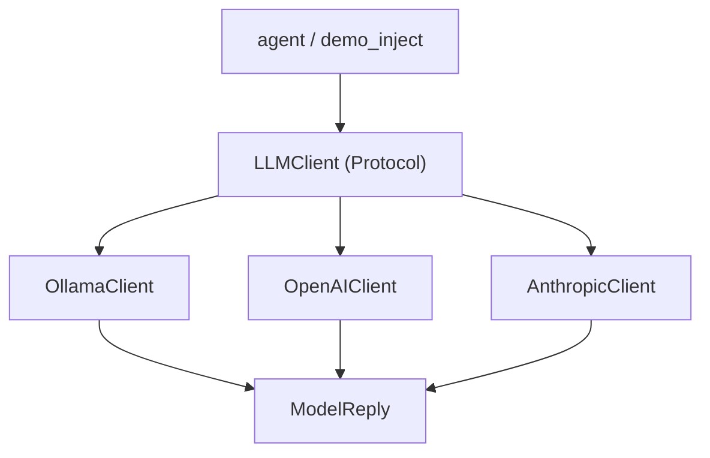

# Lab 1 — The `LLMClient` Protocol and Pluggable Providers

**Time: ~3.5 hrs · Difficulty: Core · Builds on: Month 6 agent (`call_model`), Month 5 `Protocol`/DI**

## Objective

You will define a single `LLMClient` interface as a Python `Protocol`, normalize the divergent shapes of three model providers — Ollama, OpenAI, and Anthropic — into one `ModelReply` type, and put all three behind that one interface. By the end, your code can hold "an `LLMClient`" without knowing or caring which provider it is, and a `pytest` will prove each provider conforms. This is the foundation the rest of the month builds on: the seam in Month 6's `call_model()` (the `if PROVIDER == "ollama"` branch) becomes a clean polymorphic boundary. The agent loop will depend on the interface, never on a concrete provider — the literal embodiment of "open to extension, closed to modification."

## Setup

```zsh
mkdir -p ~/agentic/month-07 && cd ~/agentic/month-07
uv init --bare 2>/dev/null; uv add requests; uv add --dev pytest
uv add python-dotenv anthropic 2>/dev/null   # anthropic optional (paid path only)
ollama serve >/dev/null 2>&1 &               # ensure the local model server is up
ollama list                                  # confirm qwen2.5:7b is present
mkdir -p llm tests
cp ~/agentic/month-06/agent.py ./agent_m6_reference.py 2>/dev/null || true  # keep the "before" for comparison
```

**Checkpoint:** `curl -s http://localhost:11434/v1/models | head -c 80` returns JSON (Ollama's OpenAI-compatible endpoint is live). If you keep a paid path, add `ANTHROPIC_API_KEY=...` to a `.env` file in this folder. Never commit `.env`.

## Background

**Recall first (from memory):** In Month 6, what did `call_model()` have to know about each provider, and what made adding a provider painful? In Month 5, what did a `Protocol` let a class do without inheriting? Answer both before reading on.


*Notice: three different APIs, one interface, one return type. Each provider's job is to translate its native shape into the same `ModelReply` — the caller never sees the differences.*

Month 6's `call_model()` worked, but it branched on a provider string and had Ollama's and Anthropic's JSON shapes interleaved inside one function. That function had two reasons to change (one per provider) and would grow a reason for each provider you ever add — a textbook Open/Closed violation. This lab refactors that into the shape the whole month depends on. Re-read README §1–§3 before you start: interface vs. implementation, why `Protocol` (structural) fits an extension boundary, and the "normalize to one reply type" discipline that keeps each provider's quirks sealed inside its own module.

## Steps

### 1. Define the interface and the shared reply type

Create `llm/base.py`. This file contains *no* provider logic — only the contract every provider must satisfy and the type they all return.

```python
# llm/base.py
from __future__ import annotations
from dataclasses import dataclass, field
from typing import Protocol, runtime_checkable

@dataclass
class ModelReply:
    """The one normalized shape every provider returns."""
    text: str
    tool_calls: list[dict] = field(default_factory=list)  # [{id, name, arguments(str JSON)}]
    tokens_in: int = 0
    tokens_out: int = 0

@runtime_checkable
class LLMClient(Protocol):
    """The single interface the agent depends on. Providers conform structurally."""
    name: str
    def complete(self, messages: list[dict], tools: list[dict]) -> ModelReply:
        """Send messages + tool schemas; return a normalized ModelReply."""
        ...
```

**Checkpoint:** `uv run python -c "from llm.base import LLMClient, ModelReply; print('ok')"` prints `ok`. Note that `LLMClient` is a `Protocol` — you will never instantiate it; it is a *shape*, not a class to subclass.
**If not:** a `ModuleNotFoundError: llm` means you're not running from `~/agentic/month-07` (the package dir) or `llm/__init__.py` is missing — `touch llm/__init__.py`. An `ImportError` for `Protocol`/`runtime_checkable` means you're on Python < 3.8; run via `uv run` with `uv python install 3.12`.

> The new skill of this lab is **writing a provider that normalizes its native shape into `ModelReply`**. Steps 2–4 teach it as gradual release: study a fully worked one (Ollama), fill in a faded one (OpenAI), then write one from scratch (Anthropic).

### 2. Stage 1 — Worked example (I do): the Ollama provider (the free default)

Create `llm/providers.py`. Type this in and run it, but read every line first — this is the model you'll imitate. The provider's single responsibility (SRP) is translation: native JSON in, `ModelReply` out. Nothing else in your system should ever touch Ollama's field names. The four annotated moves are: (a) POST to the OpenAI-compatible endpoint; (b) raise on HTTP errors; (c) reach into *this provider's* JSON shape (`choices[0].message`); (d) flatten its `tool_calls` and `usage` into the normalized `ModelReply`.

```python
# llm/providers.py
from __future__ import annotations
import os
import requests
from .base import ModelReply

class OllamaClient:
    name = "ollama"
    def __init__(self, model: str = "qwen2.5:7b",
                 base_url: str = "http://localhost:11434") -> None:
        self.model, self.base_url = model, base_url

    def complete(self, messages: list[dict], tools: list[dict]) -> ModelReply:
        r = requests.post(f"{self.base_url}/v1/chat/completions",
                          json={"model": self.model, "messages": messages,
                                "tools": tools, "temperature": 0}, timeout=180)
        r.raise_for_status()
        data = r.json()
        m = data["choices"][0]["message"]
        u = data.get("usage", {})
        calls = [{"id": c.get("id", c["function"]["name"]),
                  "name": c["function"]["name"],
                  "arguments": c["function"]["arguments"]}
                 for c in (m.get("tool_calls") or [])]
        return ModelReply(text=m.get("content") or "", tool_calls=calls,
                          tokens_in=u.get("prompt_tokens", 0),
                          tokens_out=u.get("completion_tokens", 0))
```

**Checkpoint:**

```zsh
uv run python -c "
from llm.providers import OllamaClient
c = OllamaClient()
reply = c.complete([{'role':'user','content':'Reply with exactly: pong'}], tools=[])
print(repr(reply.text), 'in=', reply.tokens_in, 'out=', reply.tokens_out)"
```

You should see something like `'pong'` (or close) and nonzero token counts. You just called a model *through a provider object* — no provider string, no branch.

**If not:** a `ConnectionError` means Ollama isn't running — `ollama serve &` then `ollama list` (see Troubleshooting). A `KeyError` on `choices`/`usage` means the response shape differs; the worked code uses `data.get("usage", {})` and `.get(..., 0)` defensively — copy those exactly.

### 3. Stage 2 — Faded practice (we do): the OpenAI provider (OpenAI-compatible shape)

OpenAI's Chat Completions API uses the *same* envelope Ollama exposes (Ollama deliberately mimics it), so this provider is almost identical — which is the point: the differences that *do* exist (URL, auth header) are confined here. Here is the **skeleton with the mechanical normalization left for you** — fill the three TODOs by copying the pattern from Stage 1. The scaffolding (class, signature, request) is given; you supply the parsing.

```python
# add to llm/providers.py — fill the TODOs (compare against Stage 1's Ollama parsing)
class OpenAIClient:
    name = "openai"
    def __init__(self, model: str = "gpt-4o-mini",
                 api_key_env: str = "OPENAI_API_KEY",
                 base_url: str = "https://api.openai.com") -> None:
        self.model, self.base_url = model, base_url
        self.api_key = os.environ.get(api_key_env, "")

    def complete(self, messages: list[dict], tools: list[dict]) -> ModelReply:
        r = requests.post(f"{self.base_url}/v1/chat/completions",
                          headers={"Authorization": f"Bearer {self.api_key}"},
                          json={"model": self.model, "messages": messages,
                                "tools": tools, "temperature": 0}, timeout=180)
        r.raise_for_status()
        data = r.json()
        m = data["choices"][0]["message"]; u = data.get("usage", {})
        # TODO 1: build `calls` from m["tool_calls"] -> [{id, name, arguments}] (same as Ollama)
        # TODO 2: pull text from m.get("content")
        # TODO 3: return a ModelReply with tokens_in/out from u (prompt_tokens / completion_tokens)
        ...
```

<details><summary>Check your fill-in</summary>

```python
        calls = [{"id": c["id"], "name": c["function"]["name"],
                  "arguments": c["function"]["arguments"]}
                 for c in (m.get("tool_calls") or [])]
        return ModelReply(text=m.get("content") or "", tool_calls=calls,
                          tokens_in=u.get("prompt_tokens", 0),
                          tokens_out=u.get("completion_tokens", 0))
```
</details>

This is *also* exactly how an **OpenRouter** provider looks — OpenRouter is OpenAI-compatible at `https://openrouter.ai/api`. You will add OpenRouter as a one-line subclass in Lab 3's fallback chain; for now, note that OpenAI-compatibility means three of your four providers share this shape.

**Checkpoint:** the class imports cleanly: `uv run python -c "from llm.providers import OpenAIClient; print(OpenAIClient.name)"` prints `openai`. (Calling it requires a key and costs money — that's the paid path; skip the live call to stay at $0.)
**If not:** an `IndentationError` or `SyntaxError` usually means a stray `...` left in place of your filled-in body, or the `return` not indented inside `complete`. Compare against the Stage 1 Ollama body — the parsing lines are identical.

### 4. Stage 3 — Independent (you do): the Anthropic provider (the genuinely different shape)

This one is on you. Anthropic's shape is *genuinely* different, so there is no Stage-1 template to copy line-for-line — you apply the same discipline (native shape in, `ModelReply` out) to a new shape. Your goal and definition of done: a class `AnthropicClient` with `name = "anthropic"` whose `complete` (a) lifts the `system` message to a top-level field, (b) maps your tool schemas to Anthropic's `{name, description, input_schema}` shape, (c) reads `content` blocks (`type == "text"` vs `type == "tool_use"`), and (d) normalizes `tool_use` blocks to `{id, name, arguments}` where `arguments` is a **JSON string** (use `json.dumps`), with tokens from `input_tokens`/`output_tokens`. Try it before opening the reference below.

Anthropic is where normalization earns its keep: it does **not** use `choices[0].message.tool_calls`. It returns top-level `content` blocks, some of type `text` and some of type `tool_use`, and it names tokens `input_tokens`/`output_tokens`. All of that ugliness gets translated here and *nowhere else*.

<details><summary>Reference solution (open after attempting) — add to <code>llm/providers.py</code></summary>

```python
# add to llm/providers.py
import json

class AnthropicClient:
    name = "anthropic"
    def __init__(self, model: str = "claude-haiku-4-5",
                 api_key_env: str = "ANTHROPIC_API_KEY") -> None:
        self.model = model
        self.api_key = os.environ.get(api_key_env, "")

    def complete(self, messages: list[dict], tools: list[dict]) -> ModelReply:
        # Anthropic wants the system prompt as a top-level field and its own tool schema shape.
        system = "".join(m["content"] for m in messages if m["role"] == "system")
        convo = [m for m in messages if m["role"] != "system"]
        atools = [{"name": t["function"]["name"],
                   "description": t["function"].get("description", ""),
                   "input_schema": t["function"]["parameters"]} for t in tools]
        r = requests.post("https://api.anthropic.com/v1/messages",
                          headers={"x-api-key": self.api_key,
                                   "anthropic-version": "2023-06-01",
                                   "content-type": "application/json"},
                          json={"model": self.model, "system": system,
                                "messages": convo, "tools": atools,
                                "max_tokens": 2048, "temperature": 0}, timeout=180)
        r.raise_for_status()
        data = r.json()
        text = "".join(b["text"] for b in data["content"] if b["type"] == "text")
        calls = [{"id": b["id"], "name": b["name"],
                  "arguments": json.dumps(b["input"])}      # normalize to a JSON STRING like the others
                 for b in data["content"] if b["type"] == "tool_use"]
        u = data.get("usage", {})
        return ModelReply(text=text, tool_calls=calls,
                          tokens_in=u.get("input_tokens", 0),
                          tokens_out=u.get("output_tokens", 0))
```
</details>

**Checkpoint:** `uv run python -c "from llm.providers import AnthropicClient; print(AnthropicClient.name)"` prints `anthropic`. Notice that despite the wildly different request and response shapes, this `complete` returns the *exact same `ModelReply`* as Ollama's — `tool_calls` is a list of `{id, name, arguments}` where `arguments` is a JSON string, every time. That uniformity is what lets the agent stay ignorant of the provider. (Live calls require a key and cost money; the optional paid path is below.)
**If not:** an `ImportError` for `json` means you dropped the `import json` at the top of the block. If your version returns `arguments` as a dict rather than a string, wrap it in `json.dumps(...)` — the other providers return a JSON *string*, and the agent loop in Lab 3 will `json.loads` it, so the types must match.

### 5. Prove conformance with a test

This is the safety net that makes the `Protocol` worth having. Create `tests/test_conformance.py`:

```python
# tests/test_conformance.py
from llm.base import LLMClient, ModelReply
from llm.providers import OllamaClient, OpenAIClient, AnthropicClient

def test_all_providers_conform_structurally():
    # runtime_checkable Protocol: each provider IS an LLMClient by shape, no inheritance.
    for cls in (OllamaClient, OpenAIClient, AnthropicClient):
        client = cls.__new__(cls)            # don't run __init__ (no network/keys needed)
        assert isinstance(client, LLMClient), f"{cls.__name__} does not conform"
        assert hasattr(client, "name") and callable(getattr(client, "complete"))

def test_modelreply_is_uniform():
    r = ModelReply(text="hi")
    assert r.tool_calls == [] and r.tokens_in == 0  # sane defaults; every provider returns this type
```

**Checkpoint:**

```zsh
uv run pytest -q tests/test_conformance.py
```

You should see `2 passed`. The test never touches the network: it proves *shape* conformance. If you later write a provider that forgets the `name` attribute or misspells `complete`, this test goes red.
**If not:** a failed `isinstance` assertion means a provider misspelled `complete` or lacks `name` — fix the method name. A `TypeError: Protocols with non-method members...` is a version quirk; the test uses `cls.__new__` and a separate `hasattr(..., "name")` to sidestep it (see Troubleshooting). A collection error usually means you ran from the wrong directory — run from `~/agentic/month-07`.

### 6. Inject a provider into the agent — no branch anywhere

Now show the payoff. Write a tiny harness that takes *any* `LLMClient` and uses it, with zero knowledge of which one it got. Create `demo_inject.py`:

```python
# demo_inject.py
from llm.base import LLMClient
from llm.providers import OllamaClient, OpenAIClient, AnthropicClient

def ask(client: LLMClient, question: str) -> str:    # depends on the INTERFACE, not a provider
    reply = client.complete([{"role": "user", "content": question}], tools=[])
    print(f"[{client.name}] in={reply.tokens_in} out={reply.tokens_out}")
    return reply.text

if __name__ == "__main__":
    client: LLMClient = OllamaClient()        # the ONLY line that names a concrete provider
    print(ask(client, "Name one benefit of the Open/Closed Principle in one sentence."))
```

**Checkpoint:** `uv run python demo_inject.py` prints a one-line answer and an `[ollama] in=… out=…` line. Now change the single annotated line to `OpenAIClient()` or `AnthropicClient()` (with keys set) — `ask()` does not change at all. That is dependency injection through an interface: the policy (`ask`) and the detail (the provider) meet only at the `LLMClient` abstraction. In Lab 2 that one remaining `OllamaClient()` line moves into a config-driven registry, and then *nothing* in your code will name a provider.
**If not:** if `ask()` had to change when you swapped the provider, something provider-specific leaked into it — `ask` must only call `client.complete(...)` and `client.name`. A `ConnectionError` again means Ollama isn't up (`ollama serve &`).

## Definition of Done

- [ ] `llm/base.py` defines `LLMClient` as a `@runtime_checkable Protocol` and `ModelReply` as a dataclass — and contains no provider-specific logic.
- [ ] `llm/providers.py` implements `OllamaClient`, `OpenAIClient`, and `AnthropicClient`, each normalizing its native shape to `ModelReply`.
- [ ] The Ollama provider makes a real call for **$0** and returns a populated `ModelReply` (you ran step 2).
- [ ] `tests/test_conformance.py` passes, proving all three providers structurally conform to `LLMClient`.
- [ ] `demo_inject.py` uses a provider purely through the `LLMClient` type; swapping the provider is a one-line change and `ask()` is untouched.

Self-verify:

```zsh
uv run pytest -q tests/test_conformance.py && echo "conformance OK"
# Prove no provider-specific branching leaked into the interface or the injection harness:
! grep -Eq 'if .*provider ==|isinstance\(.*(Ollama|OpenAI|Anthropic)' llm/base.py demo_inject.py \
  && echo "no provider branches in interface/harness OK"
uv run python demo_inject.py >/dev/null && echo "ollama call (\$0) OK"
```

**Self-explain:** in one sentence, why can `ask()` call three completely different model APIs without a single `if`? (Hint: what do all three providers return, and what does `ask` actually depend on?)

## Stretch Goals

1. **OpenRouter in two lines.** Add `class OpenRouterClient(OpenAIClient)` overriding only `name` and `base_url` (`https://openrouter.ai/api`). Note how OpenAI-compatibility made a fourth provider nearly free.
2. **A fake provider for tests.** Write a `FakeClient(replies: list[ModelReply])` that returns canned replies without any network. You will lean on this in Lab 3 to test the fallback chain deterministically.
3. **Type-check it.** Add `uv add --dev mypy` and run `mypy llm/`. Confirm the type checker accepts your providers as `LLMClient` *without* any inheritance — structural typing verified statically.
4. **Cost on the reply.** Add a `cost_usd` computed field to `ModelReply` (or a method) using per-million prices, reusing Month 6's cost math, so every reply self-reports its dollar cost.

## Troubleshooting

- **`ConnectionError` to `localhost:11434`.** Ollama isn't running. `ollama serve &` then `ollama list`. The OpenAI-compatible path lives under `/v1/...`.
- **Ollama returns prose, not tool calls.** Expected here — step 2 passes `tools=[]`. Tool-calling is exercised in Lab 3. Use `qwen2.5:7b` for the best free tool support later.
- **`isinstance(client, LLMClient)` raises "Protocols with non-method members".** A `@runtime_checkable` Protocol can only runtime-check methods, not data attributes, on some versions. The test uses `cls.__new__` and checks `hasattr(..., "name")` separately to sidestep this; keep `complete` as the method the Protocol checks.
- **Anthropic `401`/`x-api-key` error.** Key missing or wrong. Confirm `.env` has `ANTHROPIC_API_KEY` and you loaded it (`from dotenv import load_dotenv; load_dotenv()`), or just stay on the free Ollama path — Anthropic is optional and paid.
- **`KeyError: 'usage'`.** Some endpoints omit usage on certain responses. The providers use `data.get("usage", {})` and `.get(..., 0)` so token counts default to zero rather than crashing — keep those defensive `.get`s.
- **`uv run` uses the wrong Python.** Confirm `uv python install 3.12` and that `tomllib`/`Protocol` import — both need 3.11+. Always invoke via `uv run`, never a bare system `python`.
