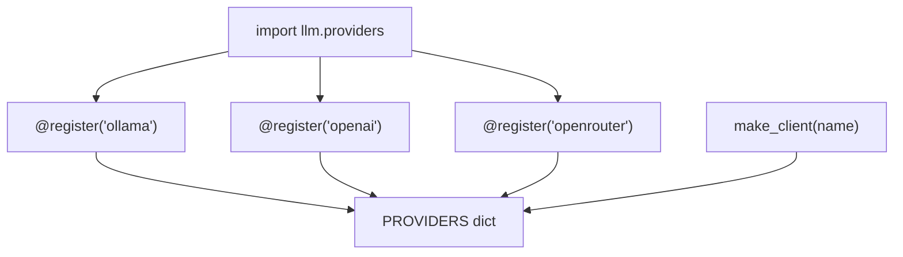

# Lab 2 — Registries, Strategy, and Prompt Versioning (Kill the Ladder)

**Time: ~4 hrs · Difficulty: Core · Builds on: Lab 1 (the `LLMClient` providers)**

## Objective

You will eliminate every selection branch and hardcoded constant from your code. First you build a **provider registry** so adding a provider is "write a class, decorate it" instead of "edit a factory's `if-elif`." Then you move all behavior into a **`config.toml`** that you validate into a typed object at startup — configuration as code. Then you build a decorator-based **tool registry** so new tools self-register without the agent loop ever changing, apply the **Strategy** pattern to make one behavior swappable from config, and set up **prompt versioning** so prompts are external, versioned artifacts. The single remaining `OllamaClient()` line from Lab 1 disappears: after this lab, *nothing in your source names a provider* — the config does. This is the Open/Closed Principle made concrete.

## Setup

```zsh
cd ~/agentic/month-07
mkdir -p prompts
ls llm/base.py llm/providers.py tests/   # Lab 1 artifacts must be present
ollama serve >/dev/null 2>&1 &
```

**Checkpoint:** `uv run pytest -q tests/test_conformance.py` still shows `2 passed` — Lab 1's foundation is intact before you build on it.
**If not:** if the test fails or can't collect, you're either not in `~/agentic/month-07` or Lab 1's `llm/` package is missing — re-do Lab 1's steps 1–5 before continuing; this lab assumes them.

## Background

**Recall first (from memory):** From Lab 1, name the one line in `demo_inject.py` that still names a concrete provider. From the README, why is a `make_client` full of `if provider == ...` branches a violation of the Open/Closed Principle? Answer both before starting — this lab makes that last hardcoded line disappear.


*Notice: the decorators run at import and populate the dict; `make_client` only reads it. Adding a provider adds one arrow into the dict and never edits `make_client` — that is "open to extension, closed to modification."*

README §4–§7 are the reading for this lab: configuration as code, why the `if-elif`/`isinstance` ladder is an Open/Closed smell, the Registry pattern and decorator-registry idiom, the Strategy and Plugin patterns, and prompts as versioned artifacts. The throughline is *push decisions out of code and into data, and let new behavior register itself*. You will feel the difference at the end: adding a provider, a tool, or a prompt version will each require touching exactly one new place and zero existing tested code.

## Steps

> The new skill of this lab is the **decorator registry**: a `name -> thing` map that classes/functions add themselves to, so a selector *looks up* instead of *branching*. Step 1 is the worked example (study it), Step 1b is faded (you wire the decorators), Step 2 is independent (add a provider with zero edits to tested code). The same pattern then recurs for strategies (step 5) and tools (step 6) — once you own it here, those are repetitions.

### 1. Stage 1 — Worked example (I do): build the provider registry

The villain is the factory full of branches. The cure is a `name -> class` map that classes add themselves to. Read this in full before typing — the two moving parts are the `register` decorator (which *writes* into `PROVIDERS`) and `make_client` (which only *reads* it). Create `llm/registry.py`:

```python
# llm/registry.py
from __future__ import annotations
from .base import LLMClient

PROVIDERS: dict[str, type] = {}

def register(name: str):
    """Decorator: a provider class adds itself to the registry under `name`."""
    def deco(cls: type) -> type:
        if name in PROVIDERS:
            raise ValueError(f"provider '{name}' already registered")
        PROVIDERS[name] = cls
        return cls
    return deco

def make_client(provider: str, **kwargs) -> LLMClient:
    """Look up, don't branch. Open to extension, closed to modification."""
    try:
        cls = PROVIDERS[provider]
    except KeyError:
        raise ValueError(f"unknown provider '{provider}'. Known: {sorted(PROVIDERS)}")
    return cls(**kwargs)
```

#### Stage 2 — Faded practice (we do): wire the decorators yourself

The decorator is written; now *you* attach it to your three Lab 1 providers. In `llm/providers.py`, add the import at the top, then put the right `@register("...")` line above each class. The behavior you're aiming for: importing `llm.providers` populates `PROVIDERS` with all three names. Fill it in before checking.

```python
# at the top of llm/providers.py
from .registry import register

# then decorate each class you wrote in Lab 1 — what string goes in each @register(...)?
# @register("____")
class OllamaClient: ...        # (existing body unchanged)
# @register("____")
class OpenAIClient: ...        # (existing body unchanged)
# @register("____")
class AnthropicClient: ...     # (existing body unchanged)
```

<details><summary>Check your wiring</summary>

```python
@register("ollama")
class OllamaClient: ...        # (existing body unchanged)

@register("openai")
class OpenAIClient: ...        # (existing body unchanged)

@register("anthropic")
class AnthropicClient: ...     # (existing body unchanged)
```
Each registry name should match the class's own `name` attribute — that's the string the config will use to select it.
</details>

**Checkpoint:**

```zsh
uv run python -c "
import llm.providers          # importing the module runs the decorators -> populates the registry
from llm.registry import PROVIDERS, make_client
print('registered:', sorted(PROVIDERS))
c = make_client('ollama'); print('made:', c.name)"
```

You should see `registered: ['anthropic', 'ollama', 'openai']` and `made: ollama`. Notice `make_client` has **no branches** — and to add a provider you never touch it. Try `make_client('nope')` and confirm it raises a clear `unknown provider 'nope'. Known: [...]`.
**If not:** an empty/short `registered` list means the decorators didn't run — confirm `import llm.providers` happens *before* you read `PROVIDERS`, and that each class actually has its `@register("...")` line. A `provider '...' already registered` error means you imported the module twice or double-decorated a class (see Troubleshooting).

### 2. Stage 3 — Independent (you do): prove the registry is open to extension

Now the payoff, with no template: add a *fourth* provider **without editing `make_client` or any existing class**. Your goal — a working `openrouter` provider registered alongside the others, achieved by adding *only* new code. Since OpenRouter is OpenAI-compatible, the shortest path is to subclass `OpenAIClient` and override `name` and the base URL (`https://openrouter.ai/api`). Write it yourself, then compare:

<details><summary>Reference solution — append to <code>llm/providers.py</code></summary>

```python
# OpenRouter is OpenAI-compatible, so subclass and override two things
@register("openrouter")
class OpenRouterClient(OpenAIClient):
    name = "openrouter"
    def __init__(self, model: str = "meta-llama/llama-3.1-8b-instruct:free",
                 api_key_env: str = "OPENROUTER_API_KEY") -> None:
        super().__init__(model=model, api_key_env=api_key_env,
                         base_url="https://openrouter.ai/api")
```
</details>

**Checkpoint:** re-run the registry print from step 1; `openrouter` now appears in the registered list, and `make_client` was never opened. That is the whole point: tested code stayed tested. Write this down — it is the Open/Closed Principle you'll be asked to articulate in the assessment.
**If not:** if `openrouter` doesn't appear, the new class wasn't imported (it lives in `llm/providers.py`, which step 1 already imports). If you found yourself editing `make_client` to make it work, stop — that means the registry lookup isn't being used; the only new code should be the decorated class.

### 3. Move every choice into `config.toml`

Create `config.toml`. Behavior — provider, model, fallback order, strategy, prompt version — lives here, not in source. Secrets are referenced by env-var *name*, never stored.

```toml
# config.toml
[primary]
provider    = "ollama"
model       = "qwen2.5:7b"
base_url    = "http://localhost:11434"

# Fallback chain (Lab 3 uses this). Ordered, tried top to bottom; ollama is the free safety net.
[[fallback]]
provider    = "openrouter"
model       = "meta-llama/llama-3.1-8b-instruct:free"
api_key_env = "OPENROUTER_API_KEY"

[[fallback]]
provider    = "ollama"
model       = "qwen2.5:7b"
base_url    = "http://localhost:11434"

[strategy]
output_format = "plain"        # swappable Strategy (step 5): "plain" | "verbose"

[prompts]
agent_system  = "v2"           # which versioned prompt file to load (step 6)
```

Now validate it into a typed object at startup so a typo fails loudly, not mid-run. Create `config.py`:

```python
# config.py
from __future__ import annotations
import tomllib
from dataclasses import dataclass, field

@dataclass
class ProviderCfg:
    provider: str
    model: str
    base_url: str | None = None
    api_key_env: str | None = None

@dataclass
class Config:
    primary: ProviderCfg
    fallback: list[ProviderCfg] = field(default_factory=list)
    output_format: str = "plain"
    agent_system_prompt: str = "v1"

def load_config(path: str = "config.toml") -> Config:
    with open(path, "rb") as f:
        raw = tomllib.load(f)
    try:
        primary = ProviderCfg(**raw["primary"])
        fallback = [ProviderCfg(**f) for f in raw.get("fallback", [])]
    except (KeyError, TypeError) as e:
        raise ValueError(f"invalid config.toml: {e}") from e   # fail LOUDLY at startup
    return Config(primary=primary, fallback=fallback,
                  output_format=raw.get("strategy", {}).get("output_format", "plain"),
                  agent_system_prompt=raw.get("prompts", {}).get("agent_system", "v1"))
```

**Checkpoint:**

```zsh
uv run python -c "from config import load_config; c = load_config(); print(c.primary, '| fallbacks:', len(c.fallback))"
```

You should see the primary `ProviderCfg(provider='ollama', model='qwen2.5:7b', ...)` and `fallbacks: 2`. Now break it on purpose: change `provider` to `provder` under `[primary]` and re-run — you should get a clear `invalid config.toml: ...` instead of a mysterious crash later. Fix it back. **Validating at startup is the difference between a typo costing you a second and costing you a confusing mid-run failure.**
**If not:** if the typo *doesn't* fail loudly, your `load_config` isn't wrapping the dataclass construction in `try/except (KeyError, TypeError)` — a bare `tomllib.load` returns `Any` and defers the error. A `FileNotFoundError` means you're not in `~/agentic/month-07` or `config.toml` wasn't created.

### 4. Wire config + registry: select a provider with zero branches

Combine the two. Create `build.py`:

```python
# build.py
from config import load_config, ProviderCfg
from llm.registry import make_client
from llm.base import LLMClient
import llm.providers   # noqa: F401  -- import registers all providers

def client_from(cfg: ProviderCfg) -> LLMClient:
    kw = {"model": cfg.model}
    if cfg.base_url:    kw["base_url"] = cfg.base_url
    if cfg.api_key_env: kw["api_key_env"] = cfg.api_key_env
    return make_client(cfg.provider, **kw)     # string from config -> registry lookup. No branch.

if __name__ == "__main__":
    cfg = load_config()
    primary = client_from(cfg.primary)
    print(f"primary provider from config: {primary.name} ({cfg.primary.model})")
```

**Checkpoint:** `uv run python build.py` prints `primary provider from config: ollama (qwen2.5:7b)`. Now edit *only* `config.toml` — set `[primary]` `provider = "openrouter"` — and re-run: it prints `openrouter` with **no source change**. This is the ten-minute model swap the milestone requires, in miniature. Set it back to `ollama` to stay at $0.
**If not:** an `unknown provider` error means `import llm.providers` is missing from `build.py` (no import = empty registry). A `TypeError` on `make_client(**kw)` means you passed a kwarg the provider's `__init__` doesn't accept — the `client_from` helper only forwards `base_url`/`api_key_env` when present, so keep those guards.

### 5. Apply the Strategy pattern

A Strategy is a swappable algorithm chosen at runtime. Make output formatting a strategy selected by config. Create `strategies.py`:

```python
# strategies.py
from typing import Callable

FORMATTERS: dict[str, Callable[[str], str]] = {}

def formatter(name: str):
    def deco(fn): FORMATTERS[name] = fn; return fn
    return deco

@formatter("plain")
def _plain(text: str) -> str:
    return text

@formatter("verbose")
def _verbose(text: str) -> str:
    return f"=== model said ===\n{text}\n=================="

def get_formatter(name: str) -> Callable[[str], str]:
    return FORMATTERS.get(name, FORMATTERS["plain"])   # graceful default
```

**Checkpoint:**

```zsh
uv run python -c "
from config import load_config
from strategies import get_formatter
fmt = get_formatter(load_config().output_format)
print(fmt('hello'))"
```

With `output_format = "plain"` you get `hello`; flip it to `"verbose"` in `config.toml` and you get the boxed version — behavior changed by data, not code. This is the same registry idea as providers, applied to an algorithm: the *fallback policy itself* in Lab 3 will be a strategy too.
**If not:** if flipping the config does nothing, you're reading a stale `output_format` — confirm `load_config()` is re-called after the edit (it reads the file fresh each run). A `KeyError` from `get_formatter` shouldn't happen because of the `.get(name, FORMATTERS["plain"])` fallback; if it does, you removed that default.

### 6. The tool registry: tools self-register

This is the Plugin pattern at the tool level. A `@tool` decorator registers both the function and its schema, so the agent loop never edits to gain a tool. Create `tools.py` (reusing your Month 6 jail):

```python
# tools.py
from __future__ import annotations
from pathlib import Path
from typing import Callable

ROOT = Path("./sandbox").resolve()
TOOLS: dict[str, Callable] = {}
SCHEMAS: list[dict] = []

def tool(schema: dict):
    """Register a tool function AND its schema. New tools drop in with zero core edits."""
    def deco(fn: Callable) -> Callable:
        TOOLS[schema["function"]["name"]] = fn
        SCHEMAS.append(schema)
        return fn
    return deco

def _safe_path(candidate: str) -> Path:
    p = (ROOT / candidate).resolve()
    if not p.is_relative_to(ROOT):
        raise ValueError(f"path '{candidate}' escapes the jail {ROOT}")
    return p

@tool({"type": "function", "function": {
    "name": "read_file", "description": "Read a UTF-8 text file inside the working dir.",
    "parameters": {"type": "object", "properties": {"path": {"type": "string"}},
                   "required": ["path"]}}})
def read_file(path: str) -> str:
    return _safe_path(path).read_text(encoding="utf-8", errors="replace")[:8000]

@tool({"type": "function", "function": {
    "name": "write_file", "description": "Write (overwrite) a text file inside the working dir.",
    "parameters": {"type": "object",
                   "properties": {"path": {"type": "string"}, "content": {"type": "string"}},
                   "required": ["path", "content"]}}})
def write_file(path: str, content: str) -> str:
    p = _safe_path(path); p.parent.mkdir(parents=True, exist_ok=True)
    p.write_text(content, encoding="utf-8")
    return f"wrote {len(content)} bytes to {path}"
```

Now add a *third* tool to prove the registry is open: append a `list_files` tool to `tools.py` with another `@tool` decorator — and confirm you never touched `TOOLS`, `SCHEMAS`, or any dispatch code.

```python
# add to tools.py — a new tool, registered with ZERO edits to the registry machinery
@tool({"type": "function", "function": {
    "name": "list_files", "description": "List files in the working dir.",
    "parameters": {"type": "object", "properties": {}, "required": []}}})
def list_files() -> str:
    return "\n".join(sorted(p.name for p in ROOT.iterdir())) or "(empty)"
```

**Checkpoint:**

```zsh
uv run python -c "
import tools
print('tools:', sorted(tools.TOOLS))
print('schemas advertised:', len(tools.SCHEMAS))"
```

You should see `tools: ['list_files', 'read_file', 'write_file']` and `schemas advertised: 3`. The `list_files` tool appeared in both the dispatch map and the advertised schema list *without you editing either*. In Lab 3 the agent loop will dispatch with `tools.TOOLS[name](**args)` and advertise `tools.SCHEMAS` — and you'll be able to add tools forever without reopening the loop.
**If not:** if `list_files` is missing, the function wasn't *defined* at import time (self-registration only fires when the decorated function is defined) — confirm it's in `tools.py` and you imported `tools`. An `is_relative_to` AttributeError means a stray system Python; run via `uv run` (see Troubleshooting).

### 7. Version your prompts as artifacts

Stop burying the system prompt as an inline string. Put it on disk with version IDs. Create two files:

```zsh
cat > prompts/agent_system.v1.md <<'EOF'
You are a coding agent operating inside a single working directory. Use the provided
tools to read and write files and run allow-listed shell commands. Work step by step.
When the task is complete, reply with a final message beginning "DONE:" and no tool call.
EOF

cat > prompts/agent_system.v2.md <<'EOF'
You are a coding agent operating inside a single working directory. Use the provided
tools to read and write files and run allow-listed shell commands. Work step by step.
Verify your work before finishing: only reply "DONE:" AFTER you have confirmed the result
(e.g., a successful git commit). Never claim done on an unverified step.
EOF
```

Add a loader. Append to `config.py`:

```python
# add to config.py
from pathlib import Path
def load_prompt(name: str, version: str) -> str:
    """Load a versioned prompt artifact, e.g. load_prompt('agent_system', 'v2')."""
    path = Path("prompts") / f"{name}.{version}.md"
    if not path.exists():
        raise ValueError(f"no prompt '{name}' version '{version}' at {path}")
    return path.read_text(encoding="utf-8").strip()
```

**Checkpoint:**

```zsh
uv run python -c "
from config import load_config, load_prompt
c = load_config()
print('active version:', c.agent_system_prompt)
print(load_prompt('agent_system', c.agent_system_prompt)[:60], '...')"
```

It prints `active version: v2` and the first line of the v2 prompt. Switch `agent_system = "v1"` in `config.toml` and re-run — different prompt, no code change, and (in Lab 3) the version gets written into the trace so every run is attributable to an exact prompt. **A reworded prompt is a behavior change; version it like one.**
**If not:** a `no prompt 'agent_system' version 'v2'` error means the file name doesn't match the `{name}.{version}.md` pattern — check it's literally `prompts/agent_system.v2.md`. If the wrong version loads, you edited `config.toml` but `load_config()` cached an old value; each run reads the file fresh, so re-run the command.

## Definition of Done

- [ ] `llm/registry.py` provides a `@register` decorator and a branch-free `make_client`; all four providers (`ollama`, `openai`, `anthropic`, `openrouter`) self-register on import.
- [ ] A fourth provider was added by decorating a new class — `make_client` was never edited (Open/Closed demonstrated).
- [ ] `config.toml` holds provider, model, fallback chain, strategy, and prompt version; **no secrets** are in it (env-var names only).
- [ ] `config.py` validates the config into a typed `Config` at startup and fails loudly on a malformed file (you tested the `provder` typo).
- [ ] `build.py` selects the provider purely from config through the registry — swapping the model is a config-only edit (demonstrated).
- [ ] `strategies.py` makes output formatting a config-selected Strategy.
- [ ] `tools.py` has a `@tool` registry; a third tool was added without editing `TOOLS`, `SCHEMAS`, or dispatch.
- [ ] `prompts/` holds at least two versioned prompt files and `load_prompt` selects by config.

Self-verify:

```zsh
# Registry is branch-free and tools self-register:
! grep -Eq 'if .*provider ==|elif .*provider ==' llm/registry.py build.py && echo "no selection ladder OK"
uv run python -c "import llm.providers; from llm.registry import PROVIDERS; assert len(PROVIDERS)>=4; print('providers OK', sorted(PROVIDERS))"
uv run python -c "import tools; assert len(tools.SCHEMAS)>=3; print('tool registry OK')"
test -f prompts/agent_system.v1.md && test -f prompts/agent_system.v2.md && echo "prompt versions OK"
```

**Self-explain:** in one sentence, why does adding a provider (or a tool, or a strategy) now require touching exactly one new place and zero existing tested code? (Hint: who writes into the registry, and who only reads it?)

## Stretch Goals

1. **Entry-point plugins.** Read the `importlib.metadata` entry-points spec and sketch how a *separate* package could contribute a provider via a `pyproject.toml` entry-point group (`llm.providers`) that your app discovers at runtime — no import in your source. Write a one-paragraph design note; you don't have to ship it.
2. **Strategy for retries.** Add a `retry_policy` strategy (e.g., `"none"`, `"backoff"`) selected from config, foreshadowing Lab 3's fallback policy-as-strategy.
3. **Config schema with pydantic.** Replace the dataclass validation with a `pydantic` model and observe the richer error messages on a malformed config.
4. **YAML variant.** Add a `config.yaml` equivalent (with `uv add pyyaml`) and a `load_config_yaml`, and note in a comment why the course defaults to TOML (stdlib `tomllib`, no implicit-typing footguns).
5. **Prompt eval hook.** Using Month 6's eval harness, score `agent_system.v1` vs `v2` on two fixed tasks and record which version won — turning prompt versioning into measured prompt selection.

## Troubleshooting

- **`provider 'ollama' already registered`.** You imported `llm.providers` twice in a way that re-ran the decorators, or decorated a class twice. Import the module once; the `register` guard is intentionally strict to catch double-registration.
- **`make_client` raises `unknown provider`.** You forgot to `import llm.providers` before calling `make_client` — the import is what runs the decorators that fill the registry. Importing the providers *package* is the discovery step.
- **`tomllib` not found.** You're on Python < 3.11. Run via `uv run` with `uv python install 3.12`. `tomllib` reads TOML; there is no stdlib TOML *writer*, which is why you author `config.toml` by hand.
- **Config typo doesn't fail loudly.** Ensure your `load_config` wraps construction in the `try/except (KeyError, TypeError)`. A bare `tomllib.load` returns `Any` and defers the error; the dataclass construction is what makes it fail at startup.
- **`is_relative_to` AttributeError in `tools.py`.** Needs Python 3.9+. You're on 3.12 via `uv run` — confirm you're not invoking a stray system `python`.
- **New tool doesn't appear.** Confirm the module defining it is imported before you read `TOOLS`/`SCHEMAS`. Self-registration only happens when the decorated function is *defined*, i.e., when its module is imported.
