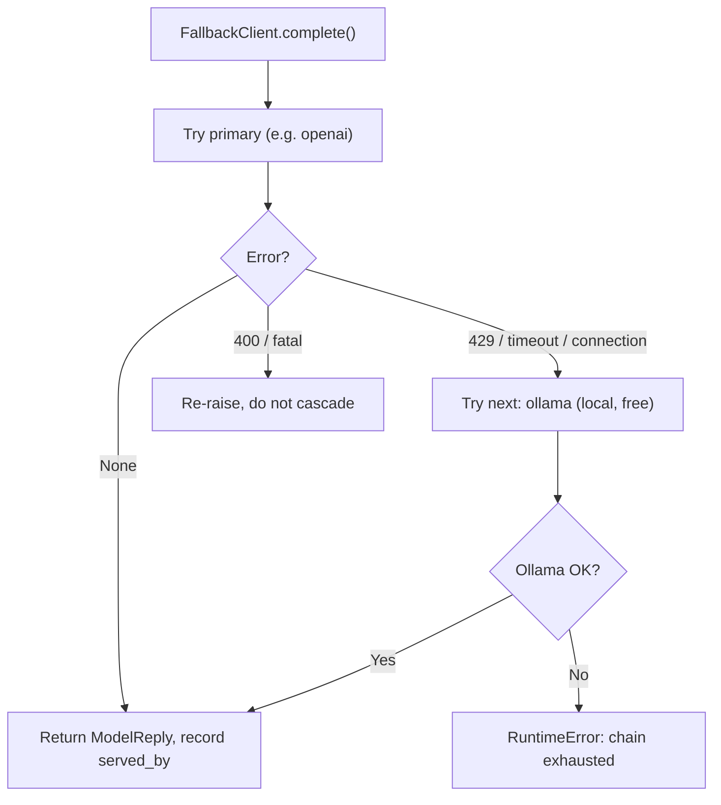

# Lab 3 — The Provider-Agnostic Core: Config-Driven Fallback and Graceful Failover (Milestone)

**Time: ~5 hrs · Difficulty: Core / Stretch · Builds on: Labs 1–2 and the Month 6 agent**

## Objective

This is the month's milestone. You will refactor your Month 6 agent so its **entire model layer is pluggable and config-driven** — four providers behind one `LLMClient` interface, selected by `config.toml`, with **zero changes to the agent loop** when you swap providers. You will add a **fallback chain** that tries providers in order and degrades gracefully on rate-limit/timeout/connection failures, terminating at local Ollama (always available, always free). You will add the **self-registering tool registry** from Lab 2 so new tools drop in without touching the core. Then you will **prove graceful failover**: run the agent on the primary provider, blackhole the primary by pointing its base URL at an unreachable host, run the *same* task again, and watch it cascade to Ollama and finish — for **$0**. Done means a model swap is a ten-minute config edit, and you have the recording to prove the system survives an outage.

## Setup

```zsh
cd ~/agentic/month-07
ls llm/ config.py config.toml strategies.py tools.py prompts/   # all Lab 1-2 artifacts present
ollama serve >/dev/null 2>&1 &
mkdir -p sandbox
printf 'def add(a, b):\n    return a + b\n' > sandbox/calc.py
printf 'def greet(name):\n    return f"hi {name}"\n' > sandbox/util.py
( cd sandbox && git init -q && git add -A && git commit -qm "seed" )
```

**Checkpoint:** `git -C sandbox log --oneline` shows the seed commit and `ls sandbox/*.py` lists two files. This folder is the agent's jail. Confirm Labs 1–2 still pass: `uv run pytest -q`.
**If not:** no commit means `git init` didn't run or there was nothing staged — re-run the Setup block. If `pytest` fails, a Lab 1–2 artifact is missing or broken; fix that first, because this lab assembles all of them.

## Background

**Recall first (from memory):** From Lab 1, what type does every provider's `complete()` return? From the README, which errors should make a fallback chain *cascade* to the next provider, and which should it *surface* without cascading? And in one line: what makes the Month 6 agent loop *stop*? Answer all three before starting.


*Notice: the chain only walks forward on retryable-elsewhere errors; a fatal 400 stops it. Because local Ollama is the last link, the blackholed-primary demo still finishes — for $0.*

You have all the parts: providers behind an interface (Lab 1), a registry + config + tool registry + versioned prompts (Lab 2). This lab assembles them into the refactored agent and adds the one genuinely new piece — the **fallback chain** (README §8). The chain is an ordered list of `LLMClient`s; you try each in turn, cascading only on *retryable-elsewhere* errors (429, timeout, connection refused) and surfacing everything else. Ollama goes last because it is local, free, and needs no network or quota — it is the safety net that makes the whole thing survive an outage at $0. Re-read README §8 on error classification before you start: cascading on a fatal 400 just burns the chain and hides your bug.

## Steps

> The new skill of this lab is the **fallback chain with correct error classification**. Step 1 is the worked example (the `FallbackClient`); Step 1b is faded (you finish one test case); Step 6 is the independent capstone (drive the live failover demo end-to-end).

### 1. Stage 1 — Worked example (I do): build the fallback chain

Create `llm/fallback.py`. It takes the ordered list of clients (built from config) and tries them until one succeeds. Read it closely — the load-bearing detail is the **error classification**: `RETRYABLE` + 429 continue down the chain; every other `HTTPError` re-raises. The `last_served_by` field is what the agent loop will write into the trace so the failover is provable after the fact.

```python
# llm/fallback.py
from __future__ import annotations
import logging
import requests
from .base import LLMClient, ModelReply

log = logging.getLogger("agent.fallback")

# Errors that mean "this provider can't serve me right now" -> try the next one.
RETRYABLE = (
    requests.exceptions.ConnectionError,   # blackholed / unreachable host
    requests.exceptions.Timeout,
)

def _is_rate_limit(exc: Exception) -> bool:
    r = getattr(exc, "response", None)
    return r is not None and r.status_code == 429

class FallbackClient:
    """An LLMClient that wraps an ordered chain and fails over gracefully."""
    name = "fallback-chain"
    def __init__(self, chain: list[LLMClient]) -> None:
        if not chain:
            raise ValueError("fallback chain is empty")
        self.chain = chain
        self.last_served_by: str | None = None     # recorded into the trace by the loop

    def complete(self, messages: list[dict], tools: list[dict]) -> ModelReply:
        last_exc: Exception | None = None
        for client in self.chain:                   # ordered: primary -> ... -> ollama
            try:
                reply = client.complete(messages, tools)
                self.last_served_by = client.name
                if last_exc is not None:
                    log.warning("recovered: %s served after failover", client.name)
                return reply
            except RETRYABLE as e:
                last_exc = e
                log.warning("provider %s unavailable (%s); falling over", client.name, type(e).__name__)
                continue
            except requests.exceptions.HTTPError as e:
                if _is_rate_limit(e):               # 429: retryable-elsewhere
                    last_exc = e
                    log.warning("provider %s rate-limited (429); falling over", client.name)
                    continue
                raise                                # 4xx/5xx that isn't 429: SURFACE, don't cascade
        raise RuntimeError(f"all providers exhausted; last error: {last_exc}") from last_exc
```

#### Stage 2 — Faded practice (we do): test the classification yourself

The chain logic is testable without any network using fake clients. The *cascade* test is given in full; the *fatal-error-surfaces* test is the one that catches the most common fallback bug, so you write its body. Create `tests/test_fallback.py` with the cascade test and the skeleton, then fill the TODO before checking.

```python
# tests/test_fallback.py — fill the TODO in the second test
import requests, pytest
from llm.base import ModelReply
from llm.fallback import FallbackClient

class Boom:                                  # a provider that always connection-fails
    name = "boom"
    def complete(self, messages, tools):
        raise requests.exceptions.ConnectionError("blackholed")

class Good:                                  # a provider that always succeeds
    name = "good"
    def complete(self, messages, tools):
        return ModelReply(text="ok from good")

def test_cascades_past_dead_provider_to_survivor():
    fc = FallbackClient([Boom(), Good()])
    reply = fc.complete([{"role": "user", "content": "hi"}], tools=[])
    assert reply.text == "ok from good"
    assert fc.last_served_by == "good"        # the survivor served it

def test_fatal_error_surfaces_not_cascades():
    class Fatal:
        name = "fatal"
        def complete(self, messages, tools):
            r = requests.Response(); r.status_code = 400
            raise requests.exceptions.HTTPError(response=r)
    # TODO: assert that FallbackClient([Fatal(), Good()]).complete([], []) RAISES HTTPError
    #       (a 400 must NOT fall over to Good). Use pytest.raises.
    ...
```

<details><summary>Check your fill-in</summary>

```python
    with pytest.raises(requests.exceptions.HTTPError):
        FallbackClient([Fatal(), Good()]).complete([], [])   # 400 must NOT fall over to Good
```
</details>

**Checkpoint:** the full reference test (both cases, for comparison):

<details><summary>Full <code>tests/test_fallback.py</code></summary>

```python
# tests/test_fallback.py
import requests, pytest
from llm.base import ModelReply
from llm.fallback import FallbackClient

class Boom:                                  # a provider that always connection-fails
    name = "boom"
    def complete(self, messages, tools):
        raise requests.exceptions.ConnectionError("blackholed")

class Good:                                  # a provider that always succeeds
    name = "good"
    def complete(self, messages, tools):
        return ModelReply(text="ok from good")

def test_cascades_past_dead_provider_to_survivor():
    fc = FallbackClient([Boom(), Good()])
    reply = fc.complete([{"role": "user", "content": "hi"}], tools=[])
    assert reply.text == "ok from good"
    assert fc.last_served_by == "good"        # the survivor served it

def test_fatal_error_surfaces_not_cascades():
    class Fatal:
        name = "fatal"
        def complete(self, messages, tools):
            r = requests.Response(); r.status_code = 400
            raise requests.exceptions.HTTPError(response=r)
    with pytest.raises(requests.exceptions.HTTPError):
        FallbackClient([Fatal(), Good()]).complete([], [])   # 400 must NOT fall over to Good
```
</details>

Run `uv run pytest -q tests/test_fallback.py` — `2 passed`. You've proven, deterministically, that the chain cascades on a dead provider but surfaces a fatal 400. That second test is the guardrail against the most common fallback bug.
**If not:** if `test_fatal_error_surfaces_not_cascades` *fails* (no exception raised), your `complete` is cascading on a non-429 `HTTPError` — only `RETRYABLE` and 429 may `continue`; every other `HTTPError` must `raise`. If `test_cascades...` fails on `last_served_by`, you didn't set `self.last_served_by = client.name` before returning the reply.

### 2. Build the chain from config

Add a builder that turns the config's primary + fallback list into a single `FallbackClient`. Append to `build.py` (from Lab 2):

```python
# add to build.py
from llm.fallback import FallbackClient

def build_chain(cfg) -> FallbackClient:
    """primary first, then each fallback, in order. The chain IS an LLMClient."""
    clients = [client_from(cfg.primary)] + [client_from(f) for f in cfg.fallback]
    return FallbackClient(clients)
```

**Checkpoint:**

```zsh
uv run python -c "
from config import load_config
from build import build_chain
chain = build_chain(load_config())
print('chain:', [c.name for c in chain.chain])"
```

You should see `chain: ['ollama', 'openrouter', 'ollama']` (primary ollama, then the two fallbacks from Lab 2's config). The chain is just a list of `LLMClient`s — and `FallbackClient` is *itself* an `LLMClient`, so the agent can hold it exactly as it held a single provider. That uniformity is why the agent loop won't need to know fallback exists.
**If not:** a short chain (e.g., only one name) means your `config.toml` lost its `[[fallback]]` entries — restore them from Lab 2 step 3. An `unknown provider` error means `import llm.providers` isn't running before `build_chain` (it's imported inside `build.py`; confirm that line survived).

### 3. Refactor the agent loop to depend only on the interface

Now the payoff. Create `agent.py` — the Month 6 loop, but every provider concern is gone. It takes any `LLMClient` (here, the fallback chain), advertises `tools.SCHEMAS`, dispatches via `tools.TOOLS`, loads the system prompt by version from config, and records the serving provider and prompt version in the trace.

```python
# agent.py — the Provider-Agnostic Core. No provider names. No if-elif. No isinstance ladder.
from __future__ import annotations
import json, logging, sys, time
from pathlib import Path
import tools                                   # importing registers all @tool functions
from config import load_config, load_prompt
from build import build_chain
from llm.base import LLMClient

logging.basicConfig(level=logging.WARNING, format="%(name)s %(levelname)s %(message)s")
MAX_STEPS = 12
TRACE = Path("trace.jsonl")

def _trace(event: str, **fields):
    with TRACE.open("a", encoding="utf-8") as f:
        f.write(json.dumps({"ts": time.time(), "event": event, **fields}) + "\n")

def run_agent(client: LLMClient, task: str, system: str, prompt_version: str) -> str:
    messages = [{"role": "system", "content": system},
                {"role": "user", "content": task}]
    _trace("start", task=task, prompt_version=prompt_version)

    for step in range(MAX_STEPS):
        reply = client.complete(messages, tools.SCHEMAS)      # interface call. No provider knowledge.
        served_by = getattr(client, "last_served_by", client.name)   # which provider actually served
        print(f"  [model:{served_by}] in={reply.tokens_in} out={reply.tokens_out}", file=sys.stderr)

        if not reply.tool_calls:                              # STOP: no tool call = done
            _trace("final", step=step, served_by=served_by, text=reply.text[:500])
            return reply.text

        messages.append({"role": "assistant", "content": reply.text,
                         "tool_calls": [{"id": c["id"], "type": "function",
                                         "function": {"name": c["name"], "arguments": c["arguments"]}}
                                        for c in reply.tool_calls]})
        for call in reply.tool_calls:
            name = call["name"]
            args = json.loads(call["arguments"])              # NEVER eval — parse as JSON
            print(f"  [tool] {name}({args})", file=sys.stderr)
            try:
                result = tools.TOOLS[name](**args)            # registry dispatch; no branch per tool
                ok = True
            except Exception as e:
                result, ok = f"ERROR: {e}", False
            _trace("tool_call", step=step, served_by=served_by, tool=name,
                   args=args, ok=ok, result_size=len(str(result)))
            messages.append({"role": "tool", "tool_call_id": call["id"],
                             "content": json.dumps(result)})
    _trace("aborted", reason="hit MAX_STEPS")
    return "ABORTED: hit step limit"

if __name__ == "__main__":
    cfg = load_config()
    client = build_chain(cfg)                                 # a FallbackClient, but typed as LLMClient
    system = load_prompt("agent_system", cfg.agent_system_prompt)
    TASK = ("List the .py files in the working directory, read each, then write SUMMARY.md "
            "with a one-paragraph summary of every .py file. Then run: git add -A and git commit "
            "-m 'summary'. Only reply DONE: after the commit succeeds.")
    print(run_agent(client, TASK, system, cfg.agent_system_prompt))
```

You need a `run_shell` tool for the commit step. Add it to `tools.py` (allow-listed, argument-list, jailed — straight from Month 6):

```python
# add to tools.py
import subprocess
ALLOWED_SHELL = {"ls", "cat", "git", "python", "wc", "grep"}

@tool({"type": "function", "function": {
    "name": "run_shell", "description": "Run one allow-listed command as a list of args, e.g. ['git','add','-A']. Allowed: ls, cat, git, python, wc, grep.",
    "parameters": {"type": "object",
        "properties": {"command": {"type": "array", "items": {"type": "string"}}},
        "required": ["command"]}}})
def run_shell(command: list[str]) -> str:
    if not command or command[0] not in ALLOWED_SHELL:
        raise ValueError(f"command '{command[:1]}' not allowed")
    proc = subprocess.run(command, cwd=ROOT, capture_output=True, text=True, timeout=30)
    return ((proc.stdout + proc.stderr).strip() or "(no output)")[:4000]
```

**Checkpoint:** grep proves the loop is provider-agnostic:

```zsh
! grep -Eq 'Ollama|Anthropic|OpenAI|if .*provider ==|isinstance' agent.py && echo "loop is provider-agnostic OK"
```

It should print `loop is provider-agnostic OK`. The agent loop names no provider and contains no selection branch — providers, tools, and prompts all arrive via injection, the registry, and config.
**If not:** if the grep finds a match (no "OK" printed), a provider name or an `if provider ==`/`isinstance` leaked into `agent.py` — that's an unfinished refactor. Move that knowledge out: providers come from `build_chain(cfg)`, tools from `tools.TOOLS`/`tools.SCHEMAS`, the prompt from `load_prompt(...)`. The loop should mention only `LLMClient`.

### 4. Happy-path run on the primary provider

```zsh
rm -f trace.jsonl
uv run python agent.py
```

**Checkpoint:** on stderr you see interleaved `[model:ollama] in/out` and `[tool] name(args)` lines, ending in a `DONE:` message. Then verify:

```zsh
cat sandbox/SUMMARY.md           # a paragraph per .py file
git -C sandbox log --oneline     # the agent's commit appears
grep -o '"served_by": "[a-z]*"' trace.jsonl | sort -u   # which provider served (should be ollama)
grep '"prompt_version"' trace.jsonl | head -1           # the prompt version is recorded
```

You should see a real `SUMMARY.md`, a new commit, `"served_by": "ollama"`, and the prompt version in the trace. The trace now answers "which provider and which prompt produced this run?" — exactly what you need to make the failover visible.
**If not:** if the agent answers in prose and never calls a tool, your survivor model is too weak — use `qwen2.5:7b` and confirm `tools.SCHEMAS` is non-empty and passed to `complete`. If the commit step fails, `sandbox` isn't a git repo (re-run Setup) or `git` isn't in `ALLOWED_SHELL`. If `served_by`/`prompt_version` are missing from the trace, you're running an older `agent.py` — see Troubleshooting.

### 5. The ten-minute model swap (the definition of done)

Time yourself. Edit **only** `config.toml`: change `[primary]` to a different model you have (`ollama pull llama3.1:8b` first if needed) — e.g. `model = "llama3.1:8b"`. Re-run `uv run python agent.py`.

**Checkpoint:** the agent runs against the new model with **zero source changes** — the diff is one line of TOML. This is the milestone's behavioral target: swapping a model is a config edit, not a rewrite. (Set it back to `qwen2.5:7b` for the best tool-calling in the next step.)
**If not:** a `model ... not found` error from Ollama means you didn't pull it — `ollama pull llama3.1:8b` first. If you found yourself editing any `.py` file to make the swap work, the model layer isn't fully config-driven yet — revisit step 3; only `config.toml` should change.

### 6. The graceful-failover demonstration (the heart of the milestone)

Now prove the system survives an outage — for $0. Make your *primary* an unreachable host and your *fallback* the local Ollama, so the primary connection-fails and the chain cascades to Ollama, which finishes the task. Edit `config.toml`:

```toml
[primary]
provider = "openai"                              # pretend this is your real paid primary
model    = "gpt-4o-mini"
base_url = "http://10.255.255.1:1"               # BLACKHOLE: an unreachable host -> ConnectionError
api_key_env = "OPENAI_API_KEY"

[[fallback]]
provider = "ollama"                              # the free local survivor
model    = "qwen2.5:7b"
base_url = "http://localhost:11434"
```

Then run, capturing the transcript:

```zsh
rm -f trace.jsonl
uv run python agent.py 2>&1 | tee failover_demo.txt
```

**Checkpoint:** in `failover_demo.txt` you should see the warning `provider openai unavailable (ConnectionError); falling over`, then `[model:ollama] ...` lines as Ollama picks up the *same task* and drives it to `DONE:`. Verify the work completed on the survivor:

```zsh
grep "falling over" failover_demo.txt        # the cascade happened
grep -o '"served_by": "[a-z]*"' trace.jsonl | sort -u   # should show ollama (the survivor served)
cat sandbox/SUMMARY.md && git -C sandbox log --oneline | head -1   # task completed anyway
```

The primary was blackholed; the agent did not crash; it failed over to free local Ollama and finished. Cost: **$0**. The trace records that Ollama served the calls, so the failover is visible after the fact, not just in the live log. **This is the milestone: not that the happy path works, but that the unhappy path degrades gracefully.**
**If not:** if the run *hangs* instead of failing over fast, the blackhole address is timing out slowly — lower the provider `timeout` or use `http://localhost:1` (refuses immediately); `Timeout` is in `RETRYABLE`, so it still cascades. If the agent *crashes* instead of falling over, your error classification is letting the connection error escape — confirm `ConnectionError` is in `RETRYABLE`. If `served_by` shows the blackholed primary, you didn't build a `FallbackClient` (you passed a bare provider).

### 7. Capture the demonstration deliverable

Produce the submission artifact — either a screen recording or the captured transcript plus a short written plan. A recording is best; if you record, narrate these beats:

1. Show `config.toml` with a *reachable* primary; run the agent; show `SUMMARY.md` + commit + `served_by: <primary>` in the trace.
2. Edit `config.toml` to blackhole the primary (`base_url` to the unreachable host). Show the one-line diff.
3. Re-run; show the `falling over` warning, the `[model:ollama]` lines, the completed `DONE:`, and `served_by: ollama` in the trace.
4. State the cost: $0, because the survivor is local Ollama.

If you don't record, submit `failover_demo.txt` plus a `DEMO.md` written plan describing those four beats and pointing at the trace lines that prove each.

**Checkpoint:** you have either `failover_demo.mov`/`.gif` or `failover_demo.txt` + `DEMO.md`, and a `trace.jsonl` whose `served_by` values show the failover from primary to `ollama`.
**If not:** if the transcript doesn't show all four beats, re-run with `2>&1 | tee failover_demo.txt` so both the `falling over` warning (stderr) and the output are captured. If the trace only shows one `served_by` value, you may have reused an old `trace.jsonl` — `rm -f trace.jsonl` before the clean run.

## Definition of Done

- [ ] `agent.py` is the refactored loop and names **no provider** and contains **no `if provider ==`/`isinstance` ladder** (proven by the grep in step 3).
- [ ] The agent depends only on `LLMClient`; providers arrive via the config-built `FallbackClient`, tools via the `@tool` registry, the system prompt via versioned-prompt config.
- [ ] At least three providers (one Ollama) sit behind the interface; swapping the primary model is a **config-only** edit (demonstrated in step 5).
- [ ] `llm/fallback.py` implements an ordered chain that cascades on connection/timeout/429 and **surfaces** other errors; `tests/test_fallback.py` proves both behaviors.
- [ ] A happy-path run completed: `sandbox/SUMMARY.md` exists with a per-file summary and a new git commit, on Ollama for **$0**.
- [ ] The **failover demonstration** exists: with the primary blackholed, the agent fell over to local Ollama and finished the same task; the trace's `served_by` shows the switch; cost was $0.
- [ ] The trace records `served_by` per call and the `prompt_version` of the run.
- [ ] Submit: the `llm/` package, `agent.py`, `tools.py`, `config.py`, `config.toml`, `build.py`, `prompts/` (≥2 versions), the test suite, and the failover demo (recording or `failover_demo.txt` + `DEMO.md`).

Self-verify:

```zsh
uv run pytest -q && echo "all tests OK"
! grep -Eq 'Ollama|Anthropic|OpenAI|if .*provider ==|isinstance' agent.py && echo "loop provider-agnostic OK"
grep -q "falling over" failover_demo.txt && grep -q '"served_by": "ollama"' trace.jsonl && echo "failover proven OK"
test -f sandbox/SUMMARY.md && git -C sandbox log --oneline | head -1 && echo "task completed OK"
```

**Self-explain:** in one sentence, why can the agent finish the task even when its primary provider is blackholed mid-run — and why does it cost $0? (Hint: what is the chain's last link, and what does the loop actually depend on?)

## Stretch Goals

1. **Fallback policy as a Strategy.** Make the chain's retry behavior a config-selected strategy (e.g., `"immediate"` vs. `"one-retry-then-fall-over"`), wiring it through Lab 2's strategy registry — the resilience policy itself becomes pluggable.
2. **Per-call cost on the trace.** Compute dollars from `tokens_in/out` and per-million prices (Month 6 math), record it per call, and print a running total — then show the failover run costing $0 because Ollama served it.
3. **A real remote secondary.** Add OpenRouter's free endpoint as the middle of the chain (`primary blackholed -> openrouter free -> ollama`) and show a three-tier cascade.
4. **Add a tool live.** During the demo, drop a new `@tool` (e.g., `count_lines`) into `tools.py` and re-run — proving the tool registry is open to extension with the agent already running the loop unchanged.
5. **Replay the trace.** Write `replay.py` that reads `trace.jsonl` and prints a human transcript including which provider served each step — making the failover legible from the trace alone.
6. **Health-check skip.** Before a run, ping each provider's base URL with a short timeout and reorder/skip dead ones up front, so the chain doesn't pay the connection timeout on every call to a known-down primary.

## Troubleshooting

- **Blackhole hangs instead of failing fast.** `http://10.255.255.1:1` should refuse/timeout quickly, but on some networks it stalls. Lower the provider's `timeout` (e.g., 5s) for the demo, or use a port that refuses immediately like `http://localhost:1`. The `Timeout` is in `RETRYABLE`, so a timeout also cascades.
- **Fatal 400 cascades to Ollama (wrong).** Your error classification let a non-429 HTTPError through to the next provider. Re-check `complete`: only `RETRYABLE` and 429 continue; every other `HTTPError` re-raises. `test_fatal_error_surfaces_not_cascades` should catch this.
- **`served_by` is always the chain name.** The loop reads `client.last_served_by` (set by `FallbackClient` after a success). Confirm you build a `FallbackClient`, not a bare provider, and that `complete` sets `self.last_served_by` before returning.
- **Model answers in prose, never calls tools.** Use `qwen2.5:7b` as the survivor; confirm `tools.SCHEMAS` is non-empty (`import tools; print(len(tools.SCHEMAS))`) and passed to `complete`. Small models are the usual culprit.
- **`json.loads(arguments)` fails.** The model emitted malformed tool arguments. The loop catches the exception and feeds the error back to the model as a tool result, so it can retry — leave that `try/except` in place.
- **Commit step fails.** `sandbox` must be a git repo (re-run the Setup `git init`), and `git` must be in `ALLOWED_SHELL`. Check `git -C sandbox status`.
- **Trace missing `served_by`/`prompt_version`.** You ran an older `agent.py`. Ensure `_trace("start", ..., prompt_version=...)` and the per-event `served_by=served_by` are present, and that you `rm -f trace.jsonl` before a clean run.
