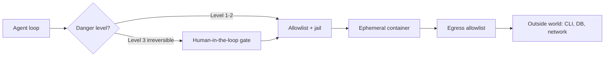

# Month 08 — Agentic Access: Safe Hands in the Outside World

**Pillar 5 — Agentic Access**

## Overview

Your agent can already read and write files and run shell commands inside a jail (Month 6), and as of Month 7 its model layer and tool layer are both pluggable behind interfaces, with a config-driven fallback chain down to a local Ollama model. It is a capable, controllable program. But it is also still mostly trapped inside one folder. The whole promise of an agent — the reason anyone tolerates the cost and the risk — is **agentic speed**: an agent that can reach the outside world (call an API, run a CLI, hit a database, receive a webhook, fire an RPC) does in seconds what a human does in an afternoon. This month we give the agent hands. That is the easy part. The hard part, and the entire spine of this month, is making sure those hands **cannot cause a catastrophe**.

Here is the thesis, and it is non-negotiable: **the value of an agent is bounded by what it can touch, and the danger of an agent is bounded by the same thing.** Every capability you add is also a blast radius. A `run_shell` tool that can call `rm` can delete your work. A database tool that connects with admin credentials can drop a production table. A network tool with no egress rules can exfiltrate secrets to any server on Earth. The model is a brilliant intern with no judgment, no accountability, and an occasional confident hallucination — and you are about to hand it a terminal that talks to the internet. So we treat security not as a final-week checklist but as the *design constraint* that shapes every tool: you decide the blast radius **before** you wire the capability, by construction, so that even a fully compromised or fully confused model physically cannot do the irreversible thing.

Hold one picture in your head for the whole month: the agent never touches the outside world directly. Every reach passes through a guarded boundary, and each guard bounds a different blast radius.


*Notice: the model proposes, but four guards stand between it and anything irreversible. Remove any one and the blast radius grows — that is what each week hardens.*

This is why Pillar 5 comes *before* the harness and factory pillars. Unsafe access makes everything downstream dangerous: an always-on agent (later) that can delete production data is not a feature, it is an incident waiting for a cron tick. We build the safe substrate first. Concretely, you will learn to invoke CLIs correctly from Python (`subprocess` done right — argument lists, timeouts, return codes, never `shell=True` on model output); to speak **MCP** (the Model Context Protocol) by building a minimal server and connecting your agent to it as a client; to receive and send **webhooks** with FastAPI and `requests`; and to handle **auth and secrets** like an adult (scoped, short-lived, never the full credential file). Threaded through all of it are the guardrails — command allowlists, the working-directory jail (hardened), egress allowlists, read-only database roles, ephemeral containers via Colima/Podman, and human-in-the-loop confirmation gates for anything irreversible.

The month ends with the **Safe-Hands Toolkit**: your agent extended with a pluggable, danger-rated tool layer where level-3 (irreversible) actions require explicit human confirmation, a minimal MCP server you wrote, a FastAPI webhook endpoint that hands payloads to the agent, and a `SECURITY.md` that enumerates every guardrail and the exact threat it mitigates. Done means you can recite the blast radius of every exposed tool — and the agent *physically cannot* delete production data even if the model tells it to.

## Prerequisites

Coming in, you should be able to do everything from Months 1 through 7:

- Work fluently in zsh on macOS, use Git, read HTTP/JSON, and call real APIs from Python with `requests`, including timeouts, retries, and loading secrets from a `.env` file (Months 1–2, 4).
- Write structured Python with classes, `Protocol`-based interfaces, dependency injection, `pytest`, type hints, and structured logging (Month 5).
- Explain and hand-write the agent loop, run a tool-call round-trip, apply the working-directory jail, and articulate why you never `eval` model output (Month 6).
- Swap the model and tool layers of your agent behind interfaces using a config-driven fallback chain to local Ollama (Month 7).

You do **not** need any prior security, networking, or container experience. We build each guardrail from its threat model up.

## Warm-Up: Retrieve Before You Begin

Before reading on, answer these from memory — no peeking at earlier months. This pulls forward the prior skills this month builds on.

1. In Month 6 your agent ran a shell command and read/wrote files. What single function kept every file operation inside one folder, and what did it do to a path before trusting it?
2. Why did Month 6 insist you never `eval` (or otherwise directly execute) the text a model produced?
3. Month 7 made the model layer and the tool layer swappable. What Python feature defined the *shape* every tool had to match, and how did the agent find a tool by name at call time?
4. When a Month 4 API call could hang or fail, what two habits did you add to a `requests` call to keep it robust?
5. Where did your secrets live in Month 4, and what file made sure they never reached Git?

<details><summary>Check your recall</summary>

1. `safe_path` — it called `.resolve()` (collapsing `..` and following symlinks) and then confirmed the result lived under `ROOT` before any read/write. (Month 6 jail.)
2. Model output is untrusted text; executing it directly is remote code execution — the model can hallucinate or be steered into emitting destructive code. (Month 6.)
3. A `Protocol` (structural interface) gave every tool a `name`, a `schema`, and a `run`/`call` method; a registry (a dict keyed by name) let the agent dispatch a tool-call by name. (Month 7.)
4. A `timeout=` and retries (plus checking the status / `raise_for_status`). (Month 4.)
5. In environment variables loaded from a `.env` file, which was listed in `.gitignore` so it was never committed. (Month 4.)
</details>

## Learning Objectives

By the end of this month you can:

1. **Invoke** an external CLI from Python correctly — argument list (never a shell string), piped stdin/stdout/stderr, an enforced timeout, and explicit return-code checking — and explain why `shell=True` on model output is a remote-code-execution hole.
2. **Implement** a command allowlist and a hardened working-directory jail, and explain the threat each one closes.
3. **Explain** the Model Context Protocol — client/server roles, transport (stdio vs. HTTP), and capability negotiation — and **build** a minimal MCP server in Python.
4. **Connect** your agent to an MCP server as a client and call a tool over the protocol.
5. **Receive** a webhook with a FastAPI endpoint (with signature verification) and **send** one with `requests`, and explain idempotency and replay protection.
6. **Apply** auth patterns — API keys, the OAuth authorization-code flow at a conceptual level, and the principle of scoped, short-lived tokens — and keep secrets out of code, logs, and the model's context.
7. **Design** a tiered, danger-rated tool layer where irreversible (level-3) actions require a human-in-the-loop confirmation gate.
8. **Sandbox** an agent's shell in an ephemeral container with Colima/Podman, and connect to a database through a **read-only role** so the agent cannot mutate data.
9. **Author** a `SECURITY.md` that maps every exposed capability to its blast radius and the guardrail that bounds it.

## Tech Stack (free, macOS)

| Tool | Install | Why |
|---|---|---|
| Python 3.12+ via uv | `brew install uv`; `uv python install 3.12` | From Month 3. Every project is a `uv` project this month. |
| FastAPI + Uvicorn | `uv add fastapi uvicorn[standard]` | The webhook receiver. FastAPI is async, typed, and free; Uvicorn is the ASGI server. |
| `requests` | `uv add requests` | Sending webhooks and calling HTTP APIs (from Month 4). |
| `mcp` (Python SDK) | `uv add "mcp[cli]"` | The official Model Context Protocol SDK — build a server and a client. |
| `httpx` | `uv add httpx` | Async HTTP client; the MCP SDK and our streamable-HTTP transport use it. |
| Ollama + a tool-capable model | `brew install ollama`; `ollama pull qwen2.5:7b` | The free model layer from Months 6–7. Drives every lab at **$0**. |
| Colima | `brew install colima docker` | A free, open-source container runtime for macOS. Our ephemeral shell sandbox and the local Postgres. |
| Podman (alternative) | `brew install podman` | Free, daemonless alternative to Colima/Docker. Either works; commands are shown for both. |
| Postgres (in a container) | `colima start` then `docker run … postgres:16` | A throwaway local database for the **read-only role** demo. No data you care about. |
| `psycopg[binary]` | `uv add "psycopg[binary]"` | The Postgres driver, to prove the read-only role rejects writes from Python. |
| `ngrok` (optional, free tier) | `brew install ngrok` | Only if you want a real provider (e.g., GitHub) to reach your local webhook. A loopback `curl` works for every required step. |

**Cost summary.** This month is **$0**. Ollama drives the agent for free; FastAPI, Colima/Podman, Postgres, and the MCP SDK are all free and run locally. Nothing here calls a paid API or a paid cloud. The only thing that could cost money is if you later point a tool at a *real* paid service — which is exactly why the danger levels and confirmation gates exist.

## Weekly Breakdown

Budget ~8–12 hours per week: roughly a third reading, a third building the guardrail, a third breaking it on purpose to prove the guardrail holds.

### Week 1 — Invoking the world by CLI, safely
**Warm-start (do this first):** before any new material, open last month's agent, run it once on a small task, and re-read your Month 6 `safe_path` and Month 7 tool `Protocol`. You are about to replace `run_shell` and harden `safe_path`, so reload them into working memory by running them.
**Focus:** the most common way an agent acts on the world — running a command-line tool — done correctly and locked down.
**Topics:** `subprocess.run` the right way (argument **list**, not a shell string; `capture_output`/piped stdin-stdout-stderr; `timeout`; `check`/return codes; `text=True`); why `shell=True` on model-generated text is remote code execution; the **command allowlist** (allow-list, not deny-list) and why deny-lists always lose; hardening the **working-directory jail** against `..`, symlinks, and absolute paths; running as a non-root user; truncating tool output.
**Reading:** Core Concepts §1–§3. The Python `subprocess` docs (Further Reading).
**Build:** Lab 1 — a hardened `run_cli` tool with an allowlist, timeouts, return-code handling, and a jail that survives a battery of escape attempts you write yourself.

### Week 2 — MCP: a standard protocol for agent tools
**Focus:** stop hand-rolling every tool integration; speak a protocol that servers everywhere already expose.
**Topics:** what MCP is and why it exists (a USB-C port for tools — one protocol, many servers); **client/server** architecture; **transports** (stdio for local subprocess servers, streamable HTTP for networked ones); **capability negotiation** (tools, resources, prompts); the shape of a tool definition and a `tools/call`; building a minimal server with the Python SDK and the `@mcp.tool()` decorator; the security posture of MCP (a server is just another program — trust it like you trust any dependency).
**Reading:** Core Concepts §4–§5. The MCP specification and Python SDK quickstart (Further Reading).
**Build:** Lab 2 — a minimal MCP server exposing one custom tool, run over stdio, plus a client that lists and calls it, then wired into your agent's tool layer behind the Month 7 interface.

### Week 3 — Webhooks and auth: the agent on the network
**Focus:** two-way networked communication — receiving events and sending them — plus handling credentials without leaking them.
**Topics:** **webhooks** as inverted APIs (the server calls *you*); receiving with a FastAPI POST endpoint; **signature verification** (HMAC) and why an open webhook is an open door; **idempotency** and replay protection; sending a webhook/HTTP request with `requests`; **auth patterns** — API keys, the OAuth authorization-code flow (conceptually), bearer tokens; **secrets hygiene** — `.env` and a secrets manager, never in code or Git, never logged, never placed in the model's context; **scoped, short-lived tokens** over long-lived god-keys; the **egress allowlist** (the agent may only call hosts you name).
**Reading:** Core Concepts §6–§8. FastAPI docs and an OAuth 2.0 primer (Further Reading).
**Build:** Lab 3 — a FastAPI receiver that verifies an HMAC signature and rejects forgeries, a sender that signs its requests, and a `fetch_url` tool gated by an egress allowlist.

### Week 4 — The Safe-Hands Toolkit (milestone)
**Focus:** assemble a danger-rated tool layer, a human gate, a container sandbox, and a read-only DB role into one defensible system.
**Topics:** **danger levels** (1: read-only/cheap, 2: writes inside the jail, 3: irreversible/external) as a property of every tool; the **human-in-the-loop confirmation gate** for level-3; running the shell tool inside an **ephemeral container** (Colima/Podman) so a bad command dies with the container; the **read-only database role** (`GRANT SELECT` only — the agent connects with a role that *cannot* write, so a `DROP TABLE` errors at the database, not in your hopeful code); writing `SECURITY.md` as a threat-model artifact.
**Reading:** Core Concepts §9. Re-read §1–§8 as a checklist.
**Build:** Lab 4 — the full Safe-Hands Toolkit: jailed filesystem, allowlisted+containerized shell, egress-gated web fetch, your MCP-backed custom tool, danger levels with a confirmation gate, a FastAPI webhook that feeds the agent, the read-only Postgres demo, and `SECURITY.md`.

## Core Concepts

### §1 — Running a CLI from Python without opening a wound

> **Heavy concept ahead.** Slow down here; the difference between an argument list and a shell string is the load-bearing idea of the month. Every other guardrail follows the same "bound the blast radius by construction" shape, but this is the one that, gotten wrong, hands an attacker a shell. Read it twice.

The most direct way for an agent to act on the world is to run a command-line tool — `git`, `gh`, `curl`, `psql`, a deploy script. Python's `subprocess` module does this, and the single most important decision you make is **how** you call it. There is a right way and a way that hands an attacker (or a hallucinating model) a shell.

The right way: pass the command as a **list of arguments**, capture output, set a timeout, and check the return code.

```python
import subprocess

proc = subprocess.run(
    ["git", "status", "--short"],   # argument LIST — the OS execs this directly
    cwd=ROOT,                       # run inside the jail
    capture_output=True,            # pipe stdout and stderr back to us
    text=True,                      # decode bytes to str
    timeout=30,                     # a hung command cannot hang the agent forever
)
if proc.returncode != 0:
    raise RuntimeError(f"git failed ({proc.returncode}): {proc.stderr.strip()}")
output = proc.stdout.strip()
```

When you pass a **list**, Python hands those exact arguments to the operating system's `exec` call. No shell is involved, so there is nothing to interpret — `;`, `|`, `$(...)`, backticks, and `&&` are just literal characters in an argument, not commands. The wound is `shell=True` with a single string:

```python
# NEVER do this with anything a model produced:
subprocess.run(f"git log {user_supplied}", shell=True)
# If user_supplied is "; rm -rf ~", the shell happily runs BOTH commands.
```

> **Common misconception.** "`shell=True` is the convenient way to run a command, and it's fine as long as I'm careful with the string."
> **Reality.** `shell=True` on any string derived from model output (or a file, or a webhook) is a command-injection hole — a remote-code-execution vulnerability. It is tempting because string-formatting a command feels natural and the happy path works. But the moment the input contains `;`, `|`, `$(...)`, backticks, or `&&`, the shell runs commands you never wrote. There is no "careful" version; the safe move is an argument list, where the OS never invokes a shell at all.

With `shell=True`, the string is handed to `/bin/sh`, which interprets every metacharacter. If any part of that string came from the model (or a webhook payload, or a file the model read), you have just built a remote-code-execution vulnerability into your agent. The rule is absolute: **argument lists always; `shell=True` never on untrusted input — and from an agent's perspective, all input is untrusted.** The other three habits are about robustness: a **timeout** so a hung process cannot freeze your loop forever (and bill you forever, if the model retries), **return-code checking** so a silent failure does not get reported to the model as success, and **piped streams** so you capture output instead of letting it scribble on your terminal.

### §2 — Allowlists beat deny-lists, every time

Once an agent can run commands, you must decide *which* commands. There are two strategies, and only one of them works.

A **deny-list** says "the agent can run anything except these dangerous commands": block `rm`, `dd`, `shutdown`, … This always loses, because you cannot enumerate every dangerous thing. The attacker reaches `rm` through `find -delete`, or `python -c "import shutil; shutil.rmtree(...)"`, or `git clean -fdx`, or a command you have never heard of. Deny-lists are a game of whack-a-mole against an adversary (or a model) with infinite moves.

An **allowlist** inverts the logic: "the agent can run *only* these commands, and nothing else." You name the small set of binaries the task actually needs — say `{git, ls, cat, python, grep, wc}` — and everything else is rejected by default. The blast radius is now bounded by construction: the agent cannot run `rm` because `rm` is not on the list, and you do not have to have predicted that `rm` was dangerous. Default-deny is the only posture that scales, and it is the recurring shape of every guardrail this month: enumerate the small set of *allowed* things, reject the rest.

```python
ALLOWED = {"git", "ls", "cat", "python", "grep", "wc", "echo"}

def run_cli(argv: list[str]) -> str:
    if not argv or argv[0] not in ALLOWED:
        raise ValueError(f"'{argv[:1]}' not allowed; allowed: {sorted(ALLOWED)}")
    # ... subprocess.run as in §1
```

Note we check `argv[0]` — the program name — *not* a substring of the joined string, which a clever argument could slip past. Allowlist the binary; pass the rest as data.

> **Common misconception.** "The model would never actually run a destructive command — it's trying to be helpful."
> **Reality.** Design as if it will. The model has no judgment, no accountability, and a real rate of confident hallucination; it can also be steered by a poisoned file or webhook payload into emitting exactly the destructive command. "It probably won't" is hope, not a guardrail. The allowlist means `rm` cannot run because it is not on the list — you do not have to predict the model's intent, only bound its reach.

### §3 — Hardening the jail: `..`, absolute paths, and symlinks

Month 6 gave you `safe_path`: resolve a candidate path and confirm it lives under `ROOT`. That closes the two obvious holes — `../../etc/passwd` (relative escape) and `/etc/passwd` (absolute escape) — because `Path.resolve()` collapses `..` and `is_relative_to(ROOT)` rejects anything outside. The subtle hole is the **symlink**: if an attacker (or an earlier agent step) creates a symlink *inside* the jail that points *outside* it, naïve resolution can be tricked depending on order of operations. `resolve()` follows symlinks, so resolving the link gives you its real target, and the `is_relative_to` check then correctly rejects it — but you must resolve `ROOT` itself once (so both sides are real paths) and check the *resolved* candidate, never the raw string. The hardened version:

```python
from pathlib import Path

ROOT = Path("./sandbox").resolve(strict=True)   # ROOT is a real, absolute path

def safe_path(candidate: str) -> Path:
    p = (ROOT / candidate).resolve()             # follows symlinks, collapses ..
    if not p.is_relative_to(ROOT):
        raise ValueError(f"'{candidate}' escapes the jail {ROOT}")
    return p
```

The discipline: **resolve, then check; never trust the string you were given.** The way you gain confidence in a jail is not by reading the code — it is by *attacking* it. In Lab 1 you write a test that throws `../../../etc/passwd`, `/etc/hosts`, a symlink-to-outside, and a path with a NUL byte at the jail and asserts every one is rejected. A guardrail you have not tried to break is a guardrail you do not trust.

### §4 — MCP: one protocol instead of N integrations

You have been hand-writing tool schemas and dispatch since Month 6. That works, but it does not compose: every new capability is bespoke glue, and nobody else can reuse your tools. The **Model Context Protocol (MCP)** is an open standard — think of it as a USB-C port for agents — that defines how a host application (your agent) talks to **servers** that expose tools, resources, and prompts. Instead of writing custom code for every integration, you connect a **client** to a **server** that speaks MCP, and the protocol handles discovery and invocation. A growing ecosystem of MCP servers already exists (filesystems, GitHub, databases, search), and the same client code talks to all of them.

The architecture has three roles. The **host** is the application that wants tools (your agent). Inside it runs one or more **clients**, each maintaining a 1:1 connection to a **server**. The server is a separate program that actually provides the capability. They communicate over a **transport**:

- **stdio** — the server runs as a local subprocess; the client writes JSON-RPC messages to its stdin and reads responses from its stdout. Ideal for local tools (a filesystem server, a script you wrote). No network, no ports, minimal attack surface.
- **streamable HTTP** — the server runs as an HTTP service; the client connects over the network. Used for remote/shared servers.

When a client connects, the two sides **negotiate capabilities**: the client asks the server what it offers (`tools/list` returns the available tools with their JSON schemas), and from then on the client can issue `tools/call` requests naming a tool and its arguments. This is exactly the tool-use round-trip from Month 6 — name, schema, arguments, result — but standardized over JSON-RPC so any compliant client and server interoperate. The payoff for this course: in Lab 2 you build one small server, and your agent's Month 7 tool interface gains a new tool *without* you writing bespoke dispatch glue for it.

A word on MCP security, because it is real: **a server is just another program you are running.** A malicious or buggy MCP server can do anything its own permissions allow. Run only servers you trust or wrote, prefer stdio (local, no open port) for anything sensitive, and remember that connecting to a third-party MCP server is a supply-chain decision exactly like adding a dependency.

### §5 — Building a minimal MCP server

The Python SDK makes a server almost anticlimactic. You create a `FastMCP` instance, decorate plain Python functions with `@mcp.tool()`, and run it. The decorator turns the function's type hints and docstring into the JSON schema the client will see — your docstring *is* the tool description the model reads.

```python
# server.py — a minimal MCP server over stdio
from mcp.server.fastmcp import FastMCP

mcp = FastMCP("safe-hands-tools")

@mcp.tool()
def word_count(text: str) -> dict:
    """Count words, lines, and characters in a block of text."""
    return {
        "words": len(text.split()),
        "lines": text.count("\n") + 1,
        "chars": len(text),
    }

if __name__ == "__main__":
    mcp.run(transport="stdio")   # speaks JSON-RPC over stdin/stdout
```

The client side launches that server as a subprocess, performs the handshake, lists tools, and calls one — and crucially, you then adapt it to your agent's existing tool interface so the agent does not know or care that this particular tool lives behind MCP. That adapter is the whole point: MCP becomes *one more provider* behind the Month 7 seam, not a parallel universe. The custom tool in your milestone is backed by exactly this server.

### §6 — Webhooks: the API that calls you

A normal API call is you reaching out: *request → response.* A **webhook** inverts it: you register a URL with a service, and when something happens (a push to a repo, a payment, a message), the service sends an HTTP POST *to you*. For an agent this is how the outside world wakes it up — an event arrives, and the agent acts. You receive one with a tiny FastAPI endpoint:

```python
from fastapi import FastAPI, Request

app = FastAPI()

@app.post("/webhook")
async def receive(request: Request):
    payload = await request.json()
    # ... hand payload to the agent ...
    return {"status": "accepted"}
```

Two dangers come free with that endpoint. First, **anyone on the internet can POST to it** — an open webhook with no verification means an attacker can forge events and drive your agent. The fix is **signature verification**: the sender computes an HMAC of the request body using a shared secret and puts it in a header; you recompute it and reject any request whose signature does not match (using a constant-time compare). Second, networks deliver duplicates, and attackers replay captured requests; if your agent's action is not **idempotent** (safe to repeat), a replayed "charge the customer" webhook charges twice. Defend with a verified signature, a timestamp you reject if too old, and a record of event IDs you have already processed. Sending a webhook is the easy direction — a `requests.post` with the body and the signature header you computed the same way the receiver expects.

### §7 — Auth patterns and the principle of least privilege

Most useful actions require proving who you are. Three patterns cover the ground:

- **API keys** — a long secret string you send in a header (`Authorization: Bearer sk-…`). Simple, but a single key often grants broad access and never expires, so a leak is a full compromise. Treat keys as radioactive: scope them as narrowly as the provider allows, rotate them, and never paste one into code or a model prompt.
- **OAuth (authorization-code flow)** — instead of handing your password to an app, you authorize it at the provider, which issues the app a **scoped access token** (and a refresh token). The access token is short-lived and limited to specific permissions, so a leak is bounded in both blast radius and time. You do not need to implement an OAuth server this month, but you must understand the shape: *redirect → consent → code → exchange code for a scoped, expiring token.*
- **Scoped, short-lived tokens** — the principle under both: a credential should grant the **least privilege** for the **shortest time** that gets the job done. A read-only token that expires in an hour is a far smaller incident than an admin key that lives forever.

> **Common misconception.** "A private API key sitting in an environment variable is safe enough — it's not in the code, so it can't leak."
> **Reality.** Keeping a key out of source is necessary but not sufficient. A broad, never-expiring key is still a full compromise the moment it leaks — into a log line, a stack trace, a JSONL trace, or the model's own context (from which it can be echoed back into an attacker's prompt). Safety comes from *scope* and *lifetime*: a key limited to one capability and rotated/expiring soon is a small incident; a god-key in `.env` is a large one waiting to happen.

The agent-specific rule that ties this together: **never give the agent your full credential file.** The model does not need — and must never see — your master `.env`, your AWS root key, or a token that can do everything. It gets a token scoped to exactly the one capability the task needs, ideally short-lived, and it gets it through your tool layer, not in its context window. A secret that reaches the model's context can be logged, leaked into a trace, or repeated back into an attacker's prompt.

### §8 — Secrets hygiene and the egress allowlist

Two concrete practices fall out of §7. **Secrets hygiene:** secrets live in environment variables loaded from a `.env` file (which is in `.gitignore`, always), or in a real secrets manager for anything serious. They never appear in source code, never in a Git commit, never in a log line, and never in the JSONL trace your agent writes — when you log a tool call that used a token, log `***redacted***`, not the token. Before every commit, a habit: *did I just stage a secret?* (`git diff --cached` and tools like `gitleaks` catch it.)

The **egress allowlist** is the network analogue of the command allowlist. By default an agent with a `fetch_url` tool can call *any* host — which means a confused or compromised model can POST your data to an attacker's server. The fix is the same default-deny shape: the tool may only contact hosts on an explicit allowlist (`{"api.github.com", "api.weather.gov"}`), and any other host is refused before the request is sent. You parse the URL, check the hostname against the set, and reject otherwise. This single check turns "the agent can talk to the entire internet" into "the agent can talk to exactly these three services," which is the difference between a tool and a liability.

```python
from urllib.parse import urlparse
import requests

ALLOWED_HOSTS = {"api.github.com", "api.weather.gov"}

def fetch_url(url: str) -> str:
    host = urlparse(url).hostname or ""
    if host not in ALLOWED_HOSTS:
        raise ValueError(f"egress to '{host}' denied; allowed: {sorted(ALLOWED_HOSTS)}")
    resp = requests.get(url, timeout=15)
    resp.raise_for_status()
    return resp.text[:8000]   # truncate the chatty-tool trap from Month 6
```

### §9 — Danger levels, the human gate, containers, and the read-only role

The capstone idea unifies everything: **every tool carries a danger level, and that level decides who is allowed to say yes.**

- **Level 1 — read-only / cheap.** Read a file in the jail, list a directory, fetch an allowlisted URL. Reversible, no real cost. The agent runs these freely.
- **Level 2 — writes inside the sandbox.** Write a file in the jail, run an allowlisted command in a container. Mutating but contained; the blast radius is the sandbox.
- **Level 3 — irreversible or external.** Delete data, push to a remote, charge a card, send an email, run a destructive command. These get a **human-in-the-loop confirmation gate**: the agent proposes the action, your code pauses and prints exactly what is about to happen, and a human must type `yes` before it executes. The model can ask all it wants; it cannot pull the trigger on something irreversible by itself.

```python
def gate(action: str, danger: int) -> None:
    if danger >= 3:
        print(f"\n[CONFIRM] Level-{danger} action requested:\n  {action}")
        if input("Proceed? type 'yes': ").strip() != "yes":
            raise PermissionError("human declined the action")
```

Two infrastructure guardrails make the lower levels safe by construction. The **ephemeral container** (Colima or Podman) runs the shell tool inside a throwaway container with no host filesystem mounted except the jail, no network unless you grant it, and a non-root user — when the command finishes, the container is destroyed, so any mess dies with it. This is the difference between "the model ran a bad command on my laptop" and "the model ran a bad command in a box that no longer exists." The **read-only database role** is the same principle applied to data: you create a Postgres role with `GRANT SELECT` and *nothing else*, and the agent connects as that role. Now a `DROP TABLE` or `DELETE` does not depend on your code remembering to block it — it is rejected **by the database**, because the role lacks the privilege. The agent touches a read-replica or staging, **never** raw production, with a role that cannot mutate. Defense in depth: even if your application logic has a bug, the database itself refuses to be harmed.

> **Common misconception.** "My DB tool is read-only — it only ever issues `SELECT`, so I'm enforcing read-only access."
> **Reality.** "Only issues `SELECT`" is a convention in your code, and code has bugs, edge cases, and a model that can be talked into building a different query. That is hope, not enforcement. Real read-only means the *database role* the agent connects with holds `GRANT SELECT` and nothing else — so a `DROP` or `DELETE` is refused by Postgres itself, regardless of what your code or the model intended. Enforce it at the role, not by convention.

The final artifact is `SECURITY.md`, a document that lists every exposed tool, its danger level, its blast radius, and the specific guardrail that bounds it. Writing it forces you to articulate the threat model out loud — and if you cannot name the blast radius of a tool, you are not ready to expose it.

## Labs

| Lab | Title | Time | Difficulty |
|---|---|---|---|
| [Lab 1](lab-1-subprocess-cli-allowlist-and-jail-hardening.md) | Safe CLI Invocation: subprocess, Allowlists, and Jail Hardening | ~3 hrs | Core |
| [Lab 2](lab-2-build-a-minimal-mcp-server-and-client.md) | Build a Minimal MCP Server and Connect the Agent | ~3.5 hrs | Core |
| [Lab 3](lab-3-webhooks-with-fastapi-and-secrets-hygiene.md) | Webhooks with FastAPI, Sending, and Secrets Hygiene | ~3.5 hrs | Core |
| [Lab 4](lab-4-safe-hands-toolkit-milestone.md) | The Safe-Hands Toolkit (Milestone) | ~6 hrs | Core / Stretch |

## Checkpoints & Self-Assessment

Run these against yourself at the end of each week. You are on track if you can do them without looking it up.

- **Week 1:** Write a `subprocess.run` call that runs `git status` safely (list, cwd, timeout, return-code check). Then explain in one sentence why `subprocess.run(f"echo {x}", shell=True)` is dangerous when `x` came from a model. Write a test that throws three escape attempts at your jail and watch all three rejected.
- **Week 2:** Draw the MCP host/client/server diagram from memory and name the two transports. Run your MCP server, list its tools from a client, and call one. Explain why connecting to a third-party MCP server is a supply-chain decision.
- **Week 3:** Stand up the FastAPI receiver, `curl` it with a *wrong* signature, and confirm it returns 401. Then `curl` with the correct HMAC and confirm 200. Explain why an idempotent action makes webhook replays harmless.
- **Week 4:** Point your agent's DB tool at the read-only Postgres role and ask it to delete a row; confirm the *database* refuses. Trigger a level-3 action and confirm the human gate blocks it without your `yes`. Recite the blast radius of every tool in your toolkit.

## Reflect

Spend ten minutes on these in your learning log (writing, not just thinking):

- **Explain it back:** In two or three sentences, explain to a peer who just finished Month 7 why "bound the blast radius by construction" is a stronger idea than "tell the model not to do dangerous things." Use one concrete example (the allowlist, the read-only role, or the human gate).
- **Connect:** How does this month's danger-rated, gated tool layer change or extend the pluggable tool `Protocol` and registry you built in Month 7? What single field did you add to a tool, and where does the dispatcher consult it?
- **Monitor:** Which guardrail this month is still fuzzy — the symlink-hardened jail, the MCP handshake, HMAC verification, the ephemeral container, or the read-only role? Name it precisely, and write the one question that would clear it up.

## Month-End Assessment

**Deliverable:** the **Safe-Hands Toolkit** — your Month 7 agent extended with a pluggable, danger-rated tool layer. It exposes: a **filesystem** tool (jailed, hardened against `..`/absolute/symlink escapes), a **shell** tool (allowlisted *and* run inside an ephemeral Colima/Podman container), a **web-fetch** tool (egress allowlist), and **one custom tool backed by a minimal MCP server you wrote** and connected as a client. Every tool carries a **danger level**; level-3 (irreversible) actions require an explicit **human-in-the-loop confirmation** before they run. A **FastAPI endpoint** receives a (signature-verified) webhook and hands the payload to the agent. A local **Postgres** in a container demonstrates the **read-only role**: the agent connects with a `SELECT`-only role and an attempted write is rejected *by the database*. You submit four artifacts: the toolkit source, the MCP server, a run trace showing a level-3 action blocked by the gate and a write rejected by the read-only role, and a **`SECURITY.md`** enumerating every guardrail and the threat it mitigates.

**Rubric**

- **Passing:** All four tools work and slot behind the Month 7 tool interface. The shell tool uses an argument list and an allowlist (never `shell=True` on model output); the jail rejects at least three escape attempts. The MCP server runs and the agent calls its tool over the protocol. The FastAPI endpoint verifies an HMAC signature and rejects a forged one. The read-only DB role rejects a write from the agent. A level-3 action is gated behind human confirmation and does not execute without `yes`. `SECURITY.md` lists every tool with its blast radius and guardrail.
- **Excellent:** All of the above, plus: the shell tool runs inside an ephemeral container (Colima/Podman) as a non-root user with no host mounts beyond the jail and is destroyed after each run; the egress allowlist and a redacted secrets-in-trace policy are both enforced and demonstrated; the webhook receiver also rejects replays (timestamp + seen-event-ID); danger levels are a first-class property of the tool definition (not an `if` buried in dispatch); `SECURITY.md` reads like a real threat model (asset → threat → guardrail → residual risk); and the whole thing still falls back to Ollama for $0 and reuses Month 6's JSONL trace with secrets redacted.

The real definition of done is behavioral: **you can articulate the blast radius of every tool you exposed, and the agent physically cannot delete production data even if the model tells it to.** Safety is by construction, not by hope.

## Common Pitfalls

- **`shell=True` on model output.** The classic catastrophe. Always pass an argument list; never join model text into a shell string. If you think you need a shell feature (a pipe, a glob), do it in Python instead.
- **Deny-listing dangerous commands.** You will miss one. Allowlist the handful of commands the task needs and reject everything else by default.
- **Trusting the jail without attacking it.** A jail you have not thrown `..`, an absolute path, and a symlink at is a jail you do not know works. Write the escape test first.
- **An open webhook.** No signature verification means anyone can drive your agent. Verify the HMAC with a constant-time compare and reject forgeries with 401.
- **Secrets in the trace or the model's context.** A token that lands in a log, a JSONL trace, or the model's context window is a leaked token. Redact before logging; never put a credential in a prompt.
- **Connecting to the database as admin "just for the demo."** The one time you use the admin role is the time the model issues a `DROP`. Create the read-only role first; connect as it always.
- **Treating the container as a checkbox.** A container that mounts your whole home directory or runs as root is not a sandbox. No host mounts beyond the jail, non-root user, no network unless granted.
- **Skipping the human gate because it is annoying.** The friction is the point. Irreversible actions are exactly the ones a confused model should not be able to take alone.

## Knowledge Check

Answer from memory first, then check. Questions marked ⟲ are spaced callbacks to earlier months — they are supposed to feel like a stretch.

1. Why does passing an argument **list** to `subprocess.run` make `;`, `|`, and `$(...)` harmless, while a single string with `shell=True` makes them dangerous?
2. **Spot the risk.** A teammate writes `subprocess.run(["bash", "-c", model_text], ...)`. They used a list, so it's safe — true or false, and why?
3. Why does an *allowlist* of commands scale where a *deny-list* of dangerous commands does not?
4. **Predict the output.** A `fetch_url` tool has `ALLOWED_HOSTS = {"api.github.com"}`. The model calls `fetch_url("https://api.github.com.evil.com/x")`. Allowed or denied, and what exactly is compared?
5. In the MCP round-trip, which message carries each tool's *schema*, and which carries the *arguments and result* of a single call?
6. Your webhook receiver computes the HMAC over the parsed JSON dict; the sender signs the raw bytes. What symptom do you see, and what is the fix?
7. Why is a `query_db` tool that connects as a `SELECT`-only role rated danger **1**, even though SQL can express a `DROP TABLE`?
8. **Which tool and why.** The model wants to push a branch to a remote GitHub repo. What danger level is that, and what must happen before it executes?
9. ⟲ (Month 6) What two steps does `safe_path` perform, in order, and why does doing them in that order defeat a symlink that points outside the jail?
10. ⟲ (Month 7) Your MCP-backed `slugify` tool slots in beside hand-written tools with no special-casing. What Month 7 design made that possible?
11. ⟲ (Month 4) Name two things that must be true of your `.env` before you commit a project that reads `WEBHOOK_SECRET` from it.
12. **Spot the risk.** A tool logs its full arguments to the JSONL trace, including an `Authorization: Bearer ...` header. What is the leak, and what is the one-line fix?

<details><summary>Answer key</summary>

1. With a list, the OS `exec`s the program directly — no shell is invoked, so metacharacters are literal data in an argument. With `shell=True` the string goes to `/bin/sh`, which interprets every metacharacter as syntax.
2. **False.** They put a shell *on the list*: `bash -c <model_text>` runs the model's text *as a shell script*. It is the `shell=True` hole wearing a list costume. Never let model output be a shell program.
3. You cannot enumerate every dangerous command (`rm`, `find -delete`, `python -c ...`, a binary you've never heard of). Default-deny with a small allowlist bounds the blast radius by construction; deny-lists are whack-a-mole against infinite moves.
4. **Denied.** `urlparse(...).hostname` returns `api.github.com.evil.com`, which is not in the set, so it's refused. (Substring matching would be the bug — exact hostname membership is the check.)
5. `tools/list` returns each tool's name + JSON schema + description; `tools/call` carries `{name, arguments}` and returns the content/result. Same name/schema/args/result shape as Month 6, standardized over JSON-RPC.
6. Every signed request returns `401 bad signature`. The two sides hashed different bytes. Fix: both must sign/verify the **exact same raw bytes** (sender sends `data=raw`, receiver reads `await request.body()`).
7. Because the *database role* lacks write/DDL privileges — Postgres refuses a `DROP`/`DELETE` regardless of the SQL string. The blast radius is "reads staging data," which is genuinely low. (The role, not the code, makes it level 1.)
8. **Level 3 (irreversible/external).** It must pass the human-in-the-loop confirmation gate — the code pauses, prints the exact action, and a human types `yes` before it runs.
9. It (a) `.resolve()`s the candidate (collapsing `..` and following symlinks to the real target), then (b) checks `is_relative_to(ROOT)`. Resolving *first* means the symlink's real, outside target is what gets range-checked, so it's rejected. (Month 6.)
10. The tool `Protocol` (structural interface: `name`, `schema`, `run`) plus a name-keyed registry — anything matching the shape is callable; the agent never cares about the implementation behind it. (Month 7.)
11. `.env` must contain the key, and `.env` must be listed in `.gitignore` and untracked (`git status` must not show it). A secret in Git history is leaked forever. (Month 4.)
12. The bearer token lands in the persistent trace — a leaked credential. Fix: run every traced string through `redact()` (or log `***redacted***`) before writing. (Lab 3.)
</details>

## Further Reading

- [Python `subprocess` documentation](https://docs.python.org/3/library/subprocess.html) — `run`, argument lists, `timeout`, return codes, and the `shell=True` warnings, from the source.
- [Model Context Protocol — specification and docs](https://modelcontextprotocol.io) — architecture, transports, capability negotiation, and the Python SDK quickstart.
- [FastAPI documentation](https://fastapi.tiangolo.com) — request handling, dependencies, and running with Uvicorn.
- [OWASP — webhook and API security guidance](https://cheatsheetseries.owasp.org/cheatsheets/REST_Security_Cheat_Sheet.html) — signature verification, replay protection, and least-privilege auth.
- [The OAuth 2.0 Authorization Framework (RFC 6749), §1 and §4.1](https://datatracker.ietf.org/doc/html/rfc6749) — the authorization-code flow in primary-source terms; read just the overview and the auth-code section.
- [PostgreSQL `GRANT` and role documentation](https://www.postgresql.org/docs/current/sql-grant.html) — how to create a `SELECT`-only role for the read-only-access pattern.

## Author's Notes

This month is deliberately security-first: the spec places Pillar 5 (Access) before the Harness and Factory pillars precisely because an agent that can touch the world unsafely makes every later capability dangerous, so we build the safe substrate before we scale autonomy. Two calibration tradeoffs worth noting. First, **MCP depth**: we teach enough MCP to build a minimal server and a client and to fold it behind Month 7's tool interface, but we do not cover resources, prompts, sampling, or auth-over-HTTP transports in depth — that is a Pillar 4 (factories/ecosystem) concern, and over-teaching it here would crowd out the security spine. Second, **containers**: full container security (seccomp, user namespaces, rootless networking) is a career's worth of material; we teach the 80/20 that matters for an agent sandbox — no host mounts beyond the jail, non-root, no unsolicited network, ephemeral lifetime — and flag the rest as further depth. We standardize on Colima as the default runtime (free, the closest drop-in for the Docker CLI on macOS) and give Podman commands alongside, honoring the standards' guidance to avoid defaulting to Docker Desktop. Everything remains $0 and local; the read-only-role demo uses a throwaway containerized Postgres so the learner can issue a real `DROP TABLE` and watch the database refuse it, which lands the least-privilege lesson far harder than a paragraph could.
