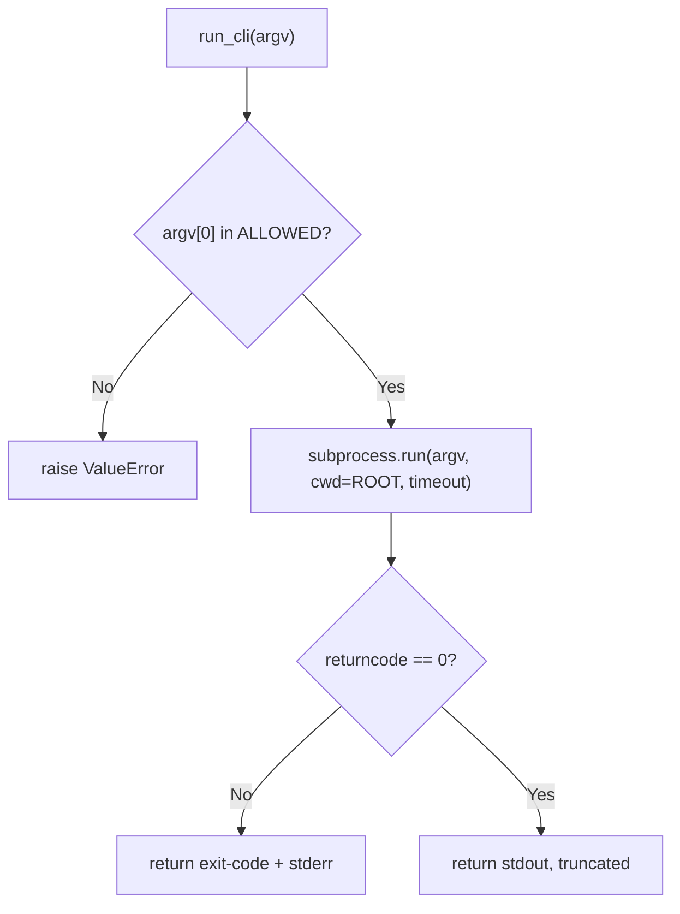

# Lab 1 — Safe CLI Invocation: subprocess, Allowlists, and Jail Hardening

**Time: ~3 hrs · Difficulty: Core · Builds on: Month 6 (the from-scratch agent, `safe_path`, `run_shell`) and Month 7 (the pluggable tool interface)**

## Objective

The most common way an agent acts on the world is by running a command-line tool. In this lab you build `run_cli` — a hardened replacement for Month 6's `run_shell` — that invokes external commands the *right* way: an argument list (never a shell string), piped streams, an enforced timeout, explicit return-code checking, and a strict command **allowlist**. You then harden the working-directory **jail** against `..`, absolute paths, and symlinks, and prove it works the only way that counts: by writing a test that attacks it and watching every attack bounce. By the end you will have a CLI tool you can hand to a hallucinating model without losing sleep, and a jail you have personally tried to break.

## Setup

```zsh
mkdir -p ~/agentic/month-08 && cd ~/agentic/month-08
uv init --bare 2>/dev/null; uv add requests
mkdir -p sandbox
printf 'def add(a, b):\n    return a + b\n' > sandbox/calc.py
cd sandbox && git init -q && git add -A && git commit -qm "seed" && cd ..
```

**Checkpoint:** `ls sandbox` shows `calc.py`, and `git -C sandbox log --oneline` shows the seed commit. This `sandbox/` folder is the agent's jail for the whole month.
**If not:** if `ls sandbox` is empty, the `printf` ran in the wrong directory — `cd ~/agentic/month-08` and re-run the `mkdir`/`printf` lines. If `git log` errors with "not a git repository," the `git init`/`commit` block did not run inside `sandbox/`; re-run the last Setup line.

## Background

**Recall first (from memory):** What did Month 6's `run_shell` do *unsafely* that you are about to fix? And what does `safe_path` check before it trusts a path? Answer in one sentence each before reading on — then verify against §1–§3.

You already have a `run_shell` from Month 6 and a tool interface from Month 7. This lab does two things: it upgrades the *mechanics* of how you call a subprocess (timeouts, return codes, piped streams) and it upgrades the *security posture* (allowlist instead of a loose set, jail hardened against symlinks). Read README §1–§3 before you start — the *why* behind each line here is in those three sections.

## Steps

### 1. The wrong way, once, so you feel it

In a scratch file `danger_demo.py`, see what `shell=True` actually does. **Run this only inside `sandbox/`** — it is a demo of the hole, not a tool.

```python
# danger_demo.py — DO NOT ship anything like this
import subprocess

user_supplied = "calc.py; echo PWNED > owned.txt"   # imagine a model produced this
subprocess.run(f"ls {user_supplied}", shell=True, cwd="sandbox")
```

```zsh
uv run python danger_demo.py
cat sandbox/owned.txt
```

**Checkpoint:** `owned.txt` exists and contains `PWNED`. The shell interpreted the `;` and ran a *second* command you never intended. Delete the file (`rm sandbox/owned.txt`) and the demo (`rm danger_demo.py`). You have now seen, with your own eyes, why `shell=True` on untrusted input is remote code execution.
**If not:** if `owned.txt` is missing, the working directory was wrong — run `uv run python danger_demo.py` from `~/agentic/month-08` so `cwd="sandbox"` resolves. (If you are relieved nothing got created — don't be; the point is that it *should* have.)

### 2. `run_cli` done right — worked → faded → independent

Here is the new skill of this lab: invoke a CLI from Python so that even a hostile argument cannot escape the bounds you set. The safe path is a four-gate sequence:


*Notice: there is no shell anywhere in this flow — the OS `exec`s the argument list directly, and the allowlist gate runs before any process starts.*

#### Stage 1 — Worked example (I do)

Create `safe_cli.py` exactly as below and run it. Every non-obvious line is annotated; you are not inventing anything yet — read it, run it, and trace each line against the diagram above.

```python
# safe_cli.py
from __future__ import annotations
import subprocess
from pathlib import Path

ROOT = Path("./sandbox").resolve(strict=True)   # the jail; a real absolute path

# Allowlist: only these binaries may ever run. Default-deny everything else.
ALLOWED = {"git", "ls", "cat", "python", "python3", "grep", "wc", "echo"}

def run_cli(argv: list[str], timeout: int = 30) -> str:
    """Run an allowlisted command as an ARGUMENT LIST inside the jail.

    - argument list, never a shell string (no shell to interpret metachars)
    - allowlist the program name; reject everything else
    - timeout so a hung command cannot freeze the agent
    - check the return code so a failure is reported as a failure
    """
    if not isinstance(argv, list) or not argv:
        raise ValueError("argv must be a non-empty list of strings")
    program = argv[0]
    if program not in ALLOWED:
        raise ValueError(f"'{program}' not allowed; allowed: {sorted(ALLOWED)}")

    proc = subprocess.run(
        argv,                  # exec'd directly by the OS — no shell
        cwd=ROOT,              # run inside the jail
        capture_output=True,   # pipe stdout + stderr back to us
        text=True,             # decode to str
        timeout=timeout,       # hung process protection
    )
    if proc.returncode != 0:
        # report the failure honestly instead of silently calling it success
        return f"[exit {proc.returncode}] {proc.stderr.strip()[:2000]}"
    return proc.stdout.strip()[:4000] or "(no output)"   # truncate chatty output
```

**Checkpoint:** exercise it from the REPL:

```zsh
uv run python -c "from safe_cli import run_cli; print(run_cli(['git','status','--short']))"
uv run python -c "from safe_cli import run_cli; print(run_cli(['ls']))"
```

The first prints git's short status (possibly empty), the second lists `calc.py`. Now try a forbidden one:

```zsh
uv run python -c "from safe_cli import run_cli; run_cli(['rm','-rf','.'])"
```

You should see `ValueError: 'rm' not allowed; allowed: [...]`. The allowlist refused `rm` before any process started — and notice that the metacharacter trick from Step 1 is now impossible, because there is no shell to interpret a `;` even if a model put one in an argument.
**If not:** `ModuleNotFoundError: safe_cli` means you ran from the wrong directory — `cd ~/agentic/month-08`. `FileNotFoundError` on `resolve(strict=True)` means `sandbox/` does not exist yet (re-run Setup). If `rm` ran instead of raising, you edited the allowlist or the guard `if program not in ALLOWED` — restore it.

#### Stage 2 — Faded practice (we do)

Now extend the same technique with less scaffolding. Add a `run_cli_json` variant to `safe_cli.py` that returns a structured dict instead of a string. The skeleton is below; fill in the three TODOs using exactly the safety pattern you just studied.

```python
# add to safe_cli.py
def run_cli_json(argv: list[str], timeout: int = 30) -> dict:
    """Same safety as run_cli, but return {stdout, stderr, exit_code}."""
    if not isinstance(argv, list) or not argv:
        raise ValueError("argv must be a non-empty list of strings")
    # TODO 1: reject argv[0] if it is not in ALLOWED (copy the guard from run_cli)
    proc = subprocess.run(
        argv,
        cwd=ROOT,
        # TODO 2: capture output, decode to text, and enforce the timeout
    )
    # TODO 3: return a dict with keys "stdout", "stderr", "exit_code"
    #         (truncate stdout/stderr to ~4000 chars each)
```

**Checkpoint:** `uv run python -c "from safe_cli import run_cli_json; print(run_cli_json(['git','status','--short']))"` prints a dict with `stdout`, `stderr`, and `exit_code` keys, and `run_cli_json(['rm','x'])` still raises `ValueError`.
**If not:** if the timeout is ignored, you omitted `timeout=timeout` in TODO 2; if `rm` is not refused, TODO 1's guard is missing or checks the wrong index (it must be `argv[0]`, never a substring of a joined string).

#### Stage 3 — Independent (you do)

No skeleton this time — only the goal. Add a `git`-only subcommand guard: a function `run_git(args: list[str])` that runs `git` (and only `git`) and additionally **rejects any subcommand outside `{status, log, diff, add, commit}`** — so the model cannot reach `git push` (a network action you will gate as level-3 later). Definition of done for this stage: `run_git(["status"])` works, and `run_git(["push"])` raises before any process starts. Reuse `subprocess.run` with an argument list, `cwd=ROOT`, and a timeout; do not introduce a shell.

### 3. Prove the timeout and return-code handling

Add a deliberately slow and a deliberately failing call to confirm the safety nets fire.

```zsh
# return-code: grep for something absent exits non-zero
uv run python -c "from safe_cli import run_cli; print(run_cli(['grep','NOPE','calc.py']))"
# timeout: python that sleeps longer than the limit
uv run python -c "from safe_cli import run_cli; print(run_cli(['python','-c','import time;time.sleep(5)'], timeout=2))"
```

**Checkpoint:** the `grep` call returns an `[exit 1] ...` string (a missing match is a non-zero exit, reported honestly, not crashed). The sleeping call raises `subprocess.TimeoutExpired` after ~2 seconds — the timeout fired. A real tool wrapper would catch that and return a timeout message to the model; you will do that in Lab 4.
**If not:** if the `grep` call *raises* instead of returning the `[exit 1]` string, your `returncode` branch is missing — re-check the `if proc.returncode != 0` block. If the sleep call returns instead of raising after ~2s, you passed the default `timeout=30`; pass `timeout=2` as shown.

### 4. Harden the jail

Create `jail.py` with the hardened `safe_path` from README §3.

```python
# jail.py
from __future__ import annotations
from pathlib import Path

ROOT = Path("./sandbox").resolve(strict=True)

def safe_path(candidate: str) -> Path:
    """Resolve a candidate path and confirm it stays inside ROOT, or raise.

    resolve() collapses '..' and follows symlinks, so the check below sees
    the REAL target. We resolve ROOT once (strict=True) so both sides are
    real absolute paths before comparing.
    """
    if "\x00" in candidate:
        raise ValueError("NUL byte in path")
    p = (ROOT / candidate).resolve()
    if not p.is_relative_to(ROOT):
        raise ValueError(f"'{candidate}' escapes the jail {ROOT}")
    return p
```

**Checkpoint:** quick manual smoke test:

```zsh
uv run python -c "from jail import safe_path; print(safe_path('calc.py')); safe_path('../../etc/passwd')"
```

The first line prints the resolved path to `calc.py`; the second raises `ValueError: '../../etc/passwd' escapes the jail`.
**If not:** if the escape path does *not* raise, you are comparing the raw string instead of the resolved path — confirm you call `.resolve()` and then `is_relative_to(ROOT)` on the resolved `p`. If `resolve(strict=True)` errors on import, `sandbox/` is missing.

### 5. Attack your own jail (the part that matters)

A guardrail you have not tried to break is a guardrail you do not trust. Create `test_jail.py` and throw every escape you can think of at it.

```python
# test_jail.py
import os
import pytest
from pathlib import Path
from jail import safe_path, ROOT

def test_allows_inside():
    assert safe_path("calc.py") == ROOT / "calc.py"
    assert safe_path("sub/new.txt") == ROOT / "sub" / "new.txt"

@pytest.mark.parametrize("evil", [
    "../../etc/passwd",        # relative escape
    "/etc/hosts",              # absolute escape
    "../sandbox/../../secret", # tricky relative
    "..",                      # the parent itself
])
def test_rejects_escapes(evil):
    with pytest.raises(ValueError):
        safe_path(evil)

def test_rejects_nul_byte():
    with pytest.raises(ValueError):
        safe_path("calc.py\x00.png")

def test_rejects_symlink_to_outside(tmp_path):
    # create a symlink INSIDE the jail that points OUTSIDE it
    link = ROOT / "escape_link"
    target = Path("/etc")
    if link.exists() or link.is_symlink():
        link.unlink()
    os.symlink(target, link)
    try:
        with pytest.raises(ValueError):
            # following the link must resolve outside ROOT and be rejected
            safe_path("escape_link/hosts")
    finally:
        link.unlink()
```

```zsh
uv add --dev pytest
uv run pytest test_jail.py -v
```

**Checkpoint:** every test passes. The symlink test is the important one: even though `escape_link` lives inside the jail, it points at `/etc`, and `resolve()` follows it, so the `is_relative_to` check correctly rejects the real target. You have now personally attacked your jail with `..`, an absolute path, a NUL byte, and a symlink, and watched all of them bounce.
**If not:** a failing `test_rejects_symlink_to_outside` usually means a leftover `sandbox/escape_link` from a crashed run — `rm sandbox/escape_link` and rerun. If `test_rejects_escapes` fails, your `safe_path` is checking the raw string, not the resolved path (see the Step 4 fix). If `pytest` is not found, run `uv add --dev pytest`.

### 6. Slot it behind the Month 7 tool interface

Your agent already has a tool interface (a `Protocol` with `name`, `schema`, and a `run`/`call` method from Month 7). Wrap `run_cli` and the jailed file ops as tools that conform to it. The shape will match your own Month 7 code; here is the idea:

```python
# tools.py — adapting the hardened functions to the Month 7 tool interface
from safe_cli import run_cli
from jail import safe_path

class CliTool:
    name = "run_cli"
    schema = {
        "type": "function",
        "function": {
            "name": "run_cli",
            "description": "Run an allowlisted shell command as an argument list inside the sandbox.",
            "parameters": {
                "type": "object",
                "properties": {
                    "argv": {"type": "array", "items": {"type": "string"},
                              "description": "command + args, e.g. ['git','status']"},
                },
                "required": ["argv"],
            },
        },
    }
    def run(self, argv: list[str]) -> str:
        return run_cli(argv)

class ReadFileTool:
    name = "read_file"
    # ... schema with a 'path' string ...
    def run(self, path: str) -> str:
        return safe_path(path).read_text(encoding="utf-8", errors="replace")[:8000]
```

**Checkpoint:** register `CliTool` in your agent's tool registry and run the agent with a task like *"run git status and tell me what changed."* The agent calls `run_cli(['git','status'])` through the interface and reports the result. If you ask it to *"delete all the files,"* the allowlist (or the absence of `rm`) blocks it — the model can ask, but the tool refuses.
**If not:** if the agent never calls the tool, the schema's `name` does not match the registry key, or the tool is not registered — re-check both against your Month 7 dispatch. If `run` is called with the wrong shape, confirm the schema's `parameters` matches your `run(self, argv)` signature.

## Definition of Done

- `safe_cli.run_cli` uses an argument list, `cwd=ROOT`, `capture_output`, `text`, and a `timeout`, checks the return code, and refuses any program not in `ALLOWED`.
- You have *seen* `shell=True` run an injected second command (Step 1) and understand why argument lists close that hole.
- `jail.safe_path` rejects `..`, absolute paths, NUL bytes, and symlinks-to-outside.
- `uv run pytest test_jail.py -v` is all green, including the symlink test.
- The CLI tool and a jailed file tool are registered behind your Month 7 tool interface and callable by the agent.

Self-verify in one command:

```zsh
uv run pytest test_jail.py -q && uv run python -c "from safe_cli import run_cli; run_cli(['rm','x']) " 2>&1 | grep -q "not allowed" && echo "DONE: jail green, allowlist enforced"
```

**Self-explain:** in one sentence, why does passing an argument list (instead of a string with `shell=True`) make a `;` in a model-supplied argument harmless?

## Stretch Goals

1. **Per-tool timeout and output cap as config.** Move `timeout` and the output truncation length into your Month 7 config so they are tunable without code edits.
2. **Argument validation.** For `git`, allowlist not just the binary but the *subcommand* (`status`, `log`, `add`, `commit`) and reject `git push` so the agent cannot reach a remote without a higher danger level (foreshadows Lab 4).
3. **Capture and structure stderr separately.** Return a small dict `{stdout, stderr, exit_code}` instead of a merged string, and have the agent reason over the structured result.
4. **A fuzzing test.** Generate 1,000 random path strings (with random `..`, `/`, and unicode) and assert `safe_path` either returns a path inside `ROOT` or raises — never returns a path outside.

## Troubleshooting

- **`FileNotFoundError` from `resolve(strict=True)`.** `ROOT` must exist before you import the module. Make sure `sandbox/` is created (Setup) and you run commands from `~/agentic/month-08`.
- **`is_relative_to` is missing.** It requires Python 3.9+. You are on 3.12 via `uv` — confirm with `uv run python --version`.
- **The symlink test fails to create the link.** You need write permission in `sandbox/` and the link must not already exist; the test unlinks it first, but a leftover from a crashed run can interfere — `rm sandbox/escape_link` and rerun.
- **`subprocess.TimeoutExpired` is uncaught and crashes a script.** That is expected in Step 3 (we are demonstrating it fires). In your tool wrapper, wrap the call in `try/except subprocess.TimeoutExpired` and return a timeout message to the model.
- **`git status` errors with "not a git repository".** You skipped the `git init` in Setup, or `ROOT` is not the `sandbox/` you initialized. Re-run the Setup git lines.
