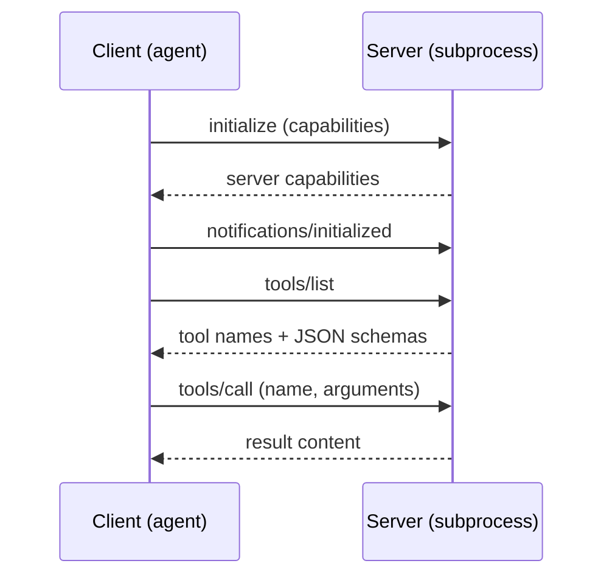

# Lab 2 — Build a Minimal MCP Server and Connect the Agent

**Time: ~3.5 hrs · Difficulty: Core · Builds on: Lab 1 and Month 7's pluggable tool interface**

## Objective

So far every tool your agent has is bespoke glue you wrote by hand. In this lab you learn the **Model Context Protocol (MCP)** — the open standard that lets a client (your agent) discover and call tools exposed by a server, over a defined transport, with negotiated capabilities. You will build a **minimal MCP server** in Python with the official SDK, connect to it as a **client**, watch the handshake and `tools/list`, call a tool over the protocol, and then adapt that MCP tool to slot behind your Month 7 tool interface — so your agent gains a new capability without you writing any custom dispatch code for it. This is the foundation for the custom tool in the Month-end milestone.

## Setup

```zsh
cd ~/agentic/month-08
uv add "mcp[cli]" httpx
ollama list        # qwen2.5:7b present (the free tool-caller from Month 6/7)
```

**Checkpoint:** `uv run python -c "import mcp; print('mcp ok')"` prints `mcp ok`.
**If not:** run `uv add "mcp[cli]"` and always invoke through `uv run` so the project venv is active; confirm Python 3.12 with `uv run python --version`. (More cases in Troubleshooting.)

## Background

**Recall first (from memory):** In Month 6's hand-rolled tool use, name the four pieces of a single tool round-trip (hint: what the tool is called, what its inputs look like, what you send, what comes back). MCP standardizes exactly these four — answer before reading, then map them to `tools/list` and `tools/call` below.

Read README §4–§5 before starting. The mental model: MCP is the tool-use round-trip you already know from Month 6 (name, schema, arguments, result), standardized over JSON-RPC so any compliant client and server can talk. The **host** is your agent; inside it a **client** holds a 1:1 connection to a **server**; the **transport** is either **stdio** (server is a local subprocess — what we use here, minimal attack surface, no open port) or **streamable HTTP** (networked). On connect, the two sides negotiate capabilities and the client can `tools/list` then `tools/call`. A server is just another program you run, so trust it like any dependency — we run only one we wrote ourselves.

## Steps

The new skill here is the **client↔server handshake** — the protocol dance that lets a client discover and call tools it never imported. Here is the full round-trip you are about to build:


*Notice: `tools/list` carries the schemas (discovery); `tools/call` carries the arguments and result (invocation). The client speaks to a separate process — it never imports the server.*

Steps 1–2 are the **worked example** (build and run the standard server + client). Step 4 fades the scaffolding (you adapt it behind your own interface). Step 5 is independent (wire it into the agent with only a goal).

### 1. Write the minimal server (Stage 1 — worked)

Create `mcp_server.py` exactly as below and run it. The `FastMCP` helper turns decorated functions into MCP tools: the type hints become the JSON schema, and the docstring becomes the description the model reads. You are studying a complete example, not inventing yet.

```python
# mcp_server.py — a minimal MCP server over stdio
from mcp.server.fastmcp import FastMCP

mcp = FastMCP("safe-hands-tools")

@mcp.tool()
def word_count(text: str) -> dict:
    """Count the words, lines, and characters in a block of text.

    Use this when you need exact counts for a passage of text.
    """
    return {
        "words": len(text.split()),
        "lines": text.count("\n") + 1,
        "chars": len(text),
    }

@mcp.tool()
def slugify(title: str) -> str:
    """Convert a title into a URL-safe, lowercase, hyphenated slug."""
    import re
    s = re.sub(r"[^a-z0-9]+", "-", title.lower()).strip("-")
    return s or "untitled"

if __name__ == "__main__":
    mcp.run(transport="stdio")   # JSON-RPC over stdin/stdout
```

**Checkpoint:** verify the server is well-formed using the SDK's dev inspector (it launches the server and an interactive UI):

```zsh
uv run mcp dev mcp_server.py
```

You should see it start and report the server name `safe-hands-tools` with two tools. Press `Ctrl-C` to stop. (If `mcp dev` needs Node for its web UI and you do not have it, skip this checkpoint — Step 2's programmatic client is the real verification.)
**If not:** if it errors about Node/npm, that is the optional web UI only — skip to Step 2. If it errors importing your tools, run `uv run python mcp_server.py` directly: it should sit silently waiting on stdin (correct); any traceback there is a bug in the server to fix first.

### 2. Write a client that lists and calls tools (Stage 1 — worked)

Create `mcp_client.py`. The client launches the server as a subprocess over stdio, performs the initialization handshake, lists tools (capability discovery), and calls one.

```python
# mcp_client.py — connect to the stdio server, list tools, call one
import asyncio
from mcp import ClientSession, StdioServerParameters
from mcp.client.stdio import stdio_client

SERVER = StdioServerParameters(command="uv", args=["run", "python", "mcp_server.py"])

async def main() -> None:
    async with stdio_client(SERVER) as (read, write):
        async with ClientSession(read, write) as session:
            await session.initialize()                  # the handshake / capability negotiation

            tools = await session.list_tools()          # tools/list
            print("Server offers:")
            for t in tools.tools:
                print(f"  - {t.name}: {t.description.splitlines()[0]}")

            result = await session.call_tool("word_count", {"text": "one two three\nfour"})
            print("\nword_count result:", result.content[0].text)

            result2 = await session.call_tool("slugify", {"title": "Safe Hands in the Wild!"})
            print("slugify result:", result2.content[0].text)

if __name__ == "__main__":
    asyncio.run(main())
```

```zsh
uv run python mcp_client.py
```

**Checkpoint:** you see the server's two tools listed, then `word_count result: {"words": 4, ...}` and `slugify result: safe-hands-in-the-wild`. You just performed a full MCP round-trip: launch → initialize → `tools/list` → `tools/call`. The client never imported `mcp_server` directly — it spoke the protocol to a separate process.
**If not:** if the client hangs at `initialize`, the server subprocess failed to start — run `uv run python mcp_server.py` directly and fix any traceback. If `result.content[0].text` raises, print `result` to see the actual content shape (dict-returning tools arrive as a JSON string). Trace each printed step against the sequenceDiagram above.

### 3. Understand what crossed the wire

Add one line of insight rather than guessing. The handshake and calls are JSON-RPC messages over stdio. To *see* them, set the SDK's logging or simply reason about the sequence: `initialize` (client tells server its capabilities and asks for the server's), `notifications/initialized`, `tools/list` (returns each tool's name + JSON schema + description), then one `tools/call` per invocation carrying `{name, arguments}` and returning a content list.

**Checkpoint:** in your own words (write it in a comment or a scratch note), state which message carries the tool *schemas* (`tools/list`) and which carries the *arguments and result* (`tools/call`). This is the same name/schema/args/result shape as Month 6's hand-rolled tool use — now standardized.
**If not:** re-read the sequenceDiagram at the top of Steps — `tools/list` returns names + schemas (discovery), `tools/call` carries `{name, arguments}` and returns the result. If you can't articulate it, you'll struggle to debug a mismatched call in Step 4.

### 4. Adapt the MCP tool to your Month 7 interface (Stage 2 — faded)

The payoff: make an MCP tool look like any other tool to your agent. You have the worked client (Step 2) and the worked server (Step 1); now wire them together behind your own interface with less hand-holding. The structure is given below; the `_call` helper and the schema are the mechanical parts you fill in. Because MCP is async and your agent loop may be sync, the adapter opens a short-lived session per call (simple and correct; Lab 4 / stretch shows a persistent session). Create `mcp_tool.py`:

```python
# mcp_tool.py — expose an MCP server's tool through the Month 7 tool interface
import asyncio
from mcp import ClientSession, StdioServerParameters
from mcp.client.stdio import stdio_client

SERVER = StdioServerParameters(command="uv", args=["run", "python", "mcp_server.py"])

async def _call(name: str, args: dict) -> str:
    async with stdio_client(SERVER) as (read, write):
        async with ClientSession(read, write) as session:
            await session.initialize()
            result = await session.call_tool(name, args)
            return result.content[0].text

class McpSlugifyTool:
    """A Month-7-style tool whose implementation lives behind MCP."""
    name = "slugify"
    danger = 1   # read-only, pure function (foreshadows Lab 4 danger levels)
    schema = {
        "type": "function",
        "function": {
            "name": "slugify",
            "description": "Convert a title into a URL-safe, lowercase, hyphenated slug.",
            "parameters": {
                "type": "object",
                "properties": {"title": {"type": "string"}},
                "required": ["title"],
            },
        },
    }
    def run(self, title: str) -> str:
        return asyncio.run(_call("slugify", {"title": title}))
```

Study how `_call` opens a session, initializes, and calls — that is the worked client from Step 2 distilled into a reusable helper.

**Checkpoint:** instantiate and call it like any other tool:

```zsh
uv run python -c "from mcp_tool import McpSlugifyTool; print(McpSlugifyTool().run('Hello, Agentic World!'))"
```

It prints `hello-agentic-world`. To the agent, this is just a tool named `slugify` with a schema — it has no idea the work happens in a separate MCP server process.
**If not:** if it hangs, the server subprocess failed (run it directly to see the traceback). `asyncio.run() cannot be called from a running event loop` means your agent is already async — `await _call(...)` instead, or use the persistent-session stretch goal. If the result is empty, the tool name passed to `_call` does not match a `@mcp.tool()` in the server.

**Faded task (you fill this in):** now add a *second* adapter, `McpWordCountTool`, that exposes the server's `word_count` tool through the same interface. You have the `McpSlugifyTool` pattern to copy; the only parts that change are `name`, the `schema` (a `text` string parameter), and the tool name and args passed to `_call`. Verify it returns a count dict for a sample string.

### 5. Wire it into the agent (Stage 3 — independent)

No skeleton: only the goal. Register your MCP-backed tool(s) in the agent's registry alongside the Lab 1 tools, then give the agent a task that requires both an MCP tool and a jailed file write — for example, *"Make a URL slug for the title 'My First Safe Agent' and write it to slug.txt in the sandbox."* Definition of done for this stage: the agent calls `slugify` (over MCP) and then `write_file` (jailed, Lab 1) with no special-casing in your dispatch.

**Checkpoint:** the agent calls `slugify` (which runs through MCP), then `write_file` (jailed, from Lab 1), and `sandbox/slug.txt` contains `my-first-safe-agent`. Your agent now uses a tool delivered over a standard protocol, behind the same interface as its hand-written tools. That is the composability MCP buys you.
**If not:** if the agent never calls `slugify`, the registry key does not match the schema's `name`, or the tool is not registered. If `slug.txt` is missing, the write went outside the jail or `write_file` is not registered — re-check your Lab 1 jailed file tool.

## Definition of Done

- `mcp_server.py` defines at least one `@mcp.tool()` and runs over stdio.
- `mcp_client.py` initializes a session, lists the server's tools, and calls one, printing a correct result.
- You can state which MCP message carries tool schemas vs. arguments/results.
- `mcp_tool.py` adapts an MCP tool to your Month 7 tool interface, and the agent calls it without special-casing.
- The agent completes a task that routes through the MCP-backed tool.

Self-verify in one command:

```zsh
uv run python mcp_client.py | grep -q "safe-hands-in-the-wild" && echo "DONE: MCP round-trip works"
```

**Self-explain:** in one sentence, why can your agent call the `slugify` tool without ever importing `mcp_server.py`?

## Stretch Goals

1. **A persistent session.** The per-call adapter re-launches the server every call. Refactor to keep one session alive for the agent's lifetime (an async context held open, or a background event loop) and measure the latency you save.
2. **Add a `resource`.** MCP servers can expose *resources* (read-only data) as well as tools. Expose the sandbox's file list as a resource and read it from the client.
3. **Streamable HTTP transport.** Run the same server over HTTP instead of stdio and connect a client to `http://127.0.0.1:PORT`. Note in a comment why stdio is the safer default for a local tool (no open port, no network exposure).
4. **Connect a real third-party MCP server.** Point your client at the official filesystem MCP server (run via `uvx`/`npx`), list its tools, and write a one-paragraph note on the supply-chain trust decision you just made.

## Troubleshooting

- **`import mcp` fails.** Run `uv add "mcp[cli]"` and use `uv run` so the project venv is active. Confirm Python 3.12 with `uv run python --version`.
- **The client hangs at `initialize`.** The server subprocess failed to start. Run `uv run python mcp_server.py` directly — it should sit silently waiting on stdin (that is correct). Any traceback there is your bug; fix the server first.
- **`result.content[0].text` raises an index/attribute error.** The tool returned an unexpected content type. Print `result` to inspect; for dict-returning tools the SDK wraps the value as text content — your `word_count` returns a dict that arrives as a JSON string.
- **`mcp dev` errors about Node/npm.** The dev inspector's web UI needs Node. It is optional — the programmatic client in Step 2 fully verifies the server.
- **`asyncio.run() cannot be called from a running event loop`.** Your agent is already async. Then do not call `asyncio.run` in the tool; `await _call(...)` directly, or use the persistent-session stretch goal.
