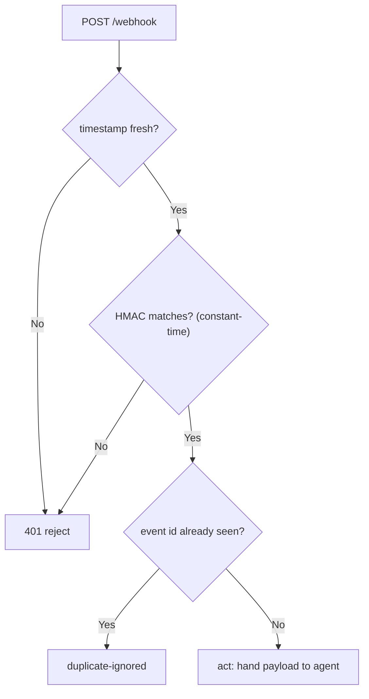

# Lab 3 — Webhooks with FastAPI, Sending, and Secrets Hygiene

**Time: ~3.5 hrs · Difficulty: Core · Builds on: Month 4 (`requests`, `.env`), Labs 1–2**

## Objective

An agent that only acts when you run it from the terminal is half an agent. In this lab you put it on the network — safely. You build a **FastAPI** endpoint that *receives* a webhook, verifies its **HMAC signature** (rejecting forgeries), and guards against **replays**. You build a *sender* that signs its requests the same way. You add a `fetch_url` tool gated by an **egress allowlist** so the agent can only reach hosts you name. And you put secrets where they belong — in environment variables, never in code, never in a log, never in the agent's context — and prove it by redacting a token before it can reach your JSONL trace. By the end, the agent can be woken by an event from the outside world without that endpoint being an open door.

## Setup

```zsh
cd ~/agentic/month-08
uv add fastapi "uvicorn[standard]" requests python-dotenv
printf 'WEBHOOK_SECRET=dev-shared-secret-change-me\n' >> .env
echo ".env" >> .gitignore
grep -q "^.env$" .gitignore && echo ".env is gitignored"
```

**Checkpoint:** `.env` exists with `WEBHOOK_SECRET`, and `.gitignore` contains `.env`. Confirm the secret is *not* tracked: `git status --short` must not list `.env`. A secret in Git history is a leaked secret forever.
**If not:** if `git status` lists `.env`, your `.gitignore` entry did not take (it must be the line `.env` with no trailing space) — fix it, then `git rm --cached .env` if it was already staged. If `WEBHOOK_SECRET` is missing, re-run the `printf ... >> .env` line from `~/agentic/month-08`.

## Background

**Recall first (from memory):** In Month 4 you *made* HTTP requests with `requests` and loaded secrets from `.env`. Two questions before you read: which direction does a webhook flow compared to a normal API call, and where did you keep a shared secret so it never reached Git? Answer, then verify below.

Read README §6–§8. A webhook is an inverted API: the outside service POSTs to *you* when something happens. Two dangers come free with any public endpoint — **forgery** (anyone can POST) and **replay** (the same valid request sent twice). The defenses are an **HMAC signature** verified with a constant-time compare, a **timestamp** you reject if stale, and a **seen-IDs** record for idempotency. Auth for *outbound* calls follows least privilege: scoped, short-lived tokens, never the full credential file, never in the model's context.

## Steps

The new skill of this lab is **verify-before-act**: a payload from the network is untrusted until its signature proves the sender holds the shared secret. Here is the gate every received event passes through:


*Notice: the request body is never trusted until all three gates pass — stale, forged, and replayed requests are all turned away before the agent ever sees the payload.*

Step 1 is the **worked** insecure version (so you feel the gap); Step 2 is the **worked** secure receiver; Step 3 fades it (you sign on the sender side to match); Step 5 is an **independent** egress guard.

### 1. The receiver, first without security (to see the gap)

Create `receiver.py`:

```python
# receiver.py
import os
from fastapi import FastAPI, Request
from dotenv import load_dotenv

load_dotenv()
app = FastAPI()

@app.post("/webhook")
async def receive(request: Request):
    payload = await request.json()
    print("RECEIVED:", payload)            # in the real toolkit, hand this to the agent
    return {"status": "accepted"}
```

```zsh
uv run uvicorn receiver:app --port 8000 &
sleep 2
curl -s -X POST localhost:8000/webhook -H 'content-type: application/json' -d '{"event":"push","repo":"demo"}'
```

**Checkpoint:** `curl` returns `{"status":"accepted"}` and the server prints the payload. Now notice the problem: *you did not prove who sent that.* Anyone who can reach this port can drive your agent. Stop the server (`kill %1`) before the next step.
**If not:** `uvicorn: command not found` → use `uv run uvicorn ...`. `Address already in use` → a previous server is up; `lsof -ti:8000 | xargs kill`. If `curl` hangs, the `sleep 2` was too short for startup — wait and retry.

### 2. Add HMAC signature verification (Stage 1 — worked)

This is the load-bearing step; study every line and run it before moving on. The sender and receiver share a secret. The sender computes `HMAC-SHA256(secret, raw_body)` and sends it in a header; the receiver recomputes it over the **raw bytes** and compares with a constant-time function. Rewrite `receiver.py`:

```python
# receiver.py
import os, hmac, hashlib, time, json
from fastapi import FastAPI, Request, HTTPException
from dotenv import load_dotenv

load_dotenv()
app = FastAPI()
SECRET = os.environ["WEBHOOK_SECRET"].encode()
SEEN_IDS: set[str] = set()                 # idempotency: event IDs we already handled
MAX_SKEW = 300                             # reject timestamps older than 5 minutes

def verify(raw: bytes, sig_header: str, ts_header: str) -> None:
    # reject stale requests (replay window)
    try:
        ts = int(ts_header)
    except (TypeError, ValueError):
        raise HTTPException(401, "missing/invalid timestamp")
    if abs(time.time() - ts) > MAX_SKEW:
        raise HTTPException(401, "timestamp outside allowed window")
    # recompute the signature over timestamp + body and constant-time compare
    expected = hmac.new(SECRET, f"{ts}.".encode() + raw, hashlib.sha256).hexdigest()
    if not hmac.compare_digest(expected, sig_header or ""):
        raise HTTPException(401, "bad signature")

@app.post("/webhook")
async def receive(request: Request):
    raw = await request.body()                       # the RAW bytes — sign these, not the parsed dict
    verify(raw, request.headers.get("x-signature"), request.headers.get("x-timestamp"))
    payload = json.loads(raw)
    event_id = payload.get("id")
    if event_id and event_id in SEEN_IDS:            # replay / duplicate delivery
        return {"status": "duplicate-ignored"}
    if event_id:
        SEEN_IDS.add(event_id)
    print("VERIFIED:", payload)                      # safe to hand to the agent now
    return {"status": "accepted"}
```

**Checkpoint:** restart the server and send a request with *no* signature:

```zsh
uv run uvicorn receiver:app --port 8000 &
sleep 2
curl -s -o /dev/null -w "%{http_code}\n" -X POST localhost:8000/webhook \
  -H 'content-type: application/json' -d '{"id":"e1","event":"push"}'
```

You get `401`. The unsigned (and unsigned-from-anyone) request is rejected. The door is no longer open.
**If not:** if you get `200` instead of `401`, the `verify` call is not wired into the route, or it does not raise — confirm `receive` calls `verify(...)` before `json.loads`. `KeyError: 'WEBHOOK_SECRET'` → `.env` is missing the key or `load_dotenv()` ran from the wrong directory.

### 3. The sender — sign requests correctly (Stage 2 — faded)

You just studied how the *receiver* verifies (`HMAC-SHA256` over `f"{ts}.".encode() + raw`, constant-time compare). Now build the *sender* that produces a signature the receiver will accept — the matching half of the same technique. The `sender.py` below is complete; the discipline to internalize is that the sender must sign the **exact same bytes** the receiver hashes. Read it, then prove you understand by predicting what happens if you change `json.dumps(payload)` to send a re-parsed dict (it breaks — the bytes differ).

```python
# sender.py
import os, hmac, hashlib, time, json
import requests
from dotenv import load_dotenv

load_dotenv()
SECRET = os.environ["WEBHOOK_SECRET"].encode()

def send(url: str, payload: dict) -> requests.Response:
    raw = json.dumps(payload).encode()
    ts = str(int(time.time()))
    sig = hmac.new(SECRET, f"{ts}.".encode() + raw, hashlib.sha256).hexdigest()
    return requests.post(
        url, data=raw, timeout=10,
        headers={"content-type": "application/json", "x-timestamp": ts, "x-signature": sig},
    )

if __name__ == "__main__":
    r = send("http://localhost:8000/webhook", {"id": "e42", "event": "push", "repo": "demo"})
    print(r.status_code, r.json())
```

```zsh
uv run python sender.py
```

**Checkpoint:** prints `200 {'status': 'accepted'}` and the server logs `VERIFIED: {...}`. A *correctly signed* request is accepted. You have now seen both sides: forgery rejected (Step 2), legitimate accepted (Step 3).
**If not:** `401 bad signature` on a request you signed almost always means the sender and receiver hashed different bytes — confirm the sender sends `data=raw` and the receiver reads `await request.body()`, and both prefix `f"{ts}."`. If the server isn't running, restart it (Step 2's `uvicorn` line).

### 4. Prove replay protection

Run the sender twice with the **same** `id` (the `__main__` uses `e42`):

```zsh
uv run python sender.py
uv run python sender.py
```

**Checkpoint:** the first call returns `accepted`; the second returns `duplicate-ignored`. The receiver remembered `e42` and refused to process it twice — so a replayed "do the irreversible thing" webhook fires the action at most once. (In production `SEEN_IDS` would be a persistent store, not an in-memory set, but the principle is identical.) Stop the server: `kill %1`.
**If not:** if the second call also returns `accepted`, the server was restarted between calls (the in-memory `SEEN_IDS` reset) or the payload `id` differs — keep one server process up and reuse the same `id`.

### 5. The egress allowlist for outbound calls (Stage 3 — independent)

Now the agent's outbound side — apply the same default-deny shape you've now seen three times (command allowlist, signature gate, and here) with only the goal given. Create `egress.py` with a `fetch_url(url)` tool that parses the URL's hostname, **rejects any host not in an explicit `ALLOWED_HOSTS` set** before sending, and truncates the response. The reference below shows the shape, but try writing the host check yourself first, then compare.

```python
# egress.py
from urllib.parse import urlparse
import requests

ALLOWED_HOSTS = {"api.github.com", "api.weather.gov"}

def fetch_url(url: str) -> str:
    host = (urlparse(url).hostname or "").lower()
    if host not in ALLOWED_HOSTS:
        raise ValueError(f"egress to '{host}' denied; allowed: {sorted(ALLOWED_HOSTS)}")
    resp = requests.get(url, timeout=15, headers={"user-agent": "safe-hands-agent"})
    resp.raise_for_status()
    return resp.text[:8000]      # truncate the chatty-tool trap (Month 6 §7)
```

**Checkpoint:**

```zsh
uv run python -c "from egress import fetch_url; print(fetch_url('https://api.github.com/zen')[:80])"
uv run python -c "from egress import fetch_url; fetch_url('https://evil.example.com/steal')"
```

The first prints a line of GitHub "zen" text; the second raises `ValueError: egress to 'evil.example.com' denied`. The agent can talk to exactly the hosts you named and no others — even if the model is convinced it should POST your data somewhere else.
**If not:** if the evil host is *not* rejected, you compared the full URL or a substring instead of `urlparse(url).hostname` membership in the set — exact hostname match only. If the GitHub call errors, you may be offline; the deny path is the one that matters for the guardrail.

### 6. Secrets hygiene: redact before you log

Your Month 6 agent writes a JSONL trace of every tool call. The moment a tool uses a token, that token must **not** land in the trace. Create `redact.py`:

```python
# redact.py
import re

SECRET_PATTERNS = [
    re.compile(r"(?i)(authorization|x-api-key|token|secret)\s*[:=]\s*\S+"),
    re.compile(r"sk-[A-Za-z0-9]{8,}"),     # OpenAI-style keys
    re.compile(r"gh[pousr]_[A-Za-z0-9]{20,}"),  # GitHub tokens
]

def redact(text: str) -> str:
    for pat in SECRET_PATTERNS:
        text = pat.sub("***redacted***", text)
    return text
```

Apply `redact()` to anything before it is written to the trace or printed. Quick test:

```zsh
uv run python -c "from redact import redact; print(redact('Authorization: Bearer sk-abc123def456ghi'))"
```

**Checkpoint:** the output shows `***redacted***`, not the key. Wire `redact()` into your agent's trace-writing function so no tool argument or result containing a credential is ever persisted. The principle from README §7 in code: the model never sees the full credential, and neither does the log.
**If not:** if the key still appears, your test string did not match a pattern — confirm the `sk-...` regex and that `redact()` is applied to the *string form* of the trace line, not a dict. Add a pattern for any credential shape your tools actually emit.

## Definition of Done

- A FastAPI `/webhook` endpoint that rejects unsigned/forged requests with `401` and accepts correctly signed ones with `200`.
- The signature is an HMAC over `timestamp + raw body`, verified with `hmac.compare_digest` (constant-time), with a timestamp-skew check.
- Replay protection: a duplicate `id` returns `duplicate-ignored`.
- A `sender.py` that signs requests so they pass verification.
- A `fetch_url` tool with an egress allowlist that refuses non-allowlisted hosts.
- `redact()` removes credentials before logging, and `.env` is gitignored and untracked.

Self-verify (server must be running):

```zsh
uv run uvicorn receiver:app --port 8000 & sleep 2
test "$(curl -s -o /dev/null -w '%{http_code}' -X POST localhost:8000/webhook -d '{}')" = "401" \
  && uv run python sender.py | grep -q accepted \
  && echo "DONE: forgery rejected, signed accepted"; kill %1
```

**Self-explain:** in one sentence, why must the sender and receiver compute the HMAC over the exact same raw bytes rather than over the parsed JSON object?

## Stretch Goals

1. **Hand the payload to the agent.** Instead of `print`, call your agent loop with the verified payload as the task. This is the milestone's webhook-to-agent path — build it early.
2. **Per-route tokens.** Add a second endpoint that requires a *scoped* bearer token (read vs. write scope) and reject a read token on the write route. Practices least privilege.
3. **Expose it publicly with ngrok.** `ngrok http 8000`, register the URL as a real GitHub repo webhook, and watch a real `push` event arrive (signature-verified). Note the cost: now the *whole internet* can reach your endpoint — the signature check is what stands between you and abuse.
4. **OAuth in miniature.** Sketch (no real provider needed) the authorization-code flow as a sequence diagram in a comment: redirect → consent → code → token exchange → scoped access token. Explain why the token expires.

## Troubleshooting

- **`401 bad signature` on a request you signed.** You almost certainly signed the *parsed* JSON, not the raw bytes, or the sender and receiver serialize differently. Sign and verify the **exact same bytes** — the sender sends `data=raw` and the receiver reads `await request.body()`.
- **`KeyError: 'WEBHOOK_SECRET'`.** `.env` is missing the key or `load_dotenv()` did not run from the project directory. Confirm `cat .env` and run from `~/agentic/month-08`.
- **`Address already in use` on port 8000.** A previous uvicorn is still running. `kill %1` or `lsof -ti:8000 | xargs kill`.
- **`uvicorn: command not found`.** Use `uv run uvicorn ...` so the project venv is on the path.
- **`raise_for_status` throws on `fetch_url`.** The remote returned a non-2xx. That is correct behavior — handle it in the tool wrapper and return the error to the model rather than crashing.
- **A secret slipped into a commit.** Rotate it immediately (it is compromised), then scrub history (`git filter-repo`) or, for a learning repo, start fresh. Prevention beats cleanup: `git diff --cached` before every commit.
