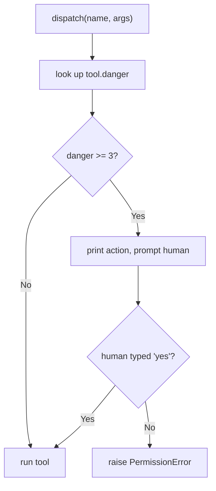

# Lab 4 — The Safe-Hands Toolkit (Milestone)

**Time: ~6 hrs · Difficulty: Core / Stretch · Builds on: Labs 1–3 and the entire month (plus Months 6–7)**

## Objective

Assemble everything into one defensible system: the **Safe-Hands Toolkit**. Your Month 7 agent gains a pluggable, **danger-rated** tool layer — filesystem (jailed, from Lab 1), shell (allowlisted *and* run inside an **ephemeral container**), web fetch (egress-gated, from Lab 3), and one **custom tool backed by your MCP server** (from Lab 2). Every tool declares a **danger level**, and any **level-3 (irreversible)** action stops at a **human-in-the-loop confirmation gate**. A **FastAPI webhook** (signature-verified, from Lab 3) hands payloads to the agent. A throwaway **Postgres** container demonstrates the **read-only role**: the agent connects as a `SELECT`-only role and a write is rejected *by the database itself*. Finally you write **`SECURITY.md`**, a threat-model artifact mapping every tool to its blast radius and guardrail. Done means you can recite the blast radius of every tool, and the agent physically cannot delete production data even if the model orders it to.

## Setup

```zsh
cd ~/agentic/month-08
uv add "psycopg[binary]"
# Start a container runtime. Colima (default) OR Podman — pick one.
colima start                      # Colima + docker CLI
# podman machine init && podman machine start   # Podman alternative
docker run -d --name pg-demo -e POSTGRES_PASSWORD=admin -p 5433:5432 postgres:16
sleep 5
docker exec pg-demo pg_isready    # should report "accepting connections"
```

**Checkpoint:** `docker ps` (or `podman ps`) shows `pg-demo` running and `pg_isready` accepts connections. You now have a disposable Postgres on port 5433 with no data you care about — perfect for issuing a real `DROP TABLE` and watching it get refused.
**If not:** `docker: command not found` after `colima start` → `brew install docker` (Colima is the engine; you still need the CLI). `Cannot connect to the Docker daemon` → `colima start` (or `podman machine start`). If `pg_isready` is not ready, the container needs a moment — increase the `sleep` and retry.

## Background

**Recall first (from memory):** Name the four guardrails you built in Labs 1–3 (hint: one for shell args, one for paths, one for outbound hosts, one for inbound events). For each, say in a few words what it bounds. This lab composes all four — recall them before you wire them together.

This lab is composition, not new theory. Read README §9 (danger levels, the human gate, containers, the read-only role) and skim §1–§8 as a checklist — every guardrail you built this month appears here. The one genuinely new idea is making **danger level a first-class property of a tool**, so the gate is structural (it lives in dispatch and keys off the tool's declared level), not an `if` you might forget.

## Steps

### 1. Danger levels as a tool property and the dispatch gate (Stage 1 — worked)

The genuinely new skill of this lab is making **danger level a structural property** that the dispatcher consults before running anything. Here is the decision the gate makes on every call:


*Notice: the gate keys off the tool's *declared* level, not an `if` buried in each tool — so a level-3 action cannot run without a human, by construction.*

Create `toolkit.py` exactly as below and study it. Every tool declares `name`, `schema`, a `danger` level (1/2/3), and a `run`. The registry dispatches through one function that consults the level *before* running. This is the worked example — Steps 2–3 fade it (you add containerization and the DB role to the same pattern), Step 4 is independent (you add a level-3 tool and demonstrate the gate yourself).

```python
# toolkit.py — danger-rated tool layer with a human-in-the-loop gate
from __future__ import annotations

# import the guardrails you already built
from jail import safe_path                 # Lab 1
from safe_cli import run_cli                # Lab 1 (we'll containerize it below)
from egress import fetch_url                # Lab 3
from mcp_tool import McpSlugifyTool         # Lab 2

def human_gate(action: str, danger: int) -> None:
    """Block level-3 (irreversible) actions until a human types 'yes'."""
    if danger >= 3:
        print(f"\n[CONFIRM] Level-{danger} (irreversible) action requested:\n  {action}")
        if input("  Proceed? type 'yes' to allow: ").strip() != "yes":
            raise PermissionError("human declined the action")

class Tool:
    name: str; danger: int; schema: dict
    def run(self, **kwargs) -> str: ...

class ReadFileTool:
    name, danger = "read_file", 1
    schema = {"type": "function", "function": {"name": "read_file",
        "description": "Read a text file inside the sandbox.",
        "parameters": {"type": "object", "properties": {"path": {"type": "string"}}, "required": ["path"]}}}
    def run(self, path: str) -> str:
        return safe_path(path).read_text(encoding="utf-8", errors="replace")[:8000]

class WriteFileTool:
    name, danger = "write_file", 2                      # mutates, but inside the jail
    schema = {"type": "function", "function": {"name": "write_file",
        "description": "Write a text file inside the sandbox.",
        "parameters": {"type": "object", "properties": {
            "path": {"type": "string"}, "content": {"type": "string"}}, "required": ["path", "content"]}}}
    def run(self, path: str, content: str) -> str:
        p = safe_path(path); p.parent.mkdir(parents=True, exist_ok=True)
        p.write_text(content, encoding="utf-8")
        return f"wrote {len(content)} bytes to {path}"

class FetchUrlTool:
    name, danger = "fetch_url", 1                       # read-only, egress-gated
    schema = {"type": "function", "function": {"name": "fetch_url",
        "description": "HTTP GET an allowlisted URL.",
        "parameters": {"type": "object", "properties": {"url": {"type": "string"}}, "required": ["url"]}}}
    def run(self, url: str) -> str:
        return fetch_url(url)

REGISTRY: dict[str, Tool] = {t.name: t for t in [
    ReadFileTool(), WriteFileTool(), FetchUrlTool(), McpSlugifyTool(),
]}

def dispatch(name: str, args: dict) -> str:
    tool = REGISTRY.get(name)
    if tool is None:
        raise ValueError(f"unknown tool '{name}'")
    human_gate(f"{name}({args})", tool.danger)          # gate keys off the DECLARED level
    return tool.run(**args)
```

**Checkpoint:** dispatch a level-1 and (we will add) a level-3 tool. For now:

```zsh
uv run python -c "from toolkit import dispatch; print(dispatch('fetch_url', {'url':'https://api.github.com/zen'})[:60])"
```

It runs without a prompt (danger 1). The gate only fires at level 3 — which you wire next.
**If not:** if it prompts for confirmation on a danger-1 tool, your `human_gate` threshold is wrong (must be `danger >= 3`). `ImportError` on `jail`/`safe_cli`/`egress`/`mcp_tool` → run from `~/agentic/month-08` where Labs 1–3 live, and confirm those files exist.

### 2. Containerize the shell tool (level 2, ephemeral) — Stage 2 (faded)

You have the danger-rated dispatch pattern from Step 1; now extend it with one more tool that follows the same structure, adding the container guardrail. Study the `ContainerShellTool` below, then register it as instructed.

Run the allowlisted command inside a throwaway container so a bad command dies with the container — no host filesystem except the jail, non-root, no network. Add to `toolkit.py`:

```python
import subprocess
from pathlib import Path

JAIL = Path("./sandbox").resolve()
ALLOWED = {"ls", "cat", "git", "python", "python3", "grep", "wc", "echo"}

class ContainerShellTool:
    name, danger = "run_shell", 2
    schema = {"type": "function", "function": {"name": "run_shell",
        "description": "Run an allowlisted command inside an ephemeral container, in the sandbox.",
        "parameters": {"type": "object", "properties": {
            "argv": {"type": "array", "items": {"type": "string"}}}, "required": ["argv"]}}}
    def run(self, argv: list[str]) -> str:
        if not argv or argv[0] not in ALLOWED:
            raise ValueError(f"'{argv[:1]}' not allowed; allowed: {sorted(ALLOWED)}")
        cmd = [
            "docker", "run", "--rm",            # --rm: destroy the container when done
            "--network", "none",                # no network unless explicitly granted
            "--user", "1000:1000",              # non-root
            "-v", f"{JAIL}:/work:rw",           # ONLY the jail is mounted
            "-w", "/work",
            "python:3.12-slim",                 # minimal image
            *argv,
        ]
        proc = subprocess.run(cmd, capture_output=True, text=True, timeout=60)
        return ((proc.stdout + proc.stderr).strip()[:4000]) or "(no output)"
```

Register `ContainerShellTool()` in `REGISTRY` (replacing the host-only Lab 1 CLI for the milestone). Pull the image once: `docker pull python:3.12-slim`.

**Checkpoint:**

```zsh
uv run python -c "from toolkit import dispatch; print(dispatch('run_shell', {'argv':['ls','-la']}))"
```

It lists the jail's contents — but the `ls` ran *inside a container* that no longer exists, with only `sandbox/` visible to it. Try `dispatch('run_shell', {'argv':['cat','/etc/hostname']})` and note it shows the *container's* hostname, not your Mac's: the process could not see your real filesystem. (Podman users: substitute `podman` for `docker` in the command list.)
**If not:** `docker: command not found` or daemon errors → see the Setup recovery. If the container "can see more than the jail," you added an extra `-v` mount or dropped `-w /work` — the only `-v` should be the jail. Pull the image first (`docker pull python:3.12-slim`) if the run stalls.

### 3. The read-only database role (defense by the database)

Create the read-only role and seed a table. Create `db_setup.sql`:

```sql
-- db_setup.sql
CREATE TABLE IF NOT EXISTS customers (id int PRIMARY KEY, name text);
INSERT INTO customers VALUES (1, 'Ada'), (2, 'Linus') ON CONFLICT DO NOTHING;

-- a role that can ONLY read. No INSERT/UPDATE/DELETE/DROP.
DROP ROLE IF EXISTS agent_ro;
CREATE ROLE agent_ro LOGIN PASSWORD 'ro-pass';
GRANT CONNECT ON DATABASE postgres TO agent_ro;
GRANT USAGE ON SCHEMA public TO agent_ro;
GRANT SELECT ON ALL TABLES IN SCHEMA public TO agent_ro;
```

```zsh
docker exec -i pg-demo psql -U postgres < db_setup.sql
```

Now a `query_db` tool that connects **as `agent_ro`** — the least-privilege role, never the admin. Add to `toolkit.py`:

```python
import psycopg

class QueryDbTool:
    name, danger = "query_db", 1     # read-only BY THE DATABASE, so danger stays low
    schema = {"type": "function", "function": {"name": "query_db",
        "description": "Run a read-only SQL query against the database.",
        "parameters": {"type": "object", "properties": {"sql": {"type": "string"}}, "required": ["sql"]}}}
    def run(self, sql: str) -> str:
        # connect as the SELECT-only role; the DATABASE enforces read-only, not us
        with psycopg.connect("host=localhost port=5433 dbname=postgres user=agent_ro password=ro-pass") as conn:
            with conn.cursor() as cur:
                cur.execute(sql)
                rows = cur.fetchall()
                return str(rows)[:4000]
```

Register `QueryDbTool()`.

**Checkpoint:** prove read works and write is *refused by Postgres*:

```zsh
uv run python -c "from toolkit import dispatch; print(dispatch('query_db', {'sql':'SELECT * FROM customers'}))"
uv run python -c "from toolkit import dispatch; print(dispatch('query_db', {'sql':'DROP TABLE customers'}))"
```

The `SELECT` returns the rows. The `DROP TABLE` raises `psycopg.errors.InsufficientPrivilege: permission denied for table customers` — and critically, that error comes from **Postgres**, not from your Python. Even if your code had a bug, even if the model is certain it should drop the table, the *role lacks the privilege*. This is the lesson: least privilege enforced at the resource, not hoped for in the application.
**If not:** if `DROP TABLE` *succeeds*, you connected as `postgres` (admin) — fix the connection string to `user=agent_ro`. Connection refused on 5433 → confirm the port map with `docker ps`. `psycopg` build errors → use `uv add "psycopg[binary]"`.

### 4. Add one level-3 tool and watch the gate (Stage 3 — independent)

Now do it without a worked example handed to you in pieces: add a deliberately irreversible tool so you can demonstrate the human gate. A `delete_path` (inside the jail, but irreversible) is a clean example. Add to `toolkit.py`:

```python
class DeletePathTool:
    name, danger = "delete_path", 3      # IRREVERSIBLE -> gated
    schema = {"type": "function", "function": {"name": "delete_path",
        "description": "Permanently delete a file inside the sandbox.",
        "parameters": {"type": "object", "properties": {"path": {"type": "string"}}, "required": ["path"]}}}
    def run(self, path: str) -> str:
        p = safe_path(path); p.unlink()
        return f"deleted {path}"
```

Register it.

**Checkpoint:**

```zsh
uv run python -c "from toolkit import dispatch; print(dispatch('delete_path', {'path':'calc.py'}))"
```

The dispatcher prints `[CONFIRM] Level-3 (irreversible) action requested: delete_path(...)` and waits for `yes`. Type `no` (or anything else) and it raises `PermissionError: human declined` — the file survives. Run it again and type `yes` to confirm it then deletes. The model can *request* an irreversible action all day; it cannot *execute* one without a human. (Re-seed `calc.py` if you deleted it.)
**If not:** if the gate does not appear, the tool's `danger` is not `3`, or you called the tool's `run` directly instead of `dispatch` — the gate lives in `dispatch`, so all calls must route through it. Confirm `DeletePathTool` is registered in `REGISTRY`.

### 5. The webhook-to-agent endpoint

Reuse the verified receiver from Lab 3, but hand the payload to your agent. Create `app.py`:

```python
# app.py — signature-verified webhook that wakes the agent
import os, hmac, hashlib, time, json
from fastapi import FastAPI, Request, HTTPException
from dotenv import load_dotenv
from agent import run_agent           # your Month 6/7 agent loop, now using toolkit.REGISTRY

load_dotenv()
app = FastAPI()
SECRET = os.environ["WEBHOOK_SECRET"].encode()

def verify(raw: bytes, sig: str, ts: str) -> None:
    if not ts or abs(time.time() - int(ts)) > 300:
        raise HTTPException(401, "stale or missing timestamp")
    expected = hmac.new(SECRET, f"{ts}.".encode() + raw, hashlib.sha256).hexdigest()
    if not hmac.compare_digest(expected, sig or ""):
        raise HTTPException(401, "bad signature")

@app.post("/agent-webhook")
async def agent_webhook(request: Request):
    raw = await request.body()
    verify(raw, request.headers.get("x-signature"), request.headers.get("x-timestamp"))
    payload = json.loads(raw)
    task = payload.get("task", "summarize the sandbox")
    result = run_agent(task)        # the agent runs with the danger-rated toolkit
    return {"status": "done", "result": result[:500]}
```

Make sure `run_agent` dispatches tools through `toolkit.dispatch` so the danger gate and all guardrails apply.

**Checkpoint:** start the app (`uv run uvicorn app:app --port 8000 &`), then fire a signed request with `sender.py` pointed at `/agent-webhook` carrying `{"id":"w1","task":"list the python files in the sandbox"}`. The endpoint verifies the signature, the agent runs the (level-1/2) tools, and you get a result. A forged request still returns 401. The outside world can now wake your agent — safely.
**If not:** `401` on a signed request → sign the raw bytes exactly as in Lab 3 (sender and receiver must serialize identically). If `import agent`/`run_agent` fails, point it at your actual Month 6/7 agent module and confirm `run_agent` dispatches through `toolkit.dispatch` so the guardrails apply. Port in use → `lsof -ti:8000 | xargs kill`.

### 6. Write `SECURITY.md`

This is a graded artifact. Create `SECURITY.md` enumerating every exposed tool as a threat-model row. Use this structure:

```markdown
# Safe-Hands Toolkit — Security Model

| Tool | Danger | Capability | Blast radius (worst case) | Guardrail | Residual risk |
|---|---|---|---|---|---|
| read_file | 1 | read a file | reads any file in the jail | working-dir jail (resolve+is_relative_to) | none beyond jail contents |
| write_file | 2 | write a file | corrupts/creates files in the jail | jail; danger 2 | jail contents only |
| run_shell | 2 | run a command | runs allowlisted cmd in a throwaway container | allowlist + ephemeral container, no host mount but jail, non-root, no network | container escape (low) |
| fetch_url | 1 | HTTP GET | contacts an allowlisted host | egress allowlist | data sent to allowlisted hosts only |
| query_db | 1 | read SQL | reads staging data | read-only DB role (SELECT only) — writes refused by Postgres | reads staging data |
| slugify (MCP) | 1 | pure function | none | pure function over a trusted local MCP server | supply chain (server we wrote) |
| delete_path | 3 | delete a file | irreversibly deletes a jail file | HUMAN CONFIRMATION GATE + jail | only after explicit human 'yes' |

## Threats mitigated
- RCE via shell injection -> argument lists, never shell=True; allowlist.
- Filesystem escape -> hardened jail (.., absolute, symlink, NUL all rejected).
- Data exfiltration -> egress allowlist.
- Production data loss -> read-only DB role; agent never holds write/admin creds.
- Forged events -> HMAC signature verification + replay protection.
- Secret leakage -> .env gitignored; secrets redacted before logging; never in model context.
- Irreversible mistakes -> level-3 human-in-the-loop gate.
```

Fill it in honestly for *your* toolkit, including residual risk (the risk that remains after the guardrail).

**Checkpoint:** for every tool in your `REGISTRY`, there is a row naming its blast radius and guardrail. If you cannot name a tool's blast radius, you are not ready to expose it — remove it or constrain it further.
**If not:** if a row's "residual risk" column is blank or reads "none," push harder — every guardrail leaves *some* residual risk (jail contents are still readable, the container could in theory be escaped, allowlisted hosts still receive data). Naming it honestly is the point of the artifact.

## Definition of Done

- A `REGISTRY` of tools, each with a declared `danger` level; `dispatch` consults the level and runs `human_gate` for level-3.
- Filesystem tools are jailed (Lab 1); the shell tool is allowlisted *and* runs in an ephemeral, non-root, no-host-mount, no-network container.
- The web-fetch tool enforces an egress allowlist; the MCP-backed `slugify` tool works through your Lab 2 server.
- A `query_db` tool connects as a `SELECT`-only role; a `DROP`/`DELETE` is rejected **by Postgres**.
- A level-3 action is blocked until a human types `yes`.
- A signature-verified FastAPI endpoint hands payloads to the agent.
- `SECURITY.md` maps every tool to blast radius, guardrail, and residual risk.
- The agent still falls back to Ollama for **$0** (Month 7) and writes a JSONL trace with secrets redacted (Lab 3).

Submit four artifacts: the toolkit source, the MCP server, a run trace showing (a) a level-3 action blocked by the gate and (b) a write rejected by the read-only role, and `SECURITY.md`.

Self-verify the two load-bearing guarantees:

```zsh
# 1) the database refuses a write from the agent's role
uv run python -c "from toolkit import dispatch; dispatch('query_db', {'sql':'DROP TABLE customers'})" 2>&1 | grep -qi "permission denied" && echo "DB read-only: ENFORCED"
# 2) the level-3 gate blocks without 'yes'
printf 'no\n' | uv run python -c "from toolkit import dispatch; dispatch('delete_path', {'path':'calc.py'})" 2>&1 | grep -qi "declined" && echo "Human gate: ENFORCED"
```

**Self-explain:** in one sentence, why does putting the danger check in `dispatch` (rather than inside each tool's `run`) make it impossible to forget the human gate for a new level-3 tool?

## Stretch Goals

1. **Network for the container, allowlisted.** Replace `--network none` with a custom network and an egress proxy so the containerized shell can reach only allowlisted hosts — unifying the container and egress guardrails.
2. **Persistent MCP session.** Use the Lab 2 stretch goal so the MCP-backed tool does not re-launch the server on every call.
3. **Audit log + replayable trace.** Make the JSONL trace rich enough to replay the run (timestamp, tool, danger, args-hash, result size, gate decision), with secrets redacted, and write a `replay.py` that re-narrates a run from the trace.
4. **A second read-only-by-construction resource.** Add a tool that reaches a *staging* API with a scoped, short-lived token, and document in `SECURITY.md` why it can never touch production.
5. **Deny the jail a `..` at the container boundary too.** Confirm that even with the container mount, a path the model passes cannot escape `/work` — test it.

## Troubleshooting

- **`docker: command not found` after `colima start`.** Install the client: `brew install docker`. Colima provides the engine; the `docker` CLI talks to it.
- **`Cannot connect to the Docker daemon`.** Colima isn't running: `colima start`. For Podman: `podman machine start`, and use `podman` in place of `docker`.
- **Postgres connection refused on 5433.** The container maps `5432`→`5433` on the host; confirm with `docker ps`. If 5433 is taken, map a different host port and update the connection string.
- **`query_db` succeeds at `DROP TABLE`.** You connected as `postgres` (admin), not `agent_ro`. Check the connection string uses `user=agent_ro`. The whole point is to connect as the powerless role.
- **The human gate doesn't appear.** The tool's `danger` is < 3, or dispatch bypassed `human_gate`. Confirm `delete_path.danger == 3` and that you call `dispatch`, not the tool's `run` directly.
- **`psycopg` install/build errors.** Use `uv add "psycopg[binary]"` (the binary wheel) to avoid needing local Postgres headers.
- **Container can see more than the jail.** You added an extra `-v` mount or omitted `-w /work`. The only `-v` should be the jail; verify with `dispatch('run_shell', {'argv':['ls','/']})` showing a bare container root, not your home directory.
- **Webhook returns 401 for a signed request.** Sign the raw bytes exactly as in Lab 3; the receiver and sender must serialize identically.
