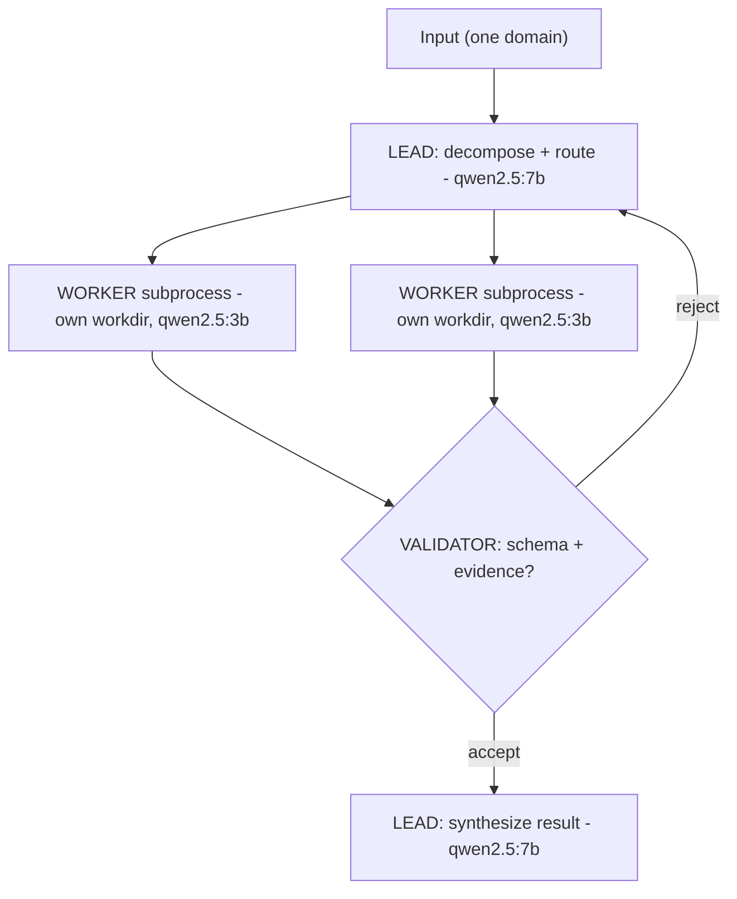
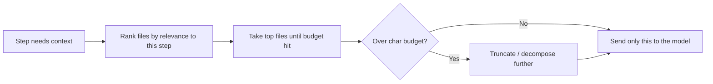
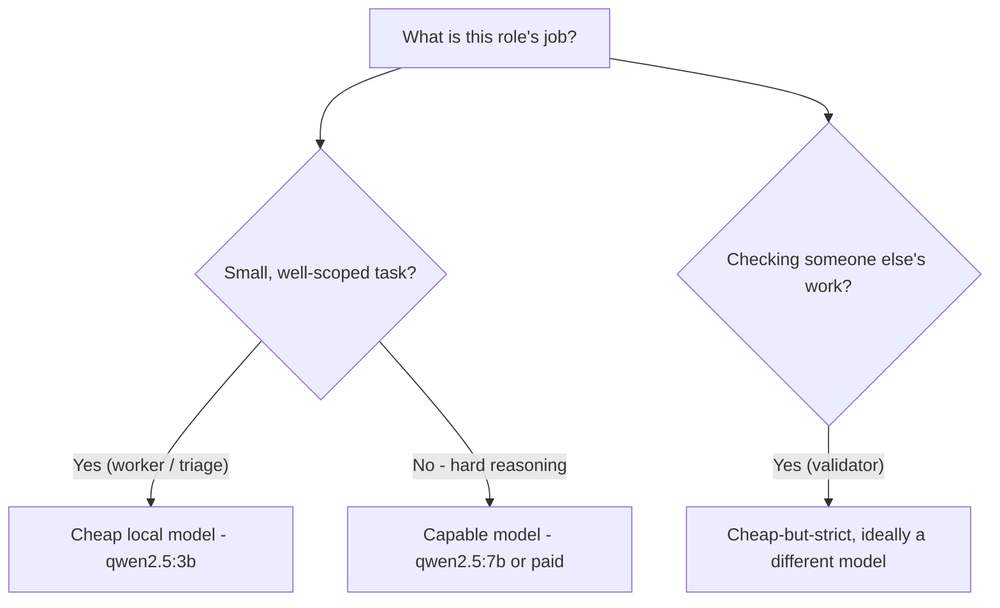
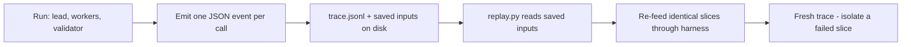

# Month 09 — Agent Harnesses

**Pillar 1 — Agent Harnesses**

## Overview

For three months you have been building *one* agent and making it safe and flexible: a from-scratch loop with tools and a JSONL trace (Month 6), a model and tool layer that are pluggable behind interfaces with a config-driven fallback to local Ollama (Month 7), and a danger-rated tool layer with sandboxes, allowlists, and human gates (Month 8). You now own a single, secured, provider-agnostic agent. This month you stop treating that agent as the product and start treating it as a *component*. The product is the **harness**.

Here is the thesis, and it is the spine of this entire pillar: **the default agents are the floor of capability, not the ceiling.** Claude Code, Codex CLI, and Cursor are extraordinary general-purpose harnesses — and they are general on purpose, which means they are mediocre at *your* specific domain by design. They load whatever files seem relevant, expose a broad set of tools, and trust one big model to figure it out. That is exactly the right call when you do not know what the user will ask. It is exactly the wrong call when you know precisely what the job is — triaging a security log, reviewing a Python PR, grading a stack of submissions — because then "whatever seems relevant" wastes the agent's attention, "a broad set of tools" widens the blast radius for no reason, and "one big model for everything" burns money on triage that a 3B local model could do for free. A custom harness beats a default agent on a known domain the same way a purpose-built jig beats a Swiss Army knife: not because it is fancier, but because it does the one thing and refuses to do anything else.

So what *is* a harness? It is four things, welded to one domain: **a loop** (you already have it), **a set of tools** (narrowed to exactly what the domain needs and nothing more), **a context strategy** (which files, logs, and facts get loaded into the model's limited attention — and, crucially, which do *not*), and **guardrails** (the danger levels, sandboxes, and gates from Month 8, tuned to this domain's specific failure modes). Design those four things *for one domain* and you have a harness. The reason this matters more as agents get capable is that a capable agent pointed at the wrong context, with too many tools, and no domain guardrails, is not powerful — it is a fast way to produce confident, expensive nonsense.

The other half of the month is **multi-agent orchestration**, because real domains are too big for one context window and one set of tools to handle cleanly. You will learn the **team-lead / worker / validator** pattern: a **LEAD** decomposes the job and routes slices; **WORKERS** each handle one slice with a *narrow* context and *tight* tools; a **VALIDATOR** checks the result before it is allowed to return. Each sub-agent runs in **its own subprocess with its own working directory** (reusing Month 8's sandbox), and each role gets its **own model** (cheap/local for triage, expensive/large for synthesis — never one model for everything, reusing Month 7's pluggable providers). Every run is **traced and replayable**. The month ends with the **Triage Harness** milestone — a real three-role harness on a domain you pick — and the bar is that you can defend, in a fifteen-minute talk, why this harness exists and why a default agent would have failed at it.


*Notice: the LEAD never does the detailed work — it splits the job and routes slices to cheap-model WORKERS in isolated subprocesses; the VALIDATOR can bounce a result back before the capable model synthesizes. Per-role model routing is right there in the node labels.*

## Prerequisites

Coming in, you should be able to do everything from Months 1 through 8:

- Work fluently in zsh on macOS, use Git, read HTTP/JSON, and call APIs from Python with timeouts, retries, and `.env`-loaded secrets (Months 1–2, 4).
- Write structured Python with classes, `Protocol`-based interfaces, dependency injection, `pytest`, type hints, and structured logging (Month 5).
- Hand-write and explain the agent loop, run a tool-call round-trip, apply the working-directory jail, and write a JSONL trace (Month 6).
- Swap the model and tool layers behind interfaces with a config-driven fallback chain to local Ollama (Month 7).
- Invoke a CLI safely with `subprocess` (argument lists, timeouts), enforce an allowlist and a hardened jail, run a tool inside an ephemeral Colima/Podman container, and rate tools by danger with a human gate (Month 8).

You do **not** need any prior distributed-systems or orchestration experience. We build the multi-agent pattern from the single agent you already own.

## Warm-Up: Retrieve Before You Begin

Before reading on, answer these from memory — no peeking at earlier months. This pulls forward the prior skills this month builds on.

1. In one sentence, what *is* the agent loop you wrote in Month 6, and what is the line that records each step for later inspection?
2. Month 7 made your model layer pluggable behind an interface with a fallback chain. When the primary provider is unreachable, what happens, and where does the run end up running?
3. Month 8 rated tools by danger and ran risky ones in isolation. Name two of the mechanisms (jail / sandbox / danger level / human gate) and what each one bounds.
4. Why does pointing a general agent at a known, narrow job (say, triaging one log directory) tend to waste both money and quality?

<details><summary>Check your recall</summary>

1. A `while` loop that calls the model, parses any tool call, runs the tool, appends the result to `messages`, and repeats until the model stops asking for tools (Month 6, Lab on the agent loop). Each step is appended as a line to a **JSONL trace** for replay/inspection.
2. The agent selects a provider/model by **config**; if that provider fails or is unreachable, the **fallback chain** degrades to the next provider — in this course, local **Ollama** — so the run survives (Month 7).
3. Any two of: the **working-directory jail** (bounds which paths a tool can touch), the **ephemeral container sandbox** (bounds what a shell tool can reach/damage), **danger levels** (classify a tool's blast radius), the **human gate** (a person must approve an irreversible action). All from Month 8.
4. A general agent loads "whatever seems relevant" (wrong/too much context → lost-in-the-middle quality loss), exposes broad tools (needless blast radius), and runs one big model for everything (overpays for trivial triage). This month's harness fixes all three — the thesis of §1.
</details>

## Learning Objectives

By the end of this month you can:

1. **Define** what an agent harness is — loop, tools, context strategy, guardrails, tailored to one domain — and **explain** why a custom harness beats a general-purpose agent on a known domain.
2. **Model** a domain into a harness spec: enumerate the tasks, the minimum tools, the exact context each step needs, and the domain-specific failure modes that drive the guardrails.
3. **Engineer context** deliberately — load only the files/facts a step needs, budget the attention you spend, and **explain** why loading everything degrades quality, not just cost.
4. **Implement** sub-agent delegation: a parent spawns a child agent in its own subprocess with a narrower context and a tighter toolset, and collects a structured result.
5. **Build** a team-lead / worker / validator orchestration where a LEAD decomposes and routes, WORKERS execute focused slices, and a VALIDATOR checks results before they return.
6. **Route** models per role through Month 7's pluggable providers — a cheap/local model for triage, a larger/optional-paid model for synthesis — and **justify** each choice on cost and capability.
7. **Sandbox** each child agent in its own working directory (and optionally an ephemeral container), reusing Month 8's guardrails, and **state** the blast radius of every tool each role can touch.
8. **Produce** a per-run trace artifact for the whole harness — every sub-agent call, model, tool, and result — that is auditable and **replayable** from disk.
9. **Defend** a harness design: articulate why it exists, why a default agent would fail at the domain, and what each role and guardrail buys you, in a short talk backed by a `POSTMORTEM.md`.

## Tech Stack (free, macOS)

| Tool | Install | Why |
|---|---|---|
| Python 3.12+ via uv | `brew install uv`; `uv python install 3.12` | From Month 3. Every harness is a `uv` project; sub-agents run as `uv run` subprocesses. |
| Ollama + two models | `brew install ollama`; `ollama pull qwen2.5:3b` and `ollama pull qwen2.5:7b` | The **free** model layer. A small model (`3b`) does triage; a larger one (`7b`) does synthesis — role-based routing at **$0**. |
| Your Month 7 `llm` package | (from Month 7) | The pluggable providers + fallback chain. Each role selects a provider/model by config. |
| Your Month 8 guardrails | (from Month 8) | The jail, allowlisted CLI, egress gate, danger levels, and container sandbox — reused per role. |
| Colima (optional) | `brew install colima docker` | Run a worker's shell tool in an ephemeral container if its slice touches the shell. Optional; per-subprocess working dirs satisfy the core requirement. |
| `pydantic` | `uv add pydantic` | Validate the structured result each sub-agent returns, so a malformed worker reply fails loudly at the boundary, not three steps later. |
| `pytest` | `uv add --dev pytest` | From Month 5. Test the orchestrator's decomposition/routing and the validator's accept/reject logic on fixtures. |
| `anthropic` (optional, paid) | `uv add anthropic` | Only if you want a frontier model for the synthesis/validator role. A larger local model substitutes for **$0**. |

**Cost summary.** This month is **$0**. Two local Ollama models cover the cheap-triage and the larger-synthesis roles, so the entire team-lead/worker/validator pattern — including the milestone — runs locally for free. The **paid** path (a frontier model for synthesis or validation) is optional and labeled wherever it appears; a single milestone run on a small frontier model moves a few hundred thousand tokens and costs a few cents, but you never *have* to spend it. The whole point of per-role routing is that you spend money only where it actually buys quality, and most roles don't need it.

## Weekly Breakdown

Budget ~8–12 hours per week: roughly a third reading the Core Concepts, the rest building harnesses and breaking them on purpose.

### Week 1 — What a harness is, and modeling a domain
**Warm-start (do this first):** before any new material, re-run your Month 6 single agent on a small task and open its JSONL trace. Then add one line that prints the total characters you fed into the model this run. That number — the context you spent — is the thing this whole month learns to *budget*. Keep that agent handy; the harness is built around it, not instead of it.
**Focus:** the anatomy of a harness and the discipline of context engineering, applied by designing one harness on paper and scaffolding it.
**Topics:** harness = loop + tools + context strategy + guardrails, tailored to one domain; why default agents (Claude Code / Codex / Cursor) are the floor, not the ceiling; **domain modeling** (what a DevOps harness needs that a billing harness does not — different tools, different context, different failure modes); **context engineering** (the attention budget; load the right files, not all of them; why a stuffed context *degrades* quality); the blast-radius question for every tool you expose.
**Reading:** Core Concepts §1–§3.
**Build:** Lab 1 — write a one-page harness spec for a domain, then scaffold a `harness/` package: a `HarnessConfig`, a context-loader that selects only the files a step needs, a narrowed tool set, and a single-agent run that already out-focuses a default agent on the domain.

### Week 2 — Sub-agents, orchestration, and per-role models
**Focus:** turn one agent into a team — lead, workers, validator — each in its own subprocess with its own model and sandbox.
**Topics:** **sub-agent delegation** (a parent spawns a child with a narrower context and tighter tools and collects a structured result); the **team-lead / worker / validator** pattern (decompose → route → execute → validate → return); running each sub-agent in **its own subprocess and working directory**; **model routing per role** (cheap/local triage vs. larger/optional-paid synthesis) through Month 7's providers; **sandboxing children** (per-subprocess working dir, optionally an ephemeral container); validating a worker's structured output before trusting it.
**Reading:** Core Concepts §4–§7.
**Build:** Lab 2 — a working orchestrator: a LEAD that decomposes a task into slices and routes them, WORKERS spawned as subprocesses with constrained tools and per-role models, and a VALIDATOR that accepts or rejects each result, all wired to Month 7's fallback and Month 8's sandbox.

### Week 3 — Trace, replay, and the Triage Harness (milestone)
**Focus:** make every run an auditable, rerunnable artifact, then ship a full three-role harness on a real domain.
**Topics:** **trace and replay** (every harness run writes a structured artifact recording each sub-agent call — role, model, context loaded, tools used, result — and can be *replayed* from disk for debugging and audit); designing for replay (deterministic seeds where possible, recording inputs not just outputs); the **postmortem** as an engineering artifact (a run that went wrong, the root cause, the fix); preparing the fifteen-minute defense.
**Reading:** Core Concepts §8–§9.
**Build:** Lab 3 — the **Triage Harness** milestone: pick one real domain (incident triage from a log directory, PR review for a Python repo, or a Canvas-style grading harness), build the full LEAD/WORKER/VALIDATOR harness with per-subprocess sandboxes, model fallback, trace files for every run, three completed runs on realistic inputs, and a `POSTMORTEM.md`.

### Week 4 — Hardening and the defense
**Focus:** tighten the harness, prove replay works, and rehearse the defense that the whole pillar is graded on.
**Topics:** reviewing the harness through the five lenses (is each tool's blast radius stated? is each model choice justified? is every run traced and replayable?); strengthening the validator (what should it reject that it currently lets through?); writing the talk — why this harness exists, why a default agent fails here, what each role buys; closing the convergence checklist.
**Reading:** re-read §1–§9 as a checklist; review your `POSTMORTEM.md`.
**Build:** finish and harden Lab 3; record/replay one trace end-to-end; draft the fifteen-minute defense as `harness/DEFENSE.md` or speaker notes.

## Core Concepts

### §1 — A harness is a loop, tools, context, and guardrails — welded to one domain

You already have an agent: a loop that calls a model, parses tool calls, runs tools, feeds results back, and stops (Month 6). A **harness** is that loop plus three deliberate design decisions made *for a specific domain*:

- **Tools** — not "every tool I have," but the minimum set this domain needs. A PR-review harness needs `read_file`, `git diff`, and `run_tests`; it does **not** need a `delete_file` or a `fetch_url`. Every tool you leave out is a blast radius you don't have to defend.
- **Context strategy** — what gets loaded into the model's limited attention at each step (§3). A grading harness loads *one* student's submission and the rubric, not the whole class.
- **Guardrails** — Month 8's danger levels, sandboxes, and gates, tuned to *this* domain's failure modes. An incident-triage harness must never *write* to the logs it reads; a grading harness must never email a student a grade without a human gate.

> **Common misconception.** A harness is just a bigger, better system prompt.
> **Reality.** A prompt is *words you send the model*. A harness is the **loop + tools + context strategy + guardrails** wrapped around the model for **one domain** — the parts that decide *which* files the model ever sees, *which* tools it can call, and *what* it is structurally forbidden to do. The prompt rides inside the harness; it is one input, not the machine.

The single most important framing of this pillar is that **the default agents are the floor, not the ceiling.** Claude Code and Codex CLI are superb *general* harnesses — and "general" is the source of both their power and their limits. They must guess what is relevant because they cannot know your domain; they expose broad tools because they cannot know what you'll need; they lean on one big model because they cannot know what's worth optimizing. When *you* know the domain, you can do better on every axis: load exactly the right context, expose exactly the right tools, route exactly the right model per step, and bound exactly the right failure modes. A harness is what "better than the default" concretely *is*. It is also why this is a from-scratch pillar: you cannot meaningfully customize a harness you didn't build.

### §2 — Domain modeling: what a DevOps harness needs that a billing harness does not

Before you write a line of harness code, you model the domain. Domain modeling for a harness answers four questions, and the answers are *different for every domain* — which is the entire reason a custom harness wins:

1. **What are the tasks?** Incident triage: classify a log spike, find the first error, correlate across files, propose a cause. PR review: read the diff, run the tests, check style, summarize risk. These task lists barely overlap.
2. **What is the minimum toolset?** Triage needs read-only log access and `grep`; it must **not** write. PR review needs `git diff` and a test runner; billing needs a *read-only* DB role and a ledger-arithmetic tool but absolutely no shell. The toolset *is* the blast-radius decision.
3. **What context does each step actually need?** Triage: the relevant log window, not every log. Grading: one submission plus the rubric, not the class. Loading the wrong context is the dominant quality killer (§3).
4. **What are the domain's failure modes?** Triage's nightmare is a false "all clear." Billing's nightmare is a double-charge. Grading's is an unfair grade with no audit trail. **The failure modes drive the guardrails** — and they are domain-specific, which is precisely what a general agent can't tune for.

The exercise in Lab 1 is to write this down as a one-page spec *before* coding. A harness designed from a domain model is tight; a harness grown by accretion is a default agent wearing a costume.

### §3 — Context engineering: attention is a budget

> **Common misconception.** To be safe and thorough, load *all* the files into context so the model has everything it might need.
> **Reality.** Context is a **budget**, not a safety net. More is not safer — it is *worse*. A model handed 40 files to find one bug performs measurably worse than the same model handed the 3 files that matter (the **lost-in-the-middle** effect), and it is now also more likely to act on the wrong one. "Load everything" feels diligent; it is the single biggest quality killer in this month.

A model's context window is finite, but the deeper truth is subtler: **attention is a budget, and spending it badly degrades quality, not just cost.** It is tempting to think "load everything and let the model sort it out." Three things go wrong. First, **cost and latency** scale with tokens — obvious, and the least important. Second, and more important, models exhibit a **"lost in the middle"** effect: relevant facts buried in a long context get *less* weight than the same facts in a short, focused one. A model handed 40 files to find one bug performs *worse* than the same model handed the 3 files that actually matter — the noise drowns the signal. Third, irrelevant context invites the model to **act on the wrong thing** (read the wrong log, edit the wrong file).

So context engineering is the discipline of loading the *right* files into the *right* step, and deliberately leaving the rest out. Concretely:

```python
# A context loader that selects, not dumps.
def load_context_for(step: str, paths: list[Path], budget_chars: int = 12_000) -> str:
    chosen = select_relevant(step, paths)      # e.g. files matching the slice, ranked
    blob, used = [], 0
    for p in chosen:
        text = p.read_text()[:budget_chars - used]
        blob.append(f"# FILE: {p.name}\n{text}")
        used += len(text)
        if used >= budget_chars:
            break
    return "\n\n".join(blob)
```


*Notice: the loader spends a fixed budget on the most relevant slice and stops — the rest of the directory never reaches the model's attention.*

The harness, not the model, decides what the model sees. This is also *why* sub-agents win (§4): a worker with a narrow slice gets a *small, clean* context, so it performs better on its slice than one mega-agent juggling everything in a bloated window. Context engineering and decomposition are the same insight at two scales.

### §4 — Sub-agent delegation: a parent spawns narrower children

> **Heavy concept ahead.** Slow down here; this is the load-bearing idea of the month. Everything before it (harness, context budget) was setting up *one* agent well. Delegation and orchestration (§4–§5) are where one agent becomes a team — read these two sections twice, and build Lab 2 slowly. If only one idea sticks this month, make it this one.

A single agent has one context and one toolset for the whole job. **Sub-agent delegation** breaks that: a parent agent spawns a **child** to handle a sub-task, and the child gets its *own*, *narrower* context and a *tighter* toolset. The child does its slice, returns a structured result, and exits. The parent never pollutes its own context with the child's intermediate reasoning — it gets only the clean result.

The mechanism, reusing what you already own, is a **subprocess**. The child is just your agent, run as a separate process with a different working directory, a different system prompt, a restricted tool set, and a different model. The parent invokes it, passes the slice as input, and reads a structured result (JSON) back from stdout:

```python
import subprocess, json
from pathlib import Path

def spawn_worker(slice_spec: dict, workdir: Path, model: str) -> dict:
    """Run a child agent as a subprocess in its own working dir; return its structured result."""
    proc = subprocess.run(
        ["uv", "run", "worker.py", "--model", model],
        input=json.dumps(slice_spec),
        cwd=workdir,                 # the child's jail: its own working directory
        capture_output=True, text=True, timeout=300,
    )
    if proc.returncode != 0:
        raise RuntimeError(f"worker failed: {proc.stderr[:500]}")
    return json.loads(proc.stdout)   # validated against a schema by the caller (§7)
```

This is delegation done with the most boring, most robust isolation primitive available: an OS process. Each child gets its own memory, its own working directory (Month 8's jail, now per-child), and its own model. When it exits, its mess exits with it. You can harden further by running the subprocess inside an ephemeral container (Month 8), but a per-child working directory plus a tight toolset is the *core* requirement and is enough for the milestone.

### §5 — Team-lead / worker / validator: the orchestration pattern

Delegation gives you parents and children; the **team-lead / worker / validator** pattern gives that structure a shape that maps onto real work:

- **LEAD (orchestrator).** Takes the whole job, **decomposes** it into slices, and **routes** each slice to a worker. The lead does *not* do the detailed work — it plans and delegates. It uses a capable model because decomposition is the hardest reasoning step, but it touches *no* dangerous tools itself; its only power is to spawn workers.
- **WORKER.** Takes one slice with a narrow context and a tight toolset, does the focused work, and returns a structured result. Workers are interchangeable and parallelizable. Most workers run a **cheap/local** model because their slice is small and well-specified (§6).
- **VALIDATOR.** Before any worker result is allowed to return, the validator **checks** it: does it conform to the schema, is it self-consistent, does it actually answer the slice, does it cite evidence? A failed validation is sent back (re-run the worker, or escalate to a bigger model) rather than passed upward. The validator is the harness's immune system — it is what stops a confident-but-wrong worker from poisoning the final result.

```
            ┌──────────────┐
input ───▶  │     LEAD     │  decompose + route   (capable model, no risky tools)
            └──────┬───────┘
        ┌──────────┼──────────┐
        ▼          ▼          ▼
    ┌───────┐  ┌───────┐  ┌───────┐
    │WORKER │  │WORKER │  │WORKER │   each: own subprocess, own workdir,
    └───┬───┘  └───┬───┘  └───┬───┘   narrow context, tight tools, cheap model
        └──────────┼──────────┘
                   ▼
            ┌──────────────┐
            │  VALIDATOR   │  accept / reject each result  (checks, then returns)
            └──────┬───────┘
                   ▼
                result
```

The pattern's payoff is that each role is *simple* and *bounded*, which makes the whole system debuggable and the trace (§8) readable. Compare this to one giant agent doing everything in one context: when it goes wrong, you have a 50-step transcript and no idea which decision was the bad one. With roles, the trace tells you *exactly* which worker, on which slice, with which model, produced the bad result — and the validator usually caught it.

### §6 — Model routing per role: never one model for everything

Month 7 made your providers pluggable so you could swap models by config. The harness is where that pays off, because **different roles want different models.** Using one big model for everything is the default-agent mistake in a new form: you overpay for the easy steps and you have no cheap path for the parallel ones.

> **Common misconception.** The safest, highest-quality design is to use one strong model for every role.
> **Reality.** Different roles have different jobs, and a strong model is the *wrong* tool for most of them. Triage and per-slice worker tasks are small, well-scoped classifications — a 3B local model does them for **$0**, fast, and in parallel; spending frontier money there is pure waste. Only the hard reasoning steps (decomposition, final synthesis) earn a capable model. Route per role, and you get *better* quality and lower cost than one-model-for-everything, not a tradeoff between them.


*Notice: the decision is driven by the role's job, not by "use the best model everywhere" — and the validator deliberately uses a different model for a cheap second opinion.*

- **Triage / workers → cheap and local.** A worker classifying a log line or checking one file against a rule is doing a small, well-scoped task. A 3B local model on Ollama does it for **$0**, fast, and in parallel across many workers. Spending frontier-model money here is pure waste.
- **Synthesis / lead → capable (larger local, or optional paid).** Decomposition and final synthesis are the hard reasoning. A larger local model (`qwen2.5:7b`) handles it for free; a frontier model (optional, paid) handles it better if the domain warrants the cents.
- **Validator → cheap-but-strict, or a second opinion.** Validation is often a cheap, mechanical check (schema, citation, consistency) a small model handles fine — and using a *different* model than the worker gives you a useful second opinion at low cost.

You wire this through Month 7's config: each role names a provider/model and inherits the fallback chain (so a worker whose model is unreachable falls over to Ollama and the run survives). Justifying each choice — "triage on `3b` because it's a classification, synthesis on `7b` because it's the reasoning step" — is part of the milestone's defense.

### §7 — Validating a sub-agent's result before you trust it

A worker returns text from a language model. **You must not trust it on faith.** The boundary between a child's stdout and the parent's logic is exactly where a malformed, hallucinated, or off-task result should be caught. Validate the *structure* with a schema and the *substance* with checks:

```python
from pydantic import BaseModel, ValidationError

class WorkerResult(BaseModel):
    slice_id: str
    finding: str
    severity: str          # must be one of: low, medium, high, critical
    evidence: list[str]    # file:line citations; empty list is a red flag

def validate(raw: dict) -> WorkerResult | None:
    try:
        r = WorkerResult(**raw)
    except ValidationError:
        return None                         # structural failure → reject
    if r.severity not in {"low", "medium", "high", "critical"}:
        return None
    if r.severity in {"high", "critical"} and not r.evidence:
        return None                         # a serious claim with no evidence → reject
    return r
```

A rejected result is *not* silently dropped — it is logged to the trace and re-dispatched (rerun the worker, escalate to a larger model, or surface to a human gate for the dangerous domains). This is the same defense-in-depth posture as Month 8's read-only DB role: don't *hope* the worker is right, *structurally refuse* to accept a result that fails the check.

### §8 — Trace and replay: every run is an auditable, rerunnable artifact

Month 6 gave each agent run a JSONL trace. A harness run is bigger — a lead, several workers, a validator, multiple models — so its trace is correspondingly richer, and it must capture **every sub-agent call**: the role, the model used (and which fallback actually served it), the context that was loaded, the tools called, the raw result, and the validator's verdict. Written to `runs/<timestamp>/trace.jsonl`, this is two things at once: an **audit trail** (what did the harness do, with what, and why) and a **replay artifact** (you can re-run the exact same inputs to reproduce a result or debug a failure).

```python
import json, time
from pathlib import Path

class RunTrace:
    def __init__(self, run_dir: Path):
        run_dir.mkdir(parents=True, exist_ok=True)
        self.f = (run_dir / "trace.jsonl").open("w")
    def emit(self, **event):
        event["ts"] = time.time()
        self.f.write(json.dumps(event) + "\n")
        self.f.flush()
# usage:
# trace.emit(role="lead", action="decompose", slices=[...])
# trace.emit(role="worker", slice_id="s1", model="qwen2.5:3b", served_by="ollama", result={...})
# trace.emit(role="validator", slice_id="s1", verdict="accept")
```


*Notice: replay works only because the run saved its inputs, not just its outputs — the saved `slices.json` is what makes the run rerunnable.*

**Replay** means recording *inputs* alongside outputs: store the slice specs and the loaded context (or a content hash + path) so a later `replay.py` can feed the identical inputs back through the harness. Because language models are not perfectly deterministic, "replay" gives you *reproducibility of the pipeline*, not bit-identical model output — but it lets you re-run a failed slice in isolation, swap one role's model, and see what changes. Traceability is non-negotiable for a system that takes actions: if you cannot say what your harness did and re-run it, you cannot debug it, audit it, or defend it.

### §9 — The blast-radius question, and the postmortem

Two disciplines from earlier months carry the most weight here. First, **ask the blast-radius question for every exposed tool, per role.** It is no longer "what can the agent do" but "what can *this role* do" — the lead can spawn workers but touches no risky tools; a worker has read-only log access and nothing else; only a deliberately privileged role (gated, from Month 8) can take an irreversible action. Decomposing by role *shrinks* every individual blast radius, which is a security win on top of a quality win.

Second, the **postmortem** is an engineering artifact, not a confession. Every real harness produces a run that goes wrong — a worker hallucinates, the lead mis-routes a slice, the validator lets a bad result through. The milestone requires a `POSTMORTEM.md` for one such run: what was the input, what did the harness do (from the trace), what was the root cause, and what concrete change fixed it (a tighter validator rule, a better decomposition prompt, a model swap for one role). Writing the postmortem is how you prove the harness is *owned*, not just assembled — you understand its failure modes well enough to have fixed one. This, plus the fifteen-minute defense, is the real definition of done for the pillar: not that the harness ran, but that you can explain why it exists, why a default agent would have failed at the domain, and what every role and guardrail buys.

## Labs

| Lab | Title | Time | Difficulty |
|---|---|---|---|
| [Lab 1](lab-1-harness-anatomy-and-domain-modeling.md) | Harness Anatomy, Domain Modeling, and Context Engineering | ~3.5 hrs | Core |
| [Lab 2](lab-2-sub-agent-orchestration-and-model-routing.md) | Sub-Agent Delegation: Lead / Worker / Validator with Per-Role Models | ~4.5 hrs | Core |
| [Lab 3](lab-3-triage-harness-milestone.md) | The Triage Harness (Milestone) | ~6 hrs | Core / Stretch |

## Checkpoints & Self-Assessment

Run these against yourself at the end of each week. You are on track if you can do them without looking it up.

- **Week 1:** Define "harness" in one sentence (loop + tools + context + guardrails, one domain). For a domain of your choice, list the four domain-modeling answers (tasks, minimum tools, per-step context, failure modes). Explain why loading 40 files to find one bug performs *worse* than loading the right 3 — name the "lost in the middle" effect.
- **Week 2:** Spawn a worker as a subprocess in its own working directory and read a structured JSON result back. Point to where in your config each role selects its model, and justify one cheap and one capable choice. Show the validator rejecting a malformed worker result.
- **Week 3:** Run the harness end-to-end on a real input and open `runs/<ts>/trace.jsonl` — confirm it records every role, model, and verdict. Replay one slice in isolation. Point to the line in the trace that shows a fallback actually served a call.
- **Week 4:** Recite the blast radius of each role's tools. Read your `POSTMORTEM.md` aloud — does it name a real failure, its root cause from the trace, and the concrete fix? Deliver the fifteen-minute defense to a rubber duck: why this harness, why a default agent fails here.

## Reflect

Spend ten minutes on these in your learning log (writing, not just thinking):

- **Explain it back:** In two or three sentences, explain to a peer who just finished Month 8 what a harness *is* and why a custom one beats pointing Claude Code at the same narrow domain. Use the words *loop, tools, context, guardrails*.
- **Connect:** How does sub-agent delegation extend the *single* agent loop you wrote in Month 6 — and how does per-role model routing reuse the pluggable providers from Month 7? Name the exact mechanism each one borrows.
- **Connect:** Each child agent runs in its own working directory. Which Month 8 idea is that, reused, and what does it bound?
- **Monitor:** Which concept this month is still fuzzy — context budgeting, the lead/worker/validator split, or replay? Name it precisely, and write the one question that would clear it up.

## Month-End Assessment

**Deliverable:** the **Triage Harness** — a multi-agent harness for **one real domain** you choose from three options: (a) **incident triage** from a directory of security/application logs; (b) **PR review** for a Python repository; or (c) a **Canvas-style grading harness** for a batch of submissions against a rubric. It must have at least **three roles**: a **LEAD** that decomposes the job into slices and routes them; **WORKERS** that handle slices with **constrained tools and contexts**; and a **VALIDATOR** that checks each result before it returns. Each sub-agent runs in **its own subprocess with its own working directory**. **Model fallback (Month 7)** is wired in — each role names a provider/model and degrades to local Ollama. Every run writes a **trace file**. You submit: a `harness/` package; a `runs/` directory with **three completed traces** on realistic inputs; and a **`POSTMORTEM.md`** for one run that went wrong and how you fixed it. Done means you can defend, in a **fifteen-minute talk**, why this harness exists and why a default agent would have failed at this domain.

**Rubric**

- **Passing:** The harness has a LEAD, at least one WORKER, and a VALIDATOR as distinct roles. The LEAD decomposes a real input into slices and routes them; workers run in their **own subprocesses with their own working directories** and a tool set narrower than the full agent's; the validator rejects at least one class of bad result (schema-invalid, or a serious claim with no evidence). Each role's model is selected from config and the chain falls back to Ollama, so the whole milestone completes for **$0**. Three runs on realistic inputs each produce a `runs/<ts>/trace.jsonl` recording every sub-agent call (role, model, result, verdict). `POSTMORTEM.md` describes one failed run, its root cause traced from the artifact, and the fix.
- **Excellent:** All of the above, plus: the harness is driven by a written **domain model / spec** that justifies its tools, context strategy, and guardrails for the chosen domain; **context is engineered** (each worker gets only the files/window its slice needs, with an attention budget — not the whole input dumped in); model routing is **justified per role** (cheap/local for triage, larger/optional-paid for synthesis) and the trace records which fallback actually served each call; at least one worker runs inside an **ephemeral container** (Month 8) where its slice touches the shell; runs are **replayable** from disk (`replay.py` re-feeds recorded inputs); the validator escalates a rejected result (rerun or bigger model) rather than dropping it; and the **blast radius of every role's tools is stated** in the spec. The defense convincingly argues, with a concrete example, where a default agent (Claude Code / Codex) would have loaded the wrong context or used the wrong tool and failed.

The real definition of done is behavioral: **you can stand up for fifteen minutes and defend why this harness exists — why its decomposition, its per-role models, its context strategy, and its guardrails beat pointing a general-purpose agent at the same domain.** If you cannot make that argument, you built a costume, not a harness.

## Common Pitfalls

- **Building a default agent and calling it a harness.** If your "harness" loads everything, exposes every tool, and runs one model, you have re-created Claude Code, worse. A harness is *narrowed* on purpose: minimum tools, engineered context, per-role models, domain guardrails.
- **Stuffing the context window.** "Load it all and let the model sort it out" *degrades* quality via the lost-in-the-middle effect, not just cost. Each step gets only what it needs. Measure your context size; if a worker's context is the whole input, you haven't decomposed.
- **One model for every role.** Using a frontier model for triage wastes money; using a 3B model for the lead's decomposition wastes quality. Route per role and justify each choice.
- **Trusting worker output on faith.** A worker returns model text — validate the structure (schema) and the substance (evidence, consistency) before the parent acts on it. An unvalidated worker is a hallucination with extra steps.
- **Sharing one working directory across children.** If two workers write to the same dir, they corrupt each other and the trace lies. Each child gets its own working directory (its jail), period.
- **A trace that isn't replayable.** Recording outputs but not inputs makes a trace an audit log you can't re-run. Record the slice specs and the loaded context (or a hash + path) so `replay.py` can reproduce the pipeline.
- **A validator that only checks schema.** Schema-valid nonsense is still nonsense. The validator must check substance too: does a "critical" finding cite evidence, does the result actually answer the slice.
- **No postmortem because "nothing went wrong."** Something went wrong; you didn't trace it. Run on adversarial input, find the failure, and write it up — owning a harness means knowing how it breaks.

## Knowledge Check

Answer from memory first, then check. Questions marked ⟲ are spaced callbacks to earlier months — they are supposed to feel like a stretch.

1. Define a harness in one sentence, naming all four of its parts and the constraint that ties them together.
2. Why does loading 40 files to find one bug perform *worse* than loading the right 3? Name the effect.
3. **Which role and why:** you need to classify each of 60 log lines as error/not-error in parallel. Which model do you route this to, and what would using a frontier model here cost you?
4. **Spot the risk:** two workers are spawned with `cwd` set to the *same* directory. What goes wrong, and what is the fix?
5. The validator receives `{"severity": "critical", "evidence": []}`. What should it do, and why is "it has a severity field, accept it" the wrong call?
6. **Predict:** a worker's primary provider is blackholed mid-run. With Month 7's fallback wired in, what happens to (a) that worker and (b) the whole harness?
7. What two things must a run write to disk for `replay.py` to reproduce the pipeline — and why is recording outputs alone not enough?
8. ⟲ (Month 6) What is the exit condition of the agent loop — when does the `while` stop?
9. ⟲ (Month 7) When the configured provider is unreachable, what does the fallback chain do, and where does the run end up in this course?
10. ⟲ (Month 8) Name the Month 8 mechanism each child agent reuses for isolation, and state what its blast radius is.

<details><summary>Answer key</summary>

1. A harness is a **loop + a narrowed tool set + an engineered context strategy + domain-tuned guardrails**, all welded to **one domain**.
2. The **lost-in-the-middle** effect: relevant facts buried in a long context get less weight than the same facts in a short, focused one, so the noise drowns the signal — and a stuffed context also invites acting on the wrong file.
3. A **cheap local model** (`qwen2.5:3b`) — it is a small, well-scoped classification, ideal for parallel local runs at $0. A frontier model would cost real money per call for no quality gain: pure waste (§6).
4. They write into each other's files and corrupt each other's state, and the trace lies about which worker did what. Fix: **each child gets its own working directory** (its jail) — the per-subprocess workdir.
5. **Reject it.** A "critical" finding with no evidence is exactly the kind of confident-but-wrong result the validator exists to stop. Schema-validity alone is "schema-valid nonsense"; the validator must check substance too (§7).
6. (a) The worker's call degrades to local **Ollama** via the fallback chain and still completes; (b) the harness survives — one role's outage does not kill the run (Month 7 reused per role).
7. The **saved inputs** (slice specs + the loaded context, or a content hash + path) *and* the trace. Outputs alone make an audit log you cannot re-run; replay re-feeds the recorded *inputs* (§8).
8. ⟲ The loop exits when the model stops requesting tools and returns a final answer — the agent is a `while`-loop, not magic (Month 6).
9. ⟲ It degrades to the next provider in the configured chain — local **Ollama** in this course — so the run survives instead of crashing (Month 7).
10. ⟲ The **working-directory jail** (per child), reused from Month 8; its blast radius is bounded to that one directory — a child cannot read or write outside it. (Optionally the ephemeral container sandbox for shell-touching workers.)
</details>

## Further Reading

- [Anthropic — "Building effective agents"](https://www.anthropic.com/research/building-effective-agents) — orchestrator-worker and other multi-agent patterns, and when to prefer simple composition over autonomy.
- [Anthropic — "How we built our multi-agent research system"](https://www.anthropic.com/engineering/built-multi-agent-research-system) — a real lead/worker harness in production, including context and orchestration tradeoffs.
- ["Lost in the Middle: How Language Models Use Long Contexts" (Liu et al.)](https://arxiv.org/abs/2307.03172) — the empirical basis for §3's claim that a stuffed context degrades quality.
- [Python `subprocess` documentation](https://docs.python.org/3/library/subprocess.html) — running child agents as processes with their own working directory, stdin/stdout, and timeouts (revisited from Month 8).
- [Pydantic docs — models and validation](https://docs.pydantic.dev/latest/) — validating a sub-agent's structured result at the boundary.
- [Model Context Protocol](https://modelcontextprotocol.io) — the protocol from Month 8; relevant when a harness's tools are MCP servers rather than in-process functions.

## Author's Notes

This month pivots the learner from owning *an agent* to owning *a harness*, which is the conceptual heart of Pillar 1: the default agents (Claude Code, Codex, Cursor) are explicitly framed as the floor of capability so the learner internalizes that customization, not consumption, is the job. Two calibration tradeoffs worth naming. First, **isolation depth**: the spec requires each sub-agent to run in its own subprocess with its own working directory, and we make that the core requirement (it is robust, free, and reuses Month 8); running each worker inside an ephemeral Colima/Podman container is taught and required only for the "Excellent" tier and for any worker that touches the shell, because full per-worker containerization for a read-only grading slice is ceremony without payoff. Second, **replay fidelity**: language models are not deterministic, so we are honest that "replay" reproduces the *pipeline and inputs*, not bit-identical model output — the value is isolating and re-running a failed slice, not pretending determinism we don't have. The entire month, including the milestone, is $0 by routing triage/worker roles to a small Ollama model and synthesis to a larger local one; the optional paid path (a frontier model for synthesis or a second-opinion validator) is labeled wherever it appears, honoring the Free-LLM mandate while still teaching honest per-role cost/capability routing.
