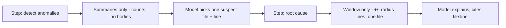

# Lab 1 — Harness Anatomy, Domain Modeling, and Context Engineering

**Time: ~3.5 hrs · Difficulty: Core · Builds on: Months 6–8 (the agent loop, pluggable providers, the jail and danger levels)**

## Objective

Internalize what a harness *is* by designing one on paper, then scaffold it in code. You will write a one-page **harness spec** for a real domain (answering the four domain-modeling questions), then build a `harness/` package whose defining feature is a **context loader that selects, not dumps** — it loads only the files a step needs into the model's attention budget. By the end you'll have a single-agent harness that already out-focuses a default agent on its domain because it sees the right context and exposes the right (narrow) tools. This is the foundation the multi-agent orchestration in Lab 2 plugs into.

## Setup

```zsh
mkdir -p ~/agentic/month-09 && cd ~/agentic/month-09
uv init --python 3.12 && uv add pydantic
uv add --dev pytest
# Reuse your Month 7 llm package and Month 8 guardrails (copy or path-install them):
#   cp -r ~/agentic/month-07/llm ./llm
#   cp ~/agentic/month-08/jail.py ./jail.py
ollama pull qwen2.5:3b      # cheap model (workers/triage, Lab 2)
ollama pull qwen2.5:7b      # capable model (lead/synthesis)
ollama serve &              # if not already running
```

**Checkpoint:** `uv run python -c "import pydantic, llm, jail; print('ok')"` prints `ok`, confirming your Month 7 `llm` package and Month 8 `jail.py` are importable from this project.
**If not:** a `ModuleNotFoundError` means `llm/` or `jail.py` isn't on the path — copy them in as shown in the commented lines above (or add the project root to `PYTHONPATH`). See Troubleshooting.

## Background

**Recall first (from memory):** what were the three deliberate decisions that turn the plain Month 6 agent loop into a *harness*? And why does loading every file degrade quality, not just cost? (Answer in your head, then read on: tools narrowed to the domain, an engineered context strategy, domain-tuned guardrails; and the lost-in-the-middle effect.)

Read README §1–§3 before starting. The one idea to hold onto: a harness is the *loop you already have* plus three deliberate decisions made **for one domain** — a narrowed tool set, an engineered context strategy, and domain-tuned guardrails. This lab is mostly the third pillar made concrete: the context loader. We build a single-agent harness here so the focus stays on context and domain modeling; Lab 2 turns it into a team.

To make the lab concrete we use **incident triage from a log directory** as the running example. Pick this, or substitute PR review or grading — the spec and the loader generalize.

## Steps

### 1. Write the harness spec (on paper first)

Create `harness/SPEC.md`. Answer the four domain-modeling questions from README §2 for your chosen domain. Keep it to one page.

```markdown
# Harness Spec — Incident Triage

## Domain
Triage a directory of application/security logs to find what broke and why.

## 1. Tasks
- Detect anomalous windows (error spikes, repeated failures).
- Locate the first/root error in a window.
- Correlate related lines across files.
- Propose a probable cause with evidence (file:line citations).

## 2. Minimum toolset (and what is DELIBERATELY excluded)
- read_log(path, start, end)   # read a bounded window, READ-ONLY
- grep_logs(pattern)           # find matching lines across the dir
- list_logs()                  # enumerate files
- EXCLUDED: write_file, run_shell, fetch_url, delete_* — triage NEVER mutates.

## 3. Per-step context
- Detection: file list + line counts + error counts, NOT full file bodies.
- Root-cause: only the window around the spike (e.g. +/- 50 lines), one file.
- Never load the whole log directory into one context.

## 4. Failure modes -> guardrails
- False "all clear"            -> validator requires evidence for any "no incident".
- Reading the wrong window     -> loader logs exactly which window it loaded.
- Mutating logs                -> no write tool exists (blast radius = read-only).
```

**Checkpoint:** Your `SPEC.md` names tools you are *excluding* and ties each failure mode to a guardrail.
**If not:** if your toolset includes a write or shell tool for a read-only domain, you have not modeled the domain — cut it. If every failure mode maps to "the model is careful," you haven't found a guardrail; a guardrail is structural (a tool that doesn't exist, a gate, a validator), not a hope.

### 2. Make some realistic input

Create a small log directory to triage so the loader has something real to select from.

```zsh
mkdir -p inputs/logs
printf 'INFO start\nINFO ok\nERROR db timeout\nERROR db timeout\nERROR db timeout\nWARN retry\n' > inputs/logs/api.log
printf 'INFO boot\nINFO healthy\nINFO healthy\nWARN slow query\n' > inputs/logs/worker.log
printf 'INFO connect\nERROR pool exhausted\nERROR pool exhausted\n' > inputs/logs/db.log
```

**Checkpoint:** `ls inputs/logs` shows three `.log` files; `api.log` and `db.log` contain the error clusters your harness should find.
**If not:** if `inputs/logs` is empty, you ran the `printf` lines from the wrong directory — `cd ~/agentic/month-09` first, then re-run. Confirm contents with `grep -c ERROR inputs/logs/*.log`.

### 3. The harness config and the narrowed tools

Create `harness/config.py` and `harness/tools.py`. The tools are **read-only by construction** — there is no write path. Reuse Month 8's jailed path resolution.

```python
# harness/config.py
from dataclasses import dataclass, field

@dataclass
class HarnessConfig:
    domain: str = "incident-triage"
    input_dir: str = "inputs/logs"
    context_budget_chars: int = 8_000     # the attention budget for one step
    lead_model: str = "qwen2.5:7b"         # capable: decomposition/synthesis (Lab 2)
    worker_model: str = "qwen2.5:3b"       # cheap/local: per-slice work (Lab 2)
```

```python
# harness/tools.py — the minimum, READ-ONLY toolset for triage
from pathlib import Path
from jail import safe_path                  # Month 8: resolve-then-check inside ROOT

def list_logs(root: Path) -> list[str]:
    return sorted(p.name for p in root.glob("*.log"))

def read_log(root: Path, name: str, start: int = 0, end: int | None = None) -> str:
    p = safe_path(str(root / name))         # jail: cannot escape the log dir
    lines = p.read_text().splitlines()
    return "\n".join(lines[start:end])

def grep_logs(root: Path, pattern: str) -> list[str]:
    hits = []
    for p in sorted(root.glob("*.log")):
        for i, line in enumerate(p.read_text().splitlines(), 1):
            if pattern in line:
                hits.append(f"{p.name}:{i}: {line}")
    return hits
```

**Checkpoint:** `uv run python -c "from pathlib import Path; from harness.tools import grep_logs; print(grep_logs(Path('inputs/logs'),'ERROR'))"` prints the ERROR lines with `file:line` citations. There is **no** function in `tools.py` that writes, deletes, or shells out — confirm by reading it.
**If not:** an import error on `harness.tools` usually means there's no `harness/__init__.py` — `touch harness/__init__.py`. If `safe_path` raises, your Month 8 `ROOT` isn't pointed at `inputs/logs`; see Troubleshooting.

### 4. The context loader — select, don't dump

This is the heart of the lab and the genuinely new skill: making the *harness*, not the model, decide what the model sees. The loader takes a *step* and the available files and returns only what that step needs, bounded by the attention budget. We build it in three stages — study a complete worked function, fill in a faded one, then write one from scratch.

The two-step idea you are implementing:


*Notice: neither step ever receives the whole directory — detection sees counts, root-cause sees one bounded window. That is context engineering, not luck.*

#### Stage 1 — Worked example (I do)

Create `harness/context.py` and type this in exactly. Every line is annotated; you are not inventing anything yet — you are studying how a "select, don't dump" loader is shaped.

```python
# harness/context.py — load the RIGHT context, not ALL of it
from pathlib import Path

def detection_context(root: Path) -> str:
    """For the 'detect anomalies' step: summaries only — counts, not bodies."""
    blocks = []
    for p in sorted(root.glob("*.log")):       # walk each log file
        lines = p.read_text().splitlines()      # read it ONCE, here only
        errors = sum(1 for ln in lines if "ERROR" in ln)  # cheap signal, not the body
        blocks.append(f"{p.name}: {len(lines)} lines, {errors} errors")  # one summary line
    return "FILE SUMMARIES (no bodies):\n" + "\n".join(blocks)  # the model sees ONLY this
```

Read it back: the function reads each file but returns **only counts** — the bodies never leave the function. That is the whole trick. The detection step's context is a few hundred characters regardless of how big the directory is.

**Checkpoint:** `uv run python -c "from pathlib import Path; from harness.context import detection_context; print(detection_context(Path('inputs/logs')))"` prints three one-line summaries with error counts — and crucially does **not** print any log file bodies.
**If not:** if you see file bodies, you returned `lines` somewhere instead of the count — the body must never enter the returned string. If it errors on import, add `harness/__init__.py`.

#### Stage 2 — Faded practice (we do)

Now add the root-cause loader. The skeleton is below with the mechanical line-slicing left as TODOs. It must return **only the window** around `center`, never the whole file, and respect `budget`.

```python
def window_context(root: Path, name: str, center: int, radius: int,
                   budget: int) -> str:
    """For the 'root cause' step: only the window around a suspicious line."""
    p = root / name
    lines = p.read_text().splitlines()
    lo, hi = ___, ___                  # TODO: clamp lo at 0; hi = center + radius
    window = "\n".join(                 # TODO: number each kept line with its real index
        ___ for ___ in enumerate(lines[lo:hi], lo))
    return f"# WINDOW {name}[{lo}:{hi}]\n{window}"[___]   # TODO: enforce the char budget
```

Expected behavior: for `center=3, radius=3` it returns roughly lines 0–6 of the named file, each prefixed with its absolute line number, truncated to `budget` characters. (Solution shape: `lo, hi = max(0, center - radius), center + radius`; the join element is `f"{i}: {ln}"` over `enumerate(...)`; the slice is `[:budget]`.)

**Checkpoint:** `uv run python -c "from pathlib import Path; from harness.context import window_context; print(window_context(Path('inputs/logs'),'api.log',3,3,4000))"` prints a numbered window around line 3 of `api.log` — and nothing from any other file.
**If not:** if you see the whole file, your `lo/hi` slice is wrong (you likely sliced `[:]`); if line numbers restart at 0, you forgot the `lo` offset in `enumerate(..., lo)`.

#### Stage 3 — Independent (you do)

Write a third loader, `rule_context(root, rule_files, budget)`, for a *different* step: "check the logs against a list of known-bad patterns." It should load **only** the named `rule_files` (a small list you pass in), concatenate them under a `# RULES` header, and stop once `budget` characters are used — the same select-don't-dump discipline, no scaffolding. Goal and definition of done only: given a 1–2 item `rule_files` list, the returned string contains those files and nothing else, and never exceeds `budget` chars.

**Checkpoint:** calling `rule_context` with one small rules file returns just that file's contents under the header, under budget; passing a second file appends it only if there's budget left.
**If not:** if the output exceeds `budget`, you appended before checking the running total — track `used` and break like the README §3 loader does.

A default agent would have read every file in full into one context for all three steps — and performed *worse* for it (lost-in-the-middle, §3).

### 5. Wire the single-agent run through your Month 7 provider

Create `harness/run.py`. It loads the *detection* context, asks the model to name the most suspicious file and line, then loads the *window* context for the root-cause step. The model is selected through your Month 7 `llm` package (so the fallback chain to Ollama is inherited).

```python
# harness/run.py — a single-agent triage harness (Lab 2 turns this into a team)
import json
from pathlib import Path
from llm import make_client                 # Month 7: pluggable provider + fallback
from harness.config import HarnessConfig
from harness.context import detection_context, window_context

def triage(cfg: HarnessConfig) -> dict:
    root = Path(cfg.input_dir)
    model = make_client("ollama", model=cfg.lead_model, base_url="http://localhost:11434")

    # Step 1: detection — small, summary-only context.
    detect = model.complete(
        messages=[{"role": "user", "content":
            detection_context(root) +
            '\n\nReturn JSON: {"file": <name>, "line": <int>, "why": <str>}. '
            'Pick the single most suspicious file and an approximate line.'}],
        tools=[])
    pick = json.loads(detect.text)

    # Step 2: root cause — only the window around the suspicious line.
    win = window_context(root, pick["file"], pick["line"], radius=3,
                         budget=cfg.context_budget_chars)
    cause = model.complete(
        messages=[{"role": "user", "content":
            win + "\n\nWhat is the probable root cause? Cite file:line evidence."}],
        tools=[])
    return {"suspect": pick, "root_cause": cause.text}

if __name__ == "__main__":
    print(json.dumps(triage(HarnessConfig()), indent=2))
```

**Checkpoint:** `uv run python -m harness.run` prints a JSON object naming a suspect file (likely `api.log` or `db.log`) and a root-cause paragraph that cites a `file:line`.
**If not:** if `json.loads` throws, your local model returned prose for step 1 — wrap it in a retry that re-prompts "return ONLY valid JSON", set temperature to 0, and add `format=json` if your Ollama path supports it (Lab 2's validator formalizes this). If the call hangs, the model is loading into memory on first use; warm it once with `ollama run qwen2.5:7b "hi"`.

### 6. Prove the focus advantage

Write a tiny comparison note in `harness/SPEC.md` (or a `NOTES.md`): how many characters did the detection step's context use (`len(detection_context(root))`) versus dumping every file (`sum(p.stat().st_size for p in root.glob('*.log'))`)? Even on a toy input the ratio should be a meaningful fraction — and on a real 200-file log directory it is the difference between a focused step and an unusable one.

**Checkpoint:** You can state a number: "detection context = N chars; dumping all logs = M chars; the harness uses N/M of the attention a naive agent would." That ratio *is* the harness's edge, quantified.
**If not:** if N is *larger* than M, your detection context is leaking file bodies — revisit Stage 1; the summary must be counts only.

## Definition of Done

- `harness/SPEC.md` answers the four domain-modeling questions and explicitly lists **excluded** tools and a failure-mode→guardrail mapping.
- `harness/tools.py` exposes only read-only tools (no write/shell/fetch path), all going through Month 8's jail.
- `harness/context.py` has a loader that returns **summaries** for detection and a **bounded window** for root-cause — never the whole directory.
- `uv run python -m harness.run` completes on `inputs/logs` and returns a suspect + an evidence-citing root cause, driven by your Month 7 provider (so it falls back to Ollama and costs **$0**).
- Self-verify: `uv run python -c "from pathlib import Path; from harness.context import detection_context; assert len(detection_context(Path('inputs/logs'))) < 1000; print('context is engineered')"` passes.

**Self-explain:** in one sentence, why does the context loader make the harness *better*, not just cheaper, than a default agent that loads everything?

## Stretch Goals

1. **Generalize to a second domain.** Write a second `SPEC.md` for PR review (tools: `git diff`, `read_file`, `run_tests`; context: the diff hunks, not the whole repo) and note how *different* the answers are — that difference is the case for custom harnesses.
2. **Add a relevance ranker.** Replace the "pick the most suspicious file" prompt with a heuristic pre-filter (rank files by error density) so the model only ever sees ranked candidates — context engineering before the model even runs.
3. **Budget enforcement.** Make the loader raise if a single step's assembled context exceeds `context_budget_chars`, forcing decomposition rather than silently truncating.
4. **Token-aware budgeting.** Swap the char budget for a real token count (tiktoken or your model's tokenizer) so the budget reflects the model's actual window.

## Troubleshooting

- **`ModuleNotFoundError: llm` or `jail`.** Copy your Month 7 `llm/` package and Month 8 `jail.py` into this project, or add them to the path. The whole month builds on those artifacts.
- **`make_client("ollama", ...)` signature mismatch.** Use *your* Month 7 factory signature; the example assumes `make_client(provider, model=..., base_url=...)`. Adjust the kwargs to match what you built.
- **Step 1 returns prose, not JSON.** Small local models drift. Add `format=json` if your Ollama path supports it, lower temperature to 0, and re-prompt on a `json.loads` failure. Lab 2's validator makes this robust.
- **`safe_path` rejects valid log files.** Ensure `ROOT` in your Month 8 `jail.py` is set/resolved to the `inputs/logs` directory (or pass the right root). The jail is doing its job — point it at the right root.
- **Ollama slow on first call.** The model loads into memory on first use. Warm it with `ollama run qwen2.5:7b "hi"` once before timing anything.
