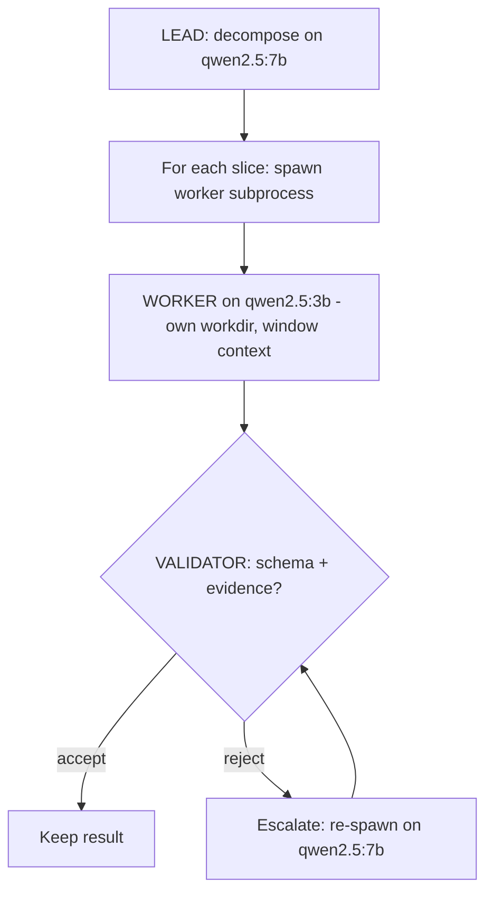

# Lab 2 — Sub-Agent Delegation: Lead / Worker / Validator with Per-Role Models

**Time: ~4.5 hrs · Difficulty: Core · Builds on: Lab 1 (the single-agent harness) and Months 7–8 (pluggable models, sandbox)**

## Objective

Turn the single-agent harness from Lab 1 into a **team**. You will build the **team-lead / worker / validator** orchestration: a LEAD that decomposes a job into slices and routes them; WORKERS that each run as **their own subprocess in their own working directory** with a *narrow* context and a *tight* toolset; and a VALIDATOR that checks each worker's structured result before it returns. Each role selects **its own model** through Month 7's providers — a cheap local model for workers, a larger one for the lead — and inherits the fallback chain. By the end you have a working multi-agent harness whose every sub-agent is isolated, model-routed, and validated. Lab 3 wraps this in tracing and ships it as the milestone.

## Setup

```zsh
cd ~/agentic/month-09
uv add pydantic            # already added in Lab 1; ensures the result schema is available
ollama serve &             # cheap + capable models from Lab 1 must be pulled:
ollama list                # expect qwen2.5:3b and qwen2.5:7b
```

**Checkpoint:** `ollama list` shows both `qwen2.5:3b` and `qwen2.5:7b`. You will route workers to the `3b` and the lead to the `7b`, proving per-role routing on free local models.
**If not:** if a model is missing, `ollama pull qwen2.5:3b` / `ollama pull qwen2.5:7b`. If `ollama list` itself errors, the daemon isn't up — run `ollama serve &` first.

## Background

**Recall first (from memory):** in Lab 1 your harness ran as *one* agent. What single OS primitive will give a child agent its own memory, working directory, and model — for free — and how did Month 8's jail bound where a process could touch the filesystem? (Then read on: a **subprocess**, and the **working-directory jail**, now applied per child.)

Read README §4–§7. The shape: **delegation via subprocess** (§4) gives you isolation for free — a child agent is just your agent run as another OS process with its own working directory and model. The **lead/worker/validator** pattern (§5) gives that isolation a job: decompose → route → execute → validate → return. **Per-role model routing** (§6) means you stop overpaying — cheap models for the small, well-scoped worker slices; a capable one only for the lead's hard decomposition. And you **never trust a worker on faith** (§7): a Pydantic schema plus substance checks gate every result. We keep using the incident-triage domain from Lab 1 so the orchestration is concrete.

The control flow you are about to build:


*Notice: the LEAD routes but never reads file bodies; each WORKER is a separate process; a rejected result is re-dispatched (escalated), not silently dropped.*

## Steps

### 1. The worker: an isolated child agent

Create `harness/worker.py`. A worker reads a **slice spec** from stdin, does *one* focused task with a *narrow* context and the read-only tools, and writes a **structured JSON result** to stdout. It is invoked as a subprocess, so it is its own process with its own working directory.

```python
# harness/worker.py — one isolated child agent; reads slice from stdin, prints JSON result
import sys, json, argparse
from pathlib import Path
from llm import make_client
from harness.context import window_context

def run_slice(slice_spec: dict, model_name: str) -> dict:
    root = Path(slice_spec["input_dir"])
    model = make_client("ollama", model=model_name, base_url="http://localhost:11434")
    ctx = window_context(root, slice_spec["file"], slice_spec["center"],
                         radius=slice_spec.get("radius", 4), budget=4000)
    reply = model.complete(messages=[{"role": "user", "content":
        ctx + '\n\nReturn ONLY JSON: '
        '{"slice_id": "%s", "finding": <str>, "severity": <"low"|"medium"|"high"|"critical">, '
        '"evidence": [<"file:line">, ...]}' % slice_spec["slice_id"]}], tools=[])
    return json.loads(reply.text)

if __name__ == "__main__":
    ap = argparse.ArgumentParser()
    ap.add_argument("--model", default="qwen2.5:3b")
    args = ap.parse_args()
    spec = json.loads(sys.stdin.read())
    json.dump(run_slice(spec, args.model), sys.stdout)
```

**Checkpoint:** Test the worker in isolation:
```zsh
echo '{"slice_id":"s1","input_dir":"inputs/logs","file":"api.log","center":3,"radius":3}' \
  | uv run python -m harness.worker --model qwen2.5:3b
```
It prints a JSON object with `slice_id`, `finding`, `severity`, and `evidence`. The worker only ever saw a window of `api.log` — not the whole directory.
**If not:** if stdout isn't parseable JSON, the model emitted prose or a log line leaked to stdout — send all logging to **stderr**, print only the JSON, set temperature 0. If `harness` won't import, run as a module (`python -m harness.worker`) from the project root (Troubleshooting).

### 2. The validator: refuse to trust on faith

Create `harness/validate.py`. Structure check (Pydantic) plus substance checks (a serious claim must cite evidence). A rejected result returns `None` so the lead can re-dispatch.

```python
# harness/validate.py — gate every worker result before the parent acts on it
from pydantic import BaseModel, ValidationError

SEVERITIES = {"low", "medium", "high", "critical"}

class WorkerResult(BaseModel):
    slice_id: str
    finding: str
    severity: str
    evidence: list[str]

def validate(raw: dict) -> WorkerResult | None:
    try:
        r = WorkerResult(**raw)
    except ValidationError:
        return None                                   # malformed structure -> reject
    if r.severity not in SEVERITIES:
        return None
    if r.severity in {"high", "critical"} and not r.evidence:
        return None                                   # serious claim, no evidence -> reject
    if r.finding.strip() == "":
        return None
    return r
```

**Checkpoint:** `uv run python -c "from harness.validate import validate; print(validate({'slice_id':'s','finding':'crit','severity':'critical','evidence':[]}))"` prints `None` — a critical finding with no evidence is correctly rejected. A well-formed result with evidence returns a `WorkerResult`.
**If not:** if it prints a `WorkerResult` instead of `None`, your evidence check is missing or only guards `critical` (it must also catch `high`) — re-read the two substance `if` blocks. If it raises instead of returning `None`, you let the `ValidationError` propagate; catch it and return `None`.

### 3. The lead: decompose and route, spawning workers in their own working dirs

This is the new skill of the lab: a parent that **spawns isolated child agents and routes per role**. Build it in three stages — study `decompose` and `spawn_worker` worked, fill in the `orchestrate` loop, then write the escalation policy independently. Create `harness/lead.py`.

#### Stage 1 — Worked example (I do)

Type these two functions in exactly. `decompose` is the lead's hard reasoning step on the **capable** model; `spawn_worker` is the isolation primitive — a child run as its own process in its own working directory.

```python
# harness/lead.py — decompose + route; each worker is its own subprocess in its own workdir
import json, subprocess
from pathlib import Path
from llm import make_client
from harness.validate import validate

def decompose(input_dir: str, cap_model: str) -> list[dict]:
    """Capable model proposes slices: which files/windows to investigate."""
    root = Path(input_dir)
    summary = "\n".join(                                  # SUMMARIES only — no bodies
        f"{p.name}: {sum('ERROR' in l for l in p.read_text().splitlines())} errors"
        for p in sorted(root.glob("*.log")))
    model = make_client("ollama", model=cap_model, base_url="http://localhost:11434")
    reply = model.complete(messages=[{"role": "user", "content":
        f"Logs:\n{summary}\n\nReturn ONLY a JSON list of slices to investigate, each "
        '{"slice_id": <str>, "file": <name>, "center": <int>, "radius": 4}. '
        "One slice per file that has errors."}], tools=[])
    return json.loads(reply.text)

def spawn_worker(slice_spec: dict, run_root: Path, model: str) -> dict:
    """Run a worker in ITS OWN working directory; return its raw result."""
    workdir = run_root / f"worker-{slice_spec['slice_id']}"
    workdir.mkdir(parents=True, exist_ok=True)        # the child's jail (Month 8, per child)
    proc = subprocess.run(
        ["uv", "run", "python", "-m", "harness.worker", "--model", model],  # routed model
        input=json.dumps(slice_spec), cwd=Path.cwd(),  # module import root
        capture_output=True, text=True, timeout=300)   # bounded: a hung child can't wedge us
    if proc.returncode != 0:
        raise RuntimeError(f"worker {slice_spec['slice_id']} failed: {proc.stderr[:300]}")
    return json.loads(proc.stdout)                     # raw — the caller validates it (§7)
```

Read it back: `spawn_worker` is delegation with the most boring isolation primitive there is — an OS process with its own working directory and its own `--model`. When it exits, its mess exits with it.

**Checkpoint:** the decomposition step alone works:
```zsh
uv run python -c "from harness.lead import decompose; print(decompose('inputs/logs','qwen2.5:7b'))"
```
prints a JSON list of slices, one per error-bearing file. Note the lead never reads file *bodies* — it routes on summaries and lets workers see the detail.
**If not:** if `json.loads` fails, the `7b` model returned prose — set temperature 0, add `format=json`, and re-prompt once. If it hangs on first call, warm the model: `ollama run qwen2.5:7b "hi"`.

#### Stage 2 — Faded practice (we do)

Now wire the orchestration loop. The skeleton routes the **cheap** model first, validates, and escalates on rejection. Fill the TODOs.

```python
def orchestrate(input_dir: str, run_root: Path,
                cap_model="qwen2.5:7b", cheap_model="qwen2.5:3b") -> list[dict]:
    slices = decompose(input_dir, cap_model)
    results = []
    for s in slices:
        s["input_dir"] = input_dir
        raw = spawn_worker(s, run_root, ___)        # TODO: which model runs workers first?
        checked = validate(raw)
        if checked is None:                          # TODO: rejected — what do we do, not drop?
            raw = spawn_worker(s, run_root, ___)     # TODO: escalate to which model?
            checked = ___                            # TODO: re-validate the escalated result
        results.append({"slice_id": s["slice_id"],
                        "accepted": checked is not None,
                        "result": checked.model_dump() if checked else raw})
    return results
```

Expected behavior: every slice runs on `cheap_model` first; a rejected result is **re-spawned on `cap_model`** and re-validated (escalation, not dropping); each entry records `accepted` and the validated result. (Solution: first arg `cheap_model`; escalate arg `cap_model`; `checked = validate(raw)`.)

**Checkpoint:** `uv run python -c "from pathlib import Path; from harness.lead import orchestrate; print(orchestrate('inputs/logs', Path('runs/tmp')))"` returns a list with one entry per slice, each carrying an `accepted` flag.
**If not:** if rejected results vanish instead of escalating, your `if checked is None` branch doesn't re-spawn; if everything escalates, the cheap model isn't producing evidence — re-prompt with an explicit example (Troubleshooting).

#### Stage 3 — Independent (you do)

The current policy escalates **once**. Write a small change — a `max_escalations: int = 1` parameter and the loop logic — so a still-rejected result after the final escalation is recorded as `"accepted": false` with the **reason** it failed validation (you will need to surface *why* `validate` rejected it; extend `validate` to return a reason, or check the conditions again in the lead). Goal and definition of done only: a result that fails twice is recorded as rejected with a human-readable reason, and the harness keeps going.

**Checkpoint:** feeding a slice that always produces an evidence-free `critical` ends with `"accepted": false` and a reason string, and the run does not crash.
**If not:** if the harness throws instead of recording the failure, you're not catching the final-rejection case — record it and `continue` rather than raising.

### 4. Run the whole team

Create `harness/team.py` to drive it end-to-end.

```python
# harness/team.py
import json, time
from pathlib import Path
from harness.lead import orchestrate

if __name__ == "__main__":
    run_root = Path("runs") / time.strftime("%Y%m%d-%H%M%S")
    results = orchestrate("inputs/logs", run_root)
    print(json.dumps(results, indent=2))
```

```zsh
uv run python -m harness.team
```

**Checkpoint:** You see a JSON array with one entry per slice, each marked `"accepted": true/false`, and a per-worker subdirectory was created under `runs/<ts>/`. Workers ran on `qwen2.5:3b`; the lead decomposed on `qwen2.5:7b` — confirm by watching `ollama ps` during the run or by temporarily logging the model name in each role.
**If not:** if no per-worker subdirs appear, `spawn_worker` isn't creating `run_root / f"worker-..."` — check the `mkdir`. If a worker crash kills the whole run, wrap `spawn_worker` per slice in `try/except` and record `"accepted": false` (Troubleshooting) — isolation is the point.

### 5. Prove per-role routing and fallback

Demonstrate the two Month 7 properties this lab depends on. First, **routing**: change `cheap_model` to `qwen2.5:7b` and observe the run is slower (workers now use the big model) — proving the role-to-model mapping is real and config-driven. Set it back. Second, **fallback**: point a worker's `base_url` at an unreachable host and confirm your Month 7 chain falls over to a reachable Ollama rather than crashing the whole harness.

```python
# in a throwaway test: a worker whose primary is blackholed must still complete via fallback
# (uses your Month 7 fallback chain; the run survives one role's outage)
```

**Checkpoint:** Swapping the worker model changes run time noticeably (routing is real), and blackholing a worker's primary provider does **not** kill the harness — the Month 7 chain serves it from local Ollama. The team is resilient to one role's model being down.
**If not:** if swapping the model makes no timing difference, `make_client` isn't actually receiving the per-role `model` arg — log the model name at the top of each role (Troubleshooting). If blackholing crashes the run, your Month 7 fallback chain isn't wired into this provider call — confirm the worker goes through your `llm` package, not a raw client.

### 6. Test the orchestration logic

Create `tests/test_orchestration.py`. Test the deterministic parts — the validator and the routing/escalation logic — with fixtures, *without* calling the model.

```python
# tests/test_orchestration.py
from harness.validate import validate

def test_validator_rejects_evidence_free_critical():
    assert validate({"slice_id":"s","finding":"db down","severity":"critical","evidence":[]}) is None

def test_validator_accepts_well_formed():
    r = validate({"slice_id":"s","finding":"db timeout","severity":"high",
                  "evidence":["api.log:3"]})
    assert r is not None and r.severity == "high"

def test_validator_rejects_bad_severity():
    assert validate({"slice_id":"s","finding":"x","severity":"spicy","evidence":[]}) is None
```

**Checkpoint:** `uv run pytest -q` passes. Your validator's accept/reject logic is tested independently of any model, so you can trust it in the harness.
**If not:** a collection error usually means `tests/` lacks an `__init__.py` or `harness` isn't importable from the test run — run `uv run pytest` from the project root. A failing assertion means your validator's substance check differs from the spec; re-read Step 2.

## Definition of Done

- `harness/worker.py` runs as a subprocess, reads a slice from stdin, sees only a **narrow window** of context, and prints a structured JSON result.
- `harness/lead.py` decomposes a real input into slices (on the **capable** model) and spawns **one worker subprocess per slice in its own working directory** (on the **cheap** model).
- `harness/validate.py` rejects at least two classes of bad result (malformed schema; serious claim with no evidence), and the lead **re-dispatches/escalates** a rejected result rather than dropping it.
- `uv run python -m harness.team` completes end-to-end on `inputs/logs` for **$0** (all local Ollama), producing per-slice accepted/rejected results.
- Per-role routing is demonstrable (workers on `3b`, lead on `7b`) and the harness survives one role's provider being blackholed via the Month 7 fallback chain.
- `uv run pytest -q` passes the validator/orchestration tests.

**Self-explain:** in one sentence, why does running each worker as its own subprocess in its own working directory make the whole harness both safer and easier to debug than one big agent doing everything?

## Stretch Goals

1. **Parallel workers.** Spawn the worker subprocesses concurrently (`concurrent.futures.ThreadPoolExecutor` around `spawn_worker`) so independent slices run in parallel — the lead/worker pattern's payoff.
2. **Containerized worker.** For any worker whose slice would touch the shell, run it inside an ephemeral Colima/Podman container (Month 8) instead of just a working directory — the "Excellent"-tier isolation.
3. **Second-opinion validator.** Route the validator's substance check through a *different* model than the worker used, getting a cheap independent second opinion (README §6).
4. **Synthesis step.** Add a final lead pass that synthesizes the accepted worker results into one incident summary on the capable model — the "synthesis = expensive model" half of routing.

## Troubleshooting

- **Worker subprocess can't import `harness`.** Run the worker as a module (`python -m harness.worker`) with `cwd` at the project root so the package is importable, as shown. If you `cd` into the per-worker dir, set `PYTHONPATH` to the project root.
- **`json.loads` fails on worker stdout.** The worker printed prose or a stray log line to stdout. Send all logging to **stderr** and print *only* the JSON result to stdout — mixing them corrupts the parent's parse. Lower temperature to 0 and add `format=json` if available.
- **Every result is rejected.** Your local model isn't producing the evidence field. Make the prompt show an exact example and re-prompt once on validation failure; the escalation-to-capable-model path should then accept.
- **The whole harness dies when one worker errors.** Wrap `spawn_worker` per slice in a `try/except`, record the failure as `"accepted": false`, and continue — one worker's crash must not take down the team. (Isolation is the point.)
- **Routing seems to have no effect.** Confirm `make_client` actually receives the `model` argument for each role and that you're not falling through to a single default model. Log the model name at the top of each role during debugging.
