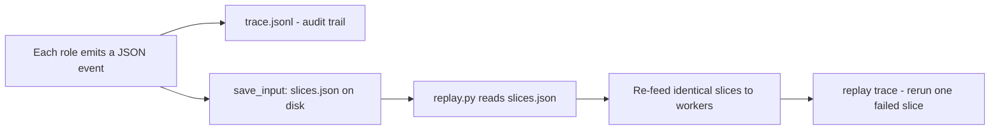

# Lab 3 — The Triage Harness (Milestone)

**Time: ~6 hrs · Difficulty: Core / Stretch · Builds on: Labs 1–2 and the whole month (plus Months 6–8)**

## Objective

Ship the month's milestone: a complete **multi-agent Triage Harness** for **one real domain** you choose. It has three roles — a **LEAD** that decomposes and routes, **WORKERS** that handle slices in their own subprocesses with constrained tools and contexts, and a **VALIDATOR** that checks each result before it returns. Model fallback (Month 7) is wired in per role. Every run writes a **trace file** to `runs/<ts>/trace.jsonl`, and runs are **replayable** from disk. You will produce three completed traces on realistic inputs and a `POSTMORTEM.md` for one run that went wrong and how you fixed it. Done means you can defend, in a fifteen-minute talk, why this harness exists and why a default agent would have failed at this domain.

## Setup

```zsh
cd ~/agentic/month-09
mkdir -p runs
# Optional (Excellent tier / shell-touching workers):
# colima start
```

Pick **one** domain and prepare a realistic input directory:

- **(a) Incident triage** — reuse/expand `inputs/logs` from Lab 1 (aim for 5–10 files with planted failures).
- **(b) PR review** — a small Python repo with a feature branch; tools become `git diff`, `read_file`, `run_tests`.
- **(c) Grading** — a folder of student submissions (`.py` or `.md`) plus a `rubric.md`; one worker per submission.

**Checkpoint:** Your chosen `inputs/` directory contains at least three realistic items the harness can triage, review, or grade.
**If not:** if you have only one item, the three required runs won't show realistic variety — add more (more log files, more PRs, or more submissions). For the grading domain, make sure a `rubric.md` exists alongside the submissions.

## Background

**Recall first (from memory):** in Month 6 each agent run wrote a JSONL trace. What did each line record, and why was that artifact worth keeping? And from Lab 2 — what does the lead save in memory that a *replay* would need on disk to re-run a slice? (Then read on: each step appended one JSON event for inspection/replay; replay needs the **saved slice specs and loaded context**, not just outputs.)

This lab is composition plus two genuinely new pieces: **tracing every sub-agent call** and **replay** (README §8), and the **postmortem + defense** (README §9). Reread your `SPEC.md` from Lab 1 — the milestone is graded substantially on whether the harness is *narrowed to its domain* (engineered context, minimum tools, justified per-role models, domain guardrails), not just on whether it runs. The bar that matters is the defense: why does *this* harness beat pointing Claude Code at the same domain?

The trace-and-replay loop, which Steps 1–4 build:


*Notice: the audit trail (left) and the replay (right) come from the same run — but replay only works because the run saved its inputs, not just its outputs.*

The new skill — making every run an auditable, rerunnable artifact — is built across Steps 1, 2, and 4 as a deliberate worked → faded → independent progression: study the `RunTrace` class, thread it into the orchestrator with TODOs, then write `replay.py` against only its definition of done.

## Steps

### 1. Add the run trace — Stage 1: Worked example (I do)

Create `harness/trace.py` and type it in exactly. Study it: `emit` appends one JSON line per event (and flushes so a crash can't lose it); `save_input` writes the inputs a replay will need. You are not inventing anything yet.

```python
# harness/trace.py — one structured, replayable artifact per run
import json, time
from pathlib import Path

class RunTrace:
    def __init__(self, run_dir: Path):
        run_dir.mkdir(parents=True, exist_ok=True)
        self.dir = run_dir
        self.f = (run_dir / "trace.jsonl").open("w")
    def emit(self, **event):
        event["ts"] = time.time()
        self.f.write(json.dumps(event) + "\n"); self.f.flush()
    def save_input(self, name: str, payload: dict):
        (self.dir / name).write_text(json.dumps(payload, indent=2))  # for replay
    def close(self): self.f.close()
```

Thread it through the lead and workers: emit `role="lead", action="decompose", slices=[...]`; for each worker emit `role="worker", slice_id, model, served_by, result`; for the validator emit `role="validator", slice_id, verdict`. Record the model that *actually* served each call (your Month 7 reply should expose which provider answered) so a fallback is visible in the trace.

**Checkpoint:** After a run, `cat runs/<ts>/trace.jsonl` shows one JSON event per line covering the lead's decomposition, each worker call (with its model), and each validator verdict. You can reconstruct the whole run from this file alone.
**If not:** if the file is empty or truncated, you didn't `flush()` per emit or the process died before `close()` — the example flushes on every write; wrap the run in `try/finally: trace.close()` (Troubleshooting).

### 2. Wire trace into the orchestrator — Stage 2: Faded practice (we do)

Update `harness/lead.py` (or a new `harness/harness.py` entrypoint) so `orchestrate` takes a `RunTrace`, emits at every step, and **saves the slice specs and loaded contexts** (or content hashes + paths) so the run can be replayed. The pattern below is mostly given; your job is to place the `trace.emit(...)` and `trace.save_input(...)` calls at every role boundary so *nothing* the run does is invisible.

```python
# inside orchestrate(...), with `trace: RunTrace` passed in:
slices = decompose(input_dir, cap_model)
trace.emit(role="lead", action="decompose", slices=slices)
trace.save_input("slices.json", {"slices": slices, "input_dir": input_dir})
for s in slices:
    s["input_dir"] = input_dir
    raw = spawn_worker(s, trace.dir, cheap_model)
    trace.emit(role="worker", slice_id=s["slice_id"], model=cheap_model, result=raw)
    checked = validate(raw)
    trace.emit(role="validator", slice_id=s["slice_id"],
               verdict="accept" if checked else "reject")
    if checked is None:
        raw = spawn_worker(s, trace.dir, cap_model)     # escalate
        trace.emit(role="worker", slice_id=s["slice_id"], model=cap_model,
                   escalated=True, result=raw)
        checked = validate(raw)
        trace.emit(role="validator", slice_id=s["slice_id"], escalated=True,
                   verdict="accept" if checked else "reject")
    results.append({"slice_id": s["slice_id"], "accepted": checked is not None,
                    "result": checked.model_dump() if checked else raw})
```

**Checkpoint:** `runs/<ts>/` now contains `trace.jsonl`, `slices.json`, and per-worker subdirectories. The inputs needed to replay are on disk, not just in memory.
**If not:** if `slices.json` is missing, you didn't call `trace.save_input(...)` after `decompose` — replay (Step 4) depends on it. If `trace.jsonl` is missing worker or validator events, you placed `emit` at only some boundaries; emit at every one.

### 3. The final synthesis (LEAD's second hard step)

Add a synthesis pass: the lead reads the **accepted** results (not the raw logs) and produces one summary on the **capable** model. This is the "expensive model for synthesis" half of routing — and it sees only validated findings, a tiny clean context.

```python
def synthesize(accepted: list[dict], cap_model: str, trace) -> str:
    model = make_client("ollama", model=cap_model, base_url="http://localhost:11434")
    reply = model.complete(messages=[{"role": "user", "content":
        "Validated findings:\n" + json.dumps(accepted, indent=2) +
        "\n\nWrite a 3-sentence incident summary with the most likely root cause."}],
        tools=[])
    trace.emit(role="lead", action="synthesize", summary=reply.text)
    return reply.text
```

**Checkpoint:** A run ends with a coherent synthesis that references findings the workers produced — and the lead's synthesis context is just the validated findings (a few hundred chars), not the input directory.
**If not:** if the synthesis re-reads the raw logs, you passed the input dir instead of `accepted` — synthesis must see only validated findings. If it's empty, no results passed the validator; check that at least one worker produced evidence-backed output.

### 4. Build replay — Stage 3: Independent (you do)

Now write `harness/replay.py` yourself, against the definition of done only. It must: load `slices.json` from a past run, re-feed the **identical** slices through the workers and validator, and write a **fresh** trace to a sibling `runs/<ts>-replay/` directory. Because models aren't deterministic, replay reproduces the **pipeline and inputs**, not bit-identical output — its value is re-running a failed slice in isolation. The reference shape below is here only to confirm your structure after you've attempted it:

```python
# harness/replay.py — re-run a past run's recorded inputs through the harness
import json, sys
from pathlib import Path
from harness.lead import spawn_worker
from harness.validate import validate
from harness.trace import RunTrace

def replay(prev_run: Path, cheap="qwen2.5:3b"):
    saved = json.loads((prev_run / "slices.json").read_text())
    trace = RunTrace(prev_run.parent / (prev_run.name + "-replay"))
    for s in saved["slices"]:
        s["input_dir"] = saved["input_dir"]
        raw = spawn_worker(s, trace.dir, cheap)
        trace.emit(role="worker", slice_id=s["slice_id"], model=cheap,
                   replay=True, result=raw)
        trace.emit(role="validator", slice_id=s["slice_id"],
                   verdict="accept" if validate(raw) else "reject")
    trace.close()

if __name__ == "__main__":
    replay(Path(sys.argv[1]))
```

**Checkpoint:** `uv run python -m harness.replay runs/<ts>` produces a `runs/<ts>-replay/trace.jsonl` from the recorded `slices.json`. You can re-run a past pipeline without re-deriving the inputs.
**If not:** `FileNotFoundError` on `slices.json` means Step 2's `save_input` didn't run for that run — replay only the runs that saved their inputs. If findings differ from the original, that's expected (models aren't deterministic); set temperature 0 for closer reproduction.

### 5. Do three real runs

Run the full harness on three realistic inputs (e.g., three different log directories, three PRs, or one batch of submissions producing three traces). Keep each `runs/<ts>/` directory.

```zsh
uv run python -m harness.harness   # repeat with three different inputs
ls runs/                            # three timestamped run directories
```

**Checkpoint:** `runs/` holds **three** completed run directories, each with a `trace.jsonl` recording lead → workers → validator → synthesis, all completed on local Ollama for **$0**.
**If not:** if the three runs look identical, you reused one input — point the harness at three genuinely different inputs (different log dirs / PRs / submissions), or three runs prove nothing about variety.

### 6. Force a failure and write the postmortem

Deliberately feed the harness an input that breaks it — a log file the decomposition mis-routes, a submission that makes a worker hallucinate a passing grade, a diff the validator wrongly accepts. Capture that run's trace, then write `POSTMORTEM.md`.

```markdown
# Postmortem — Run 2026-05-25-1412

## Input
A log dir where the real root cause was in `worker.log`, but error *counts* were
highest in `api.log` (noise).

## What the harness did (from trace.jsonl)
- LEAD decomposed by error count -> routed a slice to api.log, none to worker.log.
- WORKER on api.log returned severity=high with weak evidence.
- VALIDATOR accepted it (had evidence, just the wrong evidence).
- Synthesis blamed api.log. WRONG.

## Root cause
Decomposition ranked by error *count*, not error *novelty/recency*. The validator
checked for *presence* of evidence, not whether evidence actually supports the claim.

## Fix
1. Lead now slices every file with >0 errors (not just the top-N by count).
2. Validator now requires the cited line to contain an error token, not just exist.
Re-ran (runs/2026-05-25-1430): worker.log slice produced; root cause correct.
```

**Checkpoint:** `POSTMORTEM.md` names a real failure, traces the root cause to specific events in `trace.jsonl`, and describes a concrete fix you actually made (with a re-run that succeeded). This is the artifact that proves you *own* the harness.
**If not:** if you "can't find a failure," you haven't fed it adversarial input — give it noise that outweighs signal or a submission designed to fool the validator. A staged failure reads as contrived; find a real one.

### 7. Write the defense

Create `harness/DEFENSE.md` (or speaker notes) for the fifteen-minute talk. It must answer: (1) why this harness exists; (2) **where exactly a default agent (Claude Code / Codex) would have failed** at this domain — name the concrete moment (loaded the whole log dir and lost the signal; ran a write tool it shouldn't have; used one expensive model for trivial triage); (3) what each role and guardrail buys; (4) the cost story (per-role routing → $0).

**Checkpoint:** You can deliver the defense to a rubber duck in fifteen minutes, hitting all four points with a concrete example for point (2).
**If not:** if point (2) is vague ("it would just be worse"), you haven't pinned the failure to a *moment* — name the exact step where Claude Code loads the whole log dir and loses the signal, or runs a write tool yours forbids. A concrete moment is what makes the defense land.

## Definition of Done

- A `harness/` package with three distinct roles: LEAD (decompose + route + synthesize), WORKER (isolated subprocess, own working dir, narrow context, tight tools), VALIDATOR (rejects malformed and substance-poor results, escalates rather than drops).
- Model fallback (Month 7) wired per role; the entire milestone runs on local Ollama for **$0**.
- A `runs/` directory with **three** completed `trace.jsonl` artifacts, each recording every sub-agent call (role, model, result, verdict) plus the saved inputs needed for replay.
- `uv run python -m harness.replay runs/<ts>` reproduces a past run's pipeline from disk.
- `POSTMORTEM.md` documents one failed run, its root cause traced from the artifact, and the concrete fix (with a successful re-run).
- A `DEFENSE.md` / talk that argues, with a concrete example, why a default agent would have failed at this domain.
- Self-verify: `wc -l runs/*/trace.jsonl` shows three non-trivial traces; `uv run python -m harness.replay runs/$(ls runs | head -1)` runs clean.

**Self-explain:** in one sentence, why does saving *inputs* (not just outputs) to the trace turn a run from an after-the-fact log into something you can actually re-run and debug?

## Stretch Goals

1. **Containerized workers (Excellent tier).** Run any shell-touching worker inside an ephemeral Colima/Podman container (Month 8), destroyed after the slice. State the blast radius in `SPEC.md`.
2. **Parallel + cost report.** Run workers concurrently and have the trace tally per-role token counts, then print a cost report (`$0` on Ollama; estimated cents if the synthesis role used a paid frontier model).
3. **Second harness, one swap.** Point the *same* orchestrator at a second domain by changing only the tools, context loader, and SPEC — proving the orchestration core is domain-agnostic and the *harness* is the domain layer.
4. **Eval harness.** Build a small fixed set of inputs with known-correct answers and score the harness (precision/recall on incidents found), then use it to prove your postmortem fix actually improved results.

## Troubleshooting

- **Trace is empty or partial.** You forgot to `flush()` (the example flushes per write) or the process crashed before `close()`. Flush on every emit; wrap the run in `try/finally: trace.close()`.
- **`served_by` / fallback isn't in the trace.** Your Month 7 `ModelReply` must expose which provider actually answered. If it doesn't, add that field — the milestone wants the fallback visible in the artifact.
- **Replay produces different findings.** Expected — models aren't deterministic. Replay reproduces the *pipeline and inputs*, not the exact text (README §8). For closer reproducibility, set temperature 0 and a fixed seed where your model supports it.
- **All three runs look identical.** Use genuinely different inputs (different log dirs / PRs / submissions). Three runs on the same input don't demonstrate the harness handles realistic variety.
- **Postmortem feels contrived.** Don't invent a failure — *find* one by feeding adversarial input (noise that outweighs signal, a submission designed to fool the validator). The real failure mode is more instructive than a staged one.
- **Worker subprocess import errors.** Same as Lab 2: run workers as modules from the project root, log to stderr, print only JSON to stdout.
