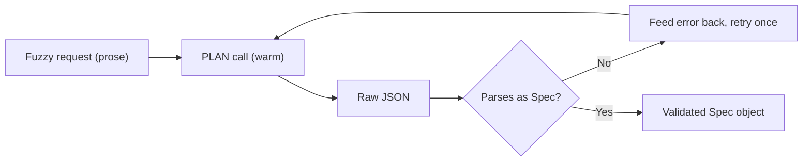

# Lab 1 — The Plan Prompt and Spec-Driven Development

**Time: ~3.5 hrs · Difficulty: Core · Builds on: Month 10 README §1–§3 (plus Months 6–7 for the model layer)**

## Objective

Build the heart of the factory: the **PLAN stage** and the **spec format** it produces. You'll design a `Spec` schema, write a plan prompt that turns a fuzzy one-paragraph feature request into a validated, structured spec, and pressure-test the format by writing three example specs by hand. By the end you'll have internalized the month's central reframing — you stop asking "how do I prompt the model to build X" and start asking "what spec format makes X trivial to produce." This stage is the source language of everything you build in Labs 2 and 3.

## Setup

```zsh
mkdir -p ~/agentic/month-10/factory && cd ~/agentic/month-10
uv init --package factory 2>/dev/null || true
cd factory
uv add pydantic
uv add --dev pytest
# Reuse your Month 7 llm package (pluggable providers + fallback). Either:
#   uv add --editable ../../month-07/llm     # if packaged
# or copy it in and import as `from llm import make_client`.
# Free model layer:
brew install ollama 2>/dev/null || true
ollama pull qwen2.5:3b          # cheap classifier / PLAN on a budget
ollama pull qwen2.5-coder:7b    # capable; PLAN can use this for better specs
ollama serve &                  # if not already running
```

**Checkpoint:** `uv run python -c "from llm import make_client; print('llm ok')"` prints `llm ok`, and `ollama list` shows both models.
**If not:** if the import fails, your Month 7 `llm` package isn't on the path — add it editable (`uv add --editable ../../month-07/llm`) or copy the package in (see Troubleshooting). If `ollama list` is empty or errors, `ollama serve` isn't running or the pulls didn't finish; re-run `ollama serve &` then the two `ollama pull` commands.

## Background

**Recall first (from memory):** In Month 6, how did you make a model return a *structured* object instead of prose, and how did your eval check it? In Month 7, what does `make_client(...)` give you that calling one provider directly does not? Hold those answers — PLAN is a structured-output call routed through your Month 7 client.

The README (§1–§3) makes the argument; this lab makes it concrete. The factory is a function whose *input language* is the spec, so the spec format is the most consequential design decision in the whole month. A spec that "won't compile" — vague, missing acceptance criteria, no bounds — dooms every later stage no matter how good the prompts are. PLAN's job is to take a loose human request and emit a spec that is **complete enough to compile**: it names where the change lands, states testable acceptance criteria, fills gaps with *recorded* assumptions, and bounds what's out of scope. You'll feel the format's quality immediately when you hand-write example specs — a good schema makes a hard feature easy to pin down, a bad one makes an easy feature ambiguous.

Here is the one transform this lab builds — fuzzy prose in, a validated structured `Spec` out:



*Notice: the only exit is a `Spec` that passed validation — a malformed plan fails loudly at stage 1, never silently downstream. The retry edge is the same self-correction loop you'll reuse for every stage in Lab 2.*

## Steps

### 1. Design the `Spec` schema

Create `factory/spec.py`. This Pydantic model *is* your spec format — the contract between PLAN and the rest of the pipeline.

```python
# factory/spec.py
from pydantic import BaseModel, field_validator

class Spec(BaseModel):
    title: str                       # one-line feature name, e.g. "Cache GET /products"
    intent: str                      # what & why, 1-3 sentences
    touchpoints: list[str]           # files/modules likely to change (SCOUT refines)
    acceptance_criteria: list[str]   # TESTABLE statements -> become tests in TEST
    constraints: list[str]           # "no new deps", "keep response schema", ...
    out_of_scope: list[str]          # explicit non-goals; bounds the blast radius
    assumptions: list[str]           # defaults PLAN chose to fill gaps (reviewable)

    @field_validator("acceptance_criteria")
    @classmethod
    def must_be_testable(cls, v: list[str]) -> list[str]:
        if not v:
            raise ValueError("a spec with no acceptance criteria cannot compile")
        return v

    def to_markdown(self) -> str:
        def bullets(xs): return "\n".join(f"- {x}" for x in xs) or "- (none)"
        return (
            f"# {self.title}\n\n## Intent\n{self.intent}\n\n"
            f"## Touchpoints\n{bullets(self.touchpoints)}\n\n"
            f"## Acceptance Criteria\n{bullets(self.acceptance_criteria)}\n\n"
            f"## Constraints\n{bullets(self.constraints)}\n\n"
            f"## Out of Scope\n{bullets(self.out_of_scope)}\n\n"
            f"## Assumptions\n{bullets(self.assumptions)}\n"
        )
```

**Checkpoint:** `uv run python -c "from factory.spec import Spec; Spec(title='t', intent='i', touchpoints=[], acceptance_criteria=[], constraints=[], out_of_scope=[], assumptions=[])"` raises a `ValidationError` complaining about empty acceptance criteria — your schema *refuses* an uncompilable spec.
**If not:** if it constructs without error, the `@field_validator` isn't attached to `acceptance_criteria` (check the field name and the `@classmethod` decorator). If you get an `ImportError`, you're not in the `factory/` package dir or `__init__.py` is missing.

### 2. Write three example specs by hand (pressure-test the format)

Before automating, *be* the PLAN stage. Create `examples/specs.py` and hand-write three `Spec` objects for three requests of different complexity. This is how you discover whether your format is any good.

```python
# examples/specs.py
from factory.spec import Spec

trivial = Spec(
    title="Add /health endpoint",
    intent="Expose a liveness check so deploys can be probed.",
    touchpoints=["app/main.py"],
    acceptance_criteria=[
        "GET /health returns 200",
        "response body is {\"status\": \"ok\"}",
    ],
    constraints=["no new dependencies"],
    out_of_scope=["readiness checks", "DB connectivity checks"],
    assumptions=["JSON response is acceptable (matches existing routes)"],
)

medium = Spec(
    title="Cache GET /products with 60s TTL",
    intent="Reduce DB load on the hot product list by caching responses.",
    touchpoints=["app/routes/products.py", "app/cache.py"],
    acceptance_criteria=[
        "GET /products returns identical body whether cached or fresh",
        "a second request within 60s does not hit the data layer",
        "GET /products?fresh=true bypasses the cache",
    ],
    constraints=["no new external service (in-memory cache only)", "keep response schema unchanged"],
    out_of_scope=["caching other endpoints", "cache invalidation on write"],
    assumptions=["in-memory dict cache is acceptable for a single-process app"],
)

# Write the third yourself: a cross-cutting concern, e.g. "add request-ID logging to every route".
```

**Checkpoint:** All three parse without error (`uv run python -c "import examples.specs"`). More importantly: writing the third one surfaced at least one field you wished existed or one that felt redundant. Note it — that's format-design feedback you'll act on in step 4.
**If not:** a `ValidationError` here means one of your hand-written specs left `acceptance_criteria` empty — which is the validator doing its job; add a real testable criterion. An `ImportError` on `examples.specs` usually means a missing `examples/__init__.py` or running from the wrong directory.

### 3. Build the PLAN stage (gradual release)

This is the genuinely new skill of the lab: a stage that turns fuzzy prose into a validated structured object, self-correcting once on failure. We build it in three passes — study a complete version, fill in a faded one, then write a fresh variant unaided.

#### Stage 1 — Worked example (I do)

Create `factory/prompts.py`, then `factory/plan.py`, exactly as below, run it, and study every line. You are not inventing anything yet — read the annotations and confirm the behavior.

```python
# factory/prompts.py
PLAN_SYSTEM = """You are the PLAN stage of a software factory. You convert a fuzzy
feature request into a STRUCTURED SPEC that later stages compile into code.

Rules:
- Output ONLY a JSON object matching the Spec schema. No prose, no code fences.
- acceptance_criteria MUST be testable, observable statements (a test could assert them).
- If the request is ambiguous, DO NOT ask questions. Choose a reasonable default and
  record it in `assumptions`, so the choice is reviewable.
- Bound the work: list explicit `out_of_scope` items and `constraints`.
- Prefer the smallest change that satisfies the intent.

Schema fields: title, intent, touchpoints[], acceptance_criteria[], constraints[],
out_of_scope[], assumptions[]."""

PLAN_USER = "Feature request:\n\n{request}\n\nEmit the Spec JSON now."
```

```python
# factory/plan.py
import json, re
from pydantic import ValidationError
from llm import make_client            # your Month 7 pluggable client + fallback
from factory.spec import Spec
from factory.prompts import PLAN_SYSTEM, PLAN_USER

def _extract_json(text: str) -> str:
    # the model sometimes wraps JSON in ```fences``` or chatter; strip fences, then
    # slice to the outermost braces so we hand clean JSON to json.loads.
    text = re.sub(r"^```(?:json)?|```$", "", text.strip(), flags=re.MULTILINE).strip()
    start, end = text.find("{"), text.rfind("}")
    return text[start:end + 1] if start != -1 else text

def plan(request: str, model: str = "qwen2.5-coder:7b") -> Spec:
    client = make_client("ollama", model=model, base_url="http://localhost:11434")
    messages = [{"role": "system", "content": PLAN_SYSTEM},
                {"role": "user", "content": PLAN_USER.format(request=request)}]
    for attempt in range(2):                       # 1 retry on parse/validation failure
        reply = client.complete(messages=messages, tools=[], temperature=0.7)  # WARM: creative
        try:
            return Spec(**json.loads(_extract_json(reply.text)))               # parse -> validate
        except (json.JSONDecodeError, ValidationError) as e:
            # self-correction: append the model's bad reply + the exact error, ask again.
            messages.append({"role": "assistant", "content": reply.text})
            messages.append({"role": "user", "content":
                f"That failed validation: {e}. Emit ONLY corrected Spec JSON."})
    raise ValueError(f"PLAN could not produce a valid Spec for: {request[:80]}")
```

Three things to notice: temperature is **warm (0.7)** because interpreting a fuzzy request is the one creative step; the parse-then-validate happens in one line (`Spec(**...)`), so an empty-criteria spec is rejected by your step-1 validator; and the retry feeds the *exact error* back — the self-correction pattern you reuse in every Lab 2 stage.

**Checkpoint:** `uv run python -c "from factory.plan import plan; print(plan('add a /health endpoint').to_markdown())"` prints a Markdown spec with a populated `acceptance_criteria` section.
**If not:** first call is slow while Ollama loads the model — wait and retry. If you get a `ValidationError` or `ValueError`, print `reply.text` to see what the model emitted (usually Markdown headings instead of JSON) — see Troubleshooting; the retry should catch most single failures.

#### Stage 2 — Faded practice (we do)

Now reinforce the pattern with less scaffolding. Add a thin wrapper `plan_with_default_then_coder` that tries the cheap `qwen2.5:3b` model first and **falls back** to `qwen2.5-coder:7b` if the small model can't produce a valid `Spec`. The control flow is given; you fill the three TODOs.

```python
# factory/plan.py  (append)
def plan_with_default_then_coder(request: str) -> Spec:
    """Try the cheap model; on failure, retry the request on the coder model."""
    try:
        return plan(request, model="qwen2.5:3b")          # TODO 1: confirm this is the cheap model
    except ValueError:
        # TODO 2: the small model failed to yield a valid Spec after its own retry.
        #         Call plan(...) again on the capable coder model and return it.
        ...
    # TODO 3: if BOTH fail, raise a ValueError naming the request (don't return None,
    #         a caller must never receive a non-Spec).
```

Expected behavior: a trivial request succeeds on `qwen2.5:3b` (cheap, fast); a gnarlier one that the 3B model fumbles is rescued by the coder model. This mirrors Month 7's fallback chain, applied at the *spec* level.

**Checkpoint:** `uv run python -c "from factory.plan import plan_with_default_then_coder as p; print(p('add a /health endpoint').title)"` prints a title, and forcing the small model to fail (e.g. a deliberately weird request) still returns a `Spec` via the coder model.
**If not:** if it returns `None`, you left a TODO unfilled — every path must `return` a `Spec` or `raise`. If both models fail on a reasonable request, your `PLAN_SYSTEM` is too loose; sharpen the "JSON only" instruction before blaming the models.

#### Stage 3 — Independent (you do)

With no scaffold, write `plan_strict(request: str) -> Spec` in `factory/plan.py` that does what `plan` does **plus** rejects a `Spec` whose `acceptance_criteria` contains any single-word entry (a one-word "criterion" like "fast" is not testable). On rejection, feed that reason back and retry once, reusing the same self-correction loop. Definition of done: it returns a `Spec` whose every criterion is a full, assertable statement, and it raises on a request it cannot pin down.

**Checkpoint:** `uv run python -c "from factory.plan import plan_strict; s=plan_strict('make products load faster'); print([len(c.split())>1 for c in s.acceptance_criteria])"` prints a list of all `True`.
**If not:** if you see any `False`, your post-validation check isn't feeding the rejection back into the retry — append the reason to `messages` and loop, don't just raise on the first bad output.

### 4. Iterate the format, then freeze it as `SPEC.md`

Run PLAN on all three of your example requests (trivial, medium, cross-cutting). Compare the model's output to your hand-written specs from step 2. Where the model's spec is worse — vague criteria, missing bounds, a silent assumption — decide whether the fix is a **schema change** (add/rename a field), a **prompt change** (sharpen an instruction), or a **validator** (e.g., reject single-word acceptance criteria). Make at least one such change. Then write `SPEC.md` documenting the final format and the *rationale* for each field.

```zsh
cat > SPEC.md <<'EOF'
# Spec Format (the factory's source language)

A feature request compiles to a `Spec` (see factory/spec.py). Fields:

- **title** — one-line name; becomes the PR title and changelog entry.
- **intent** — what & why; orients SCOUT and REVIEW, not asserted by tests.
- **touchpoints** — likely files to change; SCOUT refines, BUILD honors.
- **acceptance_criteria** — TESTABLE statements; TEST generates tests from these. (Required, non-empty.)
- **constraints** — hard limits (no new deps, schema unchanged); REVIEW enforces.
- **out_of_scope** — explicit non-goals; bounds BUILD's blast radius.
- **assumptions** — gap-filling defaults PLAN chose; reviewable, not silent.

## Why this shape
A spec "compiles" when BUILD can implement it without inventing requirements.
acceptance_criteria drives TEST; out_of_scope + constraints bound BUILD and arm REVIEW.
EOF
```

**Checkpoint:** `SPEC.md` exists, documents every field with a rationale, and records the one format change you made and why. You can now state which field each downstream stage depends on.
**If not:** if you couldn't find a format change to make, your three example requests were too similar — pick a genuinely cross-cutting one (logging, auth) that the current schema struggles to bound, and the gap will appear. The heredoc fails to write if a quote in your text closes the `'EOF'` early; keep it plain.

## Definition of Done

- `factory/spec.py` defines a `Spec` Pydantic model that **rejects** an empty `acceptance_criteria` list.
- `factory/plan.py` turns a fuzzy one-paragraph request into a validated `Spec`, retrying once on a parse/validation failure.
- The PLAN stage runs entirely on local Ollama for **$0**.
- Three hand-written example specs across a complexity gradient parse cleanly, and you've run PLAN on all three requests.
- `SPEC.md` documents the final format with a per-field rationale and the one iteration you made.
- Self-verify: `uv run python -c "from factory.plan import plan; s=plan('cache the products list for a minute'); assert s.acceptance_criteria; print('PLAN ok:', s.title)"` prints `PLAN ok: ...`.

**Self-explain:** in one sentence, why does forcing PLAN to emit a *validated `Spec`* — rather than helpful prose — make every later stage in the factory possible?

## Stretch Goals

1. **Compilability score.** Add a function that scores a `Spec` 0–1 on "compilability" (criteria are testable, touchpoints non-empty, has out-of-scope) and have PLAN re-run if the score is below a threshold.
2. **Few-shot the prompt.** Add your two best hand-written specs as few-shot examples in `PLAN_SYSTEM` and measure whether the model's specs improve (tighter criteria, fewer silent assumptions).
3. **Frontier comparison (paid, labeled).** Run PLAN once against a frontier model via your Month 7 client and diff the spec quality against `qwen2.5-coder:7b`. Note the token cost (a few cents) and whether the better spec is worth it.
4. **Reject interactive specs.** Add a validator that fails any spec whose `assumptions` is empty *and* whose request was ambiguous — forcing PLAN to surface its gap-filling rather than hide it.

## Troubleshooting

- **`make_client` import fails.** Your Month 7 `llm` package isn't on the path. Add it editable (`uv add --editable ../../month-07/llm`) or copy the package into `factory/` and adjust the import.
- **Model returns prose around the JSON.** `_extract_json` strips fences and slices to the outer braces; if it still fails, the model ignored "JSON only" — sharpen `PLAN_SYSTEM` or lower temperature slightly. The retry should catch most cases.
- **`ValidationError` on every run.** Print `reply.text` before parsing — usually the model emitted Markdown headings instead of JSON. Add an explicit "no Markdown, no fences" line and a one-shot JSON example.
- **PLAN is painfully slow.** First call loads the model into memory; subsequent calls are fast. Use `qwen2.5:3b` for iteration speed, `qwen2.5-coder:7b` for final spec quality.
- **Empty `acceptance_criteria` slips through.** Confirm the `field_validator` is on the right field and that you're constructing `Spec(**data)`, not bypassing validation with `Spec.model_construct`.
