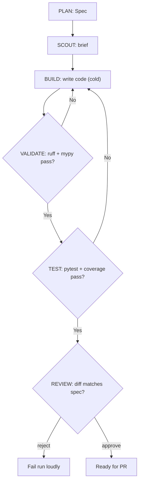

# Lab 2 — Build the Six-Stage Pipeline (Plan → Scout → Build → Validate → Test → Review)

**Time: ~5 hrs · Difficulty: Core · Builds on: Lab 1 (plus Months 8–9 for the safe runner, trace, and worker pattern)**

## Objective

Assemble the factory's assembly line. You'll build all six stages — PLAN (from Lab 1), SCOUT, BUILD, VALIDATE, TEST, and REVIEW — each as a composable unit with its own prompt, its own tool stack, and its own eval, and wire them together with per-stage telemetry. VALIDATE and TEST run *real* tools (`ruff`, `mypy`, `pytest`) as hard gates, not model opinions. REVIEW is an independent agent checking the diff against the spec. By the end you'll run one feature request through the entire pipeline against a small FastAPI app and watch it produce a validated, tested, reviewed diff — the working core of the milestone.

## Setup

```zsh
cd ~/agentic/month-10
# Scaffold the TARGET app the factory builds INTO (the workpiece, not the factory):
uv init --package targetapp && cd targetapp
uv add fastapi uvicorn
uv add --dev ruff mypy pytest pytest-cov httpx
mkdir -p app tests && touch app/__init__.py
cat > app/main.py <<'EOF'
from fastapi import FastAPI
app = FastAPI()

@app.get("/")
def root() -> dict[str, str]:
    return {"service": "targetapp"}
EOF
cat > tests/test_main.py <<'EOF'
from fastapi.testclient import TestClient
from app.main import app
client = TestClient(app)

def test_root() -> None:
    assert client.get("/").json() == {"service": "targetapp"}
EOF
git init -q && git add -A && git commit -qm "scaffold targetapp"
uv run pytest -q     # baseline: green
cd ../factory        # back to the factory from Lab 1
```

**Checkpoint:** `uv run pytest -q` in `targetapp/` is green, and `git -C ../targetapp status` is clean. The factory in `factory/` is separate from the app in `targetapp/`.
**If not:** a failing baseline test usually means the heredoc didn't write `app/main.py` or `tests/test_main.py` cleanly — `cat` both files and re-run the scaffold. If `git status` isn't clean, you forgot the initial commit; re-run `git add -A && git commit -qm "scaffold targetapp"`.

## Background

**Recall first (from memory):** In Month 9, where did each worker run, and how did the validator differ from a worker? In Month 8, what two mechanisms kept a tool call from touching anything outside its sandbox? You'll lean on both: stages are specialized workers, and BUILD/VALIDATE/TEST run through the jailed runner.

A pipeline is Month 9's worker pattern in a *fixed* arrangement: instead of a lead dynamically decomposing, the six stages *are* the decomposition, baked in. Each stage is single-purpose with a prompt, a tool stack, and an eval (README §4). The architecture's spine is **creative generation gated by deterministic verification**: PLAN and BUILD generate; VALIDATE, TEST, and REVIEW gate. Crucially, the gates are *real* — `ruff`/`mypy`/`pytest` via your Month 8 allowlisted runner — so "passing" means the tools agree, not that a model felt good about it. You reuse Month 9's `RunTrace` for telemetry and Month 8's jailed `subprocess` runner so every stage that touches the shell or filesystem stays inside the target repo.

The whole pipeline, including the gate-failure feedback loop you wire in step 7:



*Notice: a failed VALIDATE or TEST loops back into BUILD (with the error as feedback) up to a retry budget — the factory self-corrects. REVIEW has no loop: a reject fails the run, because re-running the builder won't fix a wrong-feature problem.*

## Steps

### 1. Define the stage abstraction and telemetry

Create `factory/stage.py`. A `StageResult` carries success, output, and detail; every stage emits a trace event so the run is queryable (README §9). Reuse your Month 9 `RunTrace`.

```python
# factory/stage.py
from dataclasses import dataclass, field

@dataclass
class StageResult:
    ok: bool
    output: dict = field(default_factory=dict)   # structured payload for the next stage
    detail: str = ""                              # human/feedback text (e.g. mypy errors)

@dataclass
class StageMetrics:
    stage: str
    model: str | None = None
    served_by: str | None = None
    tokens_in: int = 0
    tokens_out: int = 0
    ms: int = 0
    retries: int = 0
    eval_ok: bool = False
```

Copy your Month 9 `factory/trace.py` (`RunTrace`) in unchanged. Per stage you'll call `trace.emit(**StageMetrics(...).__dict__)`.

**Checkpoint:** `uv run python -c "from factory.stage import StageResult, StageMetrics; print(StageResult(ok=True))"` runs, and your `RunTrace` from Month 9 imports.
**If not:** an `ImportError` on `RunTrace` means `factory/trace.py` wasn't copied in from Month 9 — copy it now; the pipeline in step 7 depends on it. A `TypeError` on `StageResult(ok=True)` means you mistyped a field default (use `field(default_factory=dict)` for the mutable `output`).

### 2. SCOUT — read the codebase before building

Create `factory/scout.py`. SCOUT is **read-only** (README §5): it inspects the target repo and returns a *conventions brief* that becomes part of BUILD's context. Keep tools to `read_file`, `list_dir`, `grep` — nothing that writes.

```python
# factory/scout.py
from pathlib import Path
import subprocess, json
from llm import make_client
from factory.spec import Spec
from factory.stage import StageResult

SCOUT_SYSTEM = """You are SCOUT. You read a codebase and produce a CONVENTIONS BRIEF
for the BUILD stage. Output ONLY JSON: {"files":[paths to edit], "conventions":[short
rules to follow, e.g. 'routes are async', 'responses use dict[str,str]'], "prior_art":
[existing helpers to reuse]}. Be concrete; cite real file paths."""

def _grep(repo: Path, pattern: str) -> str:
    r = subprocess.run(["grep", "-rn", pattern, "app"], cwd=repo,
                       capture_output=True, text=True, timeout=30)
    return r.stdout[:2000]

def scout(spec: Spec, repo: Path, model: str = "qwen2.5:3b") -> StageResult:
    listing = "\n".join(str(p.relative_to(repo)) for p in (repo / "app").rglob("*.py"))
    samples = "\n".join((repo / "app" / "main.py").read_text().splitlines()[:40])
    ctx = (f"Repo files:\n{listing}\n\nSample (app/main.py):\n{samples}\n\n"
           f"Routes found:\n{_grep(repo, '@app')}\n\nSpec:\n{spec.to_markdown()}")
    client = make_client("ollama", model=model, base_url="http://localhost:11434")
    reply = client.complete(messages=[{"role": "system", "content": SCOUT_SYSTEM},
                                      {"role": "user", "content": ctx}],
                            tools=[], temperature=0.2)
    try:
        brief = json.loads(reply.text[reply.text.find("{"):reply.text.rfind("}") + 1])
    except json.JSONDecodeError:
        return StageResult(ok=False, detail="SCOUT produced unparsable brief")
    ok = bool(brief.get("files")) and all((repo / f).exists() or "app/" in f
                                          for f in brief.get("files", []))
    return StageResult(ok=ok, output=brief, detail=json.dumps(brief, indent=2))
```

**Checkpoint:** Running SCOUT on Lab 1's `/health` spec against `targetapp` returns a brief naming `app/main.py` and a convention like "routes return `dict[str, str]`". Its eval (`ok`) is `True` only when it cites real files.
**If not:** if the brief is unparsable, the 3B model added prose around the JSON — the brace-slice handles most cases, but sharpen `SCOUT_SYSTEM`'s "ONLY JSON" line. If `ok` is `False` on valid files, your existence check is comparing a repo-relative path to an absolute one; print `brief["files"]` and confirm the `(repo / f).exists()` join.

### 3. BUILD — implement the spec, boring and cold

Create `factory/build.py`. BUILD runs **cold** (temperature 0, README §6): given the spec and SCOUT's brief, it emits file edits and *nothing creative*. It writes via the Month 8 jailed writer (writes confined to the repo). Its eval: the working tree still parses.

```python
# factory/build.py
import json, ast
from pathlib import Path
from llm import make_client
from factory.spec import Spec
from factory.stage import StageResult

BUILD_SYSTEM = """You are BUILD. Implement the spec EXACTLY, honoring the conventions brief.
Rules: add NOTHING not in the acceptance_criteria; do not add deps; do not refactor unrelated
code. If the spec is ambiguous, output {"error":"...what's missing..."} instead of guessing.
Output ONLY JSON: {"edits":[{"path":"app/...","content":"<full new file contents>"}]}."""

def _safe_write(repo: Path, rel: str, content: str) -> None:
    target = (repo / rel).resolve()
    if not str(target).startswith(str(repo.resolve())):     # Month 8 jail
        raise ValueError(f"write escapes repo jail: {rel}")
    target.parent.mkdir(parents=True, exist_ok=True)
    target.write_text(content)

def build(spec: Spec, brief: dict, repo: Path, model: str = "qwen2.5-coder:7b",
          feedback: str = "") -> StageResult:
    user = (f"Spec:\n{spec.to_markdown()}\n\nConventions brief:\n{json.dumps(brief, indent=2)}"
            + (f"\n\nPREVIOUS ATTEMPT FAILED:\n{feedback}\nFix it." if feedback else ""))
    client = make_client("ollama", model=model, base_url="http://localhost:11434")
    reply = client.complete(messages=[{"role": "system", "content": BUILD_SYSTEM},
                                      {"role": "user", "content": user}],
                            tools=[], temperature=0.0)         # COLD: deterministic
    try:
        payload = json.loads(reply.text[reply.text.find("{"):reply.text.rfind("}") + 1])
    except json.JSONDecodeError:
        return StageResult(ok=False, detail="BUILD produced unparsable edits")
    if "error" in payload:
        return StageResult(ok=False, detail=f"BUILD refused (ambiguous spec): {payload['error']}")
    for edit in payload["edits"]:
        _safe_write(repo, edit["path"], edit["content"])
    # eval: every written file still parses as Python
    for edit in payload["edits"]:
        try:
            ast.parse((repo / edit["path"]).read_text())
        except SyntaxError as e:
            return StageResult(ok=False, detail=f"syntax error in {edit['path']}: {e}")
    return StageResult(ok=True, output={"edits": [e["path"] for e in payload["edits"]]})
```

**Checkpoint:** After BUILD on the `/health` spec, `git -C ../targetapp diff --stat` shows `app/main.py` modified, and `uv run python -c "import ast,pathlib; ast.parse(pathlib.Path('../targetapp/app/main.py').read_text())"` succeeds. BUILD added a `/health` route and nothing else.
**If not:** if BUILD added extra routes or refactored unrelated code, it's running too warm or its prompt is too permissive — confirm `temperature=0.0` and that `BUILD_SYSTEM` forbids invention. If `_safe_write` raised a jail error on a legitimate path, you resolved paths inconsistently; compare `target.resolve()` to `repo.resolve()`, both absolute (see Troubleshooting).

### 4. VALIDATE — `ruff` + `mypy` as hard gates

Create `factory/validate.py`. No model calls — just real tools via the Month 8 allowlisted runner, gated on exit code (README §7).

```python
# factory/validate.py
import subprocess
from pathlib import Path
from factory.stage import StageResult

def _run(cmd: list[str], repo: Path) -> subprocess.CompletedProcess:
    return subprocess.run(cmd, cwd=repo, capture_output=True, text=True, timeout=120)

def validate(repo: Path) -> StageResult:
    ruff = _run(["uv", "run", "ruff", "check", "."], repo)
    mypy = _run(["uv", "run", "mypy", "app"], repo)
    ok = ruff.returncode == 0 and mypy.returncode == 0
    detail = f"--- ruff ---\n{ruff.stdout}\n--- mypy ---\n{mypy.stdout}"
    return StageResult(ok=ok, detail=detail)
```

**Checkpoint:** `uv run python -c "from factory.validate import validate; from pathlib import Path; print(validate(Path('../targetapp')).ok)"` prints `True` on clean code. Introduce a deliberate type error in `targetapp` and confirm it prints `False` with `mypy` output in `detail` — that `detail` is what feeds back into a BUILD retry.
**If not:** "command not found" means `ruff`/`mypy` aren't dev-deps *inside* `targetapp` — run `uv add --dev ruff mypy` there, not in the factory. If it prints `True` even with a type error, your `cwd` is the factory, not the target repo; the runner must `cwd=repo`.

### 5. TEST — run existing tests, generate new ones, enforce coverage

Create `factory/test_stage.py`. It first runs the existing suite (regression), then asks the model to generate tests *from the spec's acceptance criteria*, writes them, and runs `pytest --cov` with a coverage floor.

```python
# factory/test_stage.py
import subprocess, json
from pathlib import Path
from llm import make_client
from factory.spec import Spec
from factory.stage import StageResult

TEST_SYSTEM = """You are TEST. Write pytest tests that assert the spec's acceptance_criteria
against the running app (use fastapi.testclient.TestClient). Output ONLY JSON:
{"path":"tests/test_<feature>.py","content":"<full test file>"}. One assertion per criterion."""

def _run(cmd, repo): return subprocess.run(cmd, cwd=repo, capture_output=True, text=True, timeout=180)

def test_stage(spec: Spec, repo: Path, model: str = "qwen2.5-coder:7b",
               cov_floor: int = 80) -> StageResult:
    regression = _run(["uv", "run", "pytest", "-q"], repo)        # did we break anything?
    if regression.returncode != 0:
        return StageResult(ok=False, detail=f"regression failures:\n{regression.stdout[-1500:]}")
    client = make_client("ollama", model=model, base_url="http://localhost:11434")
    reply = client.complete(messages=[{"role": "system", "content": TEST_SYSTEM},
        {"role": "user", "content": spec.to_markdown()}], tools=[], temperature=0.0)
    gen = json.loads(reply.text[reply.text.find("{"):reply.text.rfind("}") + 1])
    (repo / gen["path"]).write_text(gen["content"])
    res = _run(["uv", "run", "pytest", f"--cov=app", f"--cov-fail-under={cov_floor}", "-q"], repo)
    return StageResult(ok=res.returncode == 0, output={"test_file": gen["path"]},
                       detail=res.stdout[-2000:])
```

**Checkpoint:** TEST on the `/health` spec writes `tests/test_*.py` with a `GET /health` assertion, and `pytest --cov` passes at or above the floor. If generated tests fail, `detail` shows pytest's output — feedback for a BUILD retry.
**If not:** if the coverage gate always fails, a one-route feature barely moves total coverage — scope `--cov=app` and set a realistic floor (see Troubleshooting). If the regression step fails before any new test runs, BUILD broke an existing route; that's a real signal — the failure should feed back into BUILD, not be silenced.

### 6. REVIEW — an independent agent checks the diff against the spec

Create `factory/review.py`. REVIEW gets a **fresh context** (the `git diff` and the spec only — *not* BUILD's reasoning), ideally a different model, with an adversarial prompt (README §8).

```python
# factory/review.py
import subprocess, json
from pathlib import Path
from llm import make_client
from factory.spec import Spec
from factory.stage import StageResult

REVIEW_SYSTEM = """You are an INDEPENDENT REVIEWER. You did not write this code. Check the
DIFF against the SPEC only. Reject if: any acceptance_criterion is unmet; the diff touches
something in out_of_scope; a constraint is violated (new deps, schema changed); or it adds
behavior the spec never requested. Output ONLY JSON:
{"verdict":"approve"|"reject","reasons":[".. cite the criterion/constraint .."]}."""

def review(spec: Spec, repo: Path, model: str = "qwen2.5:3b") -> StageResult:
    diff = subprocess.run(["git", "diff", "HEAD"], cwd=repo,
                          capture_output=True, text=True, timeout=30).stdout[:6000]
    client = make_client("ollama", model=model, base_url="http://localhost:11434")
    reply = client.complete(messages=[{"role": "system", "content": REVIEW_SYSTEM},
        {"role": "user", "content": f"SPEC:\n{spec.to_markdown()}\n\nDIFF:\n{diff}"}],
        tools=[], temperature=0.0)
    v = json.loads(reply.text[reply.text.find("{"):reply.text.rfind("}") + 1])
    return StageResult(ok=v.get("verdict") == "approve", output=v,
                       detail="; ".join(v.get("reasons", [])))
```

**Checkpoint:** REVIEW on the (correct) `/health` diff returns `approve`. Now hand-edit the target so it *also* adds an unrequested `/version` route, re-run REVIEW, and confirm it `reject`s and cites the out-of-scope/unrequested addition — the failure TEST and VALIDATE *cannot* catch.
**If not:** if REVIEW approves the `/version` addition, it's too soft or seeing too much — give it *only* diff + spec, run it cold, and use an adversarial framing; try a different model from BUILD. If it rejects the *correct* diff, the diff is empty (you didn't commit BUILD's output, so `git diff HEAD` shows nothing) — REVIEW needs a real diff to judge.

### 7. Wire the pipeline and run one feature end-to-end (gradual release)

Steps 2–6 each gave you a worked stage; the genuinely new skill now is the **gate-failure feedback loop** — turning a failed `ruff`/`pytest` into a BUILD retry instead of a dead end. Build it in three passes.

#### Stage 1 — Worked example (I do)

Create `factory/pipeline.py` exactly as below and run it. It threads a `RunTrace` through all six stages, feeds VALIDATE/TEST failures back into a **bounded BUILD retry loop**, and stops the run loudly if any gate exhausts its retries. Trace the control flow by hand once: follow what happens when `val.ok` is `False`.

```python
# factory/pipeline.py
import time
from pathlib import Path
from factory.plan import plan
from factory.scout import scout
from factory.build import build
from factory.validate import validate
from factory.test_stage import test_stage
from factory.review import review
from factory.trace import RunTrace          # your Month 9 RunTrace

def run_pipeline(request: str, repo: Path, run_dir: Path, max_build_retries: int = 3) -> bool:
    trace = RunTrace(run_dir); t0 = time.time()
    try:
        spec = plan(request); trace.emit(stage="plan", eval_ok=True, title=spec.title)
        sc = scout(spec, repo); trace.emit(stage="scout", eval_ok=sc.ok)
        if not sc.ok: return False
        feedback = ""
        for attempt in range(max_build_retries):
            b = build(spec, sc.output, repo, feedback=feedback)
            trace.emit(stage="build", eval_ok=b.ok, retries=attempt)
            if not b.ok: feedback = b.detail; continue
            val = validate(repo); trace.emit(stage="validate", eval_ok=val.ok)
            if not val.ok: feedback = val.detail; continue
            tst = test_stage(spec, repo); trace.emit(stage="test", eval_ok=tst.ok)
            if not tst.ok: feedback = tst.detail; continue
            break
        else:
            trace.emit(stage="pipeline", eval_ok=False, reason="build/validate/test retries exhausted")
            return False
        rev = review(spec, repo); trace.emit(stage="review", eval_ok=rev.ok, reasons=rev.detail)
        trace.emit(stage="pipeline", eval_ok=rev.ok, seconds=round(time.time() - t0, 1))
        return rev.ok
    finally:
        trace.close()
```

**Checkpoint:** `uv run python -c "from factory.pipeline import run_pipeline; from pathlib import Path; print(run_pipeline('add a /health endpoint returning status ok', Path('../targetapp'), Path('runs/health')))"` prints `True`, and `cat runs/health/trace.jsonl` shows one event per stage (plan → scout → build → validate → test → review → pipeline) with `eval_ok` flags and a `seconds` total. The run completed on local Ollama for **$0**.
**If not:** if it returns `False`, read `trace.jsonl` bottom-up and find the first `eval_ok=false` — that names the failing stage; debug that stage in isolation. If the run hangs, a `subprocess` is missing a `timeout=` or Ollama is loading a cold model — every `subprocess.run` must pass `timeout=`.

#### Stage 2 — Faded practice (we do)

The worked loop retries on VALIDATE/TEST but treats SCOUT failure as fatal (`if not sc.ok: return False`). Add a **single SCOUT retry**: if the first SCOUT brief fails its eval, re-run SCOUT once before giving up. The shape is given; fill the TODOs.

```python
# inside run_pipeline, replace the single scout(...) call:
sc = scout(spec, repo); trace.emit(stage="scout", eval_ok=sc.ok, retries=0)
if not sc.ok:
    sc = scout(spec, repo)                       # TODO 1: one retry
    trace.emit(stage="scout", eval_ok=sc.ok, retries=1)
    if not sc.ok:
        ...                                      # TODO 2: emit a pipeline failure + return False
```

**Checkpoint:** a run still succeeds end-to-end, and the trace now shows up to two `scout` events when the first brief is weak.
**If not:** if you see two `scout` events on *every* run, your first SCOUT eval is too strict (rejecting valid briefs) — loosen the file-existence check. If the retry never fires, the eval never returns `False`; that's fine on the easy `/health` spec.

#### Stage 3 — Independent (you do)

With no scaffold, add a **per-run retry counter** to the trace: the final `pipeline` event should report the *total* BUILD attempts the run consumed across all gate failures (so `metrics.py` in Lab 3 can later answer "which feature needed the most retries?"). Definition of done: the `pipeline` event carries a `build_attempts` integer that matches the number of times `build(...)` was called that run.

**Checkpoint:** a run that passes first BUILD reports `build_attempts: 1`; force a VALIDATE failure (inject a type error via a constraint the model violates) and confirm `build_attempts` climbs.
**If not:** if `build_attempts` is always 1, you're reading the loop variable after the `break` instead of counting calls — increment a counter at the top of each loop iteration and emit it in the `finally`/final event.

## Definition of Done

- Six stage modules (`plan`, `scout`, `build`, `validate`, `test_stage`, `review`), each with a prompt (or none, for the tool-only gates), a tool stack, and an eval.
- VALIDATE runs `ruff` + `mypy` and TEST runs `pytest --cov` as **real subprocess gates** (Month 8 runner), not model calls.
- BUILD runs **cold** and is jailed to the target repo; PLAN runs **warm**; REVIEW is **independent** (fresh context, diff-vs-spec).
- VALIDATE/TEST failures feed back into a **bounded BUILD retry loop** visible in the trace.
- `factory/pipeline.py` runs one feature request end-to-end and emits a per-stage `trace.jsonl`; the whole run is **$0** on Ollama.
- Self-verify: a successful pipeline run prints `True` and `wc -l runs/<feature>/trace.jsonl` shows at least 6 events; REVIEW demonstrably rejects an out-of-scope diff.

**Self-explain:** in one sentence, why does feeding a failed gate's *exact output* back into BUILD make the factory self-correct the way a human developer would?

## Stretch Goals

1. **Per-stage cost in the trace.** Record `tokens_in`/`tokens_out` per model stage (your Month 7 reply should expose usage) and have the pipeline print a per-run cost (`$0.00` on Ollama; estimated cents for a paid stage).
2. **Different model for REVIEW.** Point REVIEW at a *different* model than BUILD (a second opinion) and confirm via the trace that the reviewer isn't just echoing the builder.
3. **Auto-revert on failure.** On a failed run, `git checkout -- .` the target repo so a failed feature leaves no half-written mess — a real factory cleans up after itself.
4. **Stage timeout + retry budget per stage.** Give each model stage its own timeout and retry count, and surface "which stage is flakiest" from the trace.

## Troubleshooting

- **BUILD writes outside the repo.** The `_safe_write` jail should raise; if it doesn't, you resolved paths wrong — compare `target.resolve()` against `repo.resolve()`, both absolute.
- **`mypy`/`ruff` "command not found".** They must be dev-deps *in the target app* (`uv add --dev` inside `targetapp`), and the runner's `cwd` must be the target repo, not the factory.
- **TEST coverage floor always fails.** A new endpoint with one test may not move total coverage much; scope `--cov=app` and set a realistic floor, or have TEST target coverage of the *changed* file.
- **REVIEW approves everything.** It's sharing too much context or the prompt is too soft. Give it *only* diff + spec, run it cold, use an adversarial framing, and try a different model from BUILD.
- **Stages produce non-JSON.** Same as Lab 1 — slice to outer braces and retry. For the tool-only stages (VALIDATE) there's no model, so this can't happen there.
- **Pipeline hangs.** A `subprocess` without a timeout, or Ollama loading a cold model. Every `subprocess.run` has `timeout=`; give the first model call of each model a few seconds to load.
