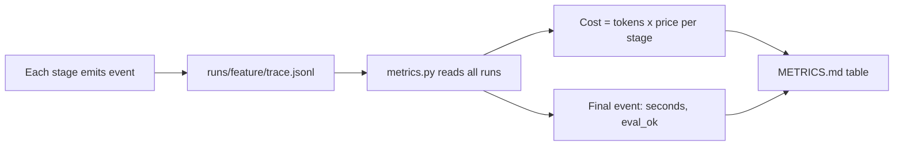

# Lab 3 — The Mini Feature Factory (Milestone)

**Time: ~6 hrs · Difficulty: Core / Stretch · Builds on: Labs 1–2 and the whole month (plus Months 7–9)**

## Objective

Ship the month's milestone: a **CLI factory** that takes a one-paragraph feature request for a real Python web app, runs it through the full six-stage pipeline, and produces a **PR with code, tests, and a changelog entry** — no human edits between the request and the PR. You'll close the loop from a passing pipeline run to a real branch + commit + `gh pr create`, run the factory on **five feature requests of varying complexity**, and produce a **metrics table** (dollars-per-feature, time-to-PR, success rate) plus the finalized `SPEC.md`. Done means you've stopped asking "how do I get the model to do X?" and started asking "what spec format makes X trivial to produce?"

## Setup

```zsh
cd ~/agentic/month-10/factory
uv add --dev gh 2>/dev/null || brew install gh
gh auth status || gh auth login          # need a GitHub repo for the target app
# Push the targetapp from Lab 2 to a GitHub remote so PRs have somewhere to go:
cd ../targetapp
gh repo create targetapp --private --source=. --remote=origin --push 2>/dev/null || \
  git push -u origin main
cd ../factory
mkdir -p runs
```

**Checkpoint:** `gh repo view -R <you>/targetapp` succeeds and `git -C ../targetapp remote -v` shows `origin`. The factory can open PRs against the target.
**If not:** if `gh repo view` fails, run `gh auth status` — you're not logged in, so `gh auth login`. If `remote -v` shows nothing, the `gh repo create ... --push` didn't run (repo name taken?); create it manually and `git remote add origin <url>` then `git push -u origin main`.

## Background

**Recall first (from memory):** From Lab 2, what does each stage write into `trace.jsonl`, and which final event carries the run's total seconds? From Month 8, why do all `git` actions get scoped to the target repo's directory? You'll aggregate those trace events into metrics and open PRs only inside the target repo's blast radius.

This lab is composition (the Lab 2 pipeline) plus three new pieces: turning a passing run into a **real PR** (Month 8 git safety), computing the **metrics table** from the trace (README §9), and proving the factory on **five varied features** first-try with zero edits (README §1–§2).

How telemetry becomes the metrics table — the cost-per-artifact flow you wire in step 6:



*Notice: nothing computes cost live — every stage just logs tokens and timing, and `metrics.py` aggregates after the fact. On Ollama the per-token price is `$0`, so dollars-per-feature is `$0.00` — but you still report it, because the same code reports real cents the moment a paid stage is used.* The hard discipline is the "zero human edits" rule: when a feature fails, you do **not** patch the produced code — you fix the **spec format** or a **stage** and re-run. That rule is what forces the leverage into the spec, which is the entire point of the month. Reuse everything: Lab 2's six stages, Month 7's fallback, Month 8's jailed runner, Month 9's trace.

## Steps

### 1. Turn a passing run into a PR

Create `factory/pr.py`. On a passing pipeline run, it creates a branch, generates a **changelog entry**, commits code + tests + changelog, and opens a PR with `gh`. All git actions are scoped to the target repo (Month 8 blast-radius).

```python
# factory/pr.py
import subprocess, datetime
from pathlib import Path
from factory.spec import Spec

def _git(args: list[str], repo: Path) -> str:
    return subprocess.run(["git", *args], cwd=repo, capture_output=True,
                          text=True, timeout=60, check=True).stdout

def open_pr(spec: Spec, repo: Path, slug: str) -> str:
    branch = f"factory/{slug}"
    _git(["checkout", "-b", branch], repo)
    # changelog entry generated FROM the spec — part of the produced artifact
    cl = repo / "CHANGELOG.md"
    entry = (f"## {datetime.date.today()} — {spec.title}\n{spec.intent}\n"
             + "".join(f"- {c}\n" for c in spec.acceptance_criteria) + "\n")
    cl.write_text(entry + (cl.read_text() if cl.exists() else ""))
    _git(["add", "-A"], repo)
    _git(["commit", "-m", f"feat: {spec.title}\n\n{spec.intent}"], repo)
    _git(["push", "-u", "origin", branch], repo)
    body = spec.to_markdown() + "\n\n_Produced by the Mini Feature Factory. No human edits._"
    out = subprocess.run(["gh", "pr", "create", "--title", f"feat: {spec.title}",
                          "--body", body, "--head", branch],
                         cwd=repo, capture_output=True, text=True, timeout=60)
    return out.stdout.strip()      # the PR URL
```

**Checkpoint:** Calling `open_pr` after a passing run produces a PR URL; `gh pr view -R <you>/targetapp <n>` shows code, a test file, and a `CHANGELOG.md` entry — all generated, none hand-written.
**If not:** "must be on a branch" means the branch wasn't pushed before `gh pr create` — confirm `open_pr` does `checkout -b` then `push -u origin branch` first (see Troubleshooting). If the commit is empty, BUILD/TEST wrote nothing this run; you opened a PR on a failed pipeline — only call `open_pr` when the pipeline returned `True`.

### 2. Build the CLI entrypoint

Create `factory/cli.py`. It takes a one-paragraph request and a feature slug, runs the pipeline, and on success opens a PR. This is the factory's public interface — one request in, one PR out.

```python
# factory/cli.py
import sys, time
from pathlib import Path
from factory.pipeline import run_pipeline
from factory.plan import plan
from factory.pr import open_pr

def main() -> int:
    slug, request = sys.argv[1], sys.argv[2]
    repo = Path("../targetapp")
    run_dir = Path(f"runs/{slug}-{int(time.time())}")
    # reset target to a clean main before each feature (each run starts from a known base)
    import subprocess
    subprocess.run(["git", "checkout", "main"], cwd=repo, check=True)
    subprocess.run(["git", "pull", "-q"], cwd=repo)
    ok = run_pipeline(request, repo, run_dir)
    if ok:
        spec = plan(request)                       # re-derive spec for PR metadata (or persist it in the run)
        url = open_pr(spec, repo, slug)
        print(f"PR: {url}")
        return 0
    print(f"FAILED — see {run_dir}/trace.jsonl"); return 1

if __name__ == "__main__":
    raise SystemExit(main())
```

> Tip: persist the `Spec` to `run_dir/spec.json` inside the pipeline so the CLI doesn't re-run PLAN; the snippet re-derives it for brevity.

**Checkpoint:** `uv run python -m factory.cli health "add a /health endpoint that returns status ok"` prints a `PR:` URL, and a fresh `runs/health-*/trace.jsonl` exists.
**If not:** an `IndexError` means you didn't pass both `slug` and `request` args. If it prints `FAILED`, open the named `trace.jsonl` and find the first `eval_ok=false` stage — the CLI is working; a stage isn't. If the target isn't on a clean `main`, the prior run's branch is still checked out; the CLI must `git checkout main` first.

### 3. Design five feature requests across a complexity gradient

Write `features.txt` — five one-paragraph requests spanning real complexity (this gradient is the "Excellent" bar). Suggested:

```text
1. (trivial)     Add a /health endpoint that returns {"status":"ok"}.
2. (small)       Add GET /products returning a static list of three products as JSON.
3. (medium)      Add GET /products/{id} returning one product or 404 if not found.
4. (cross-cut)   Add a request-ID middleware that attaches an X-Request-ID header to every response.
5. (stateful)    Add POST /products to append a product to the in-memory list, returning 201 and the created item.
```

**Checkpoint:** `features.txt` has five requests of genuinely different shapes (a route, a parameterized route, middleware, a write). You can predict which one will stress the factory most (usually the cross-cutting or stateful one).
**If not:** if your five requests are all "add an endpoint" variants, they won't exercise the complexity gradient the Excellent tier rewards — swap at least one for a cross-cutting concern (middleware, logging) and one that mutates state, since those are where loose specs fail.

### 4. Run all five through the factory

Drive the CLI over the five requests. Each starts from a clean `main`, runs the full pipeline, and (on success) opens a PR. Record which succeed **first-try with zero edits**.

```zsh
uv run python -m factory.cli health     "Add a /health endpoint that returns {\"status\":\"ok\"}."
uv run python -m factory.cli products   "Add GET /products returning a static list of three products as JSON."
uv run python -m factory.cli product-id "Add GET /products/{id} returning one product or 404 if not found."
uv run python -m factory.cli request-id "Add middleware attaching an X-Request-ID header to every response."
uv run python -m factory.cli create-prod "Add POST /products appending to the in-memory list, returning 201 and the item."
gh pr list -R <you>/targetapp           # the produced PRs
```

**Checkpoint:** `runs/` holds five run directories with traces, and `gh pr list` shows the PRs the factory opened. Note your raw success count (e.g., 3/5 on first pass is normal before you iterate the spec format).
**If not:** if later features build on earlier ones' code, the CLI isn't resetting to `main` between runs (also delete the prior feature branch). If every feature fails at the same stage, that stage has a systematic bug — debug it once in isolation rather than re-running the whole CLI five times.

### 5. When a feature fails, fix the SPEC or a STAGE — never the PR

For each first-try failure, open its `trace.jsonl`, find the stage that failed (`eval_ok=false`), and diagnose: was the **spec** too loose (BUILD invented something, or TEST couldn't write a test from a vague criterion)? Was a **stage** weak (REVIEW too soft, VALIDATE missing a check)? Apply the **spec-format or stage** fix and re-run. Record each fix.

```text
# Example diagnoses → fixes (record yours in RETRO.md):
# request-id failed: PLAN's spec said "attach a request id" with no testable criterion.
#   FIX (spec format): PLAN prompt now requires each criterion name an observable
#   (header/status/body). Re-ran: TEST generated `assert "X-Request-ID" in resp.headers`. Pass.
# create-prod failed: BUILD added validation the spec didn't ask for, REVIEW approved it.
#   FIX (stage): REVIEW now rejects behavior absent from acceptance_criteria. Re-ran: pass.
```

**Checkpoint:** Every failure was resolved by changing the **spec format or a stage**, and you can point to the trace line that showed the failure. You did **not** edit any produced PR by hand.
**If not:** if you found yourself editing the produced code, stop — that voids "zero human edits." Revert the edit, identify which stage's output was wrong, and fix the spec format or that stage instead. If a fix helped one feature but broke another, it was a prompt "magic word," not a structural fix; look for a spec-format rule that generalizes.

### 6. Compute the metrics table (gradual release)

The new skill here is **turning a pile of trace events into the metrics that define a factory** — cost, time, success rate. Build it in three passes.

#### Stage 1 — Worked example (I do)

Create `factory/metrics.py` exactly as below and run it. Study how `cost()` looks up a per-token price by `served_by` (so Ollama is `$0` and a paid model is real cents), and how the final `pipeline` event supplies `seconds` and `eval_ok`.

```python
# factory/metrics.py — aggregate the traces into the metrics table
import json, sys
from pathlib import Path

PRICES = {"ollama": (0.0, 0.0)}     # ($/1k in, $/1k out). Add paid models if you used them.

def cost(ev: dict) -> float:
    pin, pout = PRICES.get(ev.get("served_by", "ollama"), (0.0, 0.0))
    return (ev.get("tokens_in", 0) / 1000 * pin) + (ev.get("tokens_out", 0) / 1000 * pout)

def main(runs_dir="runs"):
    rows, wins = [], 0
    for d in sorted(Path(runs_dir).iterdir()):
        events = [json.loads(l) for l in (d / "trace.jsonl").read_text().splitlines()]
        final = next((e for e in reversed(events) if e["stage"] == "pipeline"), {})
        dollars = sum(cost(e) for e in events)
        ok = final.get("eval_ok", False); wins += ok
        rows.append((d.name, dollars, final.get("seconds", "?"), "success" if ok else "FAIL"))
    print("| feature | $/feature | time-to-PR | result |")
    print("|---|---|---|---|")
    for name, d, s, r in rows:
        print(f"| {name} | ${d:.4f} | {s}s | {r} |")
    print(f"\n**Success rate: {wins}/{len(rows)}**")

if __name__ == "__main__":
    main(*sys.argv[1:])
```

**Checkpoint:** `uv run python -m factory.metrics > METRICS.md` produces a table with one row per feature, a `$/feature` of `$0.0000` on pure-Ollama runs (or real cents if you used a paid stage), a time-to-PR, and an overall success rate line.
**If not:** a `KeyError` on `"stage"` means a trace line is malformed JSON — find the run that wrote it. If `$/feature` is blank, your stages aren't recording `tokens_in/out`/`served_by`; have each model stage emit usage into the trace (Month 7's reply exposes it). If `seconds` shows `?`, the final `pipeline` event isn't being written — confirm the pipeline's `finally`/final emit ran.

#### Stage 2 — Faded practice (we do)

Extend `metrics.py` with a per-stage breakdown: print which stage consumed the most tokens across all runs. The aggregation shape is given; fill the TODOs.

```python
# factory/metrics.py  (append)
from collections import defaultdict

def tokens_by_stage(runs_dir="runs") -> dict[str, int]:
    totals: dict[str, int] = defaultdict(int)
    for d in sorted(Path(runs_dir).iterdir()):
        for line in (d / "trace.jsonl").read_text().splitlines():
            ev = json.loads(line)
            # TODO 1: add tokens_in + tokens_out to totals[ev["stage"]]
            ...
    return dict(totals)
    # TODO 2: in main(), print the stage with the highest total (the cost driver).
```

**Checkpoint:** the breakdown shows BUILD (the coder-model stage) as the heaviest token consumer on most runs.
**If not:** if a stage is missing, it never emitted token counts — only model stages (PLAN/SCOUT/BUILD/TEST/REVIEW) have tokens; the tool-only VALIDATE legitimately has none. If totals look doubled, you're summing the same event twice across retries — that's actually correct (retries cost tokens), so leave it.

#### Stage 3 — Independent (you do)

With no scaffold, add a function `most_expensive_feature(runs_dir="runs")` that returns the run directory name with the highest dollar cost (ties broken by most seconds). Definition of done: on an all-Ollama run where every feature is `$0`, it falls back to the slowest feature, and you can explain why that's a reasonable tiebreak for a factory operator.

**Checkpoint:** the function returns a real run-dir name, and on pure-Ollama data it returns your slowest feature (longest `seconds`).
**If not:** if it returns `None`, your max is comparing across an empty iterable — guard the empty-`runs/` case. If it always returns the first dir, your tiebreak isn't reading `seconds` from the final `pipeline` event.

### 7. Finalize SPEC.md, link the PRs, write RETRO.md

Update Lab 1's `SPEC.md` with any format changes the five features forced. In your factory `README.md`, **link the five produced PRs** and embed the metrics table. Write `RETRO.md` arguing, from the metrics, that the leverage came from the **spec format**, not the prompts.

```markdown
# Retro — Mini Feature Factory

## First pass: 3/5. After spec-format iteration: 5/5.
## What moved the metric
- request-id (cross-cut) failed until the spec format REQUIRED observable criteria.
  This was a SPEC change, not a prompt tweak — and it fixed an entire CLASS of
  "vague verb" features at once.
- create-prod failed until REVIEW rejected un-specced behavior (a STAGE change).
## Conclusion
The two fixes that mattered were a spec-format rule and a review rule. No prompt
"magic words" moved success rate. The question that paid off was
"what spec format makes this trivial," not "how do I prompt the model."
```

**Checkpoint:** `SPEC.md` is final with a rationale per field; the factory README links five PRs and shows the metrics table; `RETRO.md` names the spec-format / stage changes that raised success rate, with evidence from the metrics.
**If not:** if your `RETRO.md` lists prompt-wording tweaks as the wins, you haven't found the real leverage — re-read which fixes generalized across features; those are spec-format or stage rules. If you can't link five passing PRs, that's honest: report your true success rate (a working factory with metrics is Passing; 5/5 on the gradient is Excellent).

## Definition of Done

- A **CLI** (`factory/cli.py`) that takes a one-paragraph request and produces a **PR** (branch + commit + `gh pr create`) with code, tests, and a `CHANGELOG.md` entry — no human edits to the produced PR.
- All **six stages** run per feature; VALIDATE/TEST are real `ruff`/`mypy`/`pytest` gates; REVIEW is independent.
- The factory succeeds on **at least five varied feature requests first-try, zero edits**; the five PRs are linked from the README.
- A **`METRICS.md`** table reports dollars-per-feature, time-to-PR, and success rate, computed from the traces; the milestone is **$0-completable on Ollama** (cost shown either way).
- A finalized **`SPEC.md`** (the plan-prompt format) and a **`RETRO.md`** arguing the leverage came from the spec format.
- Model fallback (Month 7) is wired per stage; every run writes `runs/<feature>/trace.jsonl`.
- Self-verify: `uv run python -m factory.metrics` prints the table and a success rate of at least the number of features you claim; `gh pr list -R <you>/targetapp` shows the produced PRs.

**Self-explain:** in one sentence, why does reporting dollars-per-feature and first-try success rate turn "a script that sometimes works" into "a factory" — and why does the spec format, not the prompt, move those numbers?

## Stretch Goals

1. **5/5 on the gradient (Excellent tier).** Get all five — including the cross-cutting and stateful features — passing first-try by improving only the spec format and the stages, and record the iteration in `RETRO.md`.
2. **Borrowed OSS target.** Point the factory at a small real open-source FastAPI/Flask project instead of the scaffold, and produce one feature PR against it — proving SCOUT and the factory handle a codebase you didn't write.
3. **Paid-stage cost comparison (labeled).** Run BUILD and REVIEW on a frontier model via your Month 7 client, report the real dollars-per-feature, and compare first-try success rate against the all-Ollama run. State explicitly what the cents bought.
4. **Queryable telemetry.** Add `factory/query.py` answering "which stage fails most often?" and "which feature was most expensive?" directly from the traces — turning the run log into an analytics surface.
5. **Parallel features.** Run the five features concurrently (each in its own worktree so branches don't collide) and report total wall-clock vs. serial.

## Troubleshooting

- **`gh pr create` fails: "must be on a branch".** You're on a detached HEAD or the branch wasn't pushed. Ensure `open_pr` checks out a named branch and pushes it before `gh pr create`.
- **Each feature builds on the last.** You forgot to reset to `main` before each run. The CLI must `git checkout main && git pull` (and ideally delete the prior feature branch) so every feature starts from a clean base.
- **Success rate stuck at 3/5.** Open the failing traces. Almost always the fix is a *spec-format* rule (force testable criteria) or a *REVIEW* rule (reject un-specced behavior) — resist the urge to patch the produced code, which would void "zero edits."
- **`$/feature` is blank or wrong.** Your stages aren't recording `tokens_in/out`/`served_by`. Have each model stage emit usage into the trace (Month 7 reply exposes it); Ollama is `$0` but you still report it.
- **Coverage gate flaps between runs.** Pin `--cov=app` and a stable floor; tiny features barely move total coverage, so consider covering the changed file rather than the whole package.
- **PR body is huge / leaks reasoning.** The body should be `spec.to_markdown()`, not stage transcripts. REVIEW's reasons can go in a PR comment, not the body.
- **Ollama OOM on the coder model.** `qwen2.5-coder:7b` needs a few GB; close other apps, or run BUILD on a smaller coder model and accept a lower first-try rate (the metrics will show it honestly).
