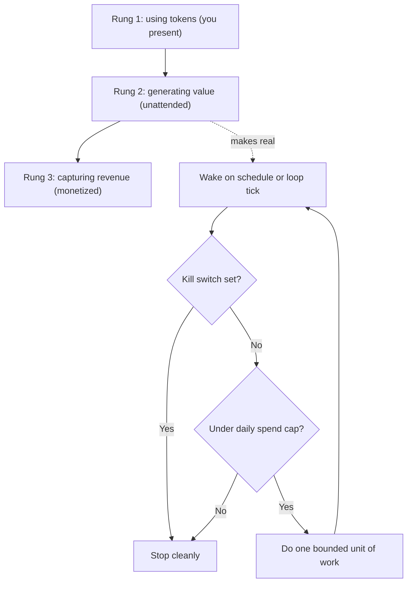

# Month 11 — Always On Agents (AFK Agents)

**Pillar 4 — Always On Agents**

## Overview

For ten months you have been the one pressing enter. You run the agent, you watch it work, you read the trace, you stop it when it does something dumb. Every token you have spent has bought *you* an output, while you sat at the keyboard supervising. This month you cut that cord. You learn to deploy agents that run when you are not watching — on a schedule, or in a loop — so that **tokens generate value while you sleep.** This is the AFK ("away from keyboard") transition, and it is as much an economic shift as an engineering one.

Here is the spine of the pillar, the **token-economics ladder**. Rung one is **using tokens**: you pay, the output is for you, you are present. That is every month so far. Rung two is **generating value from tokens**: the output saves *hours* and those hours have a measurable dollar worth — a digest that replaces thirty minutes of reading, a triage pass that a person no longer has to do. The agent earns its keep even though no money changes hands, and it does so *without you sitting there*. Rung three is **capturing revenue from tokens**: the output is monetized, directly (a paid service) or indirectly (it does billable work). You will not necessarily reach rung three this month, but you will build the machine that makes rung two real and rung three possible: an agent that runs unattended and produces value on a clock you set, not one you babysit.

The catch — and it is the entire reason this is an *engineering* discipline and not a cron tutorial — is that an unattended agent is a loaded gun pointed at your wallet and your blast radius. When you are watching, *you* are the kill switch and *you* are the budget cap. Take yourself out of the loop and those safeties have to be built, in code, and *tested*, or a stuck retry loop quietly spends four figures overnight and an unsupervised action does something irreversible while you sleep. So the month is two disciplines welded together: **scheduling and durability** (launchd, cron, the `while True` loop, idempotency, durable state in SQLite) and **safety at a distance** (hard daily spend caps, circuit breakers, kill switches that actually work, structured logs, alerting when something breaks). You will deploy locally first with macOS `launchd`, then push a narrowed agent onto a free 24/7 cloud host, and the month ends with the **First AFK Agent** milestone: a real agent running right now, without you, that you trust not to bankrupt you or do something it cannot undo.

This builds directly on what you already own. The pluggable providers (Month 7), the danger-rated guardrails (Month 8), the multi-agent harness (Month 9), and the software factory (Month 10) are the *payloads* you will now deploy. This month is the deployment substrate, the safety rails, and the operational discipline that lets any of those run unattended without becoming a liability.

The diagram below is the mental model for the whole month: the **token-economics ladder** on the left, and the **guarded always-on loop** on the right that makes climbing it safe. Notice that every iteration of an unattended agent passes through two gates — a spend-cap check and a kill-switch check — *before* it is allowed to spend a token. Those two gates are the entire reason this is engineering and not a cron tutorial.


*Notice: the ladder is the why (move an agent from rung 1 to rung 2); the loop is the how — no token is spent until both the kill-switch and the spend-cap gate have said yes.*

## Prerequisites

Coming in, you should be able to do everything from Months 1 through 10:

- Work fluently in zsh on macOS, use Git, read HTTP/JSON, and call APIs from Python with timeouts, retries, and `.env`-loaded secrets (Months 1–2, 4).
- Write structured Python with classes, `Protocol` interfaces, dependency injection, `pytest`, type hints, and structured logging (Month 5).
- Hand-write and explain the agent loop, run tool calls, apply the working-directory jail, and write a JSONL trace with per-call cost (Months 6, 8).
- Swap models behind interfaces with a config-driven fallback to local Ollama, and rate tools by danger with sandboxes and human gates (Months 7–8).
- Compose a multi-agent harness and a software factory with per-run traces and cost logging (Months 9–10).

You do **not** need any prior systems-administration, distributed-systems, or cloud experience. We build scheduling, durability, and operations from the primitives that ship with macOS and a free cloud tier.

## Warm-Up: Retrieve Before You Begin

Before reading on, answer these from memory — no peeking at earlier months. This pulls forward the prior skills this month builds on, so the new material attaches to something you already know.

1. In Month 6, how did your agent record the *cost* of each model call, and where did that per-call cost get written?
2. In Month 8, what is a "human-in-the-loop gate," and which kind of action did you put behind one rather than let the agent do it automatically?
3. From Months 9–10, name the agent you will most likely deploy this month: what does the multi-agent harness (Month 9) or the software factory (Month 10) actually produce that could run on a schedule?
4. When you are sitting at the keyboard watching an agent, what two safety jobs are *you* personally performing that no code is doing yet?

<details><summary>Check your recall</summary>

1. Each call's cost was computed from token counts (input + output × the model's per-token price) and appended to the **JSONL trace** alongside the request/response — the per-call cost log (Month 6). That same cost math becomes this month's durable spend ledger.
2. A **human-in-the-loop gate** pauses the agent and waits for your explicit approval before an action runs. You put **irreversible or high-blast-radius actions** behind one — sending, deleting, paying, merging (Month 8's danger ratings).
3. The Month-9 harness produces role outputs (e.g., a triage or review pass); the Month-10 factory produces an artifact on demand (e.g., a digest or report). Either, **narrowed to one bounded job**, is a candidate payload to deploy unattended.
4. You are the **kill switch** (you stop it when it misbehaves) and the **budget cap** (you notice when it is spending too much and pull the plug). This month you build both in code, because you remove yourself from the loop.
</details>

## Learning Objectives

By the end of this month you can:

1. **Explain** the token-economics ladder — using tokens, generating value, capturing revenue — and **classify** any agent you build by which rung it occupies and how to move it up.
2. **Schedule** an agent on macOS with `launchd`/`launchctl` (the canonical local scheduler) and with `cron`, and **explain** when a scheduled agent beats a continuous one and vice versa.
3. **Build** a durable, idempotent agent: a `while True` or scheduled loop that deduplicates work, survives a crash mid-task, and resumes from durable state in **SQLite**.
4. **Implement** a hard daily spend cap and a circuit breaker that *stop the agent* before a runaway loop turns into a four-figure bill — and prove they fire.
5. **Build and test** a kill switch that halts a running agent reliably, and **structure** logs plus an alert that reaches you when something breaks while you are away.
6. **Deploy** a narrowed agent to a free 24/7 substrate (Oracle Cloud Free Tier, Fly.io free allowance, a cheap VPS, or a spare always-on Mac), and **compare** the substrates on cost, reliability, and blast radius.
7. **Design** failure semantics for an unattended agent: at-least-once vs. exactly-once, retries with backoff, and a dead-letter queue for work that keeps failing.
8. **Articulate** the legal and ethical guardrails of always-on agents — scraping ToS, third-party rate limits, and "what must this agent never do without me watching" — and encode them as hard limits.
9. **Operate** a deployed agent for seven consecutive unattended days, producing a `RUNBOOK.md` and a production-incident log of what broke and how you fixed it.

## Tech Stack (free, macOS)

| Tool | Install | Why |
|---|---|---|
| Python 3.12+ via uv | `brew install uv`; `uv python install 3.12` | From Month 3. The agent and its supervisor are `uv` projects; `uv run` is the command launchd/cron invokes. |
| `launchd` / `launchctl` | built into macOS | **The canonical local scheduler.** Runs your agent on a schedule or keeps it alive, survives logout/reboot, and is the macOS-native answer to "always on." |
| `cron` | built into macOS | The portable scheduler you will meet on every Linux host. Taught alongside launchd so you can deploy to either. |
| SQLite (`sqlite3`) | built into macOS + Python `sqlite3` | The **free default durable state store.** Idempotency keys, a job queue, the dead-letter queue, and the cost ledger all live here. Zero servers, one file, ACID transactions. |
| Ollama + a small model | `brew install ollama`; `ollama pull qwen2.5:3b` | The **$0** model layer. A local model on an always-on Mac is itself a valid free 24/7 substrate — no per-token cost at all. |
| `tmux` | `brew install tmux` | Supervise a `while True` loop in a detached session during development before you hand it to launchd. |
| `caffeinate` | built into macOS | Keep a Mac awake so a launchd/`while True` agent actually runs 24/7 instead of sleeping. |
| Oracle Cloud Free Tier / Fly.io | free account | Free 24/7 cloud substrates for true always-on hosting away from your Mac. Oracle's Always Free VMs and Fly.io's free allowance both run a small agent at **$0**. |
| `httpie` / `curl` | `brew install httpie` | Send alert webhooks (a Discord/Slack/ntfy URL) and health-check pings from the agent. |
| Your Months 7–10 packages | (from prior months) | The pluggable `llm` layer, guardrails, harness, and factory — the **payloads** you deploy this month. |
| `anthropic` (optional, paid) | `uv add anthropic` | Only if the deployed agent uses a frontier model. The whole month is completable on Ollama for **$0**; any paid run shows its dollar cost. |

**Cost summary.** This month is **$0-completable.** Scheduling (launchd/cron), durable state (SQLite), supervision (tmux/`caffeinate`), and the free cloud tiers (Oracle Always Free, Fly.io free allowance) cost nothing, and an Ollama model on a spare always-on Mac is a genuine zero-marginal-cost agent — *the local model substrate is itself a valid free 24/7 deployment, and we call that out explicitly.* The **paid** path is only the optional case where your deployed agent calls a frontier API; even then the entire point of this month is that a hard daily spend cap means you decide the maximum in advance — for a digest agent that is cents per day, and the cap guarantees it can never be more.

## Weekly Breakdown

Budget ~8–12 hours per week: a third reading Core Concepts, the rest building the supervisor, deploying it, and — critically — leaving it running and watching what breaks.

### Week 1 — Scheduling and durability on macOS
**Focus:** make an agent run on a clock without you, and survive a crash without redoing or duplicating work.
**Topics:** the token-economics ladder; scheduled vs. continuous agents; `launchd`/`launchctl` (the canonical macOS scheduler) — `LaunchAgents`, `plist` anatomy, `StartCalendarInterval` vs. `StartInterval`, `KeepAlive`, loading/unloading, where the logs go; `cron` as the portable equivalent; `caffeinate` so the Mac actually stays awake; **idempotency** (running twice produces the same effect as once), **deduplication** (an idempotency key in SQLite), and **durable state** (the job survives a crash because progress is committed to SQLite, not held in memory).
**Reading:** Core Concepts §1–§4.
**Warm-start (do this first):** before any new material, re-run one agent from Months 9–10 once, by hand, and read its cost trace from Month 6. Pick the single most useful, lowest-risk thing it does — that becomes the agent you narrow and deploy this month. Keeping last month's artifact live is the bridge into Lab 1.
**Build:** Lab 1 — schedule an agent with launchd (and the equivalent cron line); give it a SQLite-backed job queue with idempotency keys so a re-run never double-processes; kill it mid-task and watch it resume cleanly.

### Week 2 — Safety rails: budgets, circuit breakers, kill switches, alerting
**Focus:** build, and *test*, every safety the absent supervisor needs — because you are no longer the kill switch.
**Topics:** **hard daily spend cap** (a ledger in SQLite, checked *before* every model call, that refuses to spend past a ceiling you set); **circuit breakers** (trip open after N consecutive failures or a cost/rate spike, stop calling, cool down); the **kill switch** that actually works (a flag the loop checks every iteration, plus an out-of-band stop — `launchctl unload`, a sentinel file, a process signal) and *why you must test it*; **structured logs** (JSONL the absent operator can grep) and **log rotation**; **alerting** (a webhook to Discord/Slack/ntfy or an email when the breaker trips, the cap is hit, or a heartbeat goes missing).
**Reading:** Core Concepts §5–§7.
**Build:** Lab 2 — wrap the Lab 1 agent in a `SafetySupervisor`: a pre-call budget gate with a hard daily cap, a circuit breaker, a tested kill switch (you trip it on purpose), structured JSONL logs, and a working alert that pings you when something breaks.

### Week 3 — Deploy to a free 24/7 cloud substrate; failure semantics
**Focus:** move off your Mac onto a host that runs when your laptop is closed, and design what happens when work keeps failing.
**Topics:** **deployment substrates and tradeoffs** — local launchd (dev), a spare always-on Mac running Ollama ($0), then **free cloud**: Oracle Cloud Free Tier (Always Free VM), Fly.io free allowance, a cheap VPS (present free first; note where a few dollars buys real reliability); a mention of Cloudflare Workers / serverless (great for short scheduled tasks) vs. long-running containers (for a `while True` loop); the **scheduled vs. while-True** decision restated as a deployment choice; **failure semantics** — at-least-once vs. exactly-once delivery, why exactly-once is mostly a lie you approximate with idempotency, **retries with exponential backoff and jitter**, and the **dead-letter queue** (work that fails N times moves to a DLQ table for human inspection instead of looping forever).
**Reading:** Core Concepts §8–§10.
**Build:** Lab 3 — deploy your supervised agent to a free cloud substrate (Oracle Always Free or Fly.io), run it on a schedule there, add retries-with-backoff and a SQLite dead-letter queue, and document why you chose scheduled or while-True for this workload.

### Week 4 — The First AFK Agent (milestone) and the 7-day run
**Focus:** narrow one earlier agent to a single safe job, deploy it for real, and *leave it running for a week*.
**Topics:** **narrowing** a harness/factory output to one unattended-safe job (what must it never do without you? — §11); the **legal and ethical guardrails** (scraping ToS, third-party rate limits, irreversible actions behind a gate even when unattended); writing the `RUNBOOK.md` (how to start, stop, check health, and respond to each alert); the **production-incident log** as the real proof of ownership (everything breaks in week one — record what, why, and the fix); the operator's mindset.
**Reading:** Core Concepts §11; re-read §1–§10 as an operations checklist.
**Build:** Lab 4 — the **First AFK Agent** milestone: deploy a narrowed earlier agent with a hard daily cap, a tested kill switch, structured logs, and a working alert; run it unattended for **seven consecutive days**; deliver the deployed agent, a `RUNBOOK.md`, and an incident log of what broke and how you fixed it.

## Core Concepts

### §1 — The token-economics ladder: from spending to earning

Every agent you build sits on one of three rungs, and naming the rung clarifies what you are actually doing.

- **Rung 1 — using tokens.** You pay for the tokens, the output is for you, and you are present while it runs. A coding assistant you prompt, a one-off analysis. Value is real but *coupled to your attention*: no you at the keyboard, no output. Every month before this one lived here.
- **Rung 2 — generating value from tokens.** The output **saves hours**, and those hours have a measurable dollar worth, *and the agent produces it without you watching.* A 6 a.m. digest of your repos and inbox that replaces thirty minutes of reading is rung two: thirty minutes a day at any plausible hourly rate dwarfs the cents of tokens it burns. No money changes hands, but the agent earns its keep — and it does so on a clock, unattended. This is the rung this month makes real.
- **Rung 3 — capturing revenue from tokens.** The output is **monetized** — directly (customers pay for what the agent produces) or indirectly (it does billable work, files the report that gets you paid). This is a business, not just an engineering, step, and it raises the stakes on every safety in this month, because now the agent touches money and customers.

The reason the ladder matters is that it reframes cost. On rung 1 tokens are an expense you minimize. On rung 2 they are an *investment* with a return you can compute: `value = hours_saved × your_rate − token_cost`. The job of this month is to move at least one agent from rung 1 to rung 2 by **removing your attention from the loop** — and to do it without the removal of your attention removing your safeties. That is the whole tension: the value comes from running unattended, and the danger comes from running unattended, so the engineering is all about making "unattended" safe.

### §2 — Scheduled vs. continuous agents

There are two shapes of always-on agent, and choosing the wrong one is a common early mistake.

A **scheduled agent** wakes on a clock, does one bounded unit of work, and exits. The 6 a.m. digest, an hourly inbox triage, a nightly factory run. It holds no state in memory between runs — state lives on disk (§4) — so a crash just means the next scheduled wake picks up where the queue left off. Scheduled agents are *simpler, cheaper, and safer*: they are not running most of the time, so they cannot run away most of the time, and the OS scheduler (launchd/cron) is a battle-tested supervisor you did not have to write.

A **continuous agent** runs a `while True` loop: it polls for work (a queue, a webhook table, a folder), processes whatever it finds, sleeps briefly, and loops forever. You need this when latency matters — you cannot wait for the next cron tick — or when work arrives unpredictably and you want to react within seconds. The cost is that a continuous agent is *always* live, so every safety (budget, breaker, kill switch) must be checked *inside the loop*, and a bug in the loop runs at full speed until something stops it.

The rule: **prefer scheduled; reach for continuous only when latency or unpredictable arrival forces it.** Most valuable rung-2 agents — digests, triage, summaries, reports — are perfectly served by a schedule. A `while True` loop is a power tool; respect it.

> **Common misconception.** "A cron job is the same thing as a continuous agent — both just run my agent automatically."
> **Reality.** They have *different failure modes*. A scheduled agent is dead between ticks: a bug runs for one bounded unit and then the process exits, so a runaway is capped by the schedule. A continuous `while True` agent is *always live*, so a bug runs at full speed until something stops it. "Runs automatically" feels identical, which is exactly why people reach for `while True` by default and then can't explain why their bill exploded.

### §3 — launchd and launchctl: the macOS scheduler

On Linux you would use `cron` or a `systemd` timer. On macOS the native, more capable answer is **`launchd`**, controlled with **`launchctl`**. launchd is the thing macOS uses to start and supervise everything; you hook into it by dropping a **`plist`** (an XML property list) into `~/Library/LaunchAgents/` and loading it.

A minimal user agent that runs every morning at 06:00:

```xml
<?xml version="1.0" encoding="UTF-8"?>
<!DOCTYPE plist PUBLIC "-//Apple//DTD PLIST 1.0//EN"
  "http://www.apple.com/DTDs/PropertyList-1.0.dtd">
<plist version="1.0">
<dict>
  <key>Label</key>            <string>com.you.digest</string>
  <key>ProgramArguments</key>
  <array>
    <string>/opt/homebrew/bin/uv</string>
    <string>run</string>
    <string>/Users/you/agentic/month-11/agent.py</string>
  </array>
  <key>StartCalendarInterval</key>            <!-- run at a clock time -->
  <dict><key>Hour</key><integer>6</integer><key>Minute</key><integer>0</integer></dict>
  <key>StandardOutPath</key>  <string>/Users/you/agentic/month-11/logs/out.log</string>
  <key>StandardErrorPath</key><string>/Users/you/agentic/month-11/logs/err.log</string>
</dict>
</plist>
```

Load it, and it is now scheduled across reboots and logins:

```zsh
launchctl load   ~/Library/LaunchAgents/com.you.digest.plist   # register
launchctl list | grep com.you.digest                           # confirm
launchctl start  com.you.digest                                 # run once now, to test
launchctl unload ~/Library/LaunchAgents/com.you.digest.plist   # stop + deregister
```

The two keys that define the *shape* of the agent are `StartCalendarInterval` (run at clock times — this makes a **scheduled** agent) and `StartInterval` (run every N seconds). For a **continuous** agent that should be kept alive forever, you instead set `<key>KeepAlive</key><true/>` and have your program run its own `while True` loop; launchd restarts it if it ever exits. Always set absolute paths (launchd has a minimal environment and no `PATH`) and always set `StandardOutPath`/`StandardErrorPath` so the absent operator has logs. One more macOS gotcha: a sleeping Mac runs nothing, so wrap a long-lived agent in `caffeinate -i` or configure the machine to stay awake.

### §4 — Idempotency, deduplication, and durable state in SQLite

> **Heavy concept ahead.** Slow down here; this is the load-bearing idea of the month. Failure semantics — idempotency and durable state — is what every later safety (caps, retries, the dead-letter queue, the cloud restart) silently depends on. Read this chunk twice before moving on.

The defining fact of an unattended agent is that **it will be interrupted** — a crash, a reboot, a launchd restart, a network blip mid-task. The question is not *whether* but *what happens when*. Two properties make interruption a non-event.

**Idempotency** means running an operation twice has the same effect as running it once. If your agent crashes after doing the work but before recording that it did, the next run will redo it — and that is only safe if redoing is harmless. Sending the same email twice is *not* idempotent (the user gets two emails); recording "processed item 42" twice *is* (the second write is a no-op). You engineer idempotency by **deduplicating on a stable key** before acting: compute an idempotency key for each unit of work (a hash of its content, or a natural ID), and refuse to act if that key is already marked done.

**Durable state** means progress is committed to disk — not held in a Python variable that vanishes on crash. **SQLite is the free default**: one file, no server, ACID transactions, and it ships with macOS and Python. You model the work as a table and let the database be your source of truth:

```python
import sqlite3, hashlib
db = sqlite3.connect("agent.db")
db.execute("""CREATE TABLE IF NOT EXISTS jobs(
    key TEXT PRIMARY KEY,        -- idempotency key: dedup happens here
    payload TEXT, status TEXT DEFAULT 'pending',
    attempts INTEGER DEFAULT 0, updated REAL)""")

def enqueue(payload: str) -> None:
    key = hashlib.sha256(payload.encode()).hexdigest()
    # INSERT OR IGNORE: enqueuing the same work twice is a harmless no-op (dedup)
    db.execute("INSERT OR IGNORE INTO jobs(key,payload) VALUES(?,?)", (key, payload))
    db.commit()

def claim_one():
    row = db.execute(
        "SELECT key,payload FROM jobs WHERE status='pending' ORDER BY updated LIMIT 1"
    ).fetchone()
    return row
```

The pattern is: **enqueue (idempotent) → claim → do the work → commit `status='done'` in the same transaction as the side effect where possible.** Because the status lives in SQLite, a crash leaves the job exactly where it was — `pending` or `done`, never a lost half-state in memory. The next run claims the still-`pending` job and proceeds. This single table is the backbone for the queue, the retries (§9), the dead-letter queue (§10), and the cost ledger (§5).

### §5 — The hard daily spend cap: a runaway agent is a four-figure mistake

When you are watching, *you* are the budget. Remove yourself and a single bug — a retry that never backs off, a loop that re-queues its own output, a prompt that makes the model call itself — can spend hundreds or thousands of dollars in hours. This is not hypothetical; it is the single most expensive failure mode of an unattended agent. The defense is a **hard daily spend cap checked *before every model call*.**

> **Common misconception.** "A runaway agent is no big deal — worst case it burns a few cents before I notice."
> **Reality.** It is a four-figure mistake, not a few cents. A tight loop on a paid API makes thousands of calls per hour; left running overnight while you sleep — which is the whole point of unattended — that is hundreds to thousands of dollars before anyone notices. "A few cents" is the cost of *one* call you watched; the danger is the *unwatched* multiplier. This is why the cap must be a hard gate, not a log you read in the morning.

A cap is not a log you read afterward; it is a gate that *refuses to spend*. You keep a running total of today's cost in SQLite, and before any paid call you check: would this call push today's spend over the ceiling? If yes, you do not make the call — you stop, log, and alert.

```python
def cost_so_far_today(db) -> float:
    row = db.execute(
        "SELECT COALESCE(SUM(cost),0) FROM spend WHERE day = date('now')"
    ).fetchone()
    return row[0]

DAILY_CAP_USD = 1.00   # you decide the maximum, in advance

def guard_spend(db, est_cost: float) -> None:
    if cost_so_far_today(db) + est_cost > DAILY_CAP_USD:
        raise BudgetExceeded(f"would exceed ${DAILY_CAP_USD}/day cap")  # do NOT call the model
```

Three rules make a cap trustworthy. First, **check before, not after** — an after-the-fact log tells you how much you lost. Second, **estimate conservatively** — use the model's input-token count and max output to estimate `est_cost` *before* the call, then record actual cost after (your Month 6 cost math). Third, **the cap is durable** — it lives in SQLite keyed by day, so a restart does not reset today's spend to zero and hand the runaway a fresh budget. On Ollama the cap is $0-relevant (local calls are free) but you still keep the ledger, because the discipline — and the code path — must be in place before you ever point the agent at a paid model.

### §6 — Circuit breakers: stop calling when calling keeps failing

A spend cap stops *expensive* runaways; a **circuit breaker** stops *broken* ones. Borrowed from electrical engineering, the pattern wraps a flaky dependency (the model API, a third-party service) and **trips open** after a threshold of failures, after which it *stops calling for a cool-down period* instead of hammering a service that is down.

The breaker has three states. **Closed** (normal): calls pass through; count consecutive failures. **Open** (tripped): after N consecutive failures, stop calling entirely for a cool-down window — every attempt fails fast without touching the network. **Half-open** (testing): after the cool-down, allow one trial call; if it succeeds, close the breaker; if it fails, open again.

```python
class CircuitBreaker:
    def __init__(self, threshold=5, cooldown=300):
        self.threshold, self.cooldown = threshold, cooldown
        self.failures, self.opened_at = 0, None
    def before_call(self):
        if self.opened_at and time.time() - self.opened_at < self.cooldown:
            raise CircuitOpen("breaker open; cooling down")   # fail fast, do not call
    def on_success(self): self.failures, self.opened_at = 0, None
    def on_failure(self):
        self.failures += 1
        if self.failures >= self.threshold:
            self.opened_at = time.time()                      # trip
```

Why this matters for an unattended agent: without a breaker, a downstream outage turns into a tight retry loop that burns your spend cap on calls that *cannot* succeed, fills your logs with noise, and may get you rate-limited or banned. With a breaker, the agent recognizes "this is broken right now," backs off, alerts you, and conserves its budget for when the dependency recovers. The breaker and the spend cap together are the agent's self-preservation reflex.

### §7 — Kill switches that actually work, and testing them

The most important safety is the one that *stops the agent* — and the failure mode that bites people is a kill switch they *think* works but never tested. An unattended agent needs **two independent ways to stop**, because the in-band one fails exactly when you need it.

> **Common misconception.** "I wrote the kill switch, so it works — no need to actually test it."
> **Reality.** An untested kill switch is a *belief*, not a safety. The in-band stop (a flag the loop checks) fails precisely in the case you need it most — a loop wedged in a tight retry never reaches the check. You only learn that by tripping it on purpose. Test both paths, and test them *twice*: once for the graceful in-band stop, once for the out-of-band stop that works even when the agent is ignoring its own flag.

1. **In-band:** a flag the loop checks every iteration. A `STOP` sentinel file, a `kill_switch` row in SQLite, or an environment check. At the top of each loop iteration (and before each expensive action) the agent reads the flag; if set, it finishes the current unit cleanly and exits. This is graceful but only works if the loop is *running and healthy enough to check it.*
2. **Out-of-band:** stop the process from outside, regardless of its internal state. `launchctl unload com.you.agent` (deregister so it cannot restart), `kill <pid>` / `pkill -f agent.py`, `fly scale count 0` on Fly.io, or shutting the VM. This works even when the agent is wedged in a tight loop and ignoring its own flag.

```python
def should_stop(db) -> bool:
    if Path("STOP").exists(): return True                     # sentinel file
    row = db.execute("SELECT value FROM control WHERE key='stop'").fetchone()
    return bool(row and row[0] == "1")
# inside the loop:
while not should_stop(db):
    do_one_unit()
    time.sleep(POLL_SECONDS)
```

**You must test the kill switch at least once, on purpose** — touch the `STOP` file and confirm the loop exits within one iteration; run `launchctl unload` and confirm `launchctl list` no longer shows it and the process is gone. An untested kill switch is not a safety; it is a belief. The milestone explicitly requires you to have tripped it.

### §8 — Deployment substrates and their tradeoffs

Where the agent runs determines its reliability, its cost, and its blast radius. Present the free options first; note where a few dollars buys real reliability.

- **Local macOS + launchd (development).** Free, instant, full control, easy to debug. But it only runs when your Mac is awake and online — close the laptop and the agent stops. Perfect for building and for non-critical personal agents; not "always on" in any real sense for a laptop.
- **A spare always-on Mac running Ollama (free, $0 marginal cost).** A Mac mini or old machine left on, running a local model under launchd, is a genuinely free 24/7 agent with **no per-token cost at all** — the model is local. **This is a first-class free substrate, not a fallback**: if you have any spare Apple Silicon machine, it is the cheapest reliable always-on host you will ever have. Its limits are your home power and internet.
- **Oracle Cloud Free Tier (free, true 24/7).** Oracle's **Always Free** offering includes Arm-based VMs that run indefinitely at no cost — a real Linux server you `ssh` into, install `uv`, and run under `cron` or a `systemd` service. The best free path to a server that runs when your laptop is closed. Setup is fiddlier (account, networking) but the result is a free always-on host.
- **Fly.io free allowance (free for small apps).** Deploy a container; Fly's free allowance covers a small always-on machine. Great for a `while True` loop in a container and for agents that expose an HTTP endpoint (reusing Month 8's FastAPI). `fly scale count 0` is a clean out-of-band kill switch.
- **A cheap VPS (a few dollars/month buys reliability).** A $4–6/month VPS (Hetzner, DigitalOcean) is not free, but it is the simplest *reliable* always-on host — no free-tier quotas to trip over. Worth naming because for a rung-3 agent the few dollars is trivial against the value.
- **Cloudflare Workers / serverless** suit *short, scheduled* tasks (a cron-triggered function) with no server to manage, but cap execution time and are awkward for a long-running `while True` loop. **Long-running containers** (Fly.io, a VPS) suit continuous agents. Match the substrate to the agent's shape (§2).

The decision rule: **develop on launchd locally, then deploy the 24/7 version to the cheapest substrate that matches the agent's shape and reliability needs** — a spare Mac or Oracle Always Free for $0, Fly.io for a containerized loop, a cheap VPS when reliability is worth a few dollars.

### §9 — Failure semantics: at-least-once, exactly-once, retries, backoff

When an agent does work over an unreliable network, you must decide what "the work happened" guarantees. There are two delivery semantics, and the difference is operationally enormous.

- **At-least-once:** every unit of work is processed *one or more* times. Easy to build (just retry on failure) but you may process duplicates — which is *fine* if the work is idempotent (§4), and a disaster if it is not.
- **Exactly-once:** every unit is processed *precisely once*. This is the thing everyone wants and **almost nobody actually has** — true exactly-once delivery across a network is provably hard. What you build in practice is **at-least-once delivery plus idempotent processing**, which is *effectively* exactly-once: you might *attempt* twice, but the idempotency key means the second attempt is a no-op, so the *effect* happens once. This is why §4's idempotency is not optional — it is what makes cheap, reliable at-least-once retries safe.

> **Common misconception.** "I'll just build exactly-once delivery so a job can never run twice."
> **Reality.** Exactly-once *delivery* is not achievable across an unreliable network — it is a near-myth you cannot buy your way out of. The achievable design is **at-least-once delivery plus idempotent processing**: accept that a job may be *attempted* more than once, and make the second attempt a harmless no-op via the idempotency key from §4. Chasing true exactly-once wastes effort on something provably impossible; designing for at-least-once + idempotency is what real systems do.

**Retries** turn a transient failure into a non-event, but naive retries make things worse. Retry immediately and you hammer a recovering service; retry every failure forever and a permanently-bad job loops until the heat death of the universe. The discipline is **exponential backoff with jitter** and a **maximum attempt count**:

```python
import random, time
def backoff(attempt: int, base=1.0, cap=60.0) -> float:
    # exponential growth, capped, with jitter so many agents don't retry in lockstep
    return min(cap, base * 2 ** attempt) * (0.5 + random.random())
# attempt 0 ~0.5–1s, attempt 1 ~1–2s, attempt 2 ~2–4s … capped at 60s
```

After `MAX_ATTEMPTS`, the job does not retry again — it goes to the dead-letter queue (§10).

### §10 — The dead-letter queue: where bad jobs go to be looked at, not loop forever

A job that keeps failing must not retry forever — it burns budget, fills logs, and starves good work. A **dead-letter queue (DLQ)** is the standard answer: after `MAX_ATTEMPTS`, the job is moved out of the live queue into a `dead_letter` table, with its last error recorded, where a human (you) can inspect it. The agent moves on; the bad job waits for a person.

```python
def process(db, key, payload):
    try:
        do_work(payload)
        db.execute("UPDATE jobs SET status='done' WHERE key=?", (key,))
    except Exception as e:
        attempts = db.execute("SELECT attempts FROM jobs WHERE key=?", (key,)).fetchone()[0] + 1
        if attempts >= MAX_ATTEMPTS:
            db.execute("INSERT INTO dead_letter(key,payload,error) VALUES(?,?,?)",
                       (key, payload, str(e)[:500]))
            db.execute("DELETE FROM jobs WHERE key=?", (key,))     # out of the live queue
        else:
            db.execute("UPDATE jobs SET attempts=?, status='pending' WHERE key=?",
                       (attempts, key))
    db.commit()
```

The DLQ is also an *alerting* trigger (§7): a job hitting the dead-letter table usually means something is genuinely wrong (a malformed input, a changed API, a real bug), and that is exactly the kind of thing the absent operator wants to be pinged about. A healthy unattended system has an empty or near-empty DLQ; a growing DLQ is your earliest signal that production drifted out from under you.

### §11 — Legal, ethical, and "what must this agent never do without me watching"

An unattended agent acts on your behalf at machine speed with no human in the loop, which makes the guardrails from Month 8 *more* important, not less. Three concrete obligations.

- **Respect terms of service and `robots.txt`.** If your agent scrapes, read the site's ToS and `robots.txt` and honor them. Automated access that a site forbids can get your IP banned, your account terminated, or worse. "I left it running for a week" is not a defense for a week of ToS violations.
- **Respect third-party rate limits.** An unattended agent can hammer an API far faster than a human would. Honor documented rate limits, back off on `429`s (§9), and identify yourself with a real `User-Agent`. A polite agent is a sustainable agent; a rude one gets blocked, and being blocked at 3 a.m. with no one watching is a silent failure.
- **Gate irreversible actions even when unattended — especially then.** The Month-8 question "what is the blast radius?" becomes "what must this agent *never* do without me watching?" Sending an email, posting publicly, spending money, deleting data, merging a PR — anything irreversible or externally visible should be *off* by default for an unattended agent, or behind a human gate that *defers* the action (writes a draft, queues for approval) rather than executes it. The safe default for a rung-2 agent is **read-and-report**: it observes and tells you, and you take the irreversible step. An agent that can do irreversible things unsupervised is a liability whose expected cost you have not priced.

Encode these as *hard limits in code*, not intentions: an allowlist of domains it may fetch, a rate limiter on outbound calls, and a flag (default `False`) for every irreversible tool. The done-ness of this pillar is not just "it runs" — it is **"it runs, and you trust it not to bankrupt you or do something it cannot undo."**

## Labs

| Lab | Title | Time | Difficulty |
|---|---|---|---|
| [Lab 1](lab-1-scheduling-with-launchd-and-durable-state-in-sqlite.md) | Scheduling with launchd & cron; Durable State and Idempotency in SQLite | ~3.5 hrs | Core |
| [Lab 2](lab-2-safety-rails-spend-cap-circuit-breaker-kill-switch-alerting.md) | Safety Rails: Hard Spend Cap, Circuit Breaker, Tested Kill Switch, Alerting | ~4 hrs | Core |
| [Lab 3](lab-3-deploy-to-a-free-cloud-substrate-and-failure-semantics.md) | Deploy to a Free 24/7 Cloud Substrate; Failure Semantics and a DLQ | ~4 hrs | Core / Stretch |
| [Lab 4](lab-4-first-afk-agent-milestone-seven-day-run.md) | The First AFK Agent (Milestone) — Deploy and Run Unattended for 7 Days | ~6 hrs + 7 days unattended | Core / Stretch |

## Checkpoints & Self-Assessment

Run these against yourself at the end of each week. You are on track if you can do them without looking it up.

- **Week 1:** State the three rungs of the token-economics ladder and classify one of your agents. Write a `plist` that runs `uv run agent.py` at 06:00 and load it with `launchctl`; give the cron equivalent. Explain why an idempotency key in SQLite makes a re-run after a crash safe, and demonstrate `INSERT OR IGNORE` deduplicating a double-enqueue.
- **Week 2:** Show the spend cap *refusing* a call that would exceed today's ceiling (not just logging it after). Trip the circuit breaker by simulating five failures and confirm it stops calling. Touch the `STOP` file and watch the loop exit within one iteration; then `launchctl unload` and confirm the process is gone. Show the alert webhook firing.
- **Week 3:** Have an agent running on Oracle Always Free or Fly.io that survives closing your laptop. Explain at-least-once vs. exactly-once and why you approximate the latter with idempotency. Force a job to fail `MAX_ATTEMPTS` times and confirm it lands in the `dead_letter` table instead of looping.
- **Week 4:** Point to your deployed agent's hard daily cap, tested kill switch, structured logs, and a real alert. Read your `RUNBOOK.md` — can a stranger start, stop, and health-check the agent from it? Read your incident log: does it name a real production failure, its cause, and the fix? Confirm the agent has been up for seven consecutive days.

## Reflect

Spend ten minutes on these in your learning log (writing, not just thinking):

- **Explain it back:** In two or three sentences, explain the token-economics ladder to a peer who finished last month — especially what *changes* between rung 1 and rung 2, and why "removing your attention from the loop" is both where the value comes from and where the danger comes from.
- **Connect:** How does this month's hard-daily-spend-cap extend the per-call cost trace you built in Month 6? What did the cost log do then, and what extra job does the cap make it do now that *you* are no longer watching?
- **Connect:** Month 8 had you put irreversible actions behind a human gate. How does "what must this agent never do without me watching?" change that gate when there *is* no human in the loop at 3 a.m.?
- **Monitor:** Which concept this month is still fuzzy — idempotency, the breaker's half-open state, at-least-once-vs-exactly-once, or the substrate tradeoffs? Name it precisely, and write the one question that would clear it up.

## Month-End Assessment

**Deliverable:** the **First AFK Agent** — take one agent from an earlier month (a Month-9 harness role, a Month-10 factory output, or any earlier agent), **narrow it to a single unattended-safe job**, and deploy it to a real always-on schedule. The local version runs under **launchd**; the true-24/7 version runs on a **free cloud substrate** (Oracle Always Free, Fly.io, a spare always-on Mac, or a cheap VPS) on a schedule (cron) or a supervised `while True` loop. It **must** have: a **hard daily spend cap**, a **kill switch tested at least once**, **structured logs**, and an **alert when something breaks**. You **run it unattended for at least seven consecutive days.** You submit: the deployed agent (code + deployment config — `plist`/`fly.toml`/cron line), a **`RUNBOOK.md`** (how to start, stop, check health, and respond to each alert), and a **production-incident log** of what broke in production and how you fixed it.

**Rubric**

- **Passing:** A narrowed agent is deployed and running on a real schedule (launchd locally and/or a free cloud substrate), doing one bounded job unattended. It has a **hard daily spend cap** enforced *before* model calls (durable in SQLite), a **kill switch you have tripped at least once** (in-band flag plus an out-of-band stop), **structured JSONL logs** the absent operator can read, and a **working alert** (webhook or email) that fires when the breaker trips or a job dead-letters. Durable state lives in SQLite with idempotency keys so a crash/restart never double-processes. A `RUNBOOK.md` documents start/stop/health/alert-response. The agent has run unattended for **seven consecutive days**, and the **incident log** records at least one real thing that broke and how it was fixed. On Ollama the whole milestone is **$0**.
- **Excellent:** All of the above, plus: the true-24/7 deployment is on a **free cloud substrate** that survives your laptop being closed (not just local launchd); a **circuit breaker** with cool-down protects a flaky dependency; failed work flows through **retries-with-backoff** into a **dead-letter queue** rather than looping; the agent's **irreversible actions are gated or disabled** by default (read-and-report, or drafts queued for your approval — §11) and ToS/rate-limit guardrails are encoded as hard limits; the `RUNBOOK.md` is good enough that *a stranger* could operate the agent; the incident log reads like a real ops journal (multiple incidents, root causes, fixes, and what you changed to prevent recurrence); and you can compute the agent's **rung-2 value** (`hours_saved × rate − token_cost`) to show it earns its keep.

The real definition of done is behavioral: **there is an agent running right now, without you, that you trust not to bankrupt you or do something irreversible.** If you would not feel safe closing the laptop and going on vacation with it running, it is not done.

## Common Pitfalls

- **No cap, or a cap you only check after spending.** A spend log is not a spend cap. The ceiling must be a gate that *refuses the call* before money is spent, durable in SQLite so a restart cannot reset today's budget. This is the four-figure mistake; design it first.
- **A kill switch you never tested.** An untested kill switch is a belief, not a safety. Trip it on purpose — touch the `STOP` file, run `launchctl unload` — and confirm the agent actually stops. Have two independent stops (in-band and out-of-band).
- **State in memory instead of SQLite.** Progress held in a Python variable vanishes on the first crash, and unattended agents *will* crash. Commit progress to SQLite as you go; let the database be the source of truth so a restart resumes cleanly.
- **Non-idempotent side effects with at-least-once retries.** If "send email" runs twice on a retry, the user gets two emails. Deduplicate on an idempotency key *before* acting, and prefer read-and-report side effects that are safe to repeat.
- **A `while True` loop where a schedule would do.** A continuous loop is always live, so it can always run away. Most rung-2 agents (digests, triage, reports) want a launchd/cron schedule. Reach for `while True` only when latency or unpredictable arrival forces it.
- **launchd silently not running.** Absolute paths (launchd has no `PATH`), set `StandardOutPath`/`StandardErrorPath` so you have logs, and remember a sleeping Mac runs nothing — use `caffeinate` or a host that stays awake. Check `launchctl list` and the error log when "it didn't run."
- **Retries with no backoff and no DLQ.** Tight, infinite retries hammer a down service and burn your budget. Use exponential backoff with jitter, a max attempt count, and a dead-letter queue so permanently-bad jobs stop looping and surface to you.
- **An unattended agent that can do irreversible things.** Sending, posting, paying, deleting, merging — off by default for an unattended agent, or behind a gate that defers to your approval. Read-and-report is the safe rung-2 default. Ask "what must this never do without me watching?" and encode the answer as a hard limit.

## Knowledge Check

Answer from memory first, then check. Questions marked ⟲ are spaced callbacks to earlier months — they are supposed to feel like a stretch.

1. Name the three rungs of the token-economics ladder, and give the formula for an agent's rung-2 value.
2. You have a 6 a.m. inbox-digest agent. Scheduled or continuous — and why? What changes your answer?
3. Why must the spend cap be checked *before* the model call, and why must today's running total live in SQLite rather than a Python variable?
4. **Predict the risk:** an agent runs `send_email` inside a retry loop with at-least-once delivery and no idempotency key. What goes wrong, and what one change fixes it?
5. The circuit breaker is **open**. A call comes in. What happens, and what has to occur before the next *real* call is attempted?
6. **Spot the bug:** a learner's `plist` runs `uv run agent.py` but launchd "never runs it." Logs are empty. Name the two most likely causes.
7. After `MAX_ATTEMPTS`, where does a failing job go, and why is that better than leaving it in the live queue?
8. Which substrate is a genuine *$0* 24/7 option with no per-token cost at all, and what is its real limitation?
9. ⟲ (Month 6) Where did per-call cost get recorded in your first agent, and how does that mechanism become this month's durable spend ledger?
10. ⟲ (Month 8) You gated irreversible actions behind a human approval. With no human watching, what is the safe default behavior for a rung-2 agent, and what does "gate" mean when there is no one to approve?
11. ⟲ (Months 9–10) You deploy a Month-9 harness role or a Month-10 factory output. What single transformation must you apply to it before it is safe to run unattended?
12. **Which tool and why:** you need a portable scheduler that will work both on macOS *and* on your Oracle Linux VM. What do you reach for, and what is the macOS-native equivalent you used in Lab 1?

<details><summary>Answer key</summary>

1. Rung 1 = using tokens (you present); rung 2 = generating value unattended; rung 3 = capturing revenue (monetized). Value = `hours_saved × your_rate − token_cost` (§1).
2. **Scheduled** — a digest is a bounded periodic batch, so a cron/launchd schedule is simpler, cheaper, and safer (dead between ticks). Switch to continuous only if latency or unpredictable arrival forces it (§2).
3. Checked before so a call that *would* exceed the ceiling is refused rather than logged after it already spent. Durable in SQLite keyed by day so a restart cannot reset today's spend and hand a runaway a fresh budget (§5).
4. The user gets a duplicate email on every retry — `send_email` is not idempotent. Fix: dedup on an idempotency key before acting (mark the unit done atomically), or defer to read-and-report (§4, §9).
5. The breaker fails fast — it raises `CircuitOpen` without touching the network — for the whole cool-down. After the cool-down it goes half-open and allows one trial call; success closes it, failure re-opens it (§6).
6. (a) Not using absolute paths — launchd has no `PATH`, so `uv` and the script must be full paths with `WorkingDirectory` set; (b) `StandardOutPath`/`StandardErrorPath` pointing at a directory that does not exist, so there is nothing to read. Also: a sleeping Mac runs nothing (§3).
7. The **dead-letter queue** (`dead_letter` table) with its last error, where a human inspects it. Better because a permanently-bad job otherwise loops forever, burning budget, filling logs, and starving good work (§10).
8. A **spare always-on Mac running Ollama** — the model is local, so zero per-token cost. Its limit is your home power and internet (§8).
9. ⟲ Cost was computed from token counts and appended to the **JSONL trace** per call (Month 6). This month that same math feeds an `INSERT` into the durable `spend` table, which the cap reads with `SUM(cost) WHERE day=date('now')`.
10. ⟲ Safe default is **read-and-report**: the agent observes and tells you; you take any irreversible step. "Gate" now means the action is off by default or *deferred* (a draft / queued for approval), since there is no human present to click approve (Month 8 → §11).
11. ⟲ **Narrow it to a single unattended-safe job** and gate/disable every irreversible action — strip every tool the one job does not need (§11).
12. **`cron`** — portable, present on every Linux host. The macOS-native equivalent you used in Lab 1 is **launchd** with `StartCalendarInterval`/`StartInterval` (§3).
</details>

## Further Reading

- [Apple — `launchd.plist(5)` man page](https://manpagez.com/man/5/launchd.plist/) and [Creating Launch Daemons and Agents](https://developer.apple.com/library/archive/documentation/MacOSX/Conceptual/BPSystemStartup/Chapters/CreatingLaunchdJobs.html) — the canonical reference for the macOS scheduler used all month.
- [Oracle Cloud — Always Free Resources](https://docs.oracle.com/en-us/iaas/Content/FreeTier/freetier_topic-Always_Free_Resources.htm) and [Fly.io — Pricing / free allowances](https://fly.io/docs/about/pricing/) — the free 24/7 cloud substrates for Lab 3.
- [Martin Fowler — "CircuitBreaker"](https://martinfowler.com/bliki/CircuitBreaker.html) — the canonical write-up of the breaker pattern in §6.
- ["Exactly-once delivery" — why it is hard (Confluent / general distributed-systems writeups)](https://www.confluent.io/blog/exactly-once-semantics-are-possible-heres-how-apache-kafka-does-it/) — the basis for §9's "at-least-once + idempotency" stance.
- [SQLite — "Appropriate Uses For SQLite"](https://www.sqlite.org/whentouse.html) — why a single-file embedded database is the right durable store for a small unattended agent.
- [Google SRE Book — "Handling Overload" and "Addressing Cascading Failures"](https://sre.google/sre-book/handling-overload/) — backoff, jitter, and load-shedding from the people who operate the largest always-on systems.

## Author's Notes

This month is the operational heart of Pillar 4: the learner stops being the agent's supervisor and *builds* the supervisor, which is why the labs front-load safety (Lab 2 comes before deployment in Lab 3 on purpose — you do not put an agent on a 24/7 host until its budget cap and kill switch are tested). Three calibration tradeoffs. First, **launchd vs. cron**: the spec names launchd as the canonical macOS scheduler, so it is taught first and in depth, with the one-line cron equivalent shown alongside so the learner can deploy to the Linux cloud host in Lab 3 without relearning scheduling. Second, **exactly-once honesty**: rather than promise exactly-once (which is a distributed-systems near-myth), §9 teaches the achievable thing — at-least-once delivery plus idempotent processing — and §4's SQLite idempotency keys are framed as the mechanism that makes it safe, so the concepts reinforce each other. Third, **the $0 path is real, not a footnote**: a spare always-on Mac running Ollama is presented as a *first-class* free 24/7 substrate (§8) with genuinely zero per-token cost, and the spend-cap discipline is still taught against it so the code path exists before the learner ever points the agent at a paid model. The seven-day unattended run is the one part of the milestone that cannot be faked or rushed — it is wall-clock time during which production *will* surprise the learner, which is exactly the lesson.
