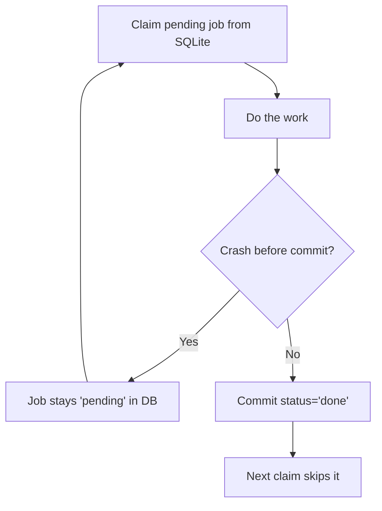
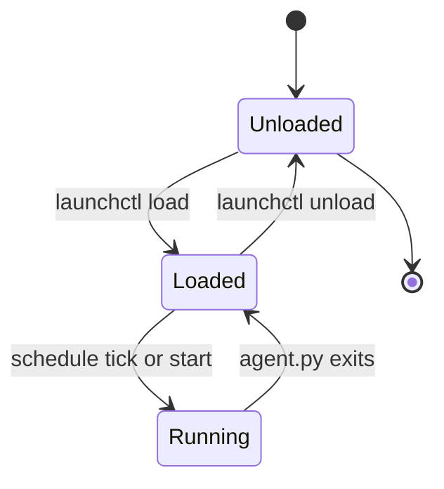

# Lab 1 — Scheduling with launchd & cron; Durable State and Idempotency in SQLite

**Time: ~3.5 hrs · Difficulty: Core · Builds on: Month 6 (agent loop, cost math) and Month 5 (structured Python)**

## Objective

Make an agent run on a clock without you, and make it survive a crash without redoing or duplicating work. You will schedule a small agent with macOS `launchd` (the canonical local scheduler) and write the equivalent `cron` line, then give it a **SQLite-backed job queue** with **idempotency keys** so that a re-run after a crash never double-processes a unit of work. By the end you can kill the agent mid-task and watch it resume cleanly on its next scheduled wake. This is the durable, scheduled foundation every later lab deploys on top of.

## Setup

```zsh
mkdir -p ~/agentic/month-11 && cd ~/agentic/month-11
uv init --python 3.12 . 2>/dev/null; uv add --quiet anthropic 2>/dev/null || true
mkdir -p logs inputs
# Free model layer (used as the agent's "work"):
brew install ollama 2>/dev/null; ollama pull qwen2.5:3b
```

You will reuse the agent loop from Month 6. For this lab the "work" can be trivial (summarize one input file) — the point is the *scheduling* and *durability*, not the model. Everything runs on Ollama for **$0**.

## Background

**Recall first (from memory):** In Month 6, when your agent crashed mid-run, what happened to its progress — and where, if anywhere, was that progress stored? Hold that answer; this lab is the fix for it.

An unattended agent is defined by what happens when it is interrupted — and it *will* be interrupted (crash, reboot, launchd restart, network blip). Two properties make interruption a non-event: **idempotency** (running twice = running once) and **durable state** (progress committed to disk, not held in memory). SQLite is the free default store: one file, ACID transactions, ships with macOS and Python. See README §3–§4 for the concepts; this lab makes them concrete.

The crash-and-resume flow you will build and then prove:


*Notice: state lives in the database, not in memory — a crash before the commit just leaves the job 'pending', so the next run re-claims it and the work happens exactly once.*

## Steps

### 1. Model the work as a durable SQLite queue

The genuinely new skill here is **idempotent durable state** — a queue where enqueuing the same work twice is a no-op and progress survives a crash. We build it in three stages: study a complete worked example, fill in a faded one, then extend it independently.

#### Stage 1 — Worked example (I do)

Create `store.py` exactly as below and run it. The database is the single source of truth — the agent holds *no* progress in memory. Read every annotated line; you are not inventing anything yet, just running and understanding.

```python
# store.py — durable job queue with idempotency keys
import sqlite3, hashlib

def connect(path="agent.db"):
    db = sqlite3.connect(path)
    db.execute("""CREATE TABLE IF NOT EXISTS jobs(
        key TEXT PRIMARY KEY,                -- idempotency key: dedup happens here
        payload TEXT NOT NULL,
        status TEXT NOT NULL DEFAULT 'pending',
        attempts INTEGER NOT NULL DEFAULT 0,
        result TEXT,
        updated REAL DEFAULT (strftime('%s','now')))""")
    db.commit()
    return db

def enqueue(db, payload: str) -> str:
    key = hashlib.sha256(payload.encode()).hexdigest()[:16]   # stable key from content
    # INSERT OR IGNORE: enqueuing the same work twice is a harmless no-op (dedup)
    db.execute("INSERT OR IGNORE INTO jobs(key,payload) VALUES(?,?)", (key, payload))
    db.commit()
    return key

def claim_pending(db):
    return db.execute(
        "SELECT key,payload FROM jobs WHERE status='pending' ORDER BY updated LIMIT 1"
    ).fetchone()

def mark_done(db, key: str, result: str):
    db.execute("UPDATE jobs SET status='done', result=?, updated=strftime('%s','now') "
               "WHERE key=?", (result, key))
    db.commit()
```

**Checkpoint:** `uv run python -c "import store; db=store.connect(); print(store.enqueue(db,'hello')); print(store.enqueue(db,'hello'))"` prints the **same key twice** — the second enqueue is a silent no-op. Run `sqlite3 agent.db "SELECT count(*) FROM jobs"` and confirm there is exactly **one** row, not two. That is deduplication.
**If not:** two different keys usually means you re-derived the key from something non-stable (a timestamp or `id()`), not the payload content — the key must be `sha256(payload)`. Two rows means you wrote `INSERT` instead of `INSERT OR IGNORE`. Delete `agent.db` and re-run after fixing.

#### Stage 2 — Faded practice (we do)

Add one function to `store.py` yourself: `mark_failed(db, key)`, which increments `attempts` and leaves `status='pending'` so the job will be retried (you will use this in Lab 3). The skeleton and expected behavior:

```python
def mark_failed(db, key: str):
    # TODO: increment the attempts counter for this key by 1
    # TODO: keep status = 'pending' so claim_pending picks it up again
    # TODO: update the 'updated' timestamp, then commit
    ...
```

**Checkpoint:** enqueue one job, call `mark_failed` on its key twice, then `sqlite3 agent.db "SELECT attempts,status FROM jobs"` shows `attempts=2` and `status='pending'`.
**If not:** if `attempts` stayed `0`, you forgot the `db.commit()` or wrote `=1` instead of `= attempts + 1` (use `SET attempts = attempts + 1` so SQLite does the increment). If the row vanished, you used `DELETE` — only update, never delete, in this function.

#### Stage 3 — Independent (you do)

With no skeleton, add a `counts(db)` function that returns a dict of `{status: count}` across the `jobs` table (e.g., `{"pending": 3, "done": 1}`). You will reuse this as the seed of Lab 2's status dashboard. Definition of done: `uv run python -c "import store; print(store.counts(store.connect()))"` prints a dict whose totals match `SELECT count(*) FROM jobs`.

### 2. Write the agent that drains the queue idempotently

Create `agent.py`. It claims one pending job, does the work (a tiny Ollama call), and commits `done` — and it logs each step so the absent operator can follow along.

```python
# agent.py — claims and processes one job; safe to run repeatedly
import json, sys, time, subprocess
import store

def do_work(payload: str) -> str:
    # The "agent" — swap in your Month 6 loop. Here: a one-shot local summary.
    out = subprocess.run(
        ["ollama", "run", "qwen2.5:3b", f"Summarize in one line: {payload}"],
        capture_output=True, text=True, timeout=120)
    return out.stdout.strip()

def main():
    db = store.connect()
    job = store.claim_pending(db)
    if not job:
        log(event="idle", msg="no pending jobs"); return
    key, payload = job
    log(event="claim", key=key)
    result = do_work(payload)             # if we crash here, status is still 'pending'
    store.mark_done(db, key, result)      # committed atomically -> durable
    log(event="done", key=key, result=result[:80])

def log(**ev):
    ev["ts"] = time.time()
    print(json.dumps(ev), flush=True)     # JSONL to stdout -> launchd captures it

if __name__ == "__main__":
    main()
```

Seed a few jobs and run it once:

```zsh
uv run python -c "import store; db=store.connect(); [store.enqueue(db,x) for x in ['the cat sat','the dog ran','rain fell']]"
uv run python agent.py
```

**Checkpoint:** The first run prints a `claim` then a `done` JSON line for one job. Run `uv run python agent.py` two more times and confirm it processes the other two jobs, then prints `{"event": "idle", ...}` — every job is processed exactly once, no duplicates.
**If not:** if the same job is processed twice, `mark_done` is not committing (check the `db.commit()` inside it) so `claim_pending` keeps returning it. If you get an Ollama error rather than a `done` line, see the "Ollama call hangs or errors" item in Troubleshooting.

### 3. Prove durability: crash mid-task and resume

Add a crash you can trigger, to prove progress survives. Temporarily edit `do_work` to `raise SystemExit("simulated crash")` *after* the model call but *before* `mark_done`, then run the agent.

```zsh
uv run python agent.py   # crashes "mid-task"
sqlite3 agent.db "SELECT key,status FROM jobs WHERE status='pending' LIMIT 1"
```

**Checkpoint:** The job the agent was working on is **still `pending`** in SQLite — the crash did not lose it and did not mark it done. Remove the simulated crash; run the agent again and confirm it re-claims that same job and completes it. The work happened exactly once *despite* the crash, because state lived in the database, not in memory.
**If not:** if the job shows `done` after the "crash," you put the `raise` *after* `mark_done` — move it to *before* the commit so the failure happens mid-task. If no job is `pending`, you may have already drained the queue; re-seed jobs from Step 2 first.

### 4. Schedule it with launchd

The launchd scheduling lifecycle you are about to drive:


*Notice: `load` registers the agent and `unload` deregisters it; between ticks it sits in Loaded, not Running — that "dead between ticks" state is exactly what makes a scheduled agent safer than a continuous loop.*

Create `~/Library/LaunchAgents/com.you.month11.plist`. Use **absolute paths** — launchd has a minimal environment and no `PATH`. Find your paths first: `which uv` and `pwd`.

```xml
<?xml version="1.0" encoding="UTF-8"?>
<!DOCTYPE plist PUBLIC "-//Apple//DTD PLIST 1.0//EN"
  "http://www.apple.com/DTDs/PropertyList-1.0.dtd">
<plist version="1.0">
<dict>
  <key>Label</key>            <string>com.you.month11</string>
  <key>ProgramArguments</key>
  <array>
    <string>/opt/homebrew/bin/uv</string>          <!-- output of `which uv` -->
    <string>run</string>
    <string>agent.py</string>
  </array>
  <key>WorkingDirectory</key> <string>/Users/you/agentic/month-11</string>
  <key>StartInterval</key>    <integer>300</integer> <!-- every 5 min, for testing -->
  <key>StandardOutPath</key>  <string>/Users/you/agentic/month-11/logs/out.log</string>
  <key>StandardErrorPath</key><string>/Users/you/agentic/month-11/logs/err.log</string>
</dict>
</plist>
```

Load and verify:

```zsh
launchctl load ~/Library/LaunchAgents/com.you.month11.plist
launchctl list | grep com.you.month11      # confirm it is registered
launchctl start com.you.month11            # force a run now instead of waiting
sleep 3; cat logs/out.log                  # see the JSONL the run emitted
```

**Checkpoint:** `launchctl list | grep com.you.month11` shows your label, and `logs/out.log` contains the `claim`/`done` (or `idle`) JSON lines from the scheduled run. The agent now runs every 5 minutes without you. For a real digest you would switch `StartInterval` to a `StartCalendarInterval` dict (`Hour`/`Minute`) — see README §3.
**If not:** empty logs almost always mean a path problem (launchd has no `PATH`) or a missing `logs/` directory — check `logs/err.log`, confirm `which uv` matches the `plist`, and that `mkdir -p logs` ran. See the "launchd didn't run my agent" item in Troubleshooting.

### 5. Write the cron equivalent (portability for Lab 3's cloud host)

launchd is macOS-only; the Linux cloud host in Lab 3 uses `cron`. Capture the equivalent now so you are not relearning scheduling later. The crontab line for "every 5 minutes" is:

```cron
*/5 * * * * cd /home/you/agentic/month-11 && /home/you/.local/bin/uv run agent.py >> logs/out.log 2>&1
```

Add it to a `CRON.md` note in your project. (On macOS you can also test it with `crontab -e`, but launchd is the canonical local choice.)

**Checkpoint:** You can explain the five cron fields (minute, hour, day-of-month, month, day-of-week) and why the launchd `StartCalendarInterval` with `Hour`/`Minute` is the macOS equivalent of a daily cron line. You have both written down.
**If not:** if the five fields blur together, write out `0 6 * * *` and read it left-to-right: "minute 0, hour 6, every day-of-month, every month, every day-of-week" = 6:00 a.m. daily. That single example anchors the rest.

### 6. Stop it cleanly

```zsh
launchctl unload ~/Library/LaunchAgents/com.you.month11.plist
launchctl list | grep com.you.month11      # now returns nothing
```

**Checkpoint:** The label no longer appears in `launchctl list` — the scheduled agent is fully stopped and deregistered. (This `unload` is also your out-of-band kill switch, which Lab 2 builds on.)
**If not:** "Could not find specified service" means it was already unloaded — harmless. If the label still shows, you unloaded a different path than you loaded; pass the exact same `plist` path to `unload` that you passed to `load`.

## Definition of Done

- `store.py` implements a SQLite job queue where `enqueue` deduplicates on an idempotency key (`INSERT OR IGNORE`), verifiable by double-enqueueing and seeing one row.
- `agent.py` claims one pending job, does the work, and commits `done` — and processing the queue twice never duplicates work.
- You have **demonstrated durability**: a simulated crash mid-task leaves the job `pending`, and a re-run completes it exactly once.
- A `launchd` `plist` runs `uv run agent.py` on a schedule, is loaded, appears in `launchctl list`, and writes JSONL to `logs/out.log`; you can `load`/`start`/`unload` it.
- A `CRON.md` records the equivalent crontab line for Lab 3's Linux host.
- **Self-verify:** `sqlite3 agent.db "SELECT status,count(*) FROM jobs GROUP BY status"` shows all seeded jobs as `done`, and `launchctl list | grep com.you.month11` (while loaded) returns your label.

**Self-explain:** in one sentence, why does a crash mid-task *not* cause this agent to lose or double-process work?

## Stretch Goals

1. **Calendar schedule.** Switch the `plist` to `StartCalendarInterval` to run at a real time (e.g., 06:00 daily) and confirm with the next-day run in `logs/out.log`.
2. **caffeinate wrapper.** Wrap the program in `caffeinate -i` (via a tiny shell launcher the `plist` calls) so a sleeping Mac still runs the agent; confirm it fires while the screen is off.
3. **KeepAlive continuous mode.** Make a second `plist` with `<key>KeepAlive</key><true/>` pointing at a `while True` version of the agent, and confirm launchd restarts it when you `kill` the process. (Foreshadows §2's scheduled-vs-continuous choice.)
4. **Queue introspection.** Add a `--status` flag to `agent.py` that prints counts by status as JSON — the start of the dashboard you build in Lab 2.

## Troubleshooting

- **"launchd didn't run my agent."** Almost always a path problem: launchd has no `PATH`, so every binary and file must be an absolute path. Set `WorkingDirectory`, use the full output of `which uv`, and check `logs/err.log` for the real error.
- **`launchctl load` says "service already loaded."** You loaded it before. `launchctl unload` first, then `load` again. Editing a `plist` requires an unload/load cycle to take effect.
- **Nothing in the logs.** Confirm `StandardOutPath`/`StandardErrorPath` point to a directory that *exists* (`mkdir -p logs`) and is writable; launchd will not create missing parent directories.
- **`database is locked`.** Two processes wrote SQLite at once. For this lab keep to one writer; if you hit it under launchd's overlapping runs, set a longer `StartInterval` or add `db.execute("PRAGMA busy_timeout=5000")` after connecting.
- **Ollama call hangs or errors.** Confirm `ollama serve` is running (the `ollama` app or `brew services start ollama`) and the model is pulled (`ollama list`). The `timeout=120` in `do_work` prevents a hung call from blocking forever.
- **The agent didn't run while the Mac slept.** Expected — a sleeping Mac runs nothing. Use `caffeinate` (Stretch 2) or, for true 24/7, the cloud substrate in Lab 3.
