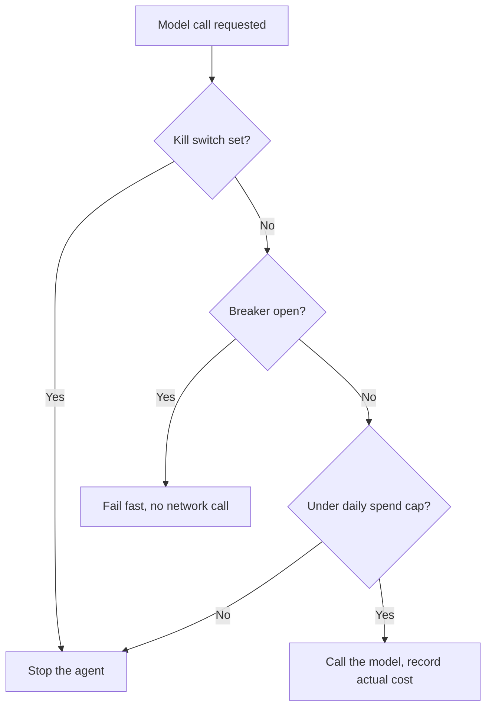

# Lab 2 — Safety Rails: Hard Spend Cap, Circuit Breaker, Tested Kill Switch, Alerting

**Time: ~4 hrs · Difficulty: Core · Builds on: Lab 1 (durable SQLite queue, scheduled agent) and Month 6 (cost math)**

## Objective

Build — and *test* — every safety the absent supervisor needs, because once the agent runs unattended you are no longer the kill switch or the budget cap. You will wrap the Lab 1 agent in a `SafetySupervisor` that enforces a **hard daily spend cap** (checked *before* every model call, durable in SQLite), a **circuit breaker** (trips open after repeated failures and stops calling), a **kill switch that you trip on purpose** (in-band flag plus out-of-band stop), **structured JSONL logs**, and a **working alert** that pings you when something breaks. This lab comes *before* deployment on purpose: you do not put an agent on a 24/7 host until its budget cap and kill switch are tested.

## Setup

```zsh
cd ~/agentic/month-11
uv add --quiet httpie 2>/dev/null || brew install httpie
# Pick a free alert channel and put its webhook in .env (any one):
#   Discord webhook, Slack incoming webhook, or ntfy.sh topic URL.
echo 'ALERT_WEBHOOK=https://ntfy.sh/your-unique-topic-name' >> .env
echo 'DAILY_CAP_USD=1.00' >> .env
```

`ntfy.sh` is the zero-signup option: pick a hard-to-guess topic, install the ntfy app, and subscribe to it. Discord/Slack incoming webhooks work identically. The whole lab runs on Ollama for **$0**; the spend cap is exercised with simulated costs so you can prove it fires without spending a cent.

## Background

**Recall first (from memory):** In Lab 1 you built `launchctl unload` to deregister the agent. Which kind of stop is that — in-band or out-of-band — and why does an unattended agent need the *other* kind too? Hold that answer; this lab builds the missing half.

A spend cap stops *expensive* runaways; a circuit breaker stops *broken* ones; a kill switch stops *everything*. Each is useless if it is checked too late or never tested. README §5–§7 cover the concepts: the cap is a **gate that refuses to spend**, not a log you read afterward; the breaker has closed/open/half-open states; the kill switch needs an in-band *and* an out-of-band path because the in-band one fails exactly when you need it. The recurring discipline of this lab is **test the safety, do not just write it.**

The guard sequence every model call passes through once you wrap it in the `SafetySupervisor` (Step 5):


*Notice: three gates in order — kill switch, breaker, cap — and the model is only called after all three pass. Order matters: stop first, fail fast second, spend last.*

## Steps

### 1. Add a durable cost ledger and a hard daily cap

The genuinely new technique this lab introduces is the **pre-call spend gate**: a check that *refuses to spend* before money leaves, durable across restarts. Build it in three stages.

#### Stage 1 — Worked example (I do)

Create `safety.py` exactly as below and run it. The cap is keyed by day and lives in SQLite, so a restart cannot reset today's budget and hand a runaway a fresh ceiling. Study each line — the key idea is that `guard_spend` runs *before* the call and *raises* rather than logs.

```python
# safety.py — budget cap (checked BEFORE the call), durable in SQLite
import os, sqlite3

class BudgetExceeded(Exception): ...

def init_spend(db):
    db.execute("""CREATE TABLE IF NOT EXISTS spend(
        ts REAL DEFAULT (strftime('%s','now')),
        day TEXT DEFAULT (date('now')), cost REAL)""")
    db.commit()

def spent_today(db) -> float:
    return db.execute(
        "SELECT COALESCE(SUM(cost),0) FROM spend WHERE day=date('now')").fetchone()[0]

def guard_spend(db, est_cost: float):
    cap = float(os.environ.get("DAILY_CAP_USD", "1.00"))
    if spent_today(db) + est_cost > cap:                 # check BEFORE calling
        raise BudgetExceeded(f"would exceed ${cap:.2f}/day cap "
                             f"(spent ${spent_today(db):.4f})")

def record_spend(db, actual_cost: float):
    db.execute("INSERT INTO spend(cost) VALUES(?)", (actual_cost,)); db.commit()
```

**Checkpoint:** Set `DAILY_CAP_USD=0.01`, then in a REPL call `guard_spend(db, 0.02)` and confirm it **raises `BudgetExceeded`** — the call is refused *before* any spend. Insert a few cents of simulated spend and confirm `spent_today(db)` is durable across a fresh `connect()`.
**If not:** if no exception is raised, you did not `init_spend(db)` first (the table is missing, so `spent_today` errors or returns 0) or `DAILY_CAP_USD` is still `1.00` from `.env` overriding your REPL value — set it explicitly with `os.environ["DAILY_CAP_USD"]="0.01"` in the REPL.

#### Stage 2 — Faded practice (we do)

Now wire the gate around real work. Estimate cost from input tokens × max output (Month 6 math), call `guard_spend` *before* the model call, and `record_spend` *after*. Fill in the TODOs:

```python
def guarded_call(db, fn, est_cost: float, actual_cost: float):
    # TODO: refuse the call before spending if it would exceed today's cap
    out = fn()
    # TODO: record what this call actually cost (on Ollama, actual_cost is 0.0)
    return out
```

**Checkpoint:** with the cap at `0.01`, `guarded_call(db, lambda: "ok", est_cost=0.02, actual_cost=0.0)` raises *before* `fn` runs (the lambda never executes); with `est_cost=0.0` it returns `"ok"` and adds a `0.0` row to `spend`.
**If not:** if `fn` runs even when over cap, you called `guard_spend` *after* `fn()` — the gate must be the first line. If nothing lands in `spend`, the `record_spend` call is missing or you skipped its `db.commit()`.

#### Stage 3 — Independent (you do)

With no skeleton, add a **per-hour sub-cap** (`HOURLY_CAP_USD`) alongside the daily cap so a fast burn trips earlier than the daily ceiling. Definition of done: with a low hourly cap, a burst of simulated spend within the hour is refused even though the *daily* total is still under its cap. (This is also Stretch Goal 2 — do it here.)

### 2. Add a circuit breaker

Add a breaker (README §6) that trips open after N consecutive failures and fails fast during a cool-down, so a downstream outage cannot turn into a budget-burning retry storm.

```python
# safety.py (continued)
import time
class CircuitOpen(Exception): ...

class CircuitBreaker:
    def __init__(self, threshold=5, cooldown=300):
        self.threshold, self.cooldown = threshold, cooldown
        self.failures, self.opened_at = 0, None
    def before_call(self):
        if self.opened_at and time.time() - self.opened_at < self.cooldown:
            raise CircuitOpen("breaker open; cooling down")   # fail fast, no network call
        if self.opened_at:                                    # cooldown elapsed -> half-open
            self.opened_at = None
    def on_success(self): self.failures, self.opened_at = 0, None
    def on_failure(self):
        self.failures += 1
        if self.failures >= self.threshold:
            self.opened_at = time.time()                      # trip open
```

**Checkpoint:** In a REPL, call `on_failure()` five times, then call `before_call()` and confirm it raises `CircuitOpen` — the breaker is open and refuses to call. One `on_success()` (after the cooldown) closes it again.
**If not:** if it never opens, `on_failure` is not incrementing `self.failures` past the threshold, or you reset `failures` somewhere other than `on_success`. If `before_call` never raises, the `cooldown` window already elapsed — temporarily set `cooldown=300` so the open state persists while you test.

### 3. Build the kill switch — in-band and out-of-band

Add an in-band stop the loop checks every iteration. The out-of-band stop is `launchctl unload` (or `kill`) from Lab 1 — you already have it.

```python
# safety.py (continued)
from pathlib import Path
def should_stop(db) -> bool:
    if Path("STOP").exists():                                # sentinel file (in-band)
        return True
    row = db.execute("SELECT 1 FROM jobs WHERE key='__STOP__'").fetchone()  # or a flag row
    return bool(row)
```

**Checkpoint (this is required for the milestone, so do it now):** Run a `while True` version of the agent in one terminal, then in another run `touch STOP`. Confirm the loop **exits within one iteration**. Then start it again and run `launchctl unload ~/Library/LaunchAgents/com.you.month11.plist` (or `pkill -f agent.py`) and confirm the process is gone from `launchctl list` / `ps`. You have now tested **both** stop paths on purpose.
**If not:** if the loop keeps running after `touch STOP`, your loop body is long and only checks `should_stop` once per iteration — add the check before each expensive sub-step, and use the out-of-band stop for a wedged loop. If `STOP` is in a different directory than the loop's working directory, the `Path("STOP").exists()` check never sees it — create it in the agent's CWD.

### 4. Add an alert that reaches you

Add a one-line alert helper. It must work from an *unattended* process — a webhook is ideal because it needs no interactive session.

```python
# alert.py — fire-and-forget notification to a webhook
import os, json, urllib.request
def alert(title: str, msg: str):
    url = os.environ.get("ALERT_WEBHOOK")
    if not url: return
    data = msg.encode()                          # ntfy: body is the message, title via header
    req = urllib.request.Request(url, data=data, headers={"Title": title})
    try:
        urllib.request.urlopen(req, timeout=10)
    except Exception as e:
        print(json.dumps({"event": "alert_failed", "error": str(e)}), flush=True)
```

Trigger an alert on each safety event: the cap being hit, the breaker tripping, and a job dead-lettering (Lab 3). Test it:

```zsh
uv run python -c "import alert; alert.alert('Month 11 test','safety rails online')"
```

**Checkpoint:** The test notification arrives on your phone/desktop (ntfy app, Discord channel, or Slack). You now have a channel that reaches you while you are away from the keyboard.
**If not:** test the URL with `curl -d "hi" $ALERT_WEBHOOK` first to isolate code from config. For ntfy, confirm you subscribed to the *exact* topic string; for Discord/Slack confirm it is the *incoming webhook* URL, not a channel link. Remember `alert()` swallows network errors by design — look for the `alert_failed` log line.

### 5. Compose the SafetySupervisor and structured logs

Wrap everything into one supervisor the agent calls, and emit **structured JSONL** so the absent operator can `grep` the logs.

```python
# supervisor.py — the absent operator, in code
import json, time
from safety import guard_spend, record_spend, CircuitBreaker, BudgetExceeded, CircuitOpen, should_stop
from alert import alert

def log(**ev):
    ev["ts"] = time.time(); print(json.dumps(ev), flush=True)

class SafetySupervisor:
    def __init__(self, db): self.db, self.breaker = db, CircuitBreaker()
    def call_model(self, fn, est_cost: float):
        if should_stop(self.db): raise SystemExit("kill switch")
        self.breaker.before_call()
        try:
            guard_spend(self.db, est_cost)             # may raise BudgetExceeded
            out = fn()
            self.breaker.on_success(); record_spend(self.db, 0.0)  # Ollama=0; else actual
            return out
        except (BudgetExceeded,):
            log(event="cap_hit"); alert("AFK agent stopped", "daily spend cap reached"); raise
        except Exception as e:
            self.breaker.on_failure(); log(event="call_failed", error=str(e)[:200])
            if self.breaker.opened_at: alert("AFK agent breaker open", str(e)[:200])
            raise
```

**Checkpoint:** Run the agent through the supervisor end-to-end on Ollama: normal jobs succeed and log `done`; force five failures and confirm the breaker opens, logs `call_failed`, and fires the breaker alert; set the cap to `$0.00` and confirm a `cap_hit` log + alert and the agent stops. All three safeties are observable in `logs/out.log` as JSONL.
**If not:** if the breaker never fires its alert, the `if self.breaker.opened_at:` check fires only on the call that *trips* it — confirm you forced the full `threshold` of failures. If `cap_hit` never logs at `$0.00`, `guard_spend` is being called after `fn()` or the supervisor caught `BudgetExceeded` in the generic `except` instead of its own clause.

### 6. Add log rotation so unattended logs don't fill the disk

A 7-day unattended run produces a lot of log. Add minimal rotation: have the agent write to a dated file (`logs/out-$(date +%F).log`) via the `plist`, or add a tiny launchd job / cron line that truncates logs older than 7 days.

**Checkpoint:** After a run, `ls logs/` shows dated log files and you can name the rotation mechanism. (Full `newsyslog`/`logrotate` config is a stretch goal.)
**If not:** if everything still writes to one `out.log`, your `plist` `StandardOutPath` is a fixed name — either embed the date in the path via a wrapper script the `plist` calls, or add a small daily truncation job. Rotation is not optional before the 7-day run in Lab 4.

## Definition of Done

- A **hard daily spend cap** in `safety.py` refuses a call *before* spending when today's total + estimate would exceed `DAILY_CAP_USD`, and the ledger is durable across restarts.
- A **circuit breaker** trips open after N consecutive failures, fails fast during cooldown, and recovers via half-open.
- A **kill switch** works two ways and you have **tested both on purpose**: the `STOP` sentinel exits the loop within one iteration, and `launchctl unload` / `kill` stops the process out-of-band.
- An **alert** reaches you off-machine (webhook) and fires on cap-hit and breaker-open.
- The agent runs through a `SafetySupervisor` that emits **structured JSONL** logs; rotation is in place.
- **Self-verify:** with `DAILY_CAP_USD=0.00`, one agent run logs `{"event":"cap_hit"}`, sends an alert, and does not call the model; with five forced failures, the log shows the breaker opening; `touch STOP` ends a running loop within one iteration.

**Self-explain:** in one sentence, why must the spend cap be a gate checked *before* the model call rather than a total you read from the logs afterward?

## Stretch Goals

1. **Heartbeat / dead-man's switch.** Have the agent write a `last_run` timestamp to SQLite each cycle and a separate launchd job that alerts if the heartbeat is older than expected — so you are pinged when the agent *silently stops*, not just when it errors.
2. **Per-job and per-hour sub-caps.** Add a per-hour spend ceiling in addition to the daily cap, to catch a fast burn earlier.
3. **Status dashboard.** Extend Lab 1's `--status` into a tiny one-file HTML or terminal dashboard showing today's spend vs. cap, breaker state, queue depth, and DLQ size.
4. **Real `newsyslog` rotation.** Configure macOS `newsyslog.d` to rotate the agent's logs properly, with size and age limits.

## Troubleshooting

- **Cap "doesn't fire."** You are checking after the call, or estimating cost as 0 on a paid model. `guard_spend` must run *before* `fn()`, with a conservative `est_cost`. Verify by setting the cap to `0.00`.
- **Cap resets on restart.** Your spend total is in memory, not SQLite. It must be `SUM(cost) WHERE day=date('now')` from the durable table so a restart sees today's prior spend.
- **Breaker never opens.** You are resetting `failures` on every call, or catching the exception before `on_failure`. Only `on_success` resets; every failure must increment.
- **Alert never arrives.** Test the webhook with `httpie`/`curl` directly first. For ntfy, confirm you subscribed to the exact topic; for Discord/Slack, confirm the webhook URL is the *incoming* webhook, not a channel link. Network failures in `alert()` are swallowed by design — check the `alert_failed` log line.
- **`STOP` file ignored.** The loop only checks `should_stop` at the top of each iteration — a long single iteration won't stop until it finishes. Add the check before each expensive sub-step too, and rely on the out-of-band stop for a wedged loop.
- **Logs grow unbounded.** You skipped rotation. A 7-day run *will* fill a small disk; add dated files or a truncation job before Lab 4.
