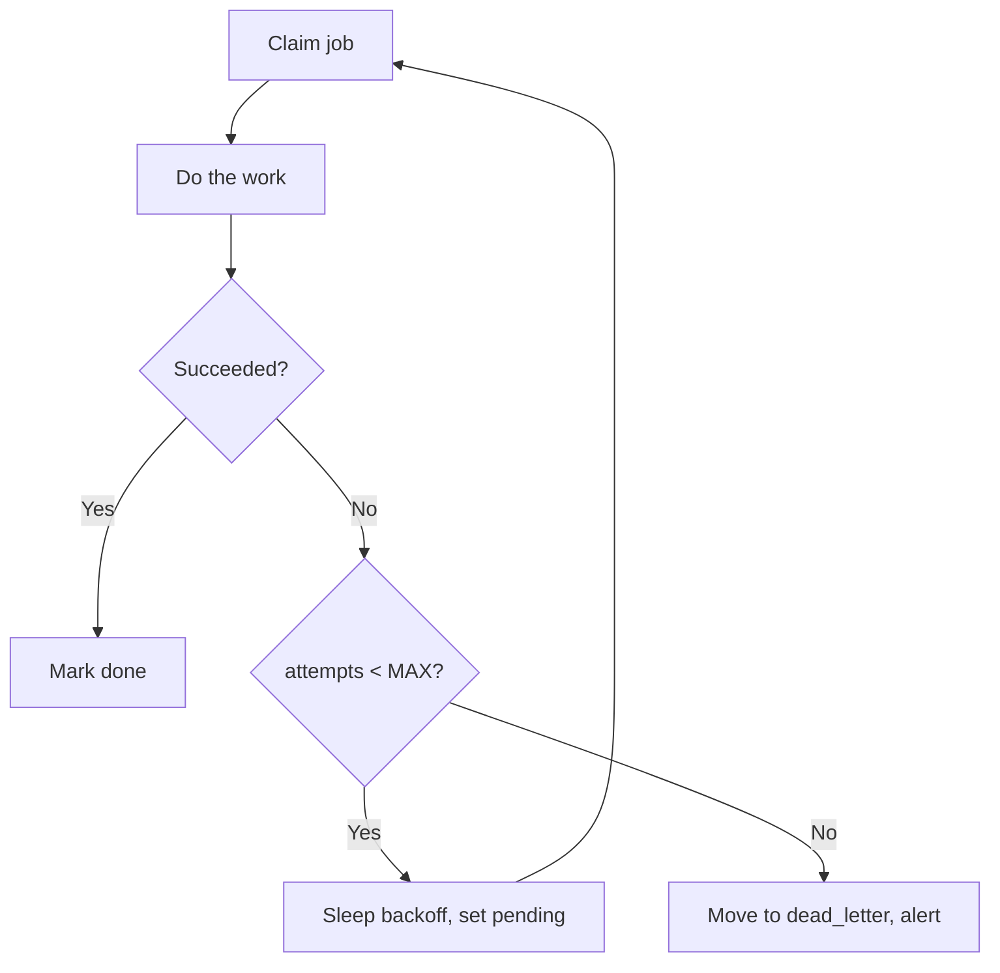

# Lab 3 — Deploy to a Free 24/7 Cloud Substrate; Failure Semantics and a DLQ

**Time: ~4 hrs · Difficulty: Core / Stretch · Builds on: Labs 1–2 (durable queue, safety rails)**

## Objective

Move the agent off your Mac and onto a host that runs when your laptop is closed — a real always-on substrate — and design what happens when work keeps failing. You will deploy your supervised agent to a **free 24/7 cloud substrate** (Oracle Cloud Free Tier *or* Fly.io free allowance), schedule it there with `cron` (or run it as a supervised loop), then add **retries with exponential backoff and jitter** and a **SQLite dead-letter queue** so permanently-bad jobs stop looping and surface to you. You will also decide, and document, whether this workload should be scheduled or continuous.

## Setup

Pick **one** substrate. Both are free; choose based on the agent's shape (README §2, §8).

- **Oracle Cloud Free Tier** — best for a scheduled agent on a real Linux VM you `ssh` into. Create a free account, launch an **Always Free** Arm (Ampere) VM with Ubuntu, and open SSH. This is a genuine server that runs indefinitely at no cost.
- **Fly.io free allowance** — best for a containerized `while True` loop or an agent with an HTTP endpoint. `brew install flyctl`, `fly auth signup`, then deploy a small machine within the free allowance.

```zsh
# Local prep (either path):
cd ~/agentic/month-11
git init -q && git add -A && git commit -qm "deployable agent" 2>/dev/null || true
```

Run the deployed agent on **Ollama on the host** (truly $0, but small cloud VMs are CPU-only and slow — fine for a 3B model on a light schedule) **or** on a free hosted endpoint (Groq/Gemini free tier) for speed. If you point it at a paid API, your Lab-2 daily cap is what makes that safe.

## Background

**Recall first (from memory):** In Lab 1 you gave every job a stable idempotency key in SQLite. Why is that key the thing that makes *at-least-once* retries safe — what would go wrong on a retry if you did not have it? Hold that answer; this lab depends on it.

Local launchd only runs when your Mac is awake — close the laptop and the agent stops, so it is not "always on" in any real sense. A free cloud VM or a Fly machine runs 24/7 independent of your laptop. The second half of the lab is **failure semantics** (README §9–§10): you cannot get true exactly-once delivery, so you build **at-least-once delivery plus idempotent processing** (you already have the idempotency keys from Lab 1), add **bounded retries with backoff**, and send jobs that exhaust their retries to a **dead-letter queue** for human inspection instead of looping forever.

The retry-to-dead-letter flow you are about to build:


*Notice: a failing job loops only a bounded number of times — after MAX_ATTEMPTS it leaves the live queue for the dead-letter table, so one bad job can never spin forever or starve the good ones.*

## Steps

### 1. Add bounded retries with exponential backoff and a DLQ

The new technique here is **bounded retry with a dead-letter escape hatch**: failing work retries a fixed number of times with growing delays, then leaves the live queue. Build it in three stages.

#### Stage 1 — Worked example (I do)

Extend `store.py` with a dead-letter table and a `process` function exactly as below (README §9–§10). Run it and read every line — note how `process` either marks `done`, bumps `attempts` and re-queues, or dead-letters once `attempts >= MAX_ATTEMPTS`.

```python
# store.py (additions)
import random, time
MAX_ATTEMPTS = 4

def init_dlq(db):
    db.execute("""CREATE TABLE IF NOT EXISTS dead_letter(
        key TEXT PRIMARY KEY, payload TEXT, error TEXT,
        died REAL DEFAULT (strftime('%s','now')))""")
    db.commit()

def backoff(attempt: int, base=1.0, cap=60.0) -> float:
    return min(cap, base * 2 ** attempt) * (0.5 + random.random())  # exp + jitter

def process(db, key, payload, do_work):
    try:
        result = do_work(payload)
        db.execute("UPDATE jobs SET status='done', result=? WHERE key=?", (result, key))
    except Exception as e:
        attempts = db.execute("SELECT attempts FROM jobs WHERE key=?", (key,)).fetchone()[0] + 1
        if attempts >= MAX_ATTEMPTS:
            db.execute("INSERT OR REPLACE INTO dead_letter(key,payload,error) VALUES(?,?,?)",
                       (key, payload, str(e)[:500]))
            db.execute("DELETE FROM jobs WHERE key=?", (key,))      # out of the live queue
            return "dead_lettered"
        db.execute("UPDATE jobs SET attempts=?, status='pending' WHERE key=?", (attempts, key))
    db.commit()
```

**Checkpoint:** print `[round(backoff(a),1) for a in range(4)]` a few times and confirm the values grow (roughly 0.5–1, 1–2, 2–4, 4–8s) and *vary* run to run (the jitter). That growth-with-jitter is what keeps retries from hammering a recovering service in lockstep.
**If not:** if the values are identical every run, you dropped the `(0.5 + random.random())` jitter factor. If they grow without bound, your `min(cap, ...)` is missing or `cap` is too high.

#### Stage 2 — Faded practice (we do)

Wire `process` into a drain loop that *spaces out* retries. Fill in the TODOs:

```python
def drain(db, do_work):
    while (job := claim_pending(db)):
        key, payload = job
        outcome = process(db, key, payload, do_work)
        # TODO: if this job is still pending (it failed but has attempts left),
        #       sleep backoff(attempts) before the next claim so retries are spaced out
        # TODO: if outcome == "dead_lettered", fire a Lab-2 alert — a "production drifted" signal
```

**Checkpoint:** with one always-failing payload mixed into good ones, the loop's timestamps show *increasing* gaps before each retry of the bad job, and a `dead_letter` alert fires once.
**If not:** if retries fire instantly back-to-back, you are not reading the job's current `attempts` to pass into `backoff` — query it after `process`. If no alert fires, you only checked `outcome == "dead_lettered"` but `process` returns `None` on the re-queue path, which is correct — make sure the bad job actually reached `MAX_ATTEMPTS`.

#### Stage 3 — Independent (you do)

With no skeleton, write a `replay_dlq(db)` command that moves rows back from `dead_letter` into `jobs` with `attempts` reset to `0` and `status='pending'` — what you run *after* fixing the root cause of a dead-lettered job. Definition of done: a dead-lettered job, after `replay_dlq`, is claimable again and (with the bug fixed) completes. (This is Stretch Goal 3 — do it here.)

**Checkpoint:** Make `do_work` raise for one specific payload. Run the drain loop and confirm that payload is retried up to `MAX_ATTEMPTS` (visible as rising `attempts` in `jobs`) and then appears in `dead_letter` while the *other* jobs complete normally. The agent never loops forever on the bad job.
**If not:** if the bad job stays in `jobs` forever, `attempts` is not incrementing (you read it before adding 1) or `MAX_ATTEMPTS` is never reached. If good jobs also dead-letter, your `do_work` raise condition is too broad — gate it on the one specific payload.

### 2. Decide and document: scheduled or continuous?

Write a short `DEPLOY.md` section answering README §2 for *this* agent: does it need low latency or react to unpredictable arrivals (→ `while True`), or is a periodic batch fine (→ scheduled)? For most rung-2 agents (digests, triage, reports) the answer is **scheduled**, which is simpler and safer.

**Checkpoint:** `DEPLOY.md` states the choice and the reason in two or three sentences. If you chose `while True`, you can justify why a schedule was insufficient.
**If not:** if you cannot justify `while True`, the honest answer is almost always "a schedule is fine" — default to scheduled (README §2). Reach for continuous only when you can name a concrete latency or unpredictable-arrival requirement.

### 3a. Deploy to Oracle Always Free (scheduled via cron)

On the VM:

```zsh
# from your Mac:
ssh ubuntu@<vm-ip>
# on the VM:
curl -LsSf https://astral.sh/uv/install.sh | sh        # install uv
git clone <your-repo> agent && cd agent
uv sync
# optional $0 model on the host:
curl -fsSL https://ollama.com/install.sh | sh && ollama pull qwen2.5:3b
crontab -e
# add the line you saved in Lab 1's CRON.md, e.g. run every 15 min:
*/15 * * * * cd /home/ubuntu/agent && /home/ubuntu/.local/bin/uv run agent.py >> logs/out.log 2>&1
```

**Checkpoint:** `crontab -l` shows your line; after the next tick, `cat logs/out.log` on the VM shows the agent running. Close your laptop entirely, wait, and confirm new log lines appeared on the VM — it runs without your Mac.
**If not:** empty logs are nearly always `uv: command not found` (cron has a minimal `PATH`, like launchd) — use the absolute path `/home/ubuntu/.local/bin/uv`, exactly as you used the full path for launchd in Lab 1. Confirm the `cd` target and `logs/` directory both exist on the VM.

### 3b. Deploy to Fly.io (containerized, scheduled or loop)

Add a minimal `Dockerfile` and `fly.toml`:

```dockerfile
FROM python:3.12-slim
RUN pip install uv
WORKDIR /app
COPY . .
RUN uv sync --frozen || uv sync
CMD ["uv", "run", "agent.py", "--loop"]   # or use Fly's scheduled machines for cron-style
```

```zsh
fly launch --no-deploy            # generates fly.toml; pick the free-allowance size
fly secrets set ALERT_WEBHOOK=... DAILY_CAP_USD=1.00 ANTHROPIC_API_KEY=...  # if paid
fly deploy
fly logs                          # watch it run
fly scale count 0                 # <- out-of-band kill switch
```

Mount a volume for `agent.db` so SQLite state is durable across restarts (`fly volumes create data`; mount at the DB path in `fly.toml`).

**Checkpoint:** `fly logs` shows your JSONL events from the cloud; `fly scale count 0` stops the machine (your out-of-band kill switch) and `fly scale count 1` brings it back, resuming from the persisted SQLite state.
**If not:** if the machine exits immediately, `fly logs` shows the crash — usually a missing secret (`fly secrets list`) or an agent that runs-and-exits instead of looping. If state is lost after `count 0`/`count 1`, you did not mount a volume — see the "SQLite state lost on Fly redeploy" item in Troubleshooting.

### 4. Verify the safety rails survived the move

The Lab-2 safeties must work *on the host*, not just locally. Confirm the daily cap, breaker, kill switch, and alert all function in the deployed environment — the cap especially, since the cloud host is where an unattended runaway actually costs you.

**Checkpoint:** From the deployed agent, force a `cap_hit` (set the host's `DAILY_CAP_USD` low) and confirm the alert reaches your phone *from the cloud*. Trigger the out-of-band kill (`fly scale count 0` or stop the VM service) and confirm it stops.
**If not:** alert works locally but not from the cloud almost always means the `ALERT_WEBHOOK` secret is not set on the host (`fly secrets list`, or the VM's `.env`) or outbound HTTPS is blocked. Set the secret on the host, not just locally.

### 5. Confirm idempotency across the network

The whole point of at-least-once + idempotency: a retry or a restart mid-job must not double-process. Restart the host mid-run (`fly machine restart`, or reboot the VM) and confirm the in-flight job — still `pending` in the persisted DB — is re-claimed and completed exactly once.

**Checkpoint:** After a forced restart, the queue ends with every job `done` exactly once and no duplicate side effects. State survived the restart because it is in the mounted/persisted SQLite file.
**If not:** if jobs are lost or re-done from scratch after the restart, the SQLite file was on ephemeral storage — mount the volume at the DB path (Fly) or confirm the DB lives on the VM's persistent disk, not `/tmp`. The whole guarantee rests on the file surviving the restart.

## Definition of Done

- The agent is **deployed and running on a free 24/7 substrate** (Oracle Always Free or Fly.io) and continues running with your laptop closed.
- Failed jobs **retry with exponential backoff + jitter**, bounded by `MAX_ATTEMPTS`, and exhausted jobs land in a **`dead_letter` table** (with an alert), not an infinite loop.
- `DEPLOY.md` documents the **scheduled-vs-continuous** decision for this workload and how to start/stop it on the host.
- The Lab-2 **safety rails work on the host**: cap, breaker, tested kill switch (`fly scale count 0` or VM stop), and an alert that fires from the cloud.
- **Idempotency holds across a restart**: a forced host restart mid-run completes the in-flight job exactly once.
- **Self-verify:** `sqlite3 agent.db "SELECT count(*) FROM dead_letter"` shows your intentionally-bad job; remote logs show normal jobs completing; the agent's uptime is independent of your Mac.

**Self-explain:** in one sentence, why does at-least-once delivery *plus* idempotent processing give you effectively-exactly-once without ever achieving true exactly-once delivery?

## Stretch Goals

1. **systemd service (Oracle).** Instead of cron, write a `systemd` unit with `Restart=always` for a `while True` agent and compare it to launchd's `KeepAlive` — the same idea on Linux.
2. **Cloudflare Worker (serverless scheduled).** Port a *short* scheduled task to a Cloudflare Worker with a cron trigger and note the execution-time limits that make it unsuitable for a long `while True` loop (README §8).
3. **DLQ replay.** Add a `replay-dlq` command that re-enqueues dead-lettered jobs after you fix the root cause, with the attempt counter reset.
4. **Cost-of-reliability writeup.** Document where a $4–6/month VPS would remove a free-tier limitation you actually hit (quota, slow CPU, networking), to practice the "a few dollars buys reliability" judgment.

## Troubleshooting

- **Oracle "out of capacity" for Always Free Arm VMs.** A known annoyance; retry in another availability domain/region, or use the Always Free AMD micro instance instead. Fly.io is the fallback path if Oracle won't provision.
- **`uv: command not found` on the VM/container.** `uv` installs to `~/.local/bin`; use the absolute path in cron (just like launchd in Lab 1) or add it to `PATH` in the unit/Dockerfile.
- **Fly machine exits immediately.** Check `fly logs` — usually a missing secret or a crash on startup. The agent should *loop or schedule*, not run-and-exit, for a `KeepAlive`-style machine; for cron-style, use Fly scheduled machines.
- **SQLite state lost on Fly redeploy.** You didn't mount a volume. Create one (`fly volumes create data`) and mount it at the DB path; otherwise the filesystem is ephemeral and every deploy wipes the queue and ledger.
- **DLQ never receives the bad job.** `MAX_ATTEMPTS` not reached, or the exception is caught before `process`. Confirm `attempts` increments per failure and that `attempts >= MAX_ATTEMPTS` routes to `dead_letter`.
- **Retries hammer a down service.** You're retrying without sleeping `backoff(attempts)`. Space retries out, and let the Lab-2 circuit breaker stop calling entirely after repeated failures.
- **Alert works locally but not from cloud.** The host's outbound network or the `ALERT_WEBHOOK` secret. Confirm the secret is set on the host (`fly secrets list` / VM `.env`) and that outbound HTTPS is allowed.
