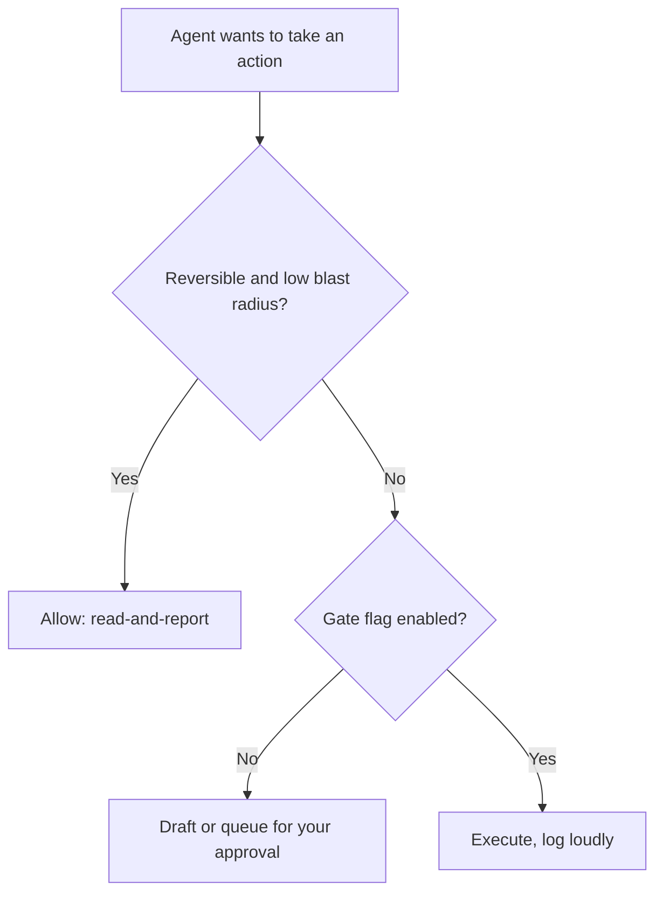

# Lab 4 — The First AFK Agent (Milestone): Deploy and Run Unattended for 7 Days

**Time: ~6 hrs of build + 7 days of unattended runtime · Difficulty: Core / Stretch · Builds on: Labs 1–3 and Months 7–10 (the payload agents)**

## Objective

Ship the month's milestone: take one agent from an earlier month, **narrow it to a single unattended-safe job**, deploy it to a real always-on schedule, and **leave it running for seven consecutive days without you.** It must have a **hard daily spend cap**, a **kill switch you have tested at least once**, **structured logs**, and an **alert when something breaks**. You will deliver the deployed agent, a `RUNBOOK.md`, and a **production-incident log** of what broke in production and how you fixed it. Done means there is an agent running right now, without you, that you trust not to bankrupt you or do something irreversible.

## Setup

```zsh
cd ~/agentic/month-11
mkdir -p milestone && cd milestone
```

Choose your **payload** — the earlier agent you will narrow and deploy. Good candidates:

- A **Month-9 harness role** narrowed to one job (e.g., the incident-triage worker, run nightly over a log directory, reporting findings — no writes).
- A **Month-10 factory output** run on a schedule (e.g., a daily summary/digest the factory produces).
- Any **earlier agent** reduced to one safe task: a 6 a.m. repo + inbox digest, an hourly RSS/issue triage that drafts (never sends) replies, a nightly "what changed" report.

The safe default for all of these is **read-and-report** (README §11): the agent observes and tells you; *you* take any irreversible step.

## Background

**Recall first (from memory):** From Month 8, what did you ask about any action before letting an agent take it — and which actions did you refuse to automate at all? Now ask the harder version: with *no human watching at 3 a.m.*, what must this agent never do on its own?

This lab is composition — Lab 1's durable scheduler, Lab 2's safety rails, Lab 3's cloud deployment and failure semantics — plus two things that are genuinely new and cannot be rushed: **narrowing a general agent to one unattended-safe job with its irreversible actions gated** (README §11), and the **seven-day unattended run** during which production *will* surprise you. The incident log is the real proof of ownership: an unattended agent that ran for a week without a single surprise means you didn't look hard enough. README §11 and the Month-End Assessment rubric are your spec.

The gating decision you apply to every tool the agent has:


*Notice: the default path for anything irreversible is the draft/queue branch — execution requires you to have explicitly turned a flag on, so a forgotten flag fails safe.*

## Steps

### 1. Narrow the payload to one job and gate irreversible actions

The genuinely new skill of this milestone is **narrowing a capable agent to one unattended-safe job and gating everything irreversible.** Build it in three stages.

#### Stage 1 — Worked example (I do)

Study this `config.py` — the complete pattern. It does three things: a default-`False` flag for each irreversible action, a fetch *allowlist* (not the open web), and an outbound rate limit. Adapt the specific names to your payload, but keep the shape.

```python
# config.py — what this agent may and may not do unattended
ALLOW_SEND   = False          # irreversible: off by default; agent drafts instead
ALLOW_FETCH_DOMAINS = {"api.github.com", "hnrss.org"}   # allowlist, not the open web
RATE_LIMIT_PER_MIN  = 20      # be a polite, sustainable client
```

Note the *direction* of each default: the safe value is the restrictive one (`False`, a small allowlist, a low limit). A forgotten setting fails closed.

**Checkpoint:** your `config.py` has one default-`False` flag for every irreversible action your payload could take, plus the allowlist and rate limit. You can read each line and say which real action it governs.
**If not:** if any flag defaults to `True`, flip it — the whole pillar exists to prevent an irreversible action firing unattended. If you cannot list your irreversible actions, enumerate every tool the agent has and mark each reversible or not.

#### Stage 2 — Faded practice (we do)

Now enforce one flag in code. Fill in the TODOs so the send path *defers* instead of executing when the flag is off:

```python
def maybe_send(message) -> str:
    if config.ALLOW_SEND:
        # TODO: actually send, and log loudly that an irreversible action fired
        ...
    # TODO: gate is off -> write the message to a drafts/ file for your approval,
    #       and return a status the logs can show ("drafted")
    ...
```

**Checkpoint:** with `ALLOW_SEND = False`, calling `maybe_send(...)` writes a draft file and nothing is sent; flipping it to `True` (do this only to test) takes the execute branch and logs the action.
**If not:** if it sends with the flag off, your `if` is inverted or the draft branch falls through into the send — make the gated-off path `return` before any send code.

#### Stage 3 — Independent (you do)

With no skeleton, write a tiny test (`pytest`, from Month 5) that asserts: with the gate off, `maybe_send` produces a draft and performs no send; with it on, it sends. This is your proof that the gate fails safe. Definition of done: `uv run pytest` passes both cases.

Write a one-paragraph `SCOPE.md`: what the agent does, and explicitly **what it must never do without you watching.** You can state the agent's blast radius in one sentence.

### 2. Encode the legal/ethical guardrails as hard limits

Make README §11 concrete in code, not comments: a **domain allowlist** for any fetch, a **rate limiter** on outbound calls, a real `User-Agent`, and `robots.txt`/ToS honored if it scrapes.

**Checkpoint:** A fetch to a domain not on `ALLOW_FETCH_DOMAINS` is refused; outbound calls are rate-limited; the agent identifies itself. You can point to the line that enforces each.
**If not:** if an off-allowlist domain still fetches, the check is advisory (a log) rather than a hard refuse — make it raise/return before the request. If you cannot point to the enforcing line for each, the guardrail is a comment, not code — README §11 requires hard limits.

### 3. Wire in the full safety stack and deploy

Wrap the narrowed agent in the Lab-2 `SafetySupervisor` (hard daily cap, breaker, kill switch, alerts, structured JSONL logs) and the Lab-3 failure semantics (retries + DLQ). Deploy it: launchd locally for the dev version, **and** the true-24/7 version on your free cloud substrate (Oracle Always Free, Fly.io, or a spare always-on Mac running Ollama for $0).

**Checkpoint:** The agent runs unattended on the cloud substrate on its schedule (or supervised loop), with the cap, breaker, logs, and alert all live *on the host*. You confirmed this with a forced `cap_hit` alert from the cloud.
**If not:** if a safety works locally but not on the host, the host is missing a secret or env var (`DAILY_CAP_USD`, `ALERT_WEBHOOK`) — re-run Lab 3 Step 4's host verification. The cap and alert *must* be proven on the host, since that is where an unattended runaway actually costs you.

### 4. Test the kill switch on purpose (required)

Before the 7-day run starts, trip the kill switch and confirm it works — both paths.

```zsh
# in-band:
touch STOP    # (or set the stop flag on the host) -> loop exits within one iteration
# out-of-band:
fly scale count 0     # or: launchctl unload ... / stop the VM service
```

**Checkpoint:** Both stops verified and noted in `RUNBOOK.md` with the exact command. An untested kill switch is not a safety — this step is non-negotiable.
**If not:** if the in-band `STOP` is ignored on the host, the sentinel file or flag row must live where the *deployed* loop checks it (the host's CWD or DB), not your Mac. If you have only one working stop, you are not done — both an in-band and an out-of-band path are required (README §7).

### 5. Write the RUNBOOK.md

Write `RUNBOOK.md` so that *a stranger* (or you, at 3 a.m., half-asleep) can operate the agent. It must cover:

- **Start / stop / restart** — exact commands for your substrate.
- **Health check** — how to see it's alive (where the logs are, how to read queue depth, today's spend vs. cap, breaker state).
- **Alert response** — for each alert you can receive (`cap_hit`, `breaker_open`, `dead_letter`, missed heartbeat): what it means and the first thing to do.
- **Kill switch** — the exact in-band and out-of-band commands, and when to use which.

**Checkpoint:** Hand `RUNBOOK.md` to someone (or a rubber duck) and have them start, health-check, and stop the agent using *only* the runbook. If they get stuck, fix the runbook.
**If not:** every place the tester got stuck is a gap in the runbook, not a failure of the tester — add the exact command or path they were missing. A runbook that needs you in the room to interpret it is not a runbook.

### 6. Run it unattended for seven consecutive days

Start it and *leave it alone*. Do not babysit — that defeats the purpose. Check the dashboard/logs once a day. When an alert fires, respond using the runbook and **record the incident**.

Keep `INCIDENTS.md` as an ops journal. For each incident: **timestamp, what fired (the alert/symptom), what you saw in the logs (root cause), the fix you applied, and what you changed to prevent recurrence.** Real week-one incidents you should expect: the Mac slept and missed runs; a model endpoint rate-limited you (`429`); a malformed input dead-lettered; the disk filled with logs; a cloud free-tier quota tripped; the breaker opened during an upstream outage.

**Checkpoint:** By day 7, `INCIDENTS.md` records at least one **real** production incident (not a contrived one) with root cause and fix, and the logs show seven consecutive days of scheduled runs.
**If not:** "nothing broke in 7 days" almost always means you are not reading the logs closely or did not feed real-world input — a missed run from a sleeping Mac *counts* as an incident. If truly nothing surfaced, run the Stretch 4 chaos test and log what the safeties caught.

### 7. Compute the rung-2 value

Close the loop on the token-economics ladder (README §1): estimate the agent's value as `hours_saved × your_rate − token_cost`. For a digest that replaces 30 min/day of reading at, say, $50/hr over 7 days, that is ~$175 of value against pennies of tokens.

**Checkpoint:** A one-line value computation in `INCIDENTS.md` or `RUNBOOK.md` showing the agent earns its keep on rung 2.
**If not:** if the value comes out near zero or negative, either the task does not actually save time (reconsider the payload) or you are on a paid model burning more than the time is worth — switch to Ollama for $0 token cost and the rung-2 math turns clearly positive.

## Definition of Done

- A **narrowed earlier agent** runs unattended on a real schedule — launchd locally and a **free 24/7 cloud substrate** for true always-on — doing one bounded, unattended-safe job.
- It has a **hard daily spend cap** (enforced before model calls, durable in SQLite), a **kill switch tested at least once** (in-band + out-of-band, recorded in the runbook), **structured JSONL logs**, and a **working alert** that fires on cap-hit / breaker-open / dead-letter.
- **Irreversible actions are gated or disabled by default**; ToS/rate-limit guardrails are hard limits in code; `SCOPE.md` names what it must never do unattended.
- Failure semantics are in place: idempotent processing, retries with backoff, and a **dead-letter queue**.
- **`RUNBOOK.md`** lets a stranger start/stop/health-check the agent and respond to every alert.
- The agent has **run unattended for seven consecutive days**, and **`INCIDENTS.md`** records at least one real production failure, its root cause, and the fix.
- **Self-verify:** logs show 7 days of runs; `sqlite3 agent.db "SELECT day,SUM(cost) FROM spend GROUP BY day"` shows daily spend under the cap every day; you can trip the kill switch live and watch it stop.

The behavioral bar: **you would feel safe closing the laptop and going on vacation with this agent running.** If you wouldn't, it isn't done.

**Self-explain:** in one sentence, why is "narrow to one job and gate every irreversible action" the thing that lets you trust an agent you are not watching?

## Stretch Goals

1. **Two substrates, failover.** Run the agent on a spare Mac *and* a cloud VM with the cloud one as backup, and document the failover (reusing Month 7's fallback thinking at the deployment layer).
2. **A real dashboard.** A single-page status view (spend vs. cap, uptime, queue/DLQ depth, last 10 incidents) the runbook links to.
3. **Rung-3 sketch.** Write a half-page on what it would take to move this agent to rung 3 (monetized) — what would change in the guardrails, the cap, and the irreversible-action gating once it touches money or customers.
4. **Chaos test.** Deliberately inject a failure during the run (kill the model endpoint, fill the disk, feed garbage input) and confirm the safeties catch it and the runbook resolves it — then log it as an incident.

## Troubleshooting

- **"Nothing broke in 7 days."** You either didn't run it long enough, didn't feed it real-world input, or aren't reading the logs. Inject a chaos test (Stretch 4) — but more likely, look harder: a missed run from a sleeping Mac counts.
- **The agent silently stopped and no alert fired.** You're alerting on *errors* but not on *silence*. Add the heartbeat / dead-man's switch (Lab 2 Stretch 1) so a missed run pings you — silent death is the most dangerous unattended failure.
- **Spend crept up unexpectedly.** Check the `spend` table per day; a retry loop without backoff or a re-queued output is the usual cause. The cap should have stopped it — if it didn't, the cap is checked after the call, not before.
- **Cloud free tier got reclaimed/suspended.** Free tiers have quotas and idle-reclaim policies. Note it as an incident, and decide whether a few-dollar VPS is worth the reliability (README §8) for *this* agent.
- **The runbook was useless under pressure.** That's the lesson — rewrite it after your first real incident so the alert-response section maps each alert to a concrete first action. A runbook is only proven by an incident.
- **Irreversible action fired unattended.** A gate was missing or defaulted to `True`. Audit every tool: irreversible actions are off by default or deferred to a draft. This is the failure the whole pillar exists to prevent.
