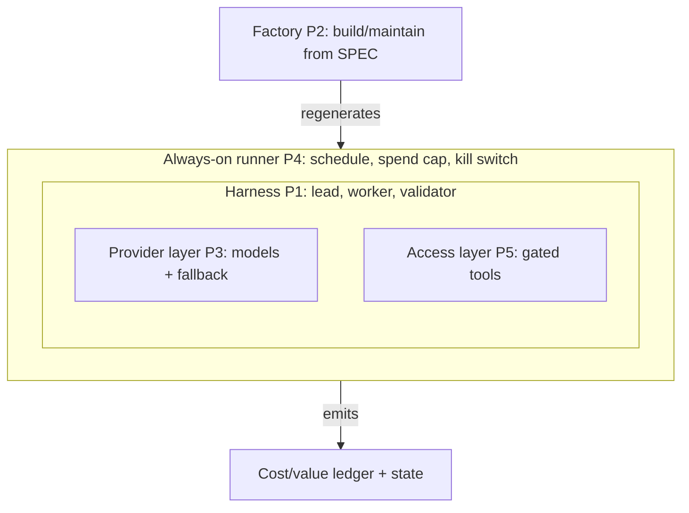

# Month 12 — Capstone: The Integrated Agentic System

**Capstone — All Five Pillars**

## Overview

For eleven months you built one capability at a time. You learned the command line and Git (M1), HTTP and JSON (M2), Python (M3), Python against real APIs (M4), and the software-engineering principles that keep a codebase from rotting (M5). Then you hand-wrote an agent loop and proved an agent is a loop, not magic (M6). After that, each month installed one of the five pillars: **Extensible Software** — pluggable model and tool providers behind interfaces, with a working fallback to local Ollama (M7, Pillar 3); **Agentic Access** — danger-rated tools, sandboxes, allowlists, MCP, webhooks, read-only database access, and human-in-the-loop gates (M8, Pillar 5); **Agent Harnesses** — the lead/worker/validator pattern, sub-agent delegation, per-role model routing, and replayable traces (M9, Pillar 1); **Software Factories** — the Plan→Scout→Build→Validate→Test→Review pipeline, spec-driven and telemetried (M10, Pillar 2); and **Always On Agents** — launchd/cron and supervised loops, spend caps, a tested kill switch, and free 24/7 hosting (M11, Pillar 4).

This month you prove you own all of it at once. The capstone is not a teaching month with a project bolted on — it is a project with just enough new ideas to make the integration coherent. You will pick one real, narrow problem, design an **integrated agentic system** that touches every pillar, build it through your own software factory, deploy it to a real always-on host, and let it run **unattended for at least fourteen consecutive days** while it produces value you can actually measure in dollars. The system has a name in this course: the **AFK Value Generator** — software that creates ongoing value while you are away from the keyboard.

The reason the capstone forces all five pillars into one system is that they are not five separate skills; they are five faces of one skill. A harness with no extensibility is locked to one vendor's pricing and uptime. Extensible providers with no guardrails are a fast way to leak secrets or wipe a directory. Guardrails with no always-on substrate are a demo, not a product. An always-on agent with no factory behind it is unmaintainable the first time it breaks at 3 a.m. And a factory with no harness is a code generator pointed at nothing. The integration *is* the lesson. By the end you will be able to say something most people who "use AI" cannot: you deployed a system that runs without you, you know exactly what it costs per day, you know exactly what it is worth per day, and you can turn it off in one command.

The bar for "done" is behavioral and unforgiving: the system runs unattended for fourteen days, you tested the kill switch at least twice, you tracked dollars-in versus value-out every week, and you can defend the whole thing in a fifteen-minute talk. If you can do that, you are no longer a person who *uses* AI. You are a person who *deploys* AI.

The single picture to hold in your head all month is how the five pillars compose. They are not a list; they are nested layers, each one wrapping the last:

*Notice: the harness (P1) sits at the center and reaches the world only through two interfaces — providers (P3) and access (P5); the runner (P4) wraps and ticks it safely; and the factory (P2) lives outside runtime, regenerating the whole thing from the SPEC.*

## Prerequisites

Coming into the capstone you must be able to do everything from Months 1 through 11. Concretely:

- Work fluently in zsh on macOS, use Git and `gh`, read HTTP/JSON, and call APIs from Python with timeouts, retries, and `.env`-loaded secrets (M1–M4).
- Write structured, tested Python — classes, `Protocol` interfaces, dependency injection, `pytest`, type hints, structured logging (M5).
- Hand-write and explain the agent loop, run a tool-call round-trip, and write a JSONL trace (M6).
- Swap the model and tool layers behind interfaces with a config-driven fallback chain to local Ollama (M7, Pillar 3).
- Rate tools by danger, enforce an allowlist and a hardened working-directory jail, run a tool in an ephemeral container, query a database read-only, and gate dangerous actions behind a human (M8, Pillar 5).
- Build a lead/worker/validator harness with per-role model routing and replayable traces (M9, Pillar 1).
- Run a Plan→Scout→Build→Validate→Test→Review software factory driven by a written spec, with telemetry (M10, Pillar 2).
- Deploy an always-on agent under launchd/cron or a supervised loop, enforce a spend cap, wire and test a kill switch, and host it on a free 24/7 substrate (M11, Pillar 4).

If any one of those is shaky, revisit that month's milestone before starting — the capstone assumes each as a working component, not a thing to learn now.

## Warm-Up: Retrieve Before You Begin

The capstone *is* a cumulative retrieval test — its whole point is integrating everything you built. So before reading on, answer these from memory, one per pillar. No peeking at earlier months. If one is blank, that pillar is the one to re-skim first.

1. (M6) In one sentence, why is an agent "a loop, not magic" — what makes the loop finally exit?
2. (M7, P3) What does a *fallback chain* do when the primary model is down, and where does it fall back to on the $0 path?
3. (M8, P5) Name the four controls you put between a worker and the outside world (think: fetch, write, db, send).
4. (M9, P1) What are the three roles in the lead/worker/validator harness, and which one refuses bad output?
5. (M10, P2) Name the six stages of the factory pipeline, in order.
6. (M11, P4) What two safety controls must a deployed always-on agent have before it runs unattended?

Check your recall

1. The loop calls the model, runs any requested tools, appends results, and calls the model again; it exits only when the model returns a final answer with *no* tool call. (M6, Lab on the hand-written agent loop.)
2. It tries each provider in order and serves the first that succeeds, so a key outage or rate-limit never stops production; on the $0 path it falls back to local Ollama. (M7, Pillar 3.)
3. An allowlist (which domains/URLs are fetchable), a working-directory jail (where files may be written), read-only DB access, and a human-in-the-loop gate for high-danger actions like sending. (M8, Pillar 5.)
4. **Lead** decides the tick's plan, **worker(s)** fetch and process a slice, **validator** accepts or rejects the output — the validator refuses bad output. (M9, Pillar 1.)
5. Plan → Scout → Build → Validate → Test → Review, driven by a written SPEC. (M10, Pillar 2.)
6. A spend cap that *halts* the system when dollars-in crosses a line, and a kill switch you can trigger in one action. (M11, Pillar 4.)

## Learning Objectives

By the end of this month you can:

1. **Scope** a real, narrow problem into an always-on agentic system, and **justify** why an always-on agent (not a one-shot script, not a chatbot) is the right shape for it.
2. **Architect** an integrated system in a written design doc that names how all five pillars compose, where each lives in the code, and where the seams between them are.
3. **Author** a factory SPEC that drives the build, and **run** your Plan→Scout→Build→Validate→Test→Review factory to produce the system.
4. **Integrate** the five pillars into one deployed artifact: a custom harness (P1), built through a factory (P2), on pluggable providers with a working fallback (P3), behind documented agentic-access guardrails (P5), running always-on (P4).
5. **Instrument** the system for cost and value: dollars-in-tokens per day, value-produced per day, and a weekly ratio you actually report.
6. **Harden** the deployment: a spend cap that halts the system, and a kill switch you test at least twice and prove works.
7. **Operate** the system unattended for at least fourteen consecutive days, diagnosing failures from logs and traces rather than by watching it.
8. **Complete** a `pillar-coverage-matrix` that proves, with file and line references, that each of the five pillars is genuinely present (not decorative).
9. **Defend** the system in a fifteen-minute demo and a written `RETROSPECTIVE.md` covering architecture, production bugs, dollars spent versus value captured, and a roadmap for what to build next.

## Tech Stack (free, macOS)

You introduce almost no new tools this month — the capstone composes what you already own. Reuse your packages from prior months as libraries.

| Tool | Install | Why |
|---|---|---|
| Python 3.12+ via uv | `brew install uv`; `uv python install 3.12` | The project is a `uv` workspace; your prior-month packages are local dependencies. |
| Your M7 `llm` package | (from Month 7) | Pillar 3. Pluggable providers + the fallback chain to Ollama. |
| Your M8 guardrails | (from Month 8) | Pillar 5. The jail, allowlist, egress gate, read-only DB access, danger levels, and human gates. |
| Your M9 harness | (from Month 9) | Pillar 1. The lead/worker/validator scaffolding and replayable trace. |
| Your M10 factory | (from Month 10) | Pillar 2. The Plan→Scout→Build→Validate→Test→Review pipeline that builds and maintains the system. |
| Your M11 always-on rig | (from Month 11) | Pillar 4. The launchd/cron or supervised-loop runner, spend cap, and kill switch. |
| Ollama + two models | `brew install ollama`; `ollama pull qwen2.5:3b`, `ollama pull qwen2.5:7b` | The **free** model layer — small model for triage/filtering, larger for synthesis. The whole capstone completes at **$0** on these. |
| A free 24/7 host | Oracle Cloud Free Tier *or* Fly.io free allowance *or* a Mac left on with `caffeinate` | Pillar 4's substrate for the fourteen-day run. Present free options first; a few dollars on a tiny VPS buys reliability. |
| `httpx` | `uv add httpx` | Scraping/fetching the sources your value generator reads (advisories, prices, listings, inboxes). |
| `sqlite3` (built in) | — | A tiny local store for state, dedup, and the cost/value ledger. No server to run. |

**Cost summary.** The capstone is **$0-completable end to end.** Run every model role on local Ollama (`qwen2.5:3b` for filtering/triage, `qwen2.5:7b` for drafting/synthesis), host the fourteen-day run on Oracle Cloud's always-free tier or a Mac kept awake with `caffeinate`, and your dollars-in line is literally zero — which makes the cost/value ratio trivially favorable and is a perfectly valid way to pass. The **paid** path is optional and exists so you can *measure* it honestly: routing the synthesis role to a small frontier model (e.g., Claude Haiku or GPT-4o-mini class) for a daily run that moves a few hundred thousand tokens costs on the order of cents-to-low-dollars per day. Your ledger must report whichever path you ran. The skill the capstone certifies is not "spend money" — it is "know your number."

## Weekly Breakdown

Budget ~8–12 hours per week, but the mix is different from a teaching month: roughly 15% reading, 85% project. Weeks 3–4 are mostly *waiting and watching* — the unattended run does the work; you diagnose and harden.

### Week 1 — Scope, architecture, and the SPEC

**Warm-start (before new material):** open your five prior-month packages (M7–M11) and re-run each one's milestone demo once — the fallback chain, a gated tool, a harness tick, a factory build, a capped runner. This re-arms the artifacts you are about to compose and tells you immediately if one drifted. Then scope the project *against those artifacts*: what does each already give you, and what seam between them is missing?

Pick your problem and lock the scope. Choose one of the four example problems below (or a narrow problem of your own that hits the same bar). Write the **architecture doc**: a one-page system diagram showing the harness, the factory, the provider layer, the guardrails, and the always-on runner, plus the data flow from source to value. Write the factory **SPEC** that will drive the build. Fill in the first column of the **pillar-coverage matrix** as a *plan* (where each pillar will live). Reading: re-skim the M9 harness spec and the M10 factory spec sections. What gets built: `ARCHITECTURE.md`, `SPEC.md`, the matrix skeleton, and the empty `uv` project wiring in your five prior-month packages. (Lab 1.)

### Week 2 — Build the harness, wire the factory and the pillars

Run the factory against the SPEC to scaffold the system, then integrate by hand where the factory needs steering. Stand up the harness for your domain (lead decides what to do today; worker(s) fetch and process; validator checks the output before it is allowed to count as value). Wire the provider layer with a fallback you actually test by pulling the plug on the primary. Apply the access guardrails — every source fetch, every file write, every draft is danger-rated and either allowlisted or gated. Get one full end-to-end run working *by hand* (you trigger it; it produces one unit of value). Reading: your own M7/M8 READMEs. What gets built: a running system you can invoke once and watch produce value, plus the cost/value ledger schema. (Lab 2.)

### Week 3 — Go always-on; spend cap and kill-switch tests

Deploy to the always-on host. Put it on a schedule (cron/launchd for digest-style problems; a supervised `while True` with sleep for continuous ones). Wire the spend cap so the system halts itself if dollars-in crosses your line. Test the **kill switch twice** — once by the file/flag mechanism, once by the process/host mechanism — and record both. Start the fourteen-day clock. Reading: your M11 README. What gets built: the deployed, scheduled, capped, killable system, and Day 0 of the unattended run. (Lab 3, first half.)

### Week 4 — Unattended run, retrospective, and demo

Let it run. Check the logs and ledger daily but **do not babysit** — the point is that it works without you. When it breaks (it will), diagnose from the trace, fix through the factory, redeploy, and note the production bug. At the end of the run, total the dollars-in and value-out, fill in the final matrix with file/line evidence, write `RETROSPECTIVE.md`, and prepare the fifteen-minute demo. What gets built: fourteen days of logs, the completed matrix, the retrospective, and the talk. (Lab 3, second half.)

## Core Concepts

This section is deliberately short. You already learned the pillars; the only genuinely new ideas this month are *how they compose*, *what makes a good capstone problem*, and *how to prove value*. Everything else is execution.

### How the five pillars compose into one system

> **Heavy concept ahead.** Slow down here; this is the load-bearing idea of the month. The hard part of the capstone is not any one pillar — it is managing the *integration complexity* of all five at once. Working memory can't hold five seams simultaneously, so do not wire them all together and then debug. Build and test **one seam at a time** (providers, then access, then harness, then ledger, then runner), proving each before crossing to the next. That is the single piece of advice that keeps the capstone from collapsing into an un-debuggable tangle.

> **Common misconception.** Integration is just importing all five modules and calling them.
> **Reality.** The imports are the easy 10%. The work is the *seams* — the interfaces where one pillar hands off to another (does fallback actually fire? does every dangerous action really route through the gate?). A system where all five packages import cleanly but no seam is tested is exactly the "decorative pillars" failure the matrix is designed to catch.

Picture the system as concentric rings. At the center is the **harness (P1)** — the loop tailored to your domain, with a lead that decides what to do on this tick, workers that do it, and a validator that refuses to let bad output count. The harness does not call models or tools directly; it calls them through interfaces. The first interface is the **provider layer (P3)**: the harness asks for "a triage model" or "a synthesis model" and the provider layer decides whether that is Ollama or a paid endpoint, falling back automatically when the primary is down. The second interface is the **access layer (P5)**: every time a worker wants to fetch a URL, write a file, query the database, or send a draft, it goes through the danger-rated, allowlisted, gated tool layer — so the harness can want to do something dangerous and still be physically unable to do it unsupervised.

Around those rings is the **always-on runner (P4)**: a scheduler or supervised loop that wakes the harness on a cadence, enforces the spend cap, and exposes the kill switch. The runner does not know or care what the harness does — it just ticks it safely, forever. And *outside* the whole system, not at runtime but at build-and-maintain time, sits the **factory (P2)**: the Plan→Scout→Build→Validate→Test→Review pipeline that produced the system from the SPEC and that you run again every time you need to change it. This is the crucial mental move: the factory is not part of the running product; it is the thing that *makes and maintains* the product. When a production bug shows up on Day 6, you do not hand-patch the live system — you update the SPEC, run the factory, get a tested change, and redeploy. That is what separates a deployment you own from a script you are forever babysitting.

The seams between rings are where integration bugs live, so name them explicitly in your architecture doc: harness↔provider (does fallback actually fire?), harness↔access (is every dangerous action really routed through the gate, or did one sneak past?), runner↔harness (does the spend cap actually halt a tick mid-flight?), and factory↔system (can you regenerate the system from the SPEC, or has the live code drifted from the spec?). A good capstone is one where you can point at each seam and show the test that proves it holds.

### Choosing a good capstone problem

A good capstone problem is **narrow, real, recurring, and cheap to verify.** Narrow: one company's tech stack, one inbox, one competitor's prices — not "a general research assistant." Real: there is an actual person (you, or a willing stand-in) who would notice if the output stopped. Recurring: value accrues on a cadence — every morning, every four hours — which is what makes always-on the right shape instead of a one-shot script. Cheap to verify: you can glance at today's output and tell in thirty seconds whether it is good, because a value generator you cannot quickly check is a value generator you cannot trust unattended.

The four worked example problems, any of which clears the bar:

- **Daily security-advisory digest.** Scrape ~20 sources (vendor advisories, CVE feeds, security blogs), filter for one company's actual tech stack, and produce a ranked morning digest. Value = analyst-hours saved triaging feeds. The filtering is a great fit for a cheap local triage model; synthesis of the digest is the larger model.
- **Inbox-triage drafter.** Every four hours, read new mail (read-only access — Pillar 5 earns its keep here), categorize, and draft replies *into a review folder for a human to approve and send.* The agent never sends. Value = drafting time saved; the human-in-the-loop gate is the whole point.
- **Competitive pricing tracker.** For a small business, scrape a handful of competitors' product pages daily, detect price changes, and alert when a tracked SKU moves past a threshold. Value = pricing decisions made on fresh data instead of stale guesses.
- **Job-listing scout.** Every morning, pull new postings matching a tight profile, score them, dedup against what you have seen, and open a candidate record (a row, a file, a draft) for each strong match. Value = first-pass screening done before the human sits down.

Notice every one of these is *defensible as always-on*: the value is in the cadence and the unattended-ness, not in a single clever output.

### Proving value: the cost/value ledger

The capstone's signature artifact is a ledger that answers two numbers every day: **dollars-in** (token spend, plus any host cost amortized per day — zero on the free path) and **value-out** (a quantity you defined up front and can defend). Value-out is rarely dollars directly; it is usually *time saved* converted to dollars at a stated rate, or *decisions enabled*, or *items handled*. The discipline is not precision — it is honesty and consistency: pick a definition in Week 1, write it in the SPEC, and report the same metric every week. The weekly **ratio** (value-out ÷ dollars-in) is what you put in the retrospective. On the $0 path that ratio is undefined-or-infinite, which is fine and which you should say plainly; the skill being tested is that you *measured*, that you know what a paid run would have cost, and that you could make the call.

> **Common misconception.** "It's only a 14-day demo on the free path, so I can skip the spend cap and the kill-switch tests."
> **Reality.** The 14-day unattended window is *exactly* when a missing control bites — a retry-storm bug at 3 a.m. on Day 9 burns host resources (or, on a paid role, real money) precisely because no one is watching. The cap and kill switch exist for the unattended case, not the watched one; an unwatched agent with no cap is the textbook liability. Wire and test both *before* the clock starts.

> **Common misconception.** "I wrote a kill switch and tested it once — that's enough."
> **Reality.** One test proves the happy path, not the control. The rubric requires testing it **twice, by two independent mechanisms**: a flag the next tick honors *and* a process/host termination of a live runner. They fail differently (a flag-only switch can't stop a tick already mid-flight; a process kill can orphan sub-agent children), so a single test leaves a real failure mode unproven.

## Labs

Three labs, framed as project phases. They are larger and more open-ended than teaching-month labs — that is intentional for a capstone.

| Lab | Title | Time | Difficulty |
|---|---|---|---|
| [Lab 1](lab-1-capstone-kickoff-scope-architecture-and-spec.md) | Capstone Kickoff: Scope, Architecture, and SPEC | ~8–10 hrs | Core |
| [Lab 2](lab-2-build-and-integrate-the-five-pillars.md) | Build & Integrate the Five Pillars | ~10–12 hrs | Stretch |
| [Lab 3](lab-3-deploy-harden-and-retrospect.md) | Deploy, Harden & Retrospect (incl. 14-day run) | ~10–12 hrs active + 14 days unattended | Stretch |

## Checkpoints & Self-Assessment

Run these quick checks as you go; they map to the seams that fail most often.

- **Scope check:** can you state, in one sentence, the recurring value your system produces and who would notice if it stopped? If not, your problem is too broad.
- **Fallback check:** stop Ollama (or revoke the paid key) mid-run. Does the provider layer fall back and the run complete? If it crashes, P3 is decorative.
- **Gate check:** grep your worker code for raw `httpx.get`, `open(...,'w')`, `subprocess`, or DB writes that *bypass* your M8 tool layer. There should be none.
- **Cap check:** set the spend cap to a tiny value and run. Does the system halt itself before exceeding it? A cap that doesn't halt is a comment, not a control.
- **Kill check:** trigger the kill switch by the flag mechanism, confirm the next tick refuses to run; trigger it by the process/host mechanism, confirm the process is gone. Two mechanisms, both tested.
- **Regenerate check:** can you change one line of the SPEC, run the factory, and get a tested change — without hand-editing the live system? If not, the factory↔system seam has drifted.
- **Unattended check:** has it produced correct value for ≥14 consecutive days with you only reading logs, not intervening at runtime?

## Reflect

This is the last reflection of the course, so make it the widest. Spend twenty minutes on these in your learning log (writing, not just thinking):

- **Explain it back:** In three or four sentences, explain to a peer who just finished Month 1 what "an integrated agentic system" is — and why importing five packages is not the same as integrating them.
- **Connect:** Pick the one seam that surprised you most in the build. How does owning *that* seam change the way you would now start any new automation project, versus how you'd have started it in Month 1?
- **Monitor:** Of the five pillars, which is still the shakiest in your own hands? Name it precisely and write the one thing you'd build next to harden it.
- **The arc:** What changed in *how you think* between Month 1 (you couldn't open a terminal) and now (you deploy systems that run without you)? Write the single sentence that captures the shift — it is the thing the whole twelve months was for.

## Month-End Assessment

**Deliverable:** the **AFK Value Generator** — a running, integrated agentic system that has completed at least **fourteen consecutive days unattended** on a real always-on host, plus its documentation. You submit: the `system/` package (harness, providers, guardrails, runner wired together); `ARCHITECTURE.md` and `SPEC.md`; the completed **pillar-coverage matrix** with file/line evidence for each pillar; the **cost/value ledger** with weekly ratios; `runs/` containing logs/traces spanning the fourteen-day window and the two recorded **kill-switch tests**; and `RETROSPECTIVE.md`. Done means you can deliver a **fifteen-minute demo** that shows the system producing value live, walks the matrix, states the dollars-in-versus-value-out numbers, and names what you would build next.

**Rubric**

- **Passing:** The system is deployed on a real always-on host and ran **unattended for ≥14 consecutive days** producing correct value on its cadence. **All five pillars are genuinely present** and the matrix points at real code for each: a custom **harness** (P1) with at least lead+worker+validator roles; the system was **built/maintained through the factory** (P2), evidenced by a SPEC and at least one change made by re-running the factory rather than hand-patching; the model layer uses **pluggable providers with a fallback** that you demonstrate firing (P3); every dangerous action is routed through **documented access guardrails** (P5); and the **always-on runner** (P4) enforces a spend cap and a kill switch you **tested at least twice** (both tests recorded). The **cost/value ledger** reports dollars-in and value-out with a weekly ratio (zero-dollars on the $0 path is fine, stated plainly). `RETROSPECTIVE.md` covers architecture, at least one real production bug and its fix, the dollars-versus-value numbers, and a next-build roadmap.
- **Excellent:** All of the above, plus: the architecture doc names every inter-pillar **seam** and the matrix cites a **test** that proves each seam holds (fallback fires, no action bypasses the gate, the cap halts a tick mid-flight, the system regenerates from the SPEC); production bugs were fixed by **updating the SPEC and re-running the factory**, not by editing the live host, with the factory run linked in the retrospective; the **kill switch is tested by two independent mechanisms** (a flag the next tick honors *and* process/host termination) and both are reproducible from `runs/`; the cost/value ledger distinguishes free-path from paid-path numbers and the retrospective makes a defensible **call** on which path to run in production and why; the system survived at least one **real adversarial event** in the fourteen days (a source went down, a feed changed shape, the host rebooted) and degraded gracefully because of a guardrail or fallback, with the incident traced; and the fifteen-minute demo convincingly argues, with a concrete moment, where a less-integrated system would have failed (no fallback → outage; no gate → leaked secret or bad send; no factory → unmaintainable patch).

The real definition of done is behavioral: **the system runs without you, you know its daily cost and daily value, and you can turn it off in one command.** If it only runs while you watch it, you built a demo. If you cannot state its number, you built a toy. If you cannot kill it cleanly, you built a liability. The capstone certifies that you built none of those — you built a deployment you own.

## Common Pitfalls

- **Scope creep into "a general assistant."** The fastest way to fail the capstone is to pick a problem too broad to verify in thirty seconds. Narrow until the daily output is trivially checkable, then narrow once more.
- **Decorative pillars.** Importing your M7 package but never letting fallback fire, or wrapping a fetch in a "tool" that doesn't actually enforce the allowlist, is a pillar in name only. The matrix demands *evidence*, and the seam checks demand *tests*. Build the proof, not the prop.
- **Hand-patching the live system.** The first production bug tempts everyone to SSH in and fix the file. Do that and the factory↔system seam dies and your SPEC becomes a lie. Fix through the factory; that is the whole point of having one.
- **An untested kill switch.** "I wrote a kill switch" is worth nothing until you have proved it halts a *running* tick and that the host stays down. Test it twice, by two mechanisms, and record both — before the fourteen-day clock, not after a runaway bill.
- **No spend cap on the paid path.** If you route any role to a paid endpoint and an infinite-loop or retry-storm bug hits at 3 a.m., an uncapped system bills all night. The cap must *halt the system*, not just log a warning.
- **Babysitting the run.** Checking logs is fine; intervening at runtime resets the unattended clock. If you find yourself manually re-triggering ticks or feeding it inputs, the system isn't actually always-on yet — fix the runner, then restart the clock.
- **Value you can't defend.** "It saves time" with no metric is not value-out. Define the unit (minutes saved × rate, items handled, decisions enabled) in Week 1 and report it consistently, or the ledger is theater.
- **Skipping the retrospective because "it worked."** If nothing broke in fourteen days, you weren't watching closely — a source rotated, a token expired, a tick ran long. Find the incident, trace it, and write it up. Owning a deployment means knowing how it bends.

## Knowledge Check

This is the course's capstone quiz, so almost every question is a ⟲ spaced callback spanning the whole arc, plus "which pillar does this belong to" mapping. Answer from memory first, then check.

1. ⟲ Map each to its pillar (P1–P5): (a) a `FallbackChain` from a paid model to Ollama; (b) a `human_gate()` on a `send` action; (c) a lead that decides the tick's plan; (d) a `launchd` schedule plus a spend cap; (e) re-running Plan→Scout→Build→Validate→Test→Review to ship a fix.
2. ⟲ (M6/M9) Your harness keeps calling the model in a loop and never returns. What is the most likely cause, and which role should break the loop?
3. ⟲ (M7) On the $0 path the cost/value ratio is "infinite." Why is that a *valid* pass, and what must your ledger still prove?
4. ⟲ (M8) A teammate adds `httpx.get(url)` directly inside `worker.py` "just to grab one feed." Which seam did they break, and what's the one-line test that catches it?
5. Spot the risk: a learner deploys on the free path, skips the spend cap "because $0," and starts the 14-day clock. What goes wrong, and when?
6. ⟲ (M10/M11) Day 6, a source changes shape and the digest breaks. Describe the *correct* fix path, and name the anti-pattern it avoids.
7. Which tool and why: you need the next tick to refuse to run *and* you need to stop a tick already mid-flight. What two mechanisms cover both, and why isn't one enough?
8. ⟲ (M5/M11) Why must the kill-flag path, spend-cap value, and schedule live in environment variables rather than in code the factory regenerates?
9. The matrix says P3 is "present" because you imported your M7 package. Is that sufficient? What would make it genuine?
10. In one sentence: what is the difference between the system you built and "a script you are forever babysitting"?

Answer key

1. (a) P3 Extensible/providers; (b) P5 Access; (c) P1 Harness; (d) P4 Always-on; (e) P2 Factory.
2. The model keeps requesting tool calls and the loop only exits on a final answer with no tool call (M6); the **validator** plus a max-iterations cap should bound it. A loop that never returns usually means the exit condition isn't being reached or checked.
3. It's valid because the skill being certified is the *discipline of measuring*, not the size of a number; running entirely on Ollama + a free host means dollars-in is genuinely $0. The ledger must still record daily rows, define a defensible value-out unit, and state what a paid run *would* have cost. (M7 + this month's ledger.)
4. The **harness↔access seam** (P5) — a worker reached around the gate. The grep/regex test over `system/harness/*.py` for raw `httpx`/`open(...,'w')`/`subprocess`/`.execute(` catches it. (M8.)
5. On the free path the cap never triggers *naturally* (dollars-in is 0), so skipping it feels safe — but you've then deployed an *unkillable-by-budget* agent. A retry-storm or runaway-loop bug mid-run burns host CPU/quota with nothing to halt it; it bites unattended, typically days in. Test the cap mechanism by seeding spend high.
6. Diagnose from the trace, edit `SPEC.md`, re-run the factory to get a tested change, redeploy (M10). The anti-pattern it avoids is **hand-patching the live host**, which makes the SPEC a lie and kills the factory↔system seam.
7. The **kill flag** (next tick reads it and refuses) and **process/host termination** (`kill`/`launchctl unload`/`fly machine stop`). One isn't enough: a flag can't stop a tick already running, and a hard kill alone leaves no graceful refusal and can orphan sub-agent children. (M11.)
8. The Twelve-Factor "config in environment" rule: those values are host-specific, and the factory *regenerates code*. Keeping them in env means a regeneration on a production fix never clobbers host config. (M5 software-engineering + M11.)
9. No — an import is decorative. Genuine means the fallback **actually fires** under a forced primary failure, proven by a passing seam test and a matrix file:line reference.
10. The system runs without you, you know its daily cost and daily value, and you can turn it off in one command; a babysat script needs you present to produce value and to stop.

## Further Reading

- [Anthropic — "Building effective agents"](https://www.anthropic.com/research/building-effective-agents) — the composition principles behind keeping each ring simple and letting the seams, not the cleverness, carry the system.
- [Google SRE Book — "Monitoring Distributed Systems"](https://sre.google/sre-book/monitoring-distributed-systems/) — what to log and alert on for a system you intend to leave running and not watch.
- [The Twelve-Factor App](https://12factor.net/) — config-in-environment, disposability, and logs-as-streams: directly relevant to a small always-on service that must survive a host reboot.
- [Oracle Cloud — Always Free resources](https://www.oracle.com/cloud/free/) — the free 24/7 substrate referenced throughout; provision an Always Free VM for the fourteen-day run.
- [`launchd` info / `man launchd.plist`](https://www.launchd.info/) — the macOS scheduler for digest-style cadences if you host the run on a Mac kept awake with `caffeinate`.
- [SQLite — "Appropriate Uses For SQLite"](https://www.sqlite.org/whentouse.html) — why a single-file database is exactly right for the state store and the cost/value ledger.

## Author's Notes

This is the capstone, so it is structured as a project, not a lesson: the Core Concepts section is intentionally thin (the only new ideas are pillar *composition*, problem *selection*, and value *measurement*) and the weight sits in the assessment, the pillar-coverage matrix, and the three project-phase labs. Two calibration tradeoffs worth naming. First, **the $0 path versus the value ratio.** The Free-LLM mandate means the capstone must be completable for zero dollars on Ollama + an always-free host, which makes the cost/value ratio trivially infinite — so the rubric grades the *discipline of measuring* and the honesty of stating "free path, zero dollars-in," not the size of a number, while still requiring the learner to know what a paid run would cost so they can make a real production call. Second, **fourteen days is a real constraint on a four-week month.** The clock is deliberately started in Week 3 so the unattended run overlaps Week 4's retrospective work; a learner who scoped well in Week 1 and integrated cleanly in Week 2 has ample runway, but the design assumes the build is *done* by end of Week 2, which is why Lab 2 is the heaviest and is rated Stretch. The behavioral definition of done — runs without you, known cost, known value, one-command kill — is the single sentence that says whether the entire twelve-month arc landed.
