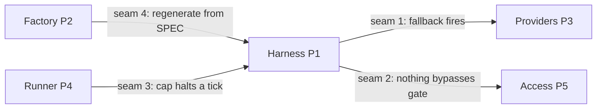

# Lab 1 — Capstone Kickoff: Scope, Architecture, and SPEC

**Time: ~8–10 hrs · Difficulty: Core · Builds on: Months 7–11 (all five pillars) and the Month 12 README**

## Objective

This lab is design, not code — and that is the point. A capstone fails or succeeds in Week 1. You will choose one narrow, real problem; write a one-page architecture doc that names where each of the five pillars lives and where the seams between them are; author the factory SPEC that will drive Week 2's build; and fill in the *planned* column of the pillar-coverage matrix. By the end you will have a `uv` project that wires in your five prior-month packages and four documents that make the rest of the capstone execution instead of invention.

## Setup

```bash
# A fresh project that depends on your prior-month packages as local libs.
cd ~/agentic-engineer
uv init capstone-afk-value-generator
cd capstone-afk-value-generator
uv python pin 3.12

# Wire in the five pillars as editable local dependencies.
# Adjust the relative paths to wherever your M7–M11 packages live.
uv add --editable ../month-07-extensible-software/llm
uv add --editable ../month-08-agentic-access/guardrails
uv add --editable ../month-09-agent-harnesses/harness
uv add --editable ../month-10-software-factory/factory
uv add --editable ../month-11-always-on/runner

uv add httpx pydantic

# The free model layer (from M7/M9).
ollama pull qwen2.5:3b
ollama pull qwen2.5:7b
ollama serve &   # if not already running
```

**Checkpoint:** `uv run python -c "import llm, guardrails, harness, factory, runner; print('all five pillars importable')"` prints the success line. If any import fails, fix that package path before continuing — the capstone assumes all five as working libraries.

## Background

**Recall first (from memory):** Name the five pillars and the prior-month package each comes from. Which two of them are *interfaces* the harness reaches the world through, and which one lives *outside* runtime entirely? (Answers: P1 harness/M9, P2 factory/M10, P3 providers/M7, P4 runner/M11, P5 access/M8; the interfaces are P3 and P5; the factory P2 is outside runtime.)

You are not learning new pillars this month; you are composing the ones you own. The README's Core Concepts section describes the system as concentric rings (harness at the center, provider and access layers as interfaces around it, the always-on runner outside that, and the factory outside the runtime entirely). This lab turns that mental model into four concrete artifacts. Resist the urge to write code — every hour spent sharpening the scope and the seams here saves a day of integration pain in Week 2.

## Steps

### 1. Choose the problem and write the scope statement

Pick one of the four README example problems (security-advisory digest, inbox-triage drafter, competitive pricing tracker, job-listing scout), or a problem of your own that is equally narrow, real, recurring, and cheap to verify. Then write the scope statement at the top of `SPEC.md`.

```markdown
# AFK Value Generator — SPEC

## Problem
<One paragraph: what recurring value, for whom, on what cadence.>

## Why always-on (not a one-shot script)
<One paragraph: the value is in the cadence and the unattended-ness.>

## Value definition (the ledger metric)
- Unit of value: <e.g., analyst-minutes saved per digest>
- Conversion to dollars: <e.g., 30 min/day × $60/hr = $30/day>
- How I will verify a day's output is good in <30 seconds: <the glance test>

## Cadence
<e.g., once daily at 07:00 (cron); or every 4 hours (supervised loop).>

## Out of scope (explicitly)
<List 3+ things you are NOT doing. This is how you resist scope creep.>
```

**Checkpoint:** a peer (or you, a day later) can read the scope statement and state in one sentence what value the system produces and who would notice if it stopped.
**If not:** the problem is too broad or the value too vague. If the "out of scope" list is empty, you haven't narrowed yet — add three exclusions. If you can't write the 30-second glance test, the output isn't cheap-to-verify; pick a narrower slice (one tech stack, one inbox, one competitor) and rewrite.

### 2. Write the architecture doc and name the seams

Create `ARCHITECTURE.md`. It has two parts: a diagram (ASCII is fine) and a seams table. The diagram shows the rings; the seams table is what separates an Excellent capstone from a Passing one.

The four seams you must name are the four arrows where one pillar hands off to another — they are where every integration bug will live:


*Notice: the seams, not the boxes, are the work — each labeled arrow becomes one row in the seams table below and one passing test in Week 2.*

```markdown
# Architecture

## System diagram (the rings)

           ┌─────────────────── FACTORY (P2, build/maintain-time) ───────────────────┐
           │  Plan → Scout → Build → Validate → Test → Review   (runs from SPEC.md)   │
           └──────────────────────────────────┬──────────────────────────────────────┘
                                               │ regenerates
                                               ▼
        ┌──────────────────── ALWAYS-ON RUNNER (P4) ─────────────────────┐
        │  scheduler/loop · spend cap · kill switch                       │
        │   ┌─────────────────── HARNESS (P1) ───────────────────────┐   │
        │   │  LEAD (what to do this tick)                            │   │
        │   │   → WORKER(s) (fetch + process one slice)               │   │
        │   │   → VALIDATOR (refuse bad output)                       │   │
        │   │      ▲ via PROVIDER LAYER (P3)   ▲ via ACCESS LAYER (P5) │   │
        │   └──────┼──────────────────────────┼─────────────────────┘   │
        │          │ model: ollama|paid +     │ tools: fetch/write/db/   │
        │          │ fallback                 │ send, danger-rated+gated │
        └──────────┴──────────────────────────┴───────────────────────────┘
                                               │ writes
                                               ▼
                              cost/value ledger + state store (sqlite)

## Data flow
<Source → fetch (gated) → process (worker+model) → validate → emit value → log to ledger.>

## Seams (where integration bugs live)
| Seam | Question it must answer | How I will prove it (Week 2 test) |
|---|---|---|
| harness ↔ provider | Does fallback fire when the primary is down? | <test name> |
| harness ↔ access | Does every dangerous action route through the gate? | <test name> |
| runner ↔ harness | Does the spend cap halt a tick mid-flight? | <test name> |
| factory ↔ system | Can I regenerate the system from the SPEC? | <test name> |
```

**Checkpoint:** every ring in the diagram maps to one of your five imported packages, and the seams table has a planned test name in every row.
**If not:** an empty seams table means you have not thought about integration yet — for each of the four arrows in the Mermaid diagram, write the one question it must answer and a test name like `test_seam_fallback`. A ring with no package behind it means a pillar is missing; go back and confirm which M7–M11 package fills it.

### 3. Finish the factory SPEC

Extend `SPEC.md` with the sections your M10 factory consumes to plan and build. Keep it spec-driven: describe *what* the system must do and *how it will be verified*, not the implementation.

```markdown
## Components to build
- harness/lead.py     — decides the tick's plan from state + new inputs
- harness/worker.py   — fetches and processes one slice (gated tools only)
- harness/validator.py— accept/reject the tick's output (schema + substance)
- providers.py        — selects triage vs synthesis model via the M7 llm package
- access.py           — wraps fetch/write/db/send in M8 danger-rated, gated tools
- runner.py           — schedule/loop + spend cap + kill switch (M11)
- ledger.py           — sqlite: dollars-in, value-out, daily rows

## Acceptance criteria (the factory's Validate/Test stage checks these)
- A single manual tick produces exactly one verified unit of value.
- Pulling the primary model mid-tick still completes via fallback.
- No worker performs a fetch/write/db/send except through access.py.
- Setting SPEND_CAP_USD low halts the runner before exceeding it.
- The kill flag, once set, makes the next tick refuse to run.

## Guardrail policy (Pillar 5, documented)
| Action | Danger | Control |
|---|---|---|
| fetch source URL | low | allowlist of source domains |
| write to review folder | medium | jail to ./out, no overwrite outside |
| read database | low | read-only connection |
| send/email | HIGH | human gate — never auto-send |
```

**Checkpoint:** the acceptance criteria are concrete enough that someone else could tell whether the built system passes each one, and the guardrail policy table lists every external action your system takes with a danger level and a control.
**If not:** rewrite any criterion you can't turn into a pass/fail check (replace "works well" with "produces exactly one verified unit per tick"). If your guardrail table is missing a row, trace one tick on paper — every fetch, write, db-read, and send is an external action that needs a danger level and a control.

### 4. Fill the planned column of the pillar-coverage matrix

Create `pillar-coverage-matrix.md`. This is the capstone's proof-of-integration artifact. In Lab 1 you fill only the "Planned location" column; Labs 2–3 fill the evidence and test columns.

```markdown
# Pillar Coverage Matrix

| Pillar | Requirement | Planned location | Evidence (file:line) | Proving test |
|---|---|---|---|---|
| P1 Harness | lead/worker/validator tailored to the domain | harness/*.py | _(Lab 2)_ | _(Lab 2)_ |
| P2 Factory | system built/maintained via Plan→…→Review from SPEC | factory run logs | _(Lab 2)_ | _(Lab 3)_ |
| P3 Extensible | pluggable providers + fallback that fires | providers.py | _(Lab 2)_ | _(Lab 2)_ |
| P5 Access | every dangerous action danger-rated + gated | access.py | _(Lab 2)_ | _(Lab 2)_ |
| P4 Always-on | scheduled/looped + spend cap + tested kill switch | runner.py | _(Lab 3)_ | _(Lab 3)_ |
```

**Checkpoint:** every pillar has a planned location that names a real file you intend to create. No "TBD" in the planned column.
**If not:** a "TBD" means you haven't decided where that pillar lives — re-read its row against the SPEC's Components list and point it at a concrete file (e.g., P3 → `system/providers.py`). If two pillars point at the same file with no seam between them, you've probably merged a responsibility that should stay separate.

### 5. Stub the project and run the factory's Plan stage

Create the empty module files referenced in the SPEC and run only the **Plan** stage of your M10 factory against `SPEC.md`, so you enter Week 2 with a build plan rather than a blank page.

```bash
mkdir -p system/harness out runs
touch system/__init__.py system/harness/__init__.py
for f in lead worker validator; do touch "system/harness/$f.py"; done
touch system/providers.py system/access.py system/runner.py system/ledger.py

# Run ONLY the planning stage of your factory against the spec.
uv run factory plan --spec SPEC.md --out runs/plan-week1.md
```

**Checkpoint:** `runs/plan-week1.md` exists and contains a build plan derived from your SPEC (a task list / sequencing for the components).
**If not:** if the file is empty or the `factory plan` command isn't found, your M10 factory may expose planning differently — invoke its planning entry point however M10 defined it (a function, a different subcommand). The deliverable is a written plan on disk, not the exact command. If the plan ignores your components, the SPEC's Components section is probably too thin; flesh it out and re-run.

## Definition of Done

- `SPEC.md` exists with: problem, why-always-on, value definition, cadence, out-of-scope, components, acceptance criteria, and the guardrail policy table.
- `ARCHITECTURE.md` exists with the rings diagram, the data flow, and a **seams table with a planned test in every row**.
- `pillar-coverage-matrix.md` exists with a real planned location for **all five pillars**.
- The `uv` project imports all five prior-month packages (the Setup checkpoint passes).
- `runs/plan-week1.md` contains a factory-generated build plan from the SPEC.
- Self-verify:
  ```bash
  uv run python -c "import llm, guardrails, harness, factory, runner; print('pillars OK')" \
    && test -s SPEC.md && test -s ARCHITECTURE.md && test -s pillar-coverage-matrix.md \
    && test -s runs/plan-week1.md && echo "Lab 1 done"
  ```

**Self-explain:** in one sentence, why does naming the four seams *before* writing any code make Week 2's integration execution rather than invention?

## Stretch Goals

- Write a second scope statement for a *different* one of the four problems and spend ten minutes arguing which is easier to verify in thirty seconds — verifiability is the real selection criterion.
- Add a "failure modes" section to `ARCHITECTURE.md`: for each external source, what happens when it goes down, changes shape, or rate-limits you, and which ring absorbs it.
- Draft the ledger schema as actual SQL (`CREATE TABLE ledger ...`) so Week 2 starts with the value-measurement table ready.
- Pre-write the four seam tests as empty `pytest` stubs with descriptive names and `pytest.skip("Lab 2")` bodies, so the build has explicit targets.

## Troubleshooting

- **An import fails in the Setup checkpoint.** The editable path is wrong, or that package wasn't built as an installable package in its month. `cd` into the package dir and confirm it has a `pyproject.toml`; fix the relative path in `uv add --editable`.
- **"My problem doesn't fit any of the four examples."** That's fine — apply the four tests (narrow, real, recurring, cheap-to-verify). If it fails *cheap-to-verify*, you will not be able to trust it unattended; pick again or narrow it.
- **The factory `plan` command doesn't exist.** Your M10 factory may expose planning differently (a function, a different subcommand). Use whatever produces a written plan from a spec; the artifact, not the exact command, is the requirement.
- **Tempted to start coding the harness now.** Don't. The lab's whole value is that Week 2 becomes execution. If the SPEC and seams aren't sharp, no amount of Week 2 code will save the integration.
