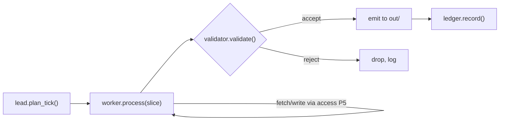

# Lab 2 — Build & Integrate the Five Pillars

**Time: ~10–12 hrs · Difficulty: Stretch · Builds on: Lab 1 (SPEC, architecture, matrix) and Months 7–10**

## Objective

This is the heaviest lab of the capstone. You will turn the SPEC into a running system: run the factory to scaffold it, stand up the lead/worker/validator harness for your domain, wire the provider layer with a fallback you actually break to test, route every external action through the M8 access layer, and build the cost/value ledger. By the end you can trigger **one manual tick** that produces exactly one verified unit of value, and you can prove three of the four seams hold (the fourth — the spend-cap-halt — is tested in Lab 3 once the runner is deployed). You are not deploying yet; you are proving the runtime is correct *by hand* so that going always-on in Lab 3 is safe.

## Setup

```bash
cd ~/agentic-engineer/capstone-afk-value-generator
ollama serve &        # free model layer up
uv run pytest -q || true   # baseline (the seam stubs from Lab 1's stretch will skip)
```

**Checkpoint:** Ollama responds (`ollama list` shows `qwen2.5:3b` and `qwen2.5:7b`) and your Lab 1 documents are present.
**If not:** if a model is missing, `ollama pull qwen2.5:3b` (and `:7b`); if `ollama list` hangs, start the server with `ollama serve &`. If `SPEC.md`/`ARCHITECTURE.md`/`pillar-coverage-matrix.md` are absent, stop and do Lab 1 — this lab consumes its artifacts and cannot proceed without them.

## Background

**Recall first (from memory):** From Lab 1, what are the four seams, and which three of them does *this* lab prove (the fourth waits for the deployed runner in Lab 3)? (Answer: harness↔provider, harness↔access, runner↔harness, factory↔system; Lab 2 proves the fallback, the gate, and the regenerate seams — the spend-cap-halt seam needs the runner from Lab 3.)

The integration order matters. Build the **providers** and **access** layers first (they are interfaces the harness depends on), then the **harness** (which calls through them), then the **ledger** (which the harness writes to), and leave the **runner** for Lab 3. Test each seam the moment you cross it, while the code is fresh, rather than at the end when a failure could be in any of five places. Every step below ends with a checkpoint that maps to a matrix row or a seam test.

Here is the data flow of the one manual tick you are building toward — the integration moment of Step 6:


*Notice: the worker never touches a model or the world directly — it goes through providers (P3) and access (P5); only validated output reaches `out/` and the ledger.*

## Steps

### 1. Run the factory's Build stage against the SPEC

Use your M10 factory to scaffold the components from `SPEC.md` and the Lab 1 plan. The factory writes first-draft code; you will steer it by hand where it needs domain knowledge it can't infer.

```bash
uv run factory build --spec SPEC.md --plan runs/plan-week1.md --out system/
```

**Checkpoint:** `system/` now contains non-empty drafts of `providers.py`, `access.py`, `harness/{lead,worker,validator}.py`, and `ledger.py`.
**If not:** if the factory produced nothing or only stubs, your `SPEC.md` Components/acceptance sections are likely too thin for the factory to plan from — enrich them and re-run. If the `factory build` command differs, use whatever M10 entry point generates code from a spec+plan. Once the drafts exist, record this factory run path in the matrix as **P2 evidence** — the system was *built through the factory*, which is the pillar.

### 2. Wire the provider layer (P3) and test fallback

`providers.py` selects a model by role through your M7 `llm` package, with a fallback chain. The two roles your SPEC named: a cheap **triage/filter** model and a larger **synthesis/draft** model.

```python
# system/providers.py
from llm import Provider, FallbackChain  # your M7 package

def triage_model() -> Provider:
    # primary cheap+local; falls back to an even smaller local model if down
    return FallbackChain([
        Provider("ollama", "qwen2.5:3b"),
        Provider("ollama", "qwen2.5:1.5b"),
    ])

def synthesis_model() -> Provider:
    # $0 path: larger local. Paid path (optional): a small frontier model first,
    # falling back to local so a key outage or rate-limit never stops production.
    return FallbackChain([
        # Provider("anthropic", "claude-haiku-...", cost_per_mtok_in=..., out=...),  # paid, optional
        Provider("ollama", "qwen2.5:7b"),
    ])
```

Now prove fallback fires. A **seam test** — a test whose only job is to prove one inter-pillar handoff holds — is the one genuinely new technique of the capstone, so the next three steps teach it as worked → faded → independent. Study this first one closely; you'll write the next with less help.

#### Stage 1 — Worked example (I do): the fallback seam test

This is complete and annotated. Run it and read every line; you are not inventing anything yet.

```python
# tests/test_seam_fallback.py
def test_synthesis_falls_back_when_primary_down(monkeypatch):
    from system import providers
    chain = providers.synthesis_model()        # the P3 fallback chain under test
    # Force the FIRST link to fail so we exercise the seam, not the happy path.
    # The chain should silently serve the NEXT link instead of raising.
    result = chain.complete("ping", _force_primary_failure=True)
    # Two assertions, because both matter:
    assert result.served_by != chain.links[0].name   # (1) it really fell back...
    assert result.text                                # (2) ...and still produced output
```

```bash
uv run pytest tests/test_seam_fallback.py -q
```

The shape of every seam test is here: construct the real seam, *force the failure the seam exists to absorb*, then assert both that the fallback path was taken (not the primary) and that the system still did its job. A test that only asserts "got text back" would pass even if fallback never fired — which is the most common way a seam test lies.

**Checkpoint:** the fallback test passes — a forced primary failure still returns a completion from the next link.
**If not:** if it errors instead of falling back, your `_force_primary_failure` hook isn't wired into the chain (the primary must *raise*, not return empty). If `served_by` equals the first link, the chain served the primary anyway — check that the forced failure actually short-circuits link 0. Fill the **P3 evidence (file:line)** and **proving test** columns in the matrix.

### 3. Wire the access layer (P5) and prove nothing bypasses it

`access.py` wraps every external action your SPEC's guardrail table listed (fetch, write, db-read, send) in M8 danger-rated, gated tools. Nothing in the harness may touch the network, filesystem, DB, or outbox directly.

```python
# system/access.py
from guardrails import tool, Danger, allowlist, jail, human_gate, readonly_db  # M8

@tool(danger=Danger.LOW, guard=allowlist(domains=SOURCE_DOMAINS))
def fetch(url: str) -> str: ...

@tool(danger=Danger.MEDIUM, guard=jail(root="./out", no_overwrite_outside=True))
def write_review(path: str, body: str) -> None: ...

@tool(danger=Danger.LOW, guard=readonly_db("state.sqlite"))
def query_state(sql: str) -> list[dict]: ...

@tool(danger=Danger.HIGH, guard=human_gate())   # never auto-sends
def send(to: str, body: str) -> None: ...
```

#### Stage 2 — Faded practice (we do): the gate seam test

Same seam-test shape, less scaffolding. The structure is given; the marked TODOs are yours to fill, using the Stage 1 pattern (force the failure the seam absorbs, then assert the seam held). One test is static (grep for bypasses), one is behavioral (force an off-allowlist call and assert it's refused).

```python
# tests/test_seam_gate.py
import pathlib, re
def test_no_raw_external_calls_in_harness():
    # TODO: extend this regex to also catch raw DB writes and subprocess use
    bad = re.compile(r"httpx\.(get|post)|open\([^)]*['\"]w")  # <- add: subprocess, .execute(
    for f in pathlib.Path("system/harness").rglob("*.py"):
        assert not bad.search(f.read_text()), f"raw external call bypassing access.py in {f}"

def test_fetch_rejects_offlist_domain():
    from system import access
    import pytest
    # TODO: call access.fetch on a domain NOT in your allowlist and assert it raises.
    with pytest.raises(Exception):
        ...  # <- force the failure the gate exists to absorb
```

```bash
uv run pytest tests/test_seam_gate.py -q
```

**Checkpoint:** both gate tests pass — no harness file makes a raw external call, and an off-allowlist fetch is refused.
**If not:** if the grep test fails, you have a worker reaching around the gate (a "just one quick fetch" with raw `httpx`) — move it into `access.py` as a gated tool. If the behavioral test fails because nothing raised, your allowlist guard isn't actually enforcing; confirm `allowlist(domains=...)` wraps the real `fetch`. Fill the **P5 evidence + test** columns in the matrix.

#### Stage 3 — Independent (you do): the regenerate seam test

No scaffolding now — only the goal. The **factory↔system** seam (Step 7) is proven when you can change one line of `SPEC.md`, re-run the factory, and see the change appear in `system/` while all other seam tests stay green. Write that proof yourself: a test (or a scripted check) that asserts a known SPEC change shows up in the regenerated code. Use the Stage 1 shape — force the change, then assert the seam held. You'll run it in Step 7; the spend-cap seam (the fourth) is yours to write independently in Lab 3 once the runner exists.

### 4. Build the harness (P1): lead, worker, validator

Stand up the three roles for your domain, calling models through `providers.py` and the world through `access.py`. The lead decides the tick's plan from state plus new inputs; the worker executes one slice; the validator refuses bad output.

```python
# system/harness/lead.py
from system import providers, access
def plan_tick() -> list[dict]:
    state = access.query_state("SELECT * FROM seen")           # what we've handled
    candidates = access.fetch_all(SOURCE_URLS)                 # gated fetches
    triage = providers.triage_model()                          # cheap model filters
    return [s for s in candidates if triage.is_relevant(s, state)]

# system/harness/worker.py
def process(slice_: dict) -> dict:
    model = providers.synthesis_model()                        # larger model drafts
    draft = model.summarize_or_draft(slice_)
    return {"slice": slice_, "output": draft}

# system/harness/validator.py
def validate(result: dict) -> bool:
    # schema AND substance: well-formed, and (e.g.) every claim cites a source
    return _schema_ok(result) and _has_evidence(result)
```

**Checkpoint:** `uv run python -m system.harness.lead` prints a non-empty list of planned slices on real input, and the validator rejects a deliberately malformed result.
**If not:** an empty slice list usually means triage filtered everything (too strict) or the gated fetch returned nothing — log the candidate count before and after triage to see which. If the validator accepts a malformed result, its schema/substance check is too loose; feed it a deliberately broken result and tighten until it rejects. Fill the **P1 evidence** column.

### 5. Build the cost/value ledger

`ledger.py` writes one row per tick: tokens/dollars in, and the value-out metric you defined in the SPEC. Use built-in `sqlite3` — no server.

```python
# system/ledger.py
import sqlite3, datetime
def record(tokens_in, tokens_out, usd_in, value_units, value_usd, note=""):
    db = sqlite3.connect("ledger.sqlite")
    db.execute("""CREATE TABLE IF NOT EXISTS ledger(
        ts TEXT, tokens_in INT, tokens_out INT, usd_in REAL,
        value_units REAL, value_usd REAL, note TEXT)""")
    db.execute("INSERT INTO ledger VALUES (?,?,?,?,?,?,?)",
               (datetime.datetime.now().isoformat(), tokens_in, tokens_out,
                usd_in, value_units, value_usd, note))
    db.commit(); db.close()
```

On the $0 path, `usd_in` is `0.0` — record it anyway and note "free path". The skill is measuring, not spending.

**Checkpoint:** after a manual run (next step), `sqlite3 ledger.sqlite "SELECT * FROM ledger"` shows at least one row with a value figure.
**If not:** "no such table" means `record()` never ran — confirm the tick calls `ledger.record(...)` after emitting. If `value_usd` is null, you didn't pass a rate; wire in the dollars-per-unit you defined in the SPEC (even on the $0 path, `usd_in` is `0.0`, not null).

### 6. Run one full manual tick end to end

Wire the rings together in a single callable and trigger it once by hand. This is the integration moment — lead → worker(s) → validator → emit value → ledger.

```python
# system/tick.py
from system import harness, ledger
def run_once() -> dict:
    slices = harness.lead.plan_tick()
    outputs, toks_in, toks_out = [], 0, 0
    for s in slices:
        r = harness.worker.process(s)
        if harness.validator.validate(r):
            harness.emit(r)            # write to ./out review folder (gated)
            outputs.append(r)
        toks_in += r.get("toks_in", 0); toks_out += r.get("toks_out", 0)
    value_units = len(outputs)         # define per your SPEC metric
    ledger.record(toks_in, toks_out, usd_in=0.0,
                  value_units=value_units, value_usd=value_units * YOUR_RATE,
                  note="manual tick, free path")
    return {"produced": len(outputs)}
```

```bash
uv run python -c "from system.tick import run_once; print(run_once())"
ls out/          # the unit(s) of value
```

**Checkpoint:** the command prints a non-zero `produced` count, `out/` contains the produced value (a digest file, drafted replies, a price-change alert, candidate records), and the ledger gained a row. Verify the output passes your Lab 1 thirty-second glance test.
**If not:** `produced: 0` means every slice was filtered or every result failed validation — log how many slices `plan_tick()` returned and how many the validator accepted to find which gate dropped them. If `out/` is empty but `produced` is non-zero, `emit()` isn't writing through the gated `write_review` tool; route it through `access.py`. This is one unit of real value, produced by the integrated system.

### 7. Update the matrix and re-run the factory once to prove maintainability

Make one small real change *through the factory* — e.g., add a source to the allowlist or tweak the digest format — by editing `SPEC.md` and re-running the build, not by hand-editing `system/`. This proves the factory↔system seam now and rehearses how you'll fix production bugs in Lab 3.

```bash
# edit SPEC.md (add a source / change a format rule), then:
uv run factory build --spec SPEC.md --plan runs/plan-week1.md --out system/
uv run pytest -q   # your seam tests still pass
```

**Checkpoint:** the change appears in the regenerated system and all seam tests still pass.
**If not:** if the change didn't appear, the factory didn't read your edit — confirm you edited `SPEC.md` (not the generated code) and re-ran `build` against it. If seam tests now fail, the regeneration clobbered hand-steered domain logic; keep that logic in clearly marked regions or separate modules the factory treats as inputs (see Troubleshooting). Note this factory run in the matrix as additional **P2 evidence** (system maintained, not just built, through the factory).

## Definition of Done

- The factory built the system from the SPEC, and you re-ran it once to make a change (P2 evidence recorded twice).
- `providers.py` uses a fallback chain and the **fallback seam test passes** (P3).
- `access.py` gates every external action; the **gate seam tests pass** (no raw calls; off-allowlist fetch refused) (P5).
- The harness has working lead/worker/validator roles; the validator rejects bad output (P1).
- One manual tick produces ≥1 verified unit of value into `out/`, and the ledger records dollars-in and value-out.
- `pillar-coverage-matrix.md` has **evidence (file:line)** filled for P1, P3, P5 and **P2**, with three of four seam tests green.
- Self-verify:
  ```bash
  uv run pytest tests/ -q \
    && uv run python -c "from system.tick import run_once; assert run_once()['produced']>0" \
    && sqlite3 ledger.sqlite "SELECT count(*) FROM ledger" \
    && echo "Lab 2 done"
  ```

**Self-explain:** in one sentence, why does forcing the primary to fail (rather than just calling the chain) make the fallback test actually prove the P3 seam holds?

## Stretch Goals

- Route the synthesis role to a small **paid** model behind the fallback, run one tick, and record the *real* `usd_in` so your ledger has both a free-path and a paid-path data point to compare in the retrospective.
- Add a substance check to the validator that catches a domain-specific failure (a digest item with no source link, a drafted reply that invents a fact, a price with no timestamp) and write a test that proves it rejects.
- Run a worker's processing inside an ephemeral Colima/Podman container (M8) if its slice touches the shell, and note the blast radius in the matrix.
- Make the harness idempotent: run two ticks back to back and prove the dedup against `seen` stops it from re-emitting the same value.

## Troubleshooting

- **Fallback test passes but never actually exercised the fallback.** Confirm your `_force_primary_failure` path truly makes the first link raise; assert on `served_by` being the *second* link, not just on getting text back.
- **Gate grep test fails on a helper file.** A worker imported `httpx` directly for "just one quick fetch." Move it into `access.py` as a gated tool — that "one quick fetch" is exactly the bypass the pillar exists to prevent.
- **The manual tick produces zero value.** Usually the triage filter is too strict or the source fetch returned nothing. Log the candidate count before and after triage; if fetch returned empty, your allowlist or the source URL is wrong.
- **Factory overwrites your hand-steered code on re-run.** Keep domain logic the factory can't infer in clearly marked regions or separate modules the factory treats as inputs, and put generated scaffolding where it owns. If your M10 factory has no merge strategy, regenerate into a temp dir and diff before copying.
- **Ledger value_usd looks made up.** It is an estimate, and that's fine — the rubric wants a *consistent, defensible* metric, not precision. Write the rate and reasoning in the SPEC so the retrospective can cite it.
