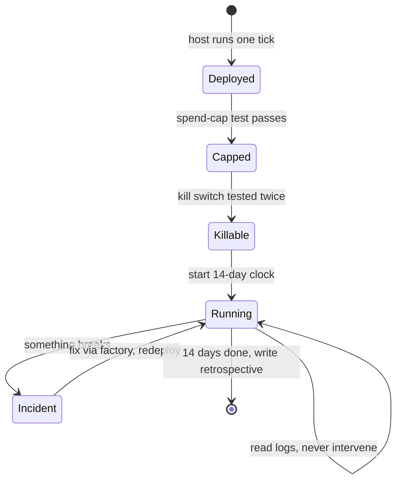

# Lab 3 — Deploy, Harden & Retrospect (incl. 14-Day Run)

**Time: ~10–12 hrs active + 14 days unattended · Difficulty: Stretch · Builds on: Lab 2 (the integrated, manually-tickable system) and Month 11**

## Objective

This lab turns the manually-tickable system from Lab 2 into a deployed, always-on, self-hardened system that runs **unattended for at least fourteen consecutive days** producing value on its cadence — and then you write the retrospective and the demo that close out the capstone. You will deploy to a real free 24/7 host, put the system on a schedule or supervised loop, wire and test the spend cap (the fourth seam), test the kill switch twice by two mechanisms, start the fourteen-day clock, diagnose and fix at least one production bug *through the factory*, and finish with a completed pillar-coverage matrix, a `RETROSPECTIVE.md`, and a fifteen-minute demo outline.

## Setup

Pick your free always-on substrate (from M11):

```bash
# Option A — Oracle Cloud Always Free VM (recommended for true 24/7):
#   provision an Always Free Ampere VM, ssh in, install uv + ollama, clone the project.
# Option B — Fly.io free allowance: deploy as a tiny always-on machine.
# Option C — a Mac you leave on, kept awake:
caffeinate -dimsu &        # keeps the Mac awake for the run
```

```bash
# On the host, confirm the system runs there exactly as it did locally:
uv run python -c "from system.tick import run_once; print(run_once())"
```

**Checkpoint:** one manual tick on the *host* (not your laptop) produces value into `out/` and writes a ledger row.
**If not:** a `ModuleNotFoundError` means the project or its `uv` env didn't come over cleanly — re-clone and `uv sync` on the host. If Ollama can't be reached, it isn't installed/running on the host (`ollama serve &` and `ollama pull` the two models there). If it ran locally but not here, you have a hidden laptop-only dependency (a hardcoded path, a local file) — that's exactly the portability bug to fix now, before autonomy.

## Background

**Recall first (from memory):** From M11, what are the two safety controls a deployed always-on agent must have before running unattended, and what does each one *do* (not just its name)? (Answer: a **spend cap** that *halts the system* when dollars-in crosses a line — not merely logs a warning — and a **kill switch** you can trigger in one action to stop it cleanly. An untested control is not a control.)

Lab 2 proved correctness by hand. Lab 3 proves *autonomy and safety*. The two non-negotiable safety controls before you start the clock are the **spend cap** (the system halts itself if dollars-in crosses your line) and the **kill switch** (you can stop it cleanly in one action). Both come from M11; here you wire them into the deployed runner and *test them*, because an untested control is not a control. Only after both pass do you start the fourteen-day clock — never run an uncapped, unkillable agent unattended, even on the free path, because a retry-storm bug burns host resources and an unkillable agent is a liability regardless of cost.

The lab is a gated timeline: each harden step must pass before the clock can start, and only then do you operate hands-off.


*Notice: the clock can only start after capped AND killable; an incident loops back through the factory (not a hand-patch); intervening at runtime would reset the clock.*

## Steps

### 1. Wire the always-on runner (P4)

`runner.py` ticks the harness on your SPEC's cadence (cron/launchd for daily digests; a supervised `while True` with sleep for continuous ones), enforcing the spend cap and honoring the kill flag before every tick.

```python
# system/runner.py
import time, os, sys
from system.tick import run_once
from system import ledger
SPEND_CAP_USD = float(os.environ.get("SPEND_CAP_USD", "5.00"))
KILL_FLAG = os.path.expanduser("~/afk.kill")

def tick_guarded():
    if os.path.exists(KILL_FLAG):
        print("KILL flag present — refusing to run."); sys.exit(0)
    if ledger.usd_in_today() >= SPEND_CAP_USD:
        print("Spend cap reached — halting."); sys.exit(0)
    return run_once()

if __name__ == "__main__":
    # supervised-loop style; for cron/launchd, schedule `tick_guarded` instead.
    while True:
        tick_guarded()
        time.sleep(int(os.environ.get("TICK_SECONDS", "14400")))  # e.g., every 4h
```

For a daily digest, prefer launchd/cron over a loop. Example launchd cadence is in your M11 notes; the guard logic (`tick_guarded`) is identical.

**Checkpoint:** `SPEND_CAP_USD=99 uv run python -m system.runner` runs a tick and then sleeps (or, under cron, fires once).
**If not:** if it exits immediately, a stale `~/afk.kill` flag is present (`rm ~/afk.kill`) or `usd_in_today()` is already over the cap. If it ticks forever with no sleep, `TICK_SECONDS` isn't being read; confirm the env var and the `time.sleep(...)` at the bottom of the loop. Fill the **P4 planned→evidence** transition in the matrix.

### 2. Test the spend cap — the fourth seam

Set the cap to a value below what one tick costs and confirm the system halts itself *before* exceeding it.

```bash
# Seed the ledger so today's spend is already over a tiny cap, then run:
SPEND_CAP_USD=0.0001 uv run python -m system.runner
# Expect: "Spend cap reached — halting." and exit, NO new value produced.
```

```python
# tests/test_seam_spendcap.py
def test_cap_halts_before_overspend(monkeypatch):
    from system import runner, ledger
    monkeypatch.setattr(ledger, "usd_in_today", lambda: 999.0)
    runner.SPEND_CAP_USD = 1.0
    import pytest
    with pytest.raises(SystemExit):
        runner.tick_guarded()
```

**Checkpoint:** the cap test passes and the manual over-cap run halts without producing value.
**If not:** if a new unit landed in `out/` despite the over-cap run, the cap check runs *after* `run_once()` instead of before it — move the `usd_in_today() >= SPEND_CAP_USD` guard to the top of `tick_guarded()`, before any work. If the test doesn't raise `SystemExit`, your halt path `return`s or `log`s instead of exiting; the cap must *halt the system*, not warn. This is the **runner↔harness seam** — fill its row in the matrix. All four seams are now green.

### 3. Test the kill switch — twice, two mechanisms

A kill switch is worthless until proven on a *running* system. Test both mechanisms and record each into `runs/kill-test-1.md` and `runs/kill-test-2.md`.

```bash
# Mechanism 1 — the kill FLAG (graceful: next tick refuses):
touch ~/afk.kill
uv run python -m system.runner       # expect: "KILL flag present — refusing to run." + exit
rm ~/afk.kill                        # re-arm
echo "flag mechanism: next tick refused, process exited 0" > runs/kill-test-1.md

# Mechanism 2 — process/host termination (hard stop of a live loop):
nohup uv run python -m system.runner > runs/live.log 2>&1 &
RUNNER_PID=$!
sleep 5
kill "$RUNNER_PID"                    # or: launchctl unload / fly machine stop
sleep 2
ps -p "$RUNNER_PID" >/dev/null && echo "STILL ALIVE — BAD" || echo "process gone — good"
echo "process mechanism: kill \$PID terminated the live runner" > runs/kill-test-2.md
```

**Checkpoint:** mechanism 1 makes the next tick refuse to run; mechanism 2 terminates a live runner and `ps` confirms it is gone. Both `runs/kill-test-*.md` exist.
**If not:** if mechanism 1 still runs the tick, the flag check isn't *before* the work or the `KILL_FLAG` path doesn't match where you `touch`ed it. If mechanism 2 prints "STILL ALIVE," the runner spawned sub-agent children (M9) that outlived the parent — run it in its own process group and `kill -- -$PGID`, or reap children on exit (see Troubleshooting). The matrix's P4 "tested kill switch" requirement is now evidenced *twice*.

### 4. Start the fourteen-day clock

Schedule the runner for real and record Day 0.

```bash
# Cron example (daily 07:00); use launchd on macOS or fly/oracle scheduling on a VM:
( crontab -l 2>/dev/null; echo "0 7 * * * cd $PWD && SPEND_CAP_USD=5.00 /opt/homebrew/bin/uv run python -m system.runner" ) | crontab -
echo "Day 0: $(date -u +%F) — clock started" >> runs/run-log.md
```

**Checkpoint:** the schedule is installed (`crontab -l` shows it, or `launchctl list | grep afk`), and `runs/run-log.md` records Day 0.
**If not:** if `crontab -l` is empty, the install line failed silently — re-run it and check for a syntax error. If the job is listed but never fires, cron's minimal environment is the usual culprit: use absolute paths (`/opt/homebrew/bin/uv`), `cd` into the project, and redirect to a log (see Troubleshooting). From here, **read logs daily but do not intervene at runtime** — intervening resets the clock.

### 5. Operate unattended: diagnose and fix through the factory

Over the run, check `runs/live.log`, the harness trace, and the ledger each day. When something breaks — a source goes down, a feed changes shape, the host reboots, a token expires (something will) — diagnose from the trace, then fix **by editing `SPEC.md` and re-running the factory**, not by hand-patching the host. Redeploy the regenerated system and log the incident.

```markdown
# runs/run-log.md  (append daily; full entry on incident days)
Day 6: source #14 returned 503; triage produced 0 candidates from it.
  Trace: runs/2026-06-0X/trace.jsonl — fetch(source14) raised, caught, tick continued.
  Fix: updated SPEC.md guardrail table to mark source14 optional + added a backup feed;
       re-ran `uv run factory build --spec SPEC.md ...`; redeployed. Factory run: runs/build-day6.md
  Result: Day 7 digest complete with backup feed. No value lost; degraded gracefully.
```

**Checkpoint:** at least one real incident is recorded with: the trace that diagnosed it, a fix made *through the factory* (linked factory run), and confirmation the system recovered.
**If not:** if nothing has broken by the second week, you aren't looking closely — a source rotated, a token neared expiry, or a tick ran long; grep the traces for caught exceptions and degraded ticks. If you were *tempted* to SSH in and hand-edit the live file, stop: that kills the factory↔system seam. Reproduce the fix by editing `SPEC.md`, re-running the factory, and redeploying — that path *is* the evidence the retrospective requires.

### 6. Close the run: total the ledger and complete the matrix

After ≥14 consecutive days, total the ledger and fill every remaining cell of `pillar-coverage-matrix.md` with file/line evidence and the green seam test for each pillar.

```bash
sqlite3 ledger.sqlite \
 "SELECT count(*) ticks, round(sum(usd_in),4) usd_in, round(sum(value_usd),2) value_out
  FROM ledger WHERE ts >= '2026-06-01'"
```

**Checkpoint:** the matrix has evidence and a proving test in **every row for all five pillars**, and you have the run's totals: ticks completed, dollars-in, value-out, and the weekly ratios.
**If not:** if a matrix cell still says "Lab 3" or "TBD", that pillar lacks proof — point it at a real file:line and a passing seam test, or it counts as decorative. If the SQL returns zero ticks, your date filter doesn't match the ledger's `ts` format; widen the range or use `ts >= date('now','-14 days')`.

### 7. Write the retrospective

Create `RETROSPECTIVE.md` with the four required sections.

```markdown
# AFK Value Generator — Retrospective

## Architecture (how the five pillars composed)
<The rings, the seams, and which one surprised you in production.>

## Production bugs (what broke unattended and how I fixed it)
<Each incident: symptom → trace → root cause → fix through the factory → outcome.
 Include the graceful-degradation event from a guardrail or fallback firing.>

## Dollars spent vs value captured
- Ran on: <free path / paid path / mixed>
- 14-day dollars-in: $<X>  (free path: $0.00, stated plainly)
- 14-day value-out: <units> ≈ $<Y> at <rate, cited from SPEC>
- Weekly ratios: wk1 <…>, wk2 <…>
- The call: would I run this on the free or paid path in production, and why?
  <What a paid synthesis model would have cost, and whether it'd be worth it.>

## Roadmap (what I'd build next)
<Next 1–3 things: more sources, tighter validator, a second value stream, etc.>
```

**Checkpoint:** all four sections are filled, the dollars-vs-value section states which path ran and makes a defensible production call, and the bugs section traces at least one real incident.
**If not:** if the dollars-vs-value call reads "it's free so free is best," it's incomplete — state what a paid synthesis model *would* have cost per day and why the quality/cost tradeoff does or doesn't justify it. If the bugs section has no incident, you skipped the Step 5 evidence; go find and trace one before writing this.

### 8. Prepare the fifteen-minute demo

Write `DEMO.md` — the talk outline you can deliver live. Target exactly fifteen minutes.

```markdown
# 15-Minute Capstone Demo

1. (1m) The problem & the value, in one sentence. Who'd notice if it stopped.
2. (2m) LIVE: trigger one tick; show a unit of value land in out/. The glance test.
3. (4m) The five rings — walk ARCHITECTURE.md; for each pillar, point at the matrix
        evidence and say what it buys. Name the four seams.
4. (3m) LIVE hardening proof: break the primary model → fallback fires; set cap tiny →
        system halts; touch the kill flag → next tick refuses. (Pre-stage these.)
5. (2m) The numbers: 14-day ticks, dollars-in vs value-out, the ratio, the path call.
6. (2m) The best production bug: what broke, the trace, the fix through the factory.
7. (1m) The closing line: "I no longer use AI — I deploy AI that runs without me."
        + the one-command kill, on screen.
```

**Checkpoint:** the outline fits fifteen minutes, includes at least one *live* value-production moment and at least one *live* hardening proof, and ends on the behavioral definition of done.
**If not:** if you can't fit it in fifteen minutes, you're explaining how each pillar *works* instead of pointing at the matrix and saying what it *buys* — cut the how, keep the payoff. If you have no live moment, pre-stage one (a recorded tick won't land the same): rehearse breaking the primary model so fallback fires, or touching the kill flag so the next tick refuses.

## Definition of Done

- The system is deployed on a real free 24/7 host and ran **unattended ≥14 consecutive days** producing correct value on cadence (`runs/run-log.md` spans the window).
- The runner enforces a **spend cap** (fourth seam test green) and exposes a **kill switch tested twice by two mechanisms** (`runs/kill-test-1.md`, `runs/kill-test-2.md`).
- At least one **production bug** was diagnosed from a trace and fixed **through the factory** (linked factory run), with graceful degradation evidenced.
- `pillar-coverage-matrix.md` is **complete** — evidence and a proving test in every row for all five pillars; all four seam tests pass.
- The **cost/value ledger** totals are computed; weekly ratios reported.
- `RETROSPECTIVE.md` (four sections) and `DEMO.md` (fifteen-minute outline) exist.
- Self-verify:
  ```bash
  uv run pytest tests/ -q \
    && test -s runs/kill-test-1.md && test -s runs/kill-test-2.md \
    && test -s RETROSPECTIVE.md && test -s DEMO.md \
    && grep -c "Day" runs/run-log.md \
    && sqlite3 ledger.sqlite "SELECT count(*) FROM ledger" \
    && echo "Lab 3 / Capstone done"
  ```

**Self-explain:** in one sentence, why must the kill switch be tested by *two* independent mechanisms rather than one — what failure mode does each catch that the other misses?

## Stretch Goals

- Add a tiny health-check: if no value was produced in N ticks, the runner writes an alert to `out/ALERT.txt` (a watchdog on your watchdog) — so silent failure is visible without watching.
- Run both a free-path week and a paid-path week and put the real ratio comparison in the retrospective, then defend the production choice with numbers.
- Add a `status` command that prints today's ledger row, the last tick's trace summary, and the kill/cap state — your one-glance operator dashboard.
- Survive a deliberate adversarial event (rename a source, revoke the paid key mid-run) and show in the trace that a guardrail or fallback absorbed it without lost value.

## Troubleshooting

- **Cron job silently never runs.** Cron has a minimal environment — use absolute paths (`/opt/homebrew/bin/uv`), `cd` into the project, and redirect output to a log. Check the log and `grep CRON /var/log/system.log` (or the VM's syslog).
- **Mac sleeps and the clock breaks.** Without `caffeinate -dimsu`, a closed-lid Mac suspends cron/launchd. For a true 14-day run, prefer the Oracle/Fly VM; reserve the Mac path for when the lid stays open and power is connected.
- **Kill mechanism 2 leaves a zombie or child.** If the runner spawns sub-agent subprocesses (M9), killing the parent may orphan children. Run the runner in its own process group and kill the group (`kill -- -$PGID`), or have `tick_guarded` reap children on exit.
- **Spend cap "works" but never actually counted dollars.** On the $0 path `usd_in` is 0, so the cap never triggers naturally. Test it by seeding `usd_in_today()` high (Step 2) — proving the *mechanism*, which is what the rubric grades.
- **You intervened at runtime and aren't sure the clock counts.** If you re-triggered a tick or fed inputs by hand, that day doesn't count as unattended. Note it honestly in the run log and extend the window — the rubric wants 14 *consecutive unattended* days, and honesty here is part of the skill.
- **The factory re-run on a production fix clobbers host-only config.** Keep host config (the kill-flag path, cap value, schedule) in environment variables, not in code the factory regenerates — that's the Twelve-Factor lesson, and it keeps regeneration safe.
